# Claude Code 使用手册

> 来源：[https://t16jzwqrzjx.feishu.cn/docx/RiP6dxBNCoiERExpBWLcyZUsnym](https://t16jzwqrzjx.feishu.cn/docx/RiP6dxBNCoiERExpBWLcyZUsnym)

# 安装和启动Claude Code

本章将带你完成从安装到启动Claude Code，只需几分钟，你就能体验到 AI 编程的魅力。

## Claude Code 四种使用方案

方案一：官方正版

*   优点：

*   功能最全： 所有功能都能完美使用，体验最完整。

*   缺点：

*   网络要求高： 国内用户连接官方服务，往往需要解决网络问题。

*   套餐最好100刀起：20刀套餐不能使用opus4模型，跑复杂项目半个小时消耗到顶，需要等待额度恢复。

* * *

方案二：Claude Code + Kimi V2/智谱 GLM4.5

“平替”方案，通过修改环境变量，将 Claude Code 的后端对接到 Kimi 的 V2 模型。

*   优点：

*   配置简单： 只需设置几个环境变量，无需修改代码，非常省事。

kimiV2配置：

```
export ANTHROPIC_BASE_URL="https://api.kimi.com/v1/anthropic"
export ANTHROPIC_API_KEY="sk-your-kimi-key"

# 然后再启动 claude
claude
```

智谱GLM4.5配置：

```
export ANTHROPIC_BASE_URL=https://open.bigmodel.cn/api/anthropic
export ANTHROPIC_AUTH_TOKEN="your bigmodel API keys"

# 然后再启动 claude
claude
```

*   功能兼容性好： 大部分核心功能（如 IDE 集成、代码修改、Git 操作）都能正常使用。

*   缺点：

*   Plan 模式不可用： Claude Code的计划模式无法使用。

*   模型能力差异：测试下来约claude4模型70%的开发水平。

*   使用成本： Kimi 开发者平台充值50块才可使用，复杂项目消耗较大。

* * *

方案三：Claude Code + 镜像站

市面上有一些第三方服务商，他们使用自己的高额度官方账户搭建了“镜像站”，用户可以通过他们的中转来使用 Claude Code。

*   优点：

*   开箱即用： 配置简单，安装好登录即可使用。

*   网络友好： 解决了直接连接官方的网络问题。

*   缺点：

*   稳定性存在风险：镜像站的200刀账户有可能被封掉，会存在不稳定的情况。

* * *

方案四：魔改源码 + 任意 API

*   优点：

*   极致的灵活性： 你可以接入任何厂商的 API，比如 GPT-4、Gemini、kimi、deepseek，来测试不同模型在 Claude Code 里的表现。

*   缺点：

*   非常麻烦： 需要你有一定的编程和调试能力，愿意花时间去“折腾”源码。

## 安装Claude Code

### 打开终端

我们需要先找到并打开一个名为“终端”（Terminal）的工具，我们后续的所有指令，都是通过它来施展的。

1.  Windows 用户：

1.  同时按下键盘上的 Win + R 键，打开“运行”窗口。

1.  输入 powershell 并按回车，进入PowerShell 窗口。

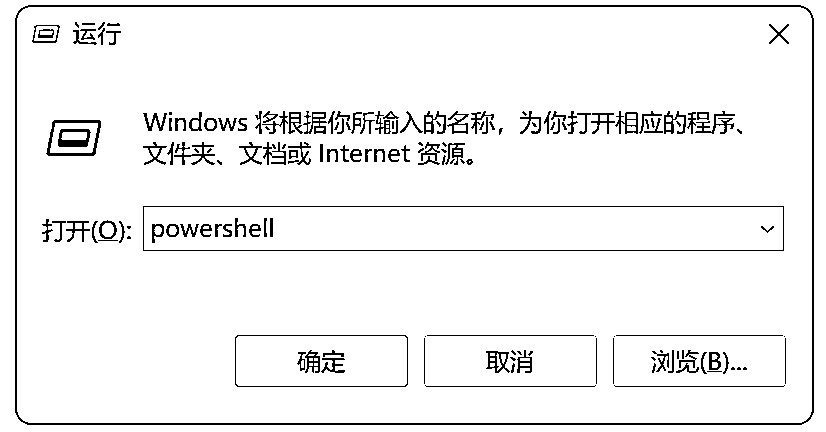

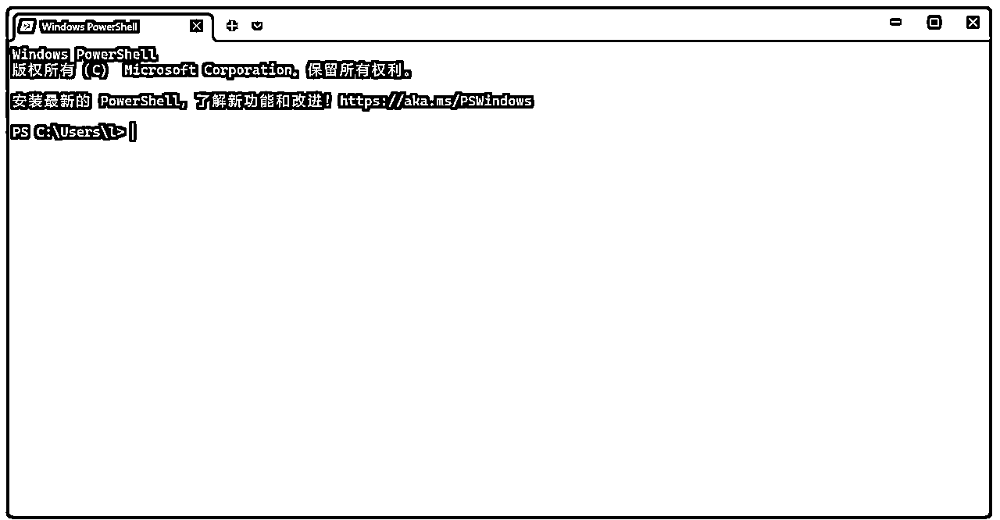

1.  苹果macOS 用户：

1.  同时按下键盘上的 Command (⌘) + 空格键，屏幕中央会出现一个搜索框。

1.  输入 Terminal。

1.  在搜索结果中，点击 “终端”进入。

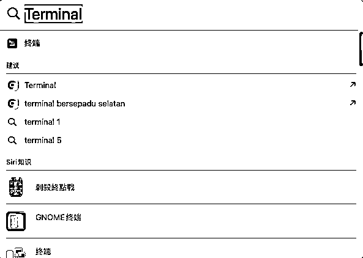

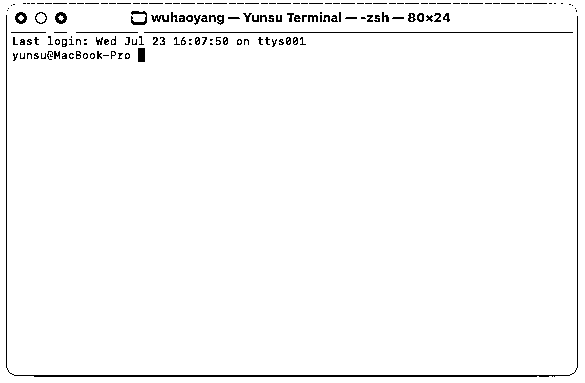

### 安装地基：Node.js

Claude Code 需要在一个叫做 Node.js 的“软件运行平台”上运行。在安装 Claude Code 本体之前，我们必须先确保这个平台已经就绪。

1.  检查版本

打开你刚刚启动的终端，输入以下命令并回车：

```
node -v
```

1.  判断结果

*   如果终端显示的版本号大于或等于v18.x.x，例如 v22.17.0，那么恭喜你，你的环境已就绪，请直接跳到 1.3 节。

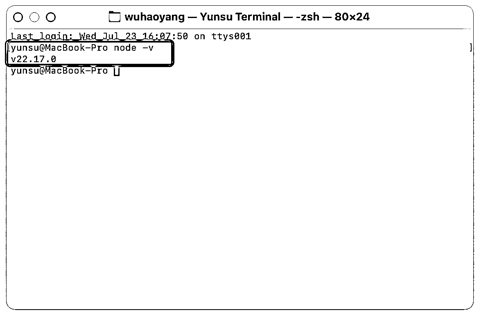

*   如果提示 command not found (命令未找到) 或版本号低于 v18**，请按照下面的步骤进行安装。

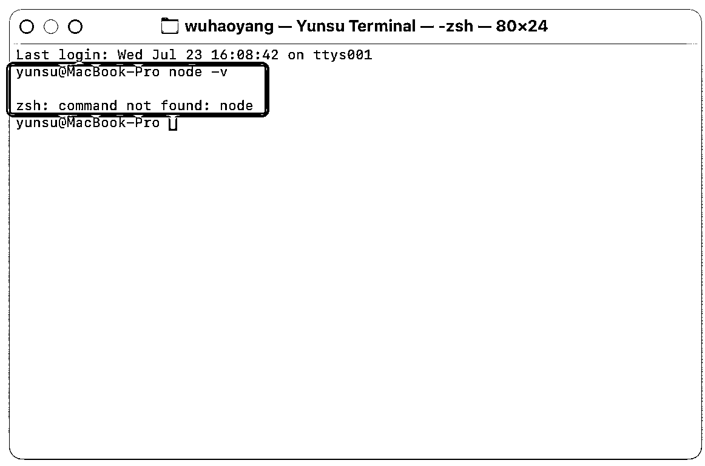

1.  开始安装

1.  访问官网： 打开浏览器，进入 Node.js 官方网站：https://nodejs.org/

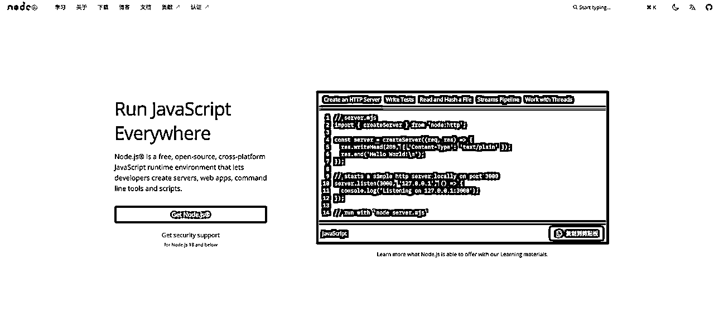

1.  下载安装包： 点击“GET Node js”按钮，然后下载安装包进行安装即可，请选择带有（LTS）标识的安装包。

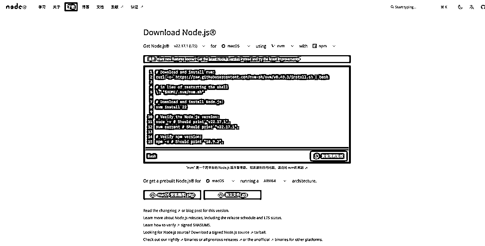

1.  运行安装程序： 下载完成后，双击文件，像安装普通软件一样，一路点击“下一步”或“继续”即可，无需修改任何默认设置。

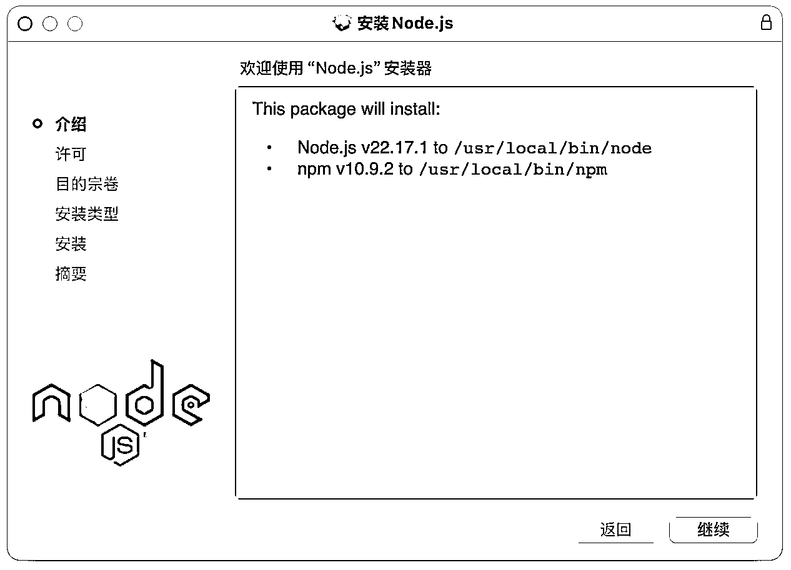

1.  验证安装：

*   完全关闭并重新打开你的终端（这一步非常重要！！！）

*   再次输入 node -v 并回车。

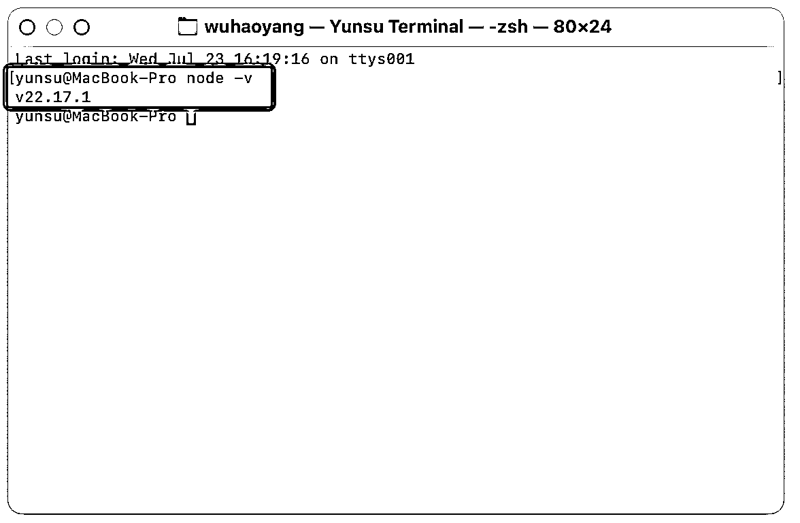

*   此时，你应该能看到一个 v18 或更高的版本号，表示地基已成功搭建。

### 安装Claude Code

1.  执行安装命令

终端中，输入以下这行命令，然后按下回车。

```
npm install -g @anthropic-ai/claude-code
```

1.  耐心等待

安装过程会从网络下载文件，根据你的网速，可能需要几十秒到几分钟不等。当终端停止滚动，并回到你熟悉的命令提示符时，就代表安装成功了。


如果遇到问题则可以把终端显示的内容发给chatgpt，让ChatGPT帮忙看看问题出错在哪：

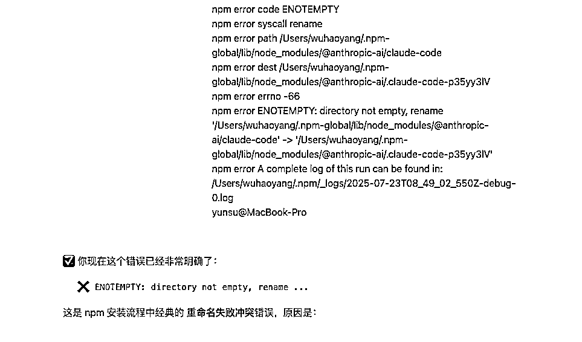

1.  验证安装

为了确保 Claude Code 已经正确安装，我们可以输入它的“帮助”命令来验证一下：

```
claude -h
```

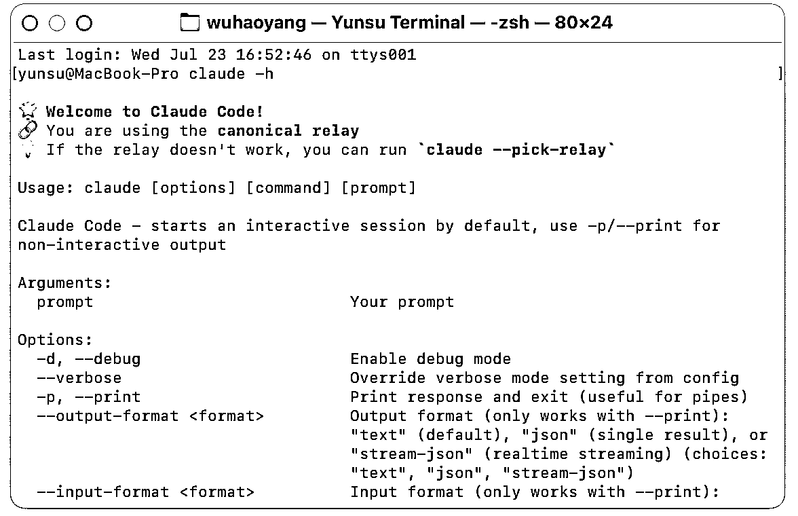

如果你看到了一长串关于 Claude Code 的用法和命令说明，而不是 command not found，那么恭喜你！你的 AI 编程伙伴已经成功入驻你的电脑。

## 启动Claude Code

在启动 Claude Code 之前，我们必须先做一件事：告诉终端，我们的项目文件夹在哪里。

1.  输入 cd

*   打开终端，手动输入 cd 这两个字母，然后按一下空格键。

*   输入完后，千万不要按回车！！！

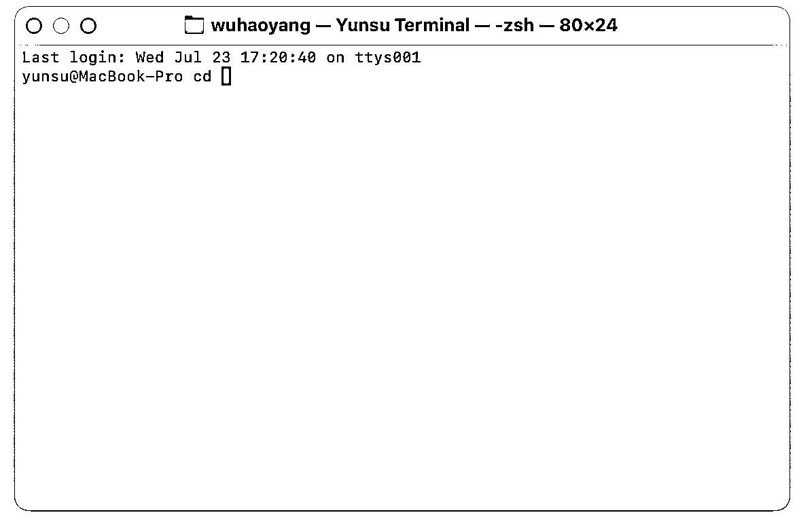

1.  找到你的项目文件夹

*   在你的桌面或文件管理器（Windows 的“文件资源管理器”，macOS 的“访达”）中，找到你存放代码的项目文件夹。你只需要能看到这个文件夹的图标就行。

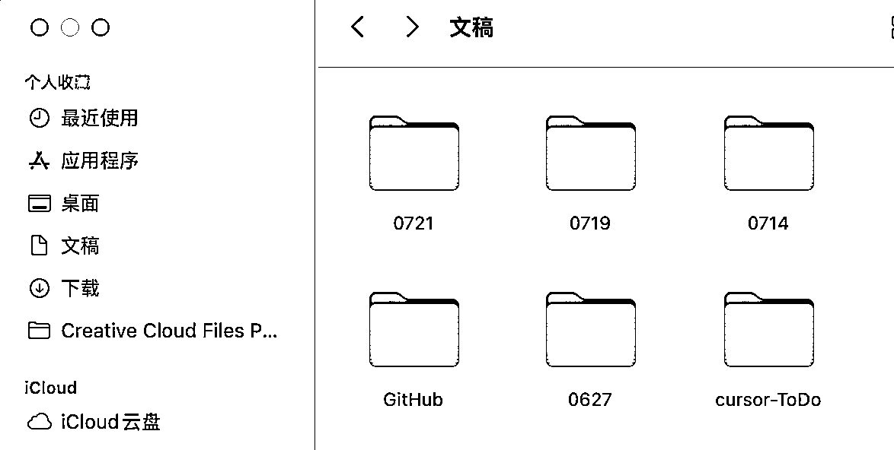

1.  拖拽到终端

*   把文件夹拖拽到终端里即可。

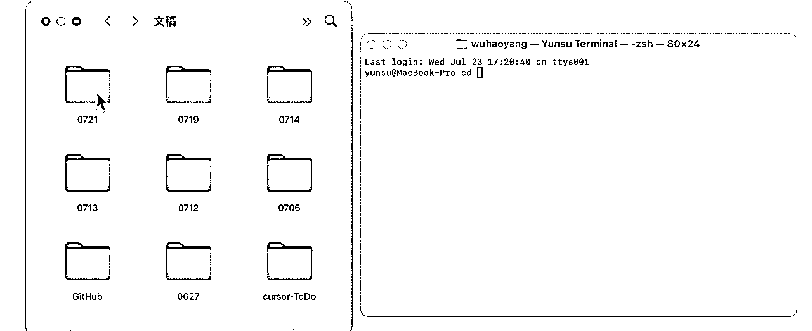

*   你会发现，在你输入的 cd 后面，自动出现了一长串代表文件夹位置的文本。

*   按下回车进入文件夹。

1.  启动Cluade Code

*   在终端里输入 claude 并回车

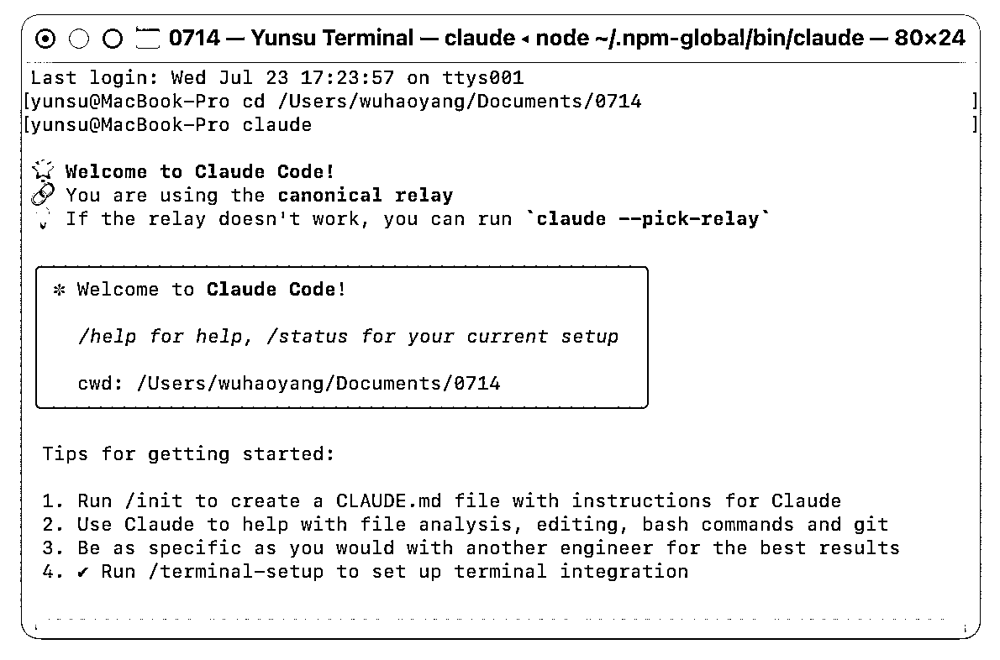

# Claude Code指令速查

本章汇总了Claude Code的各种指令，方便你了解如何使用Claude Code

## 核心对话控制

本章的指令是你与 Claude 进行流畅对话的基石。它们负责会话的“启、承、转、合”，帮助你管理上下文，控制聊天流程。

### 1\. /help - 你的随身说明书

*   一句话概括： 忘记指令时，随时呼叫它。

*   功能详解： 输入 /help 并回车，Claude Code 会立即列出所有可用的斜杠指令及其简要说明。这是最可靠的“第一帮助”。

*   使用场景：

*   刚上手，想探索 Claude 的所有能力。

*   想用某个功能，但忘了具体的指令。

*   示例：

```
> /help

# Claude会输出所有可用指令的列表：
# /add-dir - Add a new working directory
# /clear   - Clear conversation history and free up context
# /compact - Clear conversation history but keep a summary in context.
# ...
```

### 2\. /clear - 彻底清空记忆

*   一句话概括： 擦掉当前的“聊天记录”，开始一个全新的话题。

*   功能详解： 这个指令会彻底清除当前会话的所有上下文。执行后，Claude Code 会完全忘记你们刚才聊过的一切，就像重新启动了一次一样。

*   使用场景：

*   当你需要切换到一个完全不相关的任务时。

*   对话变得混乱，或者 AI 的回答开始跑偏，想重新开始。

*   示例：

```
# 你正在和Claude讨论一个CSS问题
> 把这个按钮的边框改成圆角吧。

> /clear

# (终端屏幕被清空，就像刚启动一样)
# 现在你可以开始一个全新的任务
> 帮我解释一下什么是 "git rebase"
```

### 3\. /compact - 智能总结，轻装上阵

*   一句话概括： 让 Claude 自己做个“会议纪要”，然后忘掉细节。

*   功能详解： 这是 /clear 的智能版。它会先让 AI 把当前对话的**核心内容总结**一下，保留这个总结，然后清除掉具体的对话细节。这能在为新任务释放上下文空间的同时，保留关键信息。你还可以用 /compact [你的总结要求] 来指导它如何总结。

*   使用场景：

*   一个长任务的第一阶段已完成，即将进入第二阶段。

*   感觉上下文快满了（有时 AI 会提示），但又不想完全失去当前进度。

*   示例：

```
# 你和Claude刚刚确定了一个新功能的设计方案
> 好的，我们就用Redis缓存热门数据，缓存时间设定为5分钟。

# 现在要开始写代码了，先压缩一下上下文
> /compact 

# Claude会输出一段总结：
# 好的，我已将我们的讨论压缩。要点：我们将为热门数据添加一个缓存层，
# 使用Redis实现，缓存有效期为5分钟。
# 现在，我们可以继续了。

# 此时，对话的细节被清除了，但核心结论被保留了下来。
> 现在，帮我编写实现这个Redis缓存的Python代码。
```

### 4\. /resume - 读取“上次的存档”

*   一句话概括： 加载之前的聊天记录，继续上次没完成的工作。

*   功能详解： 使用 /resume 指令，它会弹出一个可交互的列表，让你选择要恢复哪一次的对话。

*   提示： 在终端启动时使用 claude -c 或 claude --continue 可以快速恢复**最近一次**的会话。

*   使用场景：

*   昨天有个功能没做完，今天想接着干。

*   不小心关掉了终端窗口，想找回刚才的对话。

*   示例：

```
> /resume

# 终端会出现一个可交互的列表，用方向键 ↑↓ 选择，回车确认
# 
# Select a conversation to resume:
# > 1\. 2025-07-08 10:30 - "修复登录页面的CSS Bug" (5 messages)
#   2\. 2025-07-07 15:00 - "为用户模块添加数据库迁移" (28 messages)
#   3\. 2025-07-07 09:12 - "这个项目是做什么的？" (12 messages)
# 
# (按回车后，选中的对话历史会完整加载进来)
```

### 5\. /exit (或 /quit) - 安全下班

*   一句话概括： 结束会话，退出 Claude Code。

*   功能详解： 执行此指令会完全终止 Claude Code 的会话，让你回到常规的终端。也可以按 Ctrl+D 快捷键达到同样效果。

*   使用场景：

*   今天的工作结束了。

*   需要暂时离开，关闭 AI 会话。

*   示例：

```
> /exit

# (Claude Code 程序退出)
# 你回到了你电脑的常规命令行
your-computer:~/your-project$ 
```

## 状态与诊断

如果说第一章的指令是油门和刹车，那本章的指令就是你的“仪表盘”和“车载诊断系统”。它们让你能随时查看 Claude 的“健康状况”、“油耗”和“系统日志”，做到心中有数。

### 1\. /status - AI 的实时“体检报告”

*   一句话概括： 快速查看 Claude 当前的所有核心状态信息。

*   功能详解： 这是最重要的诊断指令之一。它会提供一个全面的快照，包括你正在使用的 Claude Code 版本、AI 模型、登录账户、API 连接性以及各类工具（如IDE集成）的当前状态。

*   使用场景：

*   感觉 AI 的响应变慢了，想看看是不是网络问题。

*   不确定当前用的是不是最强的 Opus 模型。

*   想确认 IDE 集成是否已经成功连接。

*   示例：

```
> /status

# Claude会输出一份详细的状态报告：
# Version: 1.7.0
# Model: claude-3-sonnet-20240229
# Account: user-xxxx@anthropic.com
# 
# API Connectivity:
#   - Anthropic API: Connected
# 
# Tool Statuses:
#   - IDE Integration (VSCode): Connected
#   - MCP Servers: 0 connected
```

### 2\. /cost - 查看本次“消费账单”

*   一句话概括： 看看当前这次聊天花了多少钱。

*   功能详解： 这个指令会显示当前会话（从启动或上次/clear算起）的总 token 消耗量，并估算出对应的美金费用。这是一个非常有用的成本控制工具。

*   注意： 它只计算当前会话，退出或使用 /clear 后会重置。

*   使用场景：

*   在进行了一个非常复杂、多轮的对话后，想了解其成本。

*   想对不同类型任务的开销有个大致概念。

*   示例：

```
> /cost

# Claude会输出本次会话的成本统计：
# Session Cost:
#   - Input Tokens: 12,345
#   - Output Tokens: 8,765
#   - Total Cost: ~$0.05 USD
```

### 3\. /doctor - 一键“系统自检”

*   一句话概括： 感觉 Claude Code “病了”？让它自己检查一下。

*   功能详解： 如果说 /status 是日常体检，那 /doctor 就是深度全身扫描。它会检查 Claude Code 的安装环境是否健康，包括文件权限、依赖项、路径配置等。当遇到奇怪的、无法解释的错误时，它能帮你定位问题根源。

*   使用场景：

*   Claude Code 启动失败或频繁崩溃。

*   某些指令（如文件操作）执行时总是报错。

*   系统环境（如 Node.js 版本）发生变化后，想确认 Claude Code 是否兼容。

*   示例：

```
> /doctor

# Claude会进行一系列的检查并输出结果：
# ✅ Node.js version check passed.
# ✅ Global npm package permissions look good.
# ✅ Configuration files found and readable.
# ✅ API connection successful.
# 
# All systems healthy!
```

### 4\. /release-notes - 获取“版本更新日志”

*   一句话概括： 看看 Claude Code 最近都更新了些什么。

*   功能详解： 这个指令会显示最新的版本更新日志。让你能快速了解到新版本中修复了哪些 Bug、增加了哪些新功能或新指令。

*   使用场景：

*   看到 Claude Code 自动更新的提示，想知道更新了什么。

*   想了解某个你期待已久的功能是否已经发布。

*   示例：

```
> /release-notes

# Claude会显示最新的更新日志：
# # Version 1.7.0 (2025-07-08)
# 
# ## ✨ New Features
# - Added the /pr-comments command to fetch GitHub PR comments.
# 
# ## 🐛 Bug Fixes
# - Fixed an issue where /compact would fail on very long conversations.
#
```

## AI 记忆与上下文管理

普通聊天机器人的记忆像金鱼，关掉窗口就忘得一干二净。Claude Code 的强大之处在于，它拥有可配置的“长期记忆”和可扩展的“视野”。本章的指令就是你用来塑造和管理 AI 记忆的工具。

### 1\. /memory - 查看和编辑 AI 的“长期记忆”

*   一句话概括： 打开 AI 的“记事本”，告诉它关于这个项目的“铁律”。

*   功能详解： 每个项目都可以有一个 CLAUDE.md 文件，这就是 Claude 的专属“项目记忆”。里面可以记录项目的编码规范、常用命令、架构设计等。/memory 指令会用你电脑上默认的文本编辑器打开这个文件，让你随时可以查看、修改和补充。

*   使用场景：

*   你发现 Claude 总是写出不符合团队风格的代码，你想把代码规范（比如“必须使用4个空格缩进”）写进它的记忆里。

*   项目里有一些非常重要的、需要时刻遵守的规则（比如“绝不能直接操作生产数据库”），你要把它刻进 AI 的脑子里。

*   示例：

```
> /memory

# (这会调用你的系统编辑器，比如 VS Code 或 Vim, 打开 CLAUDE.md 文件)
#
# 你可以在文件里写入：
# ---
# # 本项目编码规范
# 
# - 所有 Python 函数都必须有类型提示 (Type Hints)。
# - commit message 必须遵循 Conventional Commits 格式。
# - 运行测试的命令是 `pytest`。
# ---
# (保存并关闭文件后，Claude 在后续对话中就会遵循这些规则)
```

### 2\. /init - 一键生成“记忆模板”

*   一句话概括： 让 AI 自己分析项目，并自动生成一份“项目记忆”草稿。

*   功能详解： 如果你的项目还没有 CLAUDE.md 文件，这个指令就是你的救星。它会命令 Claude Code 分析整个项目，然后自动生成一个包含项目概述、技术栈、关键文件等信息的 CLAUDE.md 文件。这是一个绝佳的起点。

*   使用场景：

*   为一个全新的或陌生的项目首次配置 Claude Code。

*   想快速为项目创建一个基础的、可供团队共享的 AI 指导文件。

*   示例：

```
# 在一个新项目中
> /init

# Claude会分析一会，然后告诉你：
# ✅ Successfully created a CLAUDE.md file for this project.
# It includes a project overview, file structure, and key dependencies.
# I recommend committing this file to your repository for your team to use.
# You can edit it any time with the /memory command.
```

### 3\. /add-dir - 拓宽 AI 的“视野”

*   一句话概括： 让 Claude 看到当前项目文件夹之外的文件。

*   功能详解： 默认情况下，Claude Code 只能访问你启动它时所在的文件夹及其子文件夹。/add-dir 指令可以临时授权它访问你电脑上的其他指定文件夹。这在需要跨项目参考代码时非常有用。

*   注意： 这个授权只在当前会话中有效。退出或 /clear 后会失效。

*   使用场景：

*   你正在开发一个前端项目，但需要参考一个位于完全不同目录下的后端项目的 API 定义。

*   你想让 Claude 比较两个不相关的项目文件夹的异同。

*   示例：

```
# 你当前在 /path/to/frontend-project
> /add-dir ../backend-project/src/api

# Claude会回应：
# ✅ Directory '../backend-project/src/api' has been added to the context.
# I can now access files within it for this session.

# 现在你可以让它读取那个文件夹里的内容了
> 帮我看一下 `../backend-project/src/api/user.py` 文件里定义了哪些用户相关的接口。
```

## 配置与权限

掌握了本章的指令，你将从一个普通使用者晋升为 Claude Code 的“配置大师”。你可以决定它的核心引擎、行为模式和安全边界，让它成为一个既强大又安全可靠的伙伴。

### 1\. /config - 打开万能“设置面板”

*   一句话概括： 一个可交互的菜单，用来调整 Claude 的各种杂项设置。

*   功能详解： /config 会打开一个全屏的交互式菜单，你可以在这里修改很多配置，比如：

*   主题颜色： 让 Claude 的界面颜色匹配你的终端主题。

*   默认模型： 设定默认使用 Sonnet 还是更强大的 Opus。

*   Vim 模式： 是否默认开启 Vim 编辑模式。

*   还有很多其他高级选项。

*   使用场景：

*   感觉默认的亮色主题太刺眼，想换成暗色。

*   想让 Claude Code 每次启动时都使用特定的 AI 模型。

*   作为 Vim 用户，希望全程使用 Vim 键位进行编辑。

*   示例：

```
> /config

# 终端会进入一个全屏菜单界面，类似这样：
# 
# Claude Code Configuration
# 
# General:
#   Theme Color: [ dark | light | light-daltonized | ... ]
#   Vim Mode by default: [ true | false ]
# 
# Model:
#   Default Model: [ claude-3-sonnet-xxxx | claude-3-opus-xxxx ]
# 
# (使用方向键和回车进行选择和修改，按 Esc 退出)
```

### 2\. /permissions - 设定 AI 的“行为边界”

*   一句话概括： 定义一份规则，告诉 Claude 什么能做，什么绝对不能做。

*   功能详解： 这是 Claude Code 安全体系的核心。/permissions 会打开一个交互式面板，让你管理“允许规则”和“拒绝规则”。被允许的工具（如运行特定的 npm 命令）将不再需要你手动确认；被拒绝的工具（如 rm -rf）则永远无法执行。

*   核心理念： “拒绝”的优先级永远高于“允许”。

*   使用场景：

*   你厌倦了每次运行测试都要手动输入“y”来确认，你想把 npm test 命令加入白名单。

*   出于安全考虑，你想永久禁止 Claude 使用 curl 或 wget 等网络下载命令。

*   你想让 Claude 可以读取项目文件，但绝对禁止它修改 src/config/production.json 这个生产配置文件。

*   示例：

```
> /permissions

# 终端会进入一个权限管理界面：
# 
# Tool Permissions
# 
# Allow Rules (no approval needed):
#   - Bash(npm test)
#   - Read(src/components/**)
# 
# Deny Rules (always blocked):
#   - Bash(git push --force)
#   - Write(src/config/production.json)
# 
# (你可以通过菜单添加、编辑、删除这些规则)
```

### 3\. /model - 切换 AI 的“大脑”

*   一句话概括： 临时切换当前会话使用的 AI 模型。

*   功能详解： Claude 提供了不同的模型（如 Sonnet 和 Opus），它们在速度、智能程度和价格上有所不同。/model 指令让你可以在当前会话中临时切换模型，以适应不同的任务需求。

*   注意： 这只影响当前会话。想永久更改默认模型，请使用 /config。

*   使用场景：

*   平时用速度快的 Sonnet 模型处理日常问答，当遇到一个极其复杂的架构设计问题时，临时切换到更聪明的 Opus 模型来获取更高质量的回答。

*   想比较不同模型在同一个问题上的表现。

*   示例：

```
> /model

# Claude会列出可用的模型让你选择：
# Select a model for this session:
# > 1\. claude-3-5-sonnet-20240620 (recommended, fast)
#   2\. claude-3-opus-20240229 (most powerful)
#   3\. claude-3-haiku-20240307 (fastest)

# (选择后，本次会话的后续对话将使用新模型)
# You are now using claude-3-opus-20240229 for this session.
```

## 代码与工作流集成

一个优秀的工具，不应是孤岛。本章的指令将打通 Claude Code 与你日常开发工具链的“任督二脉”，让 AI 的能力融入你最熟悉的工作流程中，实现效率的飞跃。

### 1\. /ide - 连接你的代码编辑器

*   一句话概括： 让终端里的 Claude 和你的 VS Code / JetBrains 编辑器“心灵相通”。

*   功能详解： 这是 Claude Code 的王牌功能之一。通过在 IDE 的内置终端中启动 Claude Code，或使用 /ide 指令连接，你可以解锁一系列神奇的联动：

*   上下文共享： 你在 IDE 中选中的代码、打开的文件，Claude 都“看”得见。

*   代码变更预览： Claude 提出的代码修改，可以直接在 IDE 的“差异对比”(Diff View) 窗口中清晰预览，而不是在终端里看一堆文本。

*   错误自动捕获： IDE 发现的语法错误或警告，会自动分享给 Claude，让它能“未卜先知”地帮你修复。

*   使用场景：

*   在 VS Code 里选中一段复杂的函数，然后在内置终端的 Claude 里输入：“帮我重构这段选中的代码”。

*   Claude 提出了一大段代码修改，你想在熟悉的 Diff 视图里逐行确认，而不是在终端里费力阅读。

*   示例：

```
# (首先，强烈建议在 VS Code 或 JetBrains 的内置终端里启动 Claude Code)
# 如果你是在外部终端启动的，可以用这个指令连接：
> /ide

# Claude会尝试连接到你正在运行的编辑器：
# ✅ Successfully connected to Visual Studio Code.
# I can now see your active editor context and show diffs in the IDE.

# (连接后，当你让 Claude 修改代码时)
> 帮我把 user.ts 里的 email 字段改成可选的。

# Claude 不仅会告诉你怎么改，你的 VS Code 还会自动弹出一个 diff 预览窗口。
```

### 2\. /install-github-app - 召唤“GitHub 智能助理”

*   一句话概括： 把 Claude 的能力注入到你的 GitHub 仓库里。

*   功能详解： 这个指令会引导你完成一个一次性的安装过程，将一个名为“Claude”的 GitHub App 安装到你指定的仓库。安装后，你就可以在 Pull Request (PR) 和 Issue 的评论区里，通过 @claude 来召唤它干活。

*   使用场景：

*   在同事的 PR 评论里 @claude review this PR，让 AI 帮你做代码审查。

*   在某个 Issue 下评论 @claude please implement this feature，AI 会自动创建一个包含实现代码的新 PR。

*   示例：

```
# 在你的项目终端里运行
> /install-github-app

# Claude会引导你完成安装过程：
# This command will guide you through installing the Claude GitHub App.
# 1\. Please open this URL in your browser to install the app:
#    https://github.com/apps/claude/installations/new
# 2\. Select the repository you want to install it on.
# 3\. Once installed, I'll be ready to help in your PRs and Issues!
#
# (安装后，你就可以去 GitHub 上召唤它了)
```

### 3\. /review - 一键请求“代码审查”

*   一句话概括： 让 Claude 审查你当前所有未提交的代码改动。

*   功能详解： 在你写完代码，准备 git commit 之前，执行 /review。Claude 会自动执行 git diff，分析你所有的修改，并从代码质量、潜在 Bug、风格规范等多个角度给出详细的审查建议。

*   使用场景：

*   提交代码前的最后一道质量防线，让 AI 帮你发现自己没注意到的问题。

*   对自己的某段代码不太自信，想听听“第二意见”。

*   示例：

```
# 你刚刚修改了几个文件
> /review

# Claude会分析你的改动并给出反馈：
# Sure, I've reviewed your changes. Here are my thoughts:
# 
# ### In `src/components/Login.tsx`:
# - **Suggestion:** The `handleLogin` function has some duplicated logic.
#   You could extract the validation part into a separate helper function.
# - **Question:** I noticed you added a new state `isLoading`. Did you remember
#   to handle the UI display for this state?
# 
# ### In `api/routes.py`:
# - **Nitpick:** There's a small typo in a comment on line 42.
# 
# Overall, the logic looks solid. Addressing these points would make it even better.
```

### 4\. /pr-comments - 获取 PR 的“人类反馈”

*   一句话概括： 把 GitHub 上一个 PR 的所有评论都拉到终端里看。

*   功能详解： 当你的同事在 GitHub 上给你的 PR 提了很多评论时，你不需要在网页和代码之间来回切换。使用 /pr-comments [PR编号或URL]，Claude 会把所有评论和相关的代码片段一次性展示在终端里，让你能集中处理反馈。

*   使用场景：

*   一个 PR 收到了大量 review 意见，想在一个地方集中查看和回复。

*   想让 Claude 帮你总结收到的所有反馈，并根据这些反馈来修改代码。

*   示例：

```
# 假设你的 PR 编号是 123
> /pr-comments 123

# Claude会去拉取评论并展示：
# Fetching comments for Pull Request #123...
# 
# ---
# **User: "colleague-name"** commented on `src/utils/auth.js`:
# ```javascript
# >  const token = jwt.sign({ id: user.id }, SECRET_KEY);
# ```
# > This token doesn't have an expiration time. We should add an `expiresIn` field.
# ---
# **User: "another-colleague"** commented on `README.md`:
# > Could you add a note about the new environment variable needed for this feature?
#
# (看完后，你可以直接让 Claude 根据这些评论修改代码)
> 好的，根据第一条评论，给JWT加上24小时的过期时间。
```

## 账户与系统管理

本章的指令处理的是一些“幕后工作”。你不会每天都用它们，但在切换账户、升级或处理安装问题时，它们是不可或缺的管理工具。

### 1\. /login - 切换登录账户

*   一句话概括： 重新登录，或者换一个 Anthropic 账户。

*   功能详解： 执行 /login 会让你退出当前账户，并重新触发登录流程。这允许你切换到另一个拥有不同权限或订阅的账户。

*   使用场景：

*   你有个人和工作两个不同的 Anthropic 账户，需要在使用 Claude Code 时进行切换。

*   你的登录凭证过期或失效了，需要重新登录以刷新。

*   示例：

```
> /login

# Claude会提示你即将开始登录流程：
# You are about to log in and create a new API key.
# This will replace your existing authentication.
# 
# Please press Enter to open your browser and log in to your Anthropic account.
# (按下回车后，会打开浏览器让你完成登录)
```

### 2\. /logout - 安全登出

*   一句话概括： 退出当前账户，并删除本地的登录凭证。

*   功能详解： 这个指令会让你从 Claude Code 中登出，并清除存储在你电脑上的认证信息。登出后，如果不重新登录，你将无法使用需要 API 连接的功能。

*   使用场景：

*   你正在使用一台共享或公共电脑，用完后需要确保自己的账户信息被安全清除。

*   遇到无法解决的认证问题，想彻底清除所有认证信息后重试。

*   示例：

```
> /logout

# Claude会确认登出操作：
# Are you sure you want to log out? This will remove your local credentials. (y/N)
> y

# ✅ You have been logged out.
```

### 3\. /upgrade - 升级你的套餐

*   一句话概括： 打开浏览器，带你去升级 Claude 的订阅计划。

*   功能详解： 这是一个快捷方式指令。它会提供一个链接，引导你到 Anthropic 的官方网站去升级你的账户套餐（例如，升级到 Max 套餐以获得更高的使用限额或更强的模型）。

*   使用场景：

*   你发现当前套餐的使用额度（rate limits）不够用，想升级以获得更流畅的体验。

*   你想使用只有高级套餐才提供的 Opus 模型。

*   示例：

```
> /upgrade

# Claude会给出一个链接：
# To upgrade your plan for higher rate limits and more Opus usage,
# please visit: https://console.anthropic.com/settings/plans
```

### 4\. /migrate-installer - 迁移安装方式

*   一句话概括： 帮你把 Claude Code 的“全局安装”变成“项目内安装”。

*   功能详解： 这是一条为开发者准备的系统维护指令。通常，我们会用 npm install -g 来“全局安装” Claude Code。但在某些团队协作场景下，可能需要将它作为项目的开发依赖（devDependencies）进行“本地安装”，以统一团队成员使用的版本。这个指令就是帮你完成这个迁移过程的。

*   使用场景：

*   团队决定将 Claude Code 纳入项目的 package.json 进行版本管理。

*   示例：

```
> /migrate-installer

# Claude会解释将要发生什么，并请求确认：
# This will migrate your Claude Code installation from a global npm package
# to a local dependency in this project's package.json.
# Are you sure you want to continue? (y/N)
> y

# (迁移过程会自动执行)
# ✅ Migration complete. Claude Code is now managed in your package.json.
```

## 高级扩展与特殊模式 (Advanced & Special Modes)

欢迎来到终极宝典的最后一章。这里的指令是为高级用户和“折腾狂人”准备的。它们像赛车上的涡轮增压和可编程ECU，能让你突破 Claude Code 的默认限制，将其与外部世界连接，或者以你最喜欢的方式进行交互。

### 1\. /hooks - 设置“自动化触发器”

*   一句话概括： 在 Claude 做出特定动作**之前**或**之后**，自动执行你指定的脚本。

*   功能详解： 这是 Claude Code 最强大的自动化功能。Hooks (钩子) 允许你定义一些规则，比如“每当 Claude 修改了一个 .js 文件后，就自动运行 prettier 格式化工具”。这让你可以把团队的最佳实践固化成自动化流程。

*   使用场景：

*   自动格式化： Claude 改完代码后，自动运行 eslint --fix 或 black。

*   自定义通知： 当 Claude 需要你确认时，除了终端提示，还通过一个自定义脚本给你发一条飞书或 Slack 消息。

*   安全扫描： 在 Claude 提交代码前，自动运行一个秘密扫描工具。

*   示例：

```
> /hooks

# 这会打开一个交互式菜单，让你为不同的“事件”（如 PreToolUse, PostToolUse）
# 设置匹配规则（Matcher）和要执行的命令（Hook）。
#
# 例如，你可以设置一个 Hook：
# Event: PostToolUse (工具使用后)
# Matcher: Write|Edit (匹配写入或编辑工具)
# Hook Command: npx prettier --write $(jq -r .tool_input.file_path)
# (这个例子会在 Claude 写入或编辑文件后，自动对该文件运行 Prettier)
```

### 2\. /mcp - 连接“外部数据大脑”

*   一句话概括： 通过“模型上下文协议”(Model Context Protocol)，让 Claude 连接外部工具或数据源。

*   功能详解： 如果说 Hooks 是行为上的扩展，那么 MCP 就是**能力和知识**上的扩展。通过 MCP，你可以把外部服务（如公司的 Jira、代码库、数据库等）封装成 Claude 能理解的工具。这让 Claude 不仅能看懂你的项目文件，还能查询你的任务单、数据库表结构等。

*   使用场景：

*   连接一个数据库 MCP 服务器，然后你可以直接问：“帮我查一下 users 表里最近注册的5个用户”。

*   连接公司的 Jira 服务器，然后可以命令：“把编号为 TICKET-123 的任务标记为完成”。

*   示例：

```
# (首先需要通过命令行配置好 MCP 服务器)
> /mcp

# 这会打开一个管理面板，显示已连接的 MCP 服务器及其状态
# 
# MCP Server Status:
#   - a_local_postgres_db: ✅ Connected
#   - company_jira_api: ⚠️ Requires Authentication
#
# (连接成功后，你就可以使用这些外部工具了)
> @a_local_postgres_db:schema://public.users 帮我看看这张表的结构
```

### 3\. /vim - 开启“极客编辑模式”

*   一句话概括： 让输入框支持 Vim 风格的编辑。

*   功能详解： 对于 Vim 用户来说，这是个福音。执行 /vim 后，Claude Code 的输入框就会在 INSERT（插入）和 NORMAL（普通）模式之间切换。你可以使用熟悉的 h/j/k/l 进行移动，用 dd 删除行，用 cw 修改单词等等。

*   提示： 想让它成为默认模式，请使用 /config 进行设置。

*   使用场景：

*   你是一名 Vim 重度用户，习惯于 Vim 的高效文本编辑方式。

*   你需要输入或修改一段很长的、多行的指令或代码片段，使用 Vim 模式比普通输入更方便。

*   示例：

```
> /vim

# Claude会提示你模式已切换
# ✅ Vim mode enabled. Press 'i' to insert, 'Esc' to exit insert mode.

# (现在你的输入框就变成了一个迷你 Vim 编辑器)
```

# Subagents 使用说明手册

本章汇总了Claude Code最新更新的Subagents能力，方便你快速掌握它~

欢迎来到 Subagents 的世界！把它想象成一个能让你“组建自己的 AI 专家团队”的超能力。本手册将带你从零开始，一步步掌握这个强大的功能。

## 核心概念：什么是 Subagent？

*   一句话概括： 如果说主 Claude 是你的“全能项目经理”，那 Subagent 就是你为项目聘请的、只做一件事的“顶尖专家”（比如电路专家、水管专家）。

*   功能详解： Subagent 是一个预先配置好的、更专业的 AI 人格。主 Claude 在遇到它不擅长或有“专家”能做得更好的特定任务时，会把工作“外包”给这个专家。每个专家都有自己独立的“记忆”（上下文）、专用的“工具箱”和一本详细的“工作手册”（系统提示），这让它在自己的领域里做得又快又好。

*   使用场景：

*   当你有重复性的、专业性强的任务时（如：审查代码、修复 Bug、运行测试）。

*   想让 AI 自动完成一套固定的工作流程。

## 为什么要用它？

1.  让主对话保持干净： 你和“电路专家”讨论的所有电线型号，都不会出现在“项目总看板”上，让主对话始终聚焦于核心目标。

1.  工作质量更高： 你可以给“电路专家”一本厚厚的《电气安全规范》，让他严格遵守。专家只做专事，成功率自然更高。

1.  可重复使用： 这次项目培养的专家，下次可以直接“返聘”，甚至可以“借”给同事用，无需重新培训。

## 核心指令 /agents

*   一句话概括： 你的 AI 团队“人力资源部”总入口。

*   功能详解： 这是管理你所有“专家”的中央控制台。通过它，你可以：

*   查看：列出你当前项目拥有和可用的所有专家。

*   创建：开始“招聘”流程，定义一位全新的专家。

*   编辑：修改一位现有专家的“工作手册”或“工具权限”。

*   删除：解雇不再需要的专家。

*   使用场景：

*   想看看自己手下有哪些 AI 专家。

*   准备招聘一位新专家来帮你处理特定任务。

*   想更新某个专家的技能或权限。

*   示例：

```
> /agents
```

```
# Claude会列出你当前的专家团队：
#
# Agents
# 2 agents
#
# > Create new agent
#
# Project agents (.claude/agents)
# code-reviewer
#
# Built-in agents (always available)
# general-purpose
```

## 实践教程：创建你的第一个 Subagent

让我们来“招聘”一个最常用的代码审查员专家。

1.  打开“人资部”大门：在输入框里输入 /agents 并按回车。

1.  开始招聘流程：用方向键选中 Create new agent，按回车。

1.  选择办公地点：默认会选中 1\. Project (...)，直接按回车。这表示这个专家只为当前这个项目工作。

1.  选择创建方式：默认会选中 1\. Generate with Claude (recommended)，直接按回车。这是让AI帮你写“招聘启事”，最简单。

1.  描述你的专家 (最关键的一步)：

*   它会提示你 Describe what this agent should do...

*   你只需要在这个输入框里，用大白话写下你的需求。比如，**直接复制粘贴**下面这句话：

一个代码审查员，帮我检查代码里的BUG和代码风格问题。在我写完新代码之后，就应该使用它。

*   然后按回车。

1.  一路确认到底：接下来，它会让你“选择工具”、“选择颜色”、“确认并保存”。对于新手，你**完全不需要做任何修改**，只需要**连续按三次“回车键”**，接受所有默认设置即可。

1.  恭喜你！ 当你看到 Created agent: code-reviewer 的提示时，你的第一位专家就正式入职了！

## 如何“使唤”你的专家？

你有两种方式给你的专家派活：

1.  方法一：自动调用 (让项目经理自己判断)

*   操作方法： 就像平常聊天一样，说出符合专家“岗位描述”的话。

*   示例：

我刚刚写好了一个登录功能，你帮我看看代码写得怎么样？

*   注意： 这种方法比较“智能”，但不一定每次都100%触发。AI会先自己判断一下情况。

1.  方法二：手动点名 (最可靠的方式)

*   操作方法： 使用 > 符号，直接、明确地喊出专家的名字。这是最高优先级的命令。

*   示例：

```
> Use the code-reviewer agent to check my recent changes.
```

看到这个指令，AI 必须、立刻把 code-reviewer 专家叫来干活。

# Claude Code开发教程

本章汇总了Claude Code开发教程，方便去上手实践进行开发

1.  让AI写项目文档，claude.md文档是它全局的记忆，写好了AI对项目的理解整个开发过程都在，不会丢

1.  写prd文档，方便AI了解这次要开发的所有内容

1.  做具体的开发计划，精确到要优化哪些文档，本次优化分几个阶段

1.  AI写代码，基于prd文档和AI一起肝这次开发的内容

1.  测试反馈，把AI开发完的产品测试反馈问题给它，让它进行修复

我通过“提示词管理助手”的案例给大家演示这套流程的开发效果，带大家一步步跑一遍，看看如何用claude code高效干活。

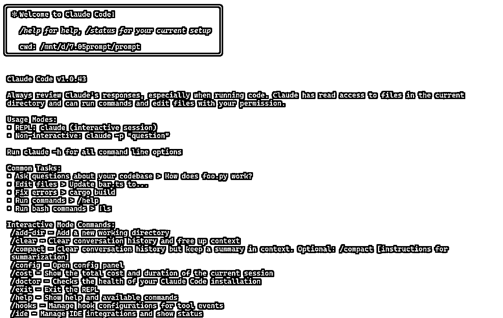

## 第一步：让AI写项目文档

进入项目第一步就是让AI写项目文件，这里用到的是 /init指令，只需要确认它会自己去浏览项目然后生成一个claude.md的文档。

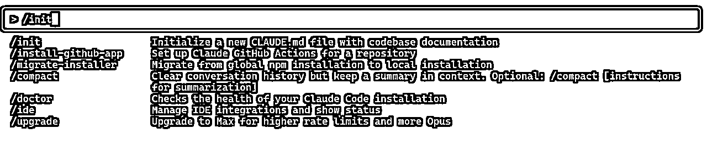

我给大家抽取一个模块看看claude.md梳理的多么细，它会把你的核心架构都拆解好记录下来，它知道每一个文件夹的作用和存放位置。

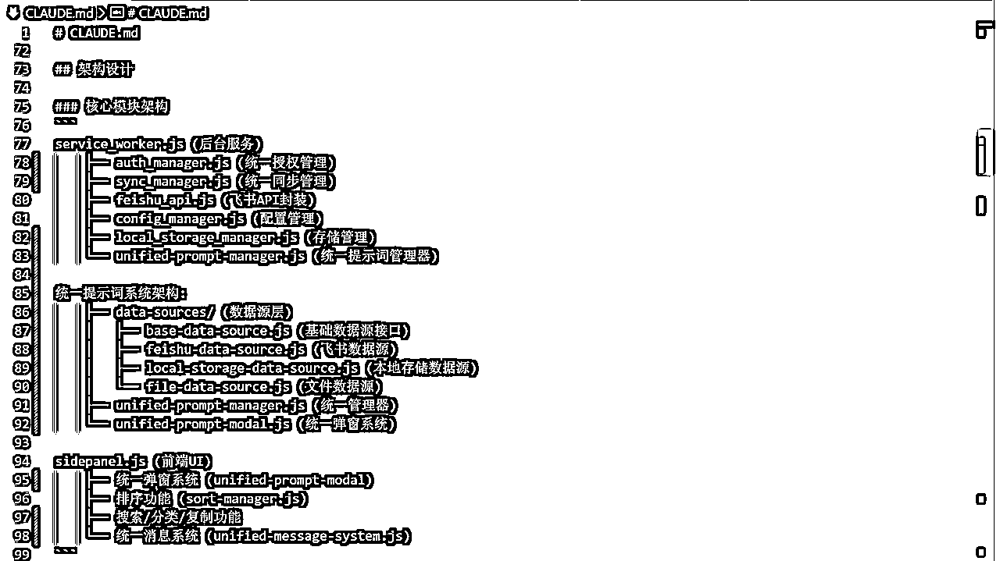

claude.md文档是全局中claude code都会应用的，相当于cursor的系统规则一样。

它的作用是给AI更多的上下文，让AI更好的了解项目进行项目开发。

/init 不仅仅只是初始化用的，每次完成一个版本迭代后，也可以运行 /init，这个时候它会自动更新 claude.md文档，把开发的内容加进来。

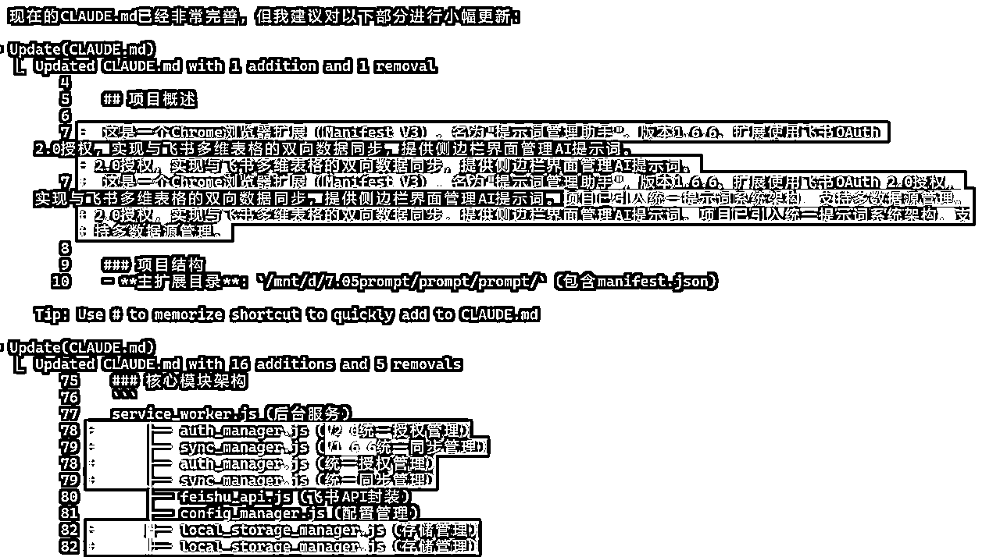

我自己的开发习惯是：每完成一个版本的开发，做一次GitHub的保存，然后运行一次/init。

## 第二步：写prd文档

第二步就是写prd文档，这块之前在“小白AI编程指南”里列举了提示词和案例，在这个文章中我就不展开讲了。

在这里主要跟大家分享一下，如何和claude code高效的讨论需求。

通过建立claude.md文档，让claude code对项目十分了解，它已经知道了我这个项目的核心逻辑、文件结构、模块功能，和它讨论是一件十分高效的事情。

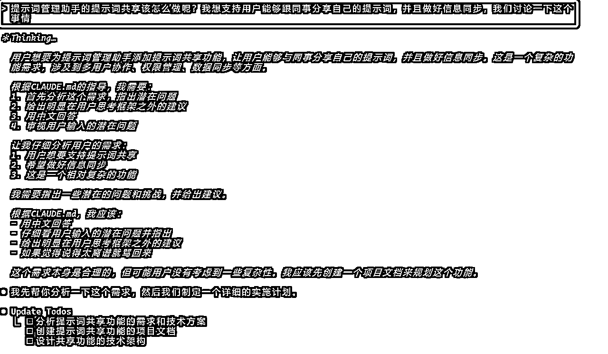

红色部分是我提出的需求，我们可以看到AI是基于claude.md文档，然后去阅读整体系统，最后给到我一个它自己的思考，这种讨论会非常符合真正的开发场景，能够很快的落地下去。


它先给我泼了一盆冷水，然后又给到我三套不同的渐进式方案；最后它自己思考了一会告诉我建议从方案1开始，并且给到我详细的逻辑和原因。

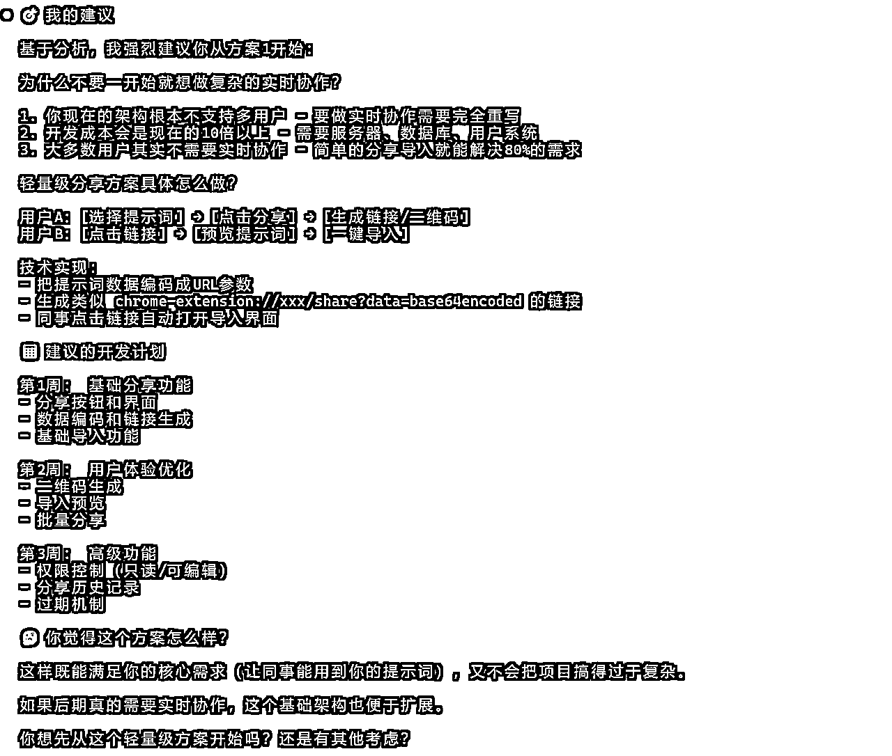

Claude code 在讨论需求能够得到这么好的效果，对项目的理解起着至关重要的作用。

## 第三步：做具体的开发计划

第三步就是和claude code一起制定计划，在这里我们要先讲一下claude code的三种作业模式。

Claude code支持三种作业模式，分别是default（默认模式）、plan（计划模式）、Auto-accept（干活模式），刚才我和claude code 的对话是默认模式，只需要按住shift+tab 即可进行模式的切换。

左下角显示plan就代表切换到计划模式了，让我们沿着刚才的方案1来做个开发计划。


Claude code做计划的第一步依旧是去看代码，详细的了解已有代码库到底是什么样的。

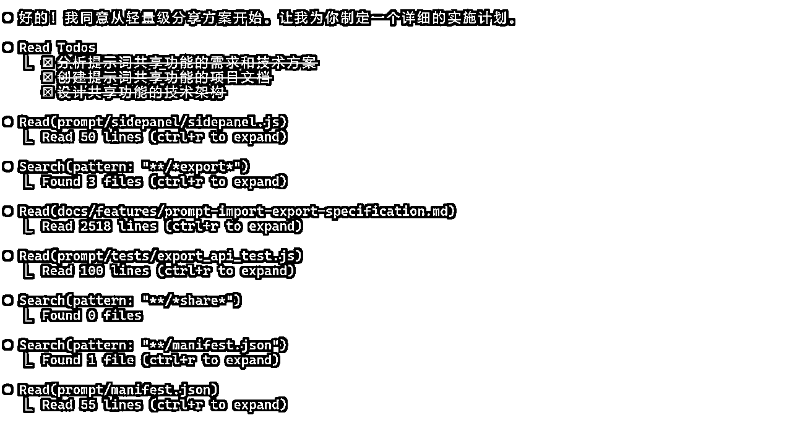

然后它会给到用户一个详细的自己计划开发这个需求的计划。


看到这份计划我就充满了信心，最起码AI把每一块都想到了，那它干活的效果自然会很好。

这里如果想接受计划就选择yes，不想接受就选择no，继续讨论计划就行了。

## 第四步：AI写代码

在确认了计划之后就进入了第四步，让AI干活进行写代码，这个环节我们就可以直接挂机了，等着AI写完了切回来看看就行了。


这块连accept都不用点了，AI会自己全部干完，人类只需要测试反馈。

## 第五步：测试反馈问题

第五步就是测试反馈问题，这块有一个需要注意的点是，因为claude code用的是命令行工具，我们没法贴图进来。

所以截图需要我们先保存到文件夹里，然后再通过 @ 这个图片名称，才能给claude code反馈bug，稍微麻烦一点点。


这五步看完了，想必大家应该能够理解，为啥我说用claude code能够把编程效率提升了一倍。

Claude code给予了AI更多的上下文，基于这项能力，我优化了自己和AI协作的流程，从而完成效率的提升。

和AI的协作能力，是毋庸置疑AI浪潮下最重要的事情。

# 学习课程推荐

## Claude Code官方与吴恩达老师公开课

https://learn.deeplearning.ai/courses/claude-code-a-highly-agentic-coding-assistant/lesson/66b35/introduction

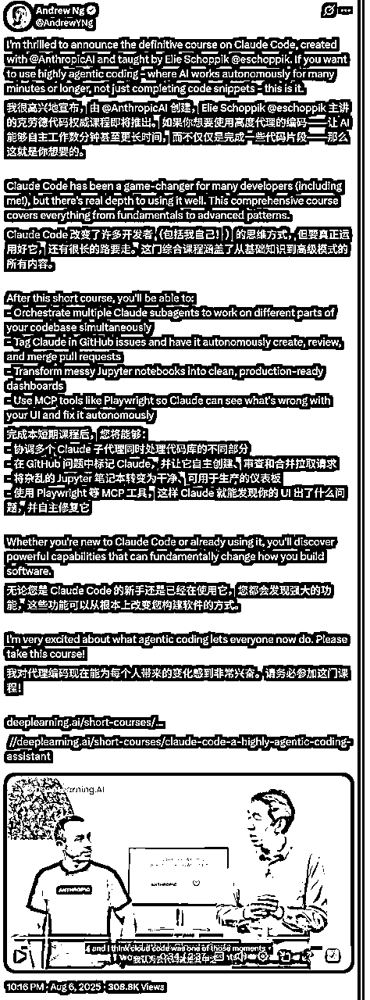