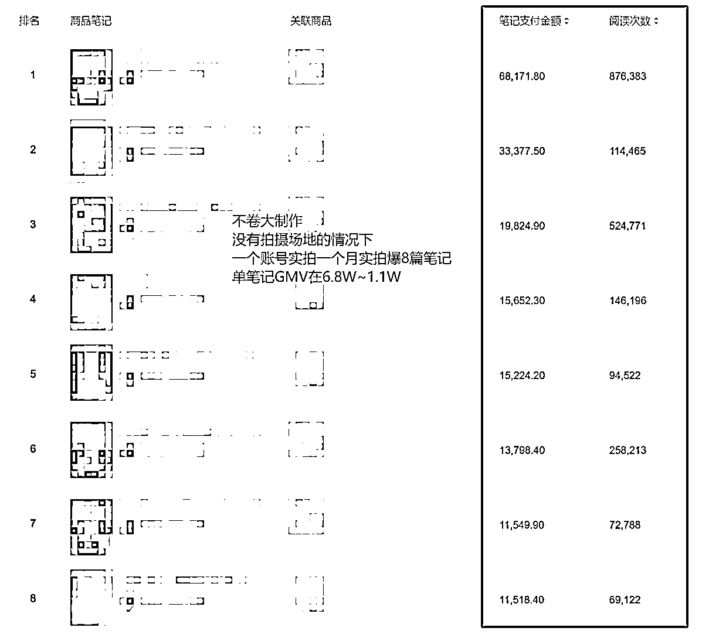
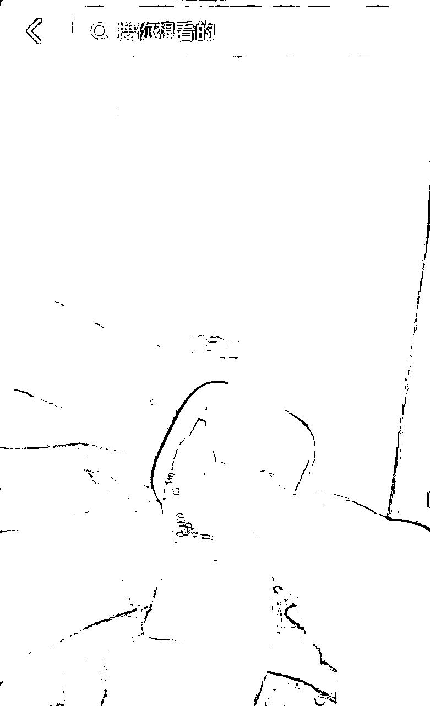
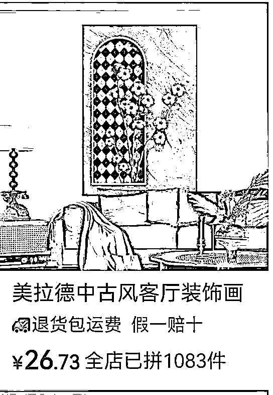
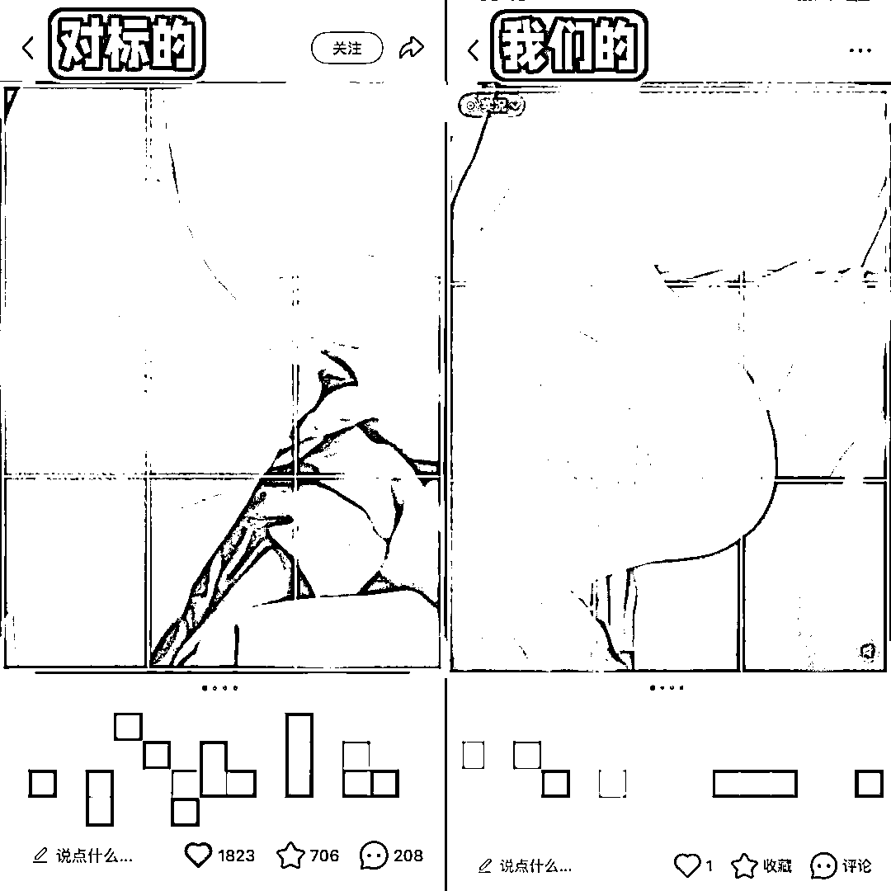
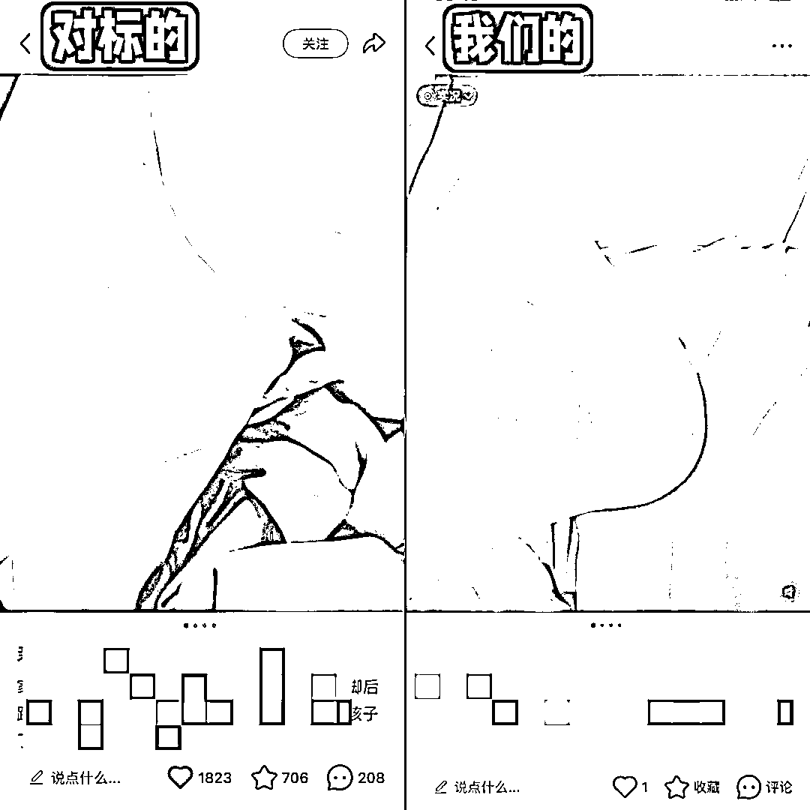
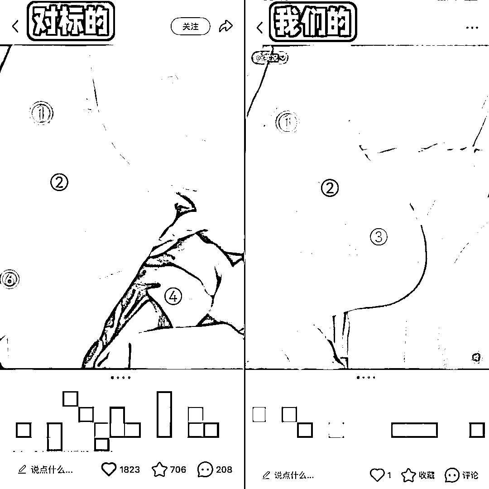

# 以产品实例讲小红书实拍！超详细~

> 来源：[https://nvgnpfh9tzz.feishu.cn/docx/EVp6d2sBKo96SVxCoSDcIB4hnOc](https://nvgnpfh9tzz.feishu.cn/docx/EVp6d2sBKo96SVxCoSDcIB4hnOc)

哈喽，大家好，我是小新

一枚普普通通的00后，做小红书开店已经2年的时间，做知识付费1年的时间，今天给大家分享下我的开店实战原创实拍经验~~超详细！！

我开店不只是混剪玩法，我还发挥我的优势，单独做了实拍的玩法。我是图文/视频都实拍而且都拿到过爆单的大结果，粗略回忆实拍3个月大概爆了有5个品，单品销量都在20W➕。同样一个品，只要我拍摄就一定会爆单。从配音、脚本、实拍全部流程原创、小红书店铺0投流的情况下，实拍爆了8篇笔记，做到了单品销量Top 1

现在的状态是只要我在测的品，竞争压力大的情况下，我都可以通过我的实拍突出重围，小红书开店想要做的好，除了混剪，实拍一定是未来的大趋势。我们测试过，出单后一个视频里有一段实拍会更容易爆单，出单后一整个视频都是实拍就很容易把这个品打爆，销量往前蹭蹭升。

最近也正在带着小白选手在测图文实拍品。新手小白会感觉实拍比混剪简单，然后开始去实拍，但是小眼睛很低。这种情况给大家专讲一下：

实拍对于没有出单/爆单的小白选手来说是有一定门槛的，如果你日常拍摄就拍不出好看的照片然后还不懂对方小红书用户审美的爆款图文是长什么样子的，咱们的实拍课程还没有百分百掌握，那么大概率拍出来的内容是不会爆的。

⚠️⚠️大家不要感觉实拍容易，实拍节省时间，但是如果做不到一比一模仿，就相当于浪费时间，因为你实拍的不爆等于做无用功。

# 🔴实拍需要你具备的：

（这些我们内部实拍课程中都有讲过，想要实拍爆单 需要你吸收且多练习）

## 1.图片展示的整体都要一比一模仿对标。

对标用到的道具/背景/光线都要做到近乎一致（或者越类似越好）才容易爆单。

对标用到的道具拼多多大部分都有卖的，可以通过“识图搜同款”解决。

### ⚠️如果遇到有些道具非常贵大几百或者道具识图找不到的情况下，我们可以找类似的。

比如我之前在做一款磁吸理线器的时候，对标拍摄中展示的背景装饰画视图搜不到，我就直接搜装饰画，找了个花插差不多的，买回来拍摄流量也很不错

总结：拍摄需要的道具颜色类似、部分图案类似，不是一模一样的也完全OK~

## 2.拍出来的图片符合小红书精致女生的审美

（做好修图，拍的好不如修的好，如果你的图片拍的不好就不要原图直发）

## 3.实拍不要重复，一个图片只能用一次，可以换角度拍摄

（如果为了省事一个图片用了好几次，流量就会低，尤其是图文）

## 4.实拍对标拍摄live动图，你也要拍摄live动图

动图拍摄上传发笔记需要用苹果手机（可以闲鱼或者转转买个二手的 1000-2000块钱预算）

# 🔴实拍实例说明为什么对标爆，我们拍的不爆！？

下面给大家以最近爆过的“搓脚板”产品举例，通过学员拍摄实例，给大家讲一下为什么拍出来的内容对标爆，你不爆。

（往往图文小眼睛只有十几个是正常的，跟账号没关系，根源是我们拍的图片不过关，所以小眼睛👀十几个，解决方法就是：我们要拍摄优质图文。）

图文节省时间，但是需要花心思研究。

——

下面我会把对标的实拍的图片和咱们学员实拍的图片放在一起，有问题的点标注了序号，大家可以对应看，这个作品图片问题比较典型，大部分实拍入局的人都遇到过，我们根据这个产品实拍的问题去找自己的问题。

## 🔵实拍一比一模仿第一步：显示主体（这个是脚）在图片中居于什么位置，要和对标一样。

如果你不知道，可以在对标图片标注一个九宫格

### 🔸怎么标注九宫格：

打开美图秀秀→贴纸搜索“九宫格线”→就会出相关贴纸了，加上就知道显示主体放在图片那个位置了。

下图：对标的脚显示在左上四格，脚后跟是重点显示产品效果的，正好可以居中显示，而且右边和下边分别留一排空格，也不会让用户看到脚有画面不适感

但是你看我们学员的，并没有脚后跟居中/九宫格位置不对。不能让用户看图片第一眼就抓住图片重点（我们看图都是先看图中心点）

——

## 🔵实拍模仿第二步：光线色彩做到统一

大众对脚的认知就是粗糙的，我们这个产品展示的作用是脚变得嫩嫩的，所以你的图片一定要偏白，不要偏黑。

如图，对标图片整体偏白，我们学员的就偏黑偏粗糙。

（你这个产品就是说用了脚可以变得嫩，结果你拍的图还是粗糙的脚，并不能符合我们好用类产品带货重点：通过产品使用前后对比，去突出展示产品有效果好用）

### 🔸这里怎么调整？

1、可以先把脚洗洗再用产品搓，搓完给脚后跟和整个脚抹点水乳化妆品，保证脚拍摄是粉嘟嘟嫩嫩的

2、可以拍摄时打个白光灯，拍出来背景就不会暗了。（补光灯拍摄必备，拼多多几十块钱一个）

3、拍摄完如果还是黑，可以把图片放到美图秀秀里，修图：加个显白的滤镜 或者 调节下亮度/对比度/清晰度

——

## 🔵实拍第三步：拍摄细节抓住

看下图中👀序号对应下方文字序号

### ①拍摄需要确保显示主体干净：对标的脚①处是干净的，但是我们①处不仅有红点还有笔画

大家想一想：18-38岁年轻精致女生会让自己脚上有这些东西吗？

红点可以用气垫粉扑粉底液遮盖下，笔画洗掉。

介意自己用的化妆品涂脚，可以用手晕染开，或者拼多多买个便宜的，几块钱，舍不得孩子套不到狼🐺

——

### ②处对标是白色嫩嫩干净的，对标的脚就是双做过脚膜的脚，但是我们这里是显得黑的，肤色问题可以用粉扑等涂一层，但是要做到自然，跟妈生皮肤一样，咱别一看就是“化过妆的脚”那就太刻意了😂

其实我们都知道这个产品80%用完是不会达到像对标图一样的效果的，但是我们就是要拍的完美，这样用户才有购买欲望，就像美食，就像买家秀与卖家秀，资本家视角一些，卖货都要有美化的成分。

——

### ③处 对标展示的图，明显可以给用户一种“用完以后脚就不会糙了”的感觉，但是我们拍的用完以后还是和平常一样糙，那么就达不到展示产品使用前后对比有效果的样子

——

### ④处 背景造型：

这里宝子做的很好，找了一个和对标一样颜色的绿色被子。

那么既然找到了一样颜色的杯子，为什么造型不摆成一样的？对标能爆，就已经帮我们测试了，被子摆成那个造型形状展示的效果就更好更容易爆，我们还不赶紧学起来等啥呢

#### 🔸面料类纹理怎么做到和对标一模一样？

方法：手机打开对标图，放一边，照着慢慢的去一步步拧成一样形状的。

❌❌❌不要感觉这些纹理都是他们随便一放就这样的！！不是的！！都是一点点人为拧成的形状，现在你足够慢足够有耐心，你也可以模仿出这个形状。

### ⑤处 对标这里用的白床单显得更亮更精致，你也要铺个直白色的布，如果没有白色的，可以打个光就白了。也可以通过美图秀秀调节里的局部调色调成白色的。

### ⑥处 对标没有全部显示脚凸起的这里

我们也不要显示，更不要显示带黑色的凸起的

### ⑦处 如果你仔细研究 你会发现对标的脚不是直拍侧面的，他其实脚是微微斜着可以看到脚心的，但是我们学员拍的就没有，就会显不出对标图片的那种感觉！

__

这就是实拍需要研究的细节！！！

以这个图给大家讲清楚了实拍图文需要注意的点，大家回忆下自己实拍有没有注意这些。

这就是为什么对标拍的就爆，你拍就几十个小眼睛的原因。

可能有宝子会心里有疑问：这些小细节有那么重要吗？需要这么细吗？

我用我实拍爆单的经验告诉你：需要！就是要抓这么细！对标能爆，就证明了他的构图拍摄是符合小红书用户审美和系统推流机制的，你不踏踏实实模仿就爆不了。

我之前实拍了一个日历，我爆单就是因为对标图片上的冰箱贴我也有，摆放的位置和对标一样就爆了，这种情况不是一次！是每次！！这里不多举例了。

希望你足够细心，然后迎接你的流量爆发。

我是小新，感谢你的观看，如果想要了解更多或者想学习小红书开店，欢迎链接🔗