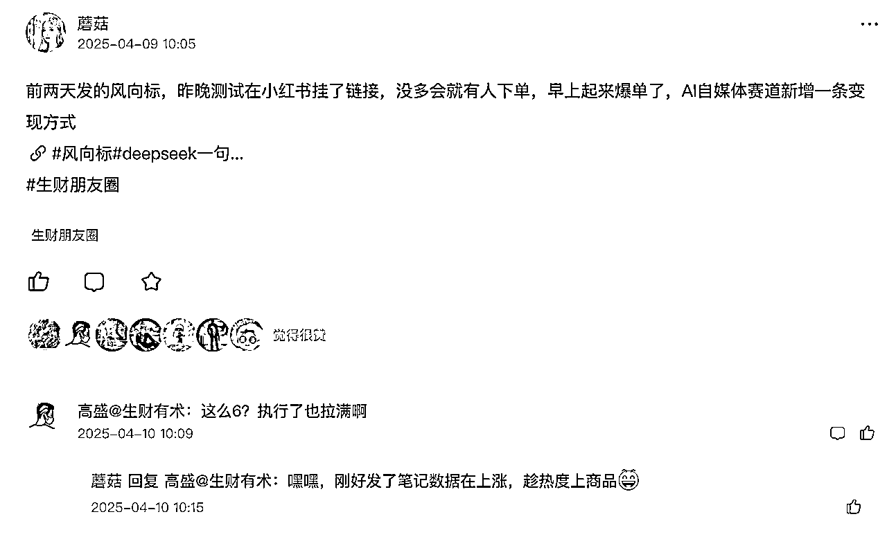
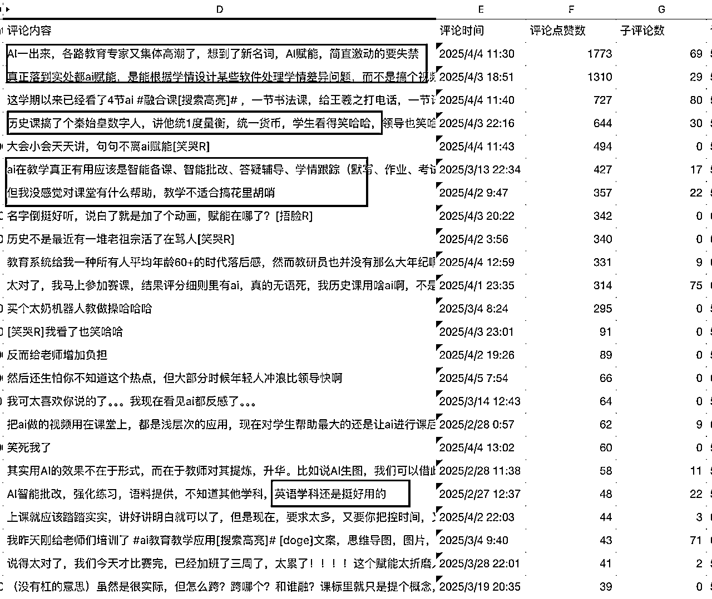
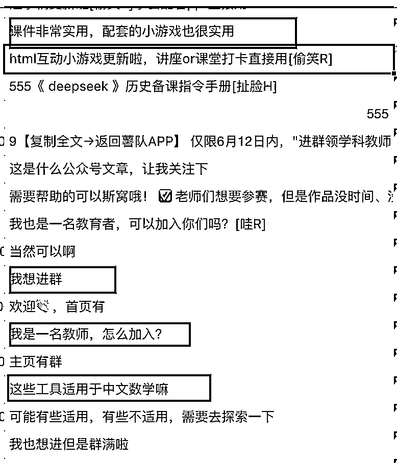
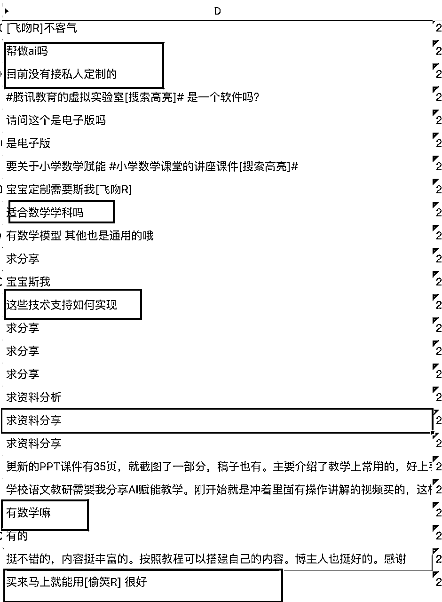
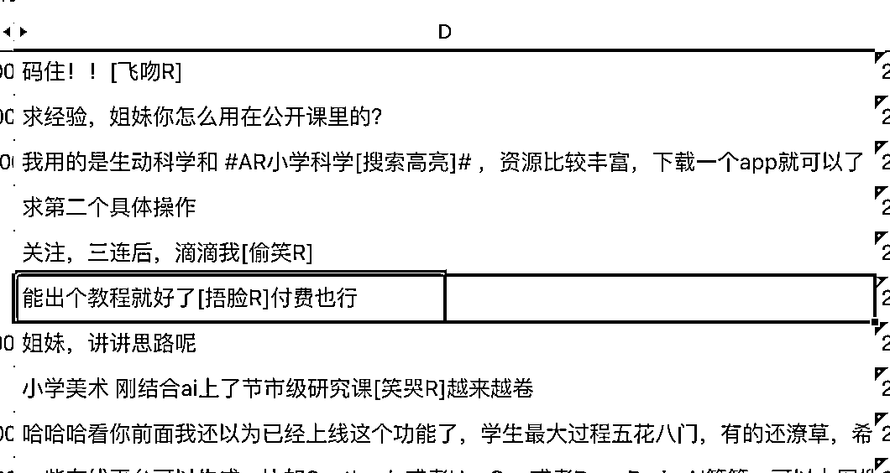
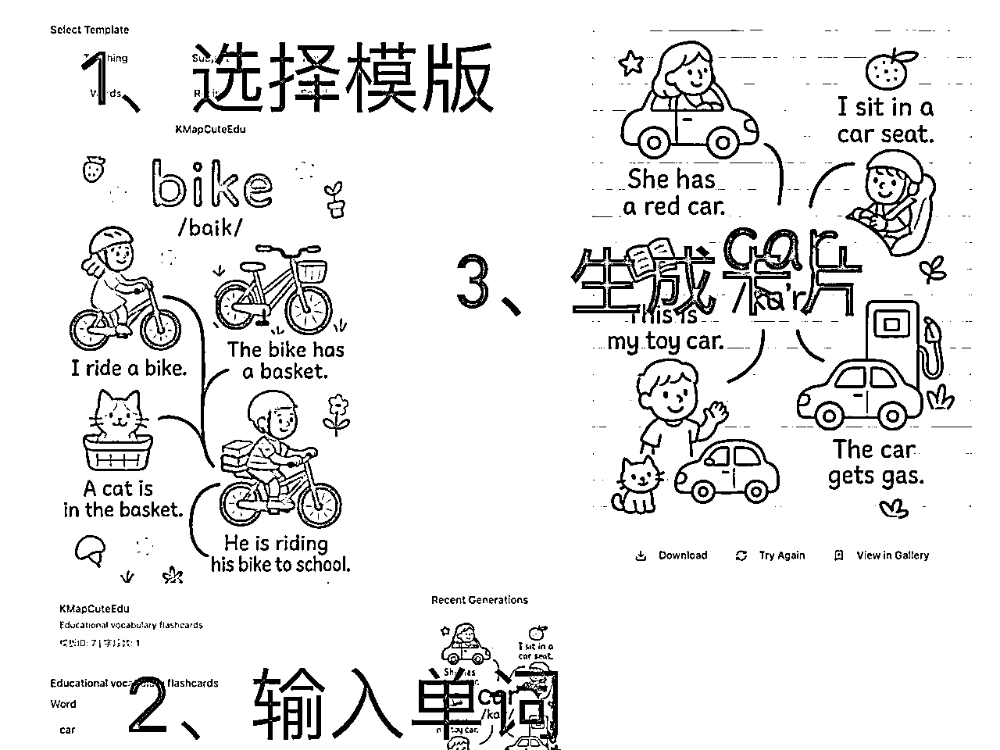
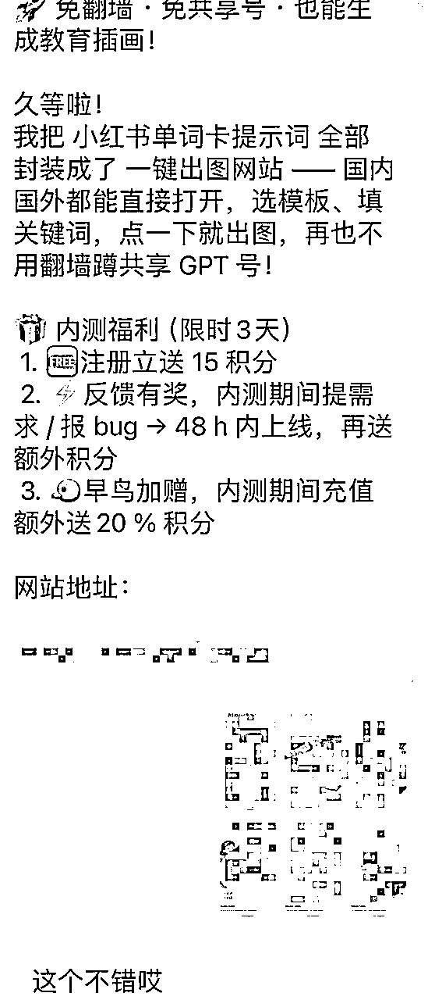

# GPT4o画图网站0到1完整复盘（含踩坑细节）

> 来源：[https://av6ec5kbn6.feishu.cn/docx/EoZOdvcoXoHMuvxkzX0c6byOn5b](https://av6ec5kbn6.feishu.cn/docx/EoZOdvcoXoHMuvxkzX0c6byOn5b)

大家好，我是蘑菇。非常抱歉，这篇应该6月初发的文章拖到了现在才发。

这篇复盘贴想跟大家完完整整地聊聊我做gpt4o画图网站这事儿。从一个想法到产品上线，再到推广和思考，中间的每个环节，好的坏的，我都掰开揉碎了说。希望能给想做gpt4o画图这个超级标的圈友们，一份能拿来就用的地图和避坑指南。

#### 一、一个“打脸”的开始：从“绝不做产品”到“真香”

故事得从今年2月份说起。当时我刚开始做AI自媒体，还信誓旦旦地在圈里发帖子，说我的模式就是做商单号、接广告，绝不碰产品，因为太重了（做AI自媒体发布第一条视频后接到了商单）。当时可能还影响了几个圈友，现在想想，真是惭愧。

打脸来得很快。

到了4月，我发了一条用DeepSeek做小游戏的“风向标”帖子（小红书卖deepseek生成的小游戏）。光说不练是假把式，发完我自己就去实操了，很快就开始变现了！

这事儿一下就点燃了我。与此同时，我做自媒体接广，天天被pr催着问“下一条视频啥时候出”，那种被追着跑的感觉，真的很烦。

一边是被动接单的烦躁，一边是主动出击拿到结果的兴奋。两相对比，我脑子里那个“做个自己的产品”的念头，就像疯草一样长了出来。

于是，我彻底转向，一头扎进了“AI自媒体教育产品”的探索里。我把DeepSeek、GPT、可画即梦这些工具当成我的‘特种兵’，让它们互相配合打组合拳，折腾了一个多月，跑通了超过15+个用户付费的变现场景。

在这里，我详细拆解一下，我是如何在一个多月里，找到用户买单的10多种场景。这套“笨办法”，可能比后面做网站的故事，对大家更有参考价值。

核心思路，就是查理芒格那套著名的钓鱼理论。这套理论，简直就是为我们这些找需求的独立开发者量身定做的。

第一原则：在有鱼的地方钓鱼

我的实践： 这就是要找到“痛点密度”最高的地方。对我来说，这个地方就是小红书。那里有成千上万的老师和家长，天天在吐槽备课难、做课件烦、找不到好素材、AI没有真正赋能课堂、求AI教程。这些抱怨和求助，就像鱼群在水下吐出的“咕噜咕噜”的泡泡，明确地告诉我：水下有鱼，而且是一大群。

从评论内容可以看到：（1）用户不需要用AI生成花里胡哨的内容，要的是能真正落到实处的产品 （2）真正实用的产品用户愿意付费。那后续的动作就是围绕“有用”进行。

第二原则：记住第一条。但光知道哪里有鱼还不够，你还得有最香的“鱼饵”。

我的实践：用“成品”当鱼饵，而不是用“问题”去钓鱼。 这就是我具体的打法：

1、“造鱼饵”： 我不会去发帖问“大家需要什么啊？”。我的做法是，直接用AI做出一个具体的、能让人“哇”一声的东西。比如，上面的风向标里，我看到同行deepseek生成教学游戏卖得不错，我就录了一个用DeepSeek一句话生成“打地鼠单词游戏”的视频。

2、把鱼饵扔进“鱼群”中央： 我把这个视频发到小红书，标题就叫《DeepSeek一句话生成打地鼠单词游戏》。我发帖的目的不是为了涨粉，而是为了看评论区看私信，是否有人问：“这个是怎么做的？”这些主动找上门的人，就是潜在客户。

3、让鱼“付费”咬钩，完成验证： 这是最关键的一步。当有人加我微信，问我游戏怎么做时，我不会直接把方法告诉他。我会说：“这个是DeepSeek/GPT做的，提示词和流程比较复杂。小小有偿，收个辛苦费，你要提示词还是要成品游戏呢？”通过这个过程，一个简单的“游戏制作”场景，就立刻分化出了至少两种付费需求：“买成品”和“买教程/提示词”。

当用户真的把钱转过来那一刻，这条鱼才算真正钓上来了。 这个“变现场景”才算被我彻底验证通过。

就这样，先找到“老师、家长”这个鱼群，然后把“DeepSeek生成教学游戏”、“GPT生成教学卡片”、“可画即梦生成教学视频”这些“鱼饵”一个个抛出去，最终钓起了“买卡片、买视频、学AI、老师求合作.......”等等超过15种被真金白银验证过的需求。

#### 二、从“想”到“干”：一个让我下定决心的契机

虽然手里已经有了10多种能打的牌，但说实话，我还是有点虚。因为手动卖货，规模始终有限，我一直想把这些已经变现的场景做成网站进行放大实现，但总觉得时机不到、能力不够，迟迟没有动手。

真正的转折点，是我参加了小排老师的“深海圈”。小排老师的课程给了我一套具体的、能落地的思路，一下就把我“想做网站”和“怎么做网站”之间的那层窗户纸给捅破了。

OK，万事俱备，只欠行动。

我从那10多个已变现的场景里，选了“用GPT4o画教学卡片”作为我的第一个MVP产品。原因很简单，这是一个完美的“靶子”。

为什么偏偏是它？我当时做了个分析：

1.  市场够精准：我之前手动卖卡片、卖提示词，发现客户里有一半都是海外的。这个需求是经过全球用户验证的。

1.  痛点够刚需：国内用户想用GPT4o，面临着无法下载App、买共享号被降智、出图效果不理想等一堆头疼的问题。

1.  壁垒够清晰：当时只有GPT4o能画出那种教学风格的卡片，像国内的豆包、即梦都做不到。这个“唯一性”，就是我产品的核心价值。

1.  实现够简单：说白了，核心就是调用一个API，套个壳子就能跑通最小版本，开发成本可控。

基于这四点，这事儿就这么定了。我的第一个网站MVP，就从这个场景开干。当时压根没想到，后来误打误撞地，还撞上了亦仁发的“超级标”。

#### 三、产品实现：后端的“咒语”与前端的“魔法”

这部分就是纯干货了。从一个想法到一个能用的网站，具体是怎么实现的？

我的核心思路是，要让用户用起来像傻瓜相机一样简单。那这个“简单”的背后，到底藏着什么“复杂”呢？这里带大家走一遍完整的流程，看看用户点一下按钮，前后端到底发生了什么。

这个“自动化”的魔法，核心在于我花大量时间调试的不同风格的“提示词”。我为每一种模板，都写了一套提示词模板。

以下面这个模板为例：

设计“数据流”——用户点一下，背后发生了什么？

1.前端（用户的浏览器）：用户在我的网站上，选择了一个“音标卡片”模板，然后在输入框里打了“car”，最后点了“生成”按钮。这时候，他的浏览器就会向我的服务器发送一个请求，请求里包含了两个关键信息：{ templateId: '7', keyword: 'car' }

2.后端（服务器）：后端收到了这个请求。它会像查字典一样，根据templateId，在我预设好的“提示词模板库”里，找到对应的“母体提示词”（比如：A minimalist line art drawing of a {keyword} for a children's educational flashcard. Style: thick, clean black outlines, no shading, no colors, strictly black and white. The subject should be simple, iconic, and easily recognizable for a toddler. The background must be a solid, pure white #FFFFFF, with absolutely no shadows or extra elements.）。然后，它会把用户输入的keyword（'car'），像填空一样，塞进这个母体提示词的指定位置，形成一个完整的可以发给AI的“指令”。

3.生成图片的API调用：调用图片生成的接口，把完整的指定作为参数传递给生成图片的服务。这一步，就是最核心的API调用。

4.图片生成结果查询: 因为AI画图需要一点时间，轮询查询图片的生成状态。（简单理解就是每隔几秒就去问一下图片生成服务：“画好了没？”“画好了没？”）

5.展示图片：第4步接口返回的状态为success时，会同时返回生成的图片的链接。再通过图片链接调用获取图片的接口，把最终生成的图片展示给用户

为什么这么麻烦？直接提供提示词让用户自己生成不行吗？

把简单留给用户，把复杂留给自己。通过不同的提示词模板，我把画风、构图、背景等所有可能导致风格不统一的变量，全都提前“锁死”了。无论用户输入的是猫、是狗、还是车，最终都必须在这个“加工车间”里，被处理成同一种风格的产物。我的核心工作，就是去设计和调试这些不同风格的“加工车间”。 这才是这个产品最核心的技术细节，也是保证图片完成度的关键。

#### 四、上线过程：一场与支付渠道的“战争”

网站开发完，真正的鬼故事才开始。那就是——支付。

第一个坑：Creem 我域名刚注册好，就信心满满地去申请Creem的生产环境。结果呢？两周多过去，没通过，也没拒绝，就像石沉大海。

后来还是在深海圈成都圈友的交流中，大佬提醒我，说我的网站上放了“使用人数”和“用户证言”，这些元素可能会让支付渠道觉得有风险。我赶紧回去隐藏掉，然后又连发了两封邮件去“催审”，这才收到审核通过的邮件。

*   经验总结：一定要等网站内容全部做好、上线之后再去申请支付。 申请前，甚至可以把网站链接丢给GPT，让AI根据支付渠道的审核规则，先帮你预审一遍，把有问题的地方改掉，能极大提高通过率。

第二个坑：Paddle 在Creem上吃了亏，我学聪明了，想再接入一个Paddle备用。这次我决定，先申请，等申请通过了，我再投入时间去开发接入。

前期申请特别顺利，眼看就要成了，结果最后关头被拒了。理由是：网站有生成“真人人像”的风险。

我当时心态就崩了，赶紧写邮件解释，说我的网站生成的都是卡通图片，而且用户根本不能上传自己的图片。官方先是回邮件道歉，说是误判，我以为有戏了。结果来回博弈了好几轮，最终还是被拒了。他们的最终结论是：AI生成图片这整个类型的网站，都不能通过审核。

万幸的是，因为我没急着开发，只是创建了个分支简单弄了下，测试环境都没调，所以几乎没浪费什么时间。

*   经验总结：支付渠道，务必先申请，拿到正式通过的“准生证”之后，再投入开发资源去接入，否则很容易白干一场。

#### 五、推广与运营：从30个付费用户开始

网站终于能跑了，支付也能用了（虽然只有一个Creem）。我没急着去外面买量，而是用了两步走的冷启动：

1.  核心内测：我在微信里，找了30个之前为GPT4o画图付过费的客户拉了出来，一对一地把网站发给他们，请他们深度测试。他们是最好的“质检员”。

前期加到微信的客户我都打标了，区分了购买不同产品的客户。这是我发给之前给GPT画图付费过客户的消息。

设计了一套“拉新-促活-转化”的话术，包含：

1、痛点+解决方案

2、降低门槛，扔出“免费试用”的钩子

3、“反馈有奖”，提需求报bug，送积分

4、用“早鸟加赠”，促进转换

1.  小红书群公测：核心用户测试几天后，我把网站发到我的小红书粉丝群里，让更多人来公测。

小红书上有更新教学卡片的笔记，微信用户内测完后，我就在小红书上演示用我的网站出图的视频，同时把视频笔记和网站链接发到小红书的群，同样以提bug送积分的方式邀请用户内测

这里又遇到了那个支付的老大难问题：Creem对国内用户不友好。我网站的收费模式很简单，就是订阅制，分了Basic和Pro两个档位，来满足不同用户的需求。但Creem支付这个问题，很容易流失掉国内的用户。没办法，我只能继续我的“笨办法”：在国内用户支付失败后，引导他们微信直接转账，我后台手动给他们加积分。 虽然麻烦，但服务好了每一个有意愿的早期用户。

#### 六、最后，关于这门生意的清醒认识

网站上线后，短期规划很清晰：

1.  做SEO：这是获取稳定、低成本流量的正道。

1.  打造案例：小红书上，已经有用户用我的提示词做成品卡片卖，快速起号并且变现了四位数。我要把这些成功案例包装出来，吸引更多想做副业的用户通过我的网站生成卡片去卖。

规划归规划，但说句掏心窝子的话，对于这个产品本身，我其实有很清醒的认识。

它的护城河很浅：说实话，很低。技术上，调用API套个壳，本身就没什么门槛。唯一的优势可能就是我的模板都来自真实的用户需求，但这个太容易被复制了。

它的天花板也很明显：家长和老师的需求是阶段性的，一个学期的卡片做完了，可能就不再续费了，持续订阅很难。

所以，长期来看，这个产品必须围绕“用户做完卡片之后，要拿它干什么？”去做深度开发。但是我现在还不会马上去做这些重功能。我需要先跑一段时间看网站运营和盈利数据，判断这个赛道是否真的值得我投入更多的时间和成本。

那你可能会问，既然这个产品本身有这么多问题，你的底气到底在哪？

我的底气，可能不在于这个单一的产品，而在于我找到它的那个“笨办法”。

我的待办列表里，还有30多个通过挖掘自身痛点、以及天天泡在小红书和Reddit上攒下来的需求。说实话，我也不知道下一个爆款是哪个，但我已经有了一套用最低成本去贴近真实需求、去快速试错的方法论。

别人还在写找需求时，我已经手动帮客户做完服务，钱也收了，知道这事儿有戏还是没戏。 这才是我唯一真正的、别人拿不走的优势。

这，可能就是一个普通独立开发者最真实的状态吧：一边往前跑，一边保持警惕，把脚下的每一步都走扎实。

最后，如果要把我所有的经验浓缩成一句话送给大家，那可能就是：

从一个“利他、小而美”的点切入。

别总想着做平台、做生态，颠覆行业。先找到一个极其微小但极其真实的痛点，比如“一个老师做课件时找不到风格统一的配图”，然后用你的全部力气，真诚地、专注地帮这一小群人把问题解决掉。当你真正“利他”了，把一件小事做到极致了，生意和机会，或许就自然而然地来了。

希望我这一路踩过的坑和总结的经验，能让大家的路走得更顺一点。