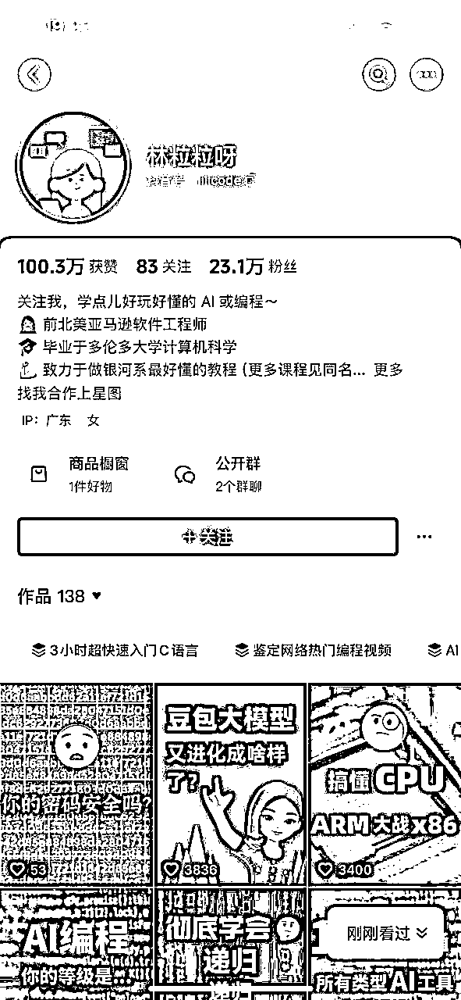

# 想要做好新媒体账号，只要学会这三个字就行了，

> 来源：[https://hq5823whbx.feishu.cn/docx/F0IBd9OCTon9mixnWVjcMI7knKd](https://hq5823whbx.feishu.cn/docx/F0IBd9OCTon9mixnWVjcMI7knKd)

### 想要做好新媒体账号，只要学会这三个字就行了，亲测有效，

圈友好，我是林清，在新媒体一线做了近8年的运营操盘手，亲自带过3千多人做账号，自己账号单条视频4千多万播放，两三百条视频突破百万播放，小红书4天涨粉一万，在看过无数个新人辛辛苦苦却做不起来账号的情况下，想给大家说一些做账号的底层逻辑，其实就三个字，掌握了这三个字，并且积极去实施，就没有做不起来的账号。（当然黑五类账号除外，违法违规的账号除外）

最近几年线下的生存空间越来越小，很多人想到线上来做一个新媒体账号来涨粉变现。

目前抖音日活8个亿，再加上视频号，小红书，B站，公众号，播客 等等 大量的用户都活跃在线上新媒体。

大家都看到了新媒体这块大蛋糕。

可现实往往很残酷，你熬夜写的文案，精心拍摄剪辑的视频，播放量总卡在几百，

而你看到别人对着镜头随便聊聊天，然后微信里就加满了客户，收入一个劲儿地往上涨。

没资源、没经验、没背景…… 普通人做新媒体咋就这么难呢？

对于在一线做了将近8年的新媒体运营，单条视频突破4千万播放，做过几百条上百万播放量的视频，带过3000多人做过账号的我告诉你，真的不难，难是你不知道方法，不知道看别人的爆款，蒙着眼睛在做事情，从来不去看别人在做什么，也根本不知道优秀的爆款内容是长什么样，那你能做出爆款才怪呢？

其实 ，想做好新媒体账号就三个字： 抄，超，钞

#### 一、抄：站在巨人的肩膀上，少走十年弯路

别再傻傻地埋头搞 “创新” 了！爆款内容都是有迹可循的，那些被市场验证过的内容，才是你该选择的黄金赛道。

在我陪跑过几百个客户，特别是有些在线下做了很多年的老板，我听的最多的一句话就是“我讲的是最有用的，这些才是最好的，别人讲的都是啥呀”

他们一定要坚持讲自己想讲的内容，觉得自己的内容就是干货，就是对大家有益的，然后精神抖擞的去录制了自己觉得最有价值的内容，然后坐等播放量破千万，结果等到第二天，播放量一两百，两三百。。。。。。

那到底怎么抄呢？很多人直接把爆款视频的文案直接扒下来，然后用自己的嘴读一遍。

这样做和小时候抄别人的作文有啥区别？老师一眼就能看出来是你抄的，

那么究竟该怎么抄才有效果呢？

##### 1，抄选题：

痛点、共鸣、热点、普世 —— 哪类选题曾经让低粉丝账号一夜之间爆红？

那它就该是你的风向标！想想看，当你不知道做什么的时候，跟着这些被认可的选题走，是不是能省去很多试错的时间？

就像 “影老板” 这个账号，身为列车长的刘影敏锐察觉到大众对铁路知识的需求，

像 “中转换乘”“高铁卫生间如何使用” 这类与旅客出行密切相关的痛点选题，成了她内容创作的方向。

这些选题精准命中旅客日常出行的困惑，发布的 200 多个短视频均收获不错的浏览量，仅 5 年就积累了 600 多万粉丝 。

##### 2，抄结构：

开头怎样才能在 1 秒内钩住观众？中间又该如何层层递进，让观众一直看下去？结尾怎么引导才能让观众愿意互动？

把爆款的框架拆解开来，直接拿来用，多省心！

比如一些热门的知识科普类视频，

开头往往用一个令人震惊的现象或者大众熟知的错误观念来吸引眼球，

中间分点详细阐述正确知识，结尾设置互动话题，引导观众留言讨论。

你在创作同类视频时，完全可以借鉴这种结构。

##### 3，抄变现：

别人是靠什么赚钱的？是带货、卖课，还是接广告？

摸清了这些赚钱的路径，复制他们的成功模式，你也能更快尝到赚钱的甜头。

比如，美妆博主 “骆天宇”，

最初他通过分析同类型头部博主的变现方式，发现美妆带货契合自身账号定位。

于是，他精心挑选合适的美妆产品进行推荐，逐渐摸索出适合自己的带货节奏和话术，实现了可观的收入增长 。

#### 二、超： 旧元素新组合，打造你的独家标签

抄只是基础，超才是关键！

在模仿的过程中，注入属于你自己的独特基因，才能让观众一眼就记住你。

##### 1，定位超精准：

全网都在教做菜？那你就专攻 “上班族 10 分钟快手减脂餐”，切口小，但需求可不小，上班族们谁不想快速做出健康又美味的减脂餐呢？

看“滇西小哥” 董梅华这个账号，她聚焦云南美食这一细分领域，把家乡的特色美食通过视频呈现给大众。

与其他美食博主宽泛的美食分享不同，她深挖云南本土特色，600 余期短视频装满了对家乡一草一木、一饭一蔬的热爱，吸引了超 1600 万粉丝关注 。

##### 2，选题超犀利：

别人都在晒健身日常？你就来个 “40 岁裸辞带娃，靠健身逆袭成教练”，这样的故事充满了看点，一下子就能抓住大家的目光。

比如像这个账号：二胎宝妈十三姨，她就是在家一边带娃，一边健身锻炼，顺带卖货，

##### 3，形式超新颖：

别人讲知识都是干巴巴的？

你可以试试用方言配音再加上搞笑动画，说不定这种 “土到极致就是潮” 的形式，反而能吸引一大批粉丝。

比如 “爆笑巫溪” 团队，他们创作的乡土气息浓郁的视频作品，采用晃动的画面、土得 “掉渣” 的方言，演绎家长里短的故事。

这种独特的形式让网友直呼 “真实”，视频号、抖音号每期播放量基本都能达到 30 万 + 。

还有下面 这个教剪辑的账号，3个月火速涨粉70多万粉丝，平均1条视频涨粉1万，靠的就是新颖的剪辑技巧，

以及通俗易懂的教学，一下子吸引了70多万人关注学习

##### 4，体验超预期：

别人分享的干货都很枯燥？

你可以做到日更，在评论区秒回粉丝消息，还能给粉丝送免费资料包，这样粉丝怎么会不对你死心塌地呢？

医学科普博主 “张之瀛大夫”，为了让中老年人能听懂心血管疾病知识，反复琢磨通俗化表达，给每期视频配上特大字幕。

并且积极与粉丝互动，解答疑问，收获了一大批忠实粉丝，其影响力不仅遍布国内，还吸引了不少海外华人华侨 。

### 三、钞：精准变现，别让流量白白溜走

流量不能变现，那之前的所有付出都等于白忙活！

找到最适合你的 “钞能力” 路径，才能让你的努力得到看得见的回报。

##### 1，锁定付费人群：

学生党想要 “搞钱攻略”？宝妈们需要 “育儿妙招”？精准定位这些有付费意愿的人群，直击他们的痛点，赚钱就会更容易。

例如专注于母婴领域的自媒体账号 “年糕妈妈”，明确锁定宝妈群体，针对宝妈们在育儿过程中的各种困惑，如宝宝辅食制作、早期教育等痛点，提供专业、实用的内容，成功吸引大量宝妈关注，并通过推荐相关母婴产品、开设育儿课程等方式实现变现 。

##### 2，选对变现模式：

*   流量大：接广告、带货就是不错的选择，能快速把流量转化成收益。

*   以搞笑类自媒体账号 “陈翔六点半” 为例，凭借庞大的粉丝量和高播放量，吸引众多品牌投放广告，同时通过直播带货销售与账号风格契合的周边产品，实现丰厚收益 。

##### 3，专业能力强：

卖课、建社群更有 “钱” 景，能充分发挥你的专业价值。

*   比如编程领域的 “林粒粒”，凭借专业的编程教学能力，开设线上编程课程，组建学习社群，为学员提供学习指导和交流社群。

##### 4，有案例：

付费咨询、代运营的价值就更高了，别人愿意为你的经验买单。

如在新媒体运营方面经验丰富的 “李割”，凭借成功帮助多家老板提升业绩的案例，开展付费咨询服务，为新媒体从业者提供运营策略指导，同时承接代运营业务，获取可观收入 。

##### 5，规模化放大：

单条视频爆了之后，赶紧制作类似同类内容，让爆款的效应持续发酵！

私域转化效果好的话，果断投流放大入口，让更多人成为你的客户。

##### 新媒体其实就是一场开卷考试，同行就是你最好的老师！

与其自己闭门造车，浪费时间和精力，不如从 “抄作业” 开始，

在模仿中不断迭代，打造出属于自己的独家竞争力。

在新媒体一线做了将近8年的专业运营，我深知普通人刚开始做自媒体时的迷茫与艰辛，所以把自己亲测有效的经验传授给大家，希望能对大家有些帮助