# 别人还在入门，你已经精通！Claude Code进阶必备14招-j

> 来源：[https://sqm685cmohb.feishu.cn/docx/P3a3dMF64oiLdCxRcXGcujUknTf](https://sqm685cmohb.feishu.cn/docx/P3a3dMF64oiLdCxRcXGcujUknTf)

大家好，我是志辉，10 年大数据架构，现专注 AI 编程。

最近Claude Code 的人越来越多使用。

有的人不知道如何跟 ide 结合，有的人不知道如何粘贴图片。

那今天就直接上干货，14 招学会，走遍天下都不怕。

从此你就是 Claude Code 高手。

讲解常用技巧。其实ClaudeCode需要什么技巧，只要你有需求，正常跟它聊天，大部分的问题就可以解决。

戒掉 Cursor 的使用思路。

ClaudeCode是大道至简的思路。就是干就行。

1、提示词技巧

2、命令/快捷键技巧

3、记忆文件（规则文件）

4、工具

# 正式开始

从第一个帮助命令开始。

```
claude --help
```

很简单，就是看哪些命令参数可以用到 Claude 命令上。

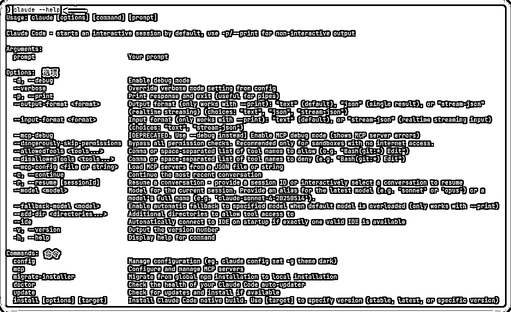

比如经常使用的如下：

### claude version

查看版本


### claude doctor

检查 cladue 的安装情况

```
claude doctor
```

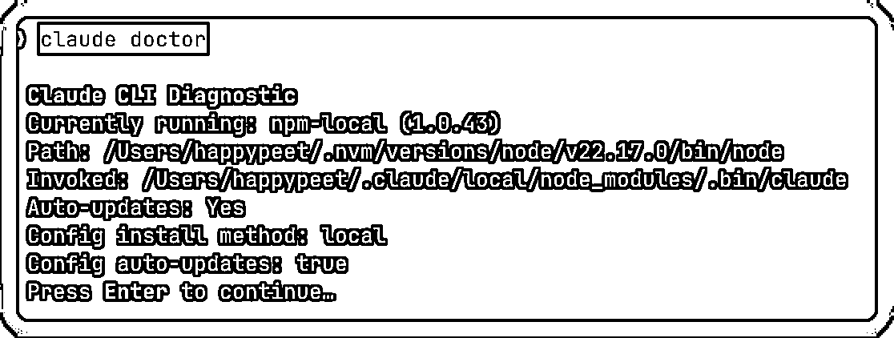

### claude mcp

查看 mcp 的相关配置。

```
claude mcp list
```

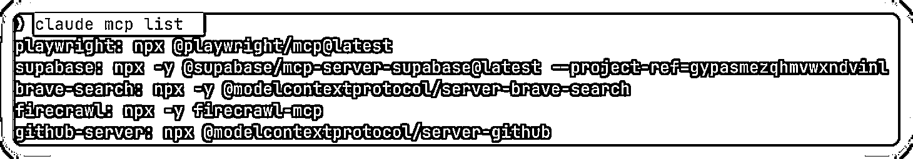

```
claude mcp --help
```

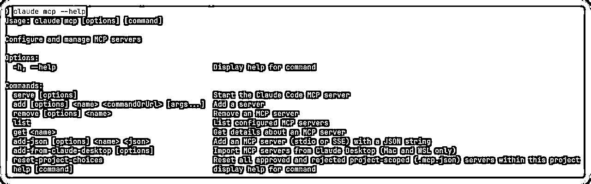

### claude config

claude 的配置信息

```
claude config --help
```

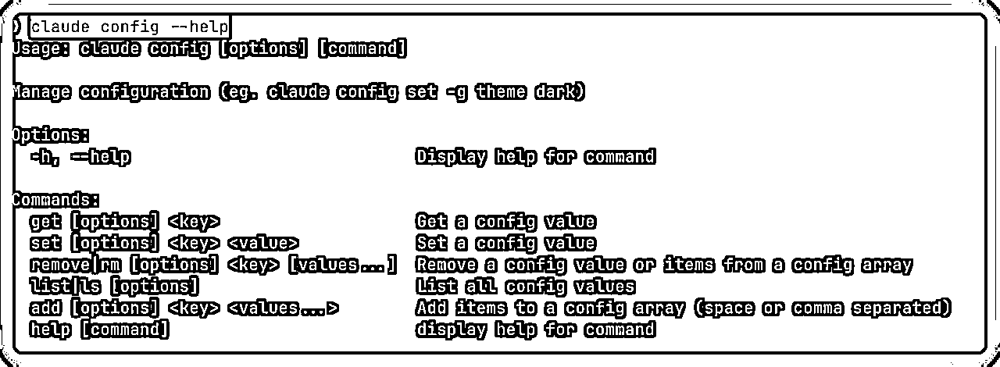

查看列表

```
Claude config list
```


### --dangerously-skip-permissions

俗称的 yolo 模式，我叫他狂飙模式。

```
claude --dangerously-skip-permissions
```

详细的这个后面也会讲。

## 1、和 IDE 的结合

### 步骤一：首先需要安装插件

如下图，搜索 Claude Code，注意要认准是 Anthropic 公司，这个是官方的。

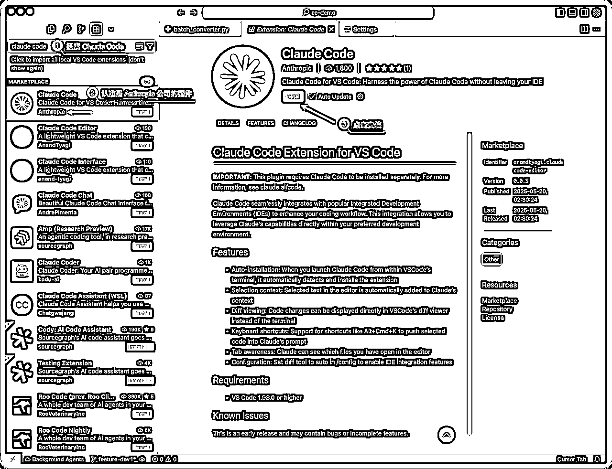

### 步骤二：打开 Claude Code

方法一：使用快捷键，Cmd+Escape，不过我的不好使，大家可以试一试

其实也可以改掉快捷键。

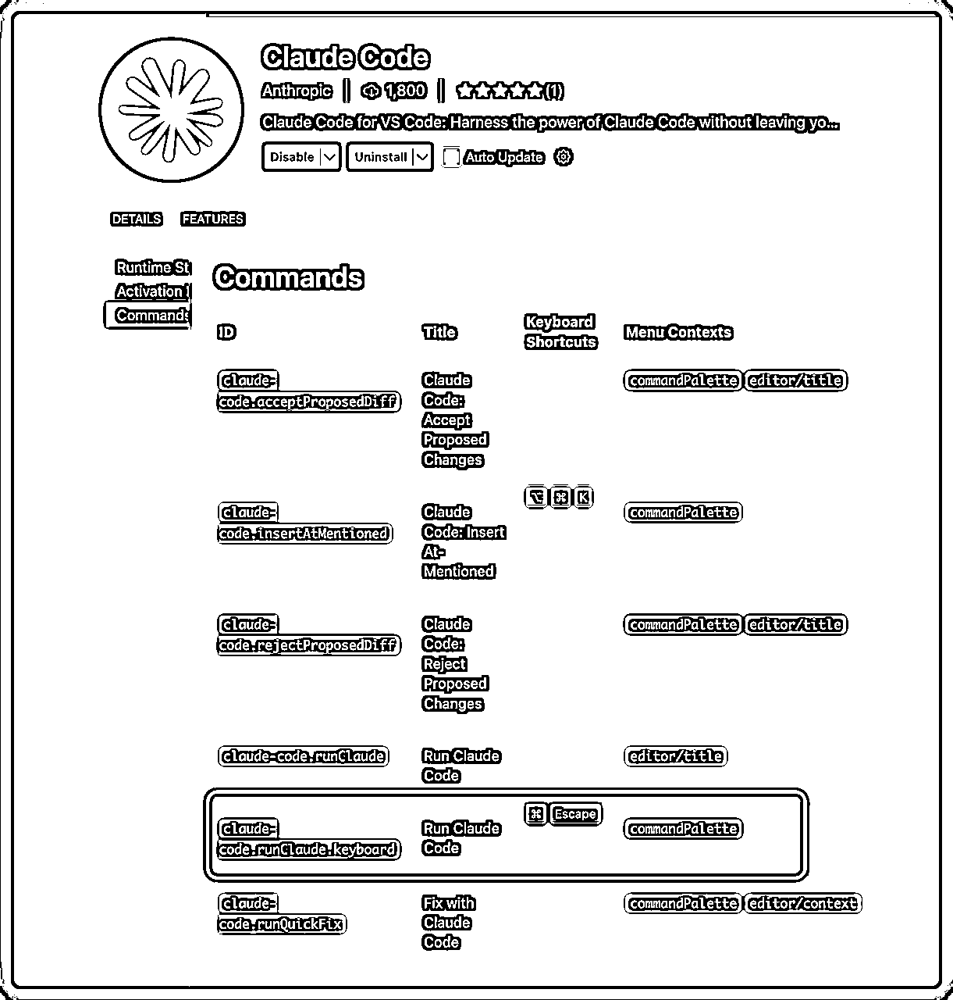

方法二：直接使用 Cursor 界面的如下图所示的图标，鼠标单击就行

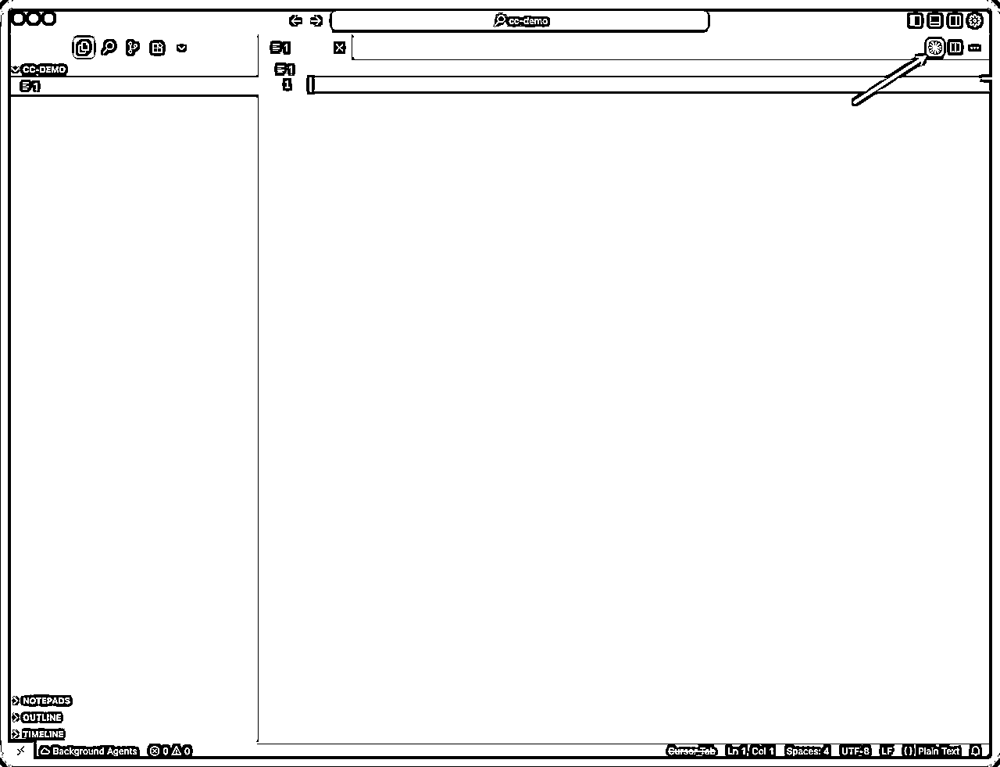

可以看到右侧的就是 ClaudeCode 的工作区域了

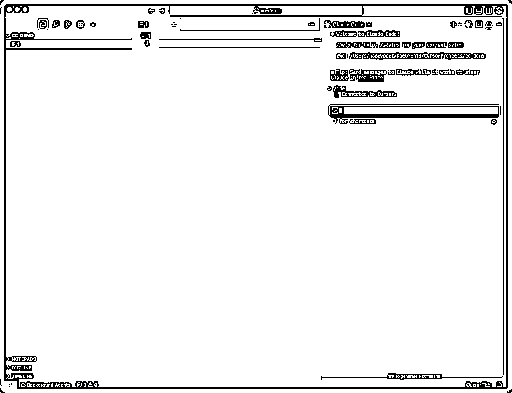

如果你是 windows 可以看我之前发的资料，通过 wsl 插件来连接也是可以用上的。

## 2、自动编辑模式

使用场景：不需要每次创建文件、编辑文件操作都需要你的确认。

使用方式：shift+tab 按一次，就可以进入该模式。


案例使用提示词：

```
帮我创建一个酷炫的 todolist 应用
```

## 3、指定文件

使用场景：具体需要对某个文件操作的时候

使用方式：直接使用 @ 符号就可以指定文件。这个跟 Cursor 的是保持一致的。


## 3、深度思考

使用场景：遇到疑难杂症，或者是规划方案的时候，重构代码，解决复杂 bug

使用方式：提示词里面使用 “ultrathink”，或者“深度思考”等关键词


## 4、plan 模式

roocode，cline，Cursor（ask）

使用场景：前期需要规划项目的时候，或者是解决疑难杂症的时候。

使用方式：shift+tab 按两次就可以看见


举例：

```
我想写一个像素风格的todolist，我需要移动端也可以使用，帮我规划下方案
```


开始思考方案：


最后的结果如下：

它会让你是否继续，如果你觉得不满意，可以选择 No，然后继续跟他说你的需求

如果你觉得还行就可以选择 yes，它就开始猛猛干活了。

## 5、粘贴图片

使用场景：需要调整页面结构，或者是排查错误

使用方式：mac 上直接使用 ctrl+v 就可以粘贴图片；也可以直接拖拽图片文件到终端

mac上的终端粘贴完图片是这样的。


如果你想看 windows 的截图，请看到最后的彩蛋哦。

## 6、常用命令

| 命令 | 解释 | 使用场景 |
| /clear | 清空上下文 | 如果需要重新开始，或者是感觉 AI 已经无法解决问题 |
| /compact | 压缩对话 | 重开对话，但是不希望丢掉之前的记忆 |
| /cost | 花费 | max 不需要看，API 用户可以看到 |
| /logout /login | 登录登出 | 切换账号等操作 |
| /model | 切换模型 | 200 刀可以切换使用 opus 模型 |
| /status | 状态 | 查看当前 CC 的状态 |
| /doctor | 检测 | 检测 CC 的安装状态 |

## 7、yolo 模式

使用场景：重构代码，或者是新项目，或者是修复 bug等场景

使用方式：

```
 claude --dangerously-skip-permissions
```

进来以后会发现如下

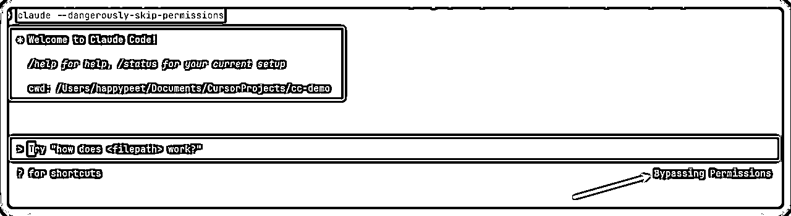

当然你在进入这个模式后，还是可以调整的，快捷键 shift+tab 就可以调整

## 8、记忆文件

### 全局记忆文件

目录：~/.claude/CLAUDE.md

下面是我的文件：

```
# 所有交互回答都使用中文

# 启动并行的代理执行任务

# 搜索约定
- 如需简单字符串匹配 → Grep
- 如需结构化/跨语言模式匹配 → 请优先使用 Bash(ast-grep …)，示例：
  Bash(ast-grep -p '$FUNC($ARG)' src/)

# 环境约定
- python环境：python3 pip3
- nodejs环境：node npm
- docker环境：docker%
```

### 项目记忆文件

目录：项目目录下的 CLAUDE.md 文件

如果是已经有代码的项目，建议使用 /init 命令自动生成


## 9、使用前面的消息提示词

使用场景：想恢复到前面的对话

使用方式：两次 esc 按键。


选择第 3 项就会回到之前的对话框。这样如果你觉得不合适你的提示词，可以在原来的基础之上继续修改。


## 10、如何恢复代码

类似 Cursor checkpoint 功能。

使用场景：后悔他写的代码了，想恢复到前面的

使用方式：

### 简单方式：直接提示词

```
回滚到上次的代码
```

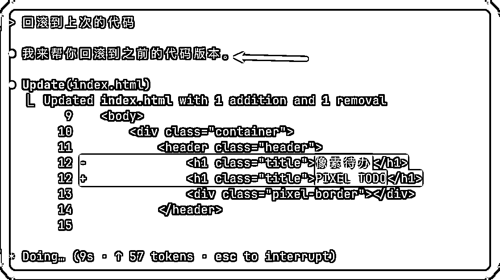

### 高级方式：使用 git

待完善。

涉及到 git 的概念

使用 git 提交每次的记录，结合自定义 commands 命令。

就可以使用 git 精确回滚代码。

## 11、恢复对话/查看聊天记录

使用场景：

使用方法：/resume 命令，或者使用 cladue -c claude -r

```
# 直接进入上次的对话中
claude -c 
```

```
# 选择对话
claude -r
```

## 12、执行终端命令

使用场景：查看当前目录，或者一些特殊的命令的时候

使用方式：! 英文的感叹号，就会进入命令行模式


查看当前目录


查看当前文件列表


## 13、监控使用量

### 按天使用量：

```
npx ccusage@latest
```

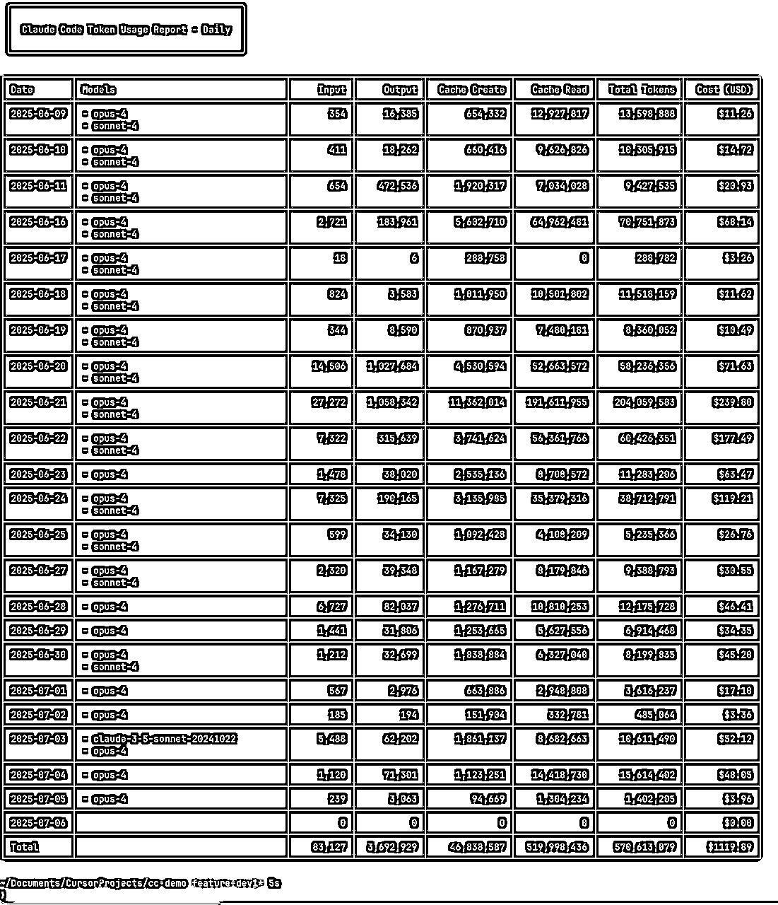

实时采集量命令：

```
npx ccusage@latest  blocks --live
```

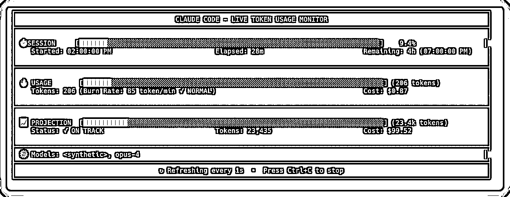

## 14、自选题：MCP

使用场景：很多场景都适合

使用方法：先安装 MCP

MCP 全称 Model Context Protocol，它就是给 AI 装“插件”的通用插座——把各种外部工具（爬虫、数据库、API……）接进来，让像 Cursor、Claude 之类的 AI 助手瞬间拥有新技能。

所以你可以把 MCP 想成“用 USB 让不同设备秒连电脑”的那套逻辑，只不过这里的“电脑”换成了 LLM。

```
claude mcp add playwright -s user -- npx @playwright/mcp@latest
```

这里以打开小红书的例子来看一下

```
在浏览器里打开小红书,搜索“Claude Code”,按照浏览量多的前面排序，将前10的结果总结给我
```

搜索结果：

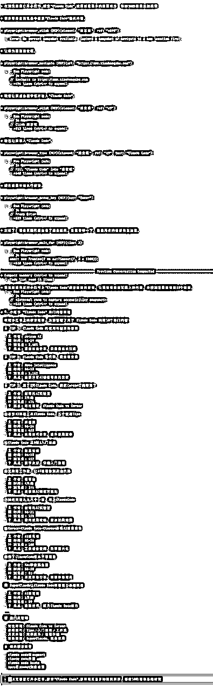

# 写在最后

看到这里，你可能会想："14个技能点，感觉好多啊..."

我想告诉你：罗马不是一天建成的，但每天进步1%，100天后你就是另一个人。

建议你这样做：

1.  收藏这篇文章，当作学习地图

1.  每天练习1-2个技能点

1.  实战中运用，加深理解

1.  两周后回来，你会感谢今天的自己

# 最后想说

在这个AI狂飙的时代，有人选择观望，有人选择恐惧，而聪明的人选择成长。

Claude Code的14个技能点，就是你成长的阶梯。

爬上去，你看到的将是完全不同的风景。

好了，今天的分享就到这里。

安啦，各位！

作为圈友直接分享给大家

链接：https://pan.quark.cn/s/9d53d4b11497

提取码：RY5W

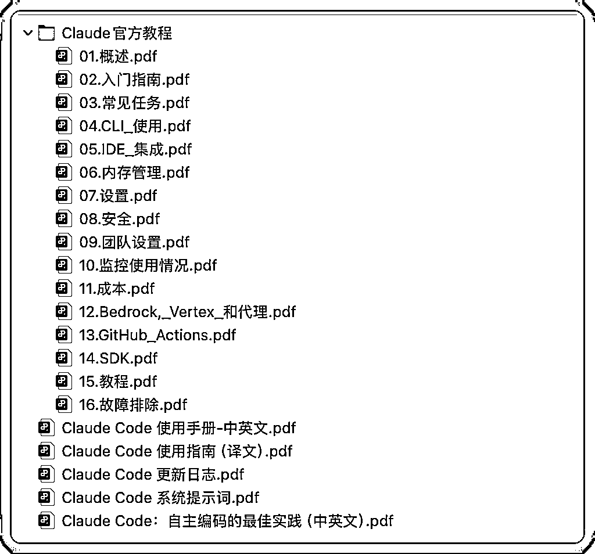

* * *

如果你觉得文章还不错，记得「点赞、转发、关注」，也可以动动你的手指点点「爱心」，你的爱心是我的持续输出的动力。我们一起在 AI 爆炸时代，充实自己，迎接 AGI 的到来。