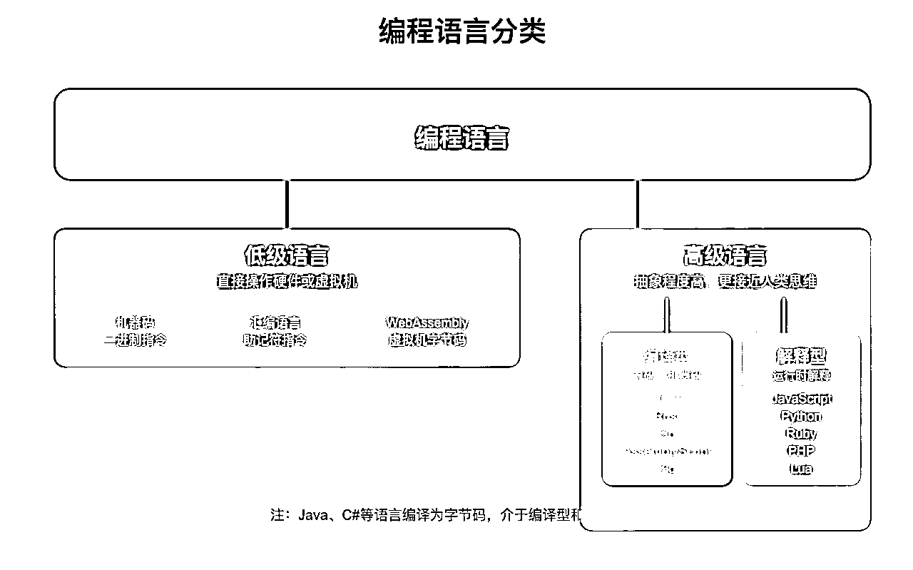
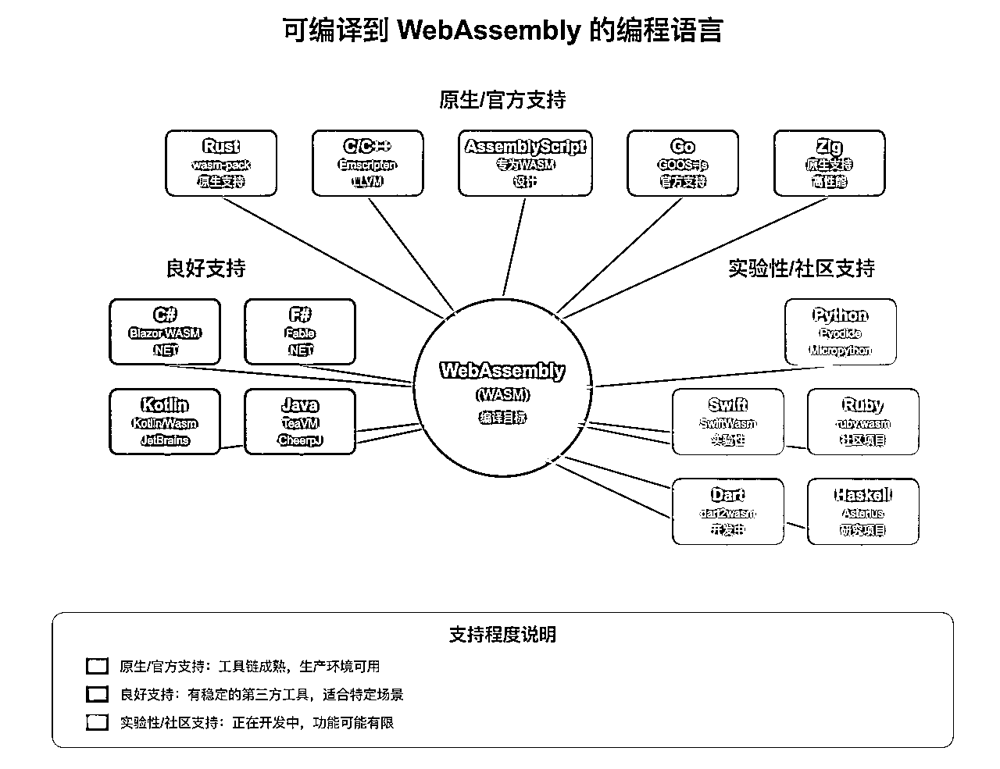
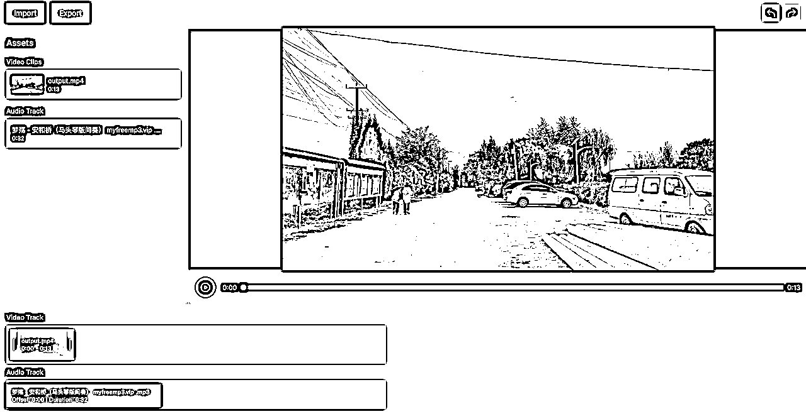
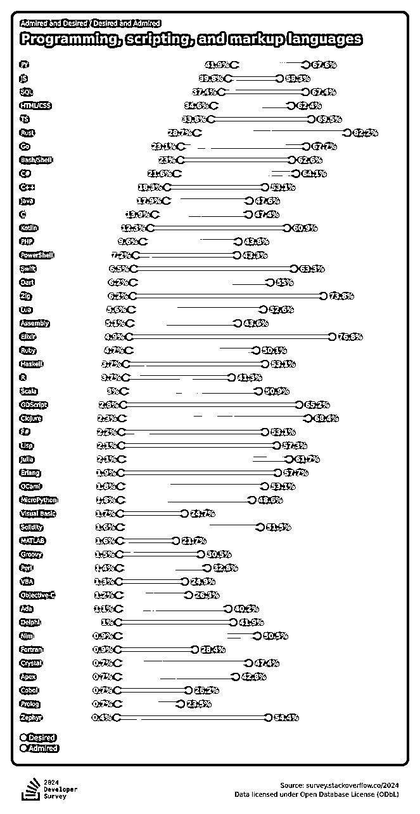
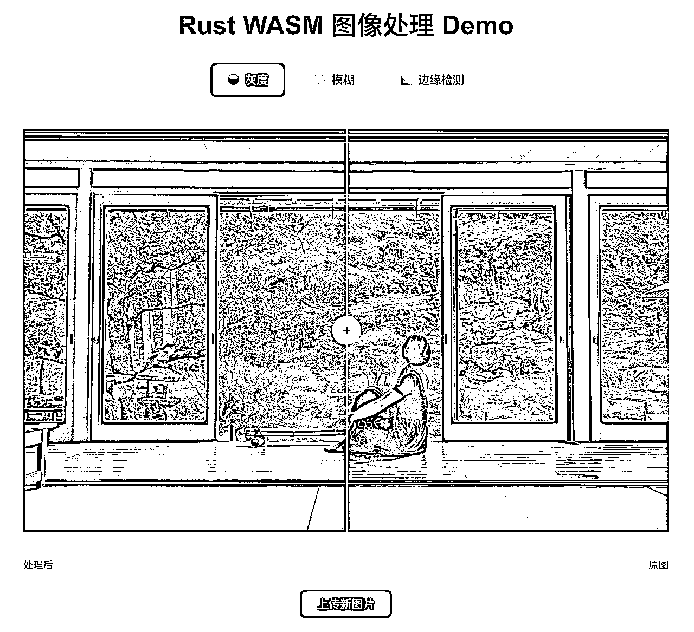
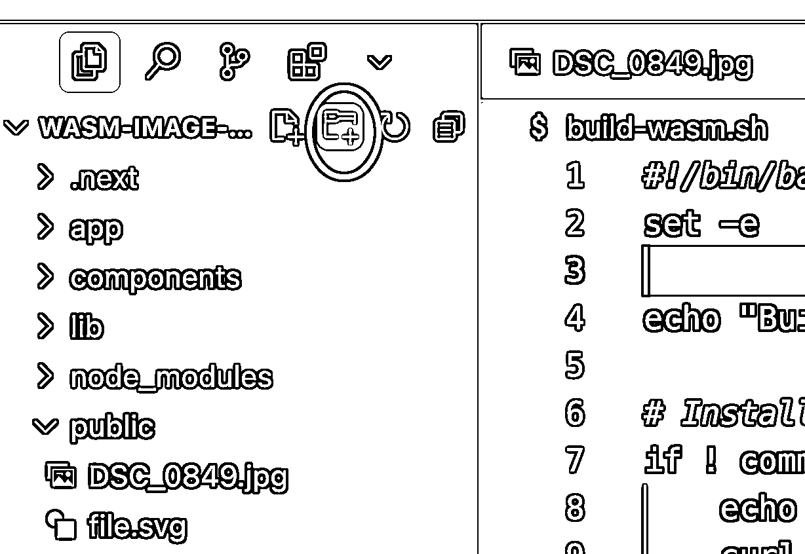

# 万字长文讲透Web开发早晚要掌握的WebAssembly（wasm）面向新手的教程

> 来源：[https://y0arjkskpp.feishu.cn/docx/FLBwdo4wfoyU9SxiTqLcN4F9nhc](https://y0arjkskpp.feishu.cn/docx/FLBwdo4wfoyU9SxiTqLcN4F9nhc)

大家好，我是蔡上上。之前在互联网大厂做了6年的程序员，现在在SCAI实验室做Web出海项目。本文源自我在SCAI实验室的一次分享，原因是SCAI实验室的有些小伙伴在项目中需要用到wasm，但之前并没有了解过。这也让我意识到，很有必要给一些没有相关知识的人把这一部分内容介绍一下。

Web出海是生财最近的超级标。很多没有技术背景的圈友，在AI的帮助下也能开发出不错的网站。但随着开发的深入，有些知识上的短板还是要补齐。WebAssembly目前在Web开发生态中占据着比较关键的生态位，随着开发的深入，你不可避免地会在某个节点用到它。

比如说，如果你的项目里有视频剪辑、音频处理、图像编辑、语音识别等功能，你很可能需要考虑一下wasm。

虽然现在有AI可以帮助写代码了，但是有些决策需要你自己定下来之后告诉AI，这个看我后面的介绍就会了解。现在市面上的wasm教程都非常讲的很专业，不适合非程序员观看。

本文旨在补齐这方面的信息缺失，给大家带来一个保姆级的教程。

本文面向的对象是非程序员背景，但目前正在使用AI来开发网站的朋友。因此，本教程会忽略一些不必要的技术细节。大部分的技术细节可以交给AI，我会在文中告诉你怎么跟AI说。但同时需要你至少知道怎么开发一个简单的网站，比如曾经跟过web航海或深海圈。你不需要非常了解技术，但至少知道JavaScript、NPM、vercel是啥。

本教程包含以下部分：

*   用非技术语言讲清楚什么是wasm

*   什么情况下应该用wasm

*   什么情况下不应该用wasm

*   如何使用wasm

*   wasm的一些可能的使用场景

#### 附：在SCAI实验室的分享录屏：

# 什么是wasm

WebAssembly，简称wasm，是一种在浏览器中运行的低级编程语言。

## 编程语言的种类



编译型的语言，是事先把高级语言编译成机器码，因此运行的时候就直接运行机器码，速度会更快。

而解释型的语言，是在运行的时候才现场编译，因此多了一个编译的时间，速度会更慢。

网站开发使用的是JavaScript，属于解释型语言，在计算密集型的任务时，速度相比编译型的语言要慢一个数量级。因此浏览器场景下，非常需要一种计算效率远远高于JS的语言。

在传统的机器上，有汇编语言（Assembly），这是一种低级语言，可以直接跟机器交互（可以参考雷军下面的代码），因此速度非常快。于是Web端也诞生了类似的汇编语言WebAssembly。

几乎大部分的主流语言都可以编译成WebAssembly。因此这就体现了wasm的另一个优点，就是它可以使用其他语言的库。JavaScript毕竟只是一种语言，很多情况下，JavaScript是没有特别好的库可以使用的。



### 典型的计算密集型任务

下面列举了一些适合wasm的计算密集型任务，如果你不懂技术，可以只看第一列，大致了解一下它擅长的领域。里面提到的专业名词无需掌握。

### 小彩蛋：雷军1994年写的代码（汇编语言）

```
;
; RI.ASM Revision 2.12 [ July 12, 1994 ]
Revision equ 'V2.12 '
;
;
;
;  RAMinit Release 2.0 
;  Copyright (c) 1989-1994 by Yellow Rose Software Co.
;  Written by Mr. Leijun
;
;  Function:
;  Press HotKey to remove all TSR program after this program
;
;

; ..........................................................................
; Removed Softwares by RI:
; SPDOS v6.0F, WPS v3.0F
; Game Busters III, IV
; NETX ( Novell 3.11 )
; PC-CACHE
; Norton Cache
; Microsoft SmartDrv
; SideKick 1.56A
; MOUSE Driver
; Crazy (Monochrome simulate CGA program)
; RAMBIOS v2.0
; 386MAX Version 6.01
; ..........................................................................
; No cancel softwares:
; Windows 3.1 MSD
;
; No removed TSR softwares:
; MS-DOS fastopen
; Buffers, Files ... (QEMM 6.0)
; QCache (386MAX 6.01)
; ..........................................................................
;
COMMENT

V2.04 Use mouse driver software reset function to initiation mouse
2/17/1993 by Mr. Lei and Mr. Feng
V2.05 RI cannot work in Windows DOS prompt
3/9/1993 by Mr. Lei
V2.06 1\. When XMS cannot allocate 1K memory, RI halts.
2\. RI repeat deallocates EMS memory.
V2.07 HotKey Setup Error
4/25/1993 by Mr. Lei
V2.08 KB Buffer
V2.10 1\. Release high memory blocks (EMM386 QEMM386 S-ICE 386MAX)
2\. RI copies flag
V2.12 1\. Exists a critical error in Init 8259 procedure
2\. Save [40:F0--FF] user data area

dosseg
.model tiny
.code
locals @@
org 100h

Start: jmp Main
org 103h

True equ 1
False equ 0
MaxHandles equ 100h

INT3 macro
out 0ffh,al
endm
;
; HotKey Status Test Var
; --------------- ---------------
;
; 7 6 5 4 3 2 1 0 417 418 496
; . . x . x . . . Left Alt is pressed 8 2
; x . . . x . . . Right Alt is pressed 8 8
; . . . x . x . . Left Ctrl is pressed 4 1
; . x . . . x . . Right Ctrl is pressed 4 4
; . . . . . . x . Left Shift is pressed 2
; . . . . . . . x Right Shift is pressed 1
;
LeftAlt equ 00101000b
RightAlt equ 10001000b
LeftCtrl equ 00010100b
RightCtrl equ 01000100b
LeftShift equ 00000010b
RightShift equ 00000001b
HotKey db LeftCtrl or RightCtrl

DataBegin dw 0
NextDataSeg dw 0ffffh
oldInt2F_addr dw 0, 0
XMS_control dw 0, 0
Handle_begin dw 0
cvtOfs dw 0 ; DOS 3.0 equ 0 and above DOS 4.0 is 1
org 104h
db 0dh
db Revision
db ??date
db 26
org 114h
tsrLength dw 0
MachineID db 0FCh ; IBM PC/AT

AuxHotKey db 0 ; 2Dh ; 'X' Scan Code
AuxHotKeyName db 'X$ '
Power db True
Flag db '!'
Kbd102 db 0
NoFlag db 0
StopFlag db 1
DosEnv dw 0
WorkSeg dw 0
PrevDataSeg dw 0
Copies db '1'
old_8259 db 0 ; 21h port
db 0 ; a1h port

Status dw 0
XMSbit equ 00000001b
EMSbit equ 00000010b
SKbit equ 10000000b

GoINT1C: db 0eah
oldInt1C_addr dw 0, 0
newINT1C:
test cs:Status, SKbit
jnz GoINT1C
cmp cs:StopFlag, 0
jz @@0
;
; Mr. Lei 2/8/1993
; Problem: if WPS quit and reenter, old RI cann't control keyboard. ;
push ds
push ax
xor ax, ax
mov ds, ax
mov ax, ds:[94]
cmp ax, offset NewInt9
pop ax
pop ds
jnz GoINT1C
mov cs:StopFlag, 0

@@0: push ax
push ds
push es
xor ax, ax
mov ds, ax
mov es, ds:[94+2]
cmp word ptr es:[101h], 'IE' ; 'LEI'
jz @@1
cli
mov cs:StopFlag, 1
mov ax, ds:[94]
mov cs:oldINT9_addr2, ax
mov ax, ds:[94+2]
mov cs:oldINT9_addr2[2], ax
mov ds:[94], offset newINT9_2
mov ds:[94+2], cs
sti
@@1: pop es
pop ds
pop ax
jmp GoINT1C

; ----------------------------------------------------------------------
; INT2F Func
;
; AX = C0D7h Return RI segment in AX
; AX = C0D8h Removes all TSR programs after RI
; AX = C0D9h Removes all TSR programs include RI
; AX = C0DAh Removes all RI copies
; ----------------------------------------------------------------------

newINT2F:
cmp ax, 0c0d7h ; LEI Hanzi GB Code
jnz @@1
push cs
pop ax
iret
@@1: cmp ax, 0c0d7h+1
jnz @@2
jmp KeepSelf
@@2: cmp ax, 0c0d7h+2
jnz @@3
jmp NoKeepSelf
@@3: cmp ax, 0c0d7h+3
jnz @@9
mov cs:NextDataSeg, -1
mov cs:Copies, '1'
jmp NoKeepSelf
@@9: jmp dword ptr cs:oldInt2F_addr

CallInt9:
ret

newINT9_2:
mov cs:NoFlag, 1
pushf
db 9ah ; call far ptr oldint9_addr
oldInt9_Addr2 dw 0, 0
jmp newINT9_proc

newINT9:
pushf
db 9ah ; call far ptr oldint9_addr
oldInt9_Addr dw 0, 0 cmp cs:NoFlag, 0
jz newINT9_proc
mov cs:NoFlag, 0
iret
newINT9_proc:
cmp cs:Flag, '!' ; busy ?
jnz @@0
iret
@@0:
mov cs:Flag, '!' ; set busy flag
push ax ; cmp hot key
push bx
push es
mov ax,40h
mov es,ax

cmp cs:AuxHotKey, 0
jz @@_1
mov bx, es:[1ah]
cmp bx, es:[1ch]
jz @@10
push bx
mov bl, es:[bx+1]
cmp bl, cs:AuxHotKey
pop bx
jnz @@10
@@_1:
mov ah,es:[17h] ; test CTRL SHIFT ALT
mov al,cs:HotKey
push ax
and ax,0f0fh
cmp al,ah
pop ax
jnz @@10 cmp cs:Kbd102, True
jnz @@1
shr al, 1
shr al, 1
shr al, 1
shr al, 1
push ax
mov ah, es:[18h]
and ax, 303h
cmp al, ah
pop ax
jnz @@10
mov ah, es:[96h]
shr ax, 1
shr ax, 1
and ax, 303h
cmp al, ah
jnz @@10 cmp cs:AuxHotKey, 0
jz @@_3
inc bx
inc bx
cmp bx, 3eh
jb @@_2
mov bx, 1eh
@@_2:
mov es:[1ah], bx
@@_3:
call IsWinDos
or ax, ax
jz @@1
call Beep
@@10:
sti
pop es
pop bx
pop ax
mov cs:Flag, ' ' ; no busy
iret
@@1: ; OK
pop es
pop bx
pop ax

KeepSelf:
call RemoveTSR
push es
mov es,cs:WorkSeg
mov dx,es:tsrLength
mov di,dx
mov al,0h ; Aug 24, 1993
mov cx,100h
rep stosb
pop es
int 27h

NoKeepSelf:
mov ax,0e07h
int 10h
mov cs:clsStr, 47h ; Color (White in Red)
call RemoveTSR
dec cs:Copies
call RestoreSelfIntVec
push es
cmp cs:PrevDataSeg, 0
jz @@1
mov es, cs:PrevDataSeg
mov es:NextDataSeg, -1
@@1: pop es
mov ax, 4c00h
int 21h

; ---------------------------------------------------------------------------

IsWinDOS:
mov ax, 1600h
int 2fh
cmp al, 01h
jz @@9 cmp al, 0ffh
jz @@9 ; Windows/386 Version 2.X
cmp al, 00h
jz @@1 cmp al, 80h
jnz @@9 ; Windows 3 in enhanced mode
; Version number in AL/AH
@@1:
mov ax, 4680h
int 2fh
cmp al, 80h
jnz @@9
xor ax, ax
jmp @@10
@@9: mov ax, 1
@@10: ret

; -----------------------------------------------------------------------
RestoreSelfIntVec:
cmp Copies, '0'
jz @@0
ret
@@0:
cli
push cs
pop ds
xor ax, ax
mov es, ax
mov si, offset oldInt9_Addr
mov di, 94
movsw
movsw
mov si, offset oldInt2F_Addr
mov di, 2Fh4
movsw
movsw
mov si, offset oldInt1C_Addr
mov di, 1Ch4
movsw
movsw
sti
ret

; ------------- KERNEL PROGRAM ----------------------------------------------
RemoveTSR:
pop ax
cli ; Set stack
mov sp, cs
mov ss, sp
mov sp, 100h
sti
push ax

cmp cs:Power, True
jnz @@1
call Init8259
@@1:
push cs
pop ds
@@_0:
mov ax,ds:NextDataSeg
cmp ax, -1
jz @@_1
mov cs:PrevDataSeg, ds
mov ds, ax
jmp @@_0
@@_1: mov si,ds:DataBegin
mov cs:WorkSeg, ds
lodsw
cmp ax, 'XX'
jz @@_2
call Beep
ret
@@_2:
call RestoreEnvStr
call RestoreMCB ; restore current mcb
call CloseFiles
call RestorePort
call RestoreLEDs
call RestoreVecList ; Restore vectors list
call RestoreFloppyParam
cmp cs:Power, True
jnz @@2
call RestoreCVTchain ; Restore cvt chain
call RestoreMemoryManager
@@2:
call RestoreBiosData
call Enable8259
mov ah, 1 int 16h

call RestoreClockSpeed
call CloseSpeaker
call ResetDisk
call UpdateTime

call ClosePRN
mov bx,cs:WorkSeg
mov ah,50h
int 21h ; Set PSP segment
mov ax,3 int 10h ; Set display mode

call InitPRN
call InitMouse
mov al, cs:Copies
cmp al, '1'
ja @@_sh1
mov cs:ShowCopies, ''
jmp @@_sh2
@@_sh1: mov cs:ShowCopies, al
@@_sh2:
mov si, offset clsStr
call ColorPrintStr
mov cs:Flag, ' ' ; no busy
cmp Copies, '1'
jnz @@_end
mov cs:StopFlag, 0
@@_end:
call ClearKB_buffer
ret

Beep:
mov ax,0e07h
int 10h
ret

; #########################################################################

ClearKB_Buffer:
push es
push bx
mov bx, 0040h
mov es, bx
cli
mov bx, es:[1ah]
mov es:[1ch], bx
sti
pop bx
pop es
ret

Init8259:
; cmp cs:Copies, '1'
; jz @@1
; ret
@@1:
cmp cs:MachineID, 0fch
ja @@pc_xt
@@AT:
mov bx,870h ;
mov al,0 ;
out 0F1h,al ;
jcxz $+2
jcxz $+2
mov al,11h ; ICW1
out 0A0h,al
jcxz $+2
jcxz $+2
out 20h,al
jcxz $+2
jcxz $+2
mov al,bl ; ICW2
out 0A1h,al
jcxz $+2
jcxz $+2
mov al,bh
out 21h,al
jcxz $+2
jcxz $+2
mov al,2 ; ICW3
out 0A1h,al
jcxz $+2
jcxz $+2
mov al,4
out 21h,al
jcxz $+2
jcxz $+2
mov al,1 ; ICW4
out 0A1h,al
jcxz $+2
jcxz $+2
out 21h,al
jcxz $+2
jcxz $+2
mov al,0FFh ; OCW1
out 0A1h,al
jcxz $+2
jcxz $+2
out 21h,al
ret
@@PC_XT:
mov al,13h ; ICW1
out 20h,al
jcxz $+2
jcxz $+2
mov al,8 ; ICW2
out 21h,al
jcxz $+2
jcxz $+2
mov al,9 ; ICW4
out 21h,al
jcxz $+2
jcxz $+2
mov al,0FFh ; OCW1
out 21h,al
ret

Enable8259:
mov ax, word ptr cs:old_8259
out 021h,al
jcxz $+2
jcxz $+2
mov al,ah
out 0a1h,al ; DEC PC Bus Mouse
ret ; July 1994 by Mr. Lei

; -------------------------------------------------------------------------

RestoreBiosData:
lodsw
cmp ax, '--'
jz @@1
call Beep
ret
@@1: push es
push di
mov di, 40h
mov es, di

mov di, 10h
movsw
mov di, 0a8h ; [40h:a8h]
movsw
movsw
mov di, 49h
mov cx, 1dh
rep movsb

mov di, 0f0h ; User data
mov cx, 8
rep movsw

pop di
pop es
ret

; -------------------------------------------------------------------------

RestoreMCB:
push ds
push es
lodsw ; 'MZ'
@@0: lodsw
cmp ax, 'MM'
jz @@1
mov es,ax
xor di,di
movsb
movsw
movsw
inc ax
mov bx, ds
cmp ax, bx
jz @@10
mov byte ptr es:[8], 0 ; Aug 24, 1993
@@10: cmp byte ptr es:[0], 'Z'
jnz @@0
mov byte ptr es:[10h], 0
jmp @@0
@@1:
pop es
pop ds
ret

; -------------------------------------------------------------------------
CloseFiles:
mov ax, 5 ; Begin handle
push ds
push si
mov cx, 15 ; Max handle
sub cx, ax
inc cx
mov bx, ax
@@1: push bx
push cx
mov ah, 3eh
int 21h
pop cx
pop bx
inc bx
loop @@1
pop si
pop ds
ret

; -------------------------------------------------------------------------
RestorePort:
mov di, 40h ; restore port
mov es, di
xor di, di
mov cx, 8
rep movsw
ret

; -------------------------------------------------------------------------
RestoreLEDs:
lodsb
and al, 11110000b ; LED status
mov ah, es:[17h]
and ah, 00001111b
or ah, al
and ah, 0f0h ; Clear CTRL ALT SHIFT
mov es:[17h], ah
ret

; -------------------------------------------------------------------------
RestoreEnvStr:
lodsw
push si
push di
push ds
push es
mov es, cs:DosEnv
mov ds, ax
xor si, si
mov di, si
@@0: lodsb
or al, al
jnz @@1 cmp byte ptr ds:[si], 0
jz @@2
@@1: stosb
jmp @@0
@@2: stosb
stosb
pop es
pop ds
pop di
pop si
ret

; -----------------------------------------------------------------------
RestoreVecList:
xor ax,ax
mov di,ax
mov es,ax
mov cx,100h
@@0: lodsw
xchg dx, ax
lodsw
cmp dx, 'EL'
jnz @@1 cmp al, 'I'
jnz @@1
sub cl, ah
push cx
mov cl, ah
mov ax, es:[di-4]
mov dx, es:[di-2]
@@a: stosw
xchg ax, dx
stosw
xchg ax, dx
loop @@a
pop cx
or cx, cx
jz @@9
jmp @@0
@@1:
xchg ax, dx
stosw
xchg ax, dx
stosw
loop @@0
@@9:
ret

;----------------------------------------------------------------------------
RestoreFloppyParam: ; Mr. Lei 2/10/1992
push es
push ax
xor ax, ax
mov es, ax
mov byte ptr es:[525h], 2
pop ax
pop es
ret

;---------------------------------------------------------------------------
RestoreCVTchain:
lodsw
cmp ax, 'VC'
jz @@_0
call Beep
ret
@@_0:
push ax
push cx
push es

; -----------------------------------------------------------------
lodsw ; DPB
mov di, ax
lodsw
mov es, ax
@@1: lodsb
inc di
stosb
add di, cs:cvtOfs
add di, 10h
movsw
movsw
les di, es:[di+2]
cmp di, -1
jnz @@1

; -----------------------------------------------------------------
lodsw ; DCB
mov di, ax
lodsw
mov es, ax
xor ax, ax
dec ax
stosw

; -----------------------------------------------------------------
lodsw ; Device Driver Chain
mov di, ax
lodsw
mov es, ax
xor cx, cx
@@9: push di
mov cl, 5
rep movsw
pop di
les di, es:[di]
mov ax, di
inc ax
jnz @@9
pop es
pop cx
pop ax
ret

; ----------------------------------------------------------------------------
RestoreMemoryManager:
test cs:Status, XMSbit
jz @@1
call LoadXMSstatus
@@1:
test cs:Status, EMSbit
jz @@2
call LoadEMSstatus
@@2:
ret

LoadEMSstatus:
lodsw
cmp ax, 'ME'
jz @@_0
call Beep
ret
@@_0:
lodsw
mov cx, ax
xor dx, dx
@@_1: push ds
push si
push dx
push cx

@@0: cmp dx, ds:[si]
jz @@1
add si, 4
loop @@0

push cx
mov cx, 5
@@0: mov ah, 45h ; Deallocate Handle and Memory
int 67h
or ah, ah
jz @@1
loop @@0
@@1: pop cx

@@1:
pop cx
pop dx
pop si
pop ds
inc dx
cmp dx, 100h
jb @@_1
shl cx, 1
shl cx, 1
add si, cx
ret

LoadXMSstatus:
lodsw
cmp ax, 'MX'
jz @@_0
call Beep
ret
@@_0:
lodsw
mov cx, ax
jcxz @@5
@@1:
lodsw
mov dx, ax
@@2: push dx
mov ah, 0ah ; free
call dword ptr cs:xms_control
or ax, ax
pop dx
jnz @@4 cmp bl, 0abh
jnz @@4
push dx
mov ah, 0dh ; unlock
call dword ptr cs:xms_control
or ax, ax
pop dx
jmp @@2
@@4: loop @@1
@@5: ret
endp

; -----------------------------------------------------------------------
CloseSpeaker:
in al, 61h
and al, 0fch
out 61h, al
ret

; -----------------------------------------------------------------------
RestoreClockSpeed:
mov al, 00110110b
out 43h, al
xor ax, ax
out 40h, al
out 40h, al
ret

; -----------------------------------------------------------------------
ResetDisk:
xor ax, ax
xor dx, dx
int 13h ; Restore A
inc dx
int 13h ; Restore B
mov dl, 80h
int 13h ; Restore C
ret

; --------------------------------------------------------------------------
ClosePRN:
mov ah, 51h ; Get PSP seg
int 21h
mov es, bx
mov ax, es:[16h] ; Prev PSP seg
cmp ax, bx
jnz @@9
mov ax, 3e00h ; COMMAND
mov bx, 4 int 21h
@@9:
ret

InitPRN:
mov ax, 3e00h
mov bx, 4 ; PRN
int 21h
mov ax, 3d01h
mov dx, offset PRNname
push cs
pop ds
int 21h
ret
PRNname db 'PRN',0

InitMouse: ; 2/16/1993 by Mr. Lei
push es
xor ax, ax
mov es, ax
cmp word ptr es:[33h4+2], 0
jz @@0 cmp word ptr es:[33h4], 0
jz @@0
mov ax, 21h
int 33h ; Hook Mouse Interrupt
@@0: pop es
ret

; ------------- CMOS CLOCK set to System -----------------------------------
UpdateTime:
call GetRealTime
mov ah, 2dh
int 21h
ret

GetRealTime:
mov ah,2 int 1Ah
mov al,ch
call bcdxchg
mov ch,al
mov al,cl
call bcdxchg
mov cl,al
mov al,dh
call bcdxchg
mov dh,al
mov dl,0
ret

BCDxchg:
push ax
push cx
mov cl,4
shr al,cl
pop cx
mov bl,0Ah
mul bl
pop bx
and bl,0Fh
add al,bl
ret

; -----------------------------------------------------------------------
; Display string
ColorPrintStr:
lodsb
mov bh, al ; color
xor cx, cx
mov dx, 014fh
mov ax, 0600h
int 10h

mov ah, 02 ; GotoXY (0, 0)
xor dx, dx
mov bh, 0 int 10h
PrintStr:
push cs
pop ds
xor bx, bx
@@1: lodsb
cmp al, '$'
jz @@2
or al, al
jz @@2
mov ah, 0eh
int 10h
jmp short @@1
@@2: mov al, cs:clsStrcolor
mov cs:clsStr, al
ret

; -----------------------------------------------------------------------
Self dw 0
clsStrcolor db 17h
clsStr db 17h ; Color (White in Blue)
db ' RAMinit Version 2.12 (c) 1989-1994 by KingSoft Ltd. Mr. Leijun'
db 0dh,0ah
db ' ['
ShowCopies db ''
db '] Activate...',0ah,0dh,'$'

endTSR equ $
mcbList equ offset endTSR + 2 + 2
vecList equ mcbList + 710 + 2 + 10h + 1 + 400h
devLink equ vecList + 4 + 5  26 + 4 + 10  30h + 4
xmsList equ devLink + 2 + MaxHandles  2
emsList equ xmsList + 4 + 1024
crtMode equ emsList + 2 + 1Dh + 4 + 10h
tsrLen equ crtMode + 1
;
; DOS Environment Reserved by RI
; --------------------------------------------------
; Flag 'XX' 2 bytes
; Environment Segment 1 word
; Free MCBs <=710 bytes
; MCB segment 1 word
; MCB 5 bytes
; End flag 'MM' 1 word
; COM LPT ports 10h bytes
; LEDs status 1 bytes
; Packed vectors list <=400h bytes
; Flag 'CV' 2 bytes
; CVT First DPB pointer 4 bytes
; DPBs data <=526 bytes
; First DCB pointer 4 bytes
; Pointer to NUL 4 bytes
; All device driver datas <=30h10 bytes
; Flag 'XM' 2 bytes
; XMS free handle counter 2 bytes
; EMS free handle list <=100h4 bytes
; Flag 'EM' 2 bytes
; EMS free handle counter 2 bytes
; EMS free handle list <=1024 bytes
; EMS handle 1 word
; Number of pages 1 word
; Flag '--' 1 word
; Equipment List 1 word
; CRT 40:49h-66h 1dh bytes
; 40:A8h 1 dword
; BIOS User Data Area 40:F0--FF 10h bytes
; **
;
main: jmp main0

Print Macro Str
Lea dx, Str
call DisplayStr
endm

InstMsg db 'RAMinit Version 2.12 '
db 'Copyright (c) 1989-1994 by KingSoft Ltd. ',0dh,0ah,'$'
Msg0 db 'Already installed !',0dh,0ah,0ah
db 'For Help, type RI /?. ',0dh,0ah,'$'
Msg_0 db 0ah,'Residents a new RAMinit copy [y/n] ? $'
Msg_2 db 'OK, RI No.'
Msg_RI db '2'
db ' residents successful !', 0dh,0ah,'$'
Msg1 db 'Activate with: $'
KeyMsg db 'Right_Shift$'
db 'Left_Shift$ '
KMsg1 db 'Left_Ctrl$ '
db 'Left_Alt$ '
db 'Right_Ctrl$ '
db 'Right_Alt$ '
KMsg2 db 'Ctrl$ '
db 'Alt$ '
db 'Ctrl$ '
db 'Alt$ '
PlusMsg db ' + $'
crlf db 0dh,0ah,'$'

HelpMsg db 'Programmed by Mr. Leijun Dec 1992', 0dh,0ah,0ah
db 'Usage: RI [options]',0dh,0ah,0ah
db '/H,/? Display this screen',0dh,0ah
db '/CLS Removes all TSR programs after current RI',0dh,0ah
db '/RET Removes TSR programs include current RI',0dh,0ah
db '/NEW Residents a new data copy of current environment',0dh,0ah
db '/ALL Removes all RI copies and all other tsr programs',0dh,0ah
db '/Sxyy.. Define Hotkey x=AuxHotkey yy..=shift status',0dh,0ah
db ' x=auxiliary hotkey (default is X) ',0dh,0ah
db ' x equ 1 means need AuxHotkey',0dh,0ah
db ' yy..=shift status [CAScas]',0dh,0ah
db ' C: Left Ctrl A: Left Alt S: Left Shift',0dh,0ah
db ' c: Right Ctrl a: Right Alt s: Right Shift',0dh,0ah,0ah
db 'Example: RI /S1c means Hotkey is Right_Ctrl+X',0dh,0ah
db ' RI /S0Cc means HotKey is Left_Ctrl+Right_Ctrl',0dh,0ah
db ' RI /CLS equals simply press hotkey',0dh,0ah
db ' RI /RET Removes all TSRs after current RI and this RI',0dh,0ah
db 0ah
db 'Contact me for RAMinit problems: (01)2561155 Call 1997',0dh,0ah
db '$'
ErrMsg db 'ERROR: Invalid options !',0dh,0ah,0ah,'$'
WinErr db 7, 'Sorry, I cannot work in Windows DOS environment.',0dh,0ah,'$'
SetMsg db 7, 'Defines new Hotkey successful !',0dh,0ah,0ah,'$'
tsrOK db False

Main0:
cld
Print instMsg
call IsWinDos
or ax, ax
jz @@1
Print WinErr
mov ax, 4c00h
int 21h
@@1:
call HotKeyValid
mov cs:Status, 0
call EMS_test
call CmpDosVer
call CmpSideKick
call GetMachineID
call ModifyHotKeyPrompt

mov ax, 0c0d7h
int 2fh
mov es, ax
cmp word ptr es:[101h], 'IE' ; 'LEI'
jnz @@0
mov cs:Self, ax
@@0:
call CmdLine
call PrintHotKeyPrompt

cmp cs:tsrOK, true
jz @@2
call tsrReplyOK
@@2: cmp cs:tsrOK, true
jnz @@_2
call PrintCopies
@@_2:
mov word ptr cs:[100h], 'EL'
mov byte ptr cs:[102h], 'I'

push cs
pop es
push cs
pop ds
std
mov si, offset eof
mov cx, eof - offset Here
mov di, tsrLen
add di, cx
inc cx
rep movsb
cld
mov bx, tsrLen
jmp bx

Here:
mov ax,cs
mov es,ax
mov di,offset endTSR
mov cs:DataBegin, di
mov cs:NextDataSeg, -1
mov ax, 'XX'
stosw
in al, 0a1h
mov ah, al
in al, 21h
push ax
mov word ptr cs:old_8259, ax
xor ax, ax
out 21h,al ; CLI
call SaveOthers
call SetSelfInt
call BackupVecList
cmp cs:Power, true
jnz @@20
call BackupCVTchain
call BackupMemoryManager
@@20:
call BackupBiosData

sti
mov cs:Flag, ' ' ; no busy
mov cs:StopFlag, 0 ;

mov cs:tsrLength, di
call SetDosEnvSeg
cmp cs:Self, 0
jz @@29
push cs
pop ds
push cs
pop es
cld
mov cx, cs:tsrLength
mov si, cs:DataBegin
sub cx, si
mov di, 120h
mov cs:DataBegin, di
rep movsb
mov cs:tsrLength, di
@@29:
pop ax
out 21h, al ; STI
mov al, ah
out 0a1h, al
mov dx, cs:tsrLength
inc dx
int 27h

; ----------------------------------------------------------------------------
SetDosEnvSeg:
push ds
push es
mov ax, cs
@@10: mov es, ax
mov ax, es:[16h] ; Get father process psp segment
or ax, ax
jz @@11
mov bx, es
cmp ax, bx
jnz @@10
@@11:
mov es, word ptr es:[2ch] ; Get father process env segment
mov cs:DosEnv, es
pop es
pop ds
ret

; ----------------------------------------------------------------------------

SaveOthers:
mov ax, cs:[2ch] ; Env Seg
stosw
call backupMCB ; Current MCB
mov ax, 40h ; COM LPT Port
mov ds, ax
mov si, 0h
mov cx, 8
rep movsw

mov si, 17h ; LED status
lodsb
stosb
; call OpenLEDs
ret

; --------------------------------------------------------------------------
backupMCB:
mov ax, 'ZM'
stosw
push ds
push es
mov ah, 52h
int 21h ; Get MCB chain head
mov ax, es:[bx-2]
pop es
@@0: mov ds, ax
cmp byte ptr ds:[0], 'Z' ; End ?
jz @@20 cmp byte ptr ds:[0], 'M' ; Memory control block
jnz @@30 cmp word ptr ds:[3], 0 ; Nul mcb
jz @@10 cmp word ptr ds:[1], 0 ; Free MCB
jnz @@10
call SaveFreeMCB
@@10: inc ax
add ax, ds:[3]
jmp @@0
@@20:
call SaveFreeMCB
cmp ax, 0a000h
inc ax
jnb @@30
mov ax, 9fffh ; MS-DOS UMB
jmp @@0

@@30:
cmp ax, 0c000h ; 386MAX
ja @@90
mov ax, 0c020h
jmp @@0

@@90: ; Error ?
pop ds
mov ax, 'MM' ; Set MCB flag
stosw
ret

SaveFreeMCB:
stosw
xor si,si
movsb
movsw
movsw
ret
;
; push ax
; stosw
; xor si,si
; movsb
; movsw
; movsw
; pop ax
; cmp ax, 09fffh
; jnb @@3
; push ax
; push ds
; mov ds,ax
; cmp byte ptr ds:[0], 'M'
; pop ds
; pop ax
; jnz @@4
; mov ax, 09fffh ; MS-DOS UMB
; jmp @@0
; @@4: cmp ax, 0c000h
; ja @@3
; mov ax, 0c020h ; 386MAX
; jmp @@0
;
; --------------------------------------------------------------------------

OpenLEDs: push ax ; Open all LEDs
or al, 070h
mov ds:[17h], al
mov ah, 1 int 16h
mov cx, 4 ; Delay
@@20: push cx
xor cx, cx
@@21: loop @@21
pop cx
loop @@20
pop ax
mov ds:[17h], al
mov ah, 1 int 16h
ret

; --------------------------------------------------------------------------
SetSelfInt:
push es
push di

cmp cs:self, 0
jnz @@1
push cs
pop ds
mov ax,3509h
int 21h
mov word ptr cs:oldInt9_addr,bx
mov word ptr cs:oldInt9_addr[2],es
mov dx,offset NewInt9
mov ax,2509h
int 21h

mov ax,352Fh
int 21h
mov word ptr cs:oldInt2F_addr,bx
mov word ptr cs:oldInt2F_addr[2],es
mov dx,offset newInt2F
mov ax,252Fh
int 21h

mov ax,351Ch
int 21h
mov word ptr cs:oldInt1C_addr,bx
mov word ptr cs:oldInt1C_addr[2],es
mov dx,offset newInt1C
mov ax,251ch
int 21h
cli
jmp @@2
@@1:
mov es, cs:Self
inc es:Copies
@@_0: cmp es:NextDataSeg, -1
jz @@_1
mov es, es:NextDataSeg
jmp @@_0
@@_1: mov es:NextDataSeg, cs
@@2:
pop di
pop es
ret

; -----------------------------------------------------------------------
SaveCounter:
mov word ptr es:[di], 'EL'
mov byte ptr es:[di+2], 'I'
mov byte ptr es:[di+3], bl
xor bx, bx
add di, 4
ret

; -----------------------------------------------------------------------
DisplayStr: push cs
pop ds
mov ah, 9 int 21h
ret

; -----------------------------------------------------------------------
CmdLine:
push cs
pop ds
xor ax, ax
mov si, 80h
lodsb
or al, al
jnz @@1
ret
@@1:
mov cx, ax
dec ax
push ax
push si
@@0: lodsb
cmp al, ' '
jz @@0 cmp al, '/'
jnz @@2
lodsb
cmp al, 'S'
jz @@_2
cmp al, 's'
jnz @@2
@@_2:
call SetHotKey
Print SetMsg
mov ax, 4c00h
int 21h
@@2:
pop si
pop ax
push ax
push si
@@_3: lodsb
cmp al, 'A'
jb @@3 cmp al, 'Z'
ja @@3
add byte ptr ds:[si-1],20h ; DownCase
@@3: loop @@_3
pop si
pop cx

add si, cx
lodsb
cmp al, 's' ; CLS
jnz @@5 cmp word ptr ds:[si-3], 'lc'
jnz @@5 cmp cs:Self, 0
jz @Err
mov ax, 0c0d7h+1 int 2fh

@@5: cmp al, 'h' ; HELP
jz @help
cmp al, '?'
jz @help
cmp al, 't' ; RET
jnz @@6 cmp word ptr ds:[si-3], 'er'
jnz @@6
@@7:
cmp cs:Self, 0
jz @Err
mov ax, 0c0d7h+2 int 2fh
@@6: cmp al, 'w' ; NEW
jnz @@8 cmp word ptr ds:[si-3], 'en'
jnz @@8
mov cs:tsrOK, true
ret
@@8:
cmp al, 'l' ; ALL
jnz @@9 cmp word ptr ds:[si-3], 'la'
jnz @@9
mov ax, 0c0d7h+3 int 2fh
@@9:
cmp al, ' '
jnz @Err
ret

@Err:
Print ErrMsg
@help:
Print HelpMsg
mov ax, 4c00h
int 21h

;---------------------------------------------------------------------------
tsrReplyOK:
cmp cs:Self, 0
jz @@1
Print Msg0

push es
mov ax, cs:Self
@@_10: mov es, ax
mov ax, es:NextDataSeg
cmp ax, -1
jnz @@_10
mov ax, es

@@_0: push ax
dec ax
mov es, ax
mov bx, es:[3]
pop ax

add ax, bx
inc ax
mov es, ax
cmp word ptr es:[0], 'OC'
jz @@_0

mov bx, cs
cmp ax, bx
pop es
jz @@2
Print Msg_0
mov ah, 1 int 21h

push ax
Print crlf
pop ax

cmp al, 'y'
jz @@3 cmp al, 'Y'
jz @@3
@@2: ; Print Msg_1
mov ax, 4c01h
int 21h
@@3:
@@1: mov cs:tsrOK, true
ret

PrintCopies:
cmp cs:Self, 0
jz @@1
push es ; Added -by- Mr. Lei
mov es, cs:Self ; Aug 24, 1993
mov al, es:Copies
inc al ; Total RI copies
push ax ; Set es = current mcb
mov ax, cs
dec ax
mov es, ax
pop ax
mov cx, 5 ; Search end of file name
mov bx, 8
@@10: inc bx
cmp byte ptr es:[bx], 20h
jz @@20 cmp byte ptr es:[bx], 0ffh
jz @@20 cmp byte ptr es:[bx], 00h
jz @@20
loop @@10
@@20: ; Set current RI no
mov byte ptr es:[bx], ':' ; RI:2
mov byte ptr es:[bx+1], al
cmp bx, 8+7
jnb @@30
mov byte ptr es:[bx+2], 0
@@30:
pop es

mov cs:Msg_RI, al
Print Msg_2
@@1: ret

;---------------------------------------------------------------------------
; Backup Interrupt Vector List
;
BackupVecList:
push ds
push cs
pop es
xor si,si ; Vectors
mov ds,si
movsw
movsw
xor bx, bx
mov cx,00ffh
@@0: lodsw
xchg dx, ax
lodsw
cmp ax, es:[di-2]
jnz @@1 cmp dx, es:[di-4]
jz @@2
@@1: or bx, bx
jz @@3
call SaveCounter
@@3: xchg dx, ax
stosw
xchg dx, ax
stosw
loop @@0
jmp @@4
@@2: inc bx
loop @@0
call SaveCounter
@@4:
pop ds
ret
;
;-----------------------------------------------------------------------------
BackupCVTchain:
mov ax, 'VC'
stosw
push ax
push bx
push cx
push ds
push es
mov ah, 52h
int 21h ; ES:BX -- DOS table as described below

; --------------------------------------------------------------------
push es ; DPB chains
push bx
lds si, es:[bx]
push cs
pop es
mov ax, si
stosw
mov ax, ds
stosw
mov bx, cs:cvtOfs
xor cx, cx
@@1: mov al, ds:[si+1]
stosb
mov ax, ds:[si+bx+12h]
stosw
mov ax, ds:[si+bx+14h]
stosw
inc cx
lds si, ds:[si+bx+18h]
cmp si, -1
jnz @@1
; mov ax, 5
; mul cl
; add ax, 4
; add cs:tsrLength, ax
pop bx
pop es

; --------------------------------------------------------------------
push es ; DCB file control blocks
push bx
les bx, es:[bx+4]
@@11: cmp word ptr es:[bx], -1
jz @@10
les bx, es:[bx]
jmp @@11
@@10:
mov ax, es
xchg ax, bx
push cs
pop es
stosw
xchg ax, bx
stosw
pop bx
pop es
; add cs:tsrLength, 4

; ---------------------------------------------------------------------
push es ; Device Driver Chains
pop ds
add bx, 22h
mov si, bx ; NUL

pop es
mov ax, si
stosw
mov ax, ds
stosw
xor cx, cx
xor bx, bx
@@9: push si
mov cl, 5
rep movsw
inc bx
pop si
lds si, ds:[si]
mov ax, si
inc ax
jnz @@9

pop ds
pop cx
pop bx
pop ax
ret

; ----------------------------------------------------------------------------

BackupBiosData:
mov ax, '--'
stosw
push ds
push si
mov si, 40h
mov ds, si
mov si, 10h
movsw
mov si, 0a8h
movsw
movsw
mov si, 49h
mov cx, 1dh
rep movsb

mov si, 0f0h
mov cx, 8
rep movsw
pop si
pop ds
ret

; ---------------------------------------------------------------------------

BackupMemoryManager:
push cs
pop es
push ds
push es
call SaveXMSstatus
call SaveEMSstatus
pop es
pop ds
ret

;---------------------------------------------------------------------

SaveEMSstatus:
test cs:status, EMSbit
jnz @@1
ret
@@1:
mov ax, 'ME'
stosw
inc di
inc di
push di
mov ah, 4dh
int 67h
pop di
mov es:[di-2], bx
shl bx, 1
shl bx, 1
add di, bx
ret
; -------------------------------------------------------------------

SaveXMSstatus:
call XMS_test
test cs:status, XMSbit
jnz @@1
ret
@@1:
mov ax, 'MX'
stosw

mov dx, 1
call XMS_alloc
jnz @@_1
xor cx, cx ; XMS alloc failure
stosw
ret
@@_1:
push dx
sub dx, MaxHandles  10
@@2:
push dx
call XMS_Lock
pop dx
jnz @@3 cmp bl, 0a2h
jnz @@4
add dx, 10
jmp @@2
@@3: push dx
call XMS_unlock
pop dx
@@4:
mov cs:handle_begin, dx
pop dx
push dx
call XMS_bstat
xor cx, cx
mov cl, bl
inc cx
pop dx
call XMS_Free
mov dx, cs:Handle_begin

push cx
push cs
pop es
mov ax, cx
stosw
@@5: push dx
call XMS_Lock
pop dx
jnz @@6 cmp bl, 0a2h ; Handle invalid
jz @@7
@@6: call XMS_unlock
add dx, 10
jmp @@5
@@7: mov ax, dx
stosw
add dx, 10
loop @@5
pop cx
ret
; ------------------------------------------------------------------

XMS_test:
push es
mov ax, 4300h
int 2fh
cmp al, 80h
jnz @@9
mov ax, 4310h
int 2fh
mov cs:XMS_control, bx
mov cs:XMS_control[2], es
or cs:Status, XMSbit
@@9:
pop es
ret

XMS_stat:
mov ah, 0
call dword ptr cs:xms_control
mov hma_exist, dl
ret
hma_exist db 0

XMS_alloc:
mov ah, 9
call dword ptr cs:xms_control
or ax, ax
ret

XMS_lock:
mov ah, 0ch
call dword ptr cs:xms_control
or ax, ax
ret

XMS_unlock:
mov ah, 0dh
call dword ptr cs:xms_control
or ax, ax
ret
XMS_bstat:
mov ah, 0eh
call dword ptr cs:xms_control
or ax, ax
ret

XMS_free:
mov ah, 0ah
call dword ptr cs:xms_control
or ax, ax
ret

; ----------------------------------------------------------------------------
EMS_test:
push cs
pop ds
mov dx, offset EMMname
mov ax, 3d00h
int 21h
jc @@2
mov bx, ax
mov ah, 3eh
int 21h
or cs:Status, EMSbit
@@2:
ret
EMMname db 'EMMXXXX0',0

; -----------------------------------------------------------------------------

SetHotKey:
xor bx, bx
lodsb
push ax

@@1: lodsb
cmp al, 0dh
jz @@9 cmp al, 'C'
jnz @@2
or bl, LeftCtrl
jmp @@1
@@2:
cmp al, 'c'
jnz @@3
or bl, RightCtrl
jmp @@1
@@3:
cmp al, 'A'
jnz @@4
or bl, LeftAlt
jmp @@1
@@4:
cmp al, 'a'
jnz @@5
or bl, RightAlt
jmp @@1
@@5:
cmp al, 'S'
jnz @@6
or bl, LeftShift
jmp @@1
@@6:
cmp al, 's'
jnz @@7
or bl, RightShift
jmp @@1
@@7: pop ax
jmp @Err
@@9:
mov cs:HotKey, bl
pop ax
mov cs:AuxHotKey, 2dh ; 'X' scan key
cmp al, '1'
jz @@29
mov cs:AuxHotKey, 0
@@29:
cmp cs:Self, 0
jz @@30
push es
mov es, cs:Self
mov es:HotKey, bl
mov bl, cs:AuxHotKey
mov es:AuxHotKey, bl
pop es
@@30:
call GetRunFileName
mov ax, 3d02h
int 21h
jc @@10
push cs
pop ds
mov bx, ax
mov cx, 4
mov dx, 100h
mov ah, 40h
int 21h
jc @@10
mov ax, 4200h
xor cx, cx
mov dx, 17h
int 21h
jc @@10
mov cx, 1
mov dx, offset AuxHotKey
mov ah, 40h
int 21h
jc @@10
mov ah, 3eh
int 21h
@@10:
ret

; -----------------------------------------------------------------------
GetRunFileName:
; Return:
; DS:DX Pointer of this run file name ASCIIZ string
push ax
push bx
push cx
push si
push di
push es

push cs
pop es
mov ax, es:[2ch]
mov es, ax
xor di, di
mov cx, 1000h
xor al, al
@@1: repnz scasb
cmp es:[di], al
loopnz @@1
mov dx, di
add dx, 3
push es
pop ds

pop es
pop di
pop si
pop cx
pop bx
pop ax
ret

; ---------------------------------------------------------------------------
GetMachineID:
push es
mov KBD102,True
mov ax,40h
mov es,ax
test byte ptr es:[96h], 00010000b
jnz @@1
mov Kbd102,False
@@1:
xor ax,ax
dec ax
mov es,ax
mov al,es:[0eh]
mov cs:MachineID, al
pop es
ret

; ---------------------------------------------------------------------------
ModifyHotKeyPrompt:
cmp cs:Kbd102, True
jz @@9
push cs
pop es
push cs
pop ds
mov cx, 124
mov si, offset KMsg2
mov di, offset KMsg1
rep movsb
@@9: cmp cs:MachineID, 0fch
jna @@10
mov cs:clsStrcolor, 70h ; Mono
mov cs:clsStr, 70h
@@10:
ret

; ---------------------------------------------------------------------------
PrintHotKeyPrompt:
Print Msg1
mov al, cs:HotKey
mov ah, al
shr al, 1
shr al, 1
and ax, 33ch
or al, ah
mov dx, offset KeyMsg
@@40:
or ax, ax ; Mr. Lei 4/25/1993
jz @@_42
shr al, 1
push ax
jnc @@41

push ax
call ColorDisplayStr
; mov ah, 9
; int 21h
pop ax

or al, al
jz @@42

push dx
mov dx, offset PlusMsg
call ColorDisplayStr
; Print PlusMsg
pop dx

@@41: add dx, 12
pop ax
jmp @@40
@@42: pop ax
@@_42: cmp cs:AuxHotKey, 0
jz @@43 cmp cs:HotKey, 0 ; Mr. Lei
jz @@_43
mov dx, offset PlusMsg
call ColorDisplayStr
; Print PlusMsg
@@_43: mov dx, offset AuxHotKeyName
call ColorDisplayStr
; Print AuxHotKeyName
@@43:
Print crlf
ret

ColorDisplayStr:
push bx
push cx
push dx
push si
mov bl, 0fh
mov si, dx
xor bh, bh
mov cx, 1
@@1: lodsb
cmp al, '$'
jz @@2
or al, al
jz @@2
push cx
mov ah, 09h
int 10h
mov ah, 3 int 10h
inc dl
mov ah, 2 int 10h
pop cx
jmp short @@1
@@2:
pop si
pop dx
pop cx
pop bx
ret

; ---------------------------------------------------------------------------
CmpSideKick:
xor ax, ax
mov es, ax
les bx, es:[20h]
cmp word ptr es:[bx-4], 4b53h
jnz @@1 cmp word ptr es:[bx-2], 4942h
jz @@2
@@1: mov es, ax
les bx, es:[94h]
cmp word ptr es:[bx-2], 4b53h
jz @@2
ret
@@2: or cs:Status, SKbit
ret

; ---------------------------------------------------------------------------
CmpDosVer: mov ah, 30h
int 21h
cmp al, 3
jb @@1 cmp al, 3
jna @@2
mov cs:cvtOfs, 1
ret
@@2: mov cs:cvtOfs, 0
ret
@@1: Print DosVerErr
mov ax, 4cffh
int 21h

DosVerErr db 'Sorry, DOS version too lower !',0dh,0ah,'$'

HotKeyValid:
cmp cs:HotKey, 0
jnz @@_1
cmp cs:AuxHotKey, 0
jnz @@_1
Print HotKeyErr
mov ax, 4cfeh
int 21h
@@_1: ret

HotKeyErr db 'Sorry, please setup hotkey again. ',0dh,0ah,'$'

eof:
ends
end Start

; ------------- The End ! ---------------------------------------------------
```

# wasm应用场景示例

下面列举几个使用wasm作为主要技术的应用，你可以点开看一下，对于它的能力有个感性的认识。

3D游戏：https://files.dl.it.unity3d.com/jonas/AngryBots/

图片压缩：https://squoosh.app/

背景去除：https://github.com/imgly/background-removal-js

另外还有一些好用的wasm大合集：https://github.com/mbasso/awesome-wasm

# 什么时候应该用wasm

## 如果你对自己用的技术很了解的话，判断方式：

### 计算密集型

计算密集型在上面已经简单提过了。常见的场景有：

*   音视频编解码、图像滤镜、分块渲染

*   密码学、压缩 / 解压

*   AI 模型运行

*   如果你的产品MVP使用的是vercel+supabase来发布，但里面需要用到音视频剪辑，那你需要用ffmpeg.wasm，因为这样就不需要额外部署服务器来开发后端的ffmpeg功能了。

### 想直接复用大量现成 C/C++/Rust 代码

*   有些功能在其他的语言已经非常成熟了，而且性能很强，没必要写成JavaScript

*   Rust/Go/Kotlin 等新语言现在都能“一键 wasm”。

### 对安全隔离有硬需求

*   Wasm 是天生的沙盒，无法随便访问宿主文件系统 / 网络。

*   如果你的 SaaS 需要让用户上传并执行脚本，而又不想搞复杂的容器隔离，Wasm 就是最佳选择。

*   欧美国家对于用户隐私有诉求的场景。

## 如果你不懂技术，判断方式：

*   如果你已经实现了一堆很复杂的功能，而且这些功能都跟页面布局和交互没有关系的话，可以问AI：“我当前的项目，有没有可以用wasm进行性能提升的空间，当然，必要性不大的话也不要强行使用wasm”，然后看AI怎么回答你。

*   如果你还没开始做某个功能，也可以问AI：“我要实现xxx功能，这个功能比较复杂，是否使用wasm会更好？当然，必要性不大的话也不要强行使用wasm”，然后看AI怎么回答你。

# 什么时候不应该用wasm

*   页面样式相关的逻辑不要用wasm，直接用JS是最好的。如果wasm还要处理页面结构，那就没有任何性能优势了

*   wasm一般体积比较大，加载需要时间，页面首页使用wasm的话，会影响用户体验和SEO。如果真的要用，可以问一下AI：“我项目里用到了wasm，但是我不想让它降低我的页面加载速度，请你帮我思考一下解决方案”。

*   wasm在浏览器里面最大使用4GB内存，如果你处理的内容超过这个内存，也不应该使用

一定要明白，任何技术都只是提供一种选择，不要拿着锤子看什么都是钉子，不要在没有必要的时候强行使用一个技术。

# 如何使用wasm

## 使用别人写好的

很多成熟的功能都有现成的库，比如上面两个表格里举的一些例子。

想知道有没有别人写好的库，其实直接问AI就行，让AI帮你查。

引用别人写好的库，有以下两种情况：

### 第一种情况：使用CDN（内容分发网络）

有些wasm官方或第三方会提供CDN，这种情况下可以直接引用。

具体有没有CDN，可以让AI帮你查：“帮我查一下xxx的wasm有没有现成的cdn可以用”。

具体代码实现我这里就不贴了，因为完全可以交给AI。

告诉AI：“我希望使用CDN的方式来引入这个wasm，cdn的链接是xxx”。

使用 CDN 的好处：

1.  减小打包体积 - WASM 文件通常很大（几十MB），不打包可以显著减小应用体积

1.  按需加载 - 只有在用户真正需要导出视频时才下载 WASM，提升首次加载速度

1.  缓存优化 - CDN 文件可以被浏览器长期缓存，多个应用可以共享同一份 WASM 文件

1.  避免构建问题 - WASM 文件在某些构建工具中可能会有兼容性问题

但这样做的问题：

1.  依赖外部服务 - 如果CDN不可用，应用就无法工作

1.  版本不一致 - package.json 中的版本和 CDN 中硬编码的版本可能不同步

1.  网络依赖 - 离线环境无法使用

#### 补充：什么是CDN

简单解释：把你网站或应用里的“静态文件”（图片、视频、JS、CSS 、wasm等）提前复制到全世界很多个“加速节点”服务器上。

为什么要复制到一堆节点？想象你在杭州，服务器却只在美国。每次打开网页都要跨太平洋取文件，肯定慢。CDN 就像在全球各地开了很多前置“仓库”——你离哪个仓库近，就从哪个仓库拿货，速度蹭蹭上涨。

你可以自己上传CDN，也可以引用别人上传好的CDN文件。

#### 实操：开发一个简单的视频剪辑应用

接下来，让我们使用ffmpeg.wasm，来开发一个简单的具有视频剪辑功能的页面。成品demo如下图，demo链接：https://video-editor-wasm-nine.vercel.app/



制作网站的过程也很简单。打开AI开发网站的工具，比如 V0 / Bolt.new / same.new / cursor / claude code，创建一个新的项目，然后输入如下提示词：

```
# 开发一个基于 WebAssembly 的在线视频编辑器

## 项目概述
请开发一个单页 Web 应用，让用户可以在浏览器中编辑视频，无需上传到服务器。所有视频处理都在客户端通过 ffmpeg.wasm 完成。

## 核心功能要求
1\. **视频导入**
   - 支持拖拽上传和点击选择
   - 支持多个视频文件（每个最大 100MB）
   - 显示视频缩略图和时长

2\. **视频编辑**
   - 时间轴上可视化显示所有视频片段
   - 支持拖拽调整视频顺序
   - 支持拖拽两端手柄裁剪视频（调整起始和结束时间）
   - 实时显示裁剪时间

3\. **音频功能**
   - 支持添加一个背景音乐轨道
   - 可以调整音频的起始偏移时间
   - 音频轨道可视化显示在时间轴上

4\. **预览播放**
   - 实时预览编辑后的效果
   - 播放/暂停控制
   - 进度条拖动
   - 支持空格键快捷键

5\. **视频导出**
   - 使用 ffmpeg.wasm 在浏览器端处理
   - 支持选择输出分辨率（源视频/720p/1080p）
   - 显示导出进度条
   - 自动下载生成的 MP4 文件

## 技术栈要求
- **框架**: React 18 + TypeScript
- **构建工具**: Vite
- **状态管理**: Zustand
- **样式**: Tailwind CSS
- **拖拽**: @dnd-kit/core + @dnd-kit/sortable
- **视频处理**: @ffmpeg/ffmpeg (WebAssembly)
- **路由**: React Router DOM

## UI 布局

┌─ 工具栏 ─────────────────────┐
│ [导入] [导出] [撤销] [重做] │ 
└──────────────────────────┘ 
┌─ 资源面板(25%) ─┬─ 预览区(75%) ─────────┐ 
│ 视频列表 │ 视频预览画面 │ │ 音频轨道 │ 播放控制条 │ 
└─────────────────┴───────────┘ 
┌─ 时间轴 ───────────────────────────┐ 
│ 视频轨道: [片段1][片段2][片段3] │ │ 音频轨道: [背景音乐] │ 
└────────────────────────────────┘

## 实现细节
1\. **文件处理**
   - 使用 File API 读取视频文件
   - 生成视频缩略图
   - 获取视频元数据（时长等）

2\. **时间轴交互**
   - 视频片段中间区域：拖拽排序
   - 视频片段两端：拖拽裁剪
   - 音频轨道：拖拽调整偏移

3\. **ffmpeg.wasm 集成**
   - 从 CDN 加载（unpkg.com）
   - 处理视频裁剪、拼接、音频混合
   - 使用 Web Worker 避免阻塞主线程（可选）

4\. **响应式设计**
   - 支持桌面和移动设备
   - 触摸手势支持
   - 自适应布局

5\. **性能优化**
   - 视频文件保存在内存中
   - 使用 blob URL 管理
   - 及时释放不用的资源

## 错误处理
- 文件大小限制提示
- 不支持的格式提示
- 导出失败的友好提示
- 加载状态显示

## 部署配置
- 配置 CORS 头支持 SharedArrayBuffer
- 添加 netlify.toml 配置文件
- 确保 ffmpeg.wasm 可以正常加载

请使用现代的 React Hooks 和函数组件开发，确保代码类型安全，并提供良好的用户体验。

## 开发顺序建议
1\. 先搭建基础项目结构和 UI 布局
2\. 实现视频导入和预览功能
3\. 添加时间轴和拖拽功能
4\. 实现视频裁剪功能
5\. 添加音频轨道支持
6\. 最后实现 ffmpeg.wasm 导出功能

## 常见问题解决
- 如果 ffmpeg Worker 加载失败，可以改用直接加载方式
- 视频裁剪和拖拽冲突时，需要分离交互区域
- 音频导出时注意 itsoffset 参数的位置

## 测试要点
- 测试多个视频的拼接
- 测试视频裁剪的准确性
- 测试音频同步
- 测试不同格式的兼容性
```

后面的事情就交给AI来帮你完成就行。要注意的是，AI开发出的第一版通常有很多bug，这种情况把问题发给AI一步一步解决就行。这个过程和开发普通网站没有区别，本文就不赘述了。部署vercel的过程也和普通网站没有区别。

### 第二种情况：使用NPM（推荐）

这里我假设

使用NPM的方法就更简单了，和普通的依赖一样，直接在依赖里面引入就行。

具体代码实现我这里就不贴了，因为完全可以交给AI。

注意：如果某个wasm库，既有npm包，又有cdn的话，你最好跟AI强调一下具体用哪个，不然AI自己可能随机选择。

优点：

1.  离线可用 - 不依赖网络，应用可以完全离线运行

1.  版本一致性 - package.json 控制版本，避免 CDN 和依赖版本不匹配

1.  构建时确定性 - 构建时就能发现 WASM 文件缺失等问题

1.  无外部依赖 - 不受 CDN 服务状态影响，更可靠

1.  企业友好 - 内网环境或有网络限制的环境也能正常工作

缺点：

1.  打包体积巨大 - WASM 文件通常 20-50MB，会显著增加打包大小

1.  首次加载慢 - 用户必须下载完整的 WASM 文件才能使用应用

1.  内存占用 - WASM 文件会占用更多内存

1.  构建复杂度 - 需要正确配置 Vite/Webpack 来处理 WASM 文件

1.  缓存效率低 - 每次应用更新，用户都需要重新下载 WASM 文件

#### 实操：开发一个语音识别小工具

接下来，我们体验一下使用wasm在本地运行AI模型。

我们将使用开源的whisper模型，来实现语音转文字。最终成品demo链接：https://whisper-webgpu-demo.vercel.app/

创建一个新的文件夹，打开cursor，输入以下提示词：

```
Whisper WebGPU 语音识别应用开发 Prompt

  请帮我开发一个基于 WebGPU 的浏览器端中文语音识别应用，具体要求如下：

  核心功能需求

  1\. 语音识别功能：使用 Xenova/whisper-small 模型进行中文语音识别
  2\. WebGPU 加速：优先使用 WebGPU，不支持时自动降级到 WASM
  3\. 录音功能：支持浏览器内录音，自动重采样到 16kHz
  4\. 流式输出：转写过程中实时显示识别结果
  5\. 模型缓存：使用浏览器 Cache API 缓存模型文件（约244MB），避免重复下载

  技术栈要求

  - 框架：使用 Webpack 5 作为构建工具
  - 语言：TypeScript（严格模式）
  - 样式：Tailwind CSS
  - 依赖：@xenova/transformers 库
  - 目标环境：现代浏览器，ES2020

  项目结构

  src/
  ├── index.ts        # 主入口，UI交互和流程控制
  ├── whisper.ts      # Whisper模型封装
  ├── recorder.ts     # 音频录制和处理
  ├── cache-utils.ts  # 缓存管理工具
  └── styles.css      # Tailwind CSS样式

  详细实现要求

  1\. WhisperModel 类 (whisper.ts)

  - 封装 @xenova/transformers 的 pipeline API
  - 检测 WebGPU 支持（navigator.gpu）
  - 初始化时显示下载进度
  - transcribe 方法支持流式回调输出
  - 配置：language='zh', task='transcribe', chunk_length_s=30

  2\. AudioRecorder 类 (recorder.ts)

  - 使用 MediaRecorder API 录音
  - 配置：48kHz采样率，单声道，开启降噪和回声消除
  - stop 方法返回 Blob 并停止所有音轨
  - resampleTo16kHz 方法：使用 Web Audio API 重采样到 16kHz

  3\. 缓存管理 (cache-utils.ts)

  - checkModelCacheExists：检查 'transformers-cache' 是否存在
  - clearModelCache：清理缓存并刷新页面

  4\. UI 界面 (index.html)

  - 简洁的单页应用布局
  - 顶部：标题 + 清理缓存按钮
  - 中间：文字输出区域（带滚动）
  - 底部：下载模型/开始录音/停止录音按钮
  - 进度条：模型下载进度
  - 警告提示：WebGPU 不可用时显示

  5\. 主逻辑 (index.ts)

  - 页面加载时检查缓存，存在则自动加载模型
  - 下载模型：显示进度条，完成后隐藏
  - 录音流程：开始录音 → 停止录音 → 重采样 → 转写 → 显示结果
  - 错误处理：友好的错误提示

  特殊配置

  Webpack 配置重点：

  devServer: {
    headers: {
      'Cross-Origin-Embedder-Policy': 'require-corp',
      'Cross-Origin-Opener-Policy': 'same-origin',
    }
  }

  复制 WASM 文件：

  new CopyPlugin({
    patterns: [{
      from: 'node_modules/onnxruntime-web/dist/*.wasm',
      to: '[name][ext]'
    }]
  })

  开发命令

  - npm run dev - 启动开发服务器（端口8080）
  - npm run build - 构建生产版本
  - npm run clean - 清理构建目录

  用户体验要求

  1\. 首次使用需下载模型，显示进度
  2\. 模型加载后自动缓存，下次无需下载
  3\. 录音时显示"正在录音..."
  4\. 转写时实时显示识别文字
  5\. 无语音时提示"未检测到语音内容"
  6\. WebGPU不可用时显示降级提示

  请按照以上要求，一步步实现这个语音识别应用。先创建项目结构，再逐个实现各个模块。
```

出于兼容性考虑，这个使用的是比较传统的webpack来编译，而不是vite。使用vite的话，当然也可以，但可能要花很多时间来让AI处理兼容性问题。

后面的过程也和开发其他web网站类似。由于这个框架不是next.js，你可以问一下AI，是否可以正常部署到vercel，看看它是否帮你额外配置东西。

## 自己开发并编译

有些计算逻辑想自己开发，这种情况下就需要自己编译。

对于要使用什么语言开发wasm，以往的人肯定优先选择自己最熟悉的语言。

但现在有AI了，对于非技术大牛来说，不需要考虑语法细节，只需要把控代码逻辑即可，因此并不必须使用自己熟悉的语言。

目前开发wasm最多的语言：C++、Rust、TS/JS。其中，TS/JS之所以受欢迎，主要还是因为开发前端的人最熟悉这个语言。C++之所以受欢迎，是因为它的性能强并且是老牌语言，会的人多，但问题是容易出bug。这里面只有Rust是真正依靠实力受欢迎的，因为它性能极强、语法优雅、不容易出bug。如果借助AI帮助的话，不考虑语法熟悉程度，Rust应当是最合适的。

#### 小彩蛋：StackOverflow评选的最受欢迎的编程语言

蓝色表示“未来打算用”，红点表示“过去一年已经使用过该语言并且还想继续使用的人”，我们可以看到Rust的红点非常高。



### 实操：开发一个图像处理工具

接下来以Rust为例，其他语言也类似。

我们要做的是下面这个图像处理工具，无需调用API就可以对图像进行各种处理。demo链接：https://wasm-image-demo.vercel.app/

这里面用了3种功能作为案例，实际上这个可以处理的场景还有很多。



跟着我一步一步做，我们一起写一个自己的wasm。

#### 创建一个web项目

使用你的AI开发网站的工具，比如 V0 / Bolt.new / same.new / cursor / claude code，创建一个新的项目。首先把上面那张示意图发给AI，然后输入下面的提示词：

```
帮我开发一个简单的页面，页面的功能如图所示。使用next.js作为框架。你当前只需要参考截图，实现这个页面的布局，不需要实现具体的功能。
```

#### 在本地创建wasm路径

如果你使用的是 V0 / Bolt.new / same.new，先把代码同步到git，然后git clone到本地。

使用cursor或其他编辑器打开项目代码。点击上面的“新建文件夹（New Folder）”，创建一个文件夹，可以取名叫“rust-wasm”。



#### 让AI帮你实现这个wasm功能

把下面的提示词发给AI，让AI帮你开发：

```
请你帮我在`rust-wasm`路径下，使用rust语言和photon-rs库，开发一下wasm功能，主要的功能包括灰度滤镜、高斯模糊、边缘检测。
参考代码：
```
use wasm_bindgen::prelude::*;
use photon_rs::{PhotonImage, monochrome, conv};

#[wasm_bindgen]
pub fn apply_grayscale(raw_pixels: Vec, width: u32, height: u32) -> Vec <u8>{
    let mut photon_image = PhotonImage::new(raw_pixels, width, height);

    monochrome::grayscale(&mut photon_image);

    photon_image.get_raw_pixels()
}

#[wasm_bindgen]
pub fn apply_blur(raw_pixels: Vec<u8>, width: u32, height: u32) -> Vec <u8>{
    let mut photon_image = PhotonImage::new(raw_pixels, width, height);

    conv::gaussian_blur(&mut photon_image, 5);

    photon_image.get_raw_pixels()
}

#[wasm_bindgen]
pub fn apply_edge_detection(raw_pixels: Vec<u8>, width: u32, height: u32) -> Vec <u8>{
    let mut photon_image = PhotonImage::new(raw_pixels, width, height);

    conv::edge_detection(&mut photon_image);

    photon_image.get_raw_pixels()
}
```
开发完成后，需要增加一个`rust-wasm/build.sh`脚本，来编译成wasm并放置到合适的路径下。这个脚本文件请你设置成可执行。
参考代码：
```
#!/bin/bash
wasm-pack build --target bundler --out-dir ../lib/wasm
```
注意，我本地可能没有安装rustc和wasm-pack，如果你发现我没有安装，请你使用rustup帮我安装一下。</u8></u8></u8></u8></u8>
```

注意，上面附加了一些参考代码。在实际开发中可以不用这些参考代码，AI自己知道该怎么做。这里加上这个是为了提高准确性。

#### 编译wasm

上一步进行完之后，应该就开发完了rust代码，并且增加了一个脚本`build.sh`。在命令行里输入：

```
cd rust-wasm && ./build.sh
```

然后等待wasm被编译。如果中间出现报错，发给AI进行修改。直到编译被成功完成。

#### 调试wasm代码

和普通web项目一样，在本地调试可以运行npm run dev。然后打开网页进行调试。

如果要调试wasm代码，打印的日志也同样是在浏览器的console里面。

而打印日志的办法，需要简单配置一下。可以把下面的提示词发给AI：

```
我需要在浏览器中打印日志来调试问题，请你增加可以在浏览器中打印日志的方法。

示例代码：
```
use wasm_bindgen::prelude::*;

  // 绑定console.log
  #[wasm_bindgen]
  extern "C" {
      #[wasm_bindgen(js_namespace = console)]
      fn log(s: &str);
  }

  // 创建宏简化使用
  macro_rules! console_log {
      ($($t:tt)*) => (log(&format_args!($($t)*).to_string()))
  }

  #[wasm_bindgen]
  pub fn process_image() {
      console_log!("开始处理图像...");
      // 你的代码
      console_log!("图像处理完成");
  }
```
```

然后在发现问题的时候，告诉AI：

```
我发现了xxx问题。你可以增加一些日志来调试这个问题，日志打印到浏览器的方法我之前已经写好了，你按那个方式来添加日志。
```

每次修改完代码之后，它并不是直接生效的，需要重新编译，也就是运行上面的build.sh。如果你不想自己每次都手动编译，那就让AI帮你配置自动编译。提示词如下：

```
我希望每次修改完rust代码，都可以自动重新编译。请你帮我配置一下吧。

参考代码（package.json）：
  {
    "scripts": {
      "dev:wasm": "chokidar 'rust-wasm/src/**/*.rs' -c 'npm run build:wasm'",
      "dev:next": "next dev",
      "dev": "concurrently 'npm run dev:wasm' 'npm run dev:next'"
    },
    "devDependencies": {
      "chokidar-cli": "^3.0.0",
      "concurrently": "^7.6.0"
    }
  }
```

#### 同步到git并部署到vercel

要在vercel里面能用自己写的wasm，通常有两种方式：

1.  直接把编译好的wasm文件放在public或其他路径下上传到git。这种情况在部署的时候不需要额外配置，但是wasm文件通常很大，上传到git会导致git的历史记录体积过大。

1.  把还没编译成wasm的代码上传到git，然后在vercel里面配置一下编译流程。这种比较推荐。

接下来介绍一下第2种方法的配置方式。把下面的提示词发给AI，让AI帮你配置：

```
我的项目准备部署在vercel上面。我当前的项目包含rust的wasm，因此在npm编译的时候需要特殊设置一下，确保在vercel编译的时候能够连同wasm一起编译。
参考代码：
增加一个build-wasm.sh:
```
#!/bin/bash
set -e

echo "Building WASM module..."

# Install Rust if not already installed
if ! command -v rustc &> /dev/null; then
    echo "Installing Rust..."
    curl --proto '=https' --tlsv1.2 -sSf https://sh.rustup.rs | sh -s -- -y
    source ~/.cargo/env
fi

# Install wasm-pack if not already installed
if ! command -v wasm-pack &> /dev/null; then
    echo "Installing wasm-pack..."
    curl https://rustwasm.github.io/wasm-pack/installer/init.sh -sSf | sh
fi

# Add wasm32 target if not already added
rustup target add wasm32-unknown-unknown

# Build WASM module
cd rust-wasm
chmod +x build.sh
./build.sh
cd ..

echo "WASM module built successfully!"
```
然后修改package.json:
```
  "scripts": {
    "dev": "next dev --turbopack",
    "prebuild": "./build-wasm.sh",
    "build": "next build",
    "start": "next start",
    "lint": "next lint"
  },
```
```

#### 恭喜你，完成第一个自己开发的wasm工具！

# 使用wasm可能的坑

下面是在开发wasm过程中可能出现的问题。

*   某些wasm与vite不兼容。

*   解决方式：跟AI沟通，让它帮你安装合适的插件

*   体积大的话加载非常慢

*   解决方式：让AI帮你实现懒加载，并且不要放在首页

*   wasm在某些情况下不兼容Safari

*   这不是wasm本身的问题，Safari很多情况下就是和Chrome不一样

# 写在最后

非常感谢生财有术这个平台，能够让我获得这么多宝贵的信息。因此我也分享一些能够对大家起到一些帮助的信息。

AI大潮滚滚向前，希望大家都能在这波浪潮中把握到红利，一起生财有术！