# 使用cursor开发飞书字段捷径插件，绕开飞书多维表格调用coze资源点限制全套流程

> 来源：[https://vpbq24ngx4.feishu.cn/docx/GkXjd6NrVoLQhgxGXEmcFbndnSM](https://vpbq24ngx4.feishu.cn/docx/GkXjd6NrVoLQhgxGXEmcFbndnSM)

# 写在前面

本篇文章：

1.星球搜索发现关于开发“飞书字段捷径插件”的帖子比较少，我来补充个

2.本次主要记录分享一下，项目中遇到的实操问题，通过开发“飞书字段捷径插件”来节省资源的案例。

3.本次主要分享使用cursor开发飞书字段捷径插件的流程，不是做具体业务的分享。

看完本篇，你可以学习到一个飞书字段捷径插件开发到上架使用的全流程

### 插件效果展示：

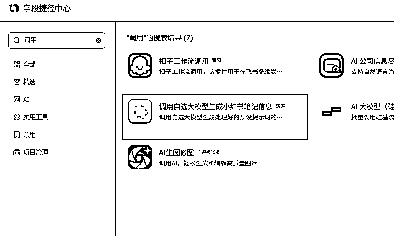

# 需求来源：

测试小红书虚拟资料项目的时候，

我使用了飞书多维表格来管理笔记，

其中的标题、文案、以及标签、

都是通过图片转文字后调用coze平台来自动生成返回多维表格里的

非常方便、可以在coze里进行复杂数据操作：

可以在coze里调用爬虫脚本爬取关键词的下拉长尾词

然后调用大模型API生成文案、标题、下拉词标签等


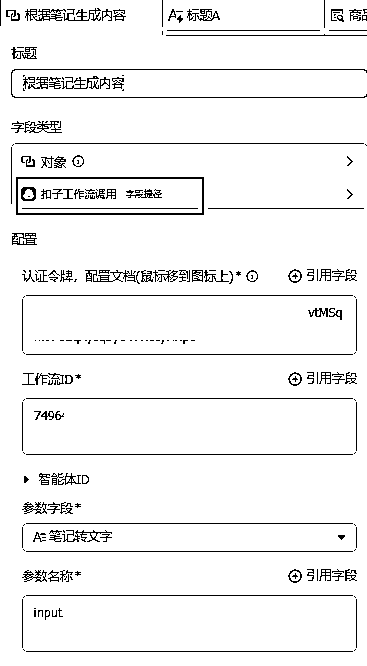

但是、等笔记数量上来的时候发现调用

coze的资源点不够用了！

开了会员也只是每天可用1000点。

不太够用。除非开团队版或者企业版，

但是这个价格实在没有性价比。

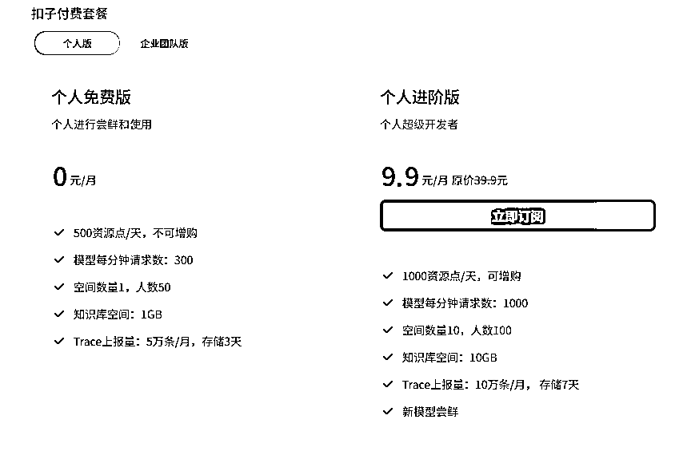

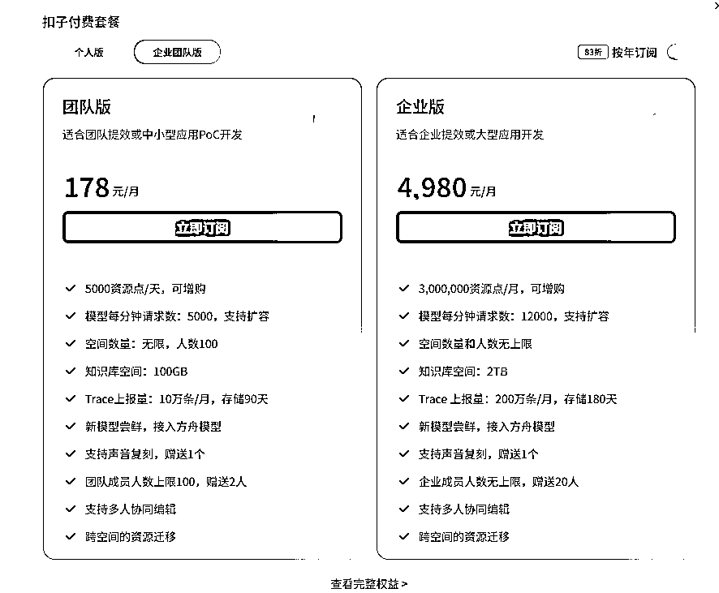

所以为了扩充这个上限。

我决定绕开coze的平台自制一个飞书“字段捷径”插件来复刻coze上的工作流。

因为飞书的插件上架后只可以免费发布在飞书的服务器上，

可以随便调用，就不需要管coze的调用资源限制了。

# 一、获取开发文档（重要）

有了文档，其实使用curosr开发就简单非常多了。

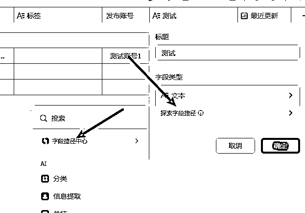


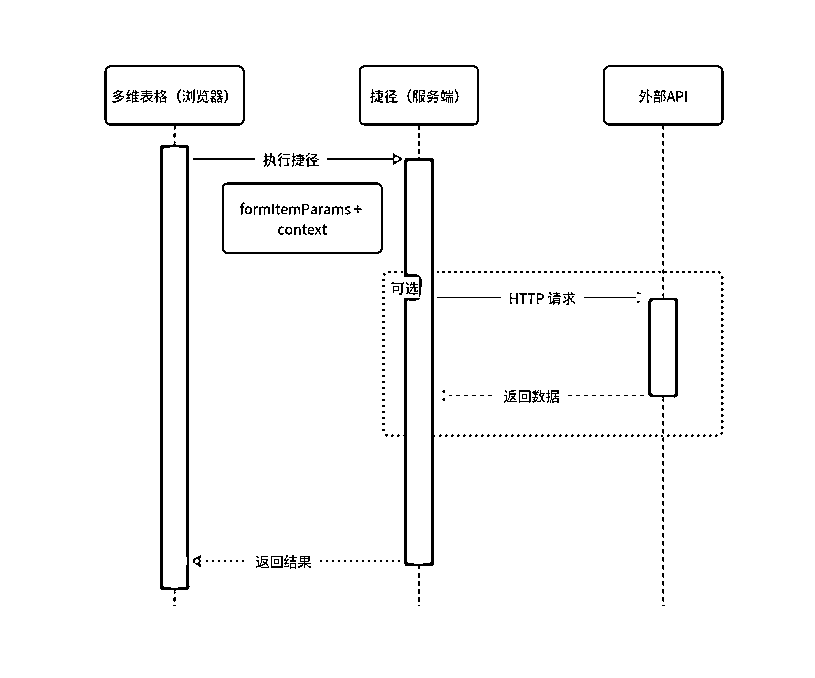

# 二、创建字段捷径

## 需要使用一个叫"字段捷径开发助手"的插件

这个助手是官方提供给开发者调试字段捷径用的

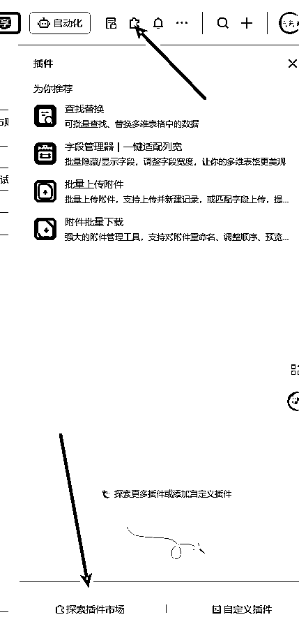


# 三、具体开发

本地环境最好就使用与线上相同的环境配置，

这是线上的运行环境：

Nodejs版本：14.16.0 +

## 先拉取官方文档提供的测试项目demo

按照开发文档，拉取用于测试demo案例

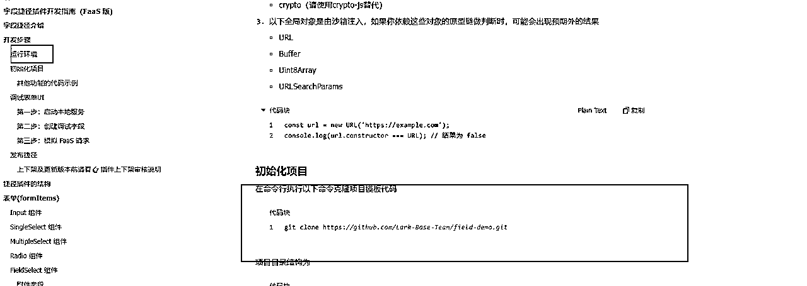

```
git clone https://github.com/Lark-Base-Team/field-demo.git
```

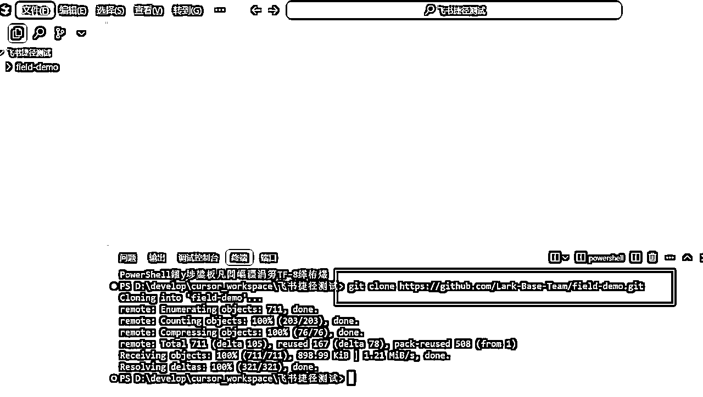

## 启动本地服务

```
cd .\field-demo\
# 安装依赖
npm install

# 启动本地服务
npm run start
```

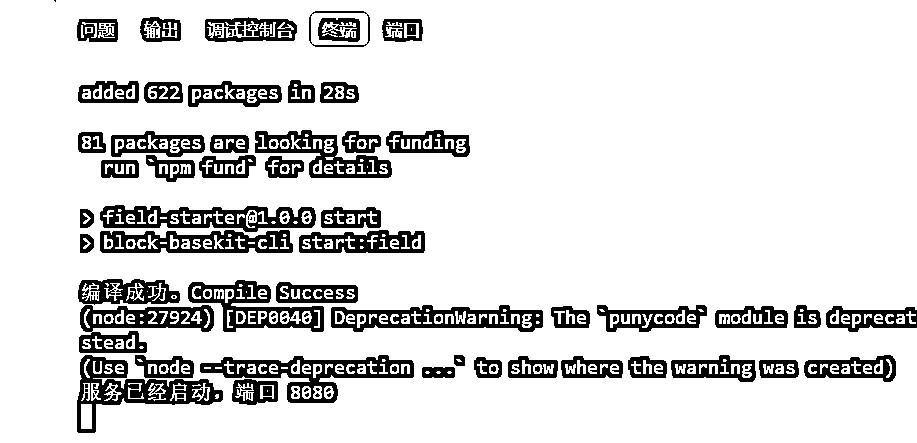

基于 复制副本，然后点击右侧边栏的「字段捷径调试助手」，或者直接在侧边栏插件市场中搜索“字段捷径调试助手”，然后运行，pin到侧边栏即可。

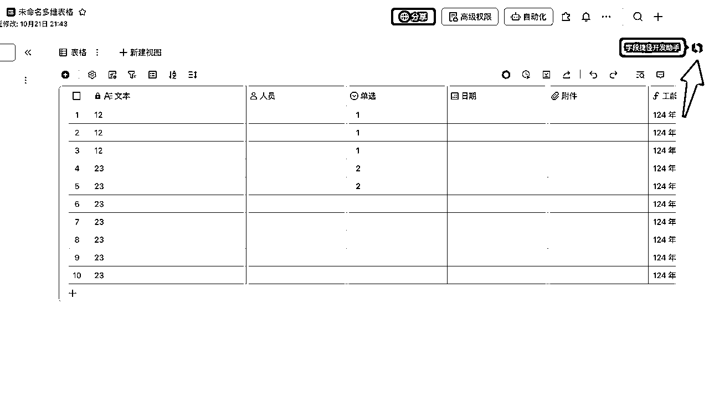

在飞书多维表格上，

简单的测试一下，

发现没问题

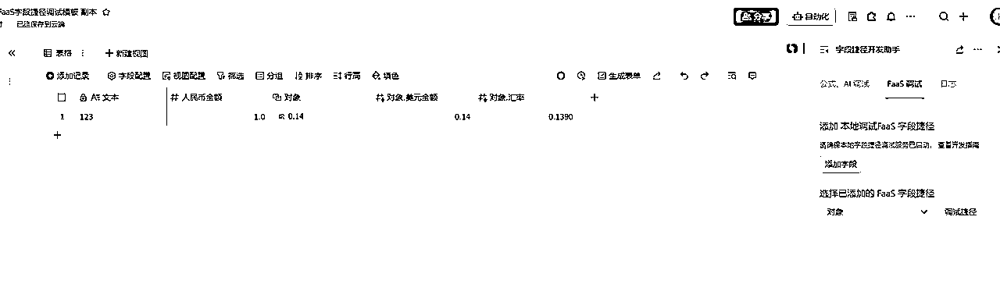

然后我们就可以开始使用cursor进行开发了

## Cursor开发

### 技巧一： 先将开放文档，存入cursor doc里，方便他调用查询理解

方式1：

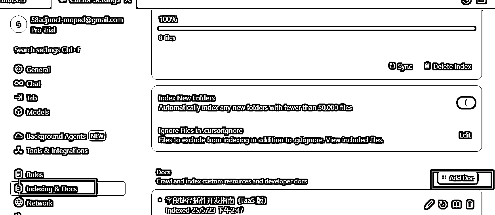

方式二：


需要用的的时候就@DOC 下

### 技巧二：开发的界面的逻辑可以直接抄一下已经存在字段路径市场里的“coze”调用插件

直接复刻他的逻辑和界面参数


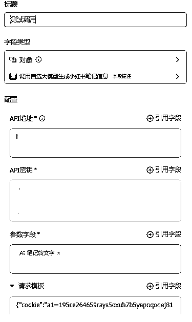

先和curosr沟通开发传入的参数，

根据自己的业务需求，确定所需的传入参数，

要几个，哪些参数是必须的等。直接让cursor改就行

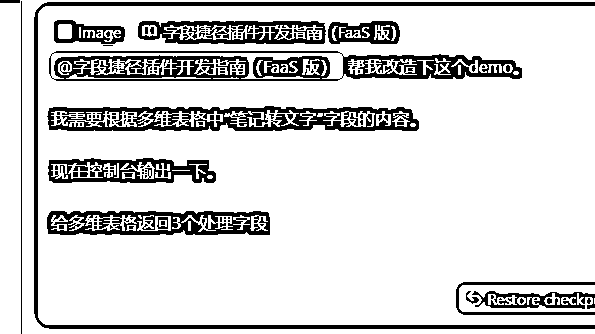


界面的传入参数等确认完后

就可以编写具体的业务流程了，

也就是把coze里业务工作流一步步搬运过来。

注意最好一个功能一个进行搬运，然后一个个功能进行测试

不要一口气全让cuosor写。

这样很难完成的。

比如调用大模型API

我这里找了一个之前用剩下的中转API进行测试调用

⚠️：让cursor编写调用大模型API的时候，

记得把api网站提供的调用测试用例也复制发给cursor。

这样基本一次两次调试就能成功了

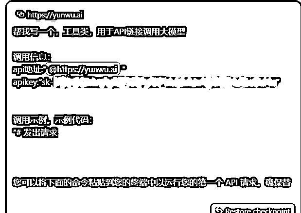


比如根据写好的提示词生成搜索关键词

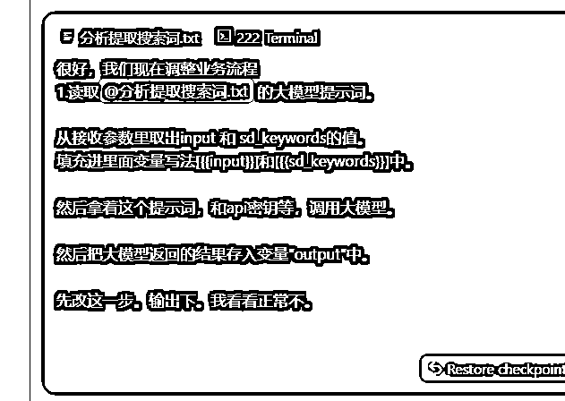

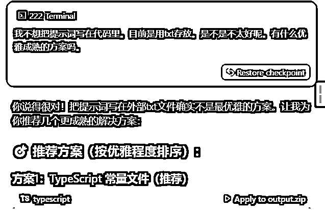


因为之前我已经coze里已经在提示词、爬虫脚本、格式处理都跑通了，

所以开发的过程我直接复制的对应的代码/文案生成提示词等，发给cursor很顺利的简单调试都能实现

# 四、发布插件

打包自己的代码，填写飞书提供的表单就可以了，

飞书官方会自动拉群拉你

通过1-2个工作日审核完就能上架使用了

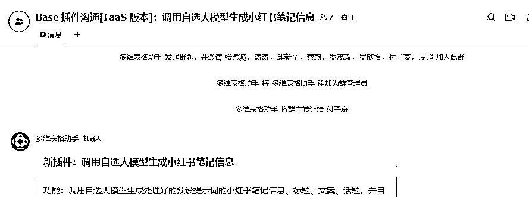


```
发布插件：
要发布自己编写的字段捷径插件供自己使用，请遵循以下步骤，基于知识库中的文档信息

1.
打包插件：在项目目录下执行 `npm run pack`（确保Node.js版本为14.16.0或更高），生成output/output.zip文件。
- 示例命令：`npm run pack`
- 输出文件路径：`output/output.zip`
2.
上传文件：将生成的output.zip文件上传到指定位置。

3.
提交发布表单：访问并填写
多维表格捷径插件表单
。在表单中：
- 选择发布范围为“公司内使用”（适用于个人或团队内部使用）。
```

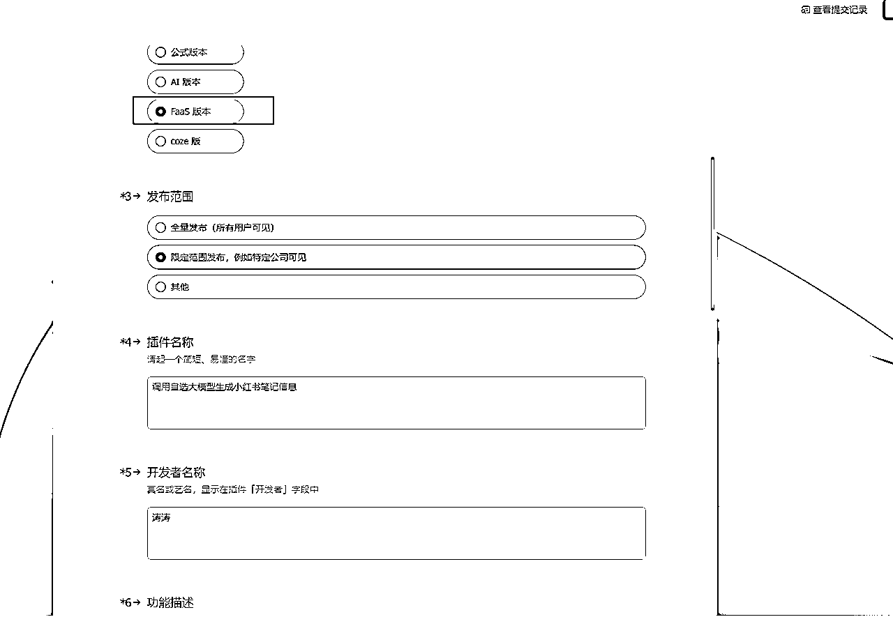

# 最后

「如果觉得本次分享对你有所启发，别忘了回星球给我点个赞👍」