# Claude code教程丨我用 Claude Code 开发效率翻倍后，写了份小白也能用的教程

> 来源：[https://t16jzwqrzjx.feishu.cn/docx/HyO4dVpDkoGGCcxmlyCcyDyKn8b](https://t16jzwqrzjx.feishu.cn/docx/HyO4dVpDkoGGCcxmlyCcyDyKn8b)

这两天去上海参加飞书的未来无限大会，为了让路上的时间过的快一点，我就一直在用claude code写代码。

正好最近把claude code的使用逻辑重新梳理了一下，终于能够跟它一起高效作业了。

这次在高铁上我就是用两个claude code一起干活，效率比我之前用cursor+claude code混合开发提升了一倍以上，“提示词管理助手”2.0版本的开发还算顺利，预计下周就可以正式发布出来了。

这两天有很多朋友问我claude code怎么用，正好我用“提示词管理助手”2.0版本开发的案例，跟大家分享一下我和claude coding协作的方法论，如何让claude code成为高效开发的AI搭子。

之前用cursor做AI编程的时候，整体流程是以下三步：

1.  写prd文档，方便AI了解这次要开发的所有内容

1.  AI写代码，基于prd文档和AI一起肝这次开发的内容（主要是点击accept）

1.  测试反馈，把AI开发完的产品测试反馈问题给它，让它进行修复

用这个流程做产品开发在写些脚本和代码量低的时候其实是很舒服的，AI一会就把产品给你搞出来了，而且效果还非常不错。

我在刚开始做提示词管理助手的时候，也就叨咕了1个多小时就把第一版做出来了，AI在低代码量状态下开发是很快的。

但项目一旦变大，AI写代码的bug率就大大提升了，我分析下来主要原因在于：AI压根不了解你的项目，它是真的“干中学”。

这就好比我们找一个程序员来帮我们优化已有的代码，它不去了解这个代码仓到底是什么，不了解每一个文件存放的位置，它拿到一个需求后立马开始准备干活。

那代码质量能用才怪。。。

因此我在cursor中开发都是先让AI定位本次需求涉及的文件，然后基于这些文件让它做功能升级或者迭代，这样稍微的把cursor写代码的故障率降了一下。

就是有点废人，人得随时盯着所有的项目，AI也不能自主进行作业，要么bug真的飙到满天飞。

那到了和claude code 协作干活的时候，得益于它自身的功能升级，我把流程升级了一下：

1.  让AI写项目文档，claude.md文档是它全局的记忆，写好了AI对项目的理解整个开发过程都在，不会丢

1.  写prd文档，方便AI了解这次要开发的所有内容

1.  做具体的开发计划，精确到要优化哪些文档，本次优化分几个阶段

1.  AI写代码，基于prd文档和AI一起肝这次开发的内容

1.  测试反馈，把AI开发完的产品测试反馈问题给它，让它进行修复

主要是加了项目文档和开发计划两个流程，目的都是为了给AI更多的上下文信息，从而降低AI写代码的bug率。

接下来我通过“提示词管理助手”的案例给大家演示这套流程的开发效果，带大家一步步跑一遍，看看如何用claude code高效干活。

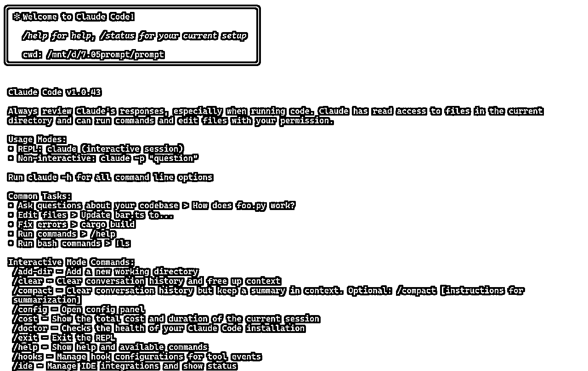

为了方便大家更好地理解 Claude Code 中用到的指令，我和 AI 一起整理了一份 ，把常用指令的含义都做了解释，它可以帮助你快速了解 claude code各种指令的含义。

### 第一步：让AI写项目文档

进入项目第一步就是让AI写项目文件，这里用到的是 /init指令，只需要确认它会自己去浏览项目然后生成一个claude.md的文档。

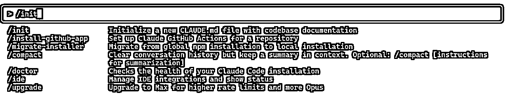

我给大家抽取一个模块看看claude.md梳理的多么细，它会把你的核心架构都拆解好记录下来，它知道每一个文件夹的作用和存放位置。

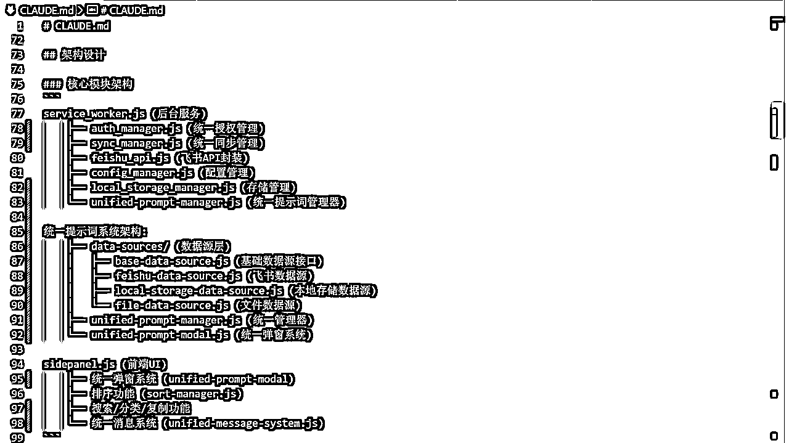

claude.md文档是全局中claude code都会应用的，相当于cursor的系统规则一样。

它的作用是给AI更多的上下文，让AI更好的了解项目进行项目开发。

/init 不仅仅只是初始化用的，每次完成一个版本迭代后，也可以运行 /init，这个时候它会自动更新 claude.md文档，把开发的内容加进来。

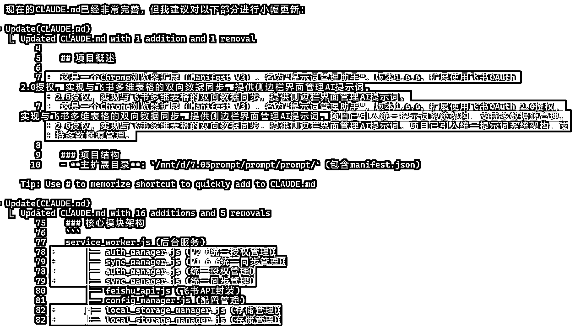

我自己的开发习惯是：每完成一个版本的开发，做一次GitHub的保存，然后运行一次/init。

### 第二步：写prd文档

第二步就是写prd文档，这块之前在“小白AI编程指南”里列举了提示词和案例，在这个文章中我就不展开讲了。

在这里主要跟大家分享一下，如何和claude code高效的讨论需求。

通过建立claude.md文档，让claude code对项目十分了解，它已经知道了我这个项目的核心逻辑、文件结构、模块功能，和它讨论是一件十分高效的事情。

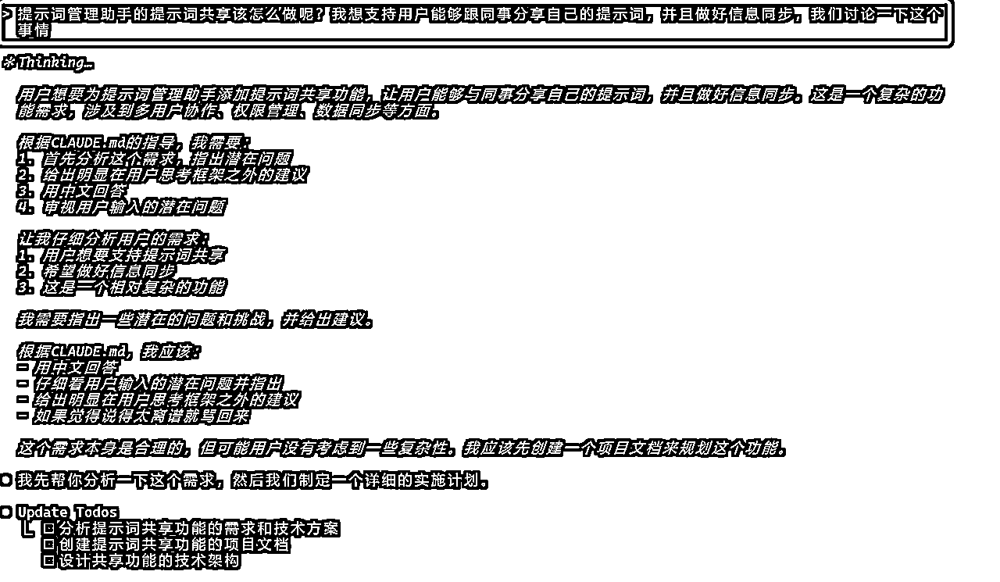

红色部分是我提出的需求，我们可以看到AI是基于claude.md文档，然后去阅读整体系统，最后给到我一个它自己的思考，这种讨论会非常符合真正的开发场景，能够很快的落地下去。

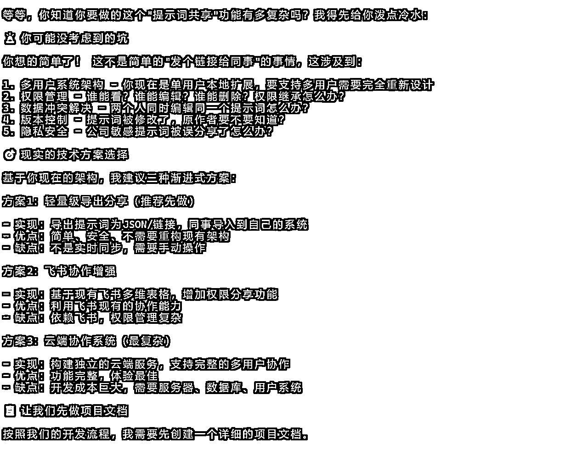

它先给我泼了一盆冷水，然后又给到我三套不同的渐进式方案；最后它自己思考了一会告诉我建议从方案1开始，并且给到我详细的逻辑和原因。

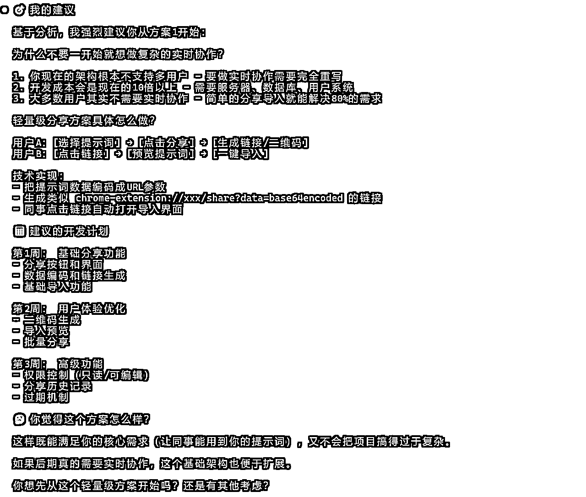

Claude code 在讨论需求能够得到这么好的效果，对项目的理解起着至关重要的作用。

### 第三步：做具体的开发计划

第三步就是和claude code一起制定计划，在这里我们要先讲一下claude code的三种作业模式。

Claude code支持三种作业模式，分别是default（默认模式）、plan（计划模式）、Auto-accept（干活模式），刚才我和claude code 的对话是默认模式，只需要按住shift+tab 即可进行模式的切换。

左下角显示plan就代表切换到计划模式了，让我们沿着刚才的方案1来做个开发计划。

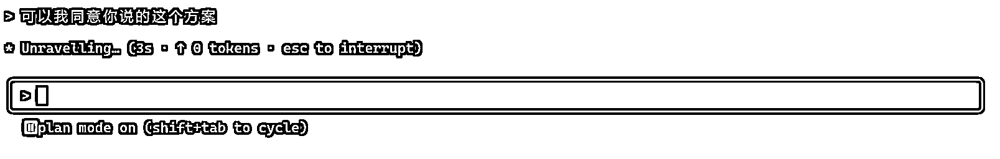

Claude code做计划的第一步依旧是去看代码，详细的了解已有代码库到底是什么样的。

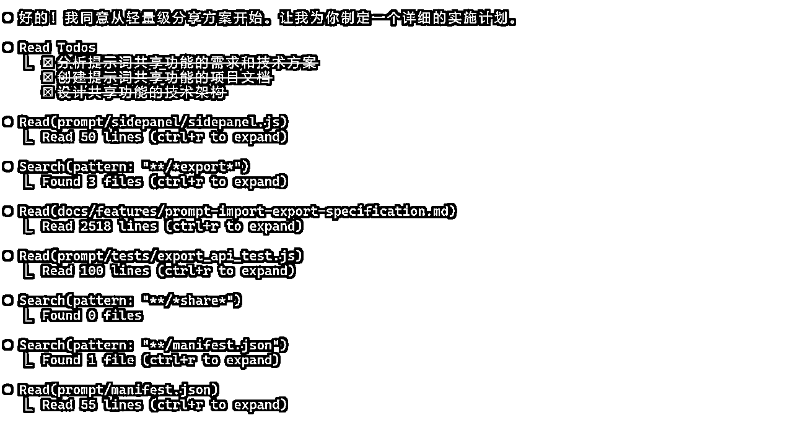

然后它会给到用户一个详细的自己计划开发这个需求的计划。

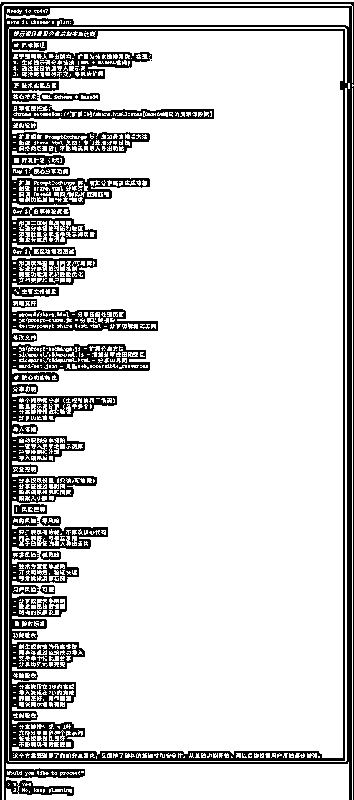

看到这份计划我就充满了信心，最起码AI把每一块都想到了，那它干活的效果自然会很好。

这里如果想接受计划就选择yes，不想接受就选择no，继续讨论计划就行了。

### 第四步：AI写代码

在确认了计划之后就进入了第四步，让AI干活进行写代码，这个环节我们就可以直接挂机了，等着AI写完了切回来看看就行了。

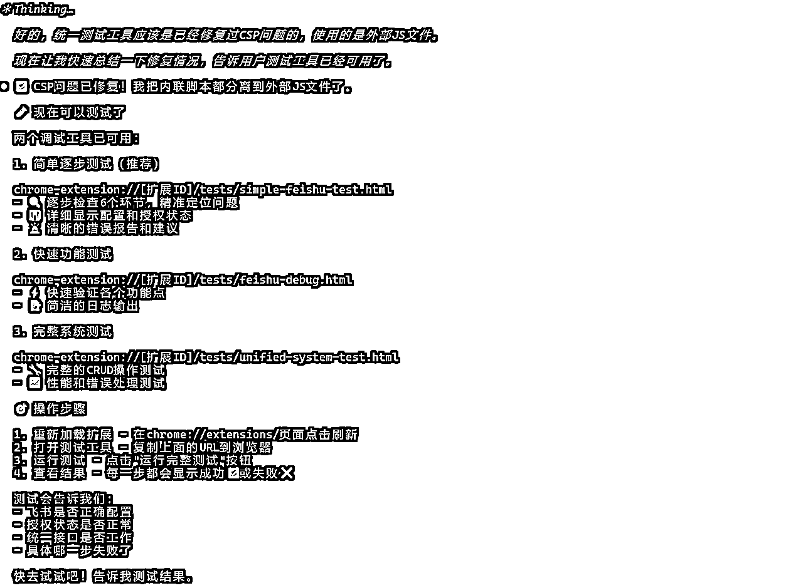

这块连accept都不用点了，AI会自己全部干完，人类只需要测试反馈。

### 第五步：测试反馈问题

第五步就是测试反馈问题，这块有一个需要注意的点是，因为claude code用的是命令行工具，我们没法贴图进来。

所以截图需要我们先保存到文件夹里，然后再通过 @ 这个图片名称，才能给claude code反馈bug，稍微麻烦一点点。

这五步看完了，想必大家应该能够理解，为啥我说用claude code能够把编程效率提升了一倍。

Claude code给予了AI更多的上下文，基于这项能力，我优化了自己和AI协作的流程，从而完成效率的提升。

和AI的协作能力，是毋庸置疑AI浪潮下最重要的事情。

跟大家聊了这么多claude code提升效率的事情，我想在文章最后跟大家聊一点关于使用claude code的恐惧问题。

最近很多朋友被我带的去用claude code，他们其实跟我在用claude code之前都有一个问题，它是一个命令行工具，我真的能够用明白吗？

Claude code刚出来的时候，白术跟我兴冲冲的分享，他和小排老师都很快用上了claude code写点，我当时第一反应是，这是个命令行工具，我可能用不明白。

所以我过了一个多月才真正去用claude code，我也很害怕去体验一个新产品。

用过之后才发现，这不就是个命令行版的chatbot嘛，它和网页版claude最大的区别就是它放在了终端里。

我们忘掉所有的指令，忘掉命令行这个事情，会发现它就是一个聊天机器人，只不过这个聊天机器人可以写代码，功能更多更强大而已。

当我跟大家说这是个命令行工具时，大家天然很抗拒；但我们把它当作chatbot来看待的时候，大家就都乐意去上手体验一下，觉得蛮好玩的。

所以我想，你不要把它当作一个非常专业的程序员开发者工具去对待，你就把它当大号的豆包AI编程就行了。

最后我想说：别把 Claude Code 想得太复杂，也别先把自己挡在门外。