# 小红书虚拟店：我用6技合1法，成功率提升80%（缺1不可）

> 来源：[https://tvwjtflpi4w.feishu.cn/docx/F3kYdLxT4oqKjoxxAQycT0Wcnec](https://tvwjtflpi4w.feishu.cn/docx/F3kYdLxT4oqKjoxxAQycT0Wcnec)

先说我的结论：我认为小红书虚拟是大有可为的！

一是，现在选择副业也好，还是第二职业也好，市面上好的项目并不多。以前可能通过短视频带货，直播，甚至AI类的项目等卡着一波机遇也能够搞到钱。

但是现在做的人太多了，玩法的红利也过了，导致了做某个项目，如果没有非常好的方法切入进去，就很难搞到钱。

二是，在之前我分享的我小红书“淘式”打法的文章（如下），被评为精华后，看评论原来有很多人，做小红书虚拟这个项目的，但是操作思路模糊不清，不知道怎么做才是对的，总是随波逐流的，小心翼翼的做着而已。

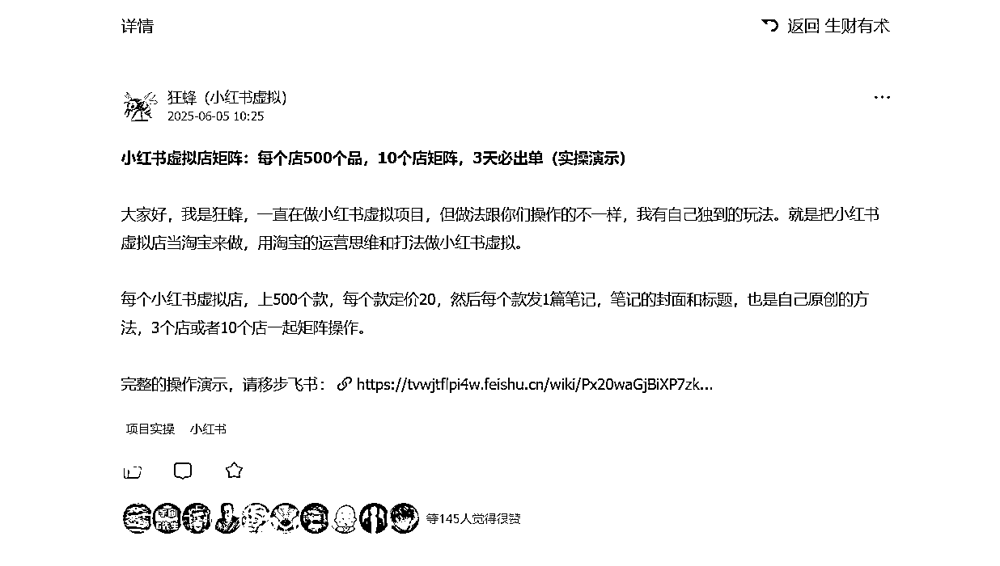

在做小红书虚拟之前，我其实是做天猫的实物电商的，很多年，卖的是厨房电器类（如下），虽然每个月也有100多万的销售额。

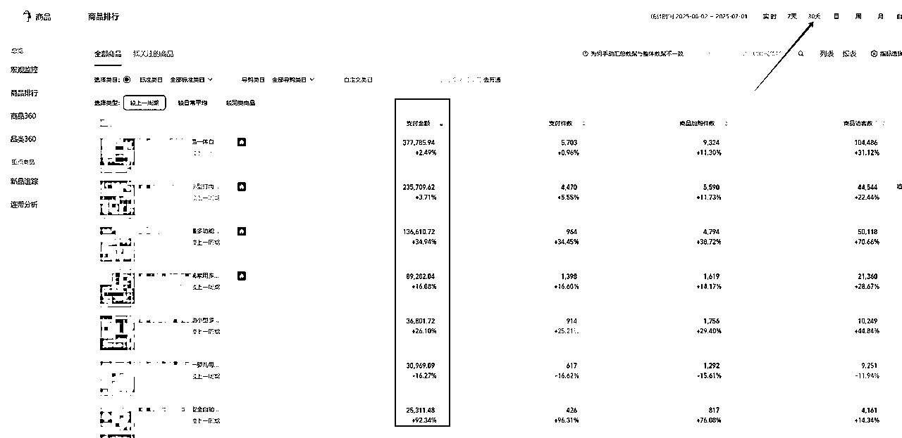

但是现在淘宝等，很多平台主要是靠付费流为主，所以每个月搞下来，其实进到自己口袋的并不多。

方向不对，努力白费

过往10年的电商经验，告诉我们选的方向，或者说选择品类不对，再有牛逼的技术，一切也是白谈。

从去年开始逐步发力小红书虚拟这个方向了以后，真真切切的感受到了这个领域所带来的结果（如下）。

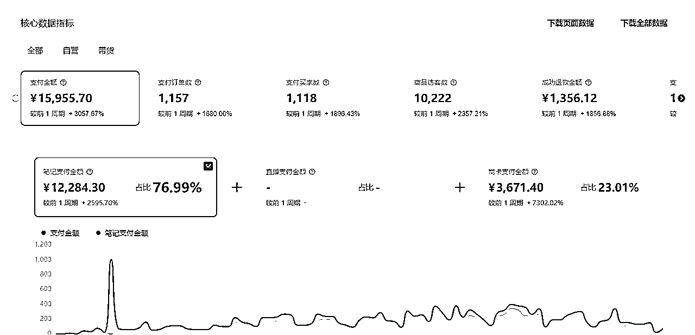

小红书虚拟店1的数据 ：你们1个店能做到我这个程度，1.5万的成交额，其实对于大家做副业来说，是非常舒服的了，因为虚拟品0成本。

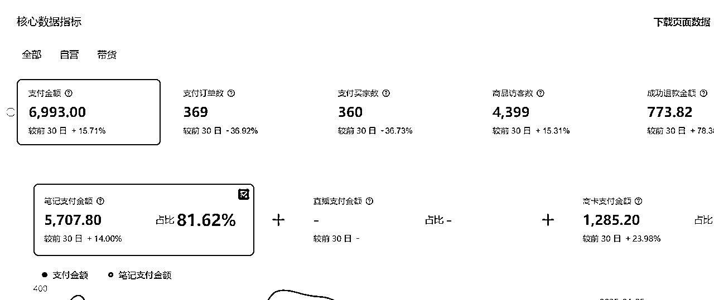

小红书虚拟店2的数据 ：一个店一个月做成这样7000元的业绩，其实就可以了，不要想着放多大，放大了，难度系数会成倍增加，所以一定要我之前分享的玩法操作，小红书虚拟店矩阵：每个店500个品，10个店矩阵，3天必出单（实操演示）。

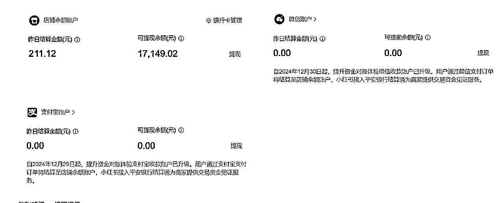

小红书虚拟店3的数据 ：我们这个小红书虚拟店，每天到账200-300多，已经积累17000多的收益了，你们想想看，这个对于大家做副业来说，是不是非常OK了。

综上，我敢说做小红书虚拟店，是目前我认为兄弟们搞副业最好的选择！！因为电商是离搞钱最近的，而小红书上卖虚拟品是最好的选择。

《小红书虚拟6技合1目录》

第一技：选冷门品方能速成

第二技：把搜索流玩到极致

第三技：V4层破免费流

第四技：人为搞销量主动出击

第五技：大量原创笔记封面

第六技：矩阵操作放大

# 第一技：选冷门品才能速成

为什么要做小红书的虚拟，而不是做淘宝、拼多多的虚拟？

拼多多虚拟，主要靠的是付费推广，同时价格也太低，卖一单可能也就几毛钱甚至几块钱。你的品如果选择不对，付费推广本身就会亏损很多。

淘宝虚拟，竞争太大，同行太多，你卖一个产品20，好不容易打出来一个爆款，同行你相信一定会出现十几的几块的几毛的，甚至有几分的都有。那作为买家他也不傻，同样的东西他为什么不买别人几毛的而买你？

但是小红书虚拟就不一样了，同样的品，小红书上可以卖高价，比如18.8 ，28.8。如果一些冷门产品，甚至可以买到100的。

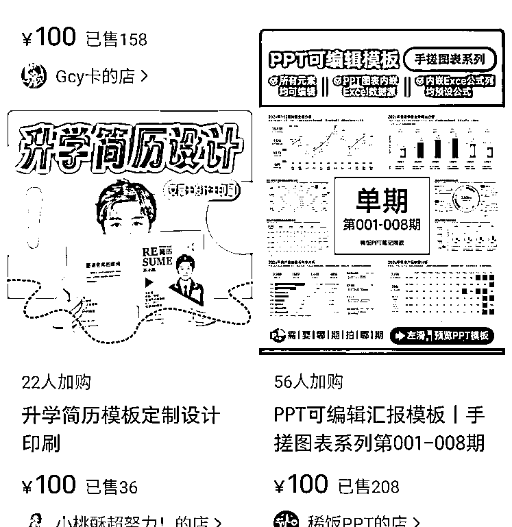

## 1.选冷门品更容易出单

别一上来就选择竞争很大的品类，什么k12资料，什么教师资料，公务员资料，幼儿园小学资料等等。

可以选冷门小众的品做，更容易拿到成绩和结果。树立好出单的信心后，才会干下去。

新手可能不理解我说的，我就牺牲下自己，拿我们的一个品来举例吧。

我给你们说1个我们在做的品（截图如下）

标题：对外汉语教学ppt课件HSK标准教程123456课件教师用书

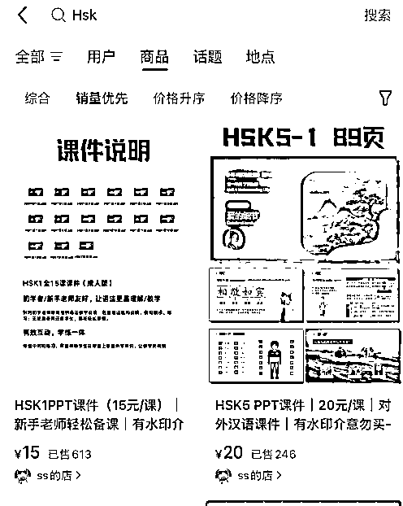

这个品也是我店铺里500个品中的一个，當時上完款发完笔记后，乘风稍微带了一下，立马出单了，后续持续出单中。

## 2.差值法选冷门品

### 方法①：淘宝上搜

就去淘宝上找，搜索主要的词，比如：模板资料，表格，文档，素材，协议，合同。。。。

就拿关键词“模板资料”举例：

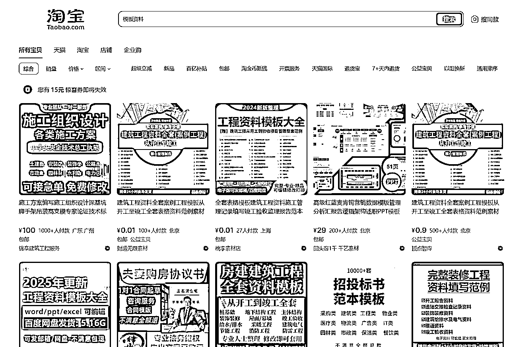

然后去分析，我认为冷门和非冷门是个相对概念，只要不是小红书上常见的几个大类的虚拟，比如K12，教师教辅，考公考学，儿童学生，英语语文等等，只要不是这几个大类的，都叫相对冷门。

比如上图中的，其实都是可以的，有人可能会疑惑为啥我搜的品，看起来都很不错，那是因为淘宝有千人千面的展现，我截图的就是我经常看的品。

因为我本身自己的店铺也要经常选品，所以会在淘宝上搜和点击收藏等。就会出现这样的，你们去搜同样的关键词测试下，肯定不是我截图的这些品。

### 方法②：淘宝的和小红书上的销量差值对比

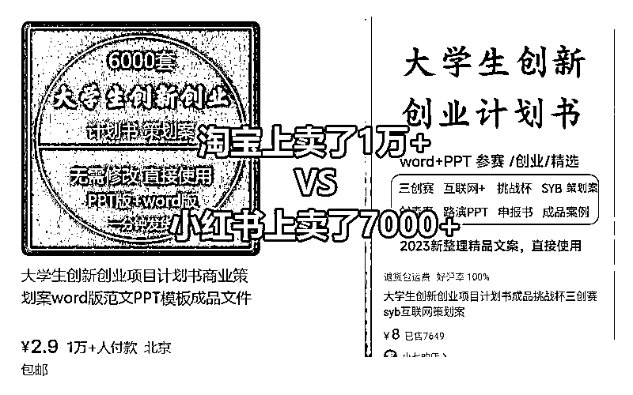

比如上方的这个品：大学生创新创业，淘宝上已卖1万+，小红书上也卖了7000+，说明了两个平台的市场已经饱和了，你才开始0销量0评价的去做这个品，很大可能要花费很大气力。

因为你已经没有了切入初期的市场红利了，小红书上同行的这个款能卖爆，要么是笔记很爆权重很高，要么是在商城端的排名权重很高，无论哪个角度看，你去做，大概率很费劲。

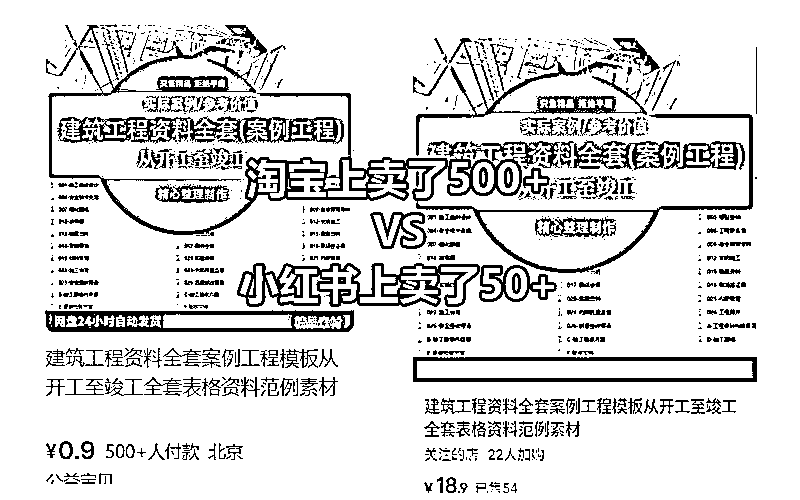

再比如上面这个品：建筑工程资料。淘宝上卖了500多，小红书上同款才卖了50多，这个差值很大，说明是有机会的，可以放心大胆上款，小红书上的标价可以定高，不要学淘宝定低价。

上完后，按照下方搞销量的方法，先把款的基础销量和评价搞好，然后铺笔记，往死里怼就行。基本上，很快就能出单。

## 3.直接500个品治好选品困难症

刚入行千万别碰教辅、教资这些镜争超激烈的赛道，大神云集，新人很难出头，还容易受挫放弃。可以选小众的，比如特定小众领域的资料类，竞争小，更容易做出成绩。

但是，大家在实操的时候，又会遇到一个问题，那就是怎么选冷门品的问题，虽然上方已经将选品的方法说了，我相信在实操的时候，如果没有耐心和经验，还是会迷茫。

所以，我们自己做的时候，不会想那么多，而是直接一个店上300-500个相对冷门的品，这样即使一个不出单，也不会影响大局。

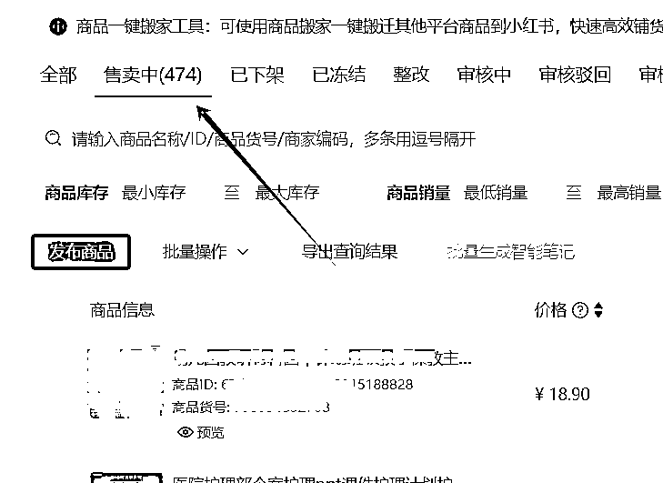

这样做的目的是提高选品成功的概率，然后后期，再把这样0销量0评价，又是卖高价的，都能自然出单的款，再去放大操作：怼销量，怼评价，怼笔记，怼乘风。

# 第二技：把搜索流玩到极致

小红书上面它有一个很好的优点，那就是很难比价。

再加上他是兴趣电商平台，买家他是看中了你发的笔记，觉得可以，他会点击购买，所以它优先搜索的是笔记的本身，而不是产品的本身。

小红书的人群价值也高，所以卖高价是可以的，所以我们做小红书虚拟，从不做低价的，最少都是定价20左右的（截图如下）。

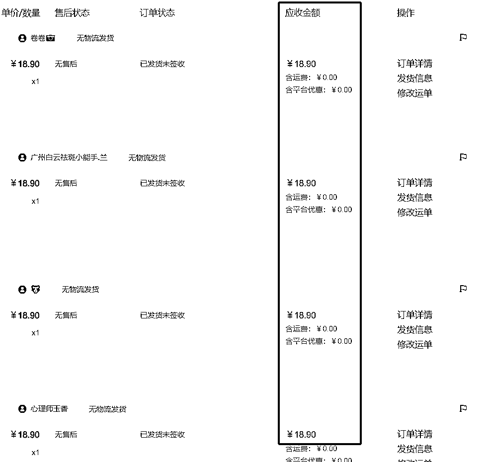

小红书本身的平台的优势，也是非常大的。小红书的用户，对虚拟资料的需求量还是非常大的，因为任何人在生活工作中所需要的资料是非常多的。

你是教师，你需要买评价的资料

你是学生，你需要买学习资料

你是白领，你需要买行政人事的资料

......

## 1.搜索流量为主

在后台数据--流量数据板块可以看到流量和成交的构成。

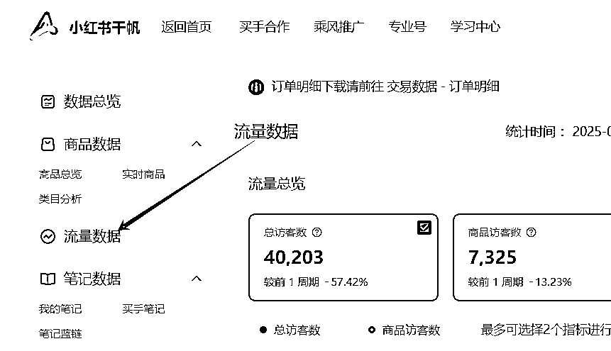

小红书虚拟还是以搜索为主的，可以看下我其中1个店的截图，综合搜索页和搜索商品页的总和占比达到了80%以上，说明，小红书跟淘拼抖不一样，其他平台都是推荐流占比是最大的。

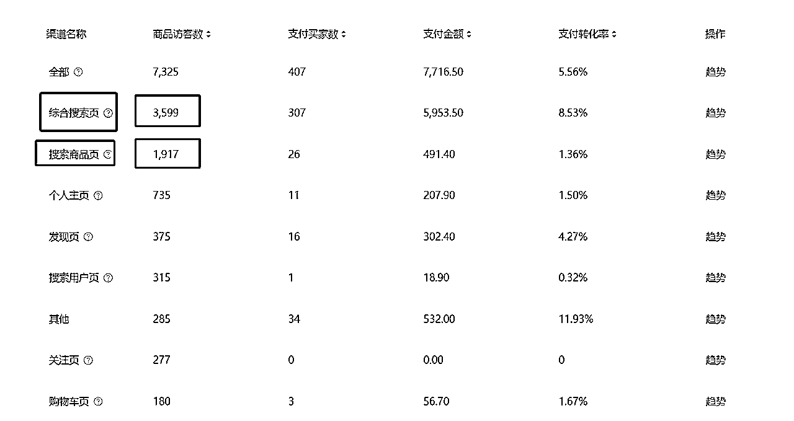

正是通过实操数据，就能得出一个结论：要想做好小红书虚拟这个项目，就要把搜索操作好！！

再在搜索数据--引流搜索词里，可以看到过去30天，店铺的哪些词有搜索进来。

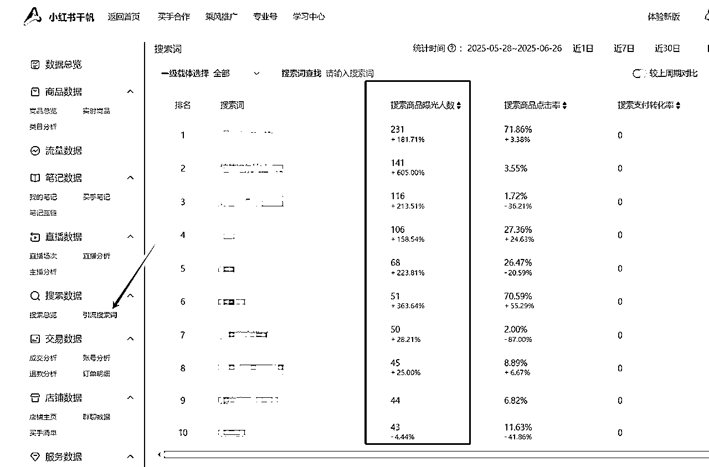

通过这些进店词，有经验的运营，就会得到新的打法，试想下，既然某些进店词流量大，那我们能不能把这些词的宝贝多上些，笔记多布局些。

你们要知道，一些词的权重高，那不是随便就高的，这里面涉及到非常多的考核维度，既然有了，千万不能浪费，要及时的利用和放大。

## 2.搜索词的来源

通过我们店的实操数据，能得出，小红书虚拟主打的是搜索流量，那这些搜索流量的词从何而来呢？

### ①小红书搜索下拉框词

首先确定你要搜的主词，比如我想卖模板资料类，因为我发现小红书上的人群，对模板，表格，合同，协议等都很友好。

搜索完主词，就可以看到很多新的三级词，比如“报关资料模板”这个词，是我们之前从未想到的品。

于是我们可以去淘宝上搜下这个品，看有没有货源。

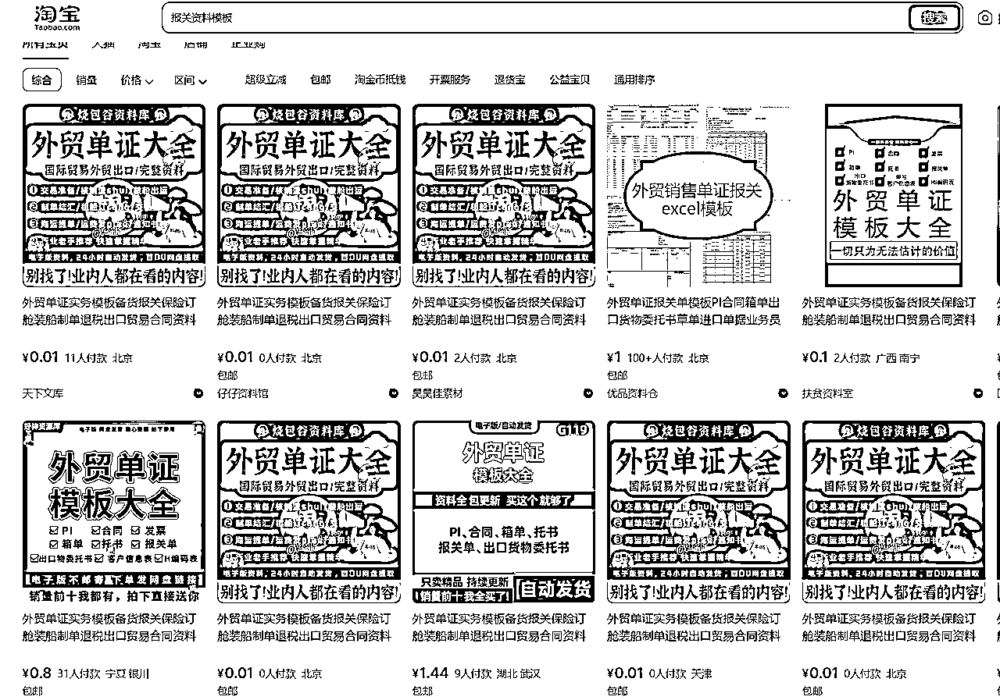

果然搜完后，发现这个品淘宝上的拿货价也才1元或1分，那这个品，我们就可以上到小红书店上卖了，因为既然小红书的搜索框里出现了这个词，证明这个产品，小红书上的需求量是OK的。

从淘宝搬运到小红书店后，可以按我的标价法去标19.9卖，搞起来！！！

### ②淘宝生意参谋找词

因为我是10年的老淘宝人了，所以看词分析词，非常喜欢用淘宝的生意参谋看，有人可能会说了，淘宝的词适合小红书吗？

其实从找产品这个角度，都是相通的。况且，我们选品，不是只选某几个品，而是一个店500个，这也是为什么我之前分享的哪实操帖子非常受欢迎的原因。

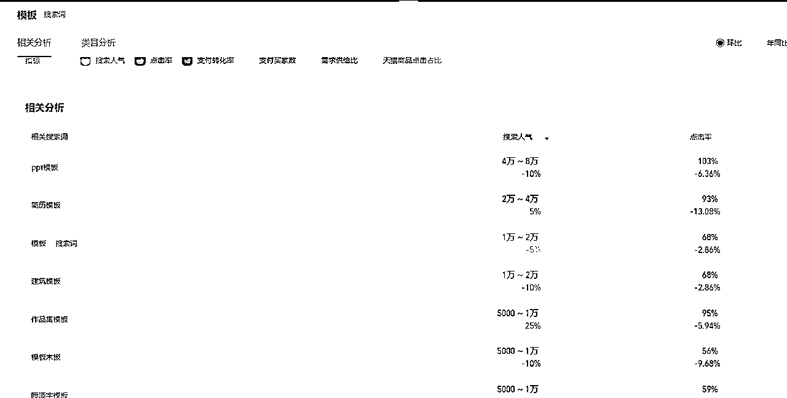

## 3.涵盖更多的词

既然知道了搜索流量为主，也知道了怎么找词，那应该如何布局和涵盖更多的的搜索词呢？

知道了方向，那应该如何实操呢？

### ①涵盖更多词法1：款少笔记多

现在市面上大多数，或者几乎全部做小红书虚拟的都是这种做法，就是1个店精挑细选几个品，然后不断的去发笔记，发很多。

比如像下面这个店，整个店只有4个品，几乎所有的笔记就是发这4个品的。

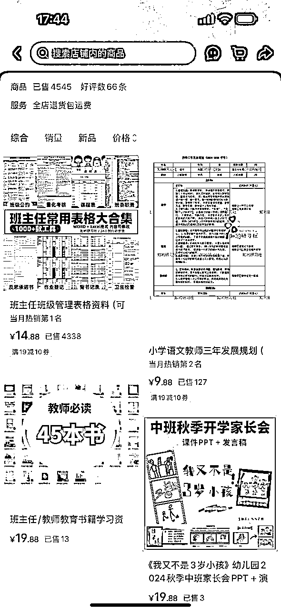

再比如下面这个店，全店甚至只有1个品，那么可以判断的是所有的笔记就是怼这个品，死怼这个品。

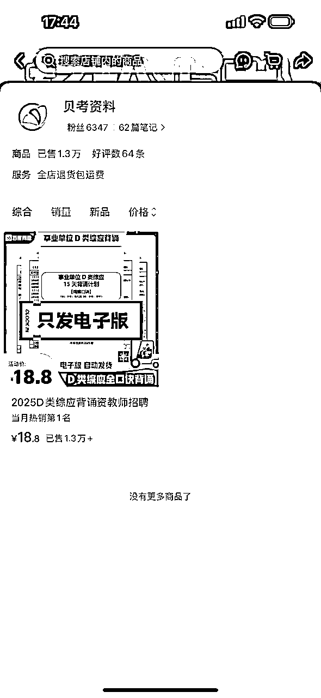

这种打法的精髓就是在于笔记的标题上，每个笔记的标题涵盖一定数量的不同的词，这样所有笔记加起来涵盖的搜索词就多了。

这种打法有个致命的点，就是你的选品一定要到位，要不然发再多笔记，也是徒然。

### ②涵盖更多词法2：笔记少款多

这种玩法是我们正在做的方法，一个店上500个品，每个品发1篇笔记，笔记的标题就用宝贝的标题。

具体的详细的操作步骤演示，可以翻看我主页之前的分享。

这样减小了选品方面的压力，因为这样0销量，0评价，笔记评论也是0的情况下，都能出单的品，请问不是你要找寻的好品，那什么才是好品，对吧？

你们不需要纠结的，直接照做就行，可以看到我们这个店的搜索支付金额，占比达到了80%以上，就是用的这套款多的打法操作的。

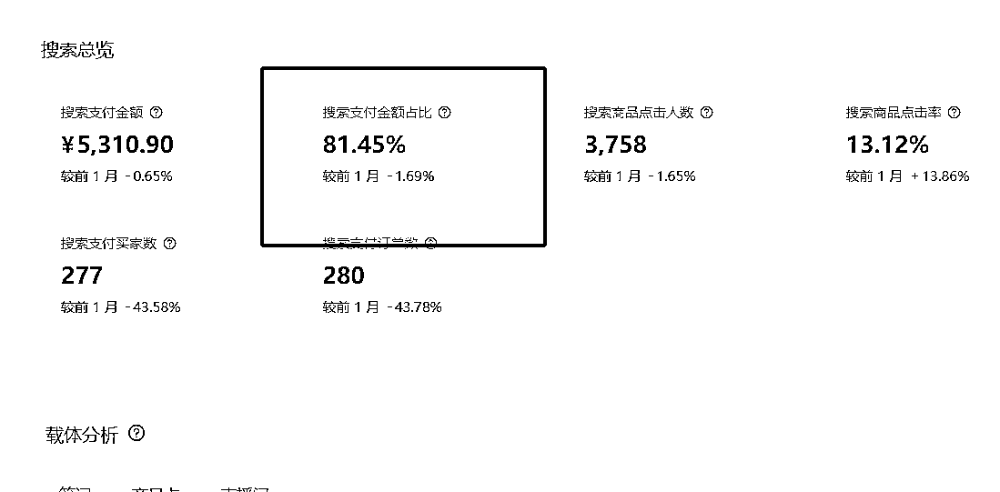

# 第三技：V4层破免费流

免费流在我看来分2种：

一种是要主动出击去拿的，这个就是下面第四技里我分享的。

另外一种就是系统白给的，白给的，那我们必须拿了。

## 1.每周要报名完成任务

后台点击笔记中心，就可以看到笔记任务了，每周一定要到这里点击参加任务按钮。

只有点击参加了，系统才会开始根据你完成任务的程度，给你分配曝光。

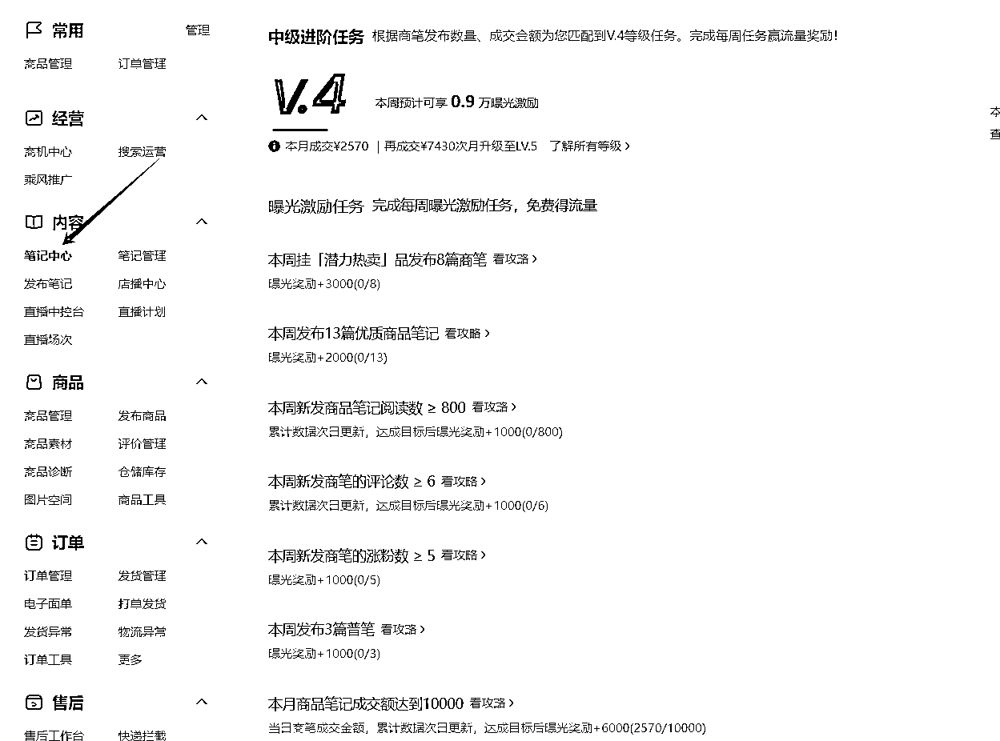

一般奖励最多也是很容易完成的，是发布8篇商笔，发布13篇优质商笔。

这2个无论如何要拿到，第1个很容易只要点击后面的“去发布”按钮，发布系统提示的潜力热卖品，然后发笔记就行。

剩下的第3-5的任务，如果店铺基础好不需要人为的去解决，如果店铺基础不好，可以人为的去操作解决下，也很简单，你们懂的。

## 2.等级越高给的免费流越多

你们要知道笔记的等级越高，系统给的曝光越多。

比如下方是V1级的，每周给的免费曝光是0.2万

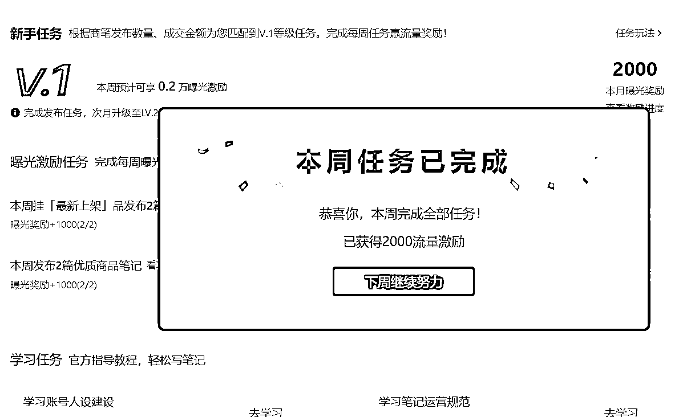

等级是V4的，给的每周曝光激励是1万左右，差不多是1级的5倍了。。

所以，尽量提升等级，这个等级的提升，想正规点，就比较慢。

想不正规点搞，也是可以人为搞的，你们可以点开自己的后台点击下每个等级的要求，就知道怎么人为搞了。

你们不要小看这些曝光激励，这是很容易拿到的，又是系统白给的。

而且是每周的，你要是1个月的4级，那就是免费给了4万的曝光激励，不容小觑。

所以，在做店的时候一定要每周到这里来参加任务。

## 3.怎么达到V4

截图给你们看下小红书官方关于等级的划分标准，主要是按上个月的带货笔记的成交金额来的。

你们再仔细看下需要达到的成交金额，要到V4只需要1K到1W元，你要是太老老实实的做个实诚人，慢慢积累，估计有点慢。

如果你是个不老实的人，那就很快了，你们懂得。

不懂的话，可以按下方我的第四技操作。

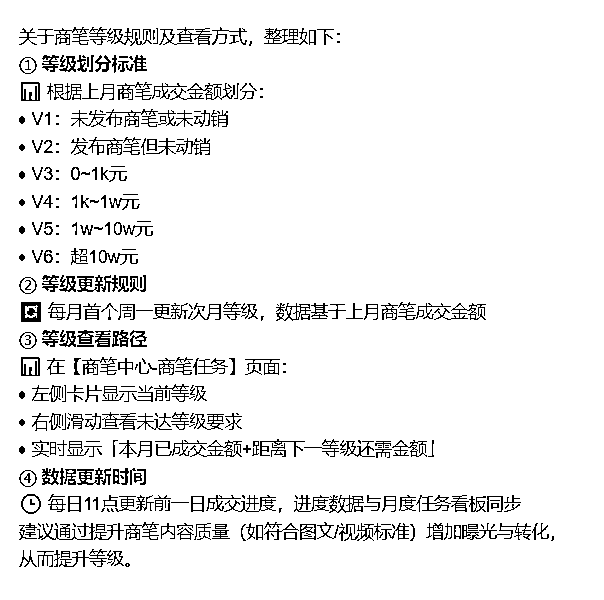

# 第四技：人为搞销量主动出击

要人为的搞销量，主动出击，别傻傻的等，宝贝0销量，0评价，笔记0评语，这样的情况下能出单的款，我们叫神款，但是这样的款毕竟是少数，或者偶然性太强了。

所以，要主动出击，人为去搞下销量，虽然很多人对这个很排斥，但是在商言商，只要是做电商，这个维度你绕不过去的。懂的都懂，实在不理解的，照做就行。

## 1.做宝贝的销量和评价

小红书的电商由于起步晚，再加上很多内在的稽查系统，还没有淘拼抖那样完善，所以在搞销量的时候，可以稍微“放肆”点。

我的操作步骤是分4步，达到的效果如下截图：

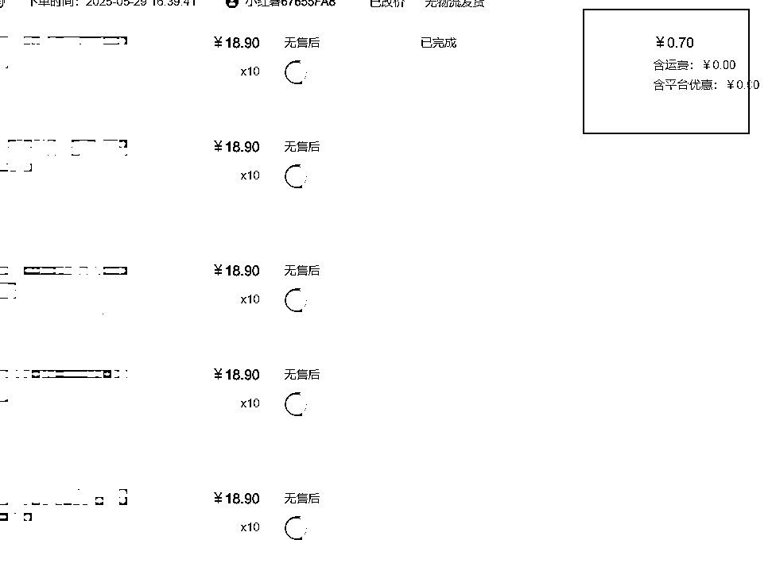

### 第①步：分手机，用4G

准备3-5个小红书号和手机，全部都用4G网，不要用wifi

这个动作一定要一机一卡一号了，而且不能用wifi，因为做过淘宝的都知道淘宝的搞销量比这个更严。

做人为销量这个动作，准备的小号，千万不要1个手机来回切换小号，这是小红书的大忌。

更不能说用wifi了，我们可以粗鲁一点，但是不能把小红书的系统当傻子。

### 第②步：每个款加购10件，每次加购5个宝贝

一个要搞销量的款，基本数是30-50单，1个账号1次1个宝贝可以加购拍10单，

如果每个宝贝想拍30单，就准备3个小红书号，同时加购5个宝贝，每个宝贝加购10件。

如果每个宝贝想拍50单，就准备5个小红书号，同时加购5个宝贝，每个宝贝加购10件。

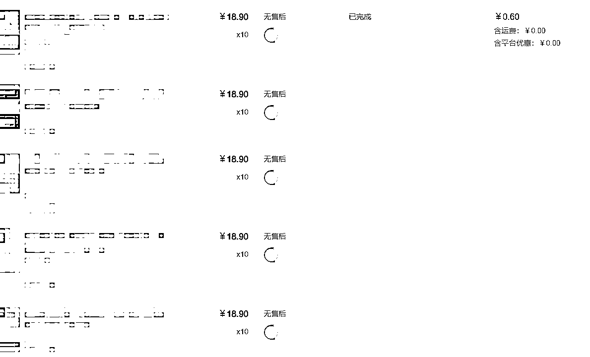

### 第③步：改价0.1-1元

拍完后，每个款的订单改价0.1，这样订单的总价就不是18.9*5了，要不然再加上系统回款周期，和店铺多了，资金压力就太大了。

所以改成0.1*5的话，就基本上忽略不计了。

### 第④步：搞销量的节奏控制

每个店前期最好每天来1单就行，把店里点击量大或者出单的款优先做。

因为一个新店不可能一上来就是很多单的，有个循序渐进的过程，可以逐步的提升，前期每天1单，过半个月1个月，随着店铺流量的增加，真实销量的增加。

可以再逐步的提高人为销量的订单，这个度一定要把控好。

要不然，到时候被排查到了会扣10分。

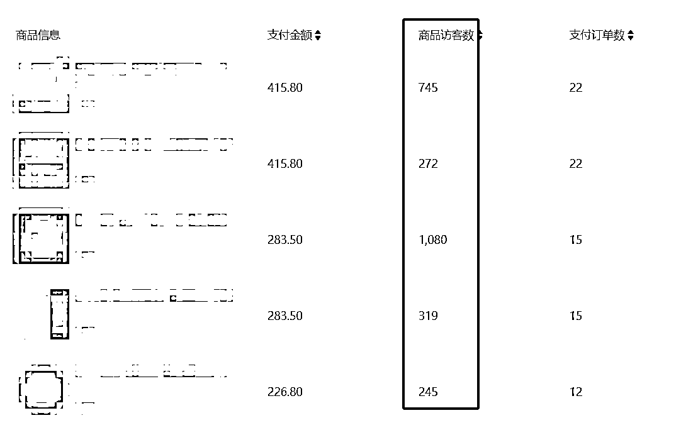

## 2.人为做笔记的勾心评论

勾心的评论，才能勾引别人点击宝贝，才能提高成交的概率，这个就叫转化率。

种子评论就像网井里倒的第一杯水，为的就是引出更多的其他水。

因为没有任何买家想做第一个评论的人。

也没有买家想做第一个买的人，这就是人性，也是电商的本质。

### 方法①自己的主号留评论置顶

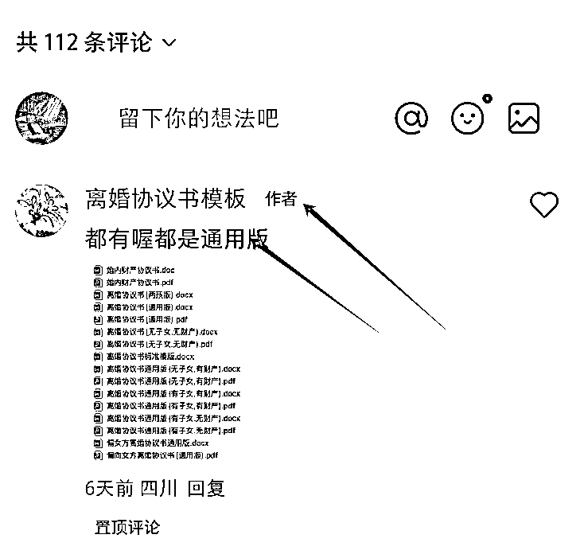

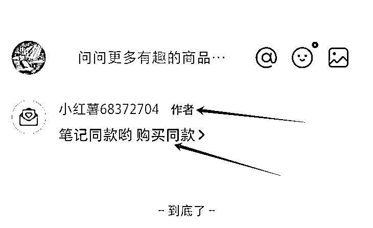

### 方法②用几个小号留评论

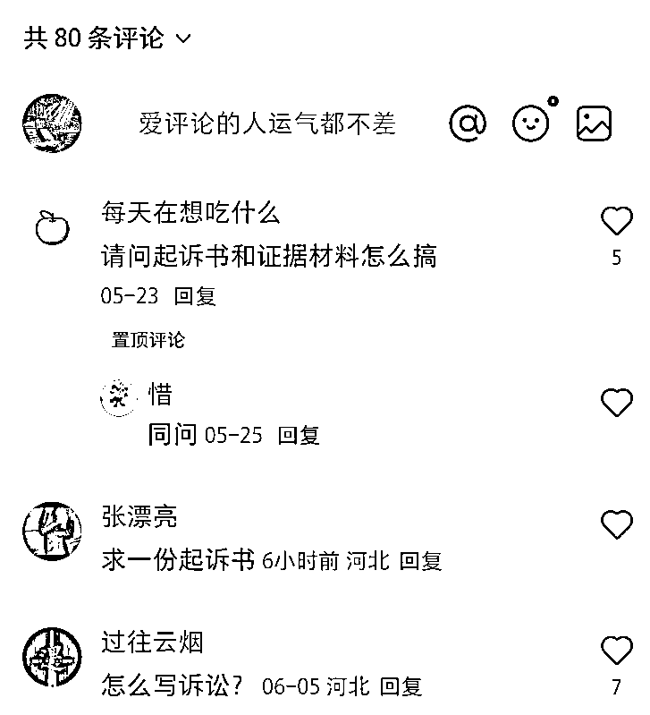

### 方法③主号置顶留+多小号留

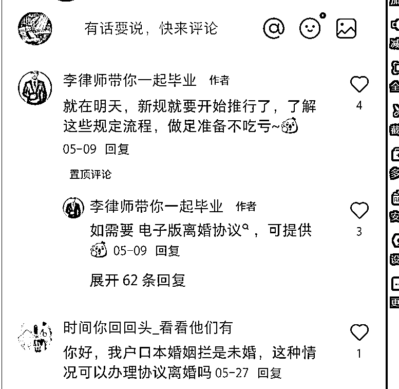

# 第五技：大量原创笔记封面

## 1.简单背景+产品主词

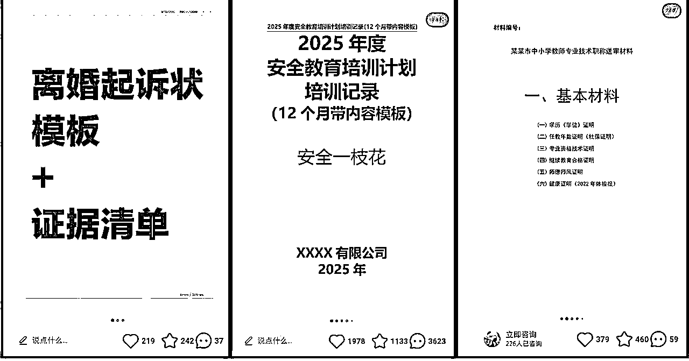

## 2.内容截图+文案

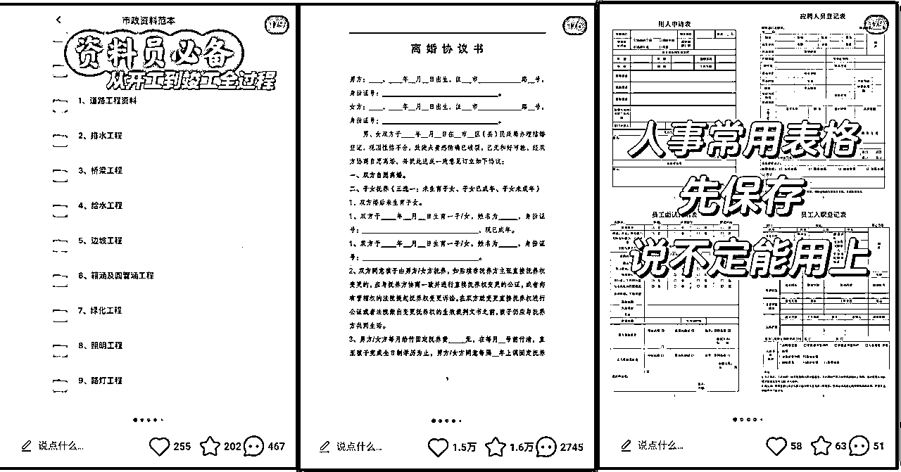

## 3.打印+拍照

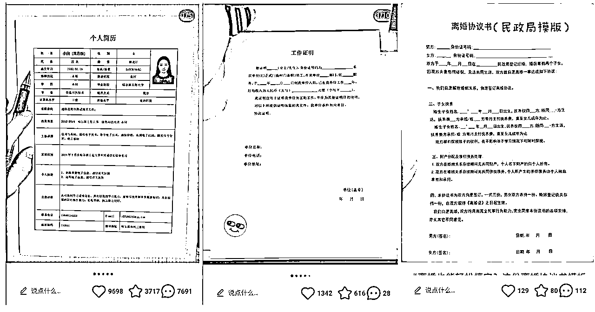

# 第六技：矩阵操作放大

## 1.矩阵操作是放大的内核

简单的事情要重复做，才是积累数据的最好方法。

当你把1个店做到出了1单，或者小红书号有了点赞评论，证明0-1跑通了。跑通后， 可以考虑多做店或者多做号，来解决放大的问题。

有很多人，总习惯于0-1跑通后，就想着怎么把1个店或者号，做的很大的数据，其实这种思路本身没有问题，只不过在实际操作的时候，还是有很多难度的。

当然了，我也并不是说，1个店浅尝则止，而是说到一定程度后，就可以矩阵操作了，比如我截图的我们这个店，也是在不断的操作，笔记也都发了700多条了，同时也在矩阵操作，两者之间并不冲突的。

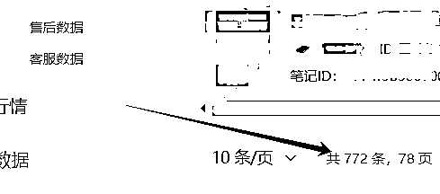

你可以设想下，一个店是成交10单容易，还是成交100单容易，必然前者，那如果1个店已经可以成交10单了，我再开10个店呢，是不是很容易达到100单了。

有人可能会想这只是你纸面上理论。

实际我们也是这么在做的，比如下方的小红书店矩阵和号矩阵。

## 2.小红书店矩阵

做虚拟这个赛道，一定要店矩阵操作，这个我们是尝到甜头的，你们可以看下我下方截图，就是我们的店挂在腾讯服务器上的，你们可以数下有多少个。

当然了挂服务器的目的是可以24小时自动发货，因为小红书的自动发货软件，基本上都不能关电脑自动发货的，这个做过的都知道。当然了，服务器怎么配置，怎么设置自动发货，这个就是后话了。

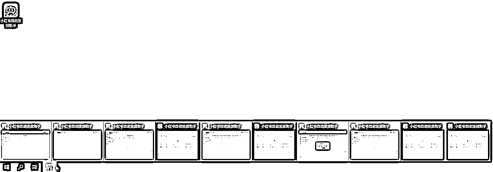

“越做，越有积累，越积累，越成功” ,像以往我们可能会长时间的去纠结于这个产品怎么搞销量，怎么付费推广。

但是现在我们更多的是考虑的是怎么样多开店铺，怎么样铺更多的虚拟产品。

可能在刚起步的时候有点困难，但是越做到后面越来越发现一点点一点积累起来以后，越做越轻松，信心也就高了很多。

## 3.小红书号矩阵

有很多人做小红书虚拟，还是喜欢用传统的做法，比如3拖1，3个小红书账号来带1个店，这样也是可以的，只不过会有个小弊端就是，你一个店选的品，就一定是好品吗？

其实，我在操作的时候，喜欢多开店，1带1，我宁愿把多的手机号和手机拿去注册店铺，多上款，也不太喜欢用3拖1去怼。

当然了，这个就是因人而异了，每个人有每个人的打法。不存在好坏，只要能拿到结果就行。

# 别放弃，坚持做，有累积

最后，关于小红书虚拟这个方向，我只分享我的一句感悟：别放弃，坚持做，有积累！

在这个过程里，唯有自己不停去积累，积极去累积经验，才有一个从量变到质变的过程。

正如荀子在《劝学》中说的：“不积跬步，无以至千里；不积小流，无以成江海。”

凡事都要有积少成多，厚积薄发的过程里，只要我们足够有耐心，便能做到水滴石穿，真正做到一天比一天有经验，一日比一日有心得。