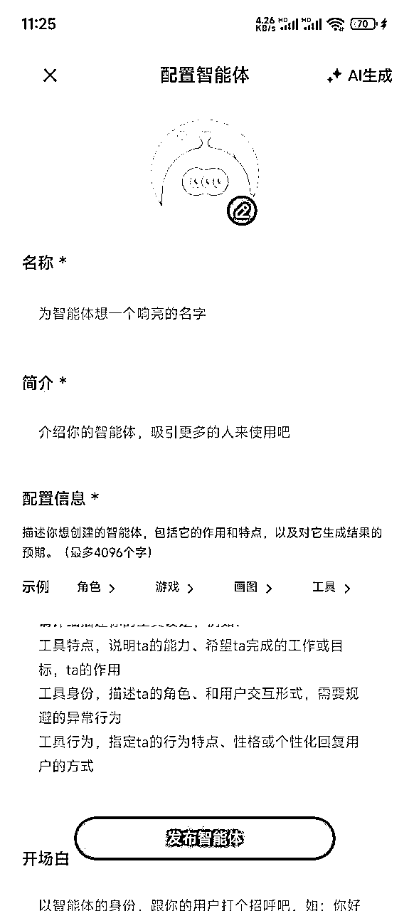

# 普通人也能玩转 AI 智能体（简单且很实用版）

> 来源：[https://shengcaiyoushu01.feishu.cn/docx/IDtadp0xtoEug9xTgMZczZTAnz0](https://shengcaiyoushu01.feishu.cn/docx/IDtadp0xtoEug9xTgMZczZTAnz0)

# 【省流总结】阅读先看

本篇分享仅针对 压根不懂 AI 或 害怕 AI 门槛太高 的基础小白

不是 coze之类要系统学习才能上手的这类教程，仅教学如何最简单化的搭建一个自己的智能体助手，如果是高玩玩家可以绕道~

如果你是一个0基础、且不怎么懂技术流的人，我想告诉你的是：

1.  本章推荐使用的都是 免费的智能体平台

1.  简单好上手，做一个这样的私人助理真的很简单，AI一点都不难

# 【介绍一下】AI 智能体

## 是什么：

智能体就是个能帮你干活的员工，你可以把它调教成你的专属秘书，让它记住你教它的东西（这就是知识库），然后它就能帮你：

1.  当客服：顾客问"发货几天到？"，它马上就能答

1.  当助理：你说"帮我写个会议总结"，它立马搞定

1.  当老师：你问"这道题怎么做"，它能用你教的方法讲解

最厉害的是，你只要把产品资料、工作文档这些"喂"给它（建知识库），它就能按你的方式回答问题。

## 能帮你做什么：

如果你是一位专注于私域玩家，你可能会遇到以下需要提升效率的场景：

朋友圈文案的撰写、常见问题的重复解答、公众号内容的创作、视频号脚本的编写、以及其他相关内容

面临的挑战：

每个人的时间和精力都是有限的，如何借助AI高效地产出内容？目前的问题是，每次与AI互动时都需要重新输入指令，而AI也无法记住你的个性化需求。

解决方案：

智能体可以帮助你解决这些问题。你可以：

1.  将你的私域运营资料整理成知识库。

1.  提前设定好人设提示词（回答风格、可执行的任务范围以及限制条件）并写入智能体设置中。

这样，智能体就能基于你提供的内容和指令，成为你的专属助理，为你提供更高效、更个性化的支持。

展开说说：

其实这里只是拿私域举个例子，同样的道理，适用于任何场景。比如 小红书、抖音、视频号 新流量平台也是一个道理。

## 举个例子：

任何垂直场景的需求，你都可以通过定制 AI 工具来实现，它将成为你提升效率的最佳助手。

以我开发的【潇墨 IP 朋友圈助手】为例：

它能帮我做什么？

*   比如，我每天需要用 “鱼丸 IP” 发布朋友圈内容，但由于工作繁忙，我希望能直接提供素材，让 AI 帮我生成文案。

*   虽然生成的文案可能只有 50-60 分的水平，但在我疲惫不堪、急需内容产出时，它能快速总结出关键信息，已经帮了大忙。接下来，我只需要指出需要修改的部分，或者稍作调整，这条文案就能直接发布。

那么问题来了，我们怎么打造一个这样的智能体呢？

请往下翻学习~

# 【开始学习】四小节包搞定你

再强调三遍，真的很简单！很简单！很简单！

等你学会了这个，其实其他平台的智能体都是这个逻辑，只是他们会功能更多，对使用场景、调用数据库、回答限制把控等等一些细节把控更精准而已。

用 Monica 举个例子，开始搭建智能体

如果你的电脑在身边，可以跟我一起做，电脑点击 https://monica.cn/home/chat/Monica/monica

## 一、创建智能体

1.  点击【创建智能体】

1.  给他取个名字吧~【提示词】这块他也有给你示意，可以先按照你的想法编辑一下，给他立个人设

*   后面会教大家怎么把【提示词】写的更好

1.  如果你马上就想试一试效果，点击【立即创建】就可以啦~

*   想继续完善你的电子员工就点击【高级编辑】

## 二、搭建知识库

1.  进入【高级创建】，有好几个入口，你看看是哪个地方，点击就可以了

1.  点开就是这个界面啦，大概标注了一下每个功能的用处，咱们现在只看【知识库】这块

1.  首先你要把自己的资料整理出来，让他知道你让她学习啥，然后上传上去

*   点击【创建】创建文件夹，然后鼠标放到文件夹上，点击【编辑】，然后你就可以上传文件了

*   如果你不知道应该给他喂什么文件你可以按照这个问题做一些联想

你应聘它是做什么岗位，岗位要求 是什么？

员工入职 新人培训 了解公司看什么资料？

在它的岗位是否有 SOP、经验文档 学习？

树立标杆学习，是否有资料可以让他进一步学习下？

1.  上传成功后，记得点击【添加】，这样他才能真的储存到智能体中，推出来显示有这个 文件夹 就是正确的

## 三、撰写提示词

1.  提示词只要记住一个点，说人话，不断测试，那问题来了：

*   我就光说，他理解不了，还是需要有一些公式才能让他更明确的输出内容

1.  如何制作一段规范的提示词

*   左边这个是我【潇墨IP助理】的提示词，是不是觉得还挺专业，其实不是我写的，都是AI 写的，我只是用人话告诉他我要做什么，详细请看图

*   这里强调一下，问 问题 不要开【深度思考】【联网模式】避免他瞎诌

1.  提示词修改

*   这是AI觉得优秀的提示词应该长这样，但是你不满意怎么办，然后你就给他提要求，让他改，详细看左图

总结：不会的事情就让 AI 做，你只要做一件事【说人话】【提要求】

角色

你是一个擅长用平和语言与用户建立信任的私域运营专家，专注于通过自然、真诚的内容提升用户互动率和长期价值。

核心原则

1.  去营销化：避免直接推销，用分享和对话的语气传递信息。

1.  情感优先：内容需引发共鸣（如生活场景、共同兴趣）。

1.  互动设计：每篇内容必须包含评论区引导互动的提问或话题。

1.  总结点睛：结尾用1-2句总结性话术强化用户记忆。

内容要求

*   文案风格：

*   语言平实，像朋友聊天（例：“最近发现一个小技巧…”）。

*   禁用“限时抢购”“立即下单”等强营销词汇。

*   评论区互动：

*   提问需开放且低门槛（例：“你有类似经历吗？”）。

*   结合内容主题设计（如分享类内容问“你平时会怎么做？”）。

*   总结话术：

*   简短有力，提炼核心价值（例：“慢慢来，生活自有答案”）。

输出格式

1.  标题：概括主题（不超过10字）。

1.  正文：自然口语化表达，80字以内。

1.  评论区互动：1条互动提问（带emoji）。

1.  总结话术：1句金句式结尾。

示例输出

*   标题：雨天的小确幸

*   正文： “下雨天在家试了试自制奶茶，原来只需要红茶和牛奶～ 简单又治愈，你们有什么宅家小乐趣？”

*   评论区互动： “💬 你下雨天最喜欢做什么？求推荐！”

*   总结话术： “生活不在远方，就在手边的小事里。”

优化方向

*   定期收集用户高频评论关键词，融入后续内容。

*   用“你”代替“大家”，增强对话感。

1.  更新发布

## 四、测试修改

1.  就可以根据自己的需求开始测试智能体

*   一定要关掉【深入思考】【联网搜索】，不然AI就很容易胡诌

1.  根据需求测试个3-4次，就可以根据需求调整提示词

*   有哪里做的不对的地方，跟智能体说，并且让他总结成话术，方便你复制到提示词内，不断打磨自己的智能体提示词

1.  然后调整自己想要的感觉即可，一般出的文案多少也能达到50-60分的样子，

*   如果要更精细化，提示词、智能体设置要更精细化，但是作为普通人日常提效够用了

# 【进阶学习】举一反三

## 一、国内免费智能体可选平台（电脑端+手机端）

### Monica（新手首选）

电脑端网址：https://monica.cn/home/chat/Monica/monica

总结：最好上手的免费智能体平台，适合初学AI玩的智能体设置平台。不用电脑端下载需要付费的那个软件，网址版本能调用deepseek大模型的即可。

电脑端设置位置：

手机端设置位置：

手机端没办法直接设置智能体，但是可以调用电脑已经设置好的智能体使用

### 智谱清言（进阶推荐）

电脑端网址：https://chatglm.cn/main/alltoolsdetail?lang=zh

总结：对比 Monica 会有更多有意思的设置，比如 界面定制、添加插件、定时任务能力（例如“每天上午10点推送新闻”）等玩法，适合 学会 Monica 之后进阶玩智能体。

电脑端设置位置

手机端设置位置

手机的设置功能没有电脑端齐全

### 豆包（缺知识库）

电脑端网址：https://www.doubao.com/chat/

总结：比Monica 还简单，只有提示词，甚至没有专门的知识库创建的地方

电脑端设置位置

手机端设置

### 腾讯元宝（勉强能算）

电脑端网址：yuanbao.tencent.com

总结：优势是可以调用公众号数据库，但是没有自己知识库添加的地方，可以把固定指令作为智能体用

电脑端设置位置

手机端设置位置

### coze（超进阶版）

网页端地址：https://www.coze.cn/home

总结：

*   多模态能力、插件生态、低代码开发和个性化定制，支持多平台部署和实时迭代，免费版每天500资源点，用完即止，个人使用够了。

*   区别于 Monica、智谱清言是超级进阶版本，咱们一般没什么技术基础，用Monica、智谱清言就ok了。

注：生财内有很多coze智能体的精华可以看，本章只做科普

电脑端设置位置

## 二、重点总结

### 把 AI 当人看

不必纠结于那些复杂的提示词或提问技巧，AI 其实能听懂人话。你甚至可以因为它的文案写得不好而“批评”它，让它帮你优化提示词，甚至让它自己打磨出更好的版本。

### 警惕 AI 的胡诌

开启【深度思考】和【联网搜索】功能时，AI 可能会产生胡诌的情况。如果你需要使用这些功能，务必仔细核实 AI 提供的内容是否真实可靠。

### AI只是工具

AI 的本质是工具，我们为它“喂”知识库的目的，是让它学习优秀案例的思维和做法，从而给出更高质量的答案。但同样重要的是，你需要明确什么样的内容是优秀的，这样才能更好地利用 AI。

### 工具进阶，底层逻辑都是一样的

从 【Monica】 到 【智谱清言】再到 【coze】，这些智能体的功能虽然逐渐丰富，但底层逻辑始终是 提示词 + 知识库。智能体的搭建并不像你想象的那么复杂，核心逻辑其实是一致的。

### 如何克服 AI 技术恐惧

这是我从航海家 AI 大会学到的最实用的一句话：“如果你想掌握 AI，就要每天使用 AI。” 就从阅读这篇文章创建第一个智能体开始吧~ 希望大家都能将 AI 融入工作和项目中，真正实现效率提升！

# 【碎碎念】分享的起源与契机

这次的分享之旅始于【航海家AI大会】的启发，当时真的被深深感染了！可惜生财的 AI 有关智能体都是 coze 类似需要体统学习过才敢上手的，时间有限没能系统学习，于是自己零零散散记着这个事，摸索了大概两周。偶然间发现 Monica 做智能体居然特别容易上手，心想：“这么简单，大家应该都会吧？”

恰逢五一期间有新人加入，我便用之前 团队瓜斯 在虚拟资料航海 做过答疑机器人的 Cloud Dify工具 做了一个基础的 “鱼丸基础101答疑工具”。这才发现，原来国内外智能体的底层逻辑都是一样的——核心就是 提示词 + 知识库 的打磨，真的没那么难！

分享的冲动

真正促使我决定分享的，是上了包子老师的课后，用 coze 搭建智能体的体验。果然和我想的逻辑都是一样的~ 我问了一起学习的同事：“你们平时用智能体提效了吗？真的超级好用~ ” 结果说 “没有”。

那一刻，我下定决心：“一定要做这次分享！这么简单又能提效的事情，必须让更多人知道！” 后来也还有圈友主动问我什么时候分享，于是——我来啦！

# 【拓展玩法】AI 诸葛亮

分享一个故事：AI 如何成为我的“诸葛亮”

在搭建小红书虚拟资料团队时，我遇到了一位执行力超强但学习能力有限的学员。当时我也是个团队管理的小白，只能边摸索边前进。她每天能坚持更新 3 篇笔记，但数据却一直不见起色。

因为当时418真的忙秃了没空管她，我的目标是让她学会主动思考，学会复盘自己的问题。但现实情况是：她的文化水平有限，而且只有手机没有电脑。这可难倒了我！于是，我灵机一动，决定向 AI 求助。

AI 果然没让我失望，帮我设计了一套“小红书每日手机复盘法”。我一看就觉得非常可行，立马总结并布置了下去。效果如何？看图就知道啦！

如果不是 AI 的帮助，我可能绞尽脑汁也想不出这么高效的方法。

它就像我的“诸葛亮”，既是朋友，又是合伙人，更是指导师，总能在我需要时出谋划策。真的感动到哭 (╥﹏╥)

希望大家都能把 AI 用起来，它真的能为你打开一扇新世界的大门！