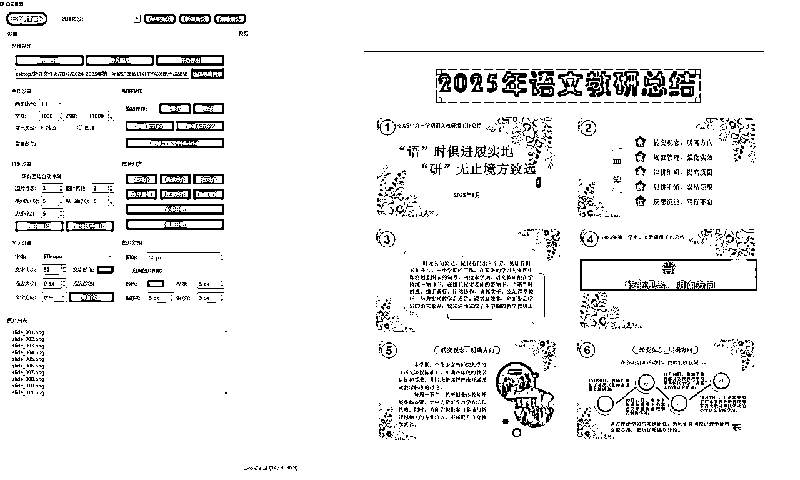
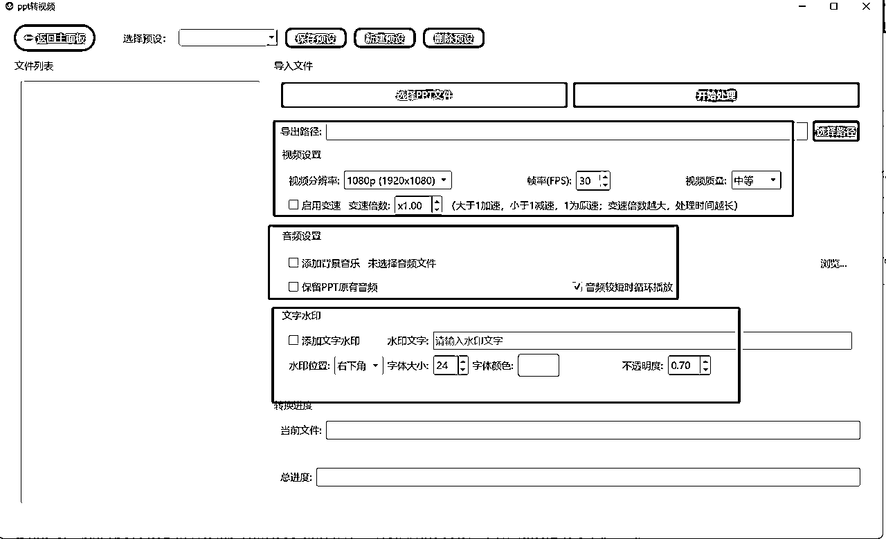
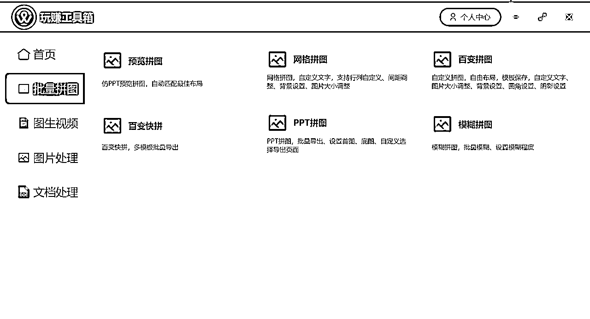

# 从0开发内容提效工具箱，赚到10000元

> 来源：[https://gzwzdskj.feishu.cn/docx/IPXBdoQw5oXYPGx0b1tcLxnenag](https://gzwzdskj.feishu.cn/docx/IPXBdoQw5oXYPGx0b1tcLxnenag)

大家好，我是郭耀天，七年生财圈友

两年没在生财更新文章了，一直操作虚拟项目，玩法都一样，没啥新东西，没更新

看到生财有很多伙伴做虚拟资料，算是同行，不知道大家有没有遇到这种情况

操作虚拟资料的时候，需要各种各样的工具，比如word转图片，pdf转图片，word转换视频

看起来很简单的功能，想要找到批量能实现想要的效果很难

每次做项目都要准备一堆工具，解决制作内容遇到的各种问题

不少工具为了一个功能，还需要单独付费，主要是使用麻烦，大部分工具还无法批量制作

还有一些想实现的功能，市面上的工具根本无法解决，制作的难度非常高

一直操作虚拟资料，需要解决制作中遇到的各种卡点，想着自己团队就需要使用，能不能把这些功能都集合到一个工具上，搞虚项目的人直接用，前几年就有这个想法，找了很多人，要么价格高，没能力持续投入开发，要么功能无法实现，淘宝找了一个，制作word批量转换图片都报价就要两万多，现在借助ai很快就可以写出来。

有个伙伴跟着推广虚拟资料项目，需要处理很多内容，比如更换背景，word转图片这些，他自己搞了一个初级版本，使用起来还不错，后面沟通下来，说我有开发一个工具的想法，问他有没有兴趣，就这样一拍即合，开启玩赚工具箱的开发，从0开始开发，从虚拟资料小需求定制开发工具。

工具能解决不少批量制作的问题，需要试用工具的伙伴，找鱼丸链接我，获得试用权限

刚开始，被不少伙伴嘲笑，说别人都去研究ai工具出海了，你还开发这样的工具，别浪费钱了，半年过去了，解决不少伙伴的内容批量制作问题，还通过工具赚到一万多的收益，加上微信收款，两三万的样子，不过没回本，工具箱前后带来的整体收益不下20万了，相信后面工具能给我带来百万的收益。

工具从开发就定位专注虚拟资料制作板块，只做内容提效，批量制作，下面把虚拟资料操作中遇到的问题，我们是如何用工具解决分享给大家，实现的快速制作的，其实这些小功能，借助ai都可以制作出来，我们在一个工具箱上开发出来了，还获得不少铁杆用户，你也可以根据自己的需求开发工具，我们实现的功能都很简单，但是真正的解决大家推广制作的需求，下面是一些比较不错的功能，更多功能点击进入工具手册

一个很简单的功能，把word转换成图片

很多工具都可以实现，不过能实现能批量制作的不多，或者达不到想要的效果，我们做公文项目五年，需要转换各种word文档，还需要对标题加粗这些功能，于是上线了工具箱第一个功能，word转换图片，导入文档就可以批量转换单页图片或者合成长图，满足各种推广。

其实操作虚拟资料过程，不仅仅是word转图片，还有pdf转图片，PPT转图片，后面都需要上架了

有图片，还需要对图片进行各种制作，比如把word文档批量制作成视频，目前公文b站的很多视频都是都是滚动视频，截止剪映可以制作，一个视频五到十分钟，类似下面的这种推广视频。

后面直接开发了工具，一分钟就可以制作一个，只需要批量导入word，就可以批量生成，大大的提高了制作销量

以前一天最多能操作几十上百个，现在有工具，电脑配置好，一天几百上千个视频

这些都是比较基础的功能，其实开发受欢迎的是一个背景替换的功能，做小红书的都知道，有时候看到一个背景

想要把自己的内容换进去，使用他的背景推广，比如教室，电脑屏幕，正向图片都好解决，斜面图片就不好解决

比如这种图片，一般的工具是很难实现的，操作起来难度有点大

直接开发一个可以随意修改图片，直接替换的工具，只要导入需要替换的图片，再导入背景，可以随便拖动图片四角调整背景重合，一键批量替换，这个功能解决斜面替换的问题，目前小红书上，不少斜面图片都是我们工具制作批量制作的，确实给伙伴提效了。

只需要一键就可以替换背景，实现快速制作

斜面图片背景能融合，能不能实现斜面视频也融合，前期没找到方案，后面还是实现了，与图片背景实现一样

可以随便拖动视频，与斜面背景图片融合，实现视频的背景快速更换，达到推广的目的

再看一个案例，做教师资料都知道，需要很多PPT，PPT制作多种多样，比如下面这种

用美图秀秀，搞定设计花时间可以制作出来，但是实现批量制作很难，或者无法实现

有需求，我们就去想办法解决，最后开发了百变拼图功能，能实现小红书上百分之九十的图片拼图效果

只需要设置好模版预设，导入图片就自动生成你需要的页面内容，上面这些的模版可以快速的实现制作

以后只需要导入图片，就可以批量制作了，实现内容批量化

内容解决了，这里有遇到一些问题，封面与内容不一样的，比如这种，能不能实现批量制作呢

其实我们想要的功能，对于技术来说，基本都可以实现，只是实现难度程度而已

有这个想法，继续让技术开发，我提想法，提意见，各种优化，没想到真的实现了，

开发了百变快拼功能，可以一键实现封面与内容导出

最后能实现的效果是这样的，不仅可以实现一个内页，还支持实现不同的内页批量制作

最近还看到把word替换背景发布推广公文的 ，效果还不错，有伙伴问我能不能实现

其实我不懂技术，一个代码都不懂，不过现在的ai很发达，很多功能都可以借助ai生成

比如这个功能，美图秀秀就可以批量抠图，不过费用比较高，按生成内容算钱的

给技术继续提要求，最后还是实现了，导入word文档，批量更换背景，实现批量制作的问题

特别是交叉融合，一组图片，可以与每一个背景图容易，比如准备一百个背景图，那么就可以生成一百个不同的背景的内容出来，对于一些做推广还是有用，特别是批量怒的那种，精细化操作显然不行。批量生成后，会以文件夹的形式呈现出来，方便推广或者制作视频。

其实还开发了很多功能，涵盖了虚拟文档的各方面，

这里再说一个功能，就是把PPT转换成预览视频，这个功能wps，微软都可以实现，但是无法批量，转换出来还需要加工，我们在转换的时候就对视频实现处理，可以添加音频，调整视频变速，实现转换出来的视频与预览视频一样的效果，对于做PPT推广虚拟的来说，确实很有帮助。

拼图方面，我们也开发很多拼图模式，实现市面上看到的很多拼图效果，一句话就是市场需要啥，我们开发啥

想说的，只要你有想法，找到会做的人，人人都可以开发解决问题的工具

刚开始只是想着自己团队使用，没想到还有不少伙伴购买我们的工具，我能借助工具赚到钱

现在的ai很火，完全可以根据自己的想法，开发一些解决自己问题的工具，顺便卖给那些有需求的用户，实现赚钱

其实ai也好，技术也好，需要找到需求点，开发一些满足大家需求的工具

后期我们也会拥抱ai，开发一些ai相关的功能，目前解决还是一些基础的功能

对工具有兴趣的，需要试用的伙伴，可以找鱼丸链接我，给试用

我就是看好虚拟资料这个板块，现在虚拟资料做的人太多，大家遇到的问题都一样，就开发解决大家问题的工具

如果你有一些比较好的建议，或者想实现的功能，也可以留言告诉我们，我们会根据大家的需求开发相应的功能