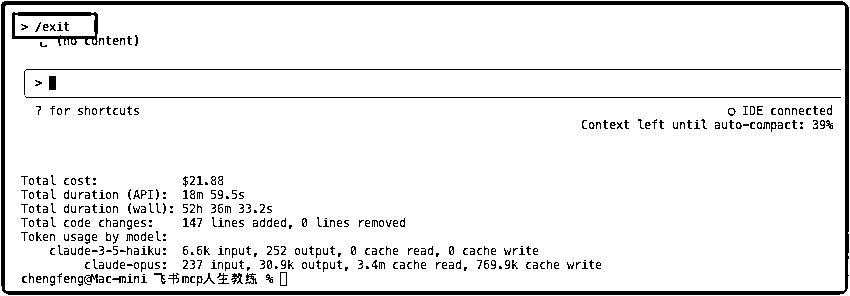

# 99%的人都不知道：MCP 必须在 Claude Code 外面装

> 来源：[https://o90p05z3t4.feishu.cn/docx/IbqKdR5Dwoc8TFxgJNHcnIVdnKl](https://o90p05z3t4.feishu.cn/docx/IbqKdR5Dwoc8TFxgJNHcnIVdnKl)

上周五晚上11点，我还在对着屏幕发呆。

"这个 MCP 到底怎么装啊？claude code，全是报错！"

因为飞书MCP的用户密钥会过期，所以需要修改 MCP配置，真的气死了。

我不信邪，继续死磕。凌晨2点，当我终于看到飞书 MCP 修改成功的提示时，差点激动得跳起来。

但你知道最讽刺的是什么吗？

解决方案其实只需要一句话：MCP 必须在 Claude Code 外面装。

文章末尾有 mcp使用的终极技巧！

# 技巧1：最关键的认知 - Claude Code 内外有别

## 99%的人都会犯的错误

几乎所有人第一次安装 MCP 都会这样做：

```
# ❌ 错误示范

> claude mcp add feishu --app-id xxx

AI执行一通，然后没依旧没有安装
```

为什么会这样？因为你在 Claude Code 对话界面里执行了系统命令。

这就像你在微信聊天框里输入"关机"，然后期待电脑会关机一样。Claude Code 对话界面和系统终端是两个完全不同的世界。

## 正确的操作方式

记住这个黄金法则：MCP 的安装必须在 Claude Code 外部进行。

任何MCP操作，都要先退出 Claude Code

退出命令： /exit



# 技巧2：搞定安装命令（不用死记硬背）

## 问题：命令太复杂记不住

MCP 的安装命令确实复杂，比如：

```
claude mcp add-json feishu '{
  "command": "npx",
  "args": ["@larksuiteoapi/lark-mcp", "mcp", "-a", "APP_ID", "-s", "SECRET"]
}'
```

看到这种命令，谁不头大？这比当年背化学元素周期表还难。

## 解决方案：让 AI 帮你生成

我发现了一个绝妙的方法：把参数告诉 Cursor，让它帮你生成完整命令。

步骤1：在 Cursor 中描述需求

```
安装飞书 MCP
{
  "mcpServers": {
    "feishu": {
      "command": "npx",
      "args": [
        "-y",
        "@larksuiteoapi/lark-mcp",
        "mcp",
        "-a",
        "cli_a8cfe74****",
        "-s",
        "mFO4aJkNV2****",
        "-u",
        "u-f0Hf3****"
      ],
      "env": {}
    }
  }
}

命令参考：claude mcp add-json feishu '{
  "command": "npx",
  "args": ["@larksuiteoapi/lark-mcp", "mcp", "-a", "APP_ID", "-s", "SECRET"]
}'
```

步骤2：Cursor 的Agent模式，会执行你的安装请求

这样你就不用记那些复杂的 JSON 格式了，直接复制粘贴执行即可。


# 技巧3：验证 MCP 是否安装成功

列出所有服务器

claude mcp list


# 技巧4：删除不需要的服务

## 删除命令

claude mcp remove <要删除的mcp名称>


# 终极技巧：一劳永逸的解决方案

看到这里，你可能还是觉得这些命令很繁琐。

我要告诉你一个好消息！

我把所有常用 MCP 服务的安装命令、配置参数、排错方法，全部整理成了一份《MCP 安装指令文档》。

这份文档的特别之处：

*   📝 包含常用服务的完整命令

*   🤖 可以直接喂给 Cursor 或其他 AI 工具

*   📋 复制粘贴就能用，零学习成本

*   🔧 包含每个服务的常见问题解决方案

## 如何使用？

超级简单的三步：

1\. 在 Cursor 里，粘贴我的提示词文档

新建文件夹，命名为“mcp指南.md”,然后粘贴下文的提示词

```
# MCP 安装配置指令文档

> 🤖 专为 AI 助手设计的 MCP 操作指令集

## 基础环境检查

```bash
# 检查 Claude Code 是否安装
claude --version

# 检查当前 MCP 服务状态
claude mcp list

# 检查特定服务详情
claude mcp get <服务名>
```

## MCP 服务管理命令

### 添加服务
```bash
# 基础添加命令
claude mcp add <服务名> <命令路径> [参数...]

# 带环境变量添加
claude mcp add <服务名> <命令路径> -e KEY1=value1 -e KEY2=value2

# JSON 配置添加（推荐复杂配置）
claude mcp add-json <服务名> '{"command": "命令", "args": ["参数1", "参数2"], "env": {"KEY": "value"}}'

# 指定作用域添加
claude mcp add -s local <服务名> <命令>     # 仅当前项目
claude mcp add -s project <服务名> <命令>  # 项目共享
claude mcp add -s user <服务名> <命令>     # 全局用户
```

### 服务操作
```bash
# 查看所有服务
claude mcp list

# 查看服务详情
claude mcp get <服务名>

# 删除服务
claude mcp remove <服务名>

# 重置项目选择
claude mcp reset-project-choices
```

## 常用 MCP 服务配置

### 飞书 MCP
```bash
claude mcp add-json feishu '{
  "command": "npx",
  "args": [
    "@larksuiteoapi/lark-mcp", "mcp",
    "-a", "APP_ID_HERE",
    "-s", "APP_SECRET_HERE",
    "-u", "USER_TOKEN_HERE"
  ],
  "env": {}
}'
```

## 项目配置文件模板

### .mcp.json 文件格式
```json
{
  "mcpServers": {
    "service-name": {
      "command": "/path/to/command",
      "args": ["arg1", "arg2"],
      "env": {
        "ENV_VAR": "value"
      }
    }
  }
}
```

## 安装操作流程

### 标准安装流程
1\. 退出 Claude 会话（如果正在运行）
2\. 在系统终端执行 MCP 安装命令
3\. 验证安装：`claude mcp list`
4\. 重新启动 Claude：`claude`
5\. 测试服务：在 Claude 中使用 `/mcp` 命令

## AI 助手操作指南

当用户需要安装 MCP 服务时，请：

1\. **确认需求**：询问用户想要安装什么类型的 MCP 服务
2\. **收集参数**：获取必要的配置信息（API Key、数据库连接等）
3\. **生成命令**：根据上述模板生成具体的安装命令
4\. **提供流程**：提醒用户按照标准安装流程操作
5\. **验证测试**：指导用户验证安装是否成功

```

操作手册会及时更新，获取最新文档，可以入群

2\. 告诉 Cursor 你的需求，并且拉动文件到对话框

```
@mcp指南.md
安装飞书 MCP：详情
```


3\. Agent自动执行

Cursor 会自动读取文档模板，生成正确的命令，甚至可以帮你自动执行

这样，你再也不用记那些复杂的命令格式了。就像有了一个随时待命的 MCP 安装助手。

# 记住这几个要点：

1\. MCP 必须在 Claude Code 外部安装（最重要！）

2\. 用 /mcp 命令验证安装状态

3\. 让 AI 帮你生成复杂的命令

4\. 使用我的指令文档，一劳永逸