# 2025如何稳定矩阵获客和精细化运营

> 来源：[https://diopczaeo03.feishu.cn/docx/Z4ejdgWZCodhXnxUSNDcyZyinlb](https://diopczaeo03.feishu.cn/docx/Z4ejdgWZCodhXnxUSNDcyZyinlb)

大家好，我是yeye/耶耶

前文概要：

本文适合已经跑通0-1，想要1-10的圈友。看之前可以先看另一篇文章 ，更侧重术

本文更侧重心法层面，会偏虚一点。

如果圈友已经跑通1-10了，转化率高于同行平均水平，也有对应的升单体系，不愁流量/转化可以直接跳过，没你什么事...只需要用各种渠道买号，多做号，优化流量渠道（包括b站，视频号，各大社群，fb，reddit，x，youtube等等）尽快做付费投放或者优质短视频（赛道没办法投放或者投产比不高，就做优质内容，培养网感，本文会提及）70%以上精力在流量放大和团队搭建，颗粒度细化sop，优化销售漏斗节点，最好派个心腹去同行当长期卧底，我最近发现发红包，也不如派个心腹去同行公司好，太多细节了。包括sop，最快的方式就是抄。飞书多维表格（看日/周数据），飞书知识问答（这个功能不选择联网很强，把团队的sop都丢进去，员工有问题直接提问即可。团队有时候问题不是sop不够细致，是sop太多了，各种嵌套sop）搭建erp系统，搭团队（能够自闭环，培养/筛选优秀的运营和销冠，给够钱）人才体系，年度计划（蓄水，预热，大促，返场）企业文化，等待风口起飞即可。

本文分为两条线

明线：2025年如何稳定矩阵获客和精细化运营

暗线：如何去寻找需求/痛点做出爆款，如何打造高效的赚钱模式/生意，算账思维，

全文2.1w字，预计阅读时长20-30分钟。

## 一、私域还能做吗？

今年大家做小红书/抖音获客多少遇到挫折，小红书自然流不给流量，抖音频繁实名认证，小红书跳资质等等，多少肯定有被打击，甚至有圈友都开始质疑起行业了，问：到底还能不能做获客？

答案肯定是毫无疑问，大家可以从五个角度去思考：

1.  利润=（曝光/流量）*转化*客单价-成本

各大平台算法决定了互联网做流量是一对多的关系，杠杆率非常非常非常高

特别是做自然流量的，只要前3s，前5s能留住人，一个晚上就能达到10w＋，如果视频内容有分享（评论/转发多）的价值，百万播放量并不难。

成本足够低，而且很多圈友都是做知识付费类目，成本极低，要是这都不好做，重资产行业只会更惨。

凡事我们要看对比，现在很多制造业不走规模已经赚不到钱了，以超多的量来覆盖早期成本的亏损，普通人没啥机会，几千万都烧不起。普通人千万不要去碰重资产的项目，比如：制造业，最近某充电宝，品牌之前烧了多少钱，都有口碑了，一款品出现问题直接停产6个月，背后又要裁掉多少人，砍多少业务线，又要花多少钱疏通guanxi？

1.  私域价值远没有被完全挖掘：

*   朋友圈大家曝光的概率相同，营销费用接近0，不需要花钱投广

如果个人微信朋友圈能投放获得更多曝光，你敢想吗？？做电商换个品就需要投流，shua单，很难有沉淀

*   营销检测不算严格，腾挪空间很大（今年虽然出了朋友圈折叠，说明大家被营销烦到了，但营销开始有门槛了，如何写朋友圈变得更有价值了）

*   私域存在巨大的信息差，竞争对手相对少（不知道案例真假，朋友圈是否仅你可见，差评几乎为0）

”资源差＞认知差＞信息差“：所谓资源差不是普通人该想的，我们普通人和有能源/土地/权力的二代们比不了，如果说私域资源差——那就是号的数量，优秀能打的团队，至于投放，sop，薪酬体系那些真不难，都是信息差，生财里面什么都有。认知差无非是海量的信息差＋大脑整合+执行反馈的结果。

现在私域为什么大家都说要做“高客单，高复购，高利润，高转介绍”？无非是我们的获客成本提高了，不做高客单，利润太少，做不大。

那什么赛道才能做高客单？那必然是信息差足够大，一定程度的非标。比如留学，玄学（国学，塔罗，风水）教别人做出海，雅思托福Gre，情感，投资，投机，古董，医美等等。为什么生财有术能卖3365r这个客单价，因为它是一个高质量信息聚合平台，且大部分内容都是文字，文字所包含的信息要远超过短视频。——当然也有人说信息没那么值钱，把信息落地才值钱，所以航海也是知识付费的一种趋势

很多圈友忽略了信息差的价值，你知道的比别人多，你知道的比别人早，你就能赚钱。我们做一个生意要么掌握信息优势，要么掌握成本优势，包括这篇文章，无非只是我把我知道的，我看到的，我实践的，我身边的小圈子展现出来。

案例：2020-2022年时候身边有前辈通过囤碳酸锂、熔喷布（口罩原材料）当时熔喷布最猛的时候今天怼1w块钱货，明天就能7w卖出去！最高是40天翻了30倍。（我当时高一，在亲戚公司帮忙，印象最深的是疯狂招人，连口罩包装都用上武汉大学本科生了）其实茅台，年初的蛇钞，labubu是一模一样的玩法，都是信息差，你要足够早，胆子够大。

我近期发现的信息差：

1.  成绩不高去剑桥大学读本科花300-400w就可以了，去哈佛500-800w（人民币）。绩点排60%即可，其他的软背景都可以花钱充值，三中一华也能给你刷满。

1.  最近阿里巴巴开始收13%的所得税了，之前广州起码90%的电商都没交税....

1.  各种美团饿了么券，00后少数的红利....美团输入“我想要600”，9.9r买600块钱的券（每月发50r）哪怕再小的信息差也有几亿人不知道。

1.  做电商拿货成本并没有那么重，5000块钱足矣跑通闭环，通过阿里巴巴联系店家，能知道同行拿货的商家，说货盘很重的，要么是在骗你，要么就是货拿多了.....

*   微信具有天然的社交属性，私域的下半场在于经营信任，经营人心，私域尽头是粉丝经济

顾客买的是你这个人背后的服务，跟随的是你这个人，而不是单纯这个服务本身。很多机构认为互联网只是把线下搬到线上，朋友圈天天发广告，要么晒收益/肌肉，要么晒价格，根本没有把用户捧在心上，运营非常粗糙。

*   用户价值（LTV）上限足够高，赚钱效率足够高（后文细讲）

1.  私域依然有普通人翻身的机会

这几年陆陆续续有明星直播带货，吴彦祖都开始卖英语课了，汪峰都开始卖音乐课了，等大资本入场的时候普通人的机会就很少了，现在再去抖音直播间卖个399r的英语课，难如上青天。趁现在明星们还没开始做私域，还有机会。

我们可以想象一个画面：

20xx年，周杰伦在小红书/抖音发一个口播视频，拉满投放，得拿多少量？哪怕出价不高，CTR(点击率)直接拉满，eCPM（有效千次曝光成本）,CVR（转化率）,ROI（投产比）得多高？你敢想象某天你在刷朋友圈，发现你的好友都在周杰伦朋友圈底下评论么？

明星也希望能得到免费持续触达，营销/宣传是需要成本的（微博热搜也得花钱买，活动/品牌宣发也都要花不少钱，还未必精准）要是团队用saas软件管理2000个满人微信号，2000w精准私域粉丝，冲个热搜热榜，简直不要太轻松，后面要是卖各种课程，解决完收款渠道得多爽？？甚至都不在抖音直播了，直接开发独立站私域直播，不敢想不敢想。

1.  未来有没有可能出现去中心化的链？（web3等等）大家不再需要“微信”这个社交软件？

有可能，但是我们要想一件事情，做生意赚钱说白了就是满足人的需求，你一定需要对接人，用户也需要时间迁移，而微信是人与人之间距离最近的社交平台，你带着用户去链上是效率最高的方式。

当我们迁移平台，如果是在公域平台引导粉丝换平台，平台不封你就不错了。就好像早期的公众号大v，想建立星球，公众号就是你启动冷启动的一个渠道。

1.  今年引流团队的波动性很大（人员流动性很高，甚至很多团队直接解散了）封号啥的严重，凡事要从底层逻辑去思考，平台本身并不会莫名奇妙封号，平台是需要创作者的，平台是需要拥抱创作者的。生财有术也是平台，平台巴不得用户沉迷在这个平台。今年小红书我们感觉素人账号（足够真实）比之前有流量了，这一点可能和大家频繁封号的感受有些偏差。

其实大家也可以换个角度，我们顶天是个小卡拉米，有时候经过平台打压，sop不够细化，账号不够多，人效拉不满的团队直接原地解散，作品批量下架，他们没吃下的量，就是我们的增量，这是我们翻身的时候。

用a种b收（买家秀）的引流转化效果是最好的（现在有求职机构都开始在boss上a中b收了....）因为完全符合了小红书目前的slogan/口号——年轻人的生活兴趣社区，也是最难被封号的。限流封号无非几种情况，你的内容AI味太明显，你的引流痕迹过重，你的网络没隔离好，账号本身有问题（可能账号本身已经被用过了，最后被运营商收回，概率问题）网络问题（路由器问题，你工作的那栋楼曾经有人搞黑灰产有问题）小红书封错了。

目前我们还是选择一机一卡一号，账号厅卡稳定性和流量最好，设备越贵越好（大概苹果12往上基本上就差不多，华为mate60流量很好，甚至一个设备登3个号都不影响流量）不用任何矩阵分发软件（我们用测试一些软件后怎么发都没流量，不排除有圈友用软件用的很好）至于号的数量（线下办理优先，其次是找渠道买号，最好招个家里多孩子爱搞钱的潮汕人，开个100个号完全没问题.....)至于养号（我们发现在直播间/商城购物的号和注册时间最长的号是存活时间最长的，说实话模拟真人刷3天号的逻辑我至今没搞明白，既然是养号，多带手机出门走走，直接跟日常使用一模一样就ok。）

* * *

总之，私域大有可为。对于各种平台政策打压封号限流，我们只需要多计提固定损耗即可，不花半分钟内耗。把注意力聚焦在能我们能优化迭代的地方。

我们的目标不是干平台，不是干同行（不然你会很内耗，看到同行起飞很焦虑的）是找到并满足顾客的需求，是赚钱，是引流，那我们要么找到渠道堆号，要么提高内容创作能力，要么精细化运营，提高转化。

为什么我要花那么长的篇幅论证私域的价值？

因为我发现很多圈友不是不会引流，不是不会运营，不是不会投放，而是对自己/当下做的事情没有信心。只要信心解决了，其他的术，无非只是时间长短的问题。

## 二、算清两笔账

### 2.1成本

建议所有圈友做项目跑通0-1，准备1-10后，要列张表，把每一笔开销都算进去（包括自己的时间，换算成时薪）好判断好不好招人，不然很容易亏钱/低效率！很多圈友没有财会的知识，会高估/低估成本。

比如说矩阵手机，其实也没那么贵，二手设备可以倒卖出去，找些便宜可靠的平台380r买一个设备（二手华为mate20，卖出去也能有300r) 你的成本就是80r，而不是380r。还有路由器，二手空调，二手桌子等等，电脑能租就租（二手转三手的折损是很低的，实际我们持有成本并不高）同时设备买贵一点，工作效率能提高很多，光是卡顿就很影响效率。

再比如，三线城市的劳动力成本低，办公场地成本低，但小城市交通不方便，不好招员工。哪怕二三线场地成本和人员成本更低，但是在一线城市快递费低（量大和快递商谈，广州能比三线城市低0.8r/件，一天5000单就是4k，一个月就能多出来12w的毛利，再精细化就是快递包装体积的大小，降低仓储费，一些尾货早点废品卖掉）且更容易招人，团队更能打（二三线城市节奏相对慢，容易有惰性）——当然是有不少团队在三线城市搭团队，且过的还不错，核心是因为sop打磨到极致，员工每日工作内容已经优化到极致了。

现在做自然流量获客大家一定要多利用皮糙肉厚，听话照做的大学生（招实习生也行，日薪120r能找到本科大学生，月休一天的话，相当于120*25=3000块钱。有些私域团队基层流动性特别大，用账号的折损去对冲，基本上几个月换一轮基层执行）

因为招基层员工人无非是重复，除非招合伙人（合伙人最多不宜超过两个，初创团队个人建议是夫妻档＋一个合伙人，不是这样的组织架构，很难走到最后，特别是跨境电商，身边有人一开始说的好好的，拿货一起拿，最后都闹的不太愉快，做海外仓储管理费很贵，特别是美区，时不时给你来个0元购就更难受了，报活动五折加五折，了解跨境电商的自然懂——简单来说，按照我们华人的习惯，5折＋5折的折扣是25%，但是亚马逊直接变成0元购）

人和人的差异很大，千万不要把自己的标准放在员工上，你永远想象不到员工内心有多少小九九，而且我们给的钱不多

劳动力套利不香吗？

不要中了一人公司的毒，AI虽然很强，但是会用AI的人才更强。

最近见了不少圈友，发现很多圈友都对招人有恐惧感，试图通过开发工作流，不招员工。人是工具，AI也是工具，这两者并不冲突，目前对于私域而言，内容依旧是需要人来写，AI只能提到一个辅助，包括飞书多维表格结合deepseek也是一样，顶多是提供一个选题和大纲，具体内容还是得人改，没办法完全取代人。

如果有圈友反驳，已经能够让AI自己生成内容不需要修改直接发布了，请晒出证明：单作品引流客资，以及爆款概率，账号存活时间，起码要200个帖子/视频以上。我愿意为如何使用AI而付费。主要是近期太容易封号了，算了下账号折损我们顶不住这个消耗，我们内容会更优质一些。

为什么说私域比电商好做？（欧洲，美区例外，不过这两年因为temu进军，亚马逊也没有以前那么好做）

一方面是沉淀和积累，以及长期投流。另一方面是电商做到一定程度你一定会想着做自营，就需要自己拿货，怼货多了，你会想要自己买设备来做品，设备多了，你会慢慢变成供应商，回款周期开始拉长！！（短的话几个月，长的话就只能多计提坏账）你的库存是很难把控好的，2000平方都是算小的。特别是05-15年期间开厂的，到最后库存完全清不了，产品迭代太快了，最后只能按照几十块/吨甩掉，和废品没多差。而且一旦你开厂，各种麻烦事情就上来了，特别是小地方，光是解决消防部门就能折腾很久，更别说税务了。（懂得都懂）

### 2.2效率

先说案例：

5月份我们跑通一个小赛道，算了一笔账发现赛道上限太低。

一个号平均能引流15个人（泛粉），20个号一天就是引流300个人，这里我们先不算折损（一个人的精力总是有限的，一旦上多个号，我们注定会不那么精细化，引流到微信的人数没法那么多）

转化率是5%，毛利是40%，客单价150r，我们也不考虑成交周期，假设当天进来就可转化，如果采取1v1点销，每月毛利就是300*5%*40%*150*30=27000元。

我们一对一点销需要花很多精力，假如我们配3个销售，一天接待100人（其实不现实的，除非这是超级赛尔人。我们自己全能，哪里需要我们去哪里，一会帮忙引流，一会帮忙销售）

人员成本 (总计: 19400元)

*   固定底薪部分 (合计: 14000元)：

销售人员 (3人)：3500元/人 × 3人 = 10500元（假设销售底薪每月3500块钱）

引流人员 (1人)：3500元/人 × 1人 = 3500元（假设流量底薪每月3500块钱）

*   提成部分 (合计: 5,400元)：27,000元 (月度毛利润) × 20% (提成比例) = 5,400元

平均下来员工第一个月薪资4850r。

我们可以开始算账号成本了，假如全是小红书账号好了，且我们有渠道买号，一个小红书号30块钱（一般来说价格在15-30r左右），账号存活周期是1周（账号能存活一个星期，这个引流人员就不够格）那我们一个月需要折损20*4*30=2400元的账号。我们再算广州的工作室和水电，我们算白云区靠近机场的工作室（算半个郊区）我们算60平方，假设25r/平方，算上水，电，网络，偶尔的福利，我们算每月2000元。

此时我们每月可变成本是19400+2400+2000=23600元。

这里我们先不算固定成本，比如买的二手手机，路由器，那我们到手的净利润=27000-23600=3400元，搞半天我们到自己手上的净利润还不如打工高。那说明我们招人没办法打正，这个模式是走不通的，哪怕我们能跑通0-1赚到第一块钱，做免费流就很难自营扩大。（我们还是有渠道，能拿到大量号，没有一机一卡一号，不需要话费不需要办卡费用，才有这个利润）

那就有7种策略：

1.  提高客单价提高利润率

1.  接受短期的薄利，先搭个能打的团队，集中精力做后续的升单和复购

1.  把一对一点销转为朋友圈营销，从一对一转为一对多（本质还是利用互联网杠杠思维）集中精力放在流量板块，接受较长的回款周期

1.  付费投放，把侧重点放在销售和朋友圈营销上（虽然付费投放需要给平台钱，这样我们可以减少流量端招人，投放成本未必比自然流量低，因为我们要算人员薪资，号，手机，政策波动性带来的心力损耗，有时候免费的反而最贵）

1.  降低人员薪资，转到二三线城市去搭团队，或者招线上兼职

1.  通过阿米巴知识付费放大，轻资产放大，我们负责后端服务搭建

1.  放弃深耕，当作练手

最后我们选择第7个策略，主要有两个原因

1.  最直接的原因利润太低了，这类人群消费能力低，不改变商业模式容易造成团队规模很大，人效不高，利润低。——现金流＞利润＞规模

1.  本身有更高净值自营盘，且单粉产值是这个赛道的28倍（210r左右）在账号封控这么严重的情况下，做高客单价高利润的赛道更好，没必要去损耗精力

* * *

不管是做流量还是做销售，我们都要把赚钱效率刻在脑子里。我们需要经常测试，找到投产比高的流量转化模型，比如AB测试

AB测试：在互联网行业，A/B测试是为Web或App界面或流程制作两个（A/B）或多个（A/B/n）版本，在同一时间维度，分别让组成成分相同（相似）的访客群组（目标人群）随机的访问这些版本，收集各群组的用户体验数据和业务数据，最后分析、评估出最好版本，正式采用。

说人话就是控制变量法，通过改变某个环节，对数据有什么影响。

我之前在某手机厂做过一个非常非常细分的岗位——手机屏幕的浏览器广告业务投放，是需要用sql分析的投放计划的，建的投放计划比较多，数据量很大，excel表格根本不够分析

做私域AB测试，测试不同模板，不同平台，我们的参考唯一标准就是一天获客量多少？转化周期多长？转化率？总成本？

比如：

投放：无非是素材好不好，计划能不能跑得出去，具体而言就是对应数据——CTR，eCPM，CVR，ROI，CPL

引流效率：投放＞截流＞自热

引流的丝滑程度（感谢圈友科普这个概念）：如果通过小红书群聊，到顾客找到并加我们微信，这一流程太慢了，当然这也是账号最安全的方法，但是细算下效率，我们发现不值当，宁可效率提高，账号折损高一点

后端转化率：IP＞自热≈投放＞截流

截流也分为两种，一种是评论区留个钩子等其他人主动联系你，一种是1v1私聊评论区底下的其他客户。哪种好？——当然是前者，因为前者是互联网获客的思维，一对多的关系，后者依旧是通过单位时间换钱，也不够精准（你的同行很多！）。

自热和截流哪个好，肯定是自热，截流不是主动吸引，你需要更多信任（转化周期更长）但假如你创作质量实在太差，那可以在别人爆款的评论区下截流。——当然，这种方式注定会很卷，毕竟实力不行，你没得选。

* * *

运营成本：

很多圈友说矩阵单人日引千粉，但都是很泛的粉，我们放大业务是需要考虑人效的，是需要考虑运营成本的。

运营成本被好多人忽略了，不管流量是否精准。——哪怕你一天引流足够多的泛粉，你也要想变现效率啊，当然我们的投放价格过于低就无所谓了，很多圈友私域是很泛的人群，就是为了投放换量，因为流量只会越来越贵，用时间换空间。

一旦我们的运营成本过长，很考虑现金流！那就和电商没区别！！！（如果是这样的话，电商也未必比私域差，电商的优点是不和平台对抗，只需要精细运营和刷即可，缺点是货盘和持续投流，没积累）

ab测试不一定要自己去做，可以通过知识付费卖项目放大，自己找到的几种引流方式录视频或者用飞书文档做sop去教学，让付费学员去跑，学员哪个跑出好结果再自营盘扩大。

一方面你可以把学费用在到自营盘放大，另一方面可以带人赚钱，通过学员反馈你可以提高赚钱效率。（鼓励学员创新和分享，遇到比较牛的学员直接拉来当合伙人）

当然如果你以前可以跑通一个模型，学员尝试后发现没办法跑通，那可以适当退款，你依然是有收获的，因为你发现这条路现在走不通了。——你相当于免费招了个员工给你踩坑了，因为你的教学成本很低，做个sop或者视频就能跑通了，不香吗？

有圈友说：当一个赛道需要精细化运营的时候，说明已经没那么好做了。——我认同这个观点，有时候不要太倔强，非要守着那个日渐不好做的盘子，不妨大胆一点，换赛道

* * *

高效的赚钱模式

案例：

前阵子亦仁老大发了个超级标——b站好物带货，我发现门槛比知乎好物高，做好需要拍实物视频，剪视频，但我想了下如果做我会怎么去做，如何去提高赚钱效率。

1.  现在，立刻，马上，刷生财有术精华帖并做笔记，去b站人肉搜索调研100个可以模仿的同行，写下你觉得难复制的点。

1.  找到几个做起来的圈友（为什么是几个，找一个你可能不清楚难点是哪里，找了几个后你会发现来来回回都是那几个点，立马祛魅，不畏难）发红包付费弥补一下认知，起码做5个号，防止号本身的问题，下场实战跑0-1，赚到第1块钱，立马把全流程发在生财有术等各种社群，坐等加精华，早就是优势！

1.  不断做AB测试，找到投产比高一点的流量销售模型（对b站好物带货来说，那就是测试单位视频能带来多少销售额，怎么用AI提效）拉满工作时长（14-16h顶天了）赚到1w元后，将做号细节录制下来，这个时候可以开始找b站工作人员（和找大哥一样的逻辑，有时候大哥一句提点少走10年弯路）有什么信息你先知道。

1.  估算下人效，人力roi能打正赶紧招助理，把杂事写下来，写sop，招人放大（能做自营争取做自营，roi高的时候自营放大比知识付费快得多）

1.  如果你视频质量高，现金流充足，还可以做投放或者做ip。当然最优途径还是无死角模仿来的快，大部分人没办法解决镜头恐惧症

1.  开始在生财分享你如何1-10做b站好物带货细节，怎么解决账号问题，怎么选品类的，怎么一步步迭代的。坐等加精华。

1.  如果生财后续开航海实战，争取报名航海教练，积攒影响力。在航海教学过程中，你肯定会遇到各种问题，记录下来船员的问题，梳理成百问百答，非常细化的sop（细致到90岁老奶奶都能拍视频剪视频上传b站）

1.  航海结束后，肯定会有拿到小结果的圈友，这些圈友就是你的真实学员案例，如果圈友愿意深耕，可以拉入自营团队。

1.  开始卖课做知识付费，和一些圈友合作（把别人的私域当自己的私域，让别人给自己分销）如果能力强，精力足，自己去搭一个流量团队，专门打商业粉，但建议直接和靠谱打粉圈友买量（自己去引流太累了，精力不够，效率不够高）一方面是你可以有航海教练的title（肯定很多人加你微信好友，比自己打商业粉卖课转化率要高得多，背书很值钱啊，这时候肯定有其他社群找你做分享）一方面项目是红利期，成功率不低，且项目新颖有卖点。一方面是你已经有教学经验了，基本上95%的问题你都能解决。

1.  找大量的b站号供应商，和他们合作，或者自己看看能不能解决号的问题，你提供客户，号越稳定的越好，或者你从做到1w块钱后，开始大量买号了，可以不为做b站赚钱，专门怼号后期卖给需要做b站的人

我个人的一点点猜想：b站现在属于是种草阶段，种草总要人来拔草，现在虽然有不少私域团队做b站引流，但是效果还是不如抖音小红书，毕竟是个长视频平台，人群太年轻。要做好没那么容易，但会不会出现一个情况，私域团队流量渠道转移到b站呢？（那账号依旧是稀缺品）

1.  做升单

*   普通教学卖299-499r，我们就只提供教学课程（录播课和sop）5人的售后群，几乎0交付成本

*   高级教学卖980-2980r，我们给学员提供1000粉丝的账号（成本合适的话，可以送5-10个号，并且之前我们掌握渠道，还可以卖号套利）教学课程并提供微信群助教陪跑服务（微商俗称高级代理）

*   再高端的话，我们卖6980r，在做矩阵（大量号）的时候，肯定会遇到很多杂事，你要么自己开发工作流提效了，要么就是找人开发剪辑/去重软件了。没错，这一价位我们重点卖工具，如果是你自己开发的app，你还可以卖AI课，并且每月邀请优秀嘉宾分享，季度线下见面会。

*   再高端的话，往mcn方向发展，签合约。或者教你如何写脚本，做编导，做ip，锻炼表达力，线下2天一夜教学19800r（类似于影视飓风的知识付费版本，当然影视飓风不可复制，他们成本很高！我们能做到一个腰部就很厉害了，签大量达人博概率即可）——有人说：做ip不赚钱，教别人怎么做ip才赚钱哈哈哈哈

这套模式很多赛道可以一通百通，美甲，面膜，保健品，a货，演唱会票务，水晶，留学代理，代购，自习室，台球厅，卫生巾等等。本质就是加盟的模式——微商代理的模式真的很强，并且传统加盟商需要花很多钱打广告营销，在私域营销成本接近0，朋友圈持续触达即可。

如果纯做项目，你的用户价值不够高，但是你结合私域做知识付费，你不单单可以赚到钱，还可以积累团队，未来——应该是人人都该做私域。

* * *

日常生活案例：永远比别人多想两步，能做庄要争取当庄

之前有圈友提到德州扑克，我前阵子去了解了下规则，发现本质是个数学游戏，综合分析胜率、位置、筹码量、对手范围之后，去寻找并执行那些数学期望值为正的下注、跟注或弃牌决策。

我们大多数人刚接触一个新事物时，都处于这个层面——在牌桌上先玩几把，体验一下赢牌的快乐和输牌的刺激。他们下注的依据，是“我感觉这手牌不错”，决策完全被情绪和运气主宰。大部分人就此打住。

部分不满足于纯娱乐的人，会进入第二层。他们会去看一些策略，学习一些固定的“牌理”：什么位置可以跟注，什么牌应该直接弃牌，什么时候可以加注。他们开始遵守规则，不再盲目下注。 但这些策略是笼统的，很难量化。本质上，还是一个“按规则出牌”的赌徒，只是输得比较慢而已。

再高一层：

那我们就要想，如何将决策过程彻底量化，我让朋友在sci期刊找到一份曾经在多玩家游戏中击败世界顶级牌手的AI——Pluribus的核心代码......

把代码发给AI给你制定一个能储存在你脑海里的简单策略即可。（毕竟我们目的不是为了打败顶级选手，只是为了打败牌桌上那些靠感觉和情绪做决策的牌手。）

源代码如下，感兴趣可以交给gemini和ChatGPT告诉你代码逻辑，我不懂一点代码....大概懂个逻辑而已

到项目上也是多想一步，当别人在说xxx很赚钱的时候，你要想我怎么才能赚到想通过xxx赚钱的人的钱，当你对一个领域的了解越深，信息掌握得越充足，你自然就有了信息优势。同时，你把你每天做的事情都用“量化思维”去审视和优化，你的效率就会提升，赚钱也就成了一件自然而然的事情。

* * *

## 三、用户思维

前文我们解决完信心了，账号问题解决了，算完账了，思维层面，那我们接下来终于可以开始从流量产品切入了。

为什么我要把流量产品放在同一个板块？

其实大家都说自己缺流量，获客成本高，矩阵获客难，但其实怎么获客，市场都是有答案可以直接抄的，那为什么大家却依旧说缺流量？？

原因只有一个——我们没找到能够1比1复制的同行，没有找到好的转化素材，进而引流转化效率低，做流量如果不懂自己的产品，就没有办法找到需要我们产品的用户群。（光是找到精准同行都可以开一门课）

只有我们知道自己的产品卖点是什么，能解决什么样的问题，我们才能找到需要我们服务/产品的顾客。——为什么电商选品占7成，因为品不好，怎么优化都没用。产品经理最需要听的是用户的声音，但未必要根据用户的不满做出改变。

包括我在写这篇文章也是先参加三次生财的线下组局，搜集圈友们的困惑点，防止自嗨。这可以称为商业洞察力，找到人们的需求，放在互联网上，可以理解为网感

### 3.1什么是网感？

我举几个生活日常例子

案例一：男生送女生花

*   网感5分的男生，可能在美团或者线下随便找家店定，搜索“广州xx区花店”，“广州花店”，如果审美能力不到位，很容易出错

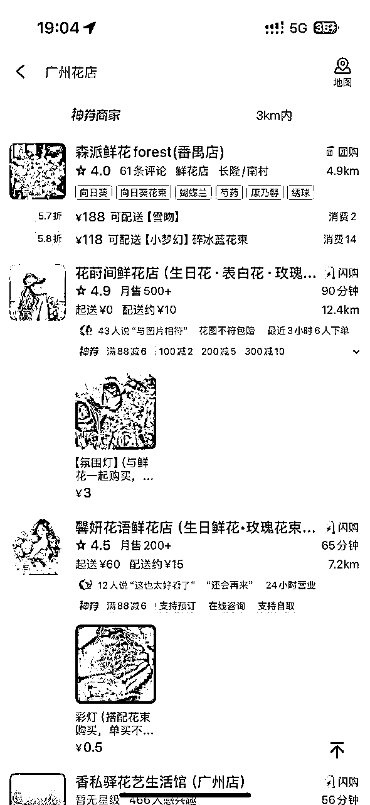

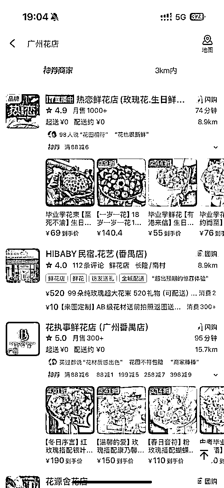

*   网感6分的男生，会在小红书搜索“送女朋友花”，“广州送女朋友花”等等

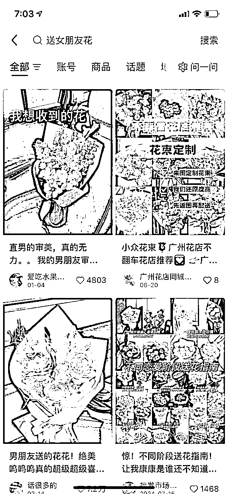

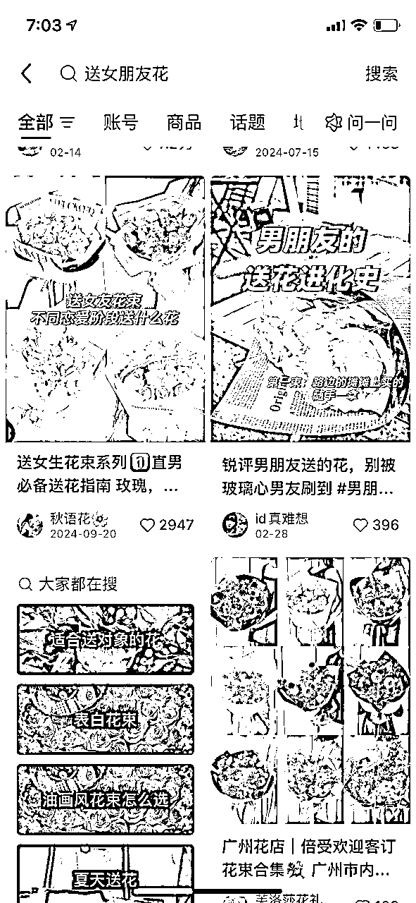

*   网感7分的男生，会在小红书搜索“送闺蜜花”——很多人不理解为什么？因为这样的搜索词是从女生角度出发，是女生的审美，女生送女生，审美要求会更高（很多人买产品就是图好看）

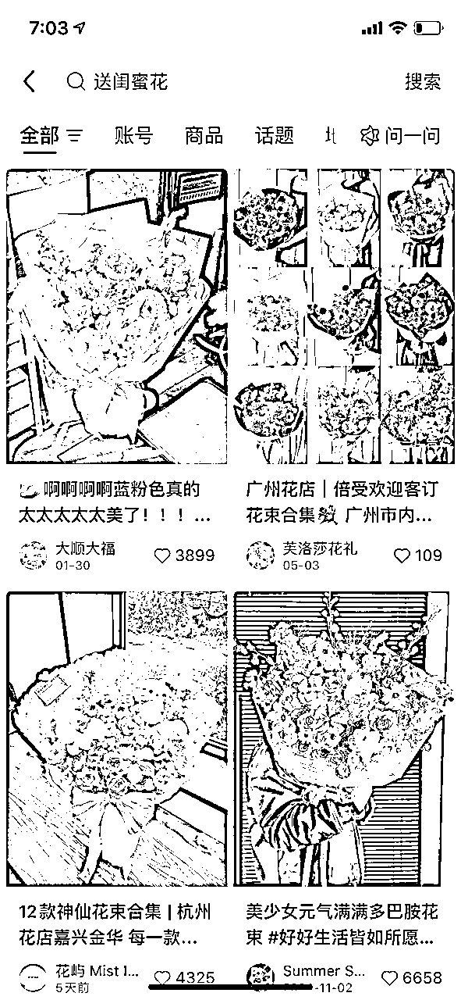

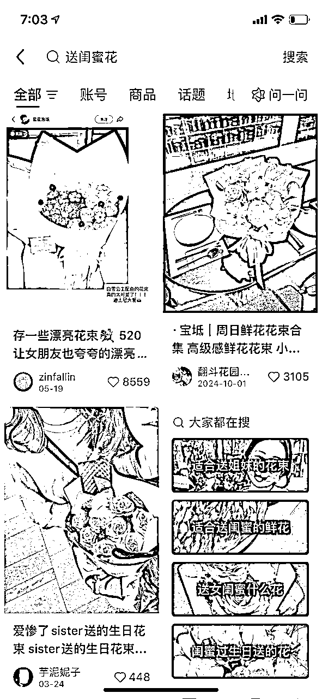

*   网感8分的话，在7分的基础上，会大概估算花的成本，防止被割韭菜，很多花的来源地是云南大理，大家可以搜一下“云南大理花批发”，成本巨低。

*   网感10分的话，审美能力很好，附加更多情绪价值，惊喜。

为防止其他因素影响，上面这几个图，都是用刚注册的小红书号和美团进行搜索，都是苹果手机

案例二：如果你现在是做AI套壳产品的，最怕的就是自己空想，自己以为市场有这个需求。可以多利用社交平台，找到有需求的产品，能变现的产品，不要为了做产品而做产品。

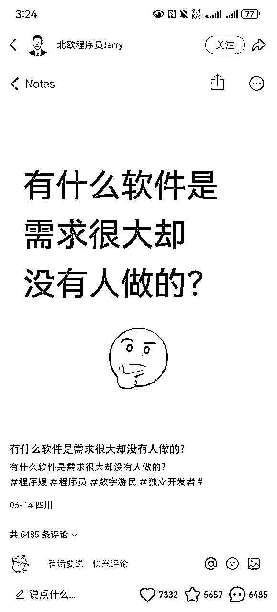

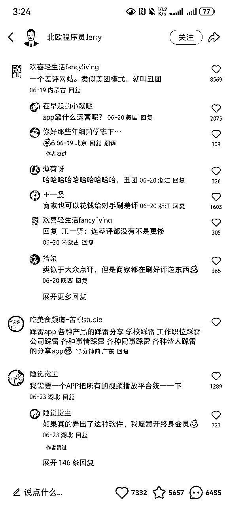

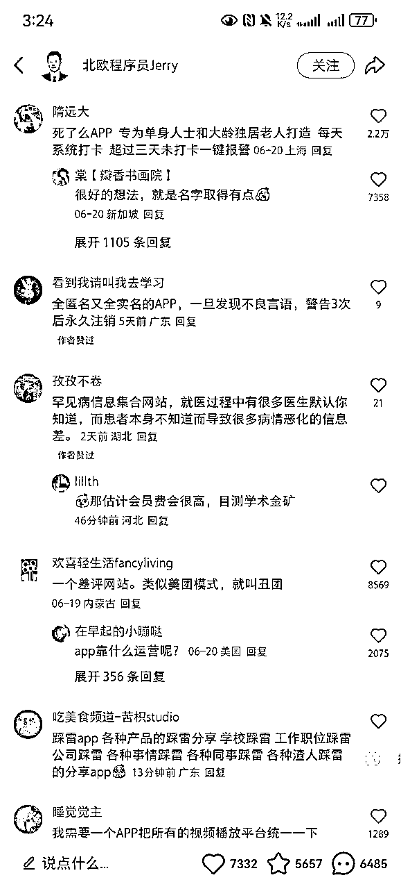

案例三：

生财有术社群的#问题求助栏目，你会发现圈友们的困惑非常杂，其实很多问题通过搜索/问AI就能得到答案，但是你如果解答了圈友的困惑，把困惑罗列下来，你也许就能从中赚到钱呢？

有圈友就是通过问题求助栏目找到对应的产品/服务，进而发风向标。

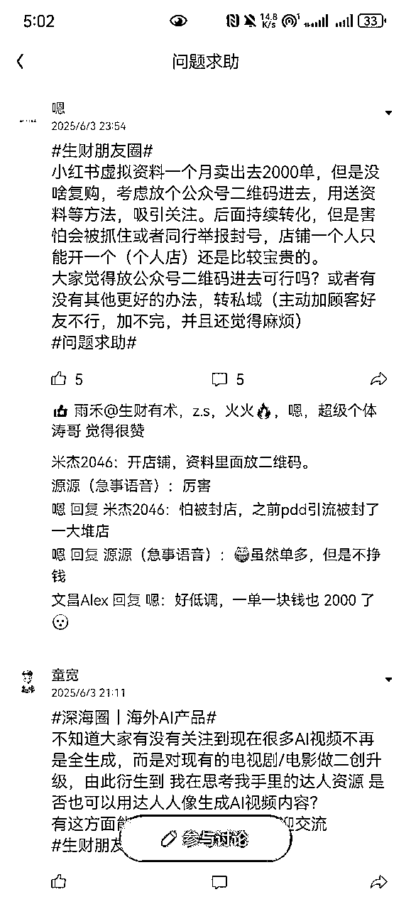

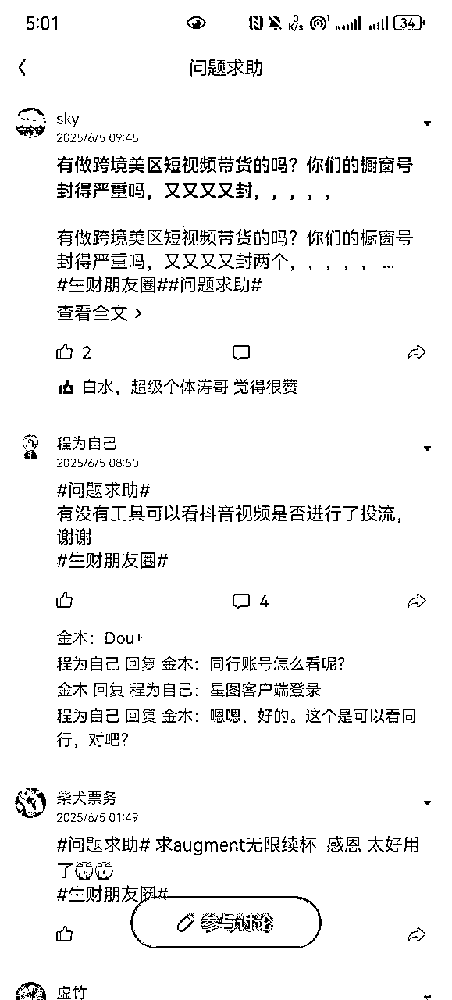

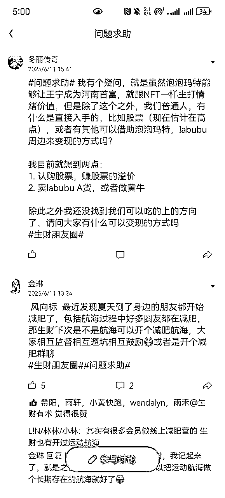

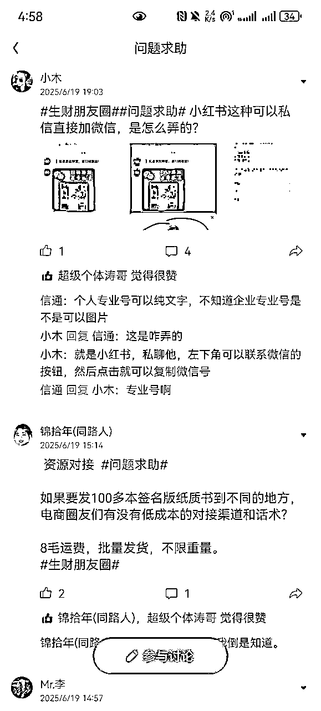

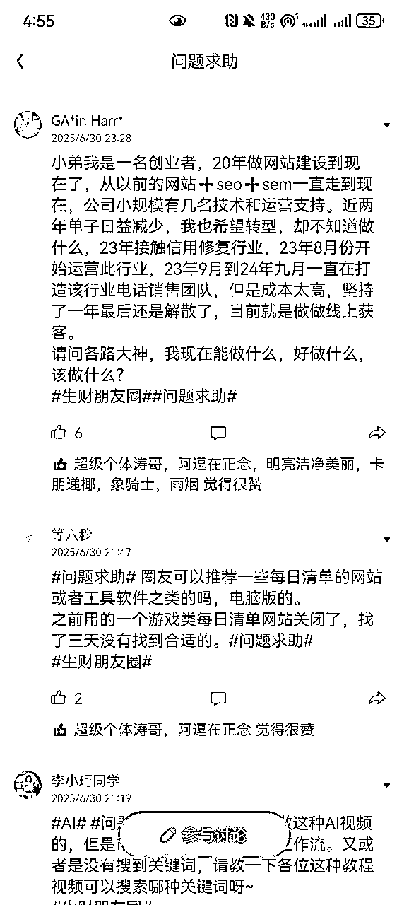

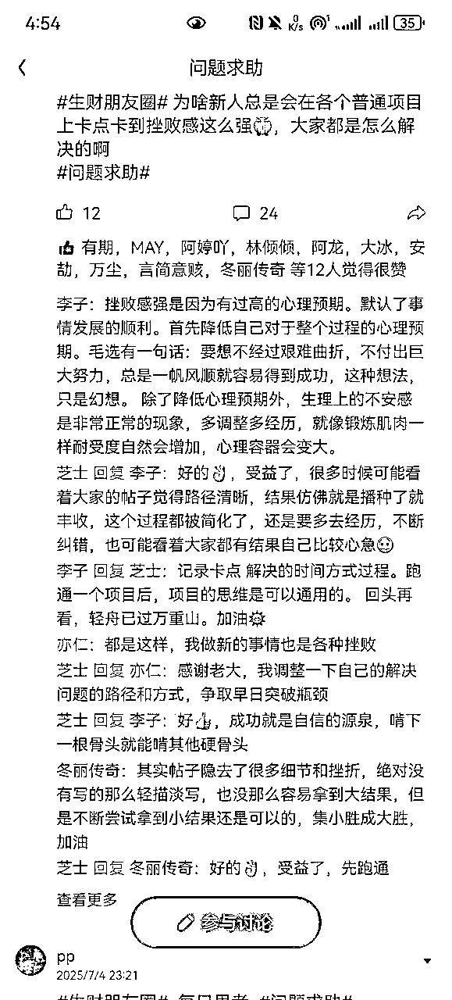

很多人以为网感是知道最新的热点和“梗”，但往深了讲，网感是一种对互联网深刻的直觉洞察力和驾驭能力，它融合了对平台规则、内容趋势、和用户心理的精准把握。一个具备网感的人，不仅能敏锐捕捉热点与“梗”，更能逆向思考用户的真实搜索意图和行为逻辑，像“本地人”一样使用网络语言进行沟通，并最终将这种基于经验的直觉与数据分析相结合，从而在海量信息中高效地发现商业机会并与用户建立连接。

我们在做某个赛道，要对那个人群有画面感，因为私域本质上是社交，经营信任。年龄，城市，有什么困惑，智商如何，会不会自卑，自大，自负，有没有什么创伤。最好和这类人群交个朋友（我有一些10后的小朋友，很早熟！00后已经有点落伍了）

通过朋友圈和头像能够判断：

1.  大学生（什么类型的大学，什么城市）

1.  打工人（一二三线，大厂，中厂，外企到底）

1.  创业者

1.  宝妈

1.  富二代

1.  体制内

1.  名媛

对你顾客受众更加细分化，特别是卖非标品，要多尝试大胆要价，哪怕可能会丢单子，自信和底气是要慢慢积累的（之前我们做一个相对非标的赛道，根据顾客朋友圈精致/有钱与否进而定价，客单价是同行4倍，用户还复购了...）

1.  去哪里旅游：南极非洲是一档，欧美是一档，东南亚和日韩是一档

1.  去哪里留学：美国英国澳洲留学，日本德国留学，对应的消费力也不一样（德国留学顾客抠搜的多，美国英国澳洲留学的是最好转化的，而且单粉产值高）

### 3.2为什么要培养网感？

做私域目的就是引流。那我们培养网感目的就是找到你的一比一对标同行，找到相对精准的用户，发现新的玩法，找到投产比高的流量和转化模型（对标同行是需要每月/周更替的，不是说你今天同行是他，明天还是他）

我们经常凌晨1-4点刷到非合规赛道在抖音/小红书做投放转到微信和网页，账号只能存活一晚，哪怕抖音小红书风控严，但一直有团队做，说明roi能打正。

我们也发现国学账号在小红书单作品自然流量精准客资1000+，而且内容完全可以一比一抄，有手就行系列。如果你刷不到那说明你刷的不够多——对于这种赛道，哪怕账号封了又咋滴，一个号才多少钱

找到投产比高的流量和转化模型（AB测试）是赚钱最最最困难的一步（大家一定一定一定要花很多时间和精力在这上面！！早期一定要多迭代，不要用战术的勤奋去掩盖战略的懒惰，早期你的试错成本很低。）在此基础上投放/招人放大/税务/场地/公司注册并没有那么难。

现在很多团队都做矩阵，但是内容太粗糙了，说白了就是素材不好，如果我是平台我不封你我封谁，当然如果你的投产比足够高，那我们就别想精细化，猛猛引流就好了。但如果平台风控一直如此严格，一下子封个百个号，这损耗你受得了？？？

很多圈友好不容易跑通0-1就换项目，甚至跨度很大，从做虚拟资料，到做私域，再做油管视频，再到做b站带货，又去做直播达人带货。看到啥好就去做啥，这样其实没什么沉淀，因为任何业务是有很多很多很多细节要去打磨的，不是你换项目就能解决的。

业务0-1真的不难。难的是优化非常非常多的业务细节，假如一个细节/环节没做到位，假设效率降低10%，5个节点没做好位，0.9**5=0.59049，效率直接打半折

难的是1-10放大项目，因为你需要算人效，投产比，优化业务细节。很有可能你跑通0-1了（赚到1w块钱）你发现这个赛道根本不适合线下搭团队，招人容易亏钱，roi接近1，那你就只能通过知识付费放大。

### 3.3如何培养网感？

核心就一点——保持好奇心——多刷各大平台，多问为什么？怎么做？

但我们做业务做久了，大家脑子里想的都是各种成本，效率，投产比，人效，投放，sop，矩阵，团队架构，招聘体系，回款周期等，每天遇到很多杂事，不抱怨就不错了。如果你在社交平台吐槽做老板多累，遇到啥事情，最后怎么解决的，能吸引很多企业主/创业者，因为足够真性情。

但不适合做toc，因为你的用户并不理解你，也不想了解你，除非他想成为你。很多人做内容能力不行就是不理解用户的想法和困惑，自己变得“无趣”了，和用户背道而驰了。

那如果老板想做toc怎么办？——要么你是高手，既懂商业又懂人心，要么你足够接地气（视频号很多本地生活ip说的就是家乡话讲一段故事，讲自己今天要做什么，准时出摊，就火了）要么找到人才去管理团队，自己沉下去，去感受用户需要什么，听听用户的声音，全力做流量。

* * *

案例：

假如我们现在想要做个宇宙级赛道——教人炒股，不同内容方式吸引不同的人群

1.  写干货，从支撑位，压力位，市场情绪，市盈率，消息面，政策，市场主力，公司季度报表等等去分析。

那我们吸引来的就是懂的人偏多，但是这一行高手太多了，别人未必给你付费啊，要也是给中v，大v付费。除非你投资能力超强，你可以开社群做知识付费服务，但是现在时代不同了，起号你需要花很长时间，没有足够多的反馈，你也不知道自己写的好不好，搞不好起号没成功直接给官方限流了，当然最优途径是走投放（平台虽然很严，其实依旧是很多人做投放，方法总不困难多）

如果你的目的是链接优秀的投资者，那你大可以使用这种方法。如果你的目的是教人投资/带货，你其实更适合方法二

1.  生活场景化，多释放情绪，蹭热点，做真人露脸短视频，频繁晒0.5s盈利/亏损截图（防止限流）。

*   股价上涨我就大喊感谢xxx，牛回速归，接着奏乐接着舞，马照跑股照炒，家人们今天吃顿好的，咱们今天原价点瑞幸！

*   股价大跌我就滴点眼药水，憋会气把自己搞得面红耳赤，边吃沙县边大喊天塌了，我前几天才回本。如果你认为只是市场恐慌，那你就发：家人们，今天我先梭哈了，为国护盘，不涨我吃shi

*   你还可以蹭热点，现在全球股市取决于特朗普，那我们就疯狂蹭他，锐评他，一会说他疯了，一会说这手牌打得好，一会说他不行啊，时不时来个美股和A股的对比。

*   偶尔骂骂你的粉丝们，说他们追涨杀跌等等

那我们吸引来的就是股民为主。先把流量做大，为什么能做大，因为股民其实需要的不是干货，大部分股民需要的是情绪，都是自以为是的，不相信你的那套说法，除非你有了持续的结果，他们眼红了

有圈友说，要做精准流量，不要做泛流量，但是自媒体的平台算法就决定了精准一定是小流量，且大部分精准客资早被投放采买，你只能铺词铺号，做精细化。想做大是必须要蹭热点，包括热门选题，热搜，平台巴不得用户24h待在平台，因为这样可以拿到最多的广告费和投放费用，你不投放，内容又不新颖，平台推你的内容，顾客停留时间不长，平台完全没好处

只要转化率能到0.5%就算成功，起号差不多后，偶尔讲下干货，多秀收益，也可以接点广告带带货，引导人进私域，开小灶，实在不行，你和机构合作嘛。（这种人群价值很高，起码有5种变现方式）

* * *

分享搜集同行的一个骚操作：

之前我们一直找不到对标同行，各种词都用遍了就是找不到。

最后我们在boss上发招聘贴，要求招聘者以word/excel形式搜集10-20个相关的同行（给一定的要求：低粉爆款，引导私域等等，以及怎么找到这个账号的）。最后结果非常好，发现我们一直以为自己搜索的是自己的角度，没办法真正换位思考用户。

并且把boss上的应聘者倒到私域，顺便发个朋友圈（内容是你给那些听话照做，搜集同行的应聘者发红包）后面应聘者的积极性直接拉满，你0成本就搜集到很多同行。

* * *

再进一步，网感是一种商业直觉，你看到一个赛道，你会去想大盘数据，流量渠道，系统性稳定，毛利率，利润品，引流品，人效，roi，头部能赚多少钱，腰部能赚多少钱，成本估算。——当你的商业敏感度提高时，你算的账也就越准

## 四、转化/销售

### 4.1转化率翻倍核心——思维转变

为什么我讲思维转变？而不是讲销售节点，销售漏斗，异议处理，逼单。因为这些东西完全可以抄优秀同行，并不难。最难的是销售内心层面没办法度过那道坎——卖东西可耻或者对产品不自信，自我设限。

#### 4.1.1信念感/配得感

”顾客要么花钱买我的服务，要么花更多的时间去试错“——这句话其实就是杨涛大哥说的——“1000%相信自己的产品。”

花更多时间试错这句话也是可以拆解的，用户下决策不单单只是购买的那一刻，包括早期了解你产品的过程，这个成本被很多人忽略了，当用户再去了解其他人的产品，时间成本很高很高，更别说犹豫和困惑的成本了

信念感说起来有点虚，我说几个更贴切生活的案例

1.  线下见到一些圈友，发现对方认知并没有很高，甚至一个号就做很高利润，可能单纯就是运气好赚到钱了，半夜睡不着想：这样都能赚钱？？

1.  好闺蜜找了个各方面都不如她的男朋友，你半夜翻来覆去睡不着，怒骂：不是，她有病吧？

1.  卖保险的，自己给自己家人都先买了保险。炒房的自己先买了，自己满仓了，那你卖保险和炒饭这股力量谁都挡不了你。

1.  当时小米su7ultra售价预期是80w结果50w时，很多网友：现在真痛恨自己没钱，感觉雷军已经尽力了

记住这种真实、强烈的情绪反应，有这种感觉的时候销冠离你不远了，很多人以为销冠厉害的是所谓的话术，其实不是，最重要的是销售的状态和底气，特别是做培训，销售时的感觉是最重要的

1.  半夜百思不得其解

1.  你不这么做我真的真的要和你绝交了

1.  你都全盘梭哈了你还不买？

1.  不是，我都这么努力了，他怎么不买？

比如：我本人很讨厌行业黑话，特别是什么中台，后台之类的专业术语。让我花时间去学专业术语，我会发自内心的厌恶，如果我开自媒体账号来喷这些行业黑话，我情绪表现力绝对是一流的。因为真的发自内心讨厌....

#### 4.1.2钱的理解

”能够通过钱来解决困惑和满足需求是一件非常幸福的事情！钱是一种工具，是来解决烦恼的，用来换加速度的。如果钱没办法解决烦恼/降本增效/满足欲望，钱没有任何意义“——这个思维一定要有，一旦有这个思维，你会发自内心去发现用户的需求，发自内心的为对方好。

很多时候我们为什么觉得无助迷茫，一方面是我们没钱，一方面是问题没办法用钱解决。如果你发现你现在在正确的路上，哪怕你还没拿到大结果，你也不会容易焦虑。

人都是有需求的：有变好的需求，有向上的需求，有变美的需求，有攀比的需求，有安全感的需求，有不知道钱该怎么花的需求，有把预算花出去的需求，有想早睡的需求，有想一个人待着的需求，有被理解的需求，有想赚钱的需求，有被夸奖的需求，有逃避现实的需求，有被骂的需求，有想堕落的需求，有好为人师的需求，有社交的需求，有装b的需求，有被骗的需求，有控制的需求，有看短剧爽的需求.....我们要擅长去捕捉并记录生活中的痛点和需求，并找到能解决的服务/产品，找找对标，然后直接抄，开卖。

记住一种感觉——“好烦”，“想骂人”，“无语”——这是人们的痛点最为直观的表现，人们更可能为痛点买单，而不是痒点，而且这种作品最容易爆！

包括此刻我在写这篇帖子，我也觉得烦，因为我答应航海家运营是7.7号截稿，现在已经7.13号凌晨3点了.....我一直在想文章的架构，主要是觉得没什么好写的哈哈哈。我需要有个人帮我理清我的逻辑——这就是我此刻的痛点/需求，Gemini和Claude没有办法帮我解决，甚至会让我越沟通越烦，这就是我当下的需求，谁能帮我解决，谁就能从我这里赚到钱/人情。

很多人说被销售套路做了很多项目。其实是你的需求/痛点被挖掘出来，你后来反悔了，但你还有需要的，只不过你一直没有规划好你的钱包。假如一开始你对你的金钱是有严格限定的呢？比如我这笔钱就是来学习的，这笔钱就是来定投的，这笔钱就是用来试错的，甚至花钱有优先级，那谁都拿不走你这笔钱，相信你肯定不会被“忽悠”。

#### 4.1.3顾客不喜欢100分的产品

客户不需要100分的产品，客户也不愿意买100分的产品，因为100分一定意味着很高溢价。为什么？

因为100分的产品注定是完美的，是稀缺的，供需不平衡，自然贵。

高端豪宅：地段，配套（商区，交通，下沉会所，学校，医院）朝向，附近产业，人群，阳台，梯户比，绿化率，外立面，隔音，楼间距，哪哪都好，看着都舒服，但很少人愿意花出那么高的溢价，毕竟——谁的钱是大风刮来的，除非富豪懒得管理，选择一步到位，否则一般人是不会买豪宅的，愿意接受一些产品缺陷。

多听听顾客的想法，而不是“我认为”，我经常和销售说，不要认为自己的产品/服务贵，用户体感并不明显，产品差不多就可以了！！人群是分层的，大部分人更喜欢的是性价比，感觉自己赚了。只有少部分有钱人会说我要最好的。

客户需要的有时候不是有用，也不是性价比，而是这个东西长得好看，她想得到它，仅仅如此

* * *

### 4.2常见销售异议的处理

这里只是展现思路，随便举例子，大家要根据业务进行具体调整，销售本人聊天页面不宜超过1/3对话框。

这一板块我其实不太想写，因为在4.1思维转变面前完全不值得一提....（如果圈友有需要，我可以专门写一篇文章细说销售和朋友圈营销的细节点，营销这一板块得学学上海名媛，真的太强了！）

1.  异议一：产品和价值观异议

客户：“xx，我承认您很专业。但说实话，生财有术社群里讲的这些概念，比如流量、内容、变现模式，算账，投放。我花点时间在b站，知乎，公众号上都能找到免费的教学。我为什么要花3365元来买生财有术社群呢？

5分销售：“我们的课程更系统！而且我们有社群服务，还有老师答疑，这些是免费视频给不了的……”（被动地为自己的价格辩护，客户听到的仍然是“为一些附加服务付费”）。

8分销售： “您提的这个问题，简直问到了点子上，也证明了您是个非常善于学习和思考的人（肯定意图）。您说的完全正确这个时代，”信息“本身确实是免费的，但”时间“和”不出错的机会“却是最昂贵的。 您可以花未来六个月的时间，每天泡在海量的免费内容里，自己去筛选、验证、试错。这其中，您可能会因为一个过时的信息而走上三个月的弯路，也可能因为一个错误的策略而损失掉几千个本可以获取的私域。您在省下3365r学费的同时，可能不知不觉地支付了三万元的“时间成本”和“机会成本”。 而我们的社群，不单单是出售“信息”，也在向您出售"结果"，前阵子有一位客户和你很像（这个时候丢几个聊天截图案例）我们是在用三千元，帮您买回至少六个月的宝贵时间和远超这个价格的试错成本。所以，真正的问题是：您是想用自己未来宝贵的半年时间，去大海捞针般地免费学习；还是想直接买下我们高效及时的信息源，从明天就开始？

1.  异议二：价格异议和风险异议

客户：“唉，我个人觉得你们生财有术社群确实不错。但现在经济形势不好，拿出三千多块买一个社群，我担心被割韭菜。而且，说实话，我没买过这种副业/创业社群，我不确定我这种"外行"是不是真的能用好，我估计都看不懂。”

销售： “XX，非常感谢您这么坦诚地分享您的顾虑。我听下来，您主要有两个担心，一个是价格，觉得这3365元在当前环境下是一笔不小的投入；另一个是能力，担心自己作为"外行"，进去后看不懂、用不上，导致钱白花。我理解得对吗？”

“那为了让我们能更清晰地思考，我想和您探讨一下：假如今天这笔钱完全不是问题，您可以毫不费力地支付。那么，您内心最大的担心，会是"我到底能不能在这个社群里学到真东西，并且把它用起来，哪怕只是先赚回这笔门票钱"这件事吗？”

客户：“是的，如果钱不是问题，我主要就是担心这个。”

销售： “明白了。那我们就先专注解决这个最核心的能力问题。您看，您担心被“割韭菜”，本质上不是担心这3365元本身，而是担心这笔投资因为“自己没用好、没结果”而打了水漂，对吗？所以，问题的根源，又回到了"我一个外行，到底能不能在这里面获得价值"上。”

“关于这一点，我想跟您分享一个事实："生财有术"这个社群里，每年都有数千名像您一样，一开始自己是"外行"的普通人加入。它最大的价值，恰恰就是为"渴望改变的普通人"设计的。（晒截图和丢一些飞书链接，飞书链接最好交代作者背景，最好是从0-1-10，最好帖子中穿插故事，提高可读性，附带点励志鸡汤，毕竟内容的尽头就是咸鱼翻身）

“当然，为了让您彻底打消这个顾虑，我不想只是口头说服您。生财有术官方承诺，所有新加入的圈友，都享有“三天无理由全额退款"的保障。

这意味着，您现在做的不是一个一锤子买卖。您支付3365元后，就获得了接下来整整72小时的"体验期"。在这三天里，您可以尽情地沉浸在社群里，去阅读那些最精华的帖子，去感受社群的讨论氛围。

三天后，您只需要问自己一个问题："这个地方，是不是我想要的？"

*   如果答案是”是“，那欢迎您正式开启一年的航行。

*   如果答案是”否“，您觉得这里不适合您，没关系，您只需在后台轻松点击一下，我们就会无条件地将3365元全额退还到您的账户。

如果想听更多关于销售异议，逼单的处理，大家可以来7.26杭州航海家私域运营分享大会，或者我后续专门写一篇文章，最近真的太忙了

### 4.3私域朋友圈

私域的下半场在于经营信任，经营人心，私域尽头是粉丝经济

1.  什么才是粉丝？

粉丝从来不是关注你的人，从来不是你的私域粉量，粉丝是喜欢你的东西，愿意去了解你，去一遍遍观看你的内容，就好像同一首歌，你会听很多很多遍。跟刷短剧一样，你就是想丢掉脑子去刷。

个人建议：不要挑战什么写作xxx天，健身xxx天了，除非你的粉丝就是来找你学习的，你是做相关知识付费的，不然一个正常人干嘛去看你日更不日更。——你要做的是做观众感兴趣的挑战，有参与感的挑战，大家可以参考抖音李炮儿，无非是把短视频转为朋友圈，观众更喜欢有趣的内容

1.  朋友圈多讲故事，学会造梦，不要一直以主观角度爹系教学

情感销转和交付，很多人喜欢用逻辑来说服顾客，后来我们发现讲故事的方式是最容易让顾客信服的，同理朋友圈也一样，实在没故事，就换个角度讲，把第一人称变成第三人称，让顾客为你说话，而不是自己鼓捣

1.  定期提供些干货，潜台词（黑话）构造信息差，行业黑话（这很重要，你得显得你懂一些他不知道的，激发你粉丝的好奇心，进而激发他的窥探欲，进而反复对他洗脑，从而完成成交）

其他的请看这篇文章，包括生财小组的朋友圈运营系列，内容已经很干了！大部分人最大的痛点还是不会做流量，找不到同行......连客资都没有，谈什么转化....

如果你流量的能力很强，朋友圈还没有什么思路时，短时间all in 流量，朋友圈直接抄！很多圈友文案写的很好，直接复制然后发给AI小修一下就完事。

1.  IP的定义：

很多人说做IP做IP，但是就是没量化，相当于和你说要做人一样，看似有用，实则没用。

说白了，就是用人话（你自己的价值观，有圈友说可以用盖洛普，荣格的人格体系去协助自己喜欢什么，擅长什么，愿景是什么）在镜头面前表达你的观点和态度（先有观点，再有文章结构，再有视频脚本，再开始拍摄，拍摄感觉不自然，就多拍，多找找自己喜欢的角度，多测试）同时记得看看同行是怎么做的，拆解下同行的文案和节奏，数据早就已经给我们答案了！

其他的，无非是视频脚本前3s怎么写，5s怎么写，他中间/结尾部分讲了什么，目的是什么。把这些框架吃透，准时出摊，持续输出，这是我对ip的理解。说太多，真的越讲越复杂，越讲越让人畏难。

今年我们接触了一个情感大v，说她当时起步每天拍300条短视频，一开始各种不自然，不满意就重新拍，拍到最后都麻木了，硬是坚持了一个月就有流量了。

### 4.4基层销售转化率

我们就不说什么90岁老奶奶都能上手的无比细致的sop了，那是基础。可能你会说，我作为老板/销冠，我现在已经对我自己的产品极度自信了，我自己没问题了。

但培训线下员工怎么办呢？员工有时候觉得我们在自嗨

1.  产品分析（让员工自己分析竞品好/不好的点在哪？我们产品好/不好的点在哪？不要设限，让员工自由发挥，最后销冠/老板拍板即可）

1.  面试考核

*   筛选出有提前做产品/公司背调的招聘者（多花点时间在面试上，千万不要偷懒，但100个出一个人才就算成功）

*   有无现实压力，欲望和野心（销售最好找有车贷房贷有娃的，压力太大了，给钱足够多的时候，员工不会去想这些，巴不得24小时不睡觉，闭着眼往前冲，难点是现在实体产品的毛利率不高，很难给高提成，那就是老板/公司的问题了）

1.  培训

*   开会，开会，开会——给员工讲清楚销售的底层逻辑

*   日报，周报，复盘——每天晚上/第二题早上复盘为什么推进不顺利，哪里优化更多，及时解决销售遇到的问题，定kpi筛选掉不合适的销售，鼓励销售提出问题（有问题，员工不说，扣员工钱，员工把问题说出来，公司没办法解决，那是老板的问题）

*   给够钱，给够钱，给够钱——人才为什么走？要么钱没给够，要么心寒了，心寒了说白了还是钱没给够

## 五、踩坑经验分享和心力培养

### 5.1亏钱经验细节分享

调研同行不够细致，没有调研投放是为了拿量还是为了追求短期roi，这两者差别在于——回款周期

以较低成本投放拿客资，注定不够精准（如果成本低又精准，那大家肯定抢着投放，流量供不应求，价格只会高）

那我们1v1销售的压力就比较大，采取点销roi也许是打不正的。但是采取朋友圈营销，通过反复的晒案例，种草，转化率反而能提高，但朋友圈营销注定转化时间长，考验现金流。

精准的要么贵，要么你素材真的好，点击率，完播率高，互动高，这就要看运营和投手的迭代能力和网感和数据驱动能力，归根到底还是内容的能力，至于投放的细节大家直接看生财小组即可

如果投放是为了拿量，要问自己能否长期经营，能否想一下3年依旧做这类人群的生意，如果答案是可以，那就全心投入，干就完事

为什么我说的是人群？而不是赛道？我这篇文章一直在围绕人群，人心，用户。如果你未来不做某个赛道了，但是受众依旧是这类人群，那你转型赛道会非常丝滑，也不算完全没积累。

这就是私域的魅力，不单单是卖单个产品/服务，更是卖你这个人本身。你更真实，而且大家会发现一件事，当你做的赛道足够多时，你切换到另一个赛道会发现很多点是相似的，人们的痛点是一样的，你换品类是很丝滑的。

### 5.2小红书/抖音封控频繁，私域团队的未来出路

#### 5.2.1如何稳定矩阵获客？

自然流量就不可能稳定获客，想啥呢？平台是喜欢你给他制造垃圾内容，还是喜欢你偷他用户？？？

要么做投放买量，要么把内容做更加优质（无非是培养网感，找到优秀同行，记录日常生活的灵感和痛点），既要又要只会啥都得不到。

当发现一个好的素材，直接上大量号，能上多少号就多少号，能上1000个就不要上100个！实时查看数据，避免315、高考等平台打压期即可。

如果有能力的话，大家可以尝试出海（华人市场，包括中国台湾）Facebook现在投放好香，而且合规比较松。下面这一段视频用剪映去重，销售团队搭好能在Facebook上投放能达到roi十几，非常简单粗暴！当然也考虑现金流！

#### 5.2.2焦虑

最近发现大家很容易焦虑，哪怕是身边资产a8.5（5kw）的人也是如此。因为所谓的大环境xxxxx，之前涛哥说：焦虑是对未来感到模糊，对流量无法增长的愤怒，其实很多时候焦虑是我们以为赚到钱就可以xxx

大家往往是这样算账，我今天花了多少钱，我需要靠几天工资才能赚回来，或者我需要工作多少小时赚回这笔钱，但建议大家高一个维度去思考——打工思维转变为投资思维

比如我今天和朋友两个人吃了顿500块钱的饭，我需要靠投资收益/被动收入多少才能实现财富自由（财富自由定义：被动收入/投资收益涵盖我的日常开销，并且我的财富依旧是随着时间增长）

比如说，假如我的5年平均投资年化收益率是15%，100w存款一年我有15w的收益，同时通货膨胀年化大概在7%

最近几年通缩，但时间拉长到10年来看，通胀不可逆，学过经济学的都知道不可能长期通缩。通胀率大概是10年翻倍，从物价来算就好了，比如10年前汕头的牛肉粿条一碗最低10块钱，现在最低是20块钱，物价翻了2倍。

备注：这里的参考系是同一家卖牛肉粿条的店，没有品牌溢价，也有10年前最低价格是5元一碗，现在10元一碗的。

我们可以倒推每年通胀多少——假设每年年通胀是7.2%，10年就是1.072**10=2.004（接近两倍）真实财富增值速度并不是15%，而是15%-7.2%=7.8%(这已经非常高了，能超越99%的股民了，能跑赢通胀的都很了不起）

为方便大家理解，本文直接用投资收益率-通胀率作为真实增长率，严格的算法如下

真实增值率 = (1 + 投资年化收益率) / (1 + 通货膨胀率) - 1。

(1 + 0.15) / (1 + 0.072) - 1 = 1.15 / 1.072 - 1 ≈ 0.07276，即 7.28%。

我们根据实际增值速度来推算月平均增值速度，我们的月平均增值速度需要在1.078开12次方，也就是月增值需要到0.63%，那换算到日增值依次类推，1.0063开30次方——日增值需要到0.021%

那就是500/0.021%=2380952元，也就是说当你的投资收益在年化收益率15%左右时，你想要通过“睡后收入”赚到这笔钱，你需要有238w的本金增值（房子，股票，币，版权，作品等等，团队也算，当团队没有你参与也能正常运转时，团队就是你源源不断能带来现金流的资产了）

这里并不是说大家要省吃俭用什么的，省吃俭用也攒不了太多钱，而是你会发现你再怎么有钱，你都需要工作/搞钱，有钱到一定程度，你的欲望会随之提高，你早就不满足那500块钱了，可能是2000r，可能是2w，5w，10w（对女生来说，花个2-10w块钱买个包挺多的）那你对应的本金就是翻n倍（假如当日开销是1w，本金需要4762w）当下带来的幸福感/满足感仅仅是一阵子。

并且你需要用钱长期投入你的投资标的里，你不能取出来，否则你的投资标的遇到回调，你没办法进行定投/加仓，甚至因为缺钱取出来，那你一辈子都难以实现财富自由。（这也是为什么很多人说有钱人兜里没钱，因为钱都在资产里，都在投资标的里）

其实这样想，你就没那么焦虑了，因为再怎么样你都需要搞钱，需要工作，你会开始注重当下做事的过程，不会那么纠结钱本身。你会发现哪怕年入xxxxxxxxx，也啥都不是，人上有人，天上有天，甚至很多问题都不能用钱来解决，是人际关系的问题。

为什么很多大佬依旧需要赚钱？不单单是因为有了正反馈，也因为他们欲望更大，也需要更多钱来防止标的回调导致的大额亏损，需要有源源不断的现金流（优秀能打的团队就是非常好的现金流之一）。

最后大家的差距无非是大量的信息差和执行力，没有谁比谁聪明，多丰富自己的信息源（至少让自己知道有这么一回事），多参加线下组局（大部分圈友都很真诚分享！）同时，如果你没有什么好的赛道，你看见身边人谁在合法赚大钱，抱紧他大腿，直接无死角抄就完事，说真的，对于普通人，做生意就是把A、B、C赛道的优点搬到D赛道，不断的抄来抄去，就成功了。

欢迎大家参加7.26杭州的航海家私域运营大会~

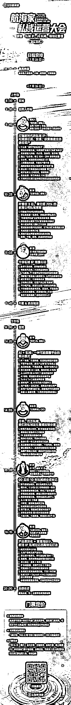

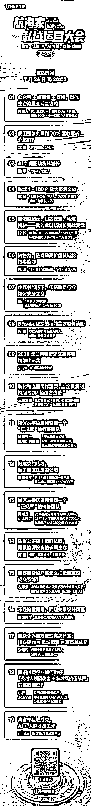

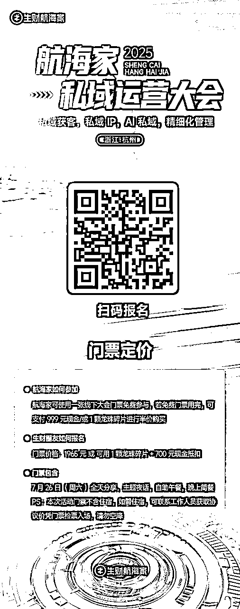

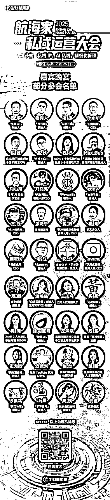