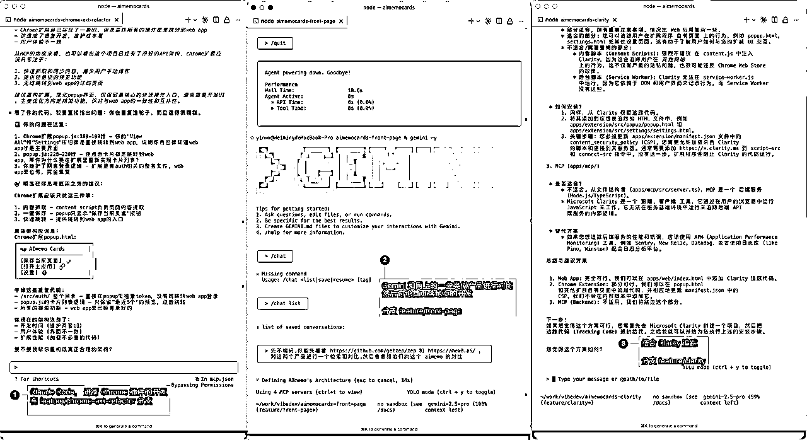
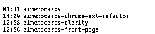

# 把 Git Worktree 当“实习生”使，我的无冲突并行开发工作流

> 来源：[https://rxas35pmvn.feishu.cn/docx/K3vIdqcFVoTduHxdGBjc4kAwnGR](https://rxas35pmvn.feishu.cn/docx/K3vIdqcFVoTduHxdGBjc4kAwnGR)

你好，我是大铭。今天不先聊技术，我们聊一个每个开发者都逃不开的话题：中断。

不知道你是否有过这种感觉？一天下来，在需求会、Bug排查、代码切换和IM消息之间高速运转，感觉忙得团团转，但到晚上复盘时，却发现真正“成片”的完整产出并不多。我们最宝贵的专注力，也就是“心流（Flow）”，就像一块被敲得稀碎的玻璃。

而现在，AI 编程工具的普及，又带来了一种全新的“微中断”，它更隐蔽，也更磨人。

# 那个让你抓狂的“30-90秒”

我们先来想一个场景。在使用 AI 进行开发时候，他干活到给我们反馈，很多交互的间隔时间，可能就在 30 到 90 秒 左右。

但其实这种交互对于一个工作场景来看也是非常割裂的。

*   你说它时间短吧，它又没有短到说你频繁交互一来一回，你得等；

*   你说它长吧，这点时间也不够你干点别的。

# 你就卡在那，心流（Flow）被打断，感觉特别难受。

所以我就在想，如果能把这个交互时间刻意延长，把一项工作尽可能完整地去完成，让它成为一个独立的、长时间运行的任务，会怎么样？

这个时候，我发现，这不就是雇佣了“实习生”去干活么。

# 我的“实习生”工作流

这个想法的核心，就是给自己编排一个任务待办（Todo），然后把任务“派”出去，让它们在后台自己跑。

如果你能做到这一点——具体怎么做我们后面说——你的任务时间间隔就会变得比较长。这就意味着，在 Background 里，有一个你的“工作人员”或者说“实习生”在干活。

这时候，你就可以同时开始驱动第二个实习生干活，第二个干完了再驱动第三个。

这事儿就看你分配的任务 越明确精细，他自己就能干得越好。 你的任务相对来讲比较长，他干活的时间就会更多，那你就可以多个任务一起干。我自己就在用 Local Issues 、 RR / PLAN / Agent 的思想和工具来尝试做任务的编排和驱动。

看我自己做的一个三开的界面



# 如何“招聘”实习生？解决代码打架的核心工具

当你开始让多个“实习生”一起干活的时候，马上就会面临下一个问题。

因为一般写代码，尤其当工作复杂到一定程度，它很容易出现相互之间代码打架的情况。 那如果你又想让他们同时多开多个去工作，你就势必要解决这个打架的问题。

解决打架的方式有很多种，我现在采用的一种最简单的方式，就是使用 git worktree 这个命令。

它的作用，就是把你当前的 Git 代码库，在你本地克隆一个额外的目录出来。这个额外的目录是基于你某一个特定的、干净的版本。

然后，你进入到那个目录，把它分配给一个工作任务。你有多少个目录，就相对有多少个可以 尽可能相互隔离的环境。然后在那里面，你就可以用 Cloud Code 之类的方式去干活了。

## 具体操作起来大概是这样：

进入到一个已经被 git 管理起来的代码目录，如 aimemocards-main

当前目录为

```
/PATH_TO_CONTAINER/aimemocards/
```

在这个代码库中执行

```
git worktree add -b feature/lading-page ../aimemocards-landing-page develop
```

*   -b feature/lading-page 说明新分支名称为 feature/lading-page

*   ../aimemocards-landing-page 说明新建一个目录，建立的目录的位置是

```
/PATH_TO_CONTAINER/aimemocards-landing-page/
```

*   develop 这个新分支是基于 develop 分支新建的

这样你就得到了一个全新的、专门为 landing-page 准备的工作目录。

cd ../aimemocards-landing-page/，然后开始你的工作，完全不用担心会影响到主目录或其他任务。

此时真实的目录大致是这样的



最上方的 aimemocards 是主目录，下面三个是三个 worktree 的分支目录，也就是我们实习生的小隔间

### 当任务完成之后，可以执行

```
git worktree remove ../aimemocards-landing-page 
```

# 实习生的工作交付：要“自己给自己提PR”

好，现在“实习生”在自己的小隔间里开始干活。

怎么让他能长时间的、准确的干活这是另外的问题，咱们在开文章说哈。

我们就等他干完了吧。那下一步呢？

## 你暂时不要把它合并回来。

一个更好的做法是：自己给自己提 PR (Pull Request)。

为什么这么麻烦啊？因为这样做有两个巨大的好处：

1.  留痕： 一旦提了 PR，你这次所有的改动、思考、解决过程就都有了清晰的记录。未来回溯起来一目了然。

1.  复盘（Review）： 它创造了一个机会，让你能通过 Review 的方式，跳出“开发者”的身份，像一个旁观者一样去检查你这次做的怎么样。这个复盘过程非常有价值。

# 总结：想清楚之后，效果还不错

用这种方式，我尝试过 三开、四开，同时进行好几个任务，效果还可以。

整个过程的核心，其实就是把过去那种“即时反馈、即时处理”的同步模式，变成了一种“异步委托、集中回顾”的模式。

当然，这套方法有一个前提，就是你 整个的思路要先想清楚，任务要拆分好。想清楚之后，总体效果还不错。

它让你从一个手忙脚乱的执行者，变成一个从容的指挥官，真正地去“驱动”你的工作，而不是被工作“驱动”。

# 缺陷：不能啥事都这么完美吧

这样做其实环境还不够隔离，比如 数据库， redis 等怎么办，配置文件还是没有隔离，可能会使用相同的资源

一个更好的办法是使用 docker 做到真隔离。

在一个 真隔离 和一个 给实习生的小隔间 中，大家可以自行取舍。 对我来说，这个小隔间已经足够好用了。