# 跨境全托管销量下滑背景下，卖家如何利用AI图像革命逆势突围

> 来源：[https://xcn99gm8agp7.feishu.cn/docx/Fo65dcWyaoukn6xBbvqcrdjBnoc](https://xcn99gm8agp7.feishu.cn/docx/Fo65dcWyaoukn6xBbvqcrdjBnoc)

大家好！我是巴克队长，目前在做Temu/Shein的普货&POD(一件定制)定制品小卖家。

第一次发帖，如有不周，请大家海涵~

前几天看到亦仁发的超级标实操悬赏贴，里面提到gpt-4o带来的AI图像革命，刚好我目前做的项目里，就看到了一些卖家在最近几个月利用AI图像革命逆势增长的案例。

虽然本文分析的不是网站/APP，但市面上提供类似产品的网站也不少。如果跑题了，就当给大家开拓下思路。

## 一、大背景

今年开年以来，如果你是还在持续做Temu/Shein的卖家，可能也在为销量持续下滑而头疼。美国关税政策、Temu关闭美国全托站、平台流量倾斜半托、平台投放力度缩小等一系列事件，让很多卖家都单量骤降。

拿我自己为例，去年Temu单一平台日单量在400-500之间，今年已经掉去一半，只有200-300单。

而我在的类目，有卖家开发出了自动化铺货工具，从前靠人工作图、上品，一个店铺最多几百、上千个产品，现在利用工具，日铺千品、单店几万品的情况十分常见，福建卖家更是JIT矩阵式打法，有卖家甚至搞了200个店铺，每个店几千几万个品，每天七八千单。类目竞争异常激烈。

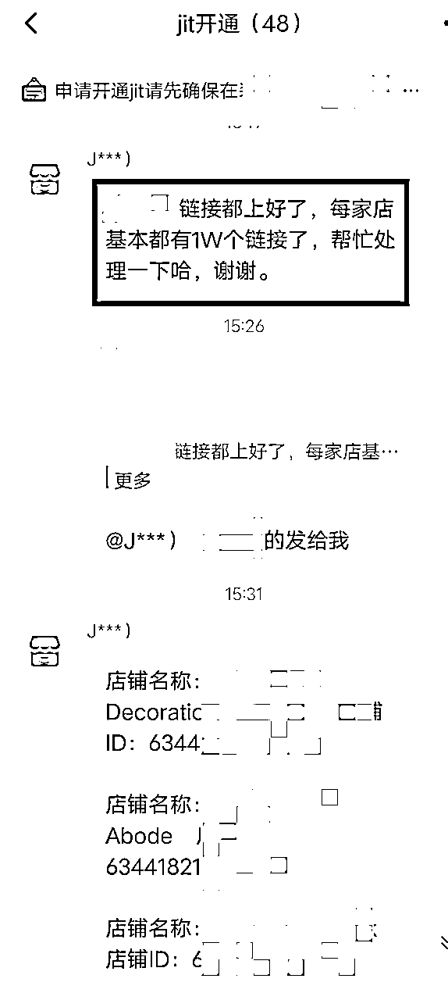

因此，在这样的大背景下，全托管还能做吗？尤其是Temu平台上品没有限制的情况，我自己也是存疑的，在单量持续下降的压力下，我一股脑的转投在Shein平台上，在Temu上就吃老本，持续摆烂，没怎么关注。

直到前不久看到这个店铺，又刷新了我的认知。

## 二、卖家借助AI图像突围

这个店铺是做POD(一件定制)的，主要的产品是把用户的照片转绘成卡通风格（皮克斯、吉卜力等），然后打印成海报。这种图片以前需要设计师来做，人力成本很高，完全不适合全托管平台。但现在用AI做很容易，成本几乎为0。尤其是gpt-4o之后，图片质量提升很多。

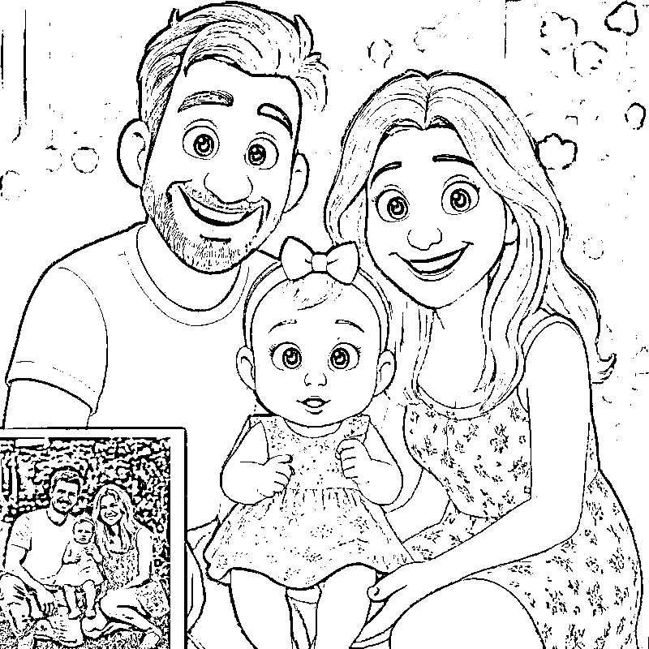

店铺开店时间是今年的3月20日，仅仅3个月的时间，就卖了2.3万件，平均一天230单。当然订单的增长不是线性的，前期单量比较低，当前店铺日单量预估最低在350单以上。

最热卖的一个品上架时间是4月27日，刚好是Temu美国站关闭前后，单品已售1万+，平均一天160+，美国站关闭完全不影响该产品的爆发。

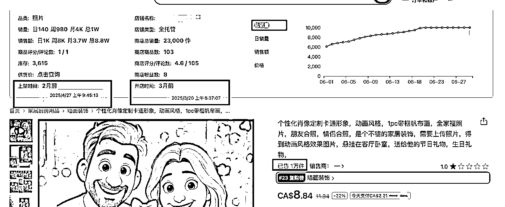

这个店铺的产品数并不多，只有103个。产品有多种图片转绘风格，但最好卖的是皮克斯类型的。

而从核价来看，该店铺的产品核价普遍比同行核价高出不少。原因也好理解，该卖家直接使用AI生成的效果图和原图对比的图片作为主图，此类图片既是原创图片，又与现有卖家的产品图形成差异化，所以能获得较高核价。

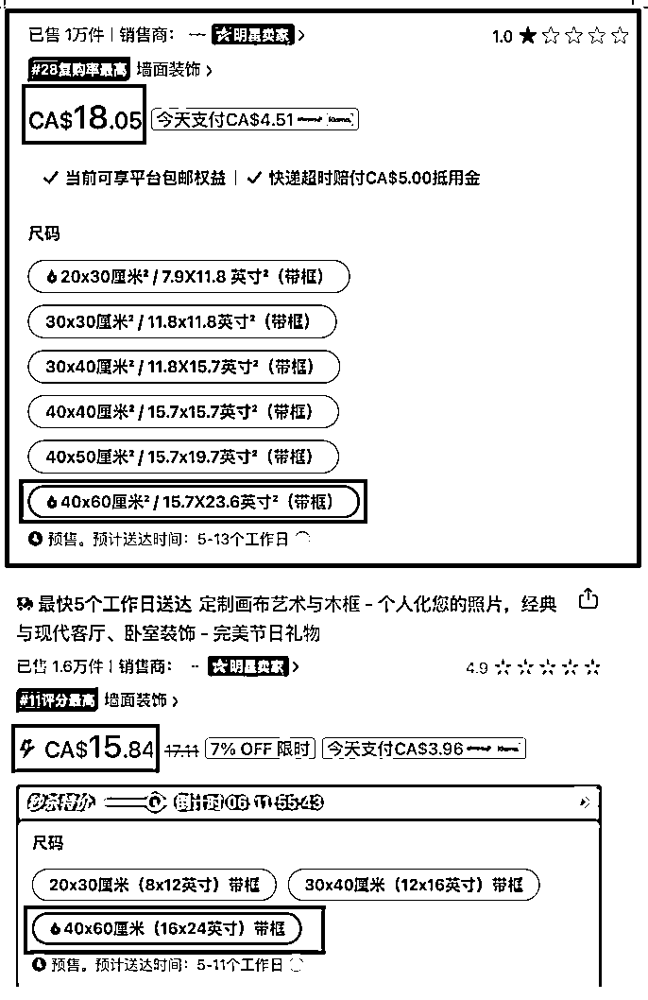

以店铺里最热销的单品来看，两个SKU最好卖，加拿大站点前端售价分别为8.84/18.05，按1.6倍保守预估其核价为14/28.9。（该类目核价美国站通常为前端售价的2.3-2.8，加元/美元≈0.73，因此以加元估算，倍率在1.7-2左右）

如果拿1688卖家的价格计算其成本价（实际会更低），两个SKU分别为7.41/19.87元，毛利润分别为6.6/9元，每单毛利润平均按7.5元计算，日单量350+，每日毛利2625元，月毛利7.9万。

另外，7月份TEMU预计会恢复美国站的全托，那么这个店铺的单量还会再上一个台阶。

那这样的店铺是个例吗？并非

TEMU其他买家，开店近5个月，19个品，销量1.2万件；皮克斯单品4个月，销量6000件。

只有Temu有这样的成功案例吗？并非

Shein的，辛普森风格的，上架2个月，美国站销售1100件，算上其他站点，日销也有100单左右。

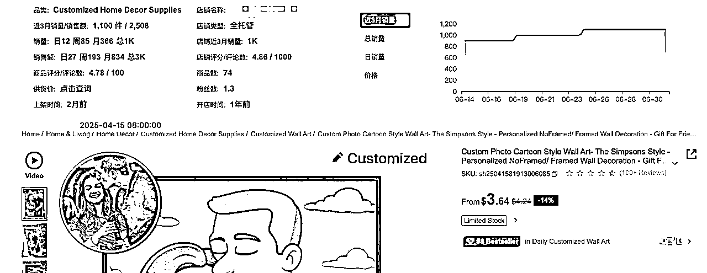

Etsy，多个Bestseller产品

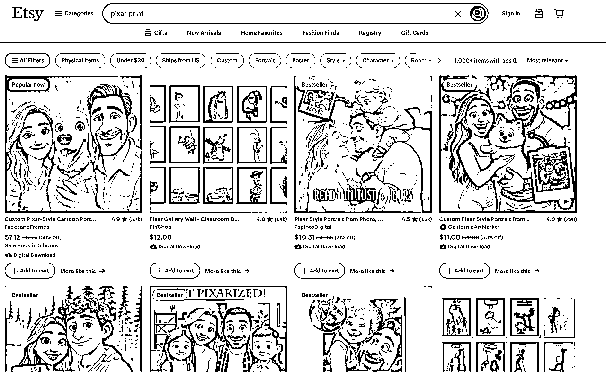

## 三、如何从0-1

如果以Temu为例，如果实现从0-1呢？

### 1、如何制作成品印刷图

首先需要说明的是，这种店铺的产品是POD(一件定制)的产品，也就是每个客户发来的图片都不一样，需要一张一张去做图，当然0-1的阶段不需要考虑批量的问题，但在1-10的时候必须要解决批量作图，否则就是消耗人力。

皮克斯风格的成品图非常容易制作，高端的模型，往往只需要最简单的提示词。

gpt-4o是目前测试下来效果最好的模型，哪怕只是简单的输入“请将图片转绘成皮克斯风格”，就能得到令人惊艳的图片。

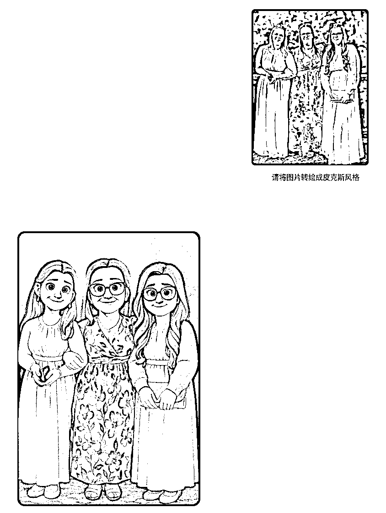

但用chatgpt官网去生成图片有两个缺点，一是非会员上传附件的生成次数有限，哪怕是plus会员也不是无限生成，不过对于前期来说也够用了，可以多搞几个账号去作图。二是生成速度比较慢，效率低，如果网络不好，生成一张图可能要几分钟。

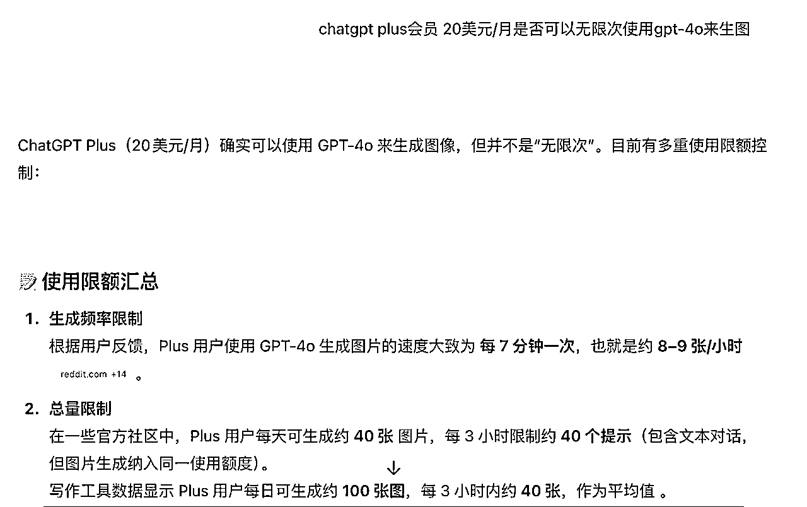

替代方案是flux-kontext和第三方网站，详见良辰美：价值上万的超级标：开源仓库+套壳模型+手把手教程

但是flux-kontext的皮克斯转绘效果我感觉比gpt-4o差不少。

https://kie.ai/ 也提供了在线生成的窗口，价格算下来，竟然比flux-kontext还便宜，一张图2毛钱，且可以微信支付。

使用以下提示词，转绘的效果与chatgpt官网不相上下。

Create a high-quality Pixar-style 3D animated image for this photo with these specific requirements:

Use the characteristic bright, saturated colors of Pixar movies

Ensure soft, appealing lighting with gentle shadows

Create smooth, polished 3D surfaces typical of Pixar animation

Make characters friendly and expressive with large eyes

Use a warm, inviting color palette

Apply the high production quality of Pixar studios

Style references: Toy Story, Finding Nemo, The Incredibles, Coco, Soul

Quality: Photorealistic 3D animation quality

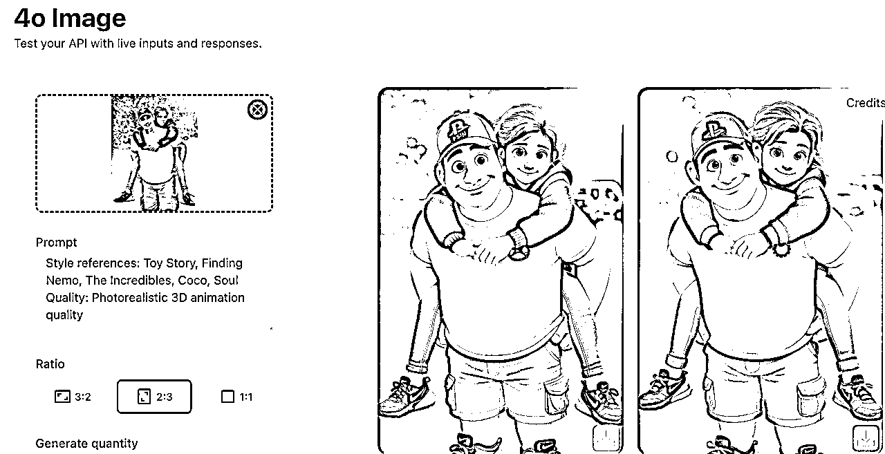

### 2、如何发布Temu定制品

Temu开店流程就不赘述了，可以查看生财往期航海手册Temu跨境电商

Temu店铺开设成功后，如果想要发布定制品，需要账户里有2000元保证金。

如上图，除账户预留金额1000元之外，可用余额必须保持大于1000元。

接着，在发布产品的时候，必须要勾选上定制品选项、及相关工艺。如果是印刷，就选择基础工艺。

参考资料：TEMU定制品规则

### 3、如何制作产品主图

参考前文提到的卖家，其产品主图包含首图、场景图、尺寸图、细节图、SKU图、上传图片规范说明等。其中最核心的是首图、场景图、尺寸图。

作图工具可以使用Canva、创客贴、PPT、PS等，我PPT用的比较熟，所以像这些图片都可以用PPT做出来，选自己顺手的工具就可以了。

可以先用AI去生成一张真实照片，也可以用网图。

首图直接放生成后的效果图，然后小窗放原图，这样可以带来最大的视觉冲击，提升链接点击率。

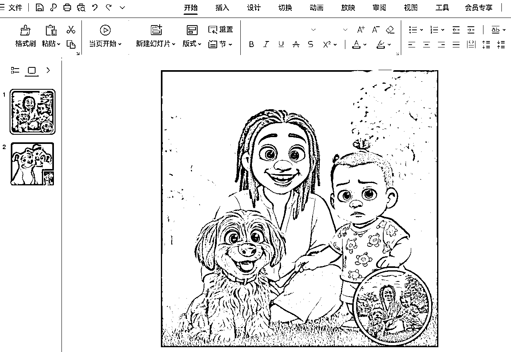

场景图这块，如果懂PS套版，也可用PS去套图；用PPT也行，场景图上面画的位置设置一个形状，选择用图片填充，这样就能覆盖之前的图片了。

如果都不会用，也可以借助一些POD选品平台提供的在线设计工具，如Hicustom的设计器。

图片建议多用原创图，这样可以避开竞争，也能核到不错的价格。

### 4、如何写产品标题

偷懒直接用AI工具帮忙写，快速高效；较真地话仔细学习同行怎么写。（图中使用的是KIMI）

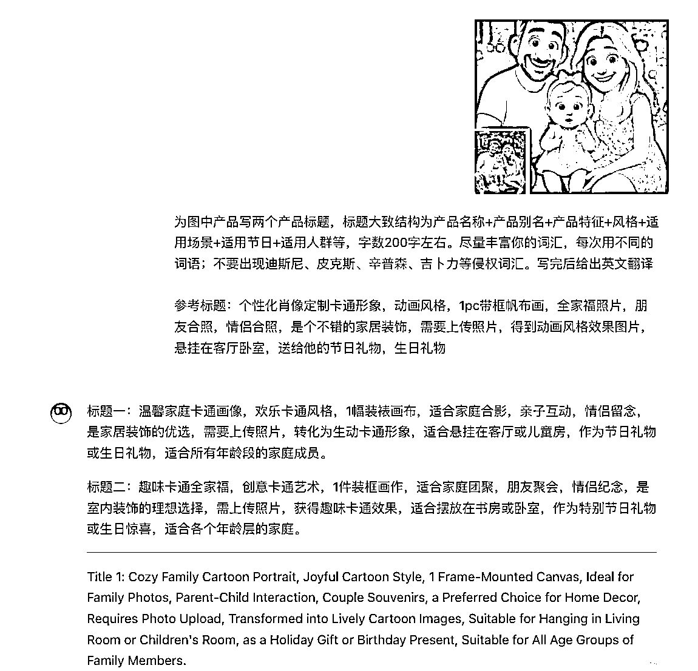

### 5、如何定价

可以按照前文的核价推送方式，选择高倍率去乘前端售价，参考这个结果去申报，稍作上涨或下浮。

### 6、如何配置定制产品模板

定制产品的上架流程是这样的，发布商品-审核-核价-配置模版-平台选品-确认上架。核价通过后需要配置定制产品模板，未配置定制产品模板的产品平台不会上架。

在商品列表中找到定制商品模板配置入口，签署协议，配置模板相关信息，模板可以参考同行做法。配置完成后填写库存数量即可。

### 7、其他

篇幅受限，包括如何找供应商、如何发货等很多问题无法一一阐明，如果没有做过TEMU的朋友想操作该项目，建议把生财的航海手册、高手领航多看几遍，另外@跨境小泽@七喜等圈友的分享帖子也值得反复看。

## 四、如何从1-10

### 1、做图效率问题——批量生成印刷图

当店铺能够稳定出单，单量还持续增长的时候，你就会有幸福的烦恼，幸福的是持续有单，烦恼的是POD做图真麻烦。尤其是Chatgpt官网很慢的时候，如果一天50张图，网不好做图可能要做半天。

因此，一定要利用好工具，那么如何批量生成印刷图呢？

刚好前两天用Claude帮忙写了个python程序，接入的是flux-kontext的API，生图速度嘎嘎快，就是质量真的还是没法和gpt4o比。

python脚本先放在这，gpt4o的api版本等我有时间的时候再写，可以通过kie.ai接入。

上面视频是python脚本的运行演示，一分钟不到7张图，全部都成功，就是flux-kontext图片质量还可改进。

### 2、矩阵店铺放大

当第一个店铺能跑通的时候，你就可以考虑多店铺运营，平台年初已经关闭了一个主体20个店铺的权限，目前一个主体只能全托店铺，因此需要想些别的办法去开多个店铺。

一个店铺内也可以去测试不同的风格，看看有没有新的爆品方向，有的话再拉出来做一个垂直一点的店铺。

在考虑矩阵店铺的时候，如果能用一些工具，也是提效的方法，比如批量做产品图、批量取标题、自动上品等。

### 3、全托广告投放放大

如果产品核价、毛利还不错，也可以测试一下全托的广告，6月中平台的全托广告投放站点范围进一步扩大了。

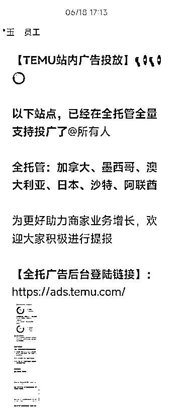

### 4、扩品类、扩平台

POD的产品类别也有很多，扩品类也是一个方法，比如皮克斯的冰箱贴、皮克斯的钥匙扣、皮克斯的汽车挂件等等。

但是需要注意的是，一定要把控好供应链，找到靠谱的供应商。

除开TEMU外，其他的全托平台能不能做，如Shein、Tiktok等。

其他电商平台能不能做，Amazon、Shopee、Ozon等。

独立站能不能做？能不能和AI图片站合作，用户生成完图片后，直接打印海报，将虚拟变成实体。也帮助AI图片站增加变现方式。（这一条我是挺想做的，我们有供应链，但是没时间去做站，也没有流量获取能力）

## 五、一些潜在的坑

### 1、定制品履约时效问题

定制品的履约比较严格，因为都是急采，基础工艺广东仓到货时效要求72小时，义乌仓到货时效48小时。所以延误不得，一旦延误，平台罚单就接踵而来。

去年过年的时候，因为TEMU爆仓和放假期间物流人员缺乏问题，导致我的很多单都延误了，后台开出了一两千块的罚单，把我整抑郁了，好在后来通过申诉平台解除了我的罚款。

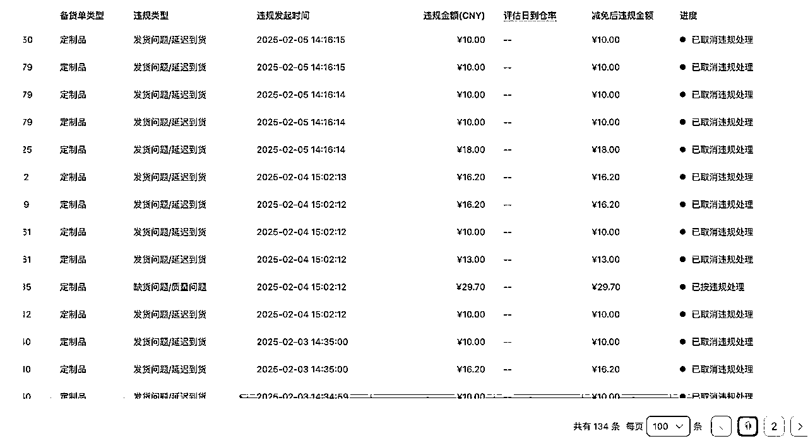

### 2、平台卷价格

全托平台卷价格，这没什么意外了。尤其是TEMU，后台的弹窗恨不得每天都给你铺满。随着上品时间的推移，利润率肯定是会持续下降的。

### 3、产品质量把控

质量问题也是一个重灾区，如果品质分低于60分，一旦出现售后，就是5倍罚款。而定制品的一个bug就是TEMU的定制后台做得稀烂，用户有时也搞不太清怎么操作，导致实际产品偏离预期而给出低评分。

所以在能力范围内尽可能把控好产品质量，这里也包括转绘图片的质量。

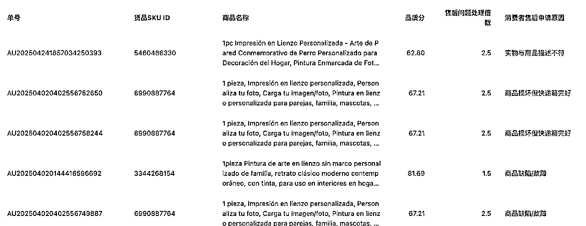

### 4、合规标签

合规标签也是我踩过的坑，如果是标签问题导致无法入库，一样会被罚款，好像是3倍申报价。

首先标签一定要弄正确，不要让工厂贴错了。其次，标签要文字清晰。最后，如果你在后台更换了标签，或者更换了生产批次号，那么实拍图、实物标签上的批次号一定要确保一致。

### 5、重复铺货

由于生成的不同产品的图片本质上对应的是一种产品，所以有可能会被平台判为重复铺货。但目前看到的影响主要是单品下架，对店铺整体的影响还未可知。

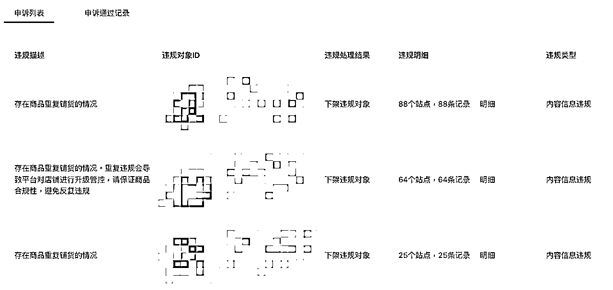

在上品阶段，也可以去细分不同的场景、风格，来减少被判定为重复铺货的情况。

## 六、结语

小白可以冲吗？能，但不建议。看见别人成功和自己成功是两回事。POD相比普通备货店铺更为复杂，新手最好是先打好基本功。另外，如果一定要冲，那么建议调低预期，文中案例卖家能做到这个水平，还有一些其他因素，比如主图整体做得很好、上品时间更早等。

如果有跨境经验的圈友，倒是可以在自己的平台试试。实操后如果遇到供应链产品问题，我这边也可以协助。

最后如果有在做AI图片站、有一定流量的圈友，对文中提到的接入实体印刷产品变现这种方式有兴趣的话，也可以找我交流。