# 如何办理港机、港号、港银？

> 来源：[https://eil10n4yhk.feishu.cn/docx/KpwYd2h5GoCm66xY8h5cnBLPnke](https://eil10n4yhk.feishu.cn/docx/KpwYd2h5GoCm66xY8h5cnBLPnke)

大家好，我是刚办完港机港号港银的方馨。

之所以会办港机港号港银，源于我刚参加完6月AI-Web航海活动。创造Web的快乐和成就感，让我想要持续深耕这个领域。而自己目前的条件并不足以支撑自己开发更多的Web功能，比如订阅支付功能。所以，航海期间，我就想要去一趟香港。同时，我也在想，什么时候去比较合适。是等Web赚到广告费了之后再去，还是等有了更多用户之后再去……

也是巧合，6月28日香港有一场关于AI的分享活动，刚好需要志愿者，就果断报名了。当时想着，可以趁机去香港买个手机、买个手机号。但是，真的到了那一天，我有点犹豫了，真的要在web还没赚到广告费，还没有什么用户的时候去港机和港号吗？会不会太早了？

所以，我就在AI-Web航海1群里，发了这么一条消息：“各位老铁们，我现在在香港参加活动，你们建议我今天入手港机港卡嘛……有点小纠结，感觉现阶段还太早……”

圈友小熊让我买一个，圈友ZERO让我顺便在香港把汇丰和中银的卡也办了。后来，小熊还补充说，众安和天星也可以办一下。圈友何冰曦说，他昨天（27号）把中银、汇丰、众安都办好了。

看到他们的回复，我打算把港机和港号先办了，再去银行看看。办完港机和港号之后，突然意识到是周末，银行可能不上班。我就没多想。而且之前在网上看到过有人能办到卡，看到过有人没能办到卡，也看到过有人往卡里面存了20万-100万才保住银行卡，所以对于办银行卡这件事，自己心里是犯嘀咕的，觉得自己真的能顺利办下来吗？

事实上，还挺顺利的。

而这一切，都源于圈友幻影在群里说了一句，“都可以线上开的吧，下对应银行的App就可以，教程网上一堆”，以及圈友何冰曦的“可以”。

所以，很感谢上述圈友的各种指点和鼓励，让我顺利办完了港机、港号、港银。

为了回馈大家，我把自己办理港机、港号、港银的经验写下来，希望对大家也有所帮助。

# 如何办理港机、港号？

### 买什么牌子的手机？

我买的手机是港版iPhone 16 pro max（256GB）。

为什么选这款手机？主要有三方面的考虑：

首先，自己是一个苹果重度用户，离不开苹果构建的生态。

其次，自己后续还有去东南亚、欧美的需求，港版iPhone有更全面的功能。比如，可以下载更多APP。比如，支持双卡 + eSIM，也能更好支持全球各地的其他手机卡。

最后，就是能花更少的钱。比如，内地iPhone16 pro max（256GB）的原价是9999元，618之前有优惠，再加补贴，最低售价在7999元。港版iPhone 16 pro max（256GB）的原价是10199港币，从手机号运营商那里购买有一定折扣，是9699港币，折合人民币就是8861.90元。比原价9999元便宜一千多，比最低折扣价7999元高了不到一千。我觉得用这个差价，去换取更多功能和可能性还是值得的。算上手机号第一月的费用，整体成本也没有超过9000元。

对于这个选择，自己目前还是挺满意的。

为什么不选港版iPhone 16 pro或者其他品牌的手机？

首先，港版iPhone 16 pro的原价是8599港币，运营商那里的售价是8099港币，折合人民币7400港币，只比内地iPhone16 pro的7999元售价便宜了500元，而且iPhone16 pro的界面比iPhone 16 pro max的界面小很多，用iPhone 16 pro max自己会更顺手一点，用户体验也会更好一点。

其次，其他品牌的手机自己目前用不太习惯。

如果你希望用其他品牌的手机，也可以去详细了解一下，看看能否满足自己的需求。

### 买哪家运营商的手机卡？

我买的是SmarTone的手机卡。

之所以选择这家，是因为自己的需求很明确：

首先，我希望这个手机卡能帮助我开通海外账号和支付账号（如 Stripe、PayPal、Wise、Revolut、AWS、Google、Apple 等），能接收来自这些平台的短信。

其次，我希望这个手机卡尽可能稳定、长期可用，不容易被封或停号。

最后，我希望这个手机卡在内地也可以正常使用，正常接收海外的短信，不需要自己长期待在香港。

由此，当我把这些需求告诉ChatGPT之后，它给我推荐了CSL、3HK、SmarTone、CMHK（香港移动）。这些运营商，接收的信号和短信接收稳定，能接收大多数国际服务平台的验证码短信，不容易被识别为虚拟号，适合长期使用。其中，3HK和SmarTone是最佳选择。

当我进一步要求ChatGPT根据自己的需求，做二选一的时候，它更推荐SmarTone，理由如下图所示。所以，我更多了解的是SmarTone的手机卡套餐。

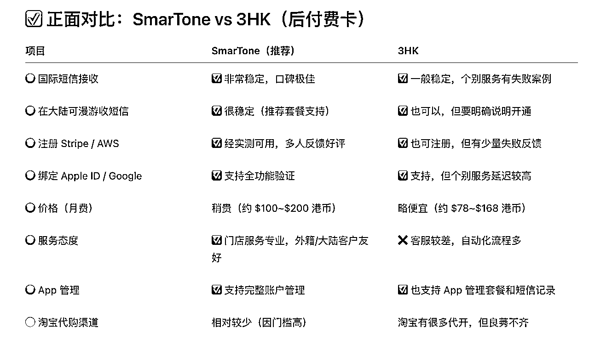

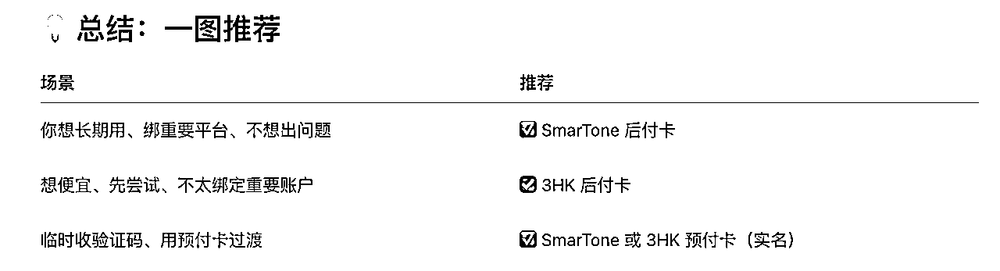

SmarTone有各种国际漫游套餐，有129港币/月的，有179港币/月的，还是更贵的……但是，我直接就跟店员说，我不需要打电话，我也不需要太多的流量数据，我只需要这个套餐能让我在内地收到海外短信。所以最终，选择了129港币/月的手机套餐，算上优惠折扣，就是99港币/月。是自己可以承担的价格。

有了港机和港号之后，我的iPhone就有了不同于内地的App Store，我可以自由下载更多自己需要的App。比如，“BA”。

如果你有其他需求，可以多了解几个运营商的手机卡套餐，然后对比着选择。

### 去哪买？

我的港机、港号是一站式在运营商那里解决，所要准备的，就是自己的港澳通行证。至于申请港号所需要的地址，可以让门店的人直接写门店的地址，也可以厚着脸皮让他们写他们家的地址。销售人员需要订单，需要提成，他们肯定是希望能成交的，所以对于填写地址这件小事，他们其实可以搞定的。

至于去运营商的哪个门店一站式解决？我不建议去专业运营商的街边小店，因为他们见得不多，在有些事情的处理上不够灵活，反而会成为一种阻力。所以，我建议去人多热闹的地方（比如中环的各种品牌和运营商的门店），去买港机港号的人多，他们遇到的足够多，能帮你处理很多事情，也会给你很多建议。

而且，中环附近有香港摩天轮，北边坐个船就是维多利亚港、星光大道、李小龙铜像，西面还有港大、太平山，东面还有金紫荆广场、铜锣湾，完全可以一边旅游，一边把手机、手机卡、银行卡搞定。

# 如何办理香港银行卡？如汇丰、中银、众安

我在香港办理的汇丰、中银、众安的银行卡都是纯线上办理的，所以办的就是储蓄卡。也就是说，如果要买港股之类的股票和基金，需要另外在线上申请投资账户。不同银行，审核要求不同，有些银行会宽松一点，有些银行会严格一点。

线上开户的好处就是，不用经历别人线下开户的验资，不用经历别人线下开户需要提供在港地址的3个月水电费账单，不用经历别人线下开户需要立即转账20万-100万的各种“奇葩”条件，只需要下载对的银行APP、准备好自己的身份证、港澳通行证、内地居住地址和出入境证明等重要的证件和信息。

下面，我们一点一点来说：

### 第一步：下载对应银行APP

在应用商场（App Store）搜索“汇丰银行”或者“汇丰香港”就会出现对应的银行APP。

我们需要下载图标下面带有HK字眼的APP，有323k下载量的“HSBC”，而不是带有CN字眼的“汇丰银行”。

下载好APP之后，我们直接点开页面中的“开户”按钮即可。接下去，跟着流程和提示走就可以了。

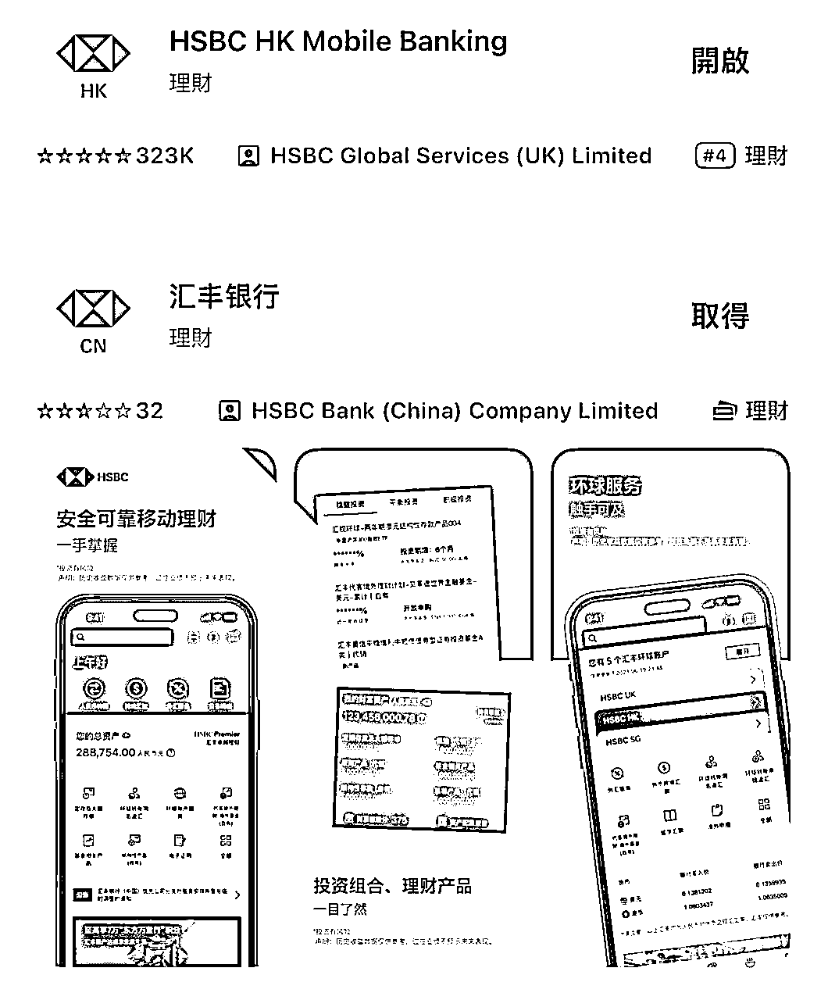

在应用商场（App Store）搜索“中银”或者“中银香港”就会出现对应的银行APP。

我们需要下载白底红印的APP，有158k下载量的“BOCHK”，而不是红底白印的“中国银行”。

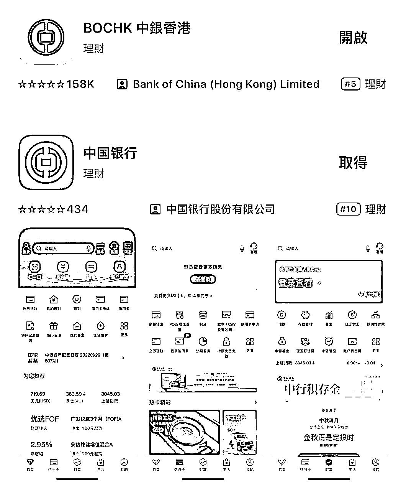

下载好APP之后，我们直接点开页面中的红色按钮即可。接下去，跟着流程和提示走就可以了。

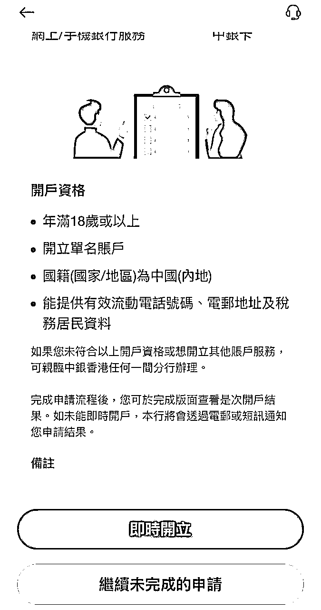

在应用商场（App Store）搜索“众安”或者“众安银行”就会出现对应的银行APP。

我们需要下载浅绿色图标的APP，叫“ZA Bank”。

下载好APP之后，我们直接点开页面中的“开户”按钮即可。接下去，跟着流程和提示走就可以了。

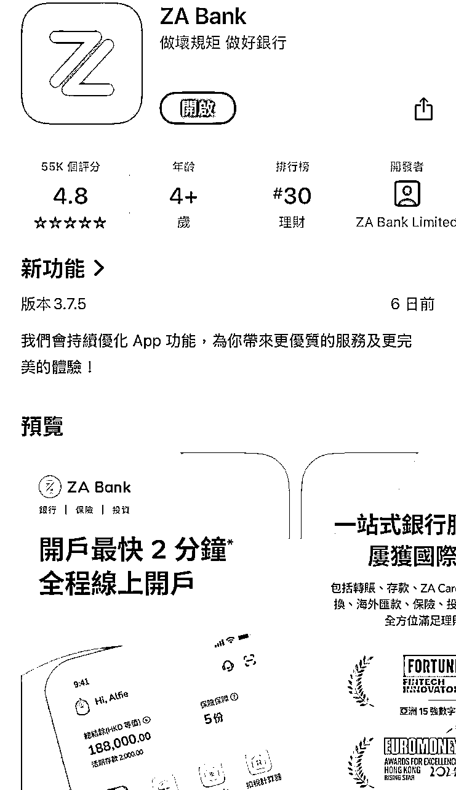

### 第二步：准备身份证

身份证的照片可以提前拍好，也可以在进行线上开户流程的时候使用拍照的功能拍摄。

如果选择提前拍好，需要露出身份证的整体轮廓，不要遮盖人像、文字，还要避免光的反射，确保身份证清晰、可读取。

相对于汇丰、众安，中银对于身份证的读取会有更高的要求，它不支持提前拍摄，仅仅支持现场读取，一旦有一点反光、一旦有一点轮廓不完整就无法读取内容，需要不断重新读取。这需要多一点耐心，不断去调整角度。

这里需要提醒的是，开户流程中，会出现“税务编号”的字眼，其实指的是身份证上的身份证号码，而不是指你的个人所得税等相关税收的信息。

### 第三步：准备港澳通行证

港澳通行证的照片可以提前拍好，也可以在进行线上开户流程的时候使用拍照的功能拍摄。

如果选择提前拍好，需要露出港澳通行证的整体轮廓，不要遮盖人像、文字，还要避免光的反射，确保港澳通行证清晰、可读取。

相对于汇丰、众安，中银对于港澳通行证的读取会有更高的要求，它不支持提前拍摄，仅仅支持现场读取，一旦有一点反光、一旦有一点轮廓不完整就无法读取内容，需要不断重新读取。这需要多一点耐心，不断去调整角度。

### 第四步：准备内地居住地址

开户流程中的内地居住地址不同于内地，它会先让你选择省份，然后留有“地址1_______”和“地址2________”让你填写具体的地址。

地址1主要填写“市-区-街道-具体的道路”，地址2主要填写“小区名-具体的楼栋-具体的楼层/房号”。

汇丰会让你填写中文版地址，也会让你填写英文版地址。中银（香港）和众安只需要填写中文版地址。

### 第五步：保存出入境证明

申请汇丰、众安的网上银行都需要出入境证明，不要存在侥幸心理，认为可以不去香港就可以走完开户流程。以下是众安网上银行申请开户的相关界面，明确提出要上传出入境证明，才能进入下一步：

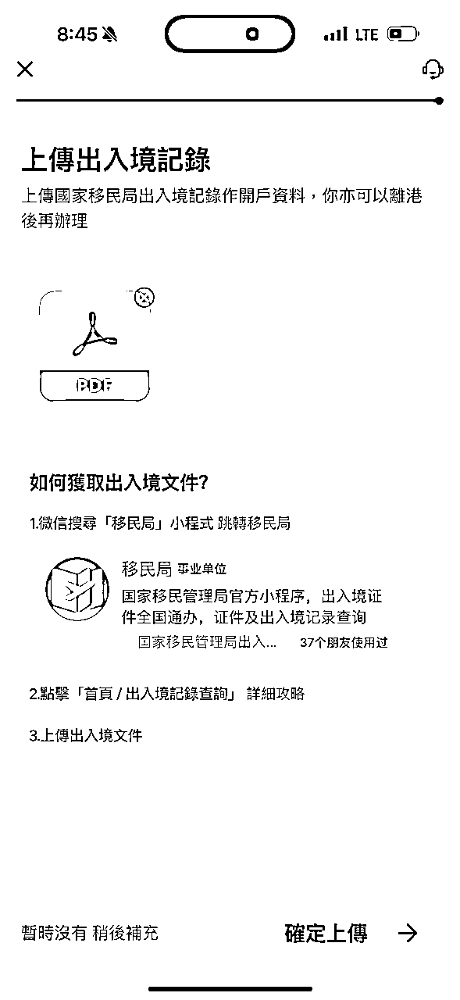

如何获取出入境证明？

首先，在微信中搜索“移民管理局”，选择第一个。

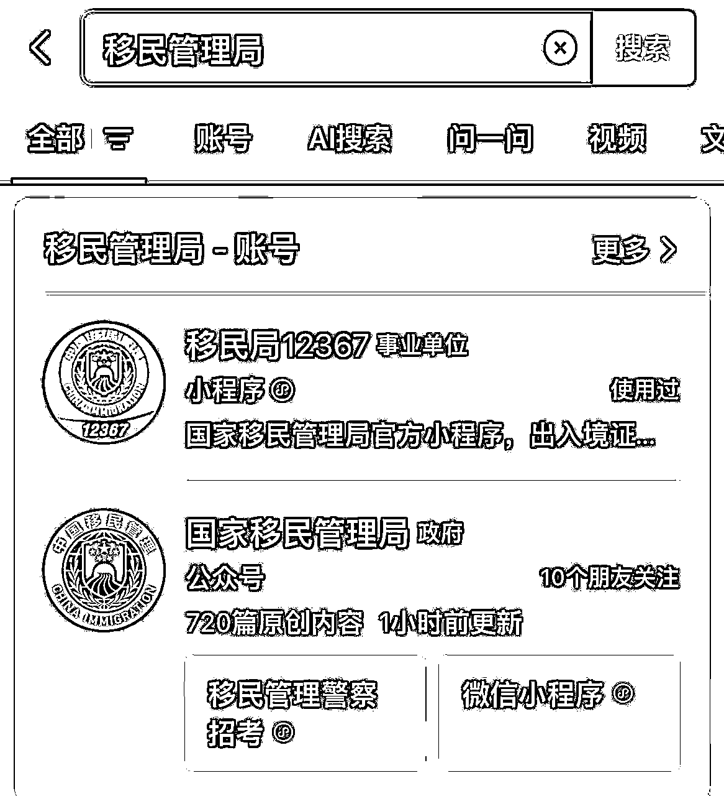

点进“移民局”小程序后，选择“中国公民服务”。

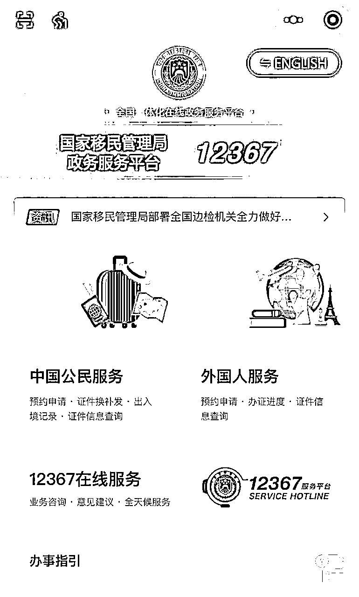

进入“中国公民服务”之后，我们可以在“查询业务”中的“出入境记录查询”中找到出入境证明。

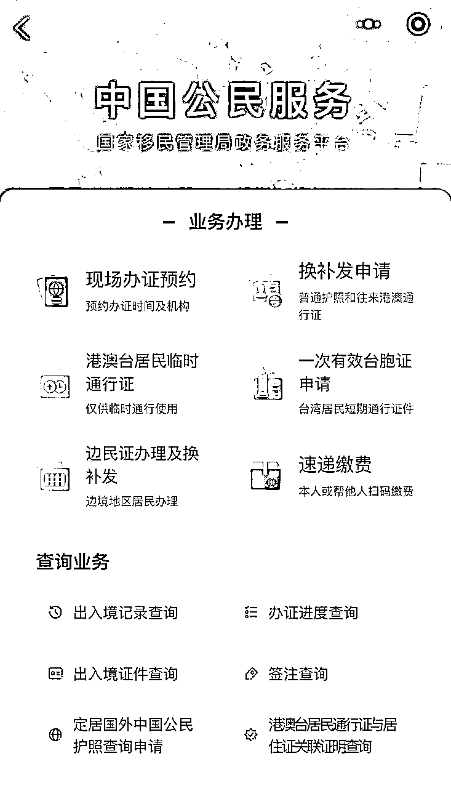

点击“出入境记录查询”后，我们需要用身份证登入账号，然后进行一系列的人脸识别，之后就可以查询三个月内的出入境证明了。然后，点击“下一步”。

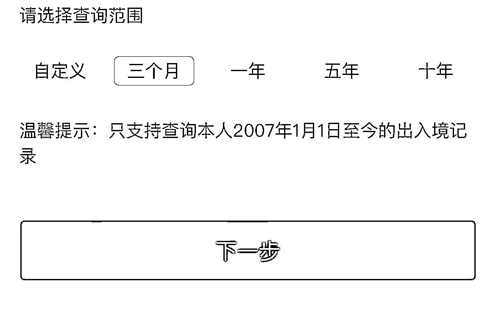

进入“下一步”后，我们能看见自己的护照信息、港澳通行证的相关信息，我们只需要直接点击“查询”即可。

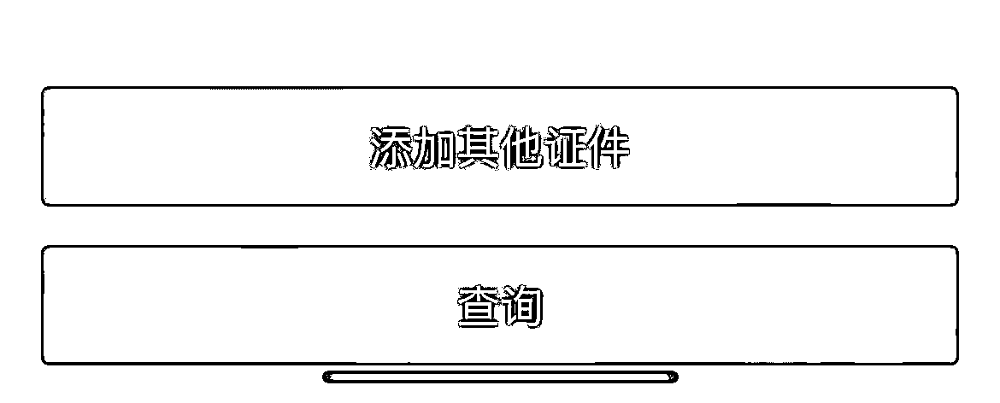

点击“查询”后，我们就能看见自己的出入境证明。我们可以选择本地下载，也可以选择邮箱下载。PS：开通网上银行需要7日之内有效的出入境证明，所以这个出入境证明最好入境香港之后再下载。

苹果用户，可以点击“文件预览”右边的“…”进行保存。

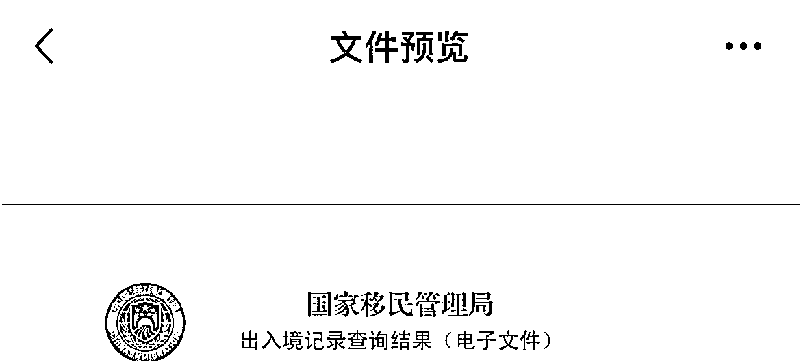

点击“存储到‘文件’”，才能有效将证明上传到银行。

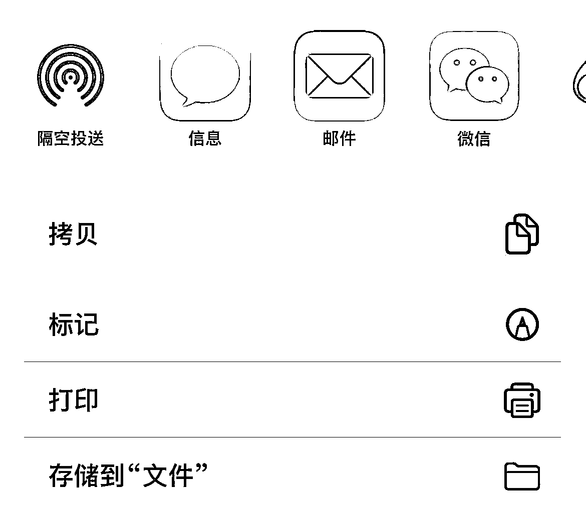

### 第六步：恭喜开户成功

经历了前面一系列证件、证明的上传，以及人脸的验证、手机的验证、邮箱的验证，地址的确认，如果你最终看到这样的提示和界面，就说明你的汇丰银行（香港）的线上银行开通成功了，线上已经可以进行转账了。

就是，线上开通的银行账户不支持线下自取（6月30日刚在香港汇丰银行问的），仅支持国际邮寄，所以填写地址的时候要好好填。

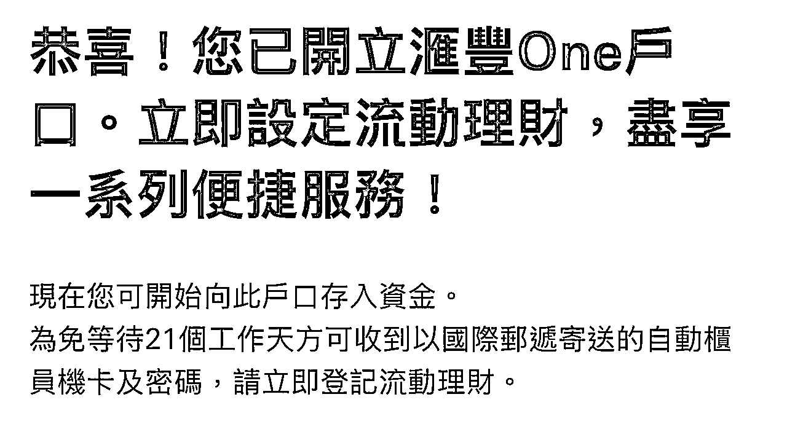

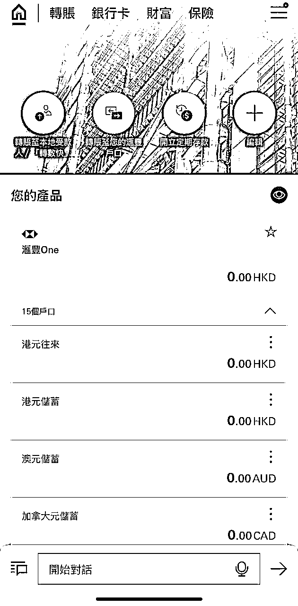

中银（香港）和众安银行开通成功了，也会出现类似的提示和界面。同样的，线上开通的银行账户不支持线下自取，仅支持国际邮寄，所以填写地址的时候要好好填。

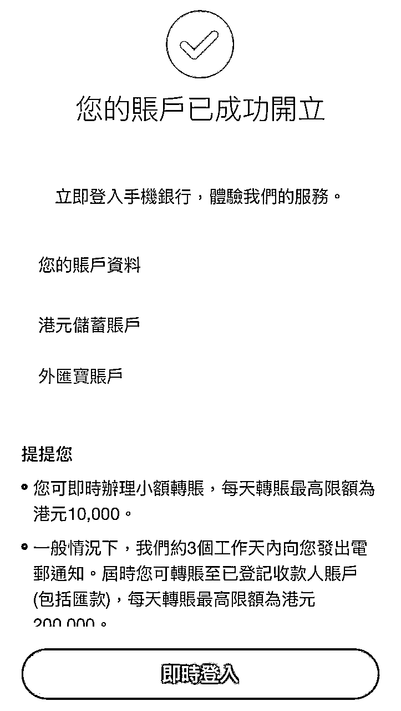

# Q&A

Q1：一定要去香港才能办吗？

A1：你可以不进银行，但是需要人在香港，需要用香港的网络，需要进出香港的出入境证明。

Q2：出入境证明需要填写理由吗？

A2：不需要。只要入境香港，系统就会自动生成，我们就能在“移民管理局”中下载到对应的出入境证明。

Q3：刚入境香港，需要在711买临时手机号吗？我能用临时手机号申请银行卡吗？

A3：入境香港可以直接使用运营商的国际漫游，不需要浪费钱买临时手机号。用临时手机号办港银，银行卡也不安全。如果用香港手机号申请，银行开户系统反而会让你提供在港的住址、香港身份证或者香港（非）永久居住证。我买香港手机、香港手机号是因为我需要注册一些海外平台、需要一个不同于内地的App Store。

Q4：如何将内地资金转入香港？

A4：网上银行申请成功了，你路过银行的时候，可以去银行问一下（众安银行不需要，跨境汇款的信息都能在APP里找到）。像中银这类传统银行，他们会给你一张纸，类似于这种：

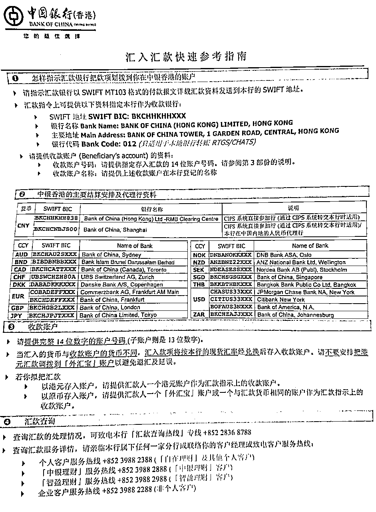

Q5：线上银行任何时间都可以申请吗？

A5：个人经验，中银（香港）的线上申请系统，周末是放假的。汇丰、众安是可以顺利申请的。

圈友（静水流深）评论补充：我简化下吧，港卡只需要ZA即可，其他都是吃灰，而且无需排队，入境香港即可办完，港号内地即可搞定，鸭聊或者3HK esim都可以，不要用最新版港版手机，因为被阉割过，加拿大版，澳版都可以，其实最有性价比是iPhone 13系列，又有实体卡又有esim，当然如果做海外还是美版早期有实体卡的机器最好，因为是认机器序列号的。

评论回复：对，ZA的申请很简单顺滑，至于要不要申请其他的，还是看个人需求吧。我是给自己设立5种账户：收入账户、利润账户、所有者（自己和股东）账户、税款账户和经营费用账户。每月10日、25日把自己的收入账户中的钱根据一定比例分配到利润账户、所有者（自己和股东）账户、税款账户和经营费用账户，确保收入账户清零。同时，将利润账户、税款账户中的钱转移到另一个银行中的利润账户、税款账户，降低自己想起它、想用它的可能性，进而形成绝对利润。这些账户中的钱，其实也是企业的蓄水池、个人的蓄水池，在关键时刻能救命。我就是把汇丰、中银、众安设置成了五类账户中的三类账户。至于，鸭聊佳和3HK在小红书上也被很多人推荐，很方便，所以当时我也简单跟ChatGPT聊了一下，看看能不能买它们家的。当时ChatGPT给出的建议是这些卡用来旅游上网或临时测试网页比较方便，但是需求如果是“长期注册 Stripe、PayPal 等，并且需要稳定接收短信验证码、绑定身份，则需要的是实名后付费港卡”，所以它比较推荐正规的港卡。这也是我没有买鸭聊和3HK的原因。

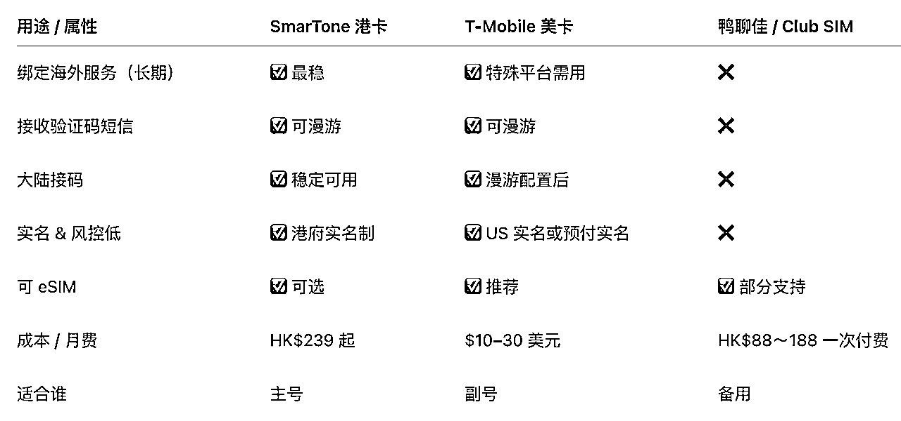

AI应用-Web航海老师-良辰美评论补充：感谢分享，很有帮助，这是我给chatgpt聊天对话答疑记录https://chatgpt.com/share/68633a40-0d44-8005-899c-34d89a943a43 可能对大家也有帮助

# 结语

以上就是我自己的个人经验分享，希望大家都能在香港玩得开心、办卡顺利～

如果哪里我还没有说清楚，或者大家有更好的经验，可以在评论区留言，也可以在微信「fx1230ni」找我，我来增加更多补充。