# 海外AI产品搞定0-1开发后，后续该如何运营？

> 来源：[https://yneq2bf840.feishu.cn/docx/LIaFdfBv0o0pWSxsnwkc4EnQnHh](https://yneq2bf840.feishu.cn/docx/LIaFdfBv0o0pWSxsnwkc4EnQnHh)

# 一、内容概述

在上一篇复盘帖中，我分享了自己作为一个编程小白，如何在7天内0-1搭建起第一个海外AI产品的经历

在深海圈中我看到很多朋友也跟我一样完成了0-1这个历程，那么产品上线之后呢？网站要如何持续运营下去？该如何去获取流量呢？

本篇复盘帖详细复盘了我第一个AI产品发布一个月后的后续运营和深入学习情况，希望给跟我一样处于海外AI产品新手期的朋友们一些帮助和参考。

简单说下过去一个月我产品的进度，我将之前做的网站https://www.babypodcast.pro/迁移到了https://www.vogueai.net，新增了两个子工具页面，此外还上线了一个新网站。这一个月内老站有1个用户续费，99.9刀的月订阅；新站有2个用户付费，19.9刀的月订阅，合计收入约140美元。

下面，我将详细拆解复盘我过去一个月（25年6月）的主要工作和学习的内容：

```
整理上站SOP：上站流程标准化，主要涉及On-Page SEO优化和PR信息标准化整理
自建模板-前端功能模块化：登录、支付等功能模块化，功能集成&性能优化模块化
自建模板-后端n8n工作流学习：n8n调用API（简易与复杂），n8n类agent应用实现，n8n全自动化社媒内容生成&发布框架
整理品牌站&关键词工具站模板：为什么要做品牌站？为什么要做关键词工具站？
外链清单建设与维护：什么是外链？外链有什么作用？外链哪几种类型？怎么找外链？怎么积累自己的外链库？
```

最后是我这一个月的一些心态和感悟，以及我后续的产品和运营规划。

# 二、自我介绍

这部分内容是从上一篇经验贴复制过来的，以便让新朋友快速认识我，快速阅读可直接跳转第三部分

我之前从事投资行业，今年2月份看到了AI领域的机会，果断辞职，但是这么多细分领域做哪个呢，做过一些AI写作，AI自媒体的内容，但始终感觉没有特别摸到门路，不是我想象中的ideal direction，直到3月份参与了生财的航海，才让我对方向坚定了下来。

之前做tob投资的时候，尽调过国内几家比较知名的大模型公司，但是脱离了平台总感觉大模型离普通人很远，最近才慢慢了解到AI应用对普通人的巨大机会，刘小排老师在海外AI产品深海圈航海手册里面的一句话我认为非常正确。

“有人说，所有的产品，都可以用 AI 重新做一遍，我深以为然”。而且在AI编程工具的快速发展下，普通人自己独立完成AI产品越来越容易了。

之后3-5月份我断断续续做了5、6个网站，但就是简单的重复，基本都是html格式的游戏站和个人博客这种类型，完全和我想象中产品的形态大相径庭，看到生财SCAI实验室的招募通知我果断报名加入进来，事实也证明我这个选择无比的正确。

5.18我开始开发第一个自己的全链路产品，包括登录/注册和支付功能，5.24开发完成，算是跑通了海外产品开发的0-1，并很幸运产品上线不久就收到了一个第一个99刀的用户订阅，第一次挣到了美元，后续一个月我主要在学习网站上线后该如何运营，个人感觉这个月收益匪浅，分享给大家。

# 三、25年6月运营&学习复盘

## 3.1 整理上站SOP

对于我们大多数人来说，想一次就做出一个完美的产品几乎是不可能的。更现实的路径是：不断挖掘新需求、寻找新关键词，然后快速上新站进行测试。在这个循环往复的过程中，如果没有一套标准化的流程（SOP），每次都会像第一次一样手忙脚乱。因此，沉淀并优化一套自己的上站SOP至关重要。下面贴一个我上站的核心SOP：核心是为了完成On-Page SEO优化

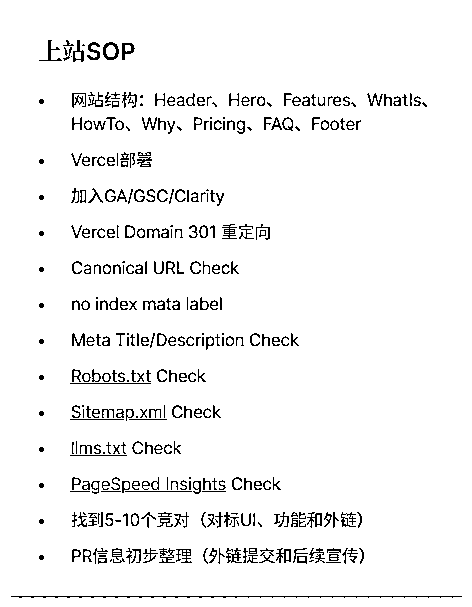

接下来，我将逐一解释每个环节的“为什么”和“怎么做”：

*   网站结构：一个清晰的网页结构，就像是给Google爬虫画了一张地图，能帮助它更好地理解你的网站是关于什么的，哪些是重点内容，从而给予更好的排名。

*   Vercel部署：对于Next.js框架，尤其是新手，Vercel依然是首选，它的集成和部署体验非常好（我还充了会员所以使劲用hhh）。当然，你也可以根据自己的需求选择其他平台（比如深海圈航海手册里推荐的Dokploy）

*   网站分析：GA/GSC/Clarity这三件套是网站数据分析的基础。GA帮你了解流量来源和数量，GSC帮你了解搜索表现，Clarity帮你通过录屏直观地看到用户行为。在新站上线时就同步把代码部署好，可以完整地监控流量从0到1的启动过程，非常有价值。

*   Canonical URL Check：这个和301重定向解决的是同一个核心问题：权重分散。你的网站可能会有多个URL指向同一个页面（例如 https://www.yourdomain.com 和 yourdomain.com）。Canonical标签的作用就是告诉搜索引擎：“这些页面其实是同一个，请把所有的权重都集中到这一个‘官方’版本上。”这能有效避免SEO权重的流失。

*   no index mata label：你的网站上总会有一些不想被Google收录的页面，比如用户协议、隐私政策或者一些测试页面。给这些页面加上“no index”标签，就是明确告诉Google爬虫：“请忽略这些页面。”这可以防止低价值内容被收录，从而影响你核心页面的SEO表现。

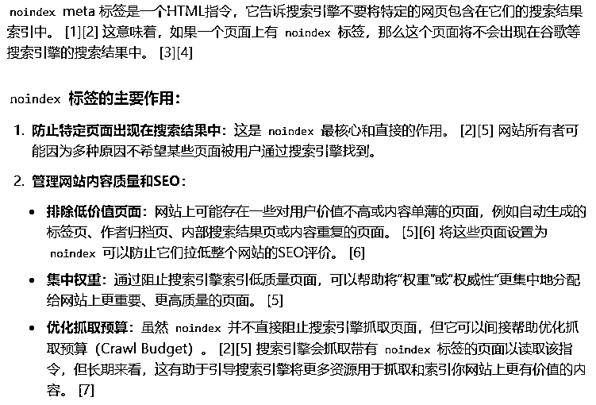

*   Meta Title/Description Check： 这是On-Page SEO的基础。使用AITDK这个Google插件来辅助优化。它会根据最佳实践建议你，比如标题应该控制在多少字以内，描述应该如何撰写才能吸引点击，H1/H2标题结构是否清晰，关键词密度检测等等。这些细节直接影响用户在搜索结果中是否会点击你的网站。（插件地址：https://aitdk.com/）


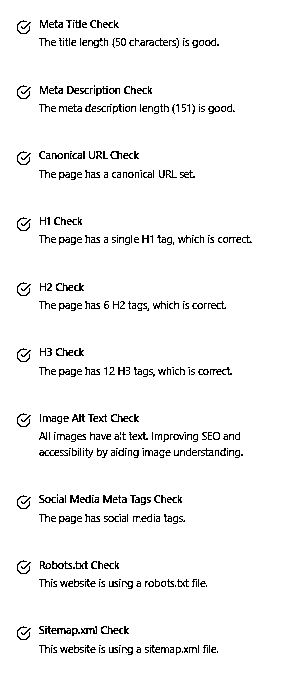

*   Robots.txt/Sitemap.xml/llms.txt Check：这三个文件可以看作是你给搜索引擎制定的“访问规则”。Robots.txt 告诉爬虫哪些页面可以爬，哪些不可以；Sitemap.xml 则提供了一份完整的网站地图，引导爬虫高效地抓取所有重要页面；llms.txt 则是针对AI大模型爬虫的规则。直接在cursor里让它帮你解释，然后直接帮你根据项目代码设置这几个文件就可以了

*   PageSpeed Insights Check：没人愿意等待一个加载缓慢的网页。使用Google的PageSpeed Insights工具，可以诊断你的网站性能，并给出具体的优化建议。根据这些建议去优化，能显著提升用户体验。（地址：https://pagespeed.web.dev/）

*   找到5-10个竞对（对标UI、功能和外链）：这个就不用细展开了，大家应该都很清楚了，就是找到你这个功能对标的网站，全方位的去对标研究它首页是什么内容，怎么引导用户付费，怎么设置功能实现，交互怎么做的，发了哪些外链，上了什么新功能，通过哪些方式做营销等等，建议定期监控看到你的对标迭代了什么内容及时参考

*   PR信息初步整理（外链提交和后续宣传）：当你准备把产品提交到导航站或进行其他宣传时，你会发现需要反复填写一套标准的产品信息。我的建议是，提前准备一个PR资料库。可以先去Product Hunt模拟一次提交流程，看看它需要你提供哪些信息，然后把这些内容整理成一个文档，每次需要时直接复制粘贴，能节省大量时间。一般来说需要包括如下内容：Name、URL、Tagline、Elevator Pitch、Long Description、Use case、Core Features、Maker's Comment、Logo、Screenshot。图片的话用自己网站的截图就可以了，logo最好配置png/jpg和ico两个格式的，有的导航站对logo格式也有要求


## 3.2 自建模板-前端功能模块化

当你辛辛苦苦跑完一遍登录/注册、积分系统搭建和支付流程后，把这些功能集成起来形成可复用的模块，有助于你后续站的建设，也是在积累你自己网站模板的过程，当你需要搭建下一个新网站时，可以直接取用，极大地提高了开发效率。

我的做法是，每当完成一个大的功能模块（比如支付），我就会让AI帮我做一次复盘总结，生成一个专属的说明文档。这个文档会详细说明：

*   这个模块涉及了哪些文件？

*   每个文件的核心作用是什么？

*   关键的逻辑是怎样的？

*   如果要在新项目中复用，需要修改哪些配置（比如API Key）？

当你把每个功能模块都整理一遍完善好后，恭喜你，一套完整的网站模板就搭建好了。这个过程中，我也不断踩坑，比如多语言支持、登录后重定向到初始URL等问题，我还没完全搞定。我同样让AI把这些失败的经验和尝试记录下来，后续再优化的时候也可以喂给AI让它避坑。

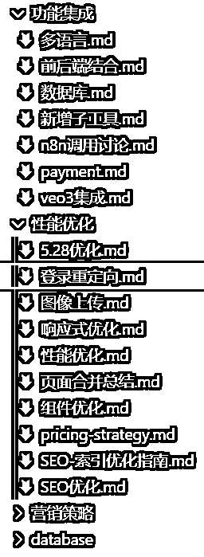

以支付模块为例，我生成的这个说明文档，就成了我下一个项目支付集成的“官方使用说明书”。即使我直接用git clone复制整个项目，这个文档也能让AI迅速理解新项目的配置，并进行相应的修改。其他模块同理。（可以去阅读下shipany的官方文档，跟这个内容类似，既是复盘总结也是学习手册）

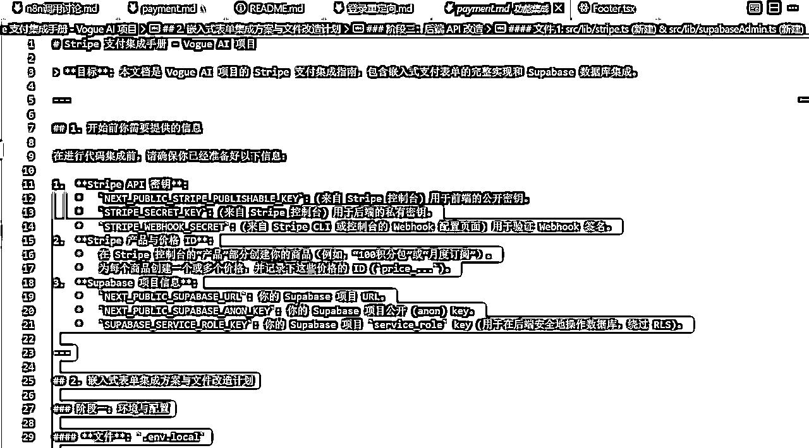

## 3.3 自建模板-后端n8n工作流学习

之前也贴过我网站的n8n工作流，但是有SCAI小伙伴跟我说这个东西还是有点复杂，我这里大概复盘下我的n8n主要用法。

### 3.3.1 直接API请求与响应

这是一个很简单的api调用和返回webhook响应的工作流，本质上代码里直接调用API没有区别，就是减少了代码中的API路由数量，这里每个HTTP Request在代码里实现都需要一个API路由，如果我们使用n8n搭建工作流的话代码里仅需最开头的webhook请求和最后的webhook回调两个API路由：


节点使用：它主要由两个节点构成：Webhook节点用于接收来自前端的请求，HTTP Request节点用于调用外部API。你要做的就是阅读你所调用API的官方文档，根据它的要求配置好请求的参数和格式。在n8n中，你可以很方便地将上一个节点输出的数据value（比如API请求的request id）拖拽到下一个节点作为输入，从而实现流程的自动化。

key/value解释：意思是键和值。比如API响应中传递了一个request id，它的值为7890，那么这个request id就是键key，7890就是值value，n8n可以允许你通过拖动的方式传递同一个键来为不同工作流赋予不同的值，即你每次都是传递request id，但不同的工作流里值是7890/7891/7892, etc.

### 3.3.2 复杂API请求与响应

这是我认为n8n比较强的地方，复杂API请求与响应的逻辑很清楚。这个流程当然在代码里可以实现，但是作为不懂代码的小白，当出现问题去debug时你只能依赖AI去查找和修改，不确定性较高，采用n8n可以在复杂的工作流中清楚知道哪个节点存在问题，存在什么问题，大大提高小白对于后端功能代码的掌控性。

在前一个工作流基础上加入一些数据处理节点的api调用和返回webhook工作流：


它的核心逻辑和简单API请求完全一样，只是在中间加入了一些数据处理的“工序”，比如数据存储、数据筛选、数据清洗等。主要用到的节点是Code、Switch、Set、Merge。这些节点的用法也很简单，遵循一个万能公式即可：

问AI（在n8n中实现X功能需要什么节点？）-> 找到节点 -> 截图问AI（如何配置这个节点？）-> 执行测试 -> 如果报错，粘贴错误日志问AI（分析并解决这个错误）

### 3.3.3 n8n实现简单agent操作

这是一个自动化生成SEO博客文章的工作流，实现的效果是根据提供的参考文章生成一个新文章，n8n可以将这个过程完成自动化实现，如果你的google sheets里配置了基础信息后，只要输入新的主题就可以一键生成博客，一次输入20个新主题即可一键生成20篇博客

其中chat model起到大脑作用，可以加多个辅助节点，比如记忆储存、网页搜索、格式处理等等（Tavily节点需额外下载，实现搜索指定网页和延伸搜索的效果，我这里主要用定向搜索功能投喂固定参考文章），当然还可以加图像分析啊什么的，大家可以再去深入研究一下

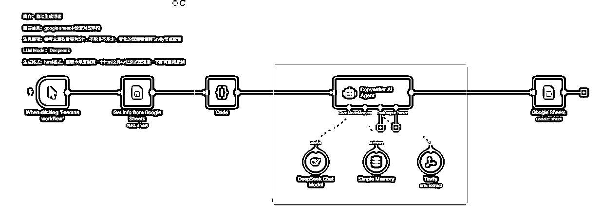

很多人说你这样的功能我随便找个语言大模型就能实现啊，喂给它参考文章喂一段提示词，然后用影刀实现自动化不就可以了么，跟这个有什么区别呢？别急，进阶版马上就来了。

#### 3.3.3.1 自动化触发

你可以设置一个触发器（Triggers），比如当检测到你的Google Sheets里增加了一行新主题时，就自动执行这个工作流，生成一篇博客。

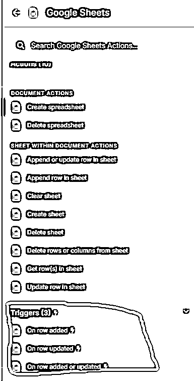

#### 3.3.3.2 多应用联动（Web、Mobile）

你可以将Google Sheets连接到Notion，再连接到你的微信，当你手机上转发一篇公众号文章时，可以实现自动同步至notion、自动分析文章、自动改写生成一篇新文章更新到Google Sheets中。（也可以不要Google Sheets直接把文章写到Notion中，但我比较习惯用google sheets处理数据）

这里微信转发公众号文章的步骤需要用到微信客服机器人（付费可以用flomo、免费可以用黑猩猩随手记，缺点是电脑端不支持，手机端信息无法置顶）


#### 3.3.3.3 多Agent协作

n8n的能力不止可以调用1个agent， 你可以设计一个更复杂的流水线，调用多个Agent。比如，Agent 1负责写作，Agent 2负责对文章进行AI打分和优化，Agent 3负责检测AI生成内容的重复率，Agent 4负责降重。

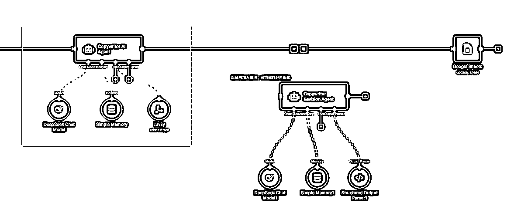

#### 3.3.3.4 n8n进行信息监控和筛选

你可以在你的工作流最前端加入信息搜集和筛选的功能，实现自动化选题，通过agent实现全自动化内容创作。目前各大自媒体平台信息的爬取应该都有对应的接口可以解决，实现一个自动化内容爬取和监控具备100%可行性。


参考代码如下（大家可以公众号关注一个叫“袋鼠帝AI客栈”的账号，n8n拆解使用非常厉害）：

#### 3.3.3.5 n8n一键全网发布

海外的社交媒体平台（YouTube/TikTok/X/Facebook）大多提供官方API，可以实现内容的自动发布。国内的小红书、公众号等也有非官方的解决方案，大家可以网络上自行搜索。

理论上，你可以搭建一个从选题、创作到分发的全自动化内容工厂。

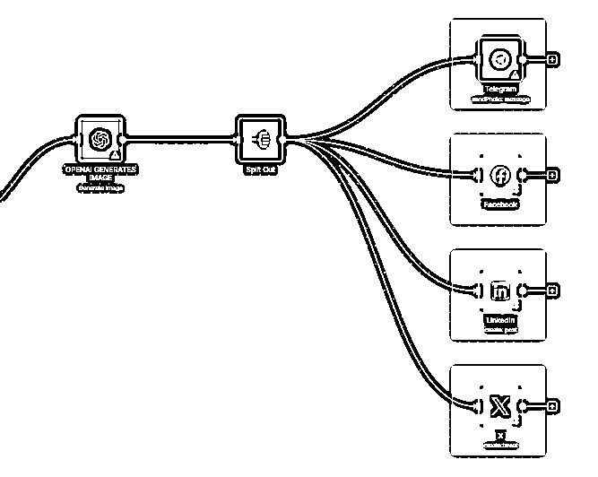

上述的进阶版内容我大部分都梳理了个框架出来，但还没有彻底完善和实现，一方面是时间不够用，重心还是在网站上面；一方面是实现全自动化框架需要的时间和提高的效率不成正比，我现在的内容生产还是以半自动化为主，争取在下个月把全自动化的工作框架搭建起来。

大家想获取一些现成的模板可以去n8n的官方社区，里面有非常多用例，基本上面我说的那些在n8n官方都有对应的模板，当然爬取信息和发布信息的接口大家还要自己去找一下，Github有很多开源项目可以用，也有商业化的API接口（https://n8n.io/workflows/）

接下来一个月我应该也会着重研究n8n，如果后续大家还有需求我再出帖子继续精细化说说n8n。

### 3.3.4 整理品牌站&关键词工具站模板

这里我估计大家肯定很有疑惑，什么是品牌站，什么是关键词工具站？为什么要做品牌站，为什么要做关键词工具站呢？

我来简单说说我最近一个月下来的理解：

```
首先品牌站肯定是更有利于传播的，后续的社媒和红人营销可以很好的打造用户心智，一旦你的产品被赋予了品牌，上限也更高。比如Pixverse（拍我AI），它就是经典例子，根本不做SEO，起量主要靠社媒和红人营销，你要营销品牌词大家才能认识你，持续的使用你的产品。
这种品牌站一般是高举高打的路子，融资→研发→投流→跑用户数据、跑roi→融资，往复循环，上限更高，缺点是门槛也高不适合我们小白操作，初期起步流量很难获得。
当你的网站越做越大品牌站就是一个必须的趋势了。
```

```
关键词工具站呢就是围绕一个关键词，比如ai kiss，我就做一个ai kiss generator，域名和所有内容设计都围绕一个关键词，这种关键词工具站优点是在同等情况下具备更强的关键词竞争力，因为大家想搜索ai kiss的时候，一个叫aikiss.com就会被谷歌认为更加匹配用户的需求
关键词工具站也是最适合我们新手起步去做去竞争谷歌排名的类型，更容易起量，但缺点就在于这种站不适合进行社媒和红人的爆发式营销&自传播，不太好建立品牌心智，基本流量主要靠谷歌SEO还有定向精准人群的广告投流，如果后续这个关键词的搜索量逐步下滑，你的网站流量肯定会受到较大的影响，最经典的例子是ghibli，大家可以搜搜几个知名的ghibli关键词站最近几个月的流量趋势，一目了然。（当然头部的ghibli站几个月可以挣十几万刀甚至更多，即使下滑也很香）
```

所以基于此我是品牌站和关键词工具站全布局的状态，我之前的网站迁移到品牌站来，也在基于新的关键词和需求在开发新的关键词工具站。

上面3.2/3.3部分结合起来，基本无论是品牌站还是工具站都可以实现快速上子页面/上站，对于后续的整体运营提效帮助巨大，因此我很推荐大家积累属于自己的网站模板。

### 3.3.5 外链清单建设与维护

#### 3.3.5.1 SEO概述

网站上线后，流量从哪里来？这是我们面临的下一个核心问题。通常来说，流量主要有三大来源：SEO、社媒营销和红人营销。

社媒&红人营销我还没怎么接触，今天主要说说SEO，简单来说，SEO就是通过一系列优化手段，提升我们网站在Google搜索结果中的排名，出现在靠前的位置。

比如，大家搜索“vogueai”时，我的网站应该能出现在第一页。但这种品牌词搜索量很小。真正有价值的是那些大流量的关键词，比如“veo3”、“seedance”。如果你的网站能在这些词的搜索结果中排到第一页，就能获得源源不断的免费自然流量。

#### 3.3.5.2 如何判断关键词搜索量和难度

那怎么判断一个词的搜索量呢，最好的工具是google trends(https://trends.google.com/)，一般使用gpts这个关键词做对标，这个词的流量比较稳定，基本每天5-8k，可以侧面反映出你要搜的词的搜索量大概是多少。


你也可以用关键词难度工具判断一下如果某一个关键词想要获取排名的难度大概是多少，大概需要发多少条外链（下一部分会解释外链），使用如下工具https://ahrefs.com/keyword-difficulty，这也是你搜索主要竞争对手的方式之一

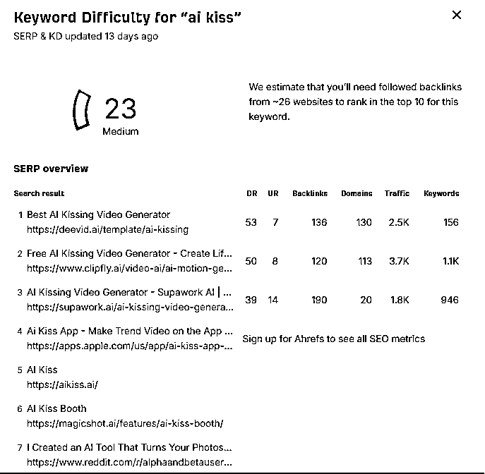

#### 3.3.5.3 如何提升页面权重（DR）

判断完一个关键词的搜索量和难度后就可以想办法去提高我们的页面权重了，让我们的网站尽可能在第一页展示，Google排名有三大核心因素：On-Page SEO优化、用户行为和外链建设。

*   On-Page SEO优化：3.1上站SOP中那些要检查的地方都属于On-Page SEO优化，核心就是让谷歌可以很好地检测到你的页面内容，能轻松看懂你的网站。

*   用户行为：指用户在你的网站停留了多久，跳出率是多少。这本质上反映了你的产品是否满足用户需求，交互设计是否合理。

*   外链建设：外链简单来说就是能在别的网站上出现我们网站的链接，通过A网站找到我们的网址，点击能跳转过来就是一个基本的外链。一个高权重网站给你的推荐（外链），其价值远高于一个不知名小站。这就好比张三给你推荐一个人，和雷军给你推荐一个人，效果截然不同，因此提升页面权重需要我们尽可能找到高DR的网站去发我们的外链。

DR查询可以通过ahrefs的免费工具查询（https://ahrefs.com/backlink-checker/）

Example：toolify


一般来说On-Page SEO优化、用户行为虽然也能做出差异化，但是不会很大，影响DR最大的因素主要是外链（不是说前两者不重要，也很重要！）

一般情况下外链越多、质量越高，我们自己网站的权重就越高，越容易在用户搜索这个关键词时排名靠前，从而让用户点击我们的网站从而提高流量。Google SEO带来的流量没有社媒这么爆发，但是持续而稳定，是一个慢工出细活的流程，也是海外获取流量最基础的部分。（再次强调前两者也很重要，不要忽略，也存在外链很多但是页面做的很烂没流量的情况！）

精准客群、自传播产品和社媒爆款当然我们做产品最理想的营销方式，但SEO我认为是获取流量的根基，你可以掌握后慢慢去尝试更高阶的玩法，但是流量获取的基本盘要有。

#### 3.3.5.4 外链的几大类型

1.  第一类：导航站

导航站是AI工具产品的首选，因为它提供的基本都是dofollow外链，增的权重比较高。（外链还分dofollow和nofollow，大家可以让AI详细解释，简单点说就是对方网站给你的推荐力度大不大，dofollow是“高度推荐”，nofollow就是“知道但不熟”）

导航站一般分为免费和付费两类，付费的像toolify和taaft等高权重导航站能帮你在网站初期快速拉高权重获取排名，效果很好成本也高，99刀提交一次。

免费站一般都会审核后延迟展示或者要求你互换外链，但也算我们初期启动的重要站点，建议每个人都积累一个自己的AI导航站列表，上站之后可以快速去发，后面会写如何积累自己的外链库


1.  第二类：博客评论

这个比较简单，老外博客文化很浓厚，找到可以评论的博客，写一段丝滑融入我们产品介绍和链接的评论，可以为我们提供nofollow外链，而且博客站一般权重都很高，哪怕推荐不那么强力也是有作用，这部分存在一些半自动化工具可以提效的，大家可以去搜搜。

1.  第三类：SEO博客文章

我们也可以自己写博客文章去各种博客网站发文（substack、medium等），更加丝滑的融入我们的产品介绍和网站链接，而这种外链一般都是dofollow的（视网站情况不同），效果更好，缺点在于生产成本会显著高于前两者，因此尝试建立自动化博客文章生成的工作流对于提效帮助明显

当然获取外链还有很多稀奇古怪但是又很有效的方法，比如creem的profile，stripe的climate等等，理论上只要能在别的网站上留下你的网站链接就是可行的

当然你定向知道一些精准用户聚集的地方更是可以在发外链提供网站权重的同时直接获取用户，这是比高DR网站更香的。

#### 3.3.5.5 如何积累自己的外链库-无限获取外链

1.  第一步：问AI

让AI告诉你一些知名导航站，也可以去互联网上搜索一下，这种整理帖非常多，即刻、微信公众号、google上一搜一大堆，我贴一些在下面。把这些数据分类清洗一下，然后一个个提交一遍，你就会知道哪个需要付费，哪个需要交换外链，哪个需要审核，哪个延迟展示，分类整理好就构成了你的初始外链库。

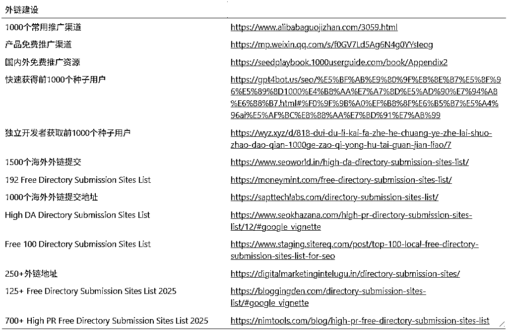

1.  无限循环：外链提交网站-竞品-获取外链-竞品-获取外链

*   找到一个头部的导航站，比如Toolify

*   在上面随便找一个和你的产品类似的AI产品

*   把这个AI产品的URL粘贴到ahrefs的外链检查工具（https://ahrefs.com/backlink-checker/）

*   你会看到所有给这个网站提供外链的网站列表

*   逐一排查这个列表，判断这些外链我们是否也能去发

*   如果可以，就把它收入你的外链库；不可以的话放弃寻找下一个

*   不断重复这个过程，理论上，你的外链资源是无限的

14个ahrefs的免费SEO工具（哥飞）：

https://mp.weixin.qq.com/s/ZoLAZoiKUphLUR8YFLajcQ

https://mp.weixin.qq.com/s/YgvPDIpThc1Tw2svk2EScA

发外链是一个水磨功夫，非常需要耐心和坚持，你每天发一定能看到回报，可能没有爆发但总体是比较稳定的，时间越长壁垒越深。

我这一个月从外链入门开始发第一条到我自己的外链库积累了大概300条，其中质量有高有低，很多高DR的没法提交，提交了要延迟3个月甚至半年才能展示，对于你上新站的影响还是蛮大的，所以大家还是要尽量去完善一个自己高质量的外链库，对于后续SEO会有很大的帮助。

# 四、心态&感悟

## 4.1 有关行业

今天看到亦仁回答的一个问题：

亦仁老师你好，我在生财看了很多web网页开发的帖子，你说过这是超级标，包括现在深海圈刘小排老师在带队，但是呢，三个月到半年能出成绩的人，寥寥无几。像三个月首次出单，三个月的时间成本，赚几十美金，这种价值在哪？还有一堆人半年都没出单的。对比小红书，如虚拟电商，找对选品，1~2周都能出单。我想听你细说一下，为什么你看好web出海，还亲自邀请刘小排带队。

我觉得这个问题其实很有意思，从我身边来说，来到SCAI实验室的朋友都不是原先的工作干不下去了，而是看到了更大更多的可能性，并愿意为了这个可能性忍受几个月乃至更久时间的低收入，从某种角度来说这就是这个行业存在的壁垒，敢于做这种决定的人不多，那么是不是也是机会呢？

我再从另外一个角度尝试回答一下这个问题，从产业价值链端口来看，行业的价值量占比是层层递减的，越是上游总价值量是越高的。

AI这个行业最上游是什么，是算力是IDC，英伟达为什么一枝独秀，因为它掌握算力这个最大端口；google、微软他们核心资产在投资什么，在投资IDC，只有这些云端基础设施完善了才有我们下游的行业；再往下才是AI通用大模型，Deepseek为什么爆火因为它证明了中国在这个领域可以达到世界顶尖水平；再往下是垂类大模型，是API调用，之后就到了AI工具；那么使用AI工具的是谁呢，是最下面的C端和B端用户。

简单来说你掌握了AI工具的构建和使用方法，你可以把你的产品卖给小红书虚拟电商的商家，你可以定向开发适配的产品。当然小红书虚拟电商并不一定需要使用AI工具，但是AI工具可以为其提效应该是不争的事实，产品构建过程AI图像分析可不可以提效，引流vx过程AI搭建的客服机器人可不可以提效，发小红书笔记的时候AI批量化工具可不可以提效。

所以我为什么觉得AI产品是一个巨大巨大的机会，它并不局限于网站一种形态，只是网站这种形态最简单，新手入门最快，大家才去做网站。你哪怕不做网站不做APP，你利用AI的能力去做一个提效工具，也能用在小红书、抖音、电商领域，用在任何一个行业，这才是对普通人来说最大的机会。哪怕你钻研半年一分钱没挣到，你踏踏实实学了搭建产品了，你的努力也绝对不会是无用功。因为相同的人相同的努力你花时间在一个前景巨大的增长型赛道上一定具备更高的收益，钱是一部分，但不是全部，你会发现甚至连小红书官方都在发力AI做了felo，AI一定是当前最大的趋势和风口。

你不需要再去判断这是不是未来趋势了，世界上最聪明的一波人已经“用脚投票了”，你只需要相信这个结论，跟着走就好了，把用脑判断的功夫交给用手去实践，然后时间会给我们答案。

## 4.2 有关心态

其实最近没什么心态上的波动，每天都是做事、复盘、吃饭、睡觉往复循环的生活，甚是枯燥乏味，偶尔有空了就刷刷视频喝喝酒放松一下，但这两天读了一生荣禄（百万哥）的精华帖，非常有感触（https://scys.com/articleDetail/xq_topic/1524185121528482），里面说到：

随着我不断向世界发声呐喊，世界也开始回应我。

我知道，有些选择注定不轻松，但我更怕的是，不选，会后悔一辈子。

我愿尽全力，换我们少一点遗憾。

我知道，以我的基础，这条路并不轻松。但不试试，怎么知道自己不行？

现在的我，也许还不够强，但我相信——未来的我，一定行，一定行！

选择永远大于努力。方向对了，努力才有意义。

这篇文章看的我十分的燃，精神上的满溢感透过字里行间跃然纸上，我一直觉得为了一件事情矢志不渝的信念感是区分人与人之间成就的最大壁垒，什么认知、执行、资源、信息都是可以弥补的，这种坚韧和拼劲想要补起来却十分的难。

我想把这句话整理进我自己的金句汇总里面去，过程中找到了我之前整理的一句话“朝生暮死朝闻道”，之前给到我的触动重新点燃了我。有时候放弃了很多东西并不一定能够得到自己理想中的收获，这之间没有什么必然的因果关系，但不试试怎么知道呢？

人生不长，想做什么就要赶紧去做，别被任何人、任何事限制。

命运予我一秋，我就灿烂这一秋。

命运予我一个清晨，我就辉耀这个清晨。

不需要被理解，你并不知道这是怎么的人生。

往前行！

世间有蜉蝣，朝生而暮死。

朝生暮死朝闻道！

# 五、后续规划

## 5.1 建立自动化小红书工作流

参考自动化航海手册搭建图文自动化生成工作流，视情况加入信息爬取和自动上传功能，以生成图文为主，要求高质量

优先级：☆☆☆☆☆

## 5.2 建立自动化视频工作流

参考自动化航海手册、YPP航海手册搭建视频自动化生成工作流，视情况加入自动上传功能，以产品营销宣传和数字人口播能力为主，要求高质量

优先级：☆☆☆☆☆

## 5.3 持续挖掘新需求

优先级：☆☆☆☆

## 5.4 持续整理高质量外链清单

优先级：☆☆☆☆

## 5.5 持续优化产品可用性和性能

优先级：☆☆☆☆

## 5.6 建立信息自动收集和过滤机制

通过Folo建立一个信息自动收集整理机制，然后通过n8n加入过滤机制，实现每日高效信息获取

优先级：☆☆☆

## 5.7 完善竞对分析和监控机制

这方面暂时以手动为主，自动化机制后续看情况添加，监控下竞对的功能、外链、营销迭代更新情况

优先级：☆☆