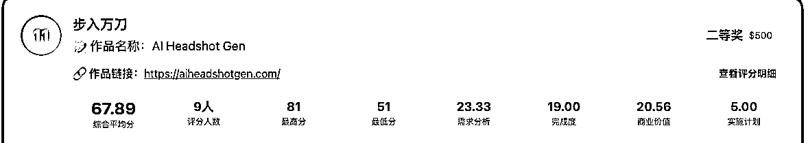
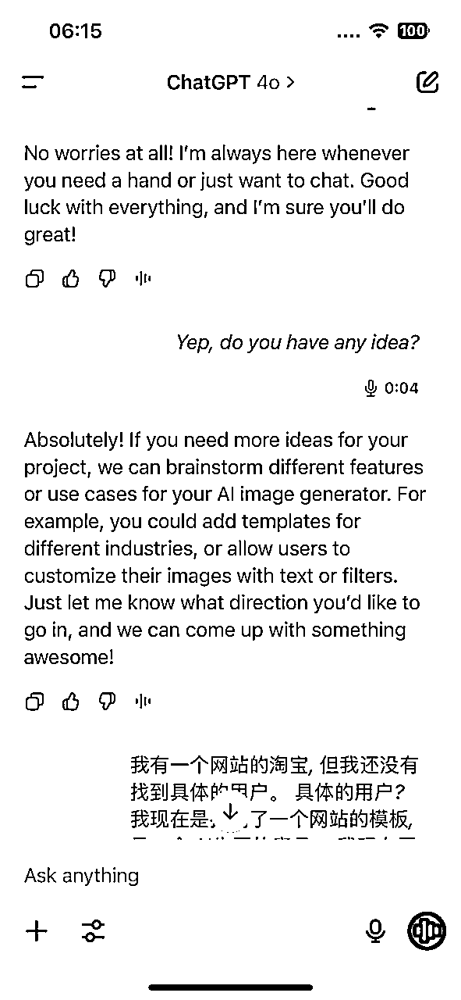

# AI编程 0628-29上站Hackathon复盘：如何22小时从0-1做一个网站，并获得二等奖？

> 来源：[https://ppn3f2zvoq.feishu.cn/docx/LWKIdpwPoo0zwtxXbh0cQNe2n2g](https://ppn3f2zvoq.feishu.cn/docx/LWKIdpwPoo0zwtxXbh0cQNe2n2g)

哈喽，大家好，我是PeterZEN。第一次参加Hackathon这样的活动，收获很多，也有很多感触。

6月28-29日参加了哥飞 x Same.new x Paypal举办的黑客松比赛，共三百多人参加，150多个队伍，我们队伍做的AI工具站很幸运获得了二等奖。复盘一下全流程和记录一下活动的收获。

比赛时间从28号晚上20点开始，29日15点-18点提交作品。

队伍是当天组建的，我刚好认识一位产品经理和一位后端开发，就干脆拉过来组队。我们队伍全都有上站的经历。至少基本的流程是了解的。

原本我们计划做三个网站，提高获奖概率，结果最后只做了一个。不过最后取得的结果挺不错的。

# 1.寻找需求IDEA（4小时）：

多种方式寻找需求：

a) 从社媒论坛上找需求。小红书上看到的，用户有P图换背景的需求。

b) 词根关键词找需求。基于关键词词根从谷歌趋势/semrush/similarweb上寻找需求。

c) 自身需求出发。平时自身积累的需求。

d) 大网站的细分功能。单独弄出来做网站。

e) 榜单平台。像toolify、producthunt这样的榜单寻找需求。还有就是去模型平台看新模型寻找idea。

f）社媒大V

……

我们找到了一些方向，做哪一个？

白天听same.new的联合创始人John Yang的分享，他们三天时间从100多个idea中筛选出了点子，才有了如今的Same.new。

# 2.确定具体需求与核心关键词（2小时）：

我们的idea有多个，我在想我们的筛选条件是什么？按照什么优先级排序？

因为是比赛时间有限，要尽快能做出完整可用的产品出来。因此技术的实现上要简单，不要复杂，能够快速做出来。产品形态得是都熟悉的网站。

基于我们的经历，都做过网站，都做过生图的网站。并且发现都做过AI生图的网站。网站类型就选择了AI图片生成类。

同样的一个需求，用户群体C端和B端的需求是完全不一样的，为了简单快速，选择了面向C端用户群体。

需求的量级和商业价值。通过确认核心关键词在趋势/similarweb看搜索量，然后根据客单价等数据，大致估算商业价值。毕竟做网站的目的是为了赚钱。

在短时间内从零开始找需求，让我感到有些焦急，刚开始是没有头绪，然后逐渐清晰思路。

通过上面的条件筛选下来，选择了AI换背景这个方向。

但是换背景是用户想要的效果，那么具体的用户场景是什么？具体的用户人群是谁？需要从这个大而泛的效果功能找到具体的用户场景。想起小排老师的教导：

什么人？

在什么场景下？

愿意花多少钱？

解决什么问题？

我就和GPT打电话聊天，回答这些问题。不断的和GPT聊天。其中一点的感受是自己的表述需要具体，而不要太泛泛了，让GPT给具体的场景、用户画像等。和chatGPT 聊天，给了多个应用场景。

从换背景这个大方向切入到了垂直具体的场景，最终选择了针对职场人士，让他们不用出门，快速生成正装证件照。为用户节省了时间和金钱。另外就是这个需求是老需求，验证过的，用户愿意付费的。加上因为AI能力的升级，现在做出的效果更好。

需求找到了，但是这个网站要做的核心关键词是什么？

gpt没有给我满意的答案，也只是给我了方向。我就去互联网上搜索，多看了几个网站，找到了自己想要做的核心关键词：AI Headshot Generator。整体上趋势还行，缓慢增长。

虽然选择的词体量不是很大，竞争激烈，但这个词有商业价值呀，靠订阅变现。另外就是比赛时间有效，不是完美的点子，但目前就是有了idea就要快速做出来，先把手上有的做出来。

# 3.网站规划和实现：（9小时）

## 网站的技术实现：

网站代码：之前做过生图网站，可以直接拿过来复用。

AI能力：之前flux也出了新模型，测试了一下发现效果还可以，就采用replicate平台上的flux konext pro模型。Prompt as a service，内置提示词实现效果。

数据库：supabase。

登录：谷歌集成。

部署：github+vercel+cloudflare。

域名：query查询+spaceship购买

## 网站的内容规划：

围绕网站的核心关键词ai headshot generator，去谷歌下拉词、相关推荐、similarweb、semrsuh搜集相关的关键词，然后交给AI分析，做布局。

网站每一个页面的seo细节：Title、description、H1-H3、关键词密度、canonical、页面字数等。

多一个页面就多一个被搜索到的可能性。

## 网站的结构和布局：

页面规划：

*   网站的首页：首页既是落地页也是工具页。内容型工具站。

*   博客页面

*   合规页面：about us/privacy/terms/refund等

*   产品介绍页落地页

结构：

*   首页：

*   header：logo 品牌名 菜单栏 多语言 明暗模式 登陆

*   hero：H1打标题、CTA按钮、效果功能演示

*   Function：产品功能

*   Feature：介绍产品的卖点、特色、特点

*   Showcase：案例展示

*   How to：简单几步教用户如何使用。

*   Pricing：价格列表，里面也要说写产品的卖点、用户的权益。

*   Testimonial：用户证言。先用AI生成。后面放真实的。

*   FAQ：围绕产品的一系列问题

*   Blog list：博客文章列表

*   Footer：品牌logo、一句话介绍网站、社媒链接、邮箱、导航栏（合规页面、价格等）、版权所有

网站的HERO部分截图

*   博客页：

*   首页博客列表 包含介绍

*   具体页面：图文并茂

todo：面包屑导航、优化博客页的内容布局。

## 用户交互设计：

理念：把简单留给用户，让用户少操作。

交互组件：采用了经典的左右布局，左边操作区，右边结果展示区。这种布局也是很多图片站常用的布局，别人这样设计是原因的，我就采用。

用户上传图片，选择想要的风格，想要的图片比例，生成。右侧显示结果以及下载等操作。

简约风格，没有选择折叠选项的方式原因，让用户一眼看到所有选项，能少操作就少操作。

# 4.优化思路与后期规划

很多seo上的规划做好了，但是没有实施下去。需要把规划好的内容给弄好。

比赛的时间是28日的20点开始的，到29号18点最后的DDL提交网站。共计22个小时，花了4个小时寻找idea。9个小时开发。大部分时间都浪费在改bug上面。主要是因为第一次合作用GitHub写代码，产生了很多的代码上的冲突，要花时间解决冲突问题。

优化与规划：

优化产品功能：产品功能非常简单，效果只能说能用，但是让用户愿意付费还不够。找到用户愿意付费的点。

技术优化：加载速度有些慢，因为用的是png格式的，图片有点大，采用webp格式的图片，提升用户体验。

增加内页：主要是博客页面，围绕核心关键词拓展内容、围绕用户需求新的工具页

搞流量：多发外链、提交导航站、做社媒论坛（推特、ins、pins、reddit、Tiktok、Youtube）的内容营销、投放

# 5.感悟、收获与思考：

1.普通人，哪怕不会编程，只需用好工具，也能做出惊艳的网站。看到了别的选手仅仅用了一两个小时，用对了工具，使用Same.new做出了好看的网站。AI时代，技术的门槛大大降低了，重要的是idea以及把idea落实变现的执行。idea to business，有很多流程要走。

2.对于普通用户而言，在满足用户需求的基础上，颜值就是正义。网站做的好看，各项转化率指标会提升，赚钱的概率会增加。一些网站并没有实现功能，但是因为网站做的好看，审美在线也获得了奖项。

3.如今一个人在AI的帮助下就能干完前端+后端+产品的工作，全栈开发运营，我们这样的分工组织形式真的合理吗？

别人花了两三个小时，而我们花了9个小时做出来。组织分工不能再按照以前传统的，看到了一点，不能完全的前后端分离，效率太低了，AI时代这样的组织结构太臃肿，一个人就可以干完所有。

4.比赛，背后从来都不是公平竞赛。每个人的处在位置不一样，手中有的牌也不一样。有产品经理，对需求深刻的洞察。有技术熟手，能够快速做出网站。有人平时就有idea需求，拥有先发优势。有人平时就做过网站，积累了模版，有积累优势。想要在这场AI浪潮中取得胜利，就要建立发挥自己的优势。不管是谋划带来的，找对了方向和模式，还是下场多干积累资源带来的，不管怎样的方式实现，我们想要的就是胜利，打自己的牌。

5.很多seo上的规划做好了，但是没有实施下去。需要把规划好的内容给弄好。

6.对于github合作写代码不熟悉。比赛的时间是28日的20点开始的，到29号18点最后的DDL提交网站。共计22个小时，花了4个小时寻找idea。9个小时开发。大部分时间都浪费在解决冲突上面。主要是因为第一次合作用GitHub写代码，产生了很多的代码上的冲突，要花时间解决冲突问题。

7.理想和现实有落差，我们能做的就是去干。把理想变为现实。想法很美好，但是现实很垃圾。去干，去做。

活动获奖的网站榜单，后面可以看看别人是如何优化的，做起来的：

往期帖子：

Crazy Cattle 3D游戏站复盘与感悟

出海游戏站玩法及挖掘潜力游戏方法

游戏网站如何获取更多游戏？7招助你拓展游戏库