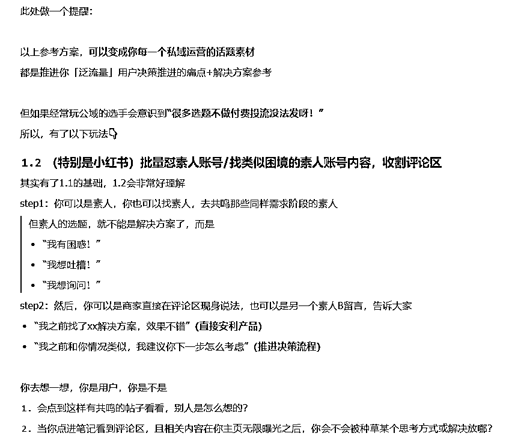
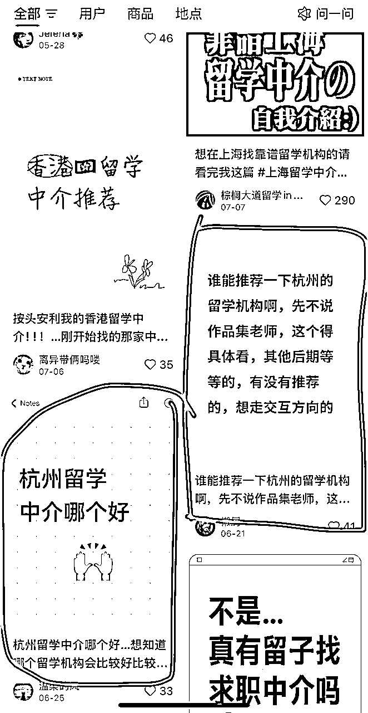

# 高转化的私域，来自高信任的公域

> 来源：[https://fo7m2lpjse.feishu.cn/docx/OXpudAQkQo01Q2xknR3cmgQJn8d](https://fo7m2lpjse.feishu.cn/docx/OXpudAQkQo01Q2xknR3cmgQJn8d)

大家好，我是鱼饼

8年市场，5年培训经验，喜欢琢磨底层逻辑和思维模型

这是我之前的两篇精华帖：

红海市场颠覆互联网获客打法，从 0 到 1 杀到 20%的市场份额：https://t.zsxq.com/LEpxr

带队单日引流1000+，1年成交额1000万的秘密（获客底层逻辑起底）：https://t.zsxq.com/BMopi

* * *

最近一年在沉淀一些业务模型，并且做聚焦和断舍离，有段时间没看生财内容了，感谢生财团队邀请，来聊聊私域这回事。

我不会单独切公域和私域的区别，因为你看一些公域直播电商也有高转化，背后底层还是用户的决策逻辑和信任链条的建立。

私域的重要性和区别点是我们和用户的曝光和触达频次更高（微信打开率更高），以及用户流失率低（相比互联网公域漫天的同行，私域的同行肯定更有限）

我个人理解，私域销售转化的本质是「帮用户看清自己脸上沾有皱纹」+「构建选取去皱产品的决策逻辑」+「用户信任你的纸巾性价比极高又对症下药」

没有意识到自己脸上有皱纹或者不觉得脸上皱纹是个问题的人，是不会需要去皱抗衰产品的。

你哪怕有超级多认证，但是用户不相信你的产品能去皱抗衰，也不会想要买你的产品的。

做私域的人，一定听过“泛流量”和“精准流量”两个概念。

大家对精准流量比泛流量好转化也有概念。

但如果我追问：泛流量精准一点点，算是精准流量吗？精准流量泛一点点，算是泛流量吗？

你会发现很难定义了。

进入私域的泛流量能慢慢变成精准流量吗？泛流量和精准流量里面能不能做不同的用户分级分类？

# 我把用户决策链路分成2大阶段，6小阶段。

需求觉醒阶段的用户，我定义为「泛流量」

竞品比对阶段的用户，我定义为「精准流量」

很明显，用户在比对竞品时，显然比刚产生我“可能有这个问题”时，付费意愿要高

所以我的分享，核心就围绕两大阶段来说明：

需求觉醒阶段的用户，在思考问题时，大概率都会走过这几个阶段：

1.  用户能否意识到自己有问题？

用户以为自己没问题

1.  能否清晰描述问题本质？

用户认为的问题不是真问题

1.  是否量化过问题代价？

用户觉得问题不严重

1.  是否低估解决难度？

用户认为问题好解决

1.  决策链条是否明确？

用户没有清晰的执行路径

1.  是否有惯性思维or处理方式

用户被低效模式绑架

而竞品比较阶段的用户，在思考问题时，只在乎「投入产出比」

他们的关键问题是：

1.  我计算投入产出比的模型是否清晰？

商家视角：我们的优势是什么？

1.  行业里的信息是否透明？我是否了解？

商家视角：用户是做充分了解决策的，还是黑箱状态下决策的？

1.  我关注的差异维度是否是关键？

商家视角：用户需求和我们的产品特色点是否匹配？

1.  我接触的这个商家的说法介绍，值得相信吗？

商家视角：怎么给用户建立充分信任？

不难发现，123基本是客观的，而用户决策阶段的关键难点在「信任」

我们举几个例子，帮助大家对我的模型拆解有个感知：

如何理解第一部分「用户需求确认的链路」？

思考以下场景中，什么时候你更容易做买单动作？

*   你刚发现手机后置摄像头坏了vs你发现手机没法开机了

*   你很清楚买新电脑基于自己需求的配置vs你有考虑买新电脑但完全不了解电脑各种配置要求

* * *

再放第二部分的结构拆解（用户视角）：

1.  你的动机是否合理？

1.  你是否具备能力解决我的问题？

1.  你是否真的有解决我这样情况的过往成果或者背书检验？

1.  我选择你的投入产出比是否划算？如果没解决，或者解决效果不好的风险我能否承担？

如何理解第二部分「信任的多维度」？

思考以下场景中，什么时候你更容易做买单动作？

*   同需求和预算的朋友vs房产中介vs房东/销售三类人给你推荐某楼盘值得买

*   买保健品时，三甲医院的医生推荐vs某次就餐认识的某个大妈推荐

*   买东西时，可以先预付定金，分期交付vs全款预支出，交付完很久

好，我们逐个阶段来看：

# 需求觉醒阶段的六环节

我们先拆解，再基于拆解看案例应用

## 1、用户能否意识到自己有问题？

用户以为自己没问题

类似疫情期间不愿意核酸检测的人，认为自己本身多喝水多运动，偶尔的咳嗽发热应该就是日常的感冒，不会需要特意检测和准备特效药

以留学行业为例，典型情况是：大二学生小A觉得大学生活按部就班，上课、考试、参加社团，没觉得有什么“问题”。他没有主动思考过毕业后的竞争力或未来发展路径的差异，认为顺其自然就好，结果大三暑假火急火燎说想留学，履历和成绩都不够，只能无奈GAP

针对这类用户，Ta前期消费意愿（要早点找留学机构）的教育成本是很高的，但是在萌生和确认需求那一下，极其容易“病急乱投医”。

因为这类用户没有规划意识，是行业里面好签，但又容易退费的一类用户。

成交难点在于「让对方意识到自己有问题」

对应到我们案例要解决的障碍在于：

1.  性格、志向、规划能力（难解决）

1.  对就业市场严峻性的缺乏认知

针对这类情况，你要做的是：别教育，只揭露真相。

1.  展示目标真相：xx行业xx公司（同学dream job）的简历池里面，80%+都有海外经历

1.  对比刺激：海归留学生vs国内985211高校在xx行业xx公司的起薪及后续薪水对比

## 2、能否清晰描述问题本质？

用户认为的问题不是真问题

我们自己看病肯定也经历过，你说你肚子疼拉稀，描述自己前天吃了啥吃了啥，认为自己是细菌性感染。实际上医生会让你检测，最后检测结果揭示的可能是“你只是着凉了”。

举例，某普通一本高校学生小B，看了网上很多人说出国前还没考出雅思很焦虑，所以全身心在准备雅思，结果忽略了实习等履历，最后因为履历很薄弱没法拿到很好的offer

这类用户的处理关键是「确认目标」+「专业评估」，每一步都很重要

1.  确认目标：用户说电脑卡，实际他只是打3A大游戏卡，但真的要换电脑吗？用户可能会发现“我可以不打3A游戏”

1.  专业评估：用户真的要打3A游戏，电脑卡的原因也有很多，也许换个外接显卡就轻松解决了，也许清理下电脑内存和硬盘空间就解决了。

用户要么表达宽泛，要么表达错误，而我们要通过全貌评估来精准定位问题

## 3、是否量化过问题代价？

用户觉得问题不严重

还是拿医院为例，很典型会有人觉得熬熬能熬过去，没必要花这个冤枉钱找人、咨询、诊断、买药。

换言之，这个事情的价值在他眼里不高，所以这种类型的用户，关键是提升这件事的价值评估

举例，缺乏规划和价值评估的大学生非常典型：

*   我大二学雅思太早了吧？

*   我才大一，不是可以玩一年浪一年再说吗？为什么要早规划？

这类用户的处理关键是「算账」，且最好的算账方式是给用户算「如果不做会产生的损失」

——本可属于我的东西我没拿到是很难受的

## 4、是否低估解决难度？

用户认为问题好解决

常见于超自信或者有规划的人群，这类人不适合“人教人”，更适合“事教人一遍就会”

这类客户往往出现在有经验（但经验不可迁移）的人群中，比如：

*   认为自己六级600分，雅思一定xx分没问题

*   认为自己本身是中外合办学校，所以雅思花一学期准备就一定没问题

除了等他们碰壁再找上来之后，还有两种办法：

1.  通过模拟/小成本试验的方式，让用户快速体会到难度

1.  构造案例，该案例和对方情况高度类似，让用户狠狠共情“我也是这样！”，最终还是找到我寻求解决方案

## 5、决策链条是否明确？

用户没有清晰的执行路径

我已经清楚了我有需求，且问题是什么，我知道不应该自己解决，更应该找人解决，那我找什么人？按照什么标准找人？

举例，留学生找留学中介，系统拆解有好几个问题：

1.  到底从什么渠道找，比较靠谱？

1.  中介有擅长申请国家的不同吗？

1.  中介有擅长申请专业的不同吗？

1.  中介有服务条款和退费要求的不同吗？

1.  中介从业年限对服务有什么影响？

1.  中介原先有无留学经历对服务有什么影响？

1.  中介原先有无在职工作经验，对专业选择和择校有什么影响？

1.  ……

这类用户的最佳处理办法是「信任人设」+「构建决策逻辑和标准」

——你是商家身份，你可能怎么讲都没用，但是学长学姐有用/老师有用，因为用户眼里“无商不奸”“王婆卖瓜”

——你只一味讲自己好也没用，你要告诉人家，为什么好？

## 6、是否有惯性思维or处理方式

用户被低效模式绑架

比如有问题，用户习惯先问AI，先在小红书上搜，先问某个KOL，先下意识有个xx判断，这些习惯性动作，可能会成为“成交的阻力”

举例，

1.  我判断某个中介服务好不好，我不是有自己的一个评判标准，而是先上小红书搜别人的评价

1.  我加到你的私域，发现你朋友圈里面案例很少，默认你之前经验少

1.  我找中介，习惯性先找学校边上的，估计他们对我们学校会更了解

这类用户的处理关键是「破固有习惯or固有认知」+「讲解为什么」

总结成表格见下：

大家去看很多私域运营的课程，社群要放什么、朋友圈要放什么，其实本质是推动用户决策的流程

*   是问题真相

*   是目标重定位

*   是问题评估

*   是算投入产出比

*   是人设建立

*   是构建决策模型

*   是破固有认知

## 那回到我们主题，基于用户决策的六个链路，怎么构造公域的高信任基础呢？

两类解决方案：

### 1.1 批量怼商家账号/品牌方账号/找KOC合作，标题类型是：阶段痛点+解决方案

我们一个个来看：

我们刚刚是不是在这个图汇总了“解决方法本质”，我们再把表格逻辑衍生下，落实到解决方案参考

此处做一个提醒：

以上参考方案，可以变成你每一个私域运营的话题素材

都是推进你「泛流量」用户决策推进的痛点+解决方案参考

但如果经常玩公域的选手会意识到“很多选题不做付费投流没法发呀！”

所以，有了以下玩法👇

类似于现在很多人在玩的A种B收

### 1.2 （特别是小红书）批量怼素人账号/找类似困境的素人账号内容，收割评论区

其实有了1.1的基础，1.2会非常好理解

step1：你可以是素人，你也可以找素人，去共鸣那些同样需求阶段的素人

但素人的选题，就不能是解决方案了，而是

*   “我有困惑！”

*   “我想吐槽！”

*   “我想询问！”

step2：然后，你可以是商家直接在评论区现身说法，也可以是另一个素人B留言，告诉大家

*   “我之前找了xx解决方案，效果不错”（直接安利产品）

*   “我之前和你情况类似，我建议你下一步怎么考虑”（推进决策流程）

你去想一想，你是用户，你是不是：

1.  会点到这样有共鸣的帖子看看，别人是怎么想的？

1.  当你点进笔记看到评论区，且相关内容在你主页无限曝光之后，你会不会被种草某个思考方式或解决放哪？

# 产品决策阶段的信任建立

同样，我们先拆解

拆解完底层逻辑，再看迁移应用

## 1、动机

刚随意加上微信的人来给我推销产品，我第一下就是好奇“动机是啥？”

路上一个美女来加微信，有些男同胞也会好奇“不会嘎腰子吧？还是什么钓鱼执法的新套路？还是我老婆派来试探我的？”

一个留学中介给我规划，你说的再有道理，我心里都是想着“你要赚我钱”。

## 2、能力

因为现在吹牛太多了，都或多或少在各行各业当过韭菜。

我不要听你嘴巴吹，我需要听你逻辑论证下，我考察下到底你的承诺有没有可能性

所以我买衣服要看下你说速干面料，那面料是不是聚酯纤维的。

所以我看病要关注下医生的水平，买电子产品要看下品牌，因为有些能力没法直接量化或者逻辑检验，所以我只能信一个背书。

甚至现在背书很多人也不信了，只肯用自己的逻辑去检验，不吻合或者不了解的，我就不买或者非常谨慎。

像是留学这种非标行业更是如此，你说你服务行业内最佳，我没法检验，因为每个人都可以这么说。

## 3、结果

你承诺了，还不够，你没做出结果。你都是空头支票。

所以为什么电商要看客户好评，为什么像留学这样的非标行业要看案例，因为你做出结果来，我信任度才高。

但这里和第一个动机又有关，因为好评和案例是可以捏造和刷的。

我不知道你的好评是不是真实客户，我不知道你的案例是不是随便从友商那里拿的。

而且用户心理如果发现一个产品“没有差评”，其实是很慌的。

所以我们电商平台为了确认产品真实性，我们其实会喜欢「看差评」

看差评的背后，是我对于你结果真实性的检验

## 4、风险控制

看差评除了是看实际结果，背后也是用户一个心理叫「风险控制」

就是“如果最坏的情况下，怎么办？”

*   买房子很多烂尾，所以最坏我买央国企的楼盘，肯定是“保交付”……

*   留学行业名声已经臭了，所以最坏我选大机构，肯定“不会太差”……

以上是用户在「相信」问题上的决策逻辑

## 所以我们回到主题，基于用户信任的四维度，怎么提高信任呢？

我们一定要明白，用户加上微信那一下的品牌印象和公域/转介绍形成的印象一定是一以贯之的。

所以，我们在公域的布局上，是不是可以大量围绕这几个维度做这些事情：

你是商家说自己好，我不信，但是你是下游产业（一定会对上游产业挑刺的）说好，我会信

你是商家说自己好，我不信，但是你是离职人员，你的分享有说到好的有说到不好的，我会信

你是商家说自己好，我不信，但是你是真实用户，你的反馈有说到好的有说到不好的，我会信

你是商家说自己好，我不信，我就认第三方背书，我就非得听听你的交付逻辑，我会信

你私域都是成交案例，我不信，但是我看你有理有据地拒绝了几个人，我有点信

* * *

大家在理解信任建立的维度基础上，再来看上面这段，去结合人设、结合用户需求环节，你的用户来了，绝对嘎嘎信任

# 举例1：截流 or A种B收（产品决策阶段）

以截流为例：

step1：识别该帖子的发帖用户和关注帖子的用户，在需求觉醒阶段还是产品决策阶段？

*   比如下方，已经在问中介了，明显是【产品决策阶段】的用户

step2：基于阶段用高信任的身份，去给到顺承决策链路的建议

*   千万不要千篇一律地说“啊呀！看看我们！”“姐妹，我之前找的机构很不错！要不要推你！”

*   比如下方，你只是用自己的机构号说选我们，肯定不合适，如果你是机构账号，你的【动机】已经明显和用户冲突了，你要给用户展示“你的能力，结果，风险控制”，比如你可以讲“我们xx条款（用户很关心，且竞争对手没法解决的）可以写进合同的，可以和我们聊一下做一个评估”

*   另外你还可以用留学过来人身份，但不能只讲“很不错，要不要推你”，你没有给用户构建相信的理由。但是你这么说，可能就可以展示决策维度和靠谱性，并提供风险控制，展示从你视角的案例结果：

*   艺术留学机构xxx很重要（提供决策维度）

*   但是市面上很多都是xxx（打击竞品）

*   这个机构在xx方面很好（决策维度和靠谱性）

*   我后面xx背景申上了xx名校（结果案例验证）

*   注意：这个时候用户是觉得你骨骼清奇，一眼就和其他渣男不一样，他会拿着一个决策标准和一定的信任基础来问的

# 举例2：截流 or A种B收（需求觉醒阶段）

step1：识别该帖子的发帖用户和关注帖子的用户，在需求觉醒阶段还是产品决策阶段？

*   比如下方，在问上课留学选什么国家，明显是【需求觉醒阶段】的用户

*   如果你按照我的逻辑拆解细分，你会发现对方刚刚在意识到自己选国家有问题的阶段

*   你上来给人家推中介进行咨询，非常败好感，且对方没有信任度

step2：基于阶段用高信任的身份，去给到顺承决策链路的建议

*   你更应该以过来人，甚至你是中介也问题不大，你要推进用户的决策链路

*   比如你不应该告诉对方答案，而是告诉对方怎么思考，基于哪些维度做考量，更合理，因为一个答案不会适合所有人

*   且对方没有进入竞品决策阶段，你也不用去过多关注和验证你的能力、结果，你只要推动对方在需求觉醒阶段往下走就可以了

# 举例3：做IP的公域内容输出&私域朋友圈运营素材

见这个表哈哈哈哈，不多提了

你通过用户需求分析，可以产生无限内容，对标只是一时，原理推演是无限