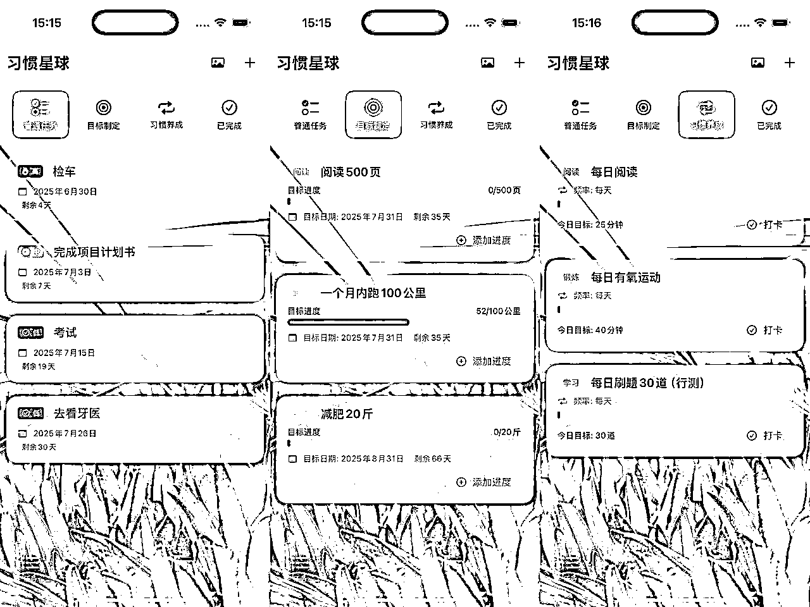
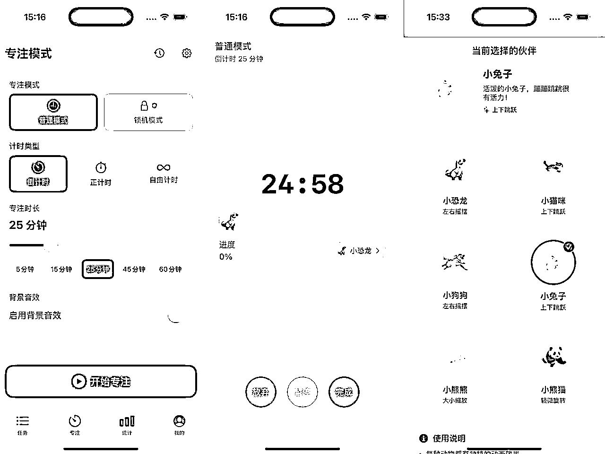
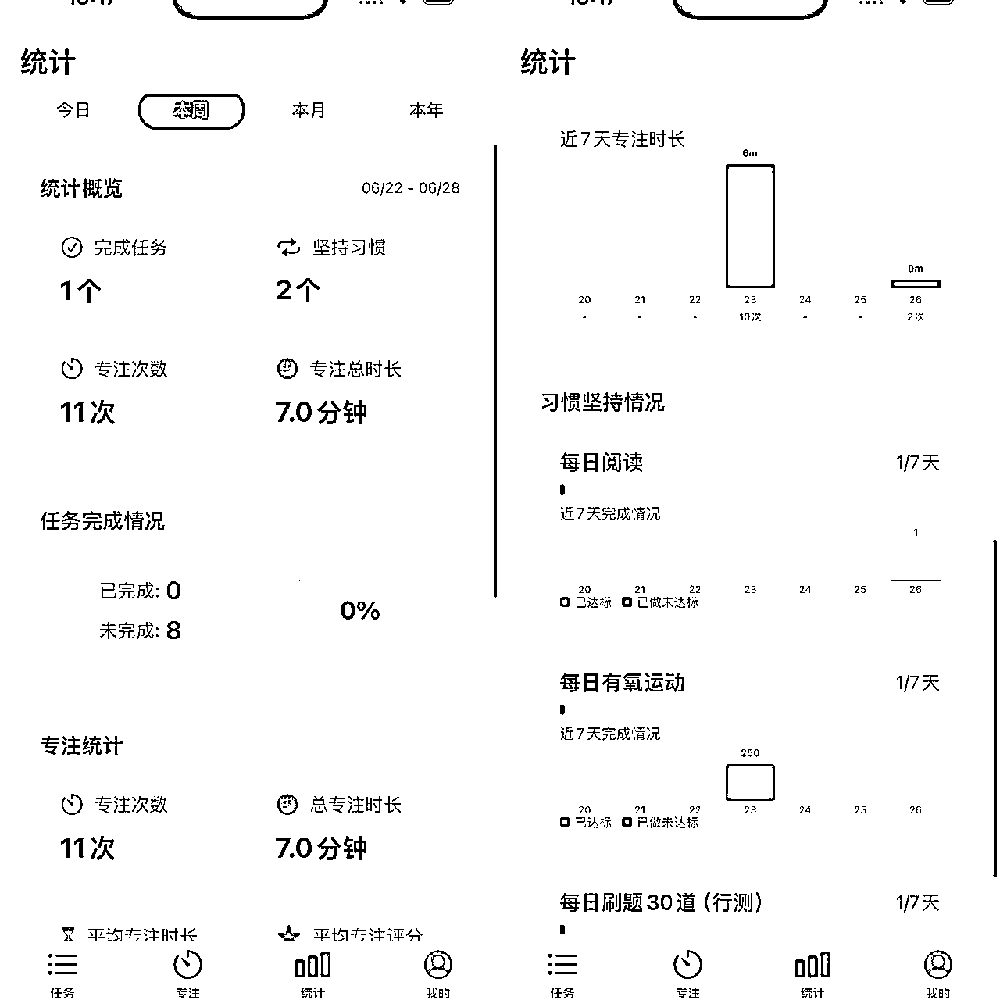
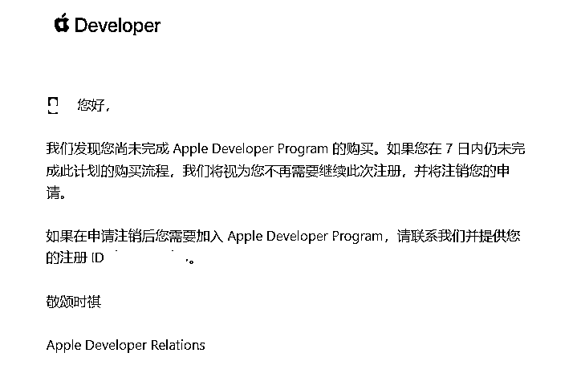

# 一事无成的大龄普通人迈出副业第一步，第一个iOS应用上架

> 来源：[https://x2pol0z87h.feishu.cn/docx/MRM8dT96So8CrExkCRMcj38BnKd](https://x2pol0z87h.feishu.cn/docx/MRM8dT96So8CrExkCRMcj38BnKd)

# 一、我的第一个APP

Hello大家好，我是紫月橙枫。一个目前一事无成的个人开发者，生财1年圈友。标题的修饰词有点多，但确是事实，眼看就要不惑，依旧一事无成。今天也是第一次发帖子，心情有些激动，纪念一下我的第一次，我的第一款IOS APP“习惯星球”上线Apple Store。没错，没跳出新人独立开发者的怪圈，这是一个ToDo应用，但是我感觉多少跟其他的有些差别。下面这个就是我的app。感兴趣的圈友可以捧场下载试用一下哈，并欢迎多多提意见。感谢大家！

简单介绍一下功能吧：

（1）支持创建3种不同的任务类型：普通任务（类似于普通的提醒事项）、目标制定（制定一个阶段内的目标任务，可添加目标量，支持自定义单位设置。）、习惯养成（可按每天、每周、每月的频率设定习惯养成目标，同样支持添加目标量、自定义单位等）。

（2）专注功能。支持独立的专注计时界面，可进行专注计时，计时界面有可爱小动物陪同，增加活泼气息。可进行专注类型自定义设置。专注结束后还有专注评分，同时还有专注记录。

（3）统计分析。具有统计分析功能，针对专注情况和任务完成情况进行统计分析。

（4）其他功能300+名言警句随机显示；iCloud同步功能；主题颜色更换（支持RGB自定义主题颜色）；兼容iPad；支持任务列表界面背景图片自定义等。

下面是一些界面截图：

任务界面

专注界面

统计界面

再次欢迎广大圈友给出评价，不胜感激。

# 二、闲说经历

（下面几部分都是我之前惨淡人生的心路历程，跟ios经验无关，不感兴趣的宝子可以直接跳到后面看哈）

## 1、闲谈

先说一下本人自然情况，我是一名IT相关从业人员，现在的工作跟开发工作没有一点关系，年龄已快进入不惑之年。刚毕业的前两年干过一点前端和后端开发，前端是简单的HTML+CSS，后端也就是简单的增删改查，技术含量不说不高，可以说是一点没有，而且十几年过去了，上学和工作时学习的编程知识也基本上喂了狗。

再说说为什么想做副业了。生活在二线城市，在相对稳定一些的企业内工作，每月到手一成不变的不多的工资，正常生活是绰绰有余了。我始终认为自己就是一个普通人，当然事实证明也就是普通人，就在想平平凡凡过生活的时候，公司内部改革，技术序列重新分配，同时大量扩招，这给了我一丝能多挣些钱的希望。本以为在公司兢兢业业，累的半死不活的我能评个中等左右的级别，改善一下生活。结果却如你们想的一样，当头一棒，把我砸回了地下。说实话当时心情特别糟，也很气愤，但是那又能怎样。作为公司老人的我干着比新入职同事多的活，却拿着比他们低一半的工资，心情想必大家也能够感同身受，也就不赘述了。

## 2、寻找出路

以上的经历是发生在5年前，这5年间我的人生也是一直比较灰暗的，投资的投机的都干过，结果当然是亏没了，这几年的弯路走的是真不少。看着老婆在单位干的也不是特别顺心，经常因为单位的事情不开心；孩子也在一点点长大，想着如果孩子不愿意学习，以后没考上什么好大学的话，我也不想让孩子无所依仗。我爱我的老婆和孩子，想给他们好的生活，想一直看见她们的笑脸，这是每个正常男人都想要的吧。

于是在23年我顿悟了，单位的事情也看淡了，依旧好好干，因为还要靠它吃饭，在自己的努力下也算涨了些工资，但是依然不是我想要的生活。于是利用空余的时间研究副业，想通过副业来增加一下自己的财富。理想是好的，现实是骨感的。由于在副业上一无所知，开始时只了解到了一些初级的网赚项目，后来一咬牙花了几百块钱加入了“某某云库”，里面都是一些网赚项目，当时一腔热血的做着发财梦。看着满屏的各种网赚项目，什么“外面收费1280的支付宝无人直播技术，小白也能日入300+”、又如“AI写作4.0，条条原创，多平台发布，轻松日入1000+”，看的我是晕头转向，感觉自己离百万富翁已经一步之遥了。

说干就干，按着它里面给的所谓的教程，按部就班的跟着操作，当然了，结果是1分钱也没挣到，不排除有人天赋异禀，能跟着做出成绩拿到结果，但对我这种纯种普通人来说无疑是痴人说梦。天天看着琳琅满目的项目标题，就像亦仁老大之前说的一样，看的我越来越浮躁，越浮躁就越拿不到结果。最终我拿到的唯一结果就是，我感觉自己就是个废物，废物就该呆在垃圾桶里。

## 3、那束光

也算是老天没有把我的门窗焊死，有一天还是照进来了一束光，这束光就是“生财有术”。原则上来说我们应该抵制盗版，但是我还是很感谢那次的盗版资料。具体是想找什么有些记不清了，为了省钱，在某平台买了份盗版资料，无意中发现里面有一部分生财的文章，随便看了几篇。说真的感触很深，击中了我心里的某个部分，感觉自己又看到了希望。于是上网找了一些生财的介绍后，就毅然决然的加入进来了。进来之后仿佛发现了新大陆，这里面大佬云集，一次次的刷新我的认知。我知道我来对了，跟着生财走，我感觉普通人应该也能逆袭。

## 4、航海

我是2024年8月份加入生财的，加入之后不久就有一次航海，新人刚进来比较懵，也没确定好自己想要的发展方向，于是就报了个小红书虚拟资料和AI写作。也是第一次在航海群里看见那么多年轻有为的教练、志愿者，年纪轻轻就小有成就。说实话真的很羡慕，想当年我20岁的时候还跟室友在寝室里玩DOTA，现在想想真的是蹉跎了不少岁月。但是现在也不晚，只要开始了，什么时间都不晚。

经历过第一次航海，我觉得我在社交媒体私域方面真是没有什么天赋，抄文案都不知道该怎么抄，无头苍蝇的感觉，只能放弃自媒体这条路了。后续又在社群里拜读各位大佬的文章寻找方向，由于计算机专业出身，本身对AI也是比较感兴趣，最终还是决定走AI编程这条路。第二次航海参加了“Cursor-零基础做软件应用”的航海，虽说没有挣到钱，但是从某些方面讲还算是拿到了一定的结果，根据我自己工作的需求，开发了一套管理系统给自己和相关同事用，也算在工作上便利了许多。

24年年末，看了亦仁老大发的第三个超级标，也算是最终确定下来方向了，就是AI应用。于是参加了接下来的"AI应用-IOS APP"航海，内心的火种已经点燃，感觉我又要站起来了。说干就干，但是生活总是会遇到些状况，恰好那段期间孩子肺炎住院，住了1个多月，再加上公司赶上个大项目，每天基本上没有时间来实操，只能看看航海手册和领航视频。所以只能延后了，这才有了这次迟来的分享。下面就回归正题了，简单跟大家分享一下我开发过程遇到的一些问题。

# 二、准备工作

## 1、硬件方面

先说一下本人有一台2015年款的macbook pro已经支持不了我开发了，还有一台配置挺高的windows笔记本，我用它装过虚拟机mac系统，但是我劝各位还是打消这个念头。首先不好弄不说，各种兼容性后续也是个问题，真想走这条路还得是原生。

所以我趁着有国补，入手了一台macbook mini M4 16G+256G的最低配，也够用了，国补到手价大概3580左右。我是资金有限，没办法只能挑便宜的买。有经济实力的还是建议直接入手MacBook，方便，去哪里拿个笔记本就够了，mini毕竟算是台式机，得外接显示器、键盘、鼠标等。我现在上班就得带个笔记本还得带个MAC MINI，挺不方便的。在家也是，来回换显示器不方便，只能用向日葵远程调试。

至于手机还是最好有个ios15.6以上的iPhone，不是说必须，但是有最好。我在开发过程中，基本上都是用模拟器调试，用到真机的情况不多。但是有时候模拟器会出现一些莫名其妙的问题，但是在真机上运行就没问题。我在用的是一个初代iPhone SE和一个iPad Air 2，都是老古董级别的了，说实话测试体验也不是很好，但是好在还满足要求，先对付用吧。

## 2、软件方面

IDE：Xcode最好安装最新版

AI辅助：cursor（或windserf或者Claude code），我个人用cursor比较顺手，Claudecode用不起。为了节省成本，cursor我是在海鲜市场买了2个1年期的学生认证账号，150一个。因为当时cursor pro还是有次数限制的，一个号不够用，我就买了两个，现在的话普通pro好像是没有次数限制了，所以一个号应该就够了。

后台：本次开发的APP纯本地应用，没有使用到需要联网的后台服务。但是为了学习试探，我依然注册了个域名，并在阿里云花79元买了1年宝塔面板的2核2G 40G不限流量、峰值带宽200Mbps的云服务器。并完成了域名备案。

## 3、开发者账号

申请开发者账号，年费688元。前期开发者账号不是必须的，没有开发者账号也可以正常开发。但是没有开发者账号的时候，iCloud、ApplePay、通知、订阅等功能是无法使用的。

需要注意的是一定要用第一个实名的appleID账号申请，我申请的时候最开始用的appleID就不行，因为不是我的第一个实名appleID。好在我邮箱不对，最后试出来了我的第一个appleID，后来就申请成功了。到付款的时候就没继续付款了，先进行开发测试，后来不得不付款的时候才付的款。

不得不付款是有一天我收到了苹果发过来的邮件，说7日内不付款的话，会注销我这次申请，后续可能还需要联系他们才能继续注册。我为了避免麻烦，直接就付款了，正好那段期间我也正需要测试一些付费后才能测试的功能。

# 三、开发流程

好了，怀着激动的心，我开始了我的IOS APP开发之路。装备到齐之后，我就先把需要用到的软件都安装完毕了。然后接下来是——发呆。

因为我还没想好要做个什么APP。最后我老婆说她有一个需求，她自己要用，身边同事可能也会用。我就问了一下她的需求。好吧，最终没逃过新入坑独立开发者的三件套之一，记账、笔记、ToDo。需求是她想要一个任务打卡类应用，打卡时可根据实际任务类型来分辨是直接记录，还要有统计分析功能。我想了一下，市场上同类型应用已经很多了，想做出区别化来不容易。但是老婆要用，那只能照做了。开发过程就不赘述了，就是难熬的增加功能、改BUG以及一次次的测试。详细的流程航海手册上也都有很详细的介绍。下面主要说几点新人容易碰到的几个问题。

# 四、遇到的问题和解决方案

## 问题一：从未接触过IOS开发

在这之前，真的从未接触过IOS开发，之前用Mac也主要就是刷刷剧、看看网页之类的。下载Xcode之后，看着真的有些迷糊。熟悉了几天大概也了解了这个Xcode的使用方式。建议新入坑的圈友不要急躁，可以仔细看航海手册或者自己上网找些教程。

## 问题二：关于cursor

想必使用过cursor的人都了解cursor的特点，功能稍微复杂之后就容易变傻，而且经常在你不知道的情况下偷偷改别的不相关的代码。这部分的建议就是，一定要看好这个老六。对自己的项目结构、项目文件要尽量知道是做什么用的。当cursor对现有文档进行修改的时候，一定要看看修改的是什么文件和大概修改的内容，不要一味的机械点accept、run。有时候能明显看出来修改的文件根本就不是你要的那个，可以避免一些误修改。当然了，高手可能写提示词和rules的功底强，能避免很多问题。但是对于咱这种小白，那就一定要认真些。cursor确实是真老六，容易不知不觉就把你的app改的面目全非。

## 问题三：版本控制

做开发一定要做好版本控制，无论你是用本地的git仓库还是联网上传到github，版本控制是一定要做的，便于后续回溯。而且需要注意的是，一定要注意cursor，有时候cursor会自己提交git命令。我就吃过这个亏，有几次没注意，修改完代码后cursor自己就把git add给执行了，有个功能改错了，之前没有及时提交版本，导致回退到了好久之前，很多功能都白做了。所以要及时进行git版本提交，我一般在提交之前会简单做下主要功能测试，没问题后再进行提交。

## 问题四：关于本地化语言

如果你想在多个地区进行上架，那么建议多建立几个本地化语言，我这个是在全球（欧盟除外，欧盟那个DSA始终没弄明白）都发布了，目前是支持中文和英文，后续如果APP反响好的话，计划再加一两个别的语言。由于我没有连后台服务器，所以我在中国区也上架了，如果有后端服务器，在中国区上架的话一定要准备好相关所需要的备案证明。

## 问题五：关于订阅

订阅这个问题当时确实是弄了好久，在apple store connect中建立完订阅组后，一直显示的是元数据丢失，导致应用获取不到订阅价格。后来发现cursor创建的product ID与Bundle ID不一致，这两个ID前面的部分必须完全一致。例如Bundle ID为com.test.Jizhang，那么你创建的所有订阅类型的Product ID前面必须与Bundle ID一致，如com.test.Jizhang.premium.monthly，后面可以自定义。

订阅界面下方一定要把隐私政策和用户协议链接添加上，链接是要能在线打开的，不能在本地显示。

如果有免费试用，一定要在页面中加上提示，例如“订阅此产品会给您提供3天免费试用，如需退订，请在试用结束前24小时进行退订”之类的提示。

## 问题六：关于定价

定价时建议默认以美元为基准进行定价，整体价格定完之后，可以手动对某个地区的价格进行修改。

## 问题七：关于隐私政策网址（URL）和用户隐私选择网址（URL）

apple store connect中这两个一定要填写能在线打开的地址，用户协议可以看苹果自身的是否符合你的APP，符合的话可以直接使用苹果的用户协议。我用的就是苹果自己的用户协议。隐私协议我是让AI根据我的应用功能生成的，没有后端服务器没有关系，使用飞书在线文档的分享链接也可以，不过要注意的是分享的权限一定要是所有人可见。

## 问题八：关于上架

我这个习惯星球是先后审核了3次，第四次才成功上架的。主要的几个问题如下：

1、iOS应用一定也要适配IPad，这个之前不知道，Ipad上运行界面全飞了，完全使用不了。这个大家一定要注意。

2、就是上面说的那个隐私的问题

3、测试不充分，部分功能有BUG

## 问题九：关于优化

后续会根据情况安排功能迭代优化；同时最近在研究ASO，上架不是重点，也要不断地进行优化，争取让更多的人看到你的应用，才会有成功的机会。

# 五、心得与建议

这次从无到有的过程经历，对我来说很珍贵，对我这个真真正正的普通人来说是很宝贵的经验。我在副业上没有挣到过1分钱，之前迷茫过、也气馁过，认为自己就是个一事无成的废物。来到生财后，仿佛打开了新世界的大门，也重拾信心，相信自己，这款习惯星球就这么诞生了。尽快上架了已经15天了，只有20个人下载，仍然是1分钱没挣，哈哈（脸红）。但是我的心境已经跟之前不同了，这个APP对我来说就是一个新的起点，我相信在自己的努力下终究会到达成功的彼岸。先立个小目标，2025年的目标是实现0的突破，目标虽小，但是意义重大。一生二、二生三、三生万物。

最后送给大家一句话：“成功不是最后的结局，失败不是致命的终结，重要的是继续前进的勇气”。

诸君共勉！