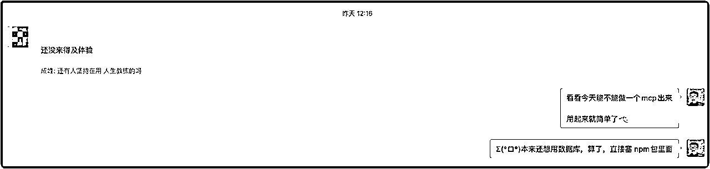
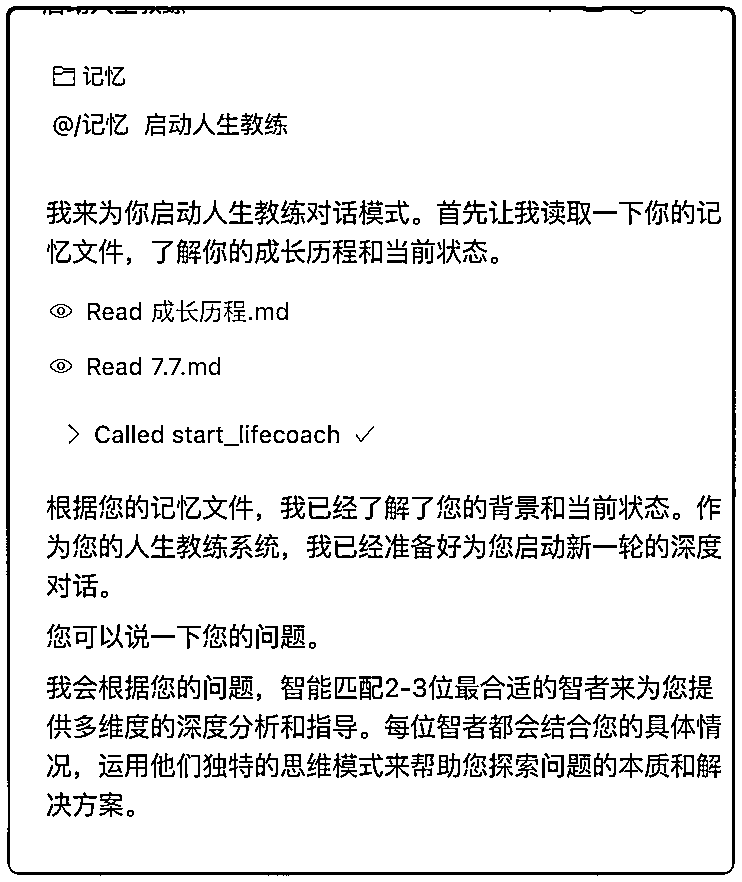
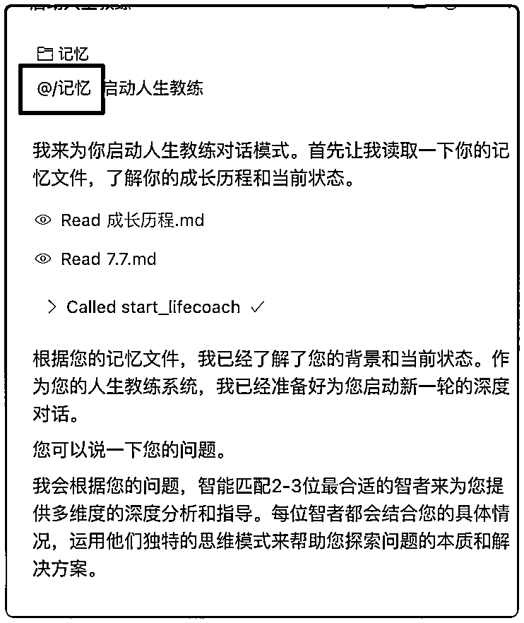

# 飞书MCP不好用？我一天自研了人生教练MCP （v3）｜ 附：我的AI启发

> 来源：[https://o90p05z3t4.feishu.cn/docx/MYXAdWRGzoS2iLxmIKScRQ5jnlh](https://o90p05z3t4.feishu.cn/docx/MYXAdWRGzoS2iLxmIKScRQ5jnlh)

小伙伴们大家好呀，我是Agent博主成峰，一周前，我发布了人生教练v1和v2

最近在观察 人生教练Agent 大家的使用情况，最终还是 自研了“人生教练”MCP组件

先来说一说，人生教练Agent是什么

人生教练Agent，就像一个AI"智慧导师团"。

零成本能召唤乔布斯、苏格拉底等大佬来帮你分析问题。

最重要的是，会根据你的问题

实现多教练圆桌对话，模拟真实的智囊团讨论

好比，你是一位创业者

正在为人生的方向发愁。

人生教练就是把一群顶尖的智者请到你身边，他们不会直接告诉你"该往哪走"，

而是通过不断地提问、引导你思考、分享他们的智慧，

最终让你自己想明白"哦！原来我该这么走！"

就比如这篇文章下方关于 AI OS（AI系统） 的探讨，也是我抛出一个观点，然后和智囊团不断探讨的结果


目前人生教练Agent用户群里涌入300多人，大家都觉得挺有意思。

昨天，我在群里问："现在还有多少人在用人生教练？"

其中有一个群友回答："还没来得及体验。"



再加上飞书MCP这次的更新，跟我想要的方向不太一致。

我决定花一天时间，开发一个 专门做 人生教练 的 MCP组件。

用上我的 MCP 组件

1.  不需要原来飞书MCP的注册登录

1.  更新的内容，MCP会及时同步，不需要手动维护、下载

使用 人生教练Agent 的难度，蹭蹭往下掉

🎯 使用难度：

■■■■■■■■■□ 95% 飞书MCP使用难度

■□□□□□□□□□ 10% 自建MCP使用难度

## 如何启动人生教练

我今天手把手，帮你建立真正的AI教练系统！

### 1.安装下面的mcp，30秒安装，终身使用

```
{
  "mcpServers": {
    "lifecoach": {
      "command": "npx",
      "args": [
        "-y",
        "lifecoach-mcp-server"
      ]
    }
  }
}
```

cursor 安装MCP的方法：网址

claude code 安装MCP的方法：网址

### 2.在对话框输入“启动人生教练”

AI会根据你输入的关键词，自动运行 MCP，获取资料，如下图



你看 Called start_lifecoach ，就是他在获取运行规则

### 3.带入你的记忆，AI更懂你

在对话时，你 引入 你的记忆文件，AI 会去总结你的相关记忆



当你的问题和记忆有关联时，AI会结合记忆，一起去思考

## 在MCP上疯狂实践后，我看到了AI的未来

作为一个在MCP上疯狂实践的人，通过人生教练这个项目，我发现了一些很有意思的趋势。

### 记忆：AI OS的核心资产

这是我最大的感受——记忆可能会成为AI OS的核心资产。

现在的AI就像豆瓣佳片《初恋50次》的女主角。


每次对话都是初次见面，我们都是陌生人。我需要重新介绍自己："你好，我是..."

还记得电影里女主怎么解决的吗？写日记本，每天记录日常。

现在我们用AI，也是类似的状态。发生了什么，要及时记下来，避免AI忘记。

短视频通过浏览记录，制造出了用户爱看的内容。

AI也能通过记忆，增加 回答 的匹配率。

人和AI，也在从 陌生 走向 熟悉 的过程

### API：成本就是护城河

近期的AI都呈现出一种趋势

AI的使用费用：API >>> 官方账号

以Anthropic为例，Claude Code的计费规则比cursor便宜很多：

*   个人账号：$20/月claude sonnet4无限使用

*   cursor：$20可能只够几百次

Anthropic正在用成本优势建立生态垄断

任何涉及到api的独立开发者，都绕不过去这道坎

这种成本差异，决定了大部分人会选择直接使用平台，而非第三方。

### Agent本地化：本地化正在对抗云端

从24年到现在，我使用的AI工具，一直在变

从 monica、poe

再到Cursor、Windsurf

现在 Claude Code

...工具一直在变。

但实践中，我发现，对我影响一点都不大：只要根植于本地，Agent的壳换了，我的核心资产都没变。

### 提示词即产品

围绕Agent开发产品，而不是围绕人

Agent消费信息的能力，比人强太多了

所以面对Agent去开发产品，处理效果能比人好很多

随着Agent能力增强，一套好的提示词就能跑起一个产品。

Andrej Karpathy上周分享了一个观点，让我印象深刻：

软件的构建正在被改变：

*   软件1.0：编程语言写程序

*   软件2.0：神经网络/算法

*   软件3.0：提示词

人生教练就是最好的例子：

*   核心是12个人物的提示词

*   Agent负责调度和执行

*   用户获得完整体验

## 我的实践总结

作为疯狂实践者，我觉得有几点会越来越重要：

1\. 如何学会使用"记忆"

2\. 学习写提示词

3\. 理解Agent产品的组件——比如MCP这样的基础设施

我正在路上疯狂实践！感兴趣欢迎探讨！