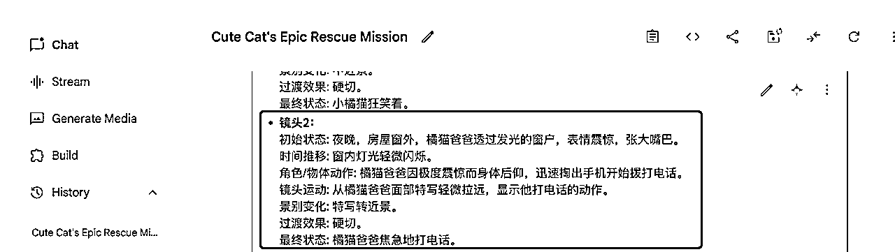

# 作为小白，我是如何在六月份航海期间一个月之内收获3700万观看量并且拿下高级YPP的？

> 来源：[https://dcnawv37g0nu.feishu.cn/docx/MbJudBGbNohhyUxUYVPcHvlonyd](https://dcnawv37g0nu.feishu.cn/docx/MbJudBGbNohhyUxUYVPcHvlonyd)

# 1、作为小白，我是如何在六月份航海期间一个月之内收获3700万并且拿下高级YPP的？

大家好，我是老王，今年 一月份加入的生财新人，一名标准的90后！一直在杭州工作生活，喜欢跑步，看书。

参加过今年3月份和今年6月份的两次航海，3月份的小红书虚拟资料项目早已经无疾而终了，6月份YouTube航海到目前为止（7月5号）差不多整整一个月的时间取得了3700万观看，一个月之内成功拿下高级YPP！

今天我就把自己行动的过程、提示词、思考全部分享给大家！希望能帮到大家少走一些弯路！

第一张是7月5号的频道数据，第二张是7月6号的频道数据。

六月我第一次参加YouTube航海，在航海期间我取得的结果是：

1、打卡18次，个人榜第22名，小组榜第一名

2、作为优秀船员进行分享

2、航海期间发布了14条作品，获得了95万观看（细心的圈友看到这里会觉得不可思议，6月25号才95万的播放量，短短10天就变成了3700万的观看量，是的，我也觉得很神奇但就是这么不可思议，同时也引发了我接下来的一些思考，请往下看）

# 2、我之前干过什么？

我是今年一月份加入生财的，之前在平台上拿到过两个不算结果的结果（两个账号也已经停更一年两载了）。

1.  第一个是抖音杭州本地房产将近9000粉丝的抖音号

1.  第二个是小红书杭州以及杭州周边旅游团建将近4000粉丝的小红书号

为什么我会说不算结果的结果呢？加入生财之前还觉得自己对平台有一些了解，完播率、评论、点赞、好看的封面...加入生财之后我觉得自己就是简直是平台小白，因为我认为的那些了解根本就是小白知识，生财的内容完全帮我打开了另一个世界，然后我发自肺腑的第一句话就是“卧槽，平台还能这么玩！”

凭心而论之前能取得9000和4000粉丝完全是因为这六个字：做得早，凭运气！无它。以前都是自己写文案，拍视频，做封面...一个作品没有半天一天的时间根本下不来，后来是因为行业原因我觉得付出和收获不成正比所以停更了，如果让我现在用生财的玩法再玩之前的赛道我敢说能分分钟玩死之前的自己（突然间感觉自己强的可怕，哈哈）。

# 3、航海期间直接躺平

大家看我前面的内容应该觉得我是多么多么努力的一个人，其实航海期间我躺平了好几天，是的，即使我提前做了一些功课，但是在航海期间我还是充满了焦虑，然后躺平了。我总结有以下原因

## 3.1 优秀的船员太多

我第一天就开始打卡了，我会经常关注打卡信息，看到这个船员今天突破了多少观看量了，是自己的几十倍！那个船员居然搞起矩阵了，自己一个号都还没弄明白！还有些船员没多久就开通了YPP，自己十万八千里才刚迈出一步！后来我才知道优秀的船员都不是刚来就这么厉害，原因差不多有三个：

*   要么已经第N次参加该项目航海了

*   要么在相同领域取得过一些成绩，本次航海只是能力迁徙而已

*   要么就是提前实操了。

## 3.2 看不到希望

我在航海开始之前阅读了很多YouTube的精华帖，大家都是多久之内开通了YPP，多久之内收获了多少的观看量，看看自己忙活了这么久才这么零星一点播放量，平台还要再给你砍一点，绝望！忙活了这么久，这么点观看量都不够30分之一的，虽然我取得的观看数据要比大部分圈友要好，但是人的大脑就是喜欢急功近利、喜欢关注自己没有的东西，忽略自己拥有的东西（包括爱情、亲情、健康、金钱......，所以人生是一场修行）！于是心力交瘁直接躺平，连续好几天也不优化提示词，也不打卡，也不看任何YouTube相关的内容。

## 3.3 又起来干活

主要是被航海群里的信息给召唤，教练时不时做个点评，然后看到了谁谁谁又取得了什么样的成绩，感觉自己躺平也不是个事，心生自责愧疚！于是又起来干活了，哈哈！

# 4、怎么实操

## 4.1 提前实操（原因及好处）

生财的“先把手弄脏，知道和做到差十万八千里”这条价值观我非常认同！并且我现在每天都会用这句话给自己打上一针。

我参加过今年3月份和今年6月份的两次航海，每一次我都报名两个项目，3月份的航海是报名了小红书虚拟资料和视频号直播（中老年赛道）之后我发现自己作为小白在航海期间完全吸收不了天量的信息充满了焦虑，视频号直播（中老年赛道）很内疚地实现了0次打卡，然后6月份的YouTube和AI零代码自动化我就开始了提前预习和实操，每一次航海开始之前生财官方都会提前确定好本次航海的项目并且上架航海手册内容，我非常庆幸自己提前进行了预习和实操，观察总结下来有以下几点感受

### 4.2 航海手册信息量太大，临阵磨枪压根学不过来

一份航海手册如果应该可以出一本1厚厚的书了吧？要想把这本书用21天的时间啃下来，作为小白实在太难了，3月份的航海我是等到开船当天才是开始学习航海手册的，结果又是注册账号，又是打卡，反正又是就是各种各样的事情搞得大脑压力巨大，结果就是小红书航海勉强凑齐了水卡上岸，视频号直播航海直接是0次打卡，希望各位圈友看到这篇文章引我为戒。

### 4.3 获得教练最宝贵的指导

航海手册能解决90%的问题，但还有10%的问题是手册不能解决的。比如：随着Ai的迭代的速度太快，往往就那么几天，AI又出现了新功能，自己又不知道该怎么玩了，另外能航海手册还有许多进阶的玩法挑战难度也比较大，如果能在航海期间去找教练沟通解决的话能省很多弯路。

### 4.4 与优秀船员同行

幼儿园的小朋友都喜欢与玩具多的人一起玩，因为他们之间就可以实现玩具交换，人与人之间最好的关系就是价值交换，你有我无，航海期间我会加一下打卡多观看量高的同行圈友，先阐明自己的身份看看大家能不能互补一下，然后请教他们一些问题，而不是单方地请教问题。因为航海期间教练太忙，自己的大脑也喜欢偷懒，所以找同行的小伙伴也能解决掉一部分问题！

### 4.5 航海期间拿回保证金毫无压力

我平时和一些生财圈友聊天、看圈友发的帖子之后我渐渐地发现一些圈友有个共性，那就是在人生的至暗时刻加入了生财，有些人是负债买了生财的门票，然后我发现在航海结束的前两天会有大量的圈友在这两天集中打卡凑满12次，我自己也这么干过，我想199的保证金对一些圈友来说也比较重要吧！

那么在航海之前就可以通过每天的实操与复盘记录下自己的思考与收获，然后航海期间站在之前的思考的肩膀上进行内容复制、粘贴、迭代、就可以轻松拿回保证金。

### 4.6 提前踩坑，确定航向

这篇文章开始的时候我就说过在航海期间我就发布了14条作品，但是你不知道的是航海之前我就已经发布了15个踩坑作品，这些作品观看量不高，一两千和几千的观看量都有，都是在赛道方向不确定的时候发出来的，东一个西一个的，什么样的作品我都发！当航海开始的时候许多圈友一连好几天还在为选什么赛道而纠结痛苦的时候航海第一天就可以开始确定了方向，并轻松地完成了第一天的打卡

这一部分内容更多的是以我现在的角度去思考的写出来内容，航海期间没想这么多，之所以写出来更多的是给自己做一个复盘，然后能给圈友做一点借鉴，哪怕是一点点我也很开心了。

## 2、如何选取对标账号？

1.  选择最近一个月内开通的账号

现在AI迭代的速度太快，然后视频内容迭代的速度就很快，选择一个月内新开的号就代表着这一个月内平台的受众喜欢的内容方向，自己也更容易起号！

1.  选择订阅量最多的

订阅量最多的就代表着创作者抓住了最大部分观众的需求，比如相同条件下A账号有10万粉丝，B账号有20万粉丝，我优先选择20万粉丝的账号进行对标。

1.  选择每天持续更新作品的，每天更新的次数越多越好

该账号如果更新作品的速度比较快，就意味着该账号的创作者赚到大钱了，很少有人会爱发电，那么我抄他大概率也能赚到钱！而且抄他的账号每天不用再为对标视频头疼了，作者发了那么多视频，总有一个观看量最高时长最短的视频，拿来直接抄！so easy！

## 3、如何选取对标视频

*   选择最近播放量最高的

AI short 视频内容迭代的太多，今天能爆火的也是在当下最能吸引到观众的，我模仿他观看量也一定不会太差。

*   选择播放时长最短的

先熟悉再熟练，打基础找感觉比挑战难度重要！我刚开始的时候总是找一些时长有将近50秒的时长的视频进行对标，一通拆解下来有二十七八个分镜，对于当时我来说简直是天大的工作量，有时间一天都做不了一个视频，时间成本太高，当在一件事情上投入的成本越大期望值的就越高，“我都这么用心了，怎么还得不到预期的结果”！

但是播放时长短的视频能帮我节省大量的时间成本，反正没投入什么成本不爆就不爆嘛！心里舒服了，时间也节省了，这反而让我有时间优化提示词为后来的爆火打下了基础。

## 4、视频解析

### 4.1我给的提示词真的有用吗？

有用，但不能拿下大爆款！我就是靠下面这套提示词能实现平均每个视频在5W的观看量。以前我也是拿圈友的提示词直接就用，观看量一直上不去，后来我也把这套提示词分享给过其他圈友，他们也说没拿到大爆款！是的，这套提示词距离大爆款还需要多次的微调和多抽卡！我也是这么做的。我想爆款的本质来自于对对标视频的逐帧理解，每一个镜头、每一个音效的理解！你能微调到和对标视频多少的相似度就决定你爆款的概率！相似度越高爆款概率越高！

### 4.2、视频解析提示词：

我用的是：https://aistudio.google.com/prompts/new_chat进行视频解析，提示词如下：

我现在需要复刻这条视频，我的要求是：

一.分析这个视频，按分镜提供图片生成和视频生成的提示词，提示词尽量简洁，只描述关键信息，提示词不能太冗长和复杂，

二.帮我再提炼一个文字版的脚本，中文，描述整个故事，要描述地足够清晰 ，中文故事脚本放在第一段，

三.分镜提示词必须是中文版的，根据分镜头剧本给出了每个分镜的文生图（符合豆包AI1.0的）提示词，每个分镜提示词里要明确描述角色的名字以及形象特征（如：外貌、衣着、注重脸部描写（比如：黑猫脸）、状态和做什么等），需要保证我用豆包AI1.0生成主体的一致性，所在场景描述以及时间，不需要英文，每一个分镜按顺序分镜1、分镜2 .....排列

四、另起一段再给我针对每一个分镜提炼出视频生成的提示词，视频提示词不需要英文，只需要中文，每一个视频生成的提示词按顺序镜头1、镜头2 .....排列，图转视频提示词要符合图生视频（即梦AI3.0）的提示词，每个分镜的图生视频提示词包括（提示词中不要再提示初始状态和时间推移等标注了，直接生成提示词就好，比如： 小橘猫一手拿勺舀起番茄酱，一手扶锅。 勺子上的番茄酱滴落。 小橘猫将勺子凑到嘴边，伸出舌头舔了一下，然后闭上眼睛，露出非常满足和陶醉的表情，但需要加上过渡效果（比如： 硬切），最终状态: （比如：番茄被切成小块）。 镜头特写小橘猫品尝的表情（表情要夸张，比如张大嘴巴大笑、张大嘴巴大哭、张大嘴巴惊讶），视频提示词要求如下：

1、初始状态: 视频开始时的画面是什么?(同静态图的完整描述)

2、时间推移: 画面中会发生什么变化?(例如:日出、烟雾弥漫、花朵绽放)

3、角色/物体动作:画面中的主体会做什么动作?(例如:奔跑、挥手、变形、伤心的大哭)

4、镜头运动:镜头的运动方式和轨迹??(例如:缓慢拉近、快速平移、环绕拍摄)

5、景别变化: 画面中景别如何切换?(例如:从远景到特写)

6、过渡效果: 画面之间如何过渡?(例如:淡入淡出、叠化)

7、最终状态:根据视频链接分析出视频结束时的画面是什么?

五、在视频提示词的最后另起两段，一段生成这条视频的YouTube英文标题，空格加字母在90字左右，在视频标题的后面另起一段生成这条视频的YouTube视频英文描述，youtube视频的标题和描述，要求进行SEO优化，内容要有吸引力，带上标签，简介要分成小段（一整段中文，一整段英文，不要每句都有中文和英文），适当增加表情，输出中英文版本

### 4.3 注意：如图

不要怼脸抄，否则有YPP审核不通过的风险，一切的辛苦全都白干！替换主体，把A主体改成B主体

### 4.4步骤：如图

1、打开：https://aistudio.google.com/prompts/new_chat，选择2.5Pro

2、点击‘+“好，点击YouTube视频

3、输入对标视频的链接，点击“救”

4、把前面的提示词复制粘贴到输入框内，点击“跑”

### 4.4 效果：如图

故事脚本、文生图提示词、图生视频提示词、视频标题、视频描述、视频标签全都有了，往后我们只需要复制粘贴就行。

## 文生图提示词

我用的是豆包进行文生图，提示词如下：

请你根据这个中文故事脚本和分镜图片生成提示词（豆包AI 1.0）帮找创作一套分镜图，一次性输出文字版脚本（中文）所有的分镜图，每一个分镜给我四张图片，必须保证主体的一致性，欧美写实风格，比例9:16

步骤：

打开豆包，点击图像生成，在输入框里输入文生图提示词和aistudio.google.生成的图片提示词，如图所示：

1、主体不一致怎么办？

有两个方法：

第一个：如图

点击局部重绘，具体方法可以抖音搜索一下，授之于鱼不如授之于渔。

第二个：如图

单个分镜或者多个分镜都不满意记得多生成几次，一直不满意就可以一直生成，反正豆包不花钱，我感觉最重要的还是优化aistudio.google提示词！

2、图片不满意怎么办？（如图）

本质就是多抽卡！哪个分镜不满意就多生成几次，次数和张数你自己决定，直到满意为止！

3、一定要注意（如图）

当选中一张图片时一定要要点击“变清晰”再下载，图片的清晰度决定视频的清晰度，最终决定你多长时间能开通YPP！

## 图生视频：如图

工具：即梦3.0，这个很简单，就是把https://aistudio.google.生成好的镜头提示词（图一）和豆包生成好的高清图片上传（图二），我是使用了三个浏览器注册了三个即梦账号，每个账号每天大概能白嫖6-10个视频，额度不够去闲鱼上买个积分也能用很久

## 剪辑：如图

1、时长超了怎么办？

现在的视频内卷严重，不到40秒的视频往往有20多个镜头，我一般喜欢一上来就全选加速，然后再根据每个分镜进行适量地删减，加速或者减速

2、音效对不上怎么办？

最快的办法就是对需要调整的分镜前后的分镜进行加速、减速、删减。当然最重要的是为了保证视频的整体效果多花点时间对每个分镜都进行调整是最好的了。

3、有水印怎么办？

我个人喜欢全选放大108%,水印去无踪。

### 音频：

把对标视频下载下来之后放到剪映里进行音频分离就行了

### 导出

4K，60帧

# 5、思考与总结

## 1、抄抄抄

重要的字打三遍，就算是强如雷总，小米也是在全世界60亿人面前抄保时捷和法拉利的，小米YU7发布会3分钟大定20万辆，抵得上理想去年一年一半的销量，雷总都抄，我们也要抄，雷总靠抄赚到钱了，我们靠抄也能赚到钱。你不抄别人别人也会来抄你，就这么简单！

## 2、一个100分的作品抵得上N个99分的作品

这个就要为开头的那部分了作出说明了，为什么我6月25号作为优秀船员分享的时候总观看量才95万，而短短10天我的视频总观看量却有3700万，因为我6月25号发的那条视频干爆了，到今天为止直接帮我干了3000万的观看，并且至少帮我带动了700万的其他视频的观看量，直接一飞冲天。

这是一条20秒的视频，比我作品中其他视频的时长都要短，但却是我制作用时最长的一条视频，抽了很多卡微调过很多次提示词，背后的过程只有自己知道。最后得到的反馈我说它抵得上N个99分的视频一点也不为过。

所以大家平时尽量去做精品视频，航海结束了不用紧张地进行打卡了，把原来一天一条视频变成两天做一条，或者三天做一条也行。只要你一条爆了就够了。

## 3、趁着把爆火的再洗一遍，简直是在捡钱

一条视频爆火之后，我只把这条视频洗了一遍，主要是把里面的主体替换了一下，比如把猫替换成狗，或者替换成名人都可以，替换之后这条视频至今也有500万的播放，几百块RMB轻松到手😂，不知道是这种视频的内容自带爆火属性还是因为上一个爆火视频带动了这一条视频，我觉得应该都有吧！

所以一定一定要吃爆款视频的剩余流量，换个主体，或者去重、混剪、换个号，把这条视频的流量吃干喝尽为止！

# 写在最后

希望能给看到的圈友一点启发，哪怕一点点也行。

特别感谢无私奉献的生财圈友，因为我是站在了前人的精华帖上才有了现在的小收获！

祝生财越好越好！