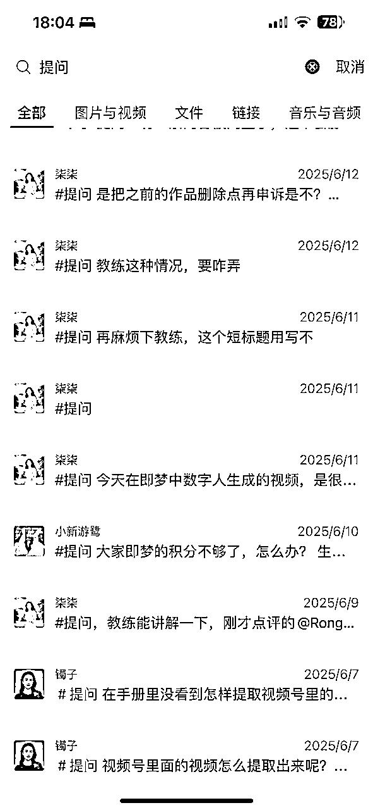
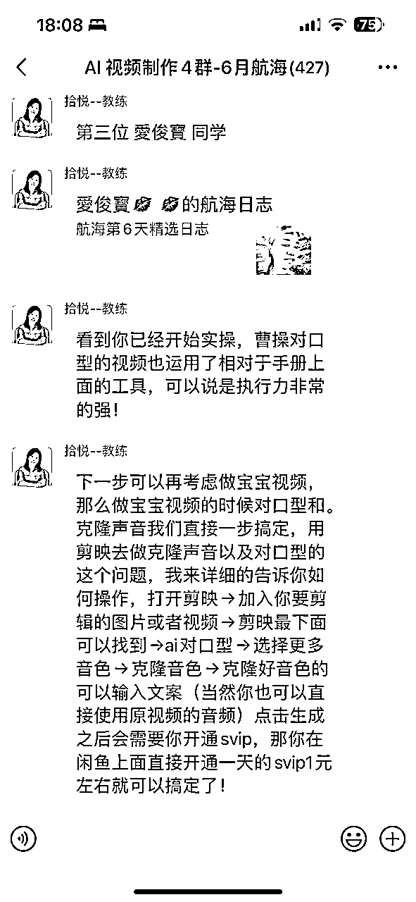
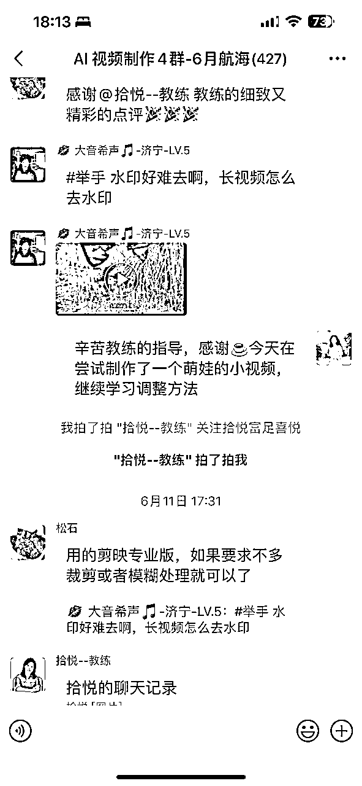
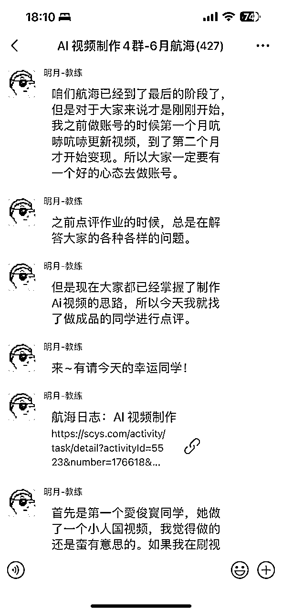
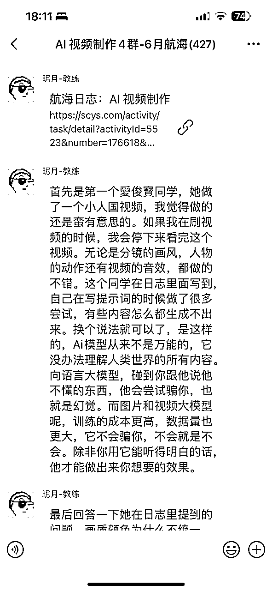
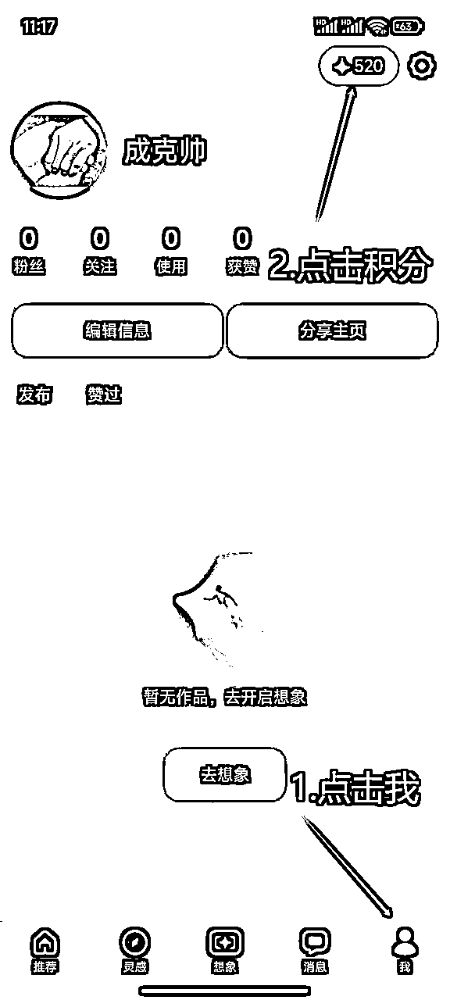
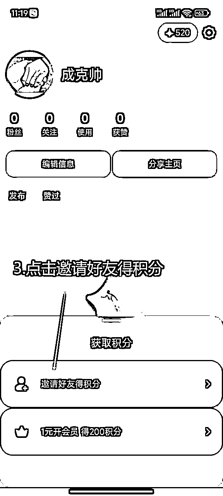
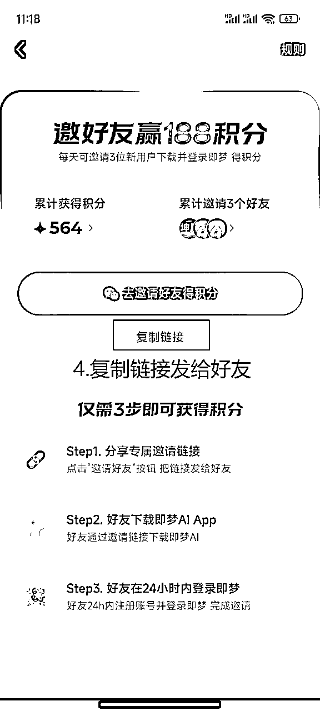
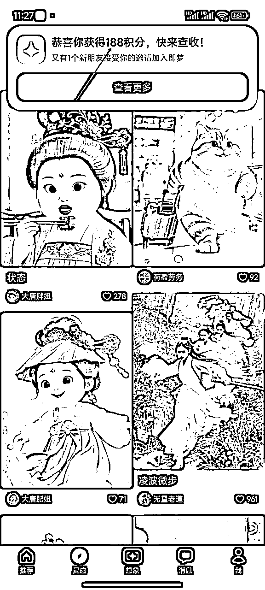
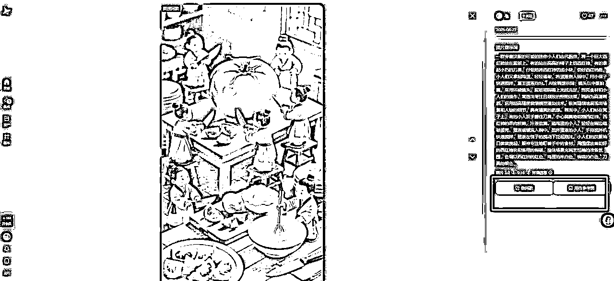

# 零基础小白首航🚢吐到怀疑人生‼️竟意外收获这些…值了

> 来源：[https://v0vixbto3t.feishu.cn/docx/NqxTdZIS9o5YT4xTteHcucWlnUb](https://v0vixbto3t.feishu.cn/docx/NqxTdZIS9o5YT4xTteHcucWlnUb)

# 一，自我介绍

大家好，我是柒柒，来自河南洛阳，是一位纯小白的宝妈，在今年418的时候，在我不知情的情况下，我队友悄悄的给我报了名。

很多圈友都是自己报名学习，而我，是队友突然塞给我张报名表：走，带你去看另一片天！

两个人的成长，就是要互相托举，去够更高处的月亮。

特别感谢志愿者骄阳和领队松石的鼓励和邀请，这是我第一次参加航海，让我有勇气在这里做一个自我感受的分享。

# 二，参加航海时候遇到问题时

圈友们的分享都是实操干货内容，能给大家提供各种价值，作为新手，我就不在这里献丑了，就来说下我第一次参加航海的真实感受吧。

在此之前，没有接触过AI视频，连剪映的简单操作都不会。其实最开始学的时候，感觉看不懂，完全听不懂在说什么，但是在实操的过程中，就突然发现，自己的某个卡点在某一天就解决了。

在跟着航海手册学习的途中，我每天都会看手册，其实最开始的时候，作为新手就像是大海捞针，没有方向。于是就在群里提问问题，我都不知道我提问了多少次。

很多时候不是问题太难，而是不敢下苦功夫，一旦全心扑上去，办法总比困难多。

哈哈，前行的过程中，最害怕的就是认真，一旦认真投入，你会发现问题总是能被解决。

如果还是不知道怎么去做，我就看手册看手册，跟着手册一步步的往下走，不管每天多忙，我都会看手册。

有想放弃的时候吗？有，就在我做不出来视频的时候，我想算了算了，不搞了。但是内心又不甘心，又重头开始做，先完成再完美嘛，这样安慰自己。

在某一天，自己的日志被教练点评了，有一种被看见被鼓励的感觉，你看只要认真去学习，总是有收获的。

第一次被教练看见的时候，心里乐开了花，不是问题无解，而是没下够功夫，真正全力以赴，总能柳暗花明。

于是，就这样每天不管再忙，都会去看手册，遇到很低级的问题，就会去翻看之前的航海项目，去疯狂的补习基础知识，同时也会在群里举手提问，教练们看到后也会耐心的解答。

群里也有看其他圈友提出来的问题，会出现一种情况，自己听不懂在说什么，就会去问豆包。还会去哔哩哔哩中看视频讲解，总之，遇到问题的时候会多方面去找解决办法，更会在航海日志中提出自己的问题，教练点评的时候，如果看到日志了，对于自己来说，又多了一种解决办法。

种子埋进土里时看不见光，但不扎根就永远开不了花。种子不会因为暂时的黑暗而放弃扎根，我们也不能因为前路未明就半途而废。当根系足够强大，终有一天，嫩芽会冲破泥土，迎接属于它的阳光，而我们也将在积累与沉淀后，绽放属于自己的精彩。

# 三，遇到不同的问题

比如说，即梦的积分不够，会看优秀的圈友发出来获得积分的不同办法，简直就是投喂到嘴里啊。

PS：图片是借用优秀圈友在学习群中截图的图片，操作方法一致，不得不夸，学习过程中有学习搭子是多么幸福的一件事，哈哈。

比如说，在视频不连贯的时候，在用即梦生成视频的时候，上传一个首帧和尾帧的动作，能解决想要的连贯性的问题。

再比如说，我们在制作视频的时候，有时候会突然出现抽风的画面，凭空捏造的场景。刚开始制作的时候，我也不懂，通过不断学习，才发现是因为给的提示词不够精准，想让这个场景出现在这个镜头里，必须得先让它出现在画面里。

再比如说，在写提示词的时候，不能同质化，要在对标的基础上去修改。可是最开始的时候，是理解了，但是根本不知道如何去修改呀。

后来在制作时候的时候，看到即梦有同款，那我们想要什么样的视频，去搜索什么的样的图片，制作同款就好了，不仅节省时间，而且提示词也比我们想的要好的多。

再比如，让镜头中景➡️特写，或者➡️其他，这种自己不会的，看到群里有优秀的圈友分享时候，去提问得到解答后，自己去实操，就突然恍然大悟哎呀妈呀，原来是这样操作，瞬间就豁然开朗。

在制作视频的过程中，种种这样不同的问题有很多很多，就像是在升级打怪，解决一个问题又来一个问题，那又怎么样呢，有可能今天自己认为很难的一个问题，实在解决不了，绕过去也行啊，没必要死磕。可能在某一天的时候突然就悟道了。

爱迪生曾言：“任何问题都有解决的办法，无法可想的事是没有的。要是果真弄到了无法可想的地步，那也只能怨自己是笨蛋，是懒汉 。”

在实操过程中遇到的各种不同的问题有很多很多，问题的存在并非绝境，只要不向困难低头，积极开动脑筋，办法总比困难多 。

# 四，再说下通过学习，自己的心理感受

## 1.纸上得来终觉浅，绝知此事要躬行

知识像隔着玻璃的风景，看得清轮廓，却摸不透纹理。只有自己亲身去实践、去体验，去实操，弄脏手多次尝试，才知道自己的问题出在哪里。就像教练告诉你游泳的动作要领，你在岸上背得滚瓜烂熟，可一下水还是会呛水 。—— 因为没有亲身试过，永远不知道划水的力度、换气的节奏到底要怎么把握。

而这次学习制作视频也一样，即使把手册看的再熟练，就是不练习一样不会，都是一个孰能生巧的过程。

## 2.每个人的起点都不一样

每个人的起点都不一样，不要求自己与每个人比，只要今天的你比昨天的自己有进步就是最大的进步。

在学习的过程中，我们会泄气，或者在追赶中焦虑，看到有的人跑的快就会产生落差，就如荀子所言：“不积跬步，无以至千里；不积小流，无以成江海。”

优秀的人不是一上来就是这么优秀，只不过是之前知识力量的积累，在这一刻的爆发。所以不要因为他人的速度乱了自己的节奏，每一个 “今天比昨天好” 的瞬间，都是在靠近优秀的自己。

## 3.坚持学习，不断学习

人生本就是座永不结业的课堂。纯小白的我，起初连轨道分层都搞不懂， “关键帧” 就像外星术语。但每天都会花时间啃手册，来练习学习制作视频。在看抖音的时候，也会去刷各种对标视频。刷到AI视频制作的直播时，以前我会觉得这个东西好高级，学习后才发现，原来直播讲的都是浅层的，原来我学到了的东西比直播的还要多。

没来到生财以前，我可能看完直播，感觉那个老师好厉害，会像直播间里面那些人一样被诱惑，赶紧去下单。

## 4.总结

不禁感慨，来到生财，是我最对的决定。把 “我学不会” 改成 “我试试”，把 “差不多就行” 变成 “再精进一点”，坚持学习，终会让生命长出新的枝桠。

感谢在航海期间所有帮助我的领队，教练以及圈友们，谢谢你们。也感谢大家看到最后，听我的碎碎念，以上就是我从最初的小白到制作完整的视频的真实独白，通过这次航海学习，我才知道这个星球真的是宝藏之地，要学习的地方很多很多，虽然第一次没有做出来什么优秀成绩，但是来日方长，未来可期呀！

也祝愿各位圈友生财有术，多多发财！