# 充满回忆感的航海总结网页制作教程

> 来源：[https://fmu80oi2fx.feishu.cn/docx/OE0BdLyxboiLKGxa16JcfBy3n5d](https://fmu80oi2fx.feishu.cn/docx/OE0BdLyxboiLKGxa16JcfBy3n5d)

# 看效果

## 视频

## 原网页

*   https://web.orime.top/ai-report/ai-video-touch.html（请把电脑声音打开）

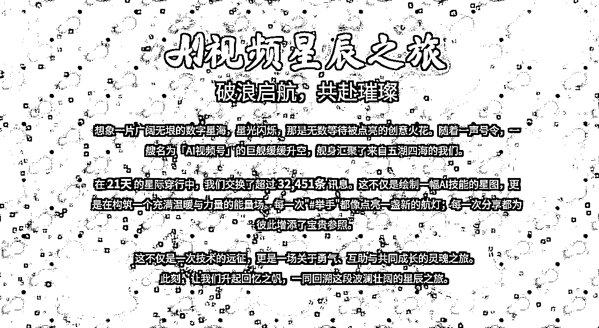

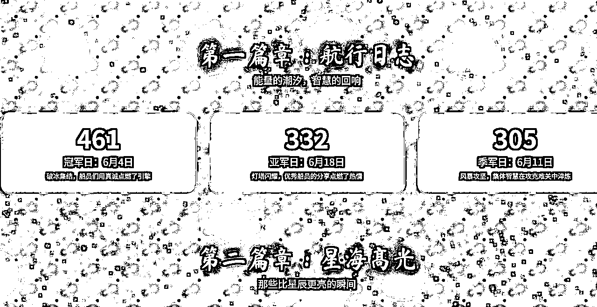

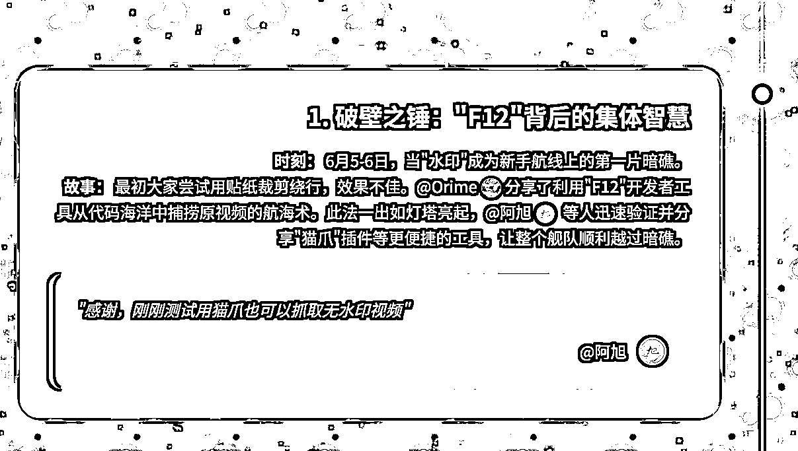

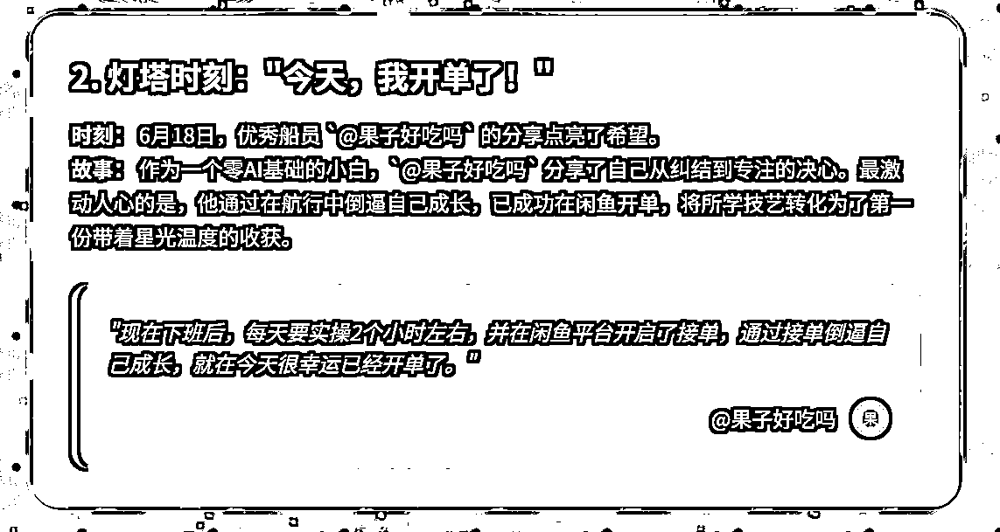

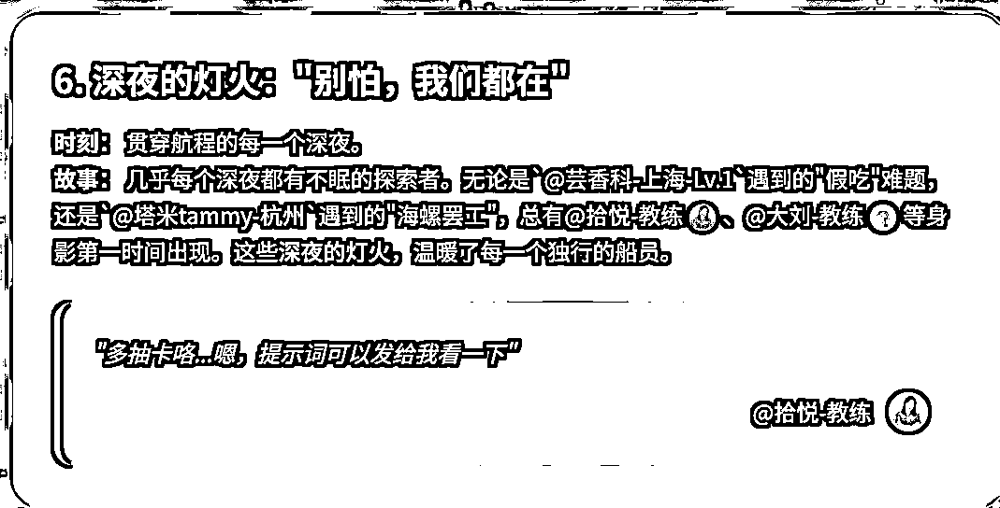

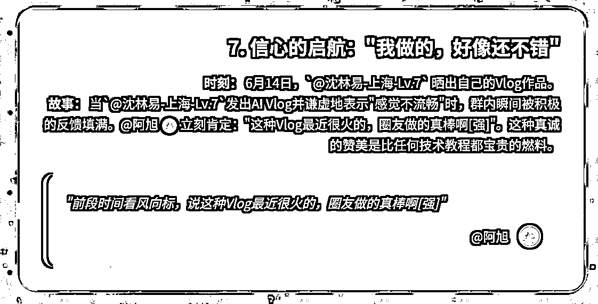

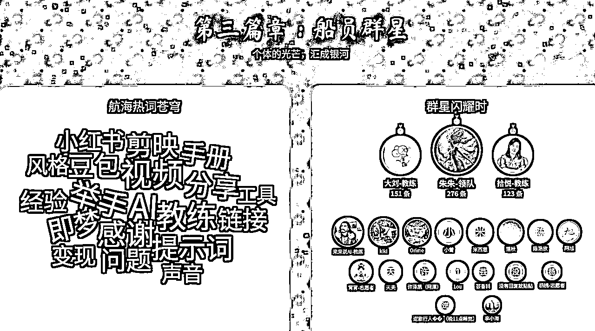

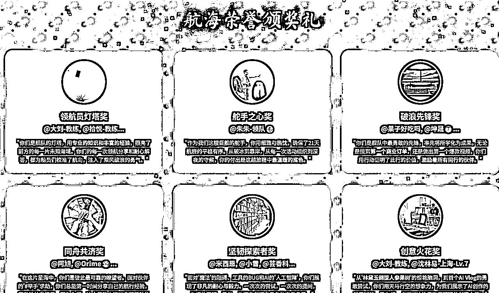

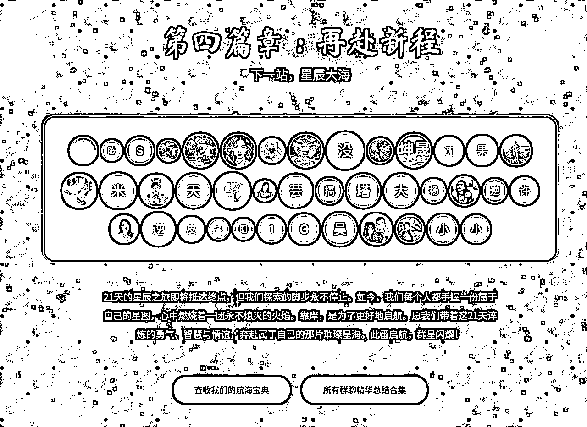

# 碎碎念

基于每天整理群聊精华（ ）的经验，在航海最后一天有圈友问我全部内容是否能被模型处理。

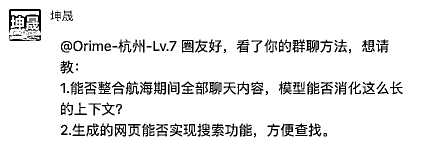

本着试验一下的结果我还真去获取了全部聊天记录

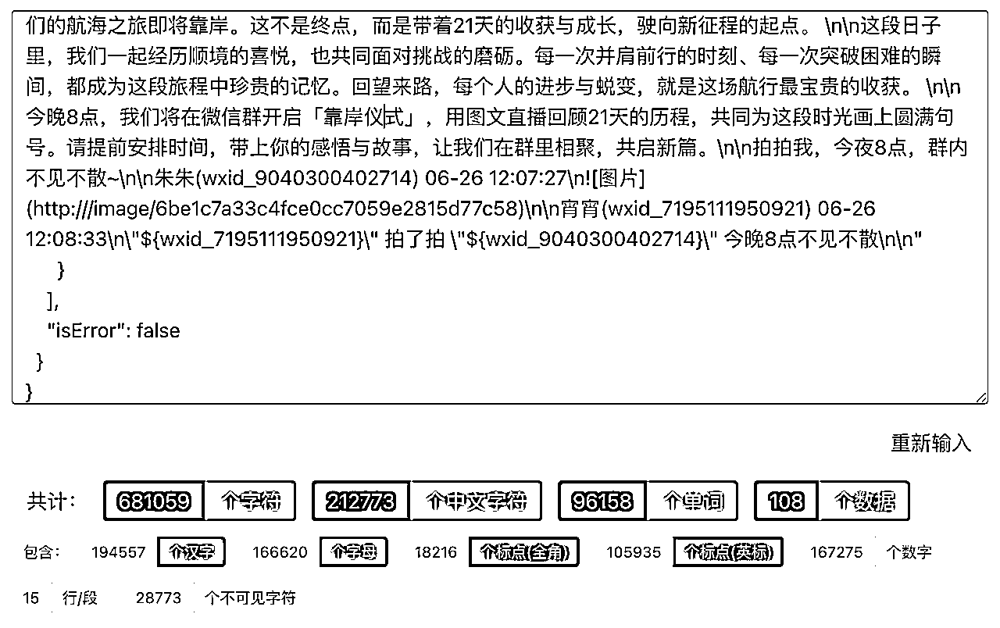

68 万个字符对于有100 万 token 的 Gemini2.5pro 来说轻轻松松，于是就有了上面的网页。

说实话，这个网页实现起来也并不复杂，也并没有多么别出心裁的设计，结果发到群里后，很意外地收到好多群友好评。

我想核心原因有以下两个原因：

1、文案内容比较令人动容

2、好听又应景的背景音乐

有领队鼓励我写成教程，其实实现原理和每日群聊精华总结一样，但抽卡抽到崩溃的提示词才是成败的关键，接下来手把手教学，制作航海21 天回顾版网页。

# 准备工作

## 流程

获取全部群聊记录——>制作结构化的 markdown 文档——>将 markdown 文档按照HTML模板制作成网页

## 工具

### 2.1 获取群聊记录：chatlog：

*   https://github.com/sjzar/chatlog

使用方法详见：

### 2.2 长上下文 AI 工具

*   推荐 Gemini 2.5 pro

*   Claude 系列

*   DeepSeek R1 0528

*   如果没有梯子，国内豆包 1.5pro 或者kimi 也可一试

# 实操环节

## chatlog 获取指定群聊所有聊天记录

这里默认本地已经可以流畅使用 chatlog，如果没准备好，请看

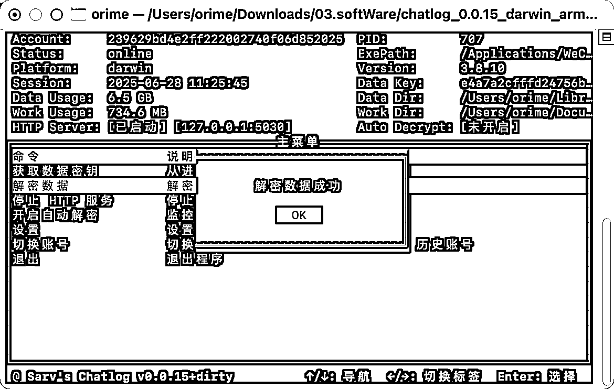

启动 chatlog 之后打开网页 http://127.0.0.1:5030/

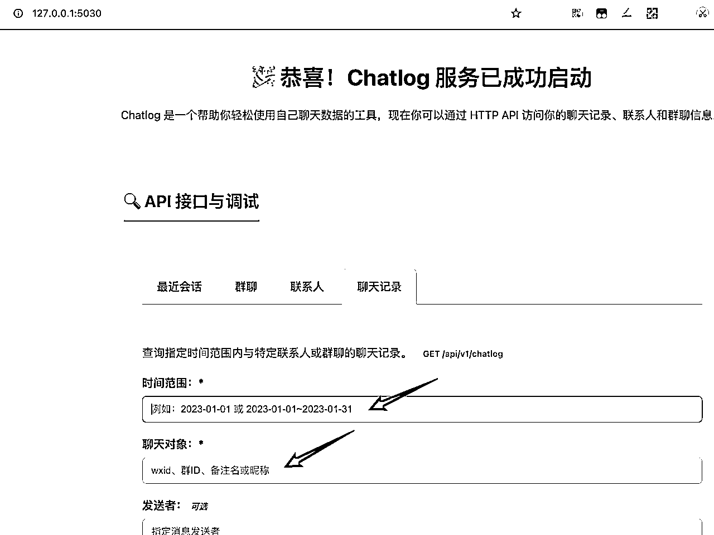

填写时间范围和聊天对象：

时间范围有格式要求，可直接复制：2025-06-01~2025-06-30

聊天对象，也就是群聊名称，务必完全对应，不能增减任何一个字符，比如：AI 视频制作6群-6月航海

按照下图方式去复制比较精准

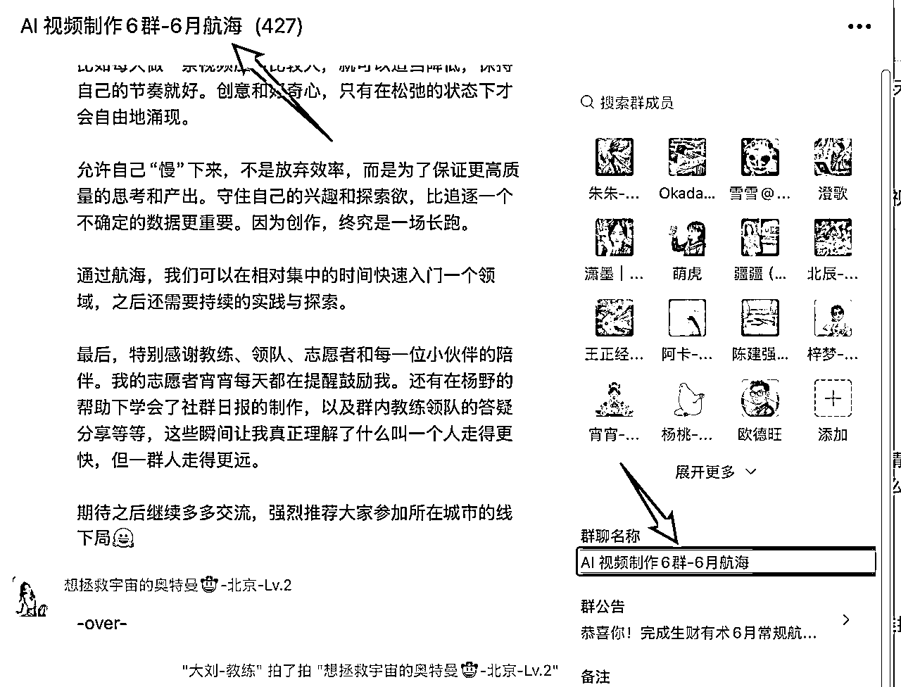

填好之后直接点击查询，如无意外会看到结果，同时滚动条会非常小，代表着内容非常多（六七十万字符）

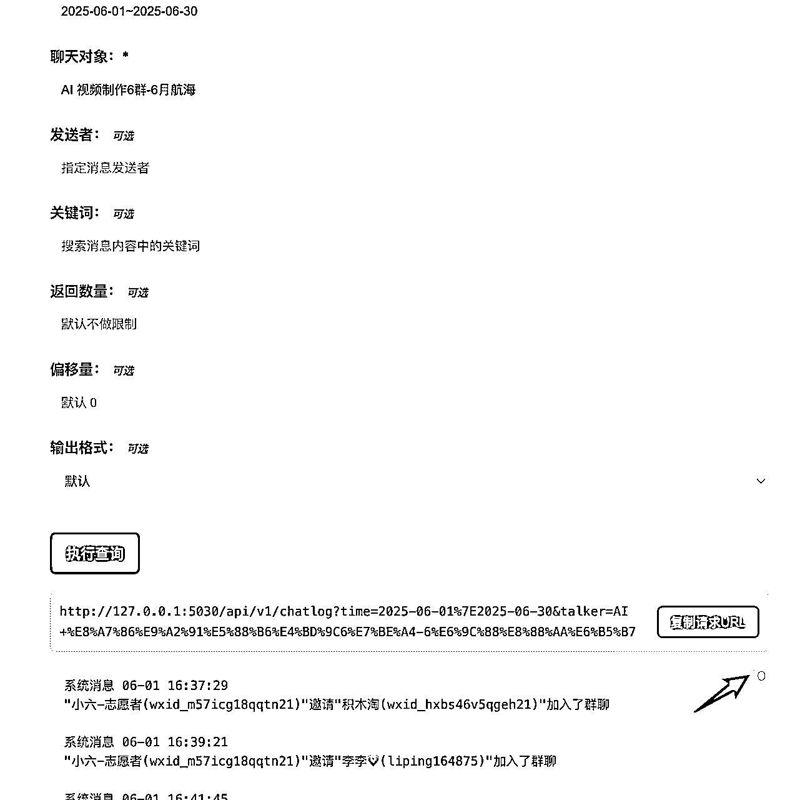

## Gemini 生成结构化文档

打开https://gemini.google.com/

注意左上角选择 2.5pro 而不是 2.5flash

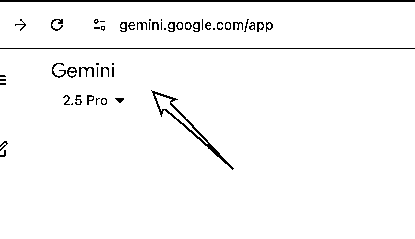

输入如下提示词+你的群聊记录：

```
**# 角色** 
 你是一位顶级的社群运营专家和富有情感洞察力的叙事文案作家。 

 **# 任务** 
 我将为你提供一份关于我们近期完成的社群活动的核心数据和关键事件记录。请你根据这些原始素材，为我们创作一篇结构完整、情感饱满、极具感染力的活动复盘报告。 

 **# 核心要求** 
 1\.  **创造性关联**：请使用“航海”、“星辰大海”、“船员”等与海洋相关的比喻。创造一套全新的、独一无二的、且贯穿全文的叙事体系。 
 2\.  **结构对齐**：请严格按照我下方提供的“报告生成结构”来组织内容，确保每个章节的功能和感觉都与范例对齐。 
 3\.  **情感升华**：不仅仅是复述事件，而是要挖掘事件背后的意义，提炼社群成员之间的情感连接和共同成长的价值。 
 4\.  **数据叙事**：将冰冷的数据（如消息数、活跃天数）包装在你的核心隐喻之下，赋予它们生命和故事。 

 --- 

 ### **报告生成结构 (请将你的原始数据填充至此)** 

 #### **第一部分：序章 - [在此处填入你的隐喻，如：攀登高峰，探索星辰大海，扬帆远航等]** 

 * **报告主标题**: `[你的社群/活动名]`: `[一句响亮、契合隐喻的口号]` 
 * **开篇引子**: 
     * **[视觉画面描述]**: 请构思一个契合核心隐喻的开场动画或视觉画面描述。 
         * *（例如：隐喻是“登山”，可以描述一块璞玉被不断雕琢成山峰的画面）* 
     * **[开篇寄语]**: 
         * 总时长：`[例如：28天]` 
         * 总互动量：`[例如：2800次]` 
         * 用一段诗意、富有哲理的语言，围绕你的**[新核心隐喻]**，开启整个故事。阐述这次活动的初衷，点明这不仅是一次技能学习，更是一次 `[例如：心灵的攀登、生命的共建]`。最后，邀请读者一同回顾这段旅程。 

 #### **第二部分：数据篇 - [在此处填入你的隐喻，如：攀登日志、成长纪事、建设蓝图等]** 

 * **[数据看板]**: 
     * **核心数据解读**: 
         * 总互动量：`[例如：2800条]` 
         * 请为这个数字赋予一个契合隐喻的诗意解读。 
     * **能量高峰日 Top 3**: 
         * **冠军日**: `[日期]`, `[消息数量]`, 描述当天发生了什么核心事件，并用隐喻包装它。 (例如：“思想的雪崩”、“灵感的井喷”) 
         * **亚军日**: `[日期]`, `[消息数量]`, 简述事件。 
         * **季军日**: `[日期]`, `[消息数量]`, 简述事件。 
     * **[图表数据]**: 
         * **时间轴数据**: `[提供日期列表]` 
         * **活跃度数据**: `[提供与日期对应的数值列表]` 
         * **关键节点解读**: 列出几个关键日期及其当天讨论的核心主题/关键词。 
             * `[日期1]`: `[关键词1, 关键词2]` 
             * `[日期2]`: `[关键词3, 关键词4]` 
             * ... 

 #### **第三部分：故事篇 - [在此处填入你的隐喻，如：峰顶瞬间、航行灯塔，小行星基地等]** 

 * **[高光故事集]**: 挑选 5-10 个最能体现社群精神的瞬间。每个故事都遵循以下结构： 
     * **故事标题**: 一个响亮、凝练的标题，契合隐喻。 
     * **时刻**: `[日期]`，`[事件背景]`。 
     * **故事**: 详细生动地讲述事件的起因、经过、结果，并点出关键人物 (`@[人物昵称]`)。 
     * **关键引言**: 引用 1-2 句当时最真实、最有力、最能反映核心思想的发言。 
     * **请确保故事类型多样化**: 
         * 一个**技术/业务难题**被集体智慧攻克的时刻。 
         * 一个**情感脆弱**被集体温暖疗愈的时刻。 
         * 一个成员取得**商业/个人突破**并真诚分享的时刻。 
         * 一个**榜样/成功案例**激励所有人的时刻。 
         * 一个关于**思维/方法论**的深刻讨论。 
         * 一个成员**无私奉献/创造工具**并分享的时刻。 
         * 一个集体**面对焦虑/挑战**并找到解决方案的时刻。 

 #### **第四部分：成就篇 - [在此处填入你的隐喻，如：登顶英雄榜、群芳谱、城市之光等]** 

 * **[关键词云]**: 提供社群讨论的高频词及其词频。`[例如：{'学习': 150, '感谢': 120, 'AI': 200, ...}]` 
 * **[活跃贡献榜]**: 列出 Top 20 的最活跃成员及其贡献值（如发言数）。 
     * `[昵称1]`: `[数值]` 
     * `[昵称2]`: `[数值]` 
     * ... 
 * **[荣誉颁奖礼]**: 
     * **设计奖项**: 请围绕你的**[新核心隐喻]**，设计 6-8 个独特的奖项名称。 
         * *（例如：隐喻是“登山”，可以设立“开路先锋奖”、“领路人奖”、“坚韧攀登者奖”、“营地共建奖”等）* 
     * **颁发奖项**: 
         * **奖项一：`[你设计的奖项名]`** 
             * **获奖人**: `@[人物或团队昵称]` 
             * **获奖理由**: 写一段真诚、具体、感人、契合奖项名的颁奖词，精准概括其贡献。 
         * **奖项二：`[你设计的奖项名]`** 
             * ... (以此类推) 

 #### **第五部分：尾声 - [在此处填入你的隐喻，如：再踏征途、静待花开、远方地平线等]** 

 * **[集体形象]**: 构思一个契合隐喻的“毕业大合照”画面。 
     * *（例如：隐喻是“登山”，可以描述所有人的头像汇成一座雄伟的山峰）* 
 * **[结语与展望]**: 用一段充满力量和希望的文字，为本次活动画上句号。总结收获，并展望未来，鼓励大家将这次活动中获得的精神和力量带到新的旅程中。使用一句契合隐喻的、响亮的口号作为结尾。 
 * **[资源沉淀]**: 
 提炼汇总群聊中发过的有价值的资料链接
     * 按钮1标题：`[例如：查收我们的航海宝典]`，链接：`[你的资料链接]` 
     * 按钮2标题：`[例如：探索我们的装备仓库]`，链接：`[你的工具库链接]` 
     * ...
### 注意
1、这是生财有术航海群，尽量使用航海等概念 
 2、所有数据务必精准，比如消息条数，每个人发的消息的条数，每个人的真实发言内容，每日消息总量，精确到个位数，给我好好数，数清楚，不要给我杜撰数字 
 3、这是一个严肃的群聊总结报告，不能杜撰不存在的人名，没说过的话，不存在的互动，错误的数据等，所有展现务必真实 
 4、整体格调要温馨、感动、互帮互助、充满力量，给人鼓励，感动，回味悠长，尤其是高光故事集部分，数量在 8 到 10 个，请务必挑选出来最感动，最有力量的部分 
 5、荣誉颁奖礼这里同一个奖项可以有多人 
 6、第四部分：成就篇这里，数据展示参考以下，但内容要务必真实 
 7、航海热词云范例如下（注意，以下仅是范例供参考，请根据各个不同群主题及聊天记录实际内容做提取，切勿照搬），示例如下： 
 一个由"AI(200+)、视频(180+)、教练(150+)、举手(140+)、感谢(120+)、分享(100+)、提示词(90+)、即梦(85+)、豆包(80+)、剪映(75+)、问题(70+)、手册(65+)、链接(60+)、经验(50+)、小红书(45+)、变现(40+)、风格(35+)、声音(30+)、工具(25+)"等高频词汇组成的动态词云图。词语大小由出现频率决定，鼠标悬停时显示具体次数。 
 最活跃船员榜 Top 20 & 星光墙： 
 榜单（仅Top 3展示发言数）： 
 @朱朱-领队 (276条) 
 @大刘-教练 (151条) 
 @拾悦-教练 (123条) 
 @来来说AI-教练 
 @kiki 
 @我 
 @小雪 
 @米西恩 
 @落秋 
 @陈浩放 
 @阿旭 
 @宵宵-志愿者 
 @天夫 
 @许泽凯（阿澤） 
 @1ou 
 @芸香科 
 @没有回复就贴贴 
 @杨桃-志愿者 
 @逆旅行人🎹 （晚11点睡觉） 
 @李小海 
 星光墙数据准备（用于制作词云，不在页面直接展示）： 
 {'朱朱-领队': 276, '大刘-教练': 151, '拾悦-教练': 123, '来来说AI-教练': 99, 'kiki': 95, '我': 88, '小雪': 85, '米西恩': 82, '落秋': 79, '陈浩放': 75, '阿旭': 73, '宵宵-志愿者': 70, '天夫': 68, '许泽凯（阿澤）': 65, '1ou': 63, '芸香科': 60, '没有回复就贴贴': 58, '杨桃-志愿者': 55, '逆旅行人🎹 （晚11点睡觉）': 52, '李小海': 50} 

 8、以上要你生成的内容，是我是要为制作 HTML 做的数据准备，这个措辞上该怎么修改，你懂我意思吧

 待处理的群聊内容：

```

注意：群聊记录内容太大，直接粘贴影响性能，也可以写入到 txt 文件中，在 AI 聊天对话框中发送

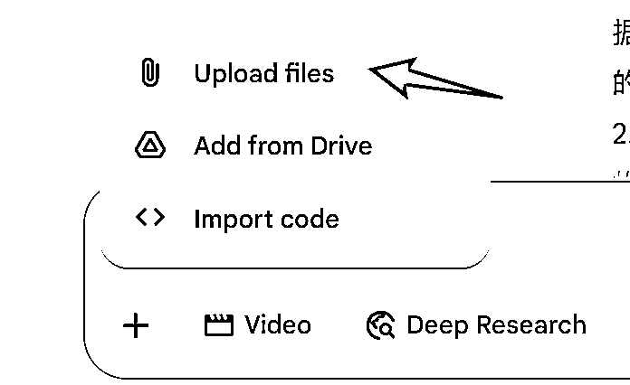

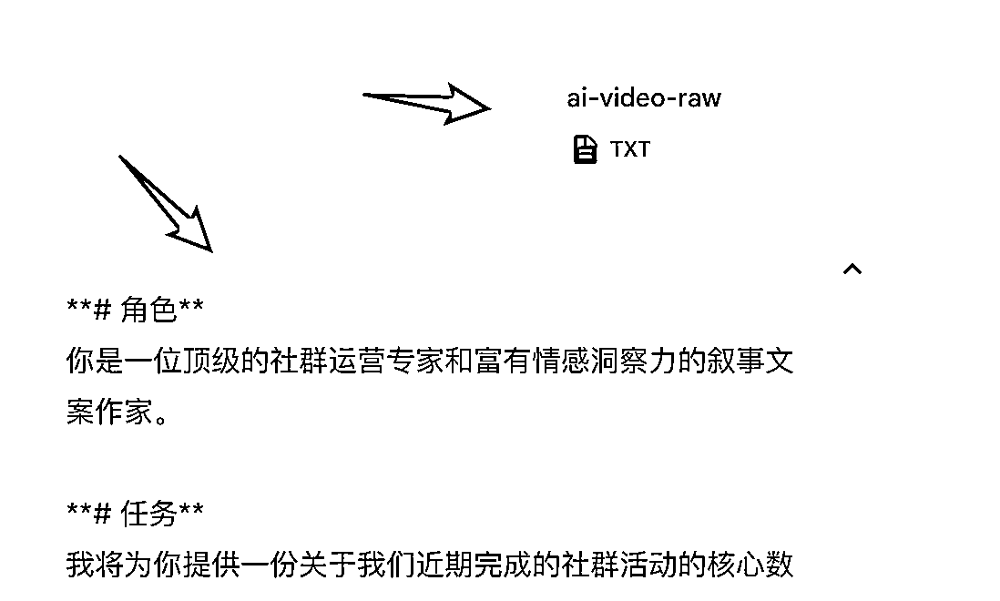

亲测和直接在对话框内粘贴聊天记录文本效果一样，没有太明显差别

稍等片刻就可以生成结构化文档了

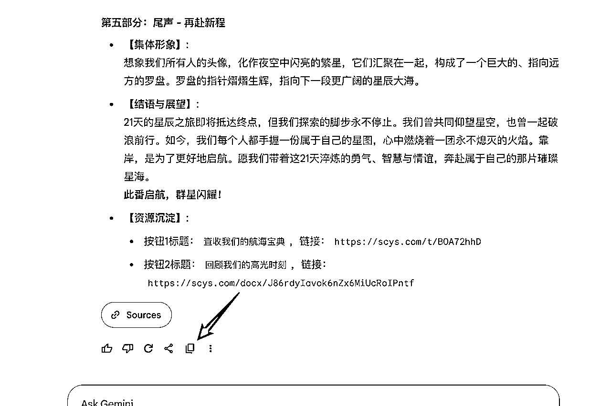

## 制作 HTML 网页

获取结构化文档之后，开始制作 HTML 网页

此时可以在当前聊天窗口内进行，也可以另开一个Tab 栏开一个新的聊天对话窗口

然后复制如下提示词，复制之前要先处理好背景音乐和头像链接

1.  背景音乐嵌入到网页中有两种方式，一种是在你部署 HTML 页面的地方上传音乐片段；另一种是获取网络上可直接访问的音频播放链接，比如在网易云中获取指定音乐的链接（这个又可以再写一篇教程了）有编程经验的可照着下图探索下，

1.  给个示例可直接使用：房东的猫-至此：http://m801.music.126.net/20250628135014/bfb3915e3c9669c188664eabc993c8dd/jdymusic/obj/wo3DlMOGwrbDjj7DisKw/28482233878/dd38/7497/fdf6/3775c330c02ef2a8a5ea40f097a15af2.mp3?vuutv=hGATS48oOO2gbLLjl86dXciJysILJ9duK/HzWYc+z0fGxG55WwMfIXayIDUxlhtMY+sKTaX1T2sr+tasWEtCZnnomUYoo9sTlolQ2+PH/0Oes9/T224Z/SdHlYydb2BR5fxYGgHqDMN0fhpTHt9CZw==

1.  自定义音乐替换 URL 位置在：

<http://m801.music.126.net/20250628135014/bfb3915e3c9669c188664eabc993c8dd/jdymusic/obj/wo3DlMOGwrbDjj7DisKw/28482233878/dd38/7497/fdf6/3775c330c02ef2a8a5ea40f097a15af2.mp3?vuutv=hGATS48oOO2gbLLjl86dXciJysILJ9duK/HzWYc+z0fGxG55WwMfIXayIDUxlhtMY+sKTaX1T2sr+tasWEtCZnnomUYoo9sTlolQ2+PH/0Oes9/T224Z/SdHlYydb2BR5fxYGgHqDMN0fhpTHt9CZw==>

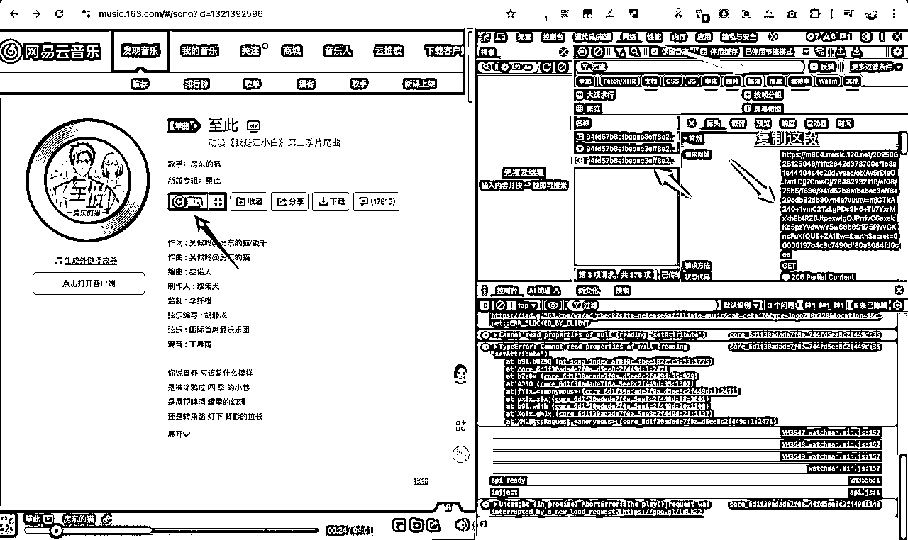

1.  群成员头像图片获取

1.  直接上传到你部署 HTML 网页的仓库中，要求 AI 引用

1.  使用图床上传好之后把URL 发给 AI 让 AI 直接填上

注意：背景音乐设置和头像设置比较繁琐，可以不做；背景音乐可以用我上面给的链接；头像如果不做的话，那么网页头像区域会变成这样花花绿绿的首字符但没有真人头像

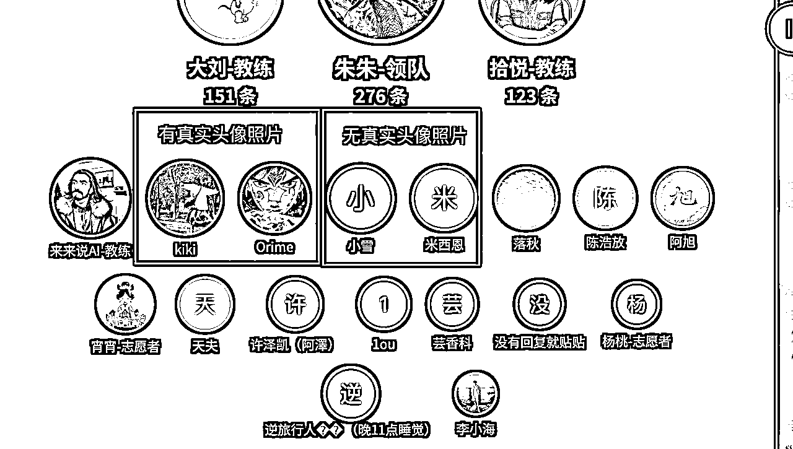

接下来根据模板和数据制作 HTML 页面，复制以下提示词粘贴到对话框（如果有群成员真实头像可以加上），后面拼接上上一步骤获取的结构化文本，如果使用文件上传的方式，告诉 AI 数据引用你上传的 txt 文件：

```
你是一名卓越的HTML制作大师，擅长参考以后的 HTML 文件，根据新的内容重新制作，保持风格不变，内容完全采用新提供的数据而不是原始 HTML 文件，我想让你参考的 HTML 文件是： 

    AI视频星辰之旅 | 破浪启航，共赴璀璨

 注意：
 1、你要做的工作就是替换内容而已，千万不要给我保留原 HTML 文件中的任何数据，人名，对话等内容，只是借了个结构，被填充的，音乐可以留着 
 2、真人头像是（这里请填写群成员的真实头像图片地址，可以用图床），如果未提供真人头像，请使用ui-avatars方案，注意要花花绿绿的，不能单调

 我提供的新的数据为：
```

务必勾选 canvas

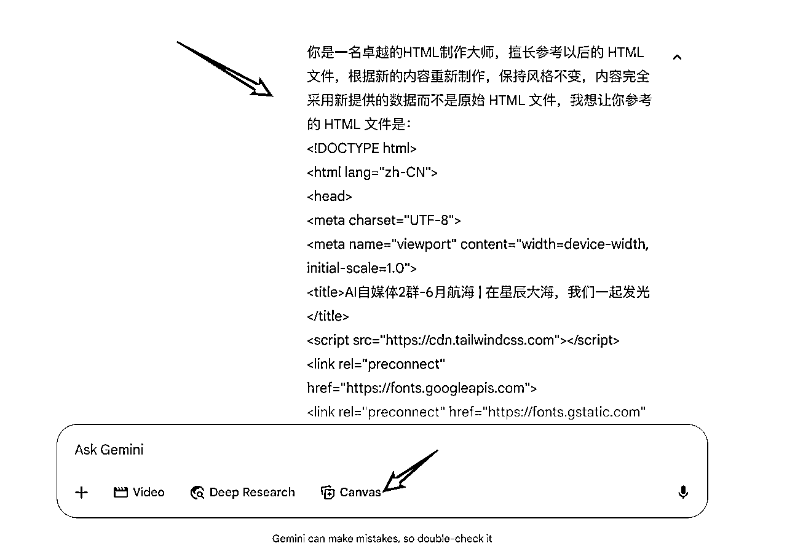

稍等片刻就可以看到结果啦

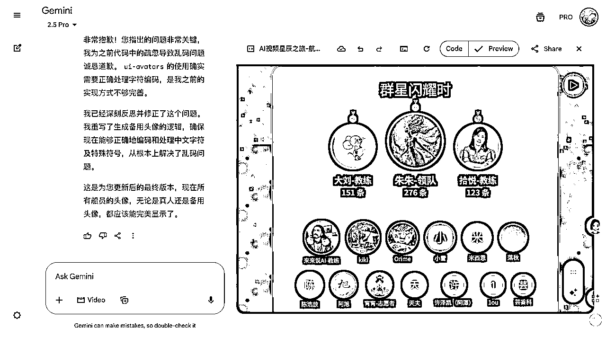

由于参考的模板，有一丁点小概率会造成数据偏差，比如引用了原模板的内容，所以提示词中格外强调不要引用原 HTML 文件数据，如果偏差了，要告诉 AI 修复好

有些模板缺失或者冗余，也可以和 AI 沟通调整。

# 更多效果

已部署：https://web.orime.top/ai-report/ai-self-media-touch.html

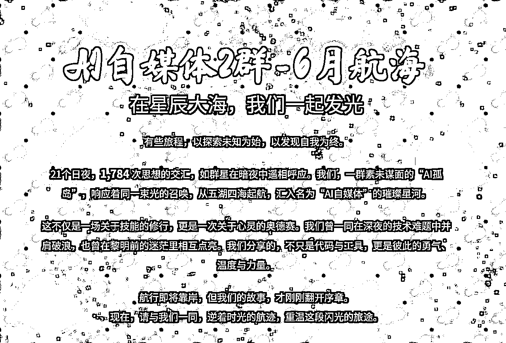