# 【生财技能】一线实战经验，总结AI写作项目的100个核心问题和解决方案

> 来源：[https://kqubish8iq0.feishu.cn/docx/OkJ2dudNLoKNEMxpHhLcP9SJnwf](https://kqubish8iq0.feishu.cn/docx/OkJ2dudNLoKNEMxpHhLcP9SJnwf)

见字如面，大家好，我是龙珠圈友飞掌柜，AI大模型专家，长期深耕AI赛道，特别是AI写作项目（AI代写方向），也荣幸担任6月航海的AI赋能写作项目的航海教练。

再次感谢生财平台能给这次机会，我在写作文章、交付客户、答疑圈友的过程中，又总结摸索出了很多经验，爆肝5个晚上，总结分享如下，旨在帮助大家打通方向选择、工具应用、实操交付、引流转化、平台选择等方面的诸多卡点。

提示下如何用好这份《AI写作项目的80个核心问题和解决方案的指南》：

1、明确思路。比如第一部分的核心经验，梳理了小白到高手，如何做好写手端、流量端，以及搭建团队的问题。我一直相信生财航海家大会线下分享过的一句话“认知越清晰，执行越坚定”，很多时候是我们没想明白怎么做，才会浪费时间。

2、高效搜索。我之所以按照六大篇章梳理，就是想帮助伙伴根据问题快速定位解决方案，比如你当前阶段主要在工具应用和实操交付，那就重点看第三章和第四章。

3、灵活应用。我交付客户订单的时候，会发现很多小变化，比如过去用claude生成文章好，但是最近他老抽风，不如deepseek的表现。比如我擅长闲鱼引流，但有伙伴就是不喜欢，觉得淘宝量大。比如写文我喜欢输出一整段再修改，有人就想分段生成更准确。没有对错，无论是工具选择还是接单交付，大家结合本文给出的解决方案灵活变通，只要满足客户最终要求即可。

ok，全文阅读大约20分钟，核心内容如下：

# 一、核心经验篇（五大问题+解决方案）

## 一）小白成长为高手，AI代写分为几个阶段？

【结论】做AI写作项目（代写方向），掌柜认为新手到高手，再到大佬的阶段，要经历四大阶段：

第一阶段，做写手端。交付单子赚钱，这个过程主要锻炼针对不同文章的写作交付能力，各类AI工具的应用能力。

第二阶段，做写手端+流量端。既有一手流量也有二手流量。一手流量先考虑闲鱼，再考虑其他平台；二手流量主要是各类接单群。

第三阶段，做流量端。只需要搞流量，让别人交付，自己抽佣金，此时已经具备了写手端，所以重点放在如何拓展更多流量上。

第四阶段，做平台端。搭建写手团队，流量团队，自己赚中间抽成，此时要考虑成立工作室或者公司，因为这样才有主体去融资放大，也比较好走资本化的路线，同时未来体量上来了，还能去投资其他团队，有分红收益。

以上四个阶段，是通过体力->脑力->资本赚钱的逐步改变，也是思维认知->人脉积累->资源盘活的过程！

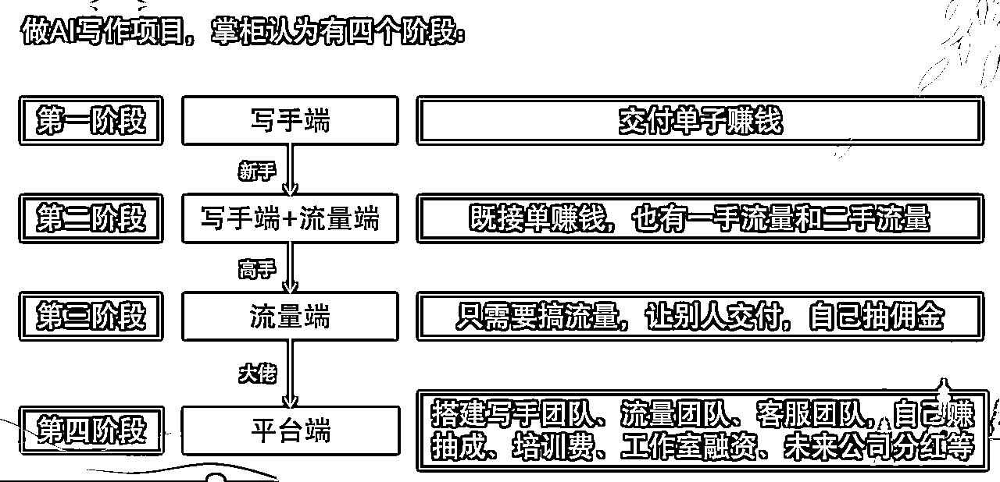

## 二）如何快速上手AI代写项目，有哪些注意事项？

【结论】新手少踩坑，快速上手AI写作项目（代写方向），可以参考如下步骤：

1）熟练应用AI工具：明白针对不同类型的文章，分别用什么AI工具最快？要求对于工具熟练应用的能力。

2）干中学：必须接单练手，才能知道细节卡点有哪些？很多问题不是想出来的，而是实操过程中碰到的。要求提升对于文章交付能力。

3）不会了就去学：接单过程中明白哪些单子不会写，再去和高手学习。意思就是学一点就去实操一点，不会了再去学，这样目的性强。要求锻炼“目标式学习能力”（这是我自创的词汇，哈哈哈，因为在我看来，现在很多伙伴的现象是，学了很多，感觉很强，但是变现很少，或者不达预期）。

4、学完了继续接：学会后逐渐上手难度更大的单子，逐渐提升ROI。要么是提升客单价，要么是同样的时间接到更多的单子。此时积累的是高客单的议价能力（注意，将来必须走这条路线，否则你会越干越累）。

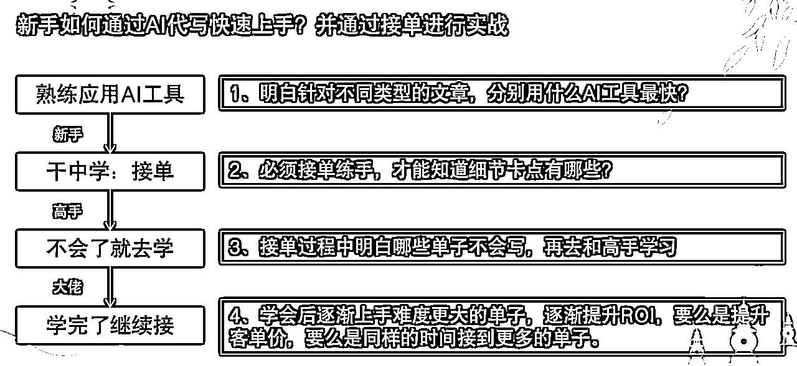

## 三）想做好AI代写项目的写手端，路径是怎样的？

【结论】按照我的经验，总结为四大阶段：

1）自己交付：自己写文章锻炼交付能力，帮助客户解决问题。想要带别人，得自己先全部流程跑通，这个过程会带来直接收入，毕竟写完一单、交付一单，就会赚钱一单。

2）帮助别人：我发现很多伙伴喜欢看SOP教程，于是我针对产品、流量、运营、团队等卡点总结出对应教程，总结经验写出帖子，帮助别人打通AI代写卡点。这个过程你会收获影响力～

3）知识付费：如果你自己想做知识型博主，除了自己写单子外，还可以通过社群、小鹅通、训练营、知识星球等收费，本质上是知识付费变现，这个过程会带来直接收入。

4、搭建团队：此时你基本上0-1已经跑通，需要1-N放大，可以考虑搭建写手端团队，未来有单子一起共创放大，也就是有了流量之后，自己有团队可以写单交付。

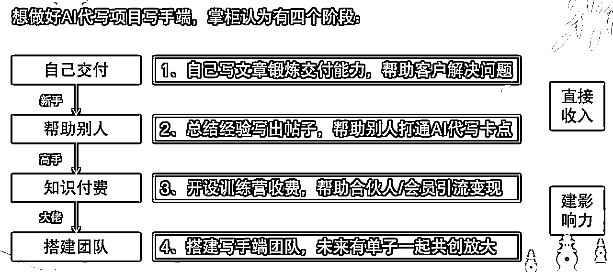

## 四）想做好AI代写项目的流量端，路径是怎样的？

【结论】按照我的经验，总结为四大阶段：

1）二手流量：自己上淘宝应聘，做小黑奴，从二手单做起。直接问客服是否招募写手，对方会让你拍下5-20块左右的订单，下单后好评全返，并把你拉到写手群。二手流量接单群一般包括QQ群、企业微信群、微信群三种，还有少量钉钉群。

2）一手流量：自己开闲鱼/淘宝/拼多多/小红书账号，进行一手单引流。此时主要是为了多赚钱，也就是自己引流+自己写单子交付，但肯定很累，花费时间也比较多。

3）一手+二手流量：一方面是自己多开账号，或者带着团队开账号，矩阵化的方式是为了放大一手流量，但时间精力肯定不够。另一方面是和更多流量端合作，也就是有很多接单群是和别人一起建的，大家各自单子可能不多，但往群里都发，就显得多了。

4、多渠道流量：搭建流量端团队，多矩阵账号玩法，工作室或者公司模式合作，部分还可能涉及到投流打法。此时也不再是流量端、写手端。可能还会拆分为流量端+运营端+客服端+写手端，是否拆分看工作量。

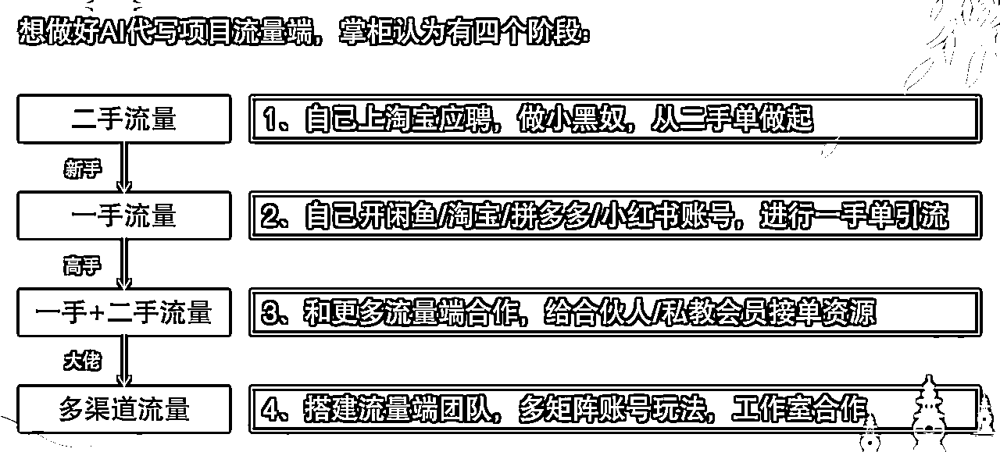

## 五）如何搭建写手团队和流量团队？

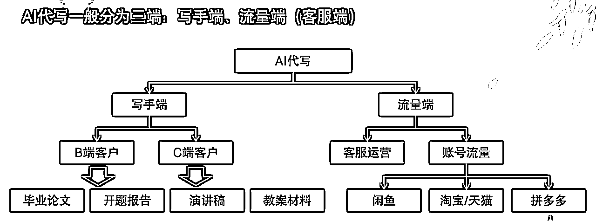

1）搭建写手端团队的“三步法”：

首先，自己从写手端做起，能够给B端和C端客户交付单子，积累案例和经验后，可以教学别人。

其次，教学别人的时候，有能力出教程、出训练营、出标准化课程，让别人感受到系统性学习。

最后，面对学员在代写过程中的任何问题，要能够给予指导，不一定所有问题都能解决，但是多数得给出解决方案，证明你的专业水平。

2）搭建流量端团队的“三步法”：

首先，自己要学会闲鱼开店、上架商品，教学你的团队如何自己引流，一手流量是能够提升咱们利润的。

其次，要和其他流量端团队合作，给到自己的写手团队单子，加入接单群能够上手实操项目。

最后，其他公域平台的引流放大技巧，私域引流的宣传物料，都得有，方便团队随时取用。

3）搭建团队的过程中，给对应岗位找到最合适的人，有点像老板招聘，通过相处判断每个人的能力擅长点。

比如有人比较内向，适合写手，不适合流量；

有人喜欢引流，不喜欢交付，那就不要写单子；

有人喜欢操盘，但是两边都不想做，那就负责好运营的工作。

所有的角色分工明确，团队配合才能越来越好。

所以，大家也可以思考下，在AI代写项目的过程中，你承担的角色是什么？如何配合团队其他人？优势互补，未来才有可能放大。

# 二、方向选择篇（20个问题+解决方案）

## 本部分主要解决项目选择、方向判断、接单对比等问题，选择对了，才能更省力。

1、AI写作项目领域很大，我看很多人做的方向也不一样，我该怎么选择？目前感觉AI公众号爆文项目、AI代写项目等都能做

【解决方案】

1）很多人做AI写作项目，同时开展多个，比如AI公众号爆文项目、AI代写项目、AI视频代做等项目都有，如果是新手阶段，几个同时做没问题，但将来避免自己将来精力顾不过来，一定要有所侧重，比如重点进攻某一类，这样也能把壁垒建设得更高。

2）同时梳理清楚几个项目的不同赚钱逻辑，比如AI公众号爆文项目赚的是流量主的钱，那么就要研究如何提升阅读量。AI代写项目赚的是交付的钱，那么就要研究如何放大写手端、流量端团队。

2、可以把商业计划书PPT的写作作为AI代写的方向吗？怎么进入这个领域？

【解决方案】

1）商业计划书相比较其他PPT，难度确实大，内容也相对较丰富。并且主要是B端客户，所以肯定有门槛。

2）建议先从其他PPT接单开始练习，比如工组汇报PPT、晋升汇报PPT、年终总结PPT、答辩总结PPT、教案PPT等。积累信心的同时，拿到一些小结果。

3）当然，每一单的情况不太相同，哪怕都是商业计划书，每个客户都有个性化的诉求，此时要锻炼自身谈单沟通、梳理需求、交付制作的综合能力，持续加油！

3、自己的流量自己转化自己交付，赚钱肯定多，但感觉很难，咋上手呢？

【解决方案】

1）自己的流量自己转化自己交付，这个听着很爽，但现实往往是时间精力不够用，所以后期可以用合伙的方式，看如何将产品、流量、运营、转化等环节外包，或者搭建团队分工。

2）比如搭建写手团队，你如果有单子，让其他人交付，自己赚佣金。

3）比如搭建流量团队、客服团队，左手对接写手端，右手服务客户端，中间抽佣金。

4、过程每一步肯定有难度，逐步克服。

4、和客户谈价格，一开始就让我报价，如何进行？以及客服发在接单群的消息，感觉需求不细致，也报不出来呀！

【解决方案】

客户上来就要报价，咱们拍脑门直接给肯定不合适，可以按照这个流程优化：

第一，先问清楚订单的详细需求，需求越细，报价越精准。对客户对我们自己都好。

第二，再问截止时间，如果是急单，报价可以高点。

第三，侧面问客户身份，从而判断付费意愿和付费能力。

第四，客户只要不主动提，我们先别主动给工作量（比如试着做1-2页，先出500字等）， 毕竟押金还没收。

5、我已经跑通了0-1，如何1-N放大呢？

【解决方案】

1）学会筛选高客单：接单10单以上，其实就有了感觉，知道什么是高客单，不是绝对值，而是性价比，也就是ROI，100块如果需求简单，也可以是高客单。1000块如果需要一个月才能做完，那就是低客单。

2）放大方向盘点：写手端搭建团队、流量端搭建团队、平台端拓展等方法均可以放大，也不是只做流量端+写手端外包这一条路哈。甚至未来你开工作室做大，说不定两方面都得考虑，毕竟也得有自己稳定的写手。

6、我想在闲鱼上架“阅读计划”产品，发现用AI可以快速产出，交付不重，这样可行不？

【解决方案】

1）用ai辅助生成了一份阅读计划，能不能作为闲鱼上架产品？当然是可以的，但我这里要提醒，这类需求市场较少，客户也许自己就能用AI生成，并且门槛相对低，所以做好上架后无人问津的准备。

2）从做产品的视角，有时候我们需要换位思考，也就是客户要什么我们再上架对应产品，而不是自己想当然，否则容易陷入“自嗨”的陷阱。

7、我做单，三五十的感觉很累，但几百上千的又不会，怎么解决这个问题？

【解决方案】

1）低转高原则：一开始价格低不要紧，练手后就得积累经验，然后逐渐接客单价更高的，放弃低客单的，或者用转包方式解决。

2）干中学原则：过程中不会了就继续学习，学会了就继续接单，干中学就是这样循环往复，之后咱们就能有能力搞定有门槛的单子了。

8、针对报价谈单环节，如何进行优化？

【解决方案】

第一是要看客户身份，同样的单子，给学生党、职场人、国企客户、MBA高管，报价是有浮动的。比如LW，针对学生党报价低，针对MBA高管报价高。

第二是确定好工作边界，比如一般是先看需求再报价，如果对方要求确定能写了才给细节，那就报价中间价格，有了需求评估后觉得不合适，说明理由，多数客户是能接受的，因为他也想保证质量。

9、遇到工作量分配不恰当，如何调整？

【解决方案】

1）作为初级写手，一开始流量+运营+交付可能同时都做，也就是自己开闲鱼引流，自己和客户沟通，自己写出文章。

2）后期要思考，如何通过合作方式，搭建团队方式，让自己相对轻松，专攻某一块。比如自己专门负责流量，让其他伙伴接单交付。或者专门负责交付，和流量端合作，作为长期稳定写手。

10、做AI代写的过程中，如何摆正心态？

【解决方案】

1）心态问题：

确实有不少伙伴耐不下心研究如何实操，比如提示词怎么写，智能体如何调教，总想着别人直接给到现成的，给了现成的决定不满意也懒得改，总想着让别人改。

2）解决方案：

其实很多时候，我们面对客户的个性化诉求，提示词都是不一样的，可能也得通过好几轮对话，才能得到想要的结果。有些中间的环节避免不了，那就挨个攻克。

3）逐步迭代：

AI工具的应用，项目实操的细节，和客户沟通的谈判，AI写作项目之所以有吸引力，就是因为锻炼的是综合技能！

11）用AI给同事写半年总结，收费吧不好意思？不收费吧感觉自己亏了，咋办？

【解决方案】

1）同事之间不好收费，那就不收，欠人情。有时候人情往往比收费还贵，毕竟一份半年总结估计也就最多一两百，将来你遇到某件事需要同事帮忙，可能不止这个价。

2）主业工作还是很重要的，提醒几个点：

第一是老板其实不喜欢员工用AI写工作总结，在我们看来提高了效率，但有的老板觉得没有认真写。

第二是AI写总结是否用公开的大模型，得看你们公司的要求，有些公司对于把内部数据发给AI会有数据安全问题。

3）至于接单赚钱，可以副业先搞起来，外部接单变现哈。

13）在AI代写项目过程中，如何更好地践行“工具+实操”？

【解决方案】

1）随着时间的积累，咱们的目标是：掌握多种解决方法，面对客户诉求，知道哪一种性价比最高；或者学到新方法，知道旧的哪里不足，果断舍弃。

2）这不仅是思维层面的提升，更是对自己过往习惯的纠正，很多时候我们形成的固化模式，容易让自己在实操的时候受限，比如Ai对话时候的提示词，AI结构生成后的拼凑等。当然这并不是一蹴而就的，持续优化就好啦～

14、对于新手，现在刚开始学习AI写作，是直接开始去接单练习，还是熟练后再去接单？感觉没有经验的时候，和店铺聊天也没有底气

【解决方案】

1）干中学，可以一边学习，一边接单，如果发现客户要求不能满足，说明交付能力有待提高，那就抓紧学习，学一段时间了，就得通过接单检验。

2）和店铺聊天大胆一点，最坏的结果，无非是这一单咱们不挣钱，其他没啥损失。

15、我擅长写提示词，但不适合写文章，有没有单子是专门找提示词的？

【解决方案】

1）觉得自己非常适合专攻提示词，可以走prompt定制化这个道路，尝试接单这方面的，遇到不错的B端客户，变现也不少。

2）当然，掌柜也建议，不要只会写提示词，写文章单子更多，对咱们变现放大也有帮助。

16、我用AI润色自己写的小说，这样适合第三方平台投稿吗？

【解决方案】

1）适合，只要对方编辑认可就行，我就投稿过，虽然稿费不多～

2）目前很多小说都是AI写的，有些甚至还很明显，但观众可能不在乎是不是AI，只要不是太过即可，重点在于看完之后爽。

17、加了很多写手群，里面发很多文档，是不是也会占用很多空间？接单群客单价一般是怎样的？我应该选择在哪里接单？

【解决方案】

1）文档只要不下载，空间不会占用多少。

2）接单群一般包括QQ群、企业微信群、微信群、钉钉群，客单价得看具体订单，LW、开题报告等比较贵，演讲稿、发言稿比较便宜。

3）如果是新手，先别挑，在哪里接单不重要，能交付赚到钱才重要。相对而言，微信群比其他写手佣金多一点，其次是企业微信群、QQ群。

18、以后用Ai大模型做AI写作项目的话，是不是买苹果电脑好一点？

【解决方案】

1）不一定，电脑配置只是基础，学会应用更加关键，重点在于接单经验沉淀+变现。

2）当然，我也观察到，AI工具的调用，对于参数配置的要求确实增加不少，比如豆包AI有桌面端，如果配置太低，多软件同时运行，电脑容易卡死。

3）总结，配置这东西，按需来，丰俭由人。

19、AI写作领域很广，越做越发现，细分方向的项目很多，哪个都挺耗时间，我该如何选择？

【解决方案】

1）筛选项目的原则永远是ROI，也就是看哪个项目对自己的性价比最高，就留下，其他的可以通过合作或者分包的方式解决。

2）有舍才有得，毕竟时间精力有限，资源投入有限。

20、新手成长一定要按照四个阶段进行吗？

【解决方案】

1）我梳理写手端、流量端、写手端+流量端、平台端四个阶段，是按照我的经验，因为我是从写手做起的。但并不适合所有人。

2）如果你本身就是做流量出身，完全可以从流量视角切入，无论是CPS还是投流。

3）如果你做客服出身，擅长搭建客服团队，那就从客服视角切入。

综上，根据个人最擅长的点去执行，也许能更快拿到结果！

# 三、工具应用篇（20个问题+解决方案）

## 本部分主要解决交付客户文章时，用什么工具能够快速解决，成本最低等问题。

1、请问英文博客文章想翻译成中文的话，哪一个大模型比较适合呢？我尝试了GPT和Gemini，好像效果都不是很好。提示词需要什么样的关键词呢？

【解决方案】

1）可以尝试WPS自带的翻译功能，效果还不错，也有免费页数可以用。

2）可以用专业的翻译第三方工具，比如网易有道、谷歌翻译。

3）对于AI大模型工具翻译，国外工具普遍比国内工具好一点。

2、目前AI平台实在太多了（选择太多也变成了一种烦恼哈哈，最后不知道选哪个了），感觉各种AI平台其实能力大差不差（好像国外首推Gpt ，国内首推DeepSeek），是这样不？

【解决方案】

1）当然是可以的，没有哪个AI工具大包大揽，什么文章都能写，面对不同的需求，能力有差异。

2）用户使用习惯不同，导致对于不同AI工具的感觉不同，比如有人觉得deepseek结构化太严重，生成幻觉多，有人觉得它是国内最强。

3）综上，选择面对交付效果最好的即可，自己感觉最舒服的即可。

3、经常用多个AI工具或者多次生成同样的内容，最终定稿的时候该如何选择？有时候看着这个也行，那个也不错。这个环节也挺内耗的

【解决方案】

1）不要纠结，先选择其中一个，看客户是否满意，满意就结算钱，不满意就发另一个。

2）有时候咱们自己感觉写得不错，但是客户不满意，有时咱们觉得一般但是客户验收了，所以要以客户最终认可为标准。

4、Gpt要科学上网，没有体验过，而且Gpt好像是指令型（需要一步步引导），DeepSeek是推理型，是不是可以理解Deepseek其实还厉害点（把自己想要的结果表达清晰，他就能干活了），不知道这样理解对不对？

【解决方案】

1）Gpt要科学上网，是因为它是国外的工具。

2）Gpt好像是指令型，但也是生成式AI，DeepSeek是推理型，但可以不用深度思考，就推理很少了。

3）面对不同交付文章的类型，两者的能力有所差异，写文章可能Gpt综合交付好一点，但是对于国内用户的语言习惯，DeepSeek更好点，得区分场景。

5、接单之后，感觉不知道怎么写提示词，能够比较快地得到想要的文章， 有什么快速写的方法吗？

【解决方案】

针对如何写提示词更容易得到想要的文案，其实很多提示词也需不需要我们选，可以参考如下网站，像这样的工具，已经有不少成熟案例了，我们接到客户需求后，通过关键词快速定位某类提示词，修改后发给AI大模型，效率会更高。

【AI+提示词工具汇总】

1.  AI Short：https://www.aishort.top/

1.  explainthis（ChatGPT 指令大全）：https://www.explainthis.io/zh-hans/chatgpt

1.  Prompt prot：https://promptport.ai/

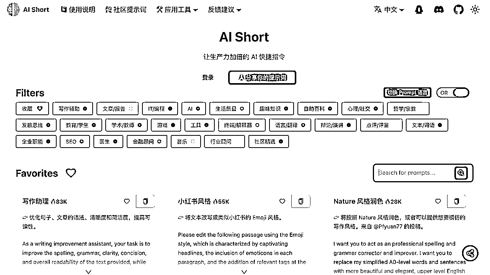

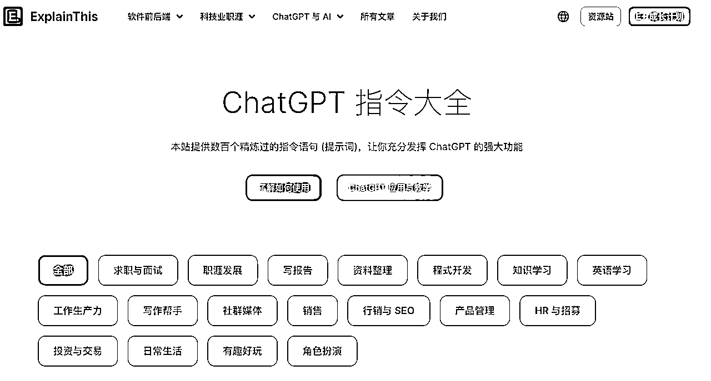

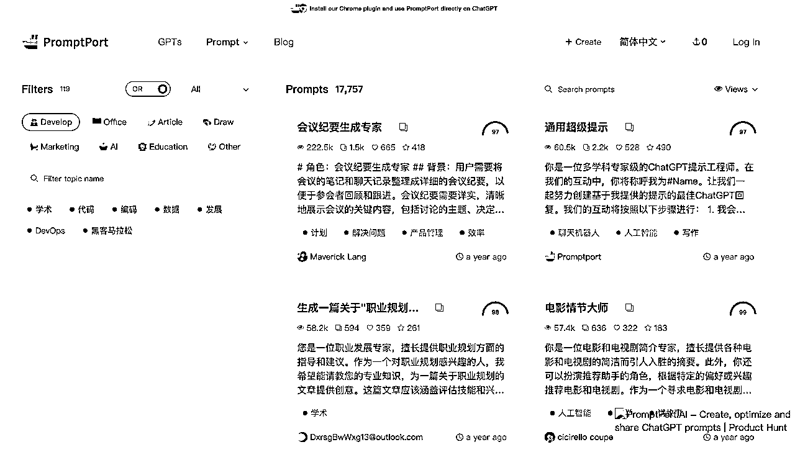

6、写提示词是不是特别复杂？感觉写不好太容易浪费对话时间，半天得不到想要的，容易放弃。用什么AI工具能减少浪费时间？

【解决方案】

1）不要把提示词想的特别复杂，给角色、给风格、给要求，就是咱们常见的写提示词的方法，做项目的时候熟练应用就好～

2）在提示词的打磨阶段不要花费太长时间，不做具体单子的话，可能长久没有动力，提示词也可以有更快的方法学习，比如上面我提到的几个网站，希望能帮到大家。

7、有没有哪个AI工具可以直接扔b站，公众号链接等给它，然后ai自己获取内容的？然后我分析之后再做自己的AI写作项目。

【解决方案】

纳米AI可以做到，支持公众号批量链接导入，以及B站内容分析。

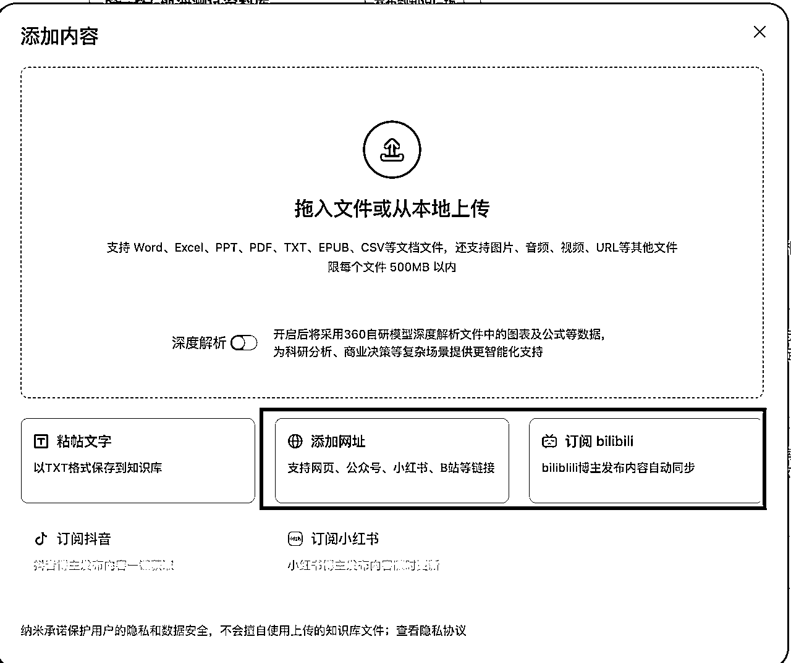

8、有没有用AI写过体制内或者央国企某一专业报告的模版？如何快速找到？

【解决方案】

1）当然可以，体制内或者央国企的专业报告模板，可以有很多途径。

2）比如我常用的就是wps的稻壳模板，搜索关键词查找即可，如下图，当然市面上的其他工具也可以。

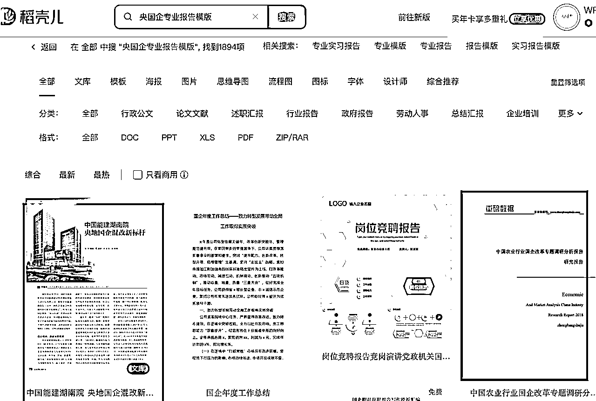

9、我想把对标公众号文章格式保留，投喂给AI。但是txt文档里完全不显示文章的格式了，比如原文字加粗，段落换行，这又怎么处理呢？

【解决方案】

1）公众号文章的格式不好参考，一般都是排版工具弄的，这部分建议手动，花费不了多长时间。

2）重点是内容让AI生成，包括大标题、小标题、正文，排版可以参考如下工具，但尽量还是手动，毕竟涉及到太细节的UI、UE等审美要求。

【AI+公众号排版工具汇总】

1.  小墨鹰编辑器：https://www.xmyeditor.com/

1.  96编辑器AI排版：https://bj.96weixin.com/ai/tool

1.  壹伴编辑器（一键排版功能）：https://yiban.io/

10、交付ppt代做的单子，一般会用什么工具？最好是质量比较高的那种，国内的，有没有推荐？

【解决方案】

可以参考如下【AI+PPT工具】，里面免费的很多，先用，不满足要求，再说付费的。

1.  Gamma：https://gamma.app/

1.  AiPPT：https://www.aippt.cn

1.  WPS AI（需要会员）

1.  讯飞智文：https://zhiwen.xfyun.cn/?utm_source=ai-bot.cn

1.  Kimi PPT助手：https://kimi.moonshot.cn/kimiplus/conpg18t7lagbbsfqksg

1.  清言PPT：https://chatglm.cn/main/gdetail/670e3c3e119b48fe5a851149?lang=zh

1.  博思AiPPT：https://pptgo.cn/app/my-file

1.  ChatPPT：https://chat-ppt.com/

1.  MindShow：https://www.mindshow.fun/#/login?inviteCode=6681211

1.  MindShow麦当秀：https://www.mindshow.vip/

1.  闪击：https://center.sankki.com/r/9a3m36ln5kmcv8

1.  Process ON：https://www.processon.com/

1.  iSlide(AI 一键设计 PPT)https://www.islide.cc

1.  爱设计：https://ppt.isheji.com/?code=ysslhaqllp&as=invite

11）请问使用什么工具才能让ai基于已有ppt(一页或多页)进行修改完善？目前用豆包或wps ppt工具，貌似都只能选择模板新生成大纲和ppt，不能做修改，即使是修改ai自己生成的ppt貌似也不行。还是还有没学到的工具方法？

【解决方案】

针对AI+PPT工具，部分是支持导入PPT后进行优化的，比如Gamma、AIPPT，见图。

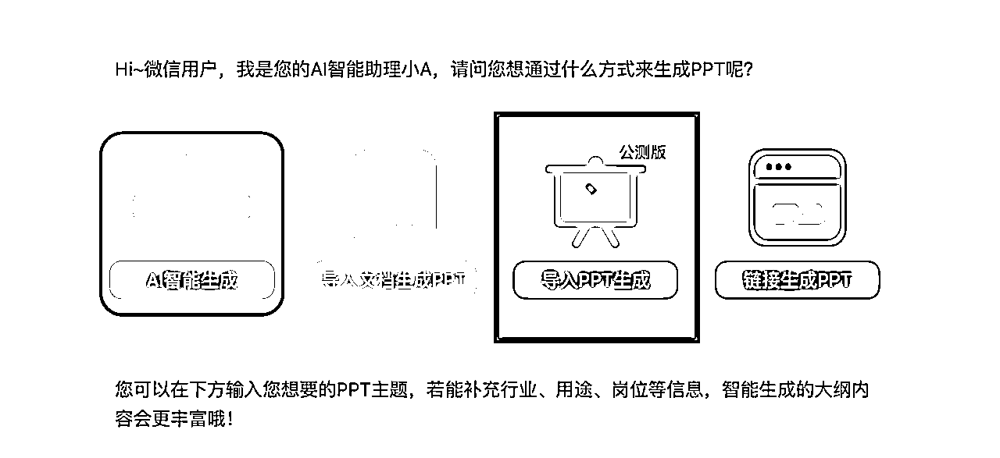

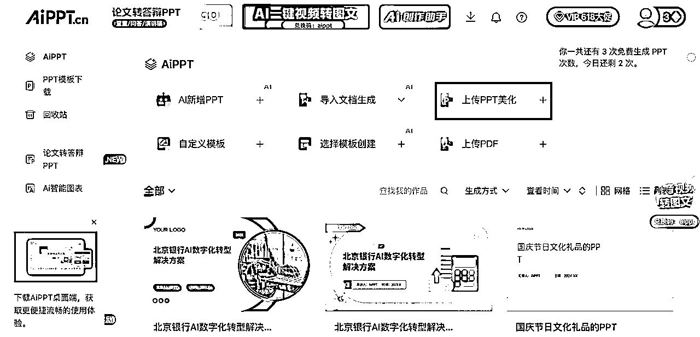

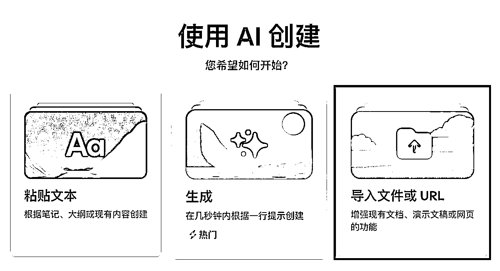

12）如果客户不指定查重网站，建议用哪个网站查AI重？

【解决方案】

1）如果客户不要求，用paperpass等免费网站，每天有1-2次免费机会。

2）其实检测结果，有人觉得准确，有人觉得不准。

3）如果客户不认可，那让客户提供具体网站要求，比如知网、万方的官网查重，肯定是最准确的。涉及到费用的话，一般是客户出，如果客户不愿意，咱们就包到报价当中。

13、不同AIPPT工具制作PPT的时候，效果差别如何？面对客户诉求，如何针对性解决？

【解决方案】

1）按照我自己的使用习惯，Gamma、AIPPT、WPS的灵犀还不错，可以满足内部讨论的需求，功能已经足够丰富，其他工具的效果，需要自行对比，毕竟每个人感受不同，并且面对客户的不同诉求，选择也有不同。

2）目前AIPPT的工具很多，面对自身工作的细节要求，和客户的不同诉求，咱们得知道该采用什么解决方案：

第一，客户只有主题方向，没有详细内容，没有模板，缺PPT

针对这种情况，由于客户还没有内容，需要先借助AI产出内容，发给客户确认，再进入到PPT环节。

第二，客户有主题方向，有详细内容，没有模板，缺PPT

针对这种情况，一般是找3-5个模板，发给客户确认，定好之后，开始AI产出PPT，或者手动做PPT。具体得看客户细节要求是否高，如果是内部讨论、头脑风暴的，上AI，如果是给领导汇报的，估计得人工。

第三，客户有主题方向，有详细内容，有模板，缺PPT

针对这种情况，一般聊清楚细节要求后，手动做比较快。我试过用AI，细节调整太多，反倒是降低了效率。

综上，接单的时候，这么方便怎么来。

14、公众号让AI排版大家一般都用什么工具？秀米就可以了吧 ？

【解决方案】

很多都可以，比如135编辑器、秀米、壹伴等，选择自己最顺手的就行。如果是想AI一键排版，我推荐一些，可以对比如下【AI+公众号排版工具】

1.  小墨鹰编辑器：https://www.xmyeditor.com/

1.  96编辑器AI排版：https://bj.96weixin.com/ai/tool

1.  壹伴编辑器（一键排版功能）：https://yiban.io/

15、用deepseek即使开启了新对话，也不停提示“当前对话已超出深度思考的最大长度限制，开启一个新对话继续思考吧~”请问这个是什么原因？

【解决方案】

还是前面问的太多了，可能需要等一会儿。比如我问就是正常的，如图：

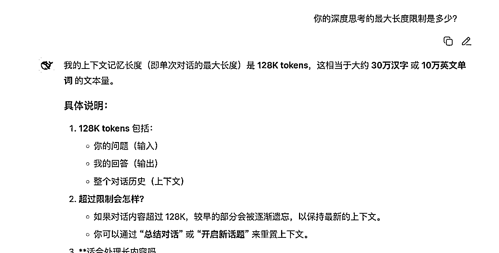

16、有没有PDF图片转换Word的（图片转格式）工具？

【解决方案】

WPS本身自带的功能就可以，可以PDF转word，可以PDF转图片，图片转PDF等。此外，其他很多工具也都可以，比如迅捷PDF等，多搜一下，免费的基本够用了，暂时不用开付费的。

17、针对不同文章，是不是使用不同的工具比较好？

【解决方案】

1）在工具层面，我们确实需要根据不同订单，来判断哪个工具生成最快最准确。

2）常见的是，针对长篇文章，用橙篇AI、豆包AI、讯飞星火等比较好。针对PPT，用Gamma、AIPPT比较好。针对小红书爆款标题+文案，用AI智能体批量化比较好。

18、客户需求是，针对抖音的【讲述项目制作的脚本及规划】，这个怎么使用AI工具实现？

【解决方案】

针对【使用AI工具讲述项目制作的脚本及规划】这个需求，理论上是可以的，分几个步骤实现：

第一，先找到对标账号，扒一下脚本文案，最好是3-5篇。

第二，发给chatGPT或者deepseek，让其学习，模仿生成。

第三，按照AI给出的IP设计策划内容制作分镜头，如果是不出镜的，那就整理素材；如果需要出镜的，那就口播分享配合实操演示。

制作这样的视频确实很不容易，但打造IP就是要真实感，更容易涨粉引流，过程中再逐步迭代吧。

19、有人知道B站视频如何快速将视频转成文字吗？B站视频口播文案提取要用什么软件，有推荐吗？

【解决方案】

1）B站本身就有AI总结功能，有文字版本，见图。

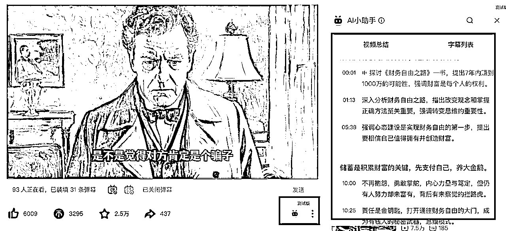

2）飞书的多维表格支持B站文案的一件提取，使用字段捷径即可，见图。

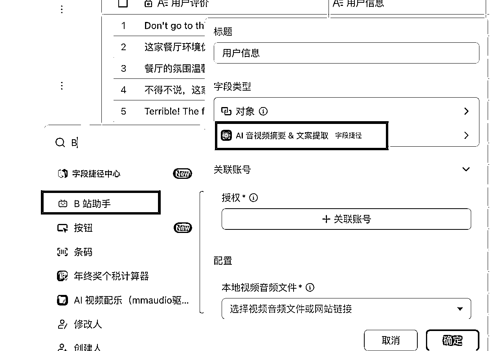

3）顺便说下，很多视频也会在其他平台播放，比如抖音、tiktok、小红书等，也可以尝试用字段捷径提取。

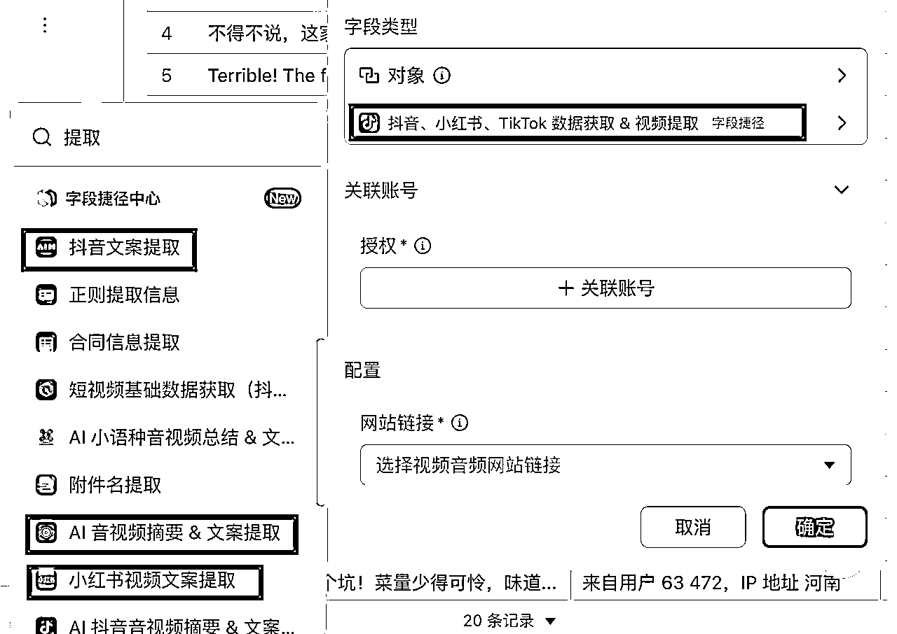

4）get笔记、飞书妙记、通义听悟等支持导入音频或者视频，进行内容提取。

20、交付客户的时候，比如写“发言稿”，可以同一套提示词发给不同AI大模型工具，看哪个好吗？

【解决方案】

1）同一套提示词发给不同的AI大模型，得到的结果不同，这很正常，相互对比选择其一，或者综合几个的结果，给到客户，都是可以的。

2）交付方面，以客户认可为准，比如针对“发言稿”这种主观判断较重的担子，掌柜提醒，有些客户要求不是很严格，只要能满足大概需求即可，有些客户就很吹毛求疵，所以也得看人下菜碟。

3）技巧方面，下次可以尝试下智能体，在coze上搜索“发言稿”，有很多其他创作者已经配置好的智能体，减少我们测试提示词的时间，放在对内容的审核上。

这里我推荐一些智能体工具，好帮助咱们提升效率！

【AI+智能体工具汇总】

1.  coze：https://www.coze.cn/store/agent

1.  文心一言：https://yiyan.baidu.com/agent-square

1.  智谱清言：https://chatglm.cn/main/toolsCenter?lang=zh

1.  讯飞星火：https://xinghuo.xfyun.cn/desk

1.  kimi：https://kimi.moonshot.cn/kimiplus-square

# 四、实操交付篇（30个问题+解决方案）

## 本部分主要解决如何写各类文章的问题，以及AI写作过程中的诸多细节操作卡点。

1、我让AI写一篇字数三四千的文章，我是让AI先生成初稿，再逐段修改好，还是让AI一段段生成，再去整合好？

【解决方案】

两个方案都是可以的，重点关注：

1）如果分段生成，拼到一起，前后是否连贯。

2）如果整段生成，要求4000字，提示词要写5000字，留出手动修改的时间。

2、在用chatGPT4.0写方案时，因为字数限制分成好几段内容，但想修改前面部分里面的细节时，他会经常忘记前面的内容 ；或者在想修改后面内容，提及到前面内容时，它已记不起来了，有什么方法解决吗？

【解决方案】

上下文不连贯是很正常的现象，不只是chatGPT，其他工具也一样，解决方法有两种：

1）在提问的时候尽可能给到前面的信息，这样有背景，不会乱回答。

2）生成初稿的时候，可以先整段生成，然后针对每一段进行修改，这样上下文有连贯性。

3、写提示词的时候，一定要用之前学过的角色扮演法、任务拆解法等吗？感觉现在随便说下大模型也能理解

【解决方案】

1）用角色扮演法、任务拆解法进行实战，是非常好的方法，至于用哪个就得看具体客户需求。做单子多了我们自然会有经验，用哪种方法完成最快。

2）现在AI大模型对话，对提示词的门槛降低了，是因为AI大模型本身能力的升级，但并不意味着随便说，比如配置AI写作智能体的时候，专业的提示词依然可以减少我们多轮对话的时间。

4、写长文的时，比如LW，开题报告、工作汇报等，是分开写拼到一起好，还是直接一整个生成好？

【解决方案】

针对文章是否要分开生成，然后拼到一起，得看客户需求，比如1500字的文章字数较少，拆开写完后不太好合，毕竟文章前后要保持连贯性，因此多数情况一次生成。针对15000字的文章，可以拆分，所以具体情况具体分析即可～

5、英文lw升重有什么办法吗？

【解决方案】

1）无论是中文还是英文，都可以升重，比如可以在参考文献中复制2-3段，重复率一下就上去了。

2）从我实际接单情况看，升重比降重容易得多。

6、我看接单群里，价格高的单子太专业了看不懂，价格低的一问客服就是没了，咋办呢？

【解决方案】

1）价格低的单子不愿接，价格高的单子不会做：这是很多新手的通病，咱们千万不能眼高手低，谁都想要价格高又简单的单子，但你想是否能轮到你？可能被流量端自己的写手抢走，所以终归是要提升自己的接单能力，也就是有交付门槛更高的单子。

2）借助AI能力，弥补对于专业的不熟悉，那就尝试做，接单过程中积累经验；如果实在搞不懂，或者花费的时间过长，ROI小于1，那就放弃，抓紧下一单。

7、接单教育参赛PPT，能用AI吗？还是得手搓？

【解决方案】

1）教育参赛PPT，难度一般较大，但是客单价也高，所以先拆解，比如大纲如何定？每一章节细节内容如何来？是客户提供还是网络资料？图文素材如何搭配等。

2）做的时候，如果客户要求越低，那就上AI，如果客户给定模板，要求字体，要求结构化，也就是定制化需求越高，越不好用AI。

8、ppt订单交付的时候需要加水印吗？

【解决方案】

1）为保证顺利收货，减少来回扯皮，需要加水印。

2）注意不要直接添加，而是先转成图片后，再把图片生成PDF，或者遮挡部分，然后再加水印发过去。

9、deepseek返回的层级结构很多，一句就一行一段了。删除层级吧，会觉得的确不清晰，但是不删除层级吧，又太多层级了，小标题太多了，这种情况该如何取舍？

【解决方案】

1）写提示词的时候，要求它不要结构化、散点式输出，而是整段输出。

2）换其他工具，比如豆包AI、橙篇AI等，可以直接整段输出。

10、怎么把 AI生成的老师的教案内容，包含表格直接让其导出？

【解决方案】

1）表格是直接导出不了的，因为AI的那个网页版的格式的渲染，和word或者WPS中的格式的渲染是不一样的。如果说有像excel这样的表格，它是可以放进excel里面粘贴一下，再粘出来到word里面就可以保留excel的格式。

2）可以复制到飞书文档， 自动就是表格形式，我每次都是飞书处理较多。

3）一般交给客户的时候会用WPS或者word，也就是本地文件，所以一般比较建议用本地的这种excel，它相当于只打开一个软件，会比较协同。

4、处理方式很多，飞书可以直接导出word文档格式，如果是发给客户确认，还能导出PDF格式～

5、写多了会发现飞书、word、wps三个工具不兼容的蛮多，一般不跨工具写一篇具体的稿子，好多坑，要处理复杂格式兼容性问题。

6、为了节省后续排版时间，选择其中一个就好，不来回切换。

11、用kimi做 PPT，我是用苹果电脑做的，客户用windows 电脑打开，显示乱码，是什么原因呢？如何解决？

【解决方案】

1）kimi做完PPT之后导出，然后PPT格式发给对方，对方也用PPT软件打开，按理来说没啥问题

2）格式乱码，可能是你用的WPS，它用的office，有时候确实会乱码，工具本身原因

3）苹果电脑和windows电脑同样的PPT软件，有时候部分也会乱码，比如换行啥的，不过只有小细节不同，不会出现大面积乱码，问题应该不大。

12、需要整理文档中的任务要点和对应的负责人（语音识别的文字稿），使用大模型去整理会遗漏内容要点，而且不同大模型整理的都会出现不同的偏差，有没有什么好的解决方案呢？

【解决方案】

我的实操建议：

1）如果是腾讯会议、飞书会议，自带有AI会议纪要功能，且不会遗漏，所以原生的最好。

2）如果是语音识别稿，不同大模型整理确实不一样，功能有差异，可以多个同时进行输出，然后人工整合。

3）工具方面，用飞书妙记、通义听悟、get笔记均可。

13、有没有哪个AI大模型能同时生成图文的？ 感觉找图是个挺费时间的事情

【解决方案】

1）豆包AI、讯飞星火大模型等均可以，里面有AI生图功能，但说实话，目前配图功能质量一般。

2）如果客户对于图片有要求，建议搭配即梦AI、可灵AI、豆包AI单独生图。

14、作品打水印，是图片水印还是文字水印比较好？打自己名字吗？还是别的内容？

【解决方案】

1）都可以，可以先转成图片再打水印，或者先打水印再转成图片+PDF，防止对方PDF转word，结果被白嫖。

2）内容自己定，可以是：XX初稿，XX初稿，咱们目的是部分遮挡，让客户知道写完，该结算尾款了。

3）是否实名看自己，如果客服或者流量端不要求，或者客户不要求，那就不用，有时候对方要求实名也只是为了增加信任感。

15、之前做答辩ppt比较多一点，然后文科答辩ppt用kimi和灵犀出的质量还可以，之后做工科和理科这种用美图设计室不错，但是还是需要调整，想问下现在做什么ppt单价会高一点呀？

【解决方案】

看客户，我这边接单过的，B端企业的定价高一点

1）客户有模板，有定制化需求

2）客户没有模板，只提供内容

3）客户有模板，但没有太多内容，只有主题

不同情况，咱们报价肯定不同哈，比如针对以上情况，情况1更多是手工做；情况2和3可以用AI+PPT工具生成初稿，然后再讨论。

16、新手村的单子有的距离还有两三天截稿的，一直催很烦怎么办？

【解决方案】

1）和客服沟通好时间，以及工作边界。

2）距离还有两三天截稿属于急单，价格相对报价高点。

3）有时候客服催，是他们着急，客户并没有着急，因为客服担心你给不出来，还得花时间找其他人。

17、我复制公众号文章链接给国内AI，他可以直接阅读文章。我把链接复制到国外AI，他说无法识别链接。我就把文章复制到txt文档发给他，让他阅读，这就多了一个步骤，感觉这样效率慢。有什么办法可以解决呢？

【解决方案】

1）国外工具，本身就对公众号文章、小红书文案、知乎文章等国内互联网大厂的内容有壁垒。

2）建议用国内工具，比如豆包、kimi、deepseek等替代。

3）其次就是批量化下载公众号文章的工具，可以解决效率问题。

18、在淘宝上接单一定要做简历吗？

【解决方案】

1）这个看客服需求，有的需要，有的不需要，客服不主动问，咱们就不主动说。

2）但从长远来看，可以准备下，主要是案例库，用来证明自己曾经写过哪些单子，代表经验丰富。

19、使用deepseek生成的内容有很多层级（各种圈点序号），尤其是理工类的内容，复制到word上后，格式就全变样了。请教大家有没有高效修改这些层级的方法。

【解决方案】

1）复制到微信，可以去掉大部分格式。

2）不要点击复制按钮，而是选中复制。

3）可以原格式粘贴，然后再用wps工具刷。

4、复制到飞书，去掉部分格式的同时，还保留了层级关系。

5、以上方法，综合应用。

20、让大模型生成5000字，结果只有3000字，生成500字，结果有了1000多字，咋处理呢？

【解决方案】

1）针对字数要求，确实不同大模型能力不同，背后原因很多，比如模型架构与训练数据、token等参数调控、prompt 设计的隐性引导、AI工具默认的配置、算法优化和字数认定等。

2）咱们不纠结，不准确就多生成一些，人工删掉多余的部分，删除比写作要容易。本来也要人工审核，反倒是字数差不多，还得我们自己手动补充。

21、我觉得我用Ai生成的文章不Ai，我觉得挺好的，为啥别人说一眼就看出来是AI写的呢？

【解决方案】

1）关键词判断：可能有不太口语化的内容，可能有连接词太多，比如首先、其次、然后；第一、第二、第三。所以，相应去掉AI味道，就是删掉对应的词。

2）AI网感判断：对于经常使用Ai大模型工具的人来说，识别AI有时候凭感觉，但这种不好说，《劳动法》和鲁迅的文章输入进去，AI率也很高。

22、总感觉用AI做PPT有些鸡肋，生成后调整时间太多，怎么办？

【解决方案】

1）如果是简单的PPT，用于内部讨论和分享，重点在于内容，模板采用互联网PPT模板，那么可以用AI+PPT工具快速完成。此时AI多，人工少。

2）如果是复杂的PPT，比如售前交流方案、立项汇报、结项汇报、教案PPT定制等，可以用AI工具产出大纲和内容，人工调整后做到PPT中。此时AI少，人工多。

针对不同场景是否用AI就知道了，以及判断后，就知道怎么利用AI效率最高了。

23、和客服沟通都是在群里直接回复吗？还是私聊发单客服的？接单群里没人回复，感觉都是私聊

【解决方案】

1）基本上都是私聊，毕竟很多话术不方便公开，哈哈哈，客服也想要私聊，比如3个人找他，让写手报价，然后客服选择一个性价比最高的。

2）毕竟目前写手多，流量少，同时流量端也在寻找价格又低，质量又好的优质写手，因此咱们得努力提升自己的水平～

24、对于很多不熟悉的领域，是如何处理的？比如：课件设计、微课制作等等，是直接放弃？还是现学现卖？

【解决方案】

1）如果自己不会，先去找会的人学习，然后再去接单。

2）也可以干中学，是一个很好的策略，AI代写的方法差不多，思路可以迁移运用，过程中哪里不会了就去请教卡点。

25、kimi生成PPT的话可以给它投喂PPT模板吗？找不到投喂PPT模板的地方

【解决方案】

1）kimi不支持PPT模板投喂。

2）用WPS、AIPPT、Gamma等工具替代。

26、自己写完的稿子可以让AI检查吗？比如新闻稿

【解决方案】

1）新闻稿有不少细分类型，写完不知道质量是否可以，让AI检查虽然理论上没啥问题，但咱们最好还是接单，让客户检查是否通过。

2）因为有时候会有这样的情况，咱们自己觉得没问题，但客户不满意，咱们自己觉得还不够完美，但是客户验收通过。所以，做项目以客户认可为准。

27、如何让AI写出不错的短视频脚本？以及放大利润？

【解决方案】

1）利用对标思维，比如出短视频脚本，可以借鉴知名博主的视频风格，咱们让GPT打工的时候，就有了目标和方向，知道大概写到什么程度是可以爆的。

2）利用复用思维，如果某个视频爆了，那么这类的内容多发，说明短期有流量，那就批量化产出短视频脚本，可以借助飞书多维表格。重点当然还是先有数量，争取爆款。

3）视频脚本文案针对B端客户，也可以打磨对应的服务，特别是遇到某个短视频团队或者某家公司有诉求的时候，单量应该不少。

28、请问写读后感，从投喂素材，到写大纲，标题，正文，结尾，跟AI对话始终是一个对话框吗？ 还是每次需要开启新的对话？

【解决方案】

1）是否一个对话框，取决于你是否想要AI联系上下文生成，如果需要，那就在一个对话框。

2）如果章节之间的勾稽关系没有特别紧密，可以用多开对话框的方式。

29、想问下标书制作也在我们的写作范畴吗？有没有哪些禁忌的写作内容？

【解决方案】

1）AI标书是AI代写订单中相对比较高客单价的一块，主要针对B端客户。

2）禁忌的写作内容主要看客户，有些客户为了数据安全，只把某一部分的内容外包。

30、“我想要2023年天津，北京和河北省各地级市的医疗设备售后服务调研报告，2万字一份”。面对客户的这个诉求，应该如何谈单？

【解决方案】

1、首先客户给的信息较少，可以进一步挖掘需求，比如：

1）河北省各地级市，差不多有10来个了，都要求包括吗？还是只需要挑几个？

2）2023年天津、北京、河北医疗设备售后服务调研，是否涉及到调研问卷，也就是数据作为佐证的部分？如果需要，是客户提供，还是咱们自己造？

3）医疗设备本身领域就很大，哪种医疗设备？还是笼统写就可以，不要太细分？这里涉及到颗粒度的问题？

2、客户是否提供基础材料？还是我们自己搜集？自己搜集的话数据整理就有工作量，毕竟这种报告不能随便用AI生成，否则幻觉很多。

3、客户要求什么时候提供？也就是截止时间，这要评估工作量的。

4、客户要求2万字，是否有模板？模板分哪些部分？这会涉及到咱们是一次生成，还是分别生成，最后拼到一起？

还有好多问题，我就不一一列出了，通过分析这一单的需求，经验总结如下：

1）客户问报价，不要一上来咱们就给，很多信息不清楚的情况下，完全是拍脑袋报价，容易给自己后续挖坑，比如报低了，发现做不下去，是让客户加钱，还是怎么处理？

客户可能会说：当初你报价就怎么怎么不合理，现在又给我说做不下去，耽误我的时间啥的。

2）所以，在最终报价之前，前期沟通很重要，这个对我们、对客户都有好处。

3）对我们的好处是，能够知道到时候用什么工具，多长时间，好评估详细的工作量，报价也更准确。

4）对客户的好处是，让对方觉得我们专业，是经过详细分析后给出的准确报价，不是一上来就随便说个数。

5）同时到时候也避免来回扯皮，都埋怨对方没说清楚，沟通效率会大幅度降低，我们赚钱的ROI也会降低。

# 五、引流转化篇（15个问题+解决方案）

## 本部分主要解决闲鱼、淘宝、天猫、拼多多、小红书等平台引流、沟通时遇到的问题。

1、我的闲鱼在做资料网盘推广，要AI代写项目上架的话，这些其他商品要下架吗？还是放在一起，会不会影响曝光？

【解决方案】

1）如果能另外开一个闲鱼号，肯定更好。

2）如果没有，那就放在一起，本来闲鱼也是卖二手闲置的平台，对于实体类可能一个卖家发了好多生活用品，都不相关。同理，文章写作和虚拟资料也可以同时做，曝光会有影响，但也不是很大。

2、手上有一个用了十年的闲鱼老号，之前都是自己用来出闲置的。不确定以前有没有和朋友或者家人的咸鱼号同时使用过一个wifi。但是目前都是一个人住，可以确定最近几个月这个wifi只有自己这一个咸鱼号登录。这样的咸鱼号可以直接用来做流量吗？

【解决方案】

1）可以用来做，先做一段时间，如果流量发现不好，再开新号搞流量。

2）数据不要猜，要做，让市场告诉咱们。

3、闲鱼上接的写作订单，点无需寄件已发货后，客户不点收货，什么时候能自动收货完结订单呢？我查ai上说是24小时自动收货，但是我有一个订单都几天了都没有自动收货，咋回事呢？

【解决方案】

1）闲鱼自动收货时间是10天，如果你想提前收货，可以和客户说：“咱们订单已经完成，可否确认一下收货呀，多谢啦～”，多数客户都会理解的。

2）这类规则问题直接问官方客服，有时候会比AI更加准确，同时也提醒咱们，AI回复的内容有时候失水准，特别是涉及到数据（时间、数量、长度等）。

4、现在接了一个10个教案+10个教学设计PPT+1个说课PPT。对于这种任务量比较大的单子，如果做完了客户不满意，要退款怎么办？

【解决方案】

1）提前和客户沟通好工作边界，也就是什么程度满足要求，什么时候审核不通过。

2）提前预收50%-80%的押金，毕竟客户工作量大，如果真出现客户不满意要退款，这部分钱也相当于是成本，保证咱们这一单不亏钱。

5、和客户谈单的时候，是否需要让客户文字发出“初稿确认”这样的字眼？防止对方之后不认账？

【解决方案】

1）当然是可以的，比如跟客户约定修改次数，并让客户发“样稿满意，请继续制作”，保证自己先拿到一半稿费，然后再开始修改，最终修改完，稿子通过。

2）如果在闲鱼交易，那就闲鱼发；如果引流到了微信，那就微信发；如果是接单沟通小群交付，那就小群发。总之有记录是为了避免之后的来回扯皮现象。

6、闲鱼和客户谈单，客户需求说不清楚，或者给很少的信息就让报价？如何应对？

【解决方案】

1）如果客户说的需求很模糊，肯定要问清楚，有时候并不是客户不发详细内容，而是在他们看来已经很详细了，可是对咱们来说，不清楚就意味着可能有雷，所以前期沟通细致程度很重要。

2）同时，也可以引流微信群，相当于和客户建立信任，类似话术可以是：

“您好，可否地球号交流？也是为了方便和您沟通细节要求，以便给出最精准的报价，这样对您也好”

7、写稿发给客户，稿件被退回来了，可我觉得写得还行，咋办呢？

【解决方案】

无论是稿件被退、初稿不认可、尾款不结算等各种头疼的问题：

1）一方面我们要摆正心态，毕竟啥样的客户都可能遇到，先努力修改，看能否满足客户要求；

2）另一方面要通过对应的解决方案让咱们少吃亏，比如提前预收50%-80%的押金，明确修改次数，说好截止时间等。

8、约定修改次数，客户不同意怎么办？

【解决方案】

1）为啥要和客户说好2-3次机会修改？因为客户有了数量限制，就不会想到一点给我们提一点需求，而是搜集一波问题之后统一再修改，大幅提升沟通效率，减少中间多次对话浪费的时间。

2）一般情况下客户会同意，咱们可以这么说：根据之前服务的案例，一般修改1次左右就差不多符合要求了，我这边赠送您3次大改动，小的就不给您计算了，您看可否呀？

9、讲解稿写好了，应该怎么给客户审稿？感觉讲解稿这种很容易被白嫖，因为也不用上交，客户自己拿着看就可以。

【解决方案】

1）可以截图，或者生成PDF打水印+生成密码打开。

2）多重保证是为了让客户不会PDF转word破解。

3）同时也能和客户直接商量，结算尾款后直接发word原版，因为本身讲解稿这类型的客单价也没多少。

10、我现在三个闲鱼在引流，都是每天几百曝光量这样，这几天都没接到单子，咨询也少，闲鱼流量真的够大吗？要不要多做一个淘宝账号接单？

【解决方案】

1）淘宝需要1000押金，且不一定马上就有客户咨询，相比较之下，闲鱼更适合咱们普通人，先把闲鱼店铺接单稳定，再考虑淘宝。

2）闲鱼目前竞争大，短期没有单子正常，建议也加入接单群，一手流量和二手流量同时开展。

11、一个店铺只发一个品类吗？还是什么品类都可以发呀？

【解决方案】

多个品类都可以发，甚至有时候一个品类中写的是多个类型的订单都能接。

12、为什么现在很多应聘店铺都说是淡季，8月份单子比较多？

【解决方案】

1）8月份一般是开题的时候，开题报告的单子可能多一点。

2）也是学校老师快开学的时候，可能教案类别的单子多一点。

但也不一定，具体还是看市场的真实反馈，咱们不纠结，有啥单子接啥单子。

13、第一次进群，结果错进了比较专业的群，里面都是要求做微课，说课稿之类的，没接过单有点不敢尝试。请问这种一直不接单，会不会被清退？

【解决方案】

1）是否清退看群主，以及群规，比如是否规定一个月内一单没有接的伙伴，会被抱出群。

2）从咱们自己接单的情况讲，再进入其他接单群即可。

14、有时候在接单群，客服发很少的信息，就要求报价，怎么办？

【解决方案】

1）如何快速给出报价？一方面肯定要评估工作量，但往往工作量有多少又没法预估？所以就涉及到如何相对准确评估工作量。

2）而评估工作量就得对这一单熟悉，之前做过，但接单过程中会出现很多单子没见过的情况，所以就得既锻炼又总结，多和高手交流，交换信息的同时，沉淀经验。

3）针对常见单子的报价，大家心里要有基准线，然后在接单过程中持续优化报价策略。

举例，因为客户不同需求不同，所以报价差异化较大：

针对开题报告，一般是50-100不等；

针对LW，不涉及数据分析和实证研究的，300-600不等；

针对要数据分析和实证研究的，800-1500不等；难度越高，有些甚至可以到3000-4000.

针对大学期末作业，各类演讲稿、材料类文章，30-80不等，难度大了100-150不等。

以此为参考，并且都是你实际收入的报价，提前就和对方说好，这是抽成之后的，也就是你和流量端合作，基本上对方要抽20%-40%的佣金。

所以你的报价就不要报客户给多少，而是你要多少，这样也能让流量端好评估，留好彼此的利润空间，效率更高。

15、接单的时候，如何同客户确认关键节点？以减少来回沟通

【解决方案】

1）比如写长文或者PPT时，要和客户及时确认大纲。如果之后不满意，改大纲，基本上相当于推翻重来了，这种在我看来不退款，或者少退款，和新接一单没啥差别。

2）比如写完初稿，加上水印后和客户确认，客户回复：“没问题”。“可以继续做”。“样稿确认，请继续制作”。等关键词均可，代表客户认可。之后再返工，肯定不是我们的问题。

3）有了确认环节，客户也会有了约束，毕竟谁都不想打自己的脸（也就是和自己之前说的话不一致）。同时也会提升沟通效率，客户会搜集一波问题之后再让我们修改。

# 六、平台选择篇（10个问题+解决方案）

## 本部分主要解决针对公众号、小红书、闲鱼、淘宝等不同平台选择和布局的问题。

1、公众号矩阵化，是不是可以让不同的工具生成同一个话题的内容，然后发到不同公众号呢？

【解决方案】

当然可以：

1）让同一AI工具针对同一话题生成不同的文章，可以发。

2）让同一个AI工具针对不同话题生成不同的文章，可以发。

3）让不同AI工具针对同一话题生成不同的文章，可以发。

4、让不同AI工具针对不同话题生成不同的文章，可以发。

但发了公众号流量好不好，还需要看是否具有“公众号爆文特点”，比如是否选题比较爆炸，内容是否吸睛等。

2、小红书种草文案客单价太低，可我目前只能写这类单子，想多赚钱，该咋办？

【解决方案】

1）针对写小红书种草文案效率虽稳，但客单价偏低。解决方法无非两种，第一是争取有更多的单子，比如多进入几个接单群；第二是提升客单价，那么就不能只会写小红书文案，其他类型的文章也得尝试。

2）针对如何快速跳出淘宝新手村。解决方法就是不要在低客单行列竞争，会写更难的单子，那么竞争对手就少；低客单有时候都抢不到，所以要想办法满足高客单用户的需求。

3、淘宝接单，前期说的是A要求，但是后期客户说还要从国家视角、行业视角多写一点，体现高度，但也就是20块1000个字的单子，我该咋处理？

【解决方案】

1）如果一共就20块的话，相当于改需求了，毕竟客单价太低，哈哈哈。

2）如果你能接受，那就用AI快速产出后，修改完给到客户。

3）如果不能接受，那就和客户说，需求改动太大，让找别人。

不要太过纠结，评估好ROI即可，就知道是否值得了～

4、怎么去判断各平台当下一些热门品类啊？

【解决方案】

1）每年的2-3月份，是LW比较火的时候，要答辩；

2）每年的9-11月份，是开题报告火的时候，要开题答辩；

3）每年年底或者第二年初，是工作汇报、项目总结比较火的时候。

综上，可以看对标，大家发哪些内容多，代表什么火。当然上述说法只是相对而言，也不绝对，多加入几个接单群，但发出来的订单类型，可以大致估计出来。

5、无论是哪个平台，发现接单过程中很耗费时间，怎么优化处理？

【解决方案】

1）接单过程中发现你沟通很占用时间，此时显得性价比不是很高了，解决办法就是，提前和客户明确要求，客户不清楚最好看能否打电话，不方便打电话，可以通过模板化的方式，让客户填空。

2）也就是你发个模板，让客户尽可能写出详细的需求，这样不会是你一句我一句的来回沟通，提升沟通效率，进而提升做项目的ROI。

3）同时，可以考虑下，招募助理帮助你运营闲鱼，或者充当淘宝客服和微信客服。

6、针对不同平台不同时间，市场上的单子是不是多少不一样，怎么判断呢？

【解决方案】

1）如何判断市场趋势？一个不错的方法就是，就是看接单群内什么单子多？比如开题报告、期末作业的多，那说明每年2次的答辩高峰起来了，比如年终总结、职场晋升的多，那说明是年末或者第二年年初。

2）有伙伴一直抱怨接不到单子，可以尝试问自己几个问题：加入接单群有10个了嘛？QQ群、企业微信群、微信接单群分别加入了几个？尝试接第一单了吗？给客户完成交付闭环了吗？

问完之后就会发现，有时候嘴上的抱怨，要转化成实际的执行力，才更有意义！

7、暑期将近，是不是教案单子比较多？可以准备吗？

【解决方案】

1）9月份是教师开学期，教案确实有市场，所以如果不会，抓紧夯实基本功，包括教案课纲、教案PPT的写法，前者是word居多，后者是人工PPT居多，因为老师一般有学校的统一模板，且个性化要求较多。

2）可以在暑期尝试接单，过程中遇到问题陆续攻克，积累解决方案的经验。

8、淘宝应聘那种直接打语音过来的需要接吗？

【解决方案】

看情况，如果是为了沟通订单详细诉求，可以接，还有些情况是为了确认你是本人，不是刷单的，不是同行捣乱的。

9、闲鱼单子、天猫单子、淘宝单子，接单有啥不同？

【解决方案】

1）闲鱼单子、天猫单子、淘宝单子，无非是流量来源细分要求不同，咱们重点关注写手的佣金比例是多少，如果还没有达到60%-70%，就要思考如何跳出“小黑奴”的窘境。

2）如果已经达到，那恭喜你0-1基本上没问题了。之后想着继续如何放大即可～可以是团队合作，可以是自己搞流量等。

10、接到个批量大单，写抖音视频脚本，一分钟这样，一个月15条这样，这个应该报什么价合适？

【解决方案】

1）需要让对方先提供之前短视频脚本的内容，作为参考案例。

2）输入给大模型，进行仿写，提示词是根据客户细节要求写。

3）报价方面，你可以先问下客户预算，这样好报价，别太高也别太低。

4）如果不给预算，就让我们报价，那么就得凭经验给出了。比如掌柜之前给留学客户报短视频脚本文案是30-50一条，量大优惠，量少价高。

5）如果只合作一个月，那就价格稍微高点，如果直接合作400、500条，属于量大，那就价格低点。

分享完毕，希望以上内容，对大家接单变现有帮助，有启发的可以点个赞哦，掌柜祝大家AI写作项目持续爆单，赚钱多多🎉