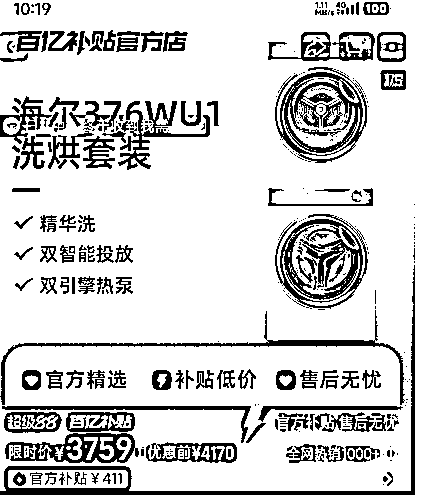
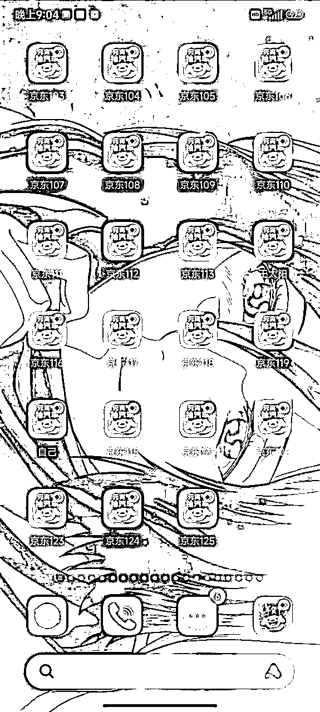
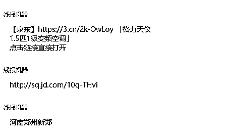
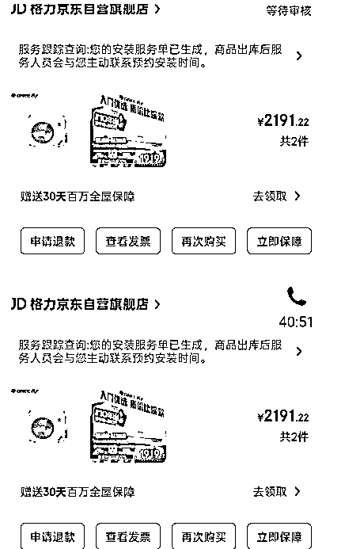
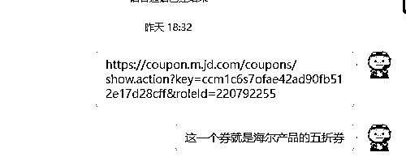
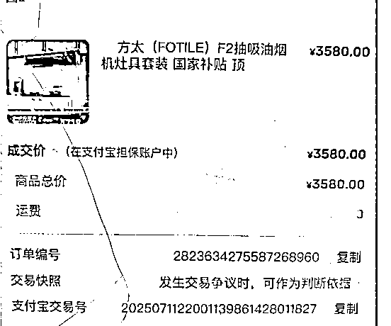
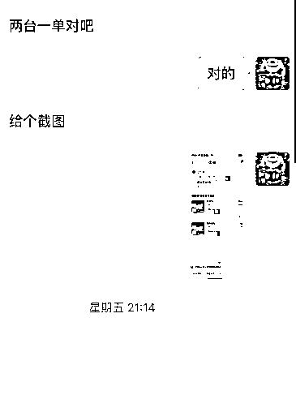
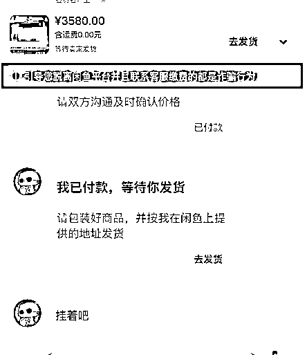
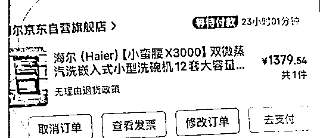
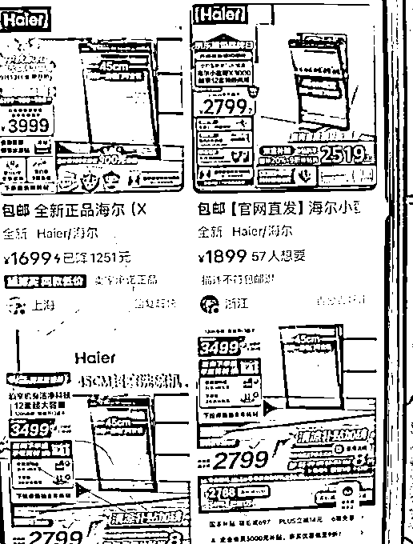

# 京东家电代下新手实操手册

> 来源：[https://acnebzxrlyl8.feishu.cn/docx/AXWmdzB1poHqMrx7D4tcQVVFnkb](https://acnebzxrlyl8.feishu.cn/docx/AXWmdzB1poHqMrx7D4tcQVVFnkb)

# 零基础京东家电代下暴利攻略 | 团队月销千万的保姆级教程

### 一、为什么必须做京东家电代下？——平台5大碾压优势

✨ 秒懂案例：

“客户在京东看中￥6013的电视 → 你用优惠价￥4463代下 → 赚差价￥1550”

* * *

### 二、团队进化史：从新人券到千万供应链的真相

#### 2019-2021 探索期（新人价）

*   操作模式：京东新人券（日化品为主，单号利润￥15-30）

*   踩坑总结：2021年政策收紧，转型家电赛道

#### 2021-2023 成长期（家电+短视频）

*   核心突破：

*   家电代下全链路闭环（货源→流量→交付）

*   京东短视频带货矩阵（京东短视频MCN矩阵23家 采集-剪辑-发布全自动化）

### 团队信条

“没有永恒的渠道，只有持续的进化 从新人券代下到千万元级家电供应链，始终跟随平台红利构建护城河。”

## 一、项目本质：小白必懂的 3 个基础认知

#### 抢购价 ：秒杀、百亿补贴等活动（需要盯产品时间，卡时间）

#### 企业价 ：利用企业采购账号进行批量下单，需要营业执照（京东企业会员注册）（合适大批量订单）

#### 线报价（区域价） ：区域的现货资源（合适个人玩家操作 很多小线报团队）

### 案例（小白可复制）话不多说上图

当天下单 当天即可出货 （直收vs平台）下单即可赚钱

## 二、新手三步启动法（24 小时开单）

### Step 1：开通靠谱代下渠道（防坑重点！）

#### 抢购价：科技碾压人工：全自动抢券系统实战攻略

❌ 熬夜蹲点抢券失败率＞80%❌ 百亿补贴库存秒无❌ 比价监控消耗

1️⃣ 毫秒级监控

• 同步京东秒杀/百亿补贴库存变动• 价格波动 ±1 元即触发抢券

2️⃣ 全自动下单

• 一键绑定账号 • 优惠券 + 地址 + 发票信息自动填充• 抢到即锁单，0 秒付款防砍单

3️⃣ 多线程并发

• 最高 50 个 SKU 同时盯防• 支持云端/本地双模式，手机关机也运行

#### 企业价：一张执照即可搞定

https://u.jd.com/gGjBGiL → 点击【企业注册】

上传营业执照照片完成认证

#### 企业号常见问题解答

1.  一个执照能注册几个企业号？ → 同一营业执照可认证最多3-5个企业号

1.  审核失败怎么办？

*   检查营业执照是否模糊/过期

*   确认企业名称无特殊字符（如“,”）

1.  个体户能否升级为企业号？ → 可以！需上传营业执照+法人身份证

💡小白选择建议 ：优先选平台和直收（避免代理跑路风险）；验证渠道真实性：要求提供当天京东订单号 + 物流截图。

### Step 2：销售渠道（照抄高转化模板）

##### 闲鱼文案模板 ：（直接复制修改）

🔥【京东内部价】XX 家电 直省 XXX 元！

✅ 官方价：￥XXXX → 我司直发：￥XXXX

⚡ 京东物流 + 电子发票 + 全国联保

⚠️ 注意：令牌订单不退换，确认需求再拍！

👉 下单流程：

1.  私信发【型号 + 收货地址】

1.  付定金 → 同步京东单号

1.  签收后付尾款 #家电 #装修 #京东内部价 ✨效果 ：该文案单日引流 23 人，转化 5 单。

朋友圈发布规范 ：每日 3 条，早 9 点价格对比图 + 午 1 点客户好评 + 晚 8 点爆款预告。

配图公式 ：京东价格截图（红笔划掉） + 收货小视频。

线报直收：联系渠道对接即可(建议找靠谱大渠道）

### Step 3：接单处理 SOP

*   关键动作 ：

*   查价：登录平台后台 → 输入商品 SKU（京东商品页编号）→ 获取实时价。

*   定金规则：收 20% 定金（防客户跑单），尾款货到支付。

*   下单注意：地址 / 型号 / 发票信息需客户文字确认（避免纠纷）。

## 三、新手高频问题解决方案

### 客户问：“是正品吗？”

应答话术 ：“商品由京东仓库直发，带电子发票全国联保！支持 官方验机！”

增强信任 ：发送京东物流截图 + 已成交客户评价（附聊天记录）。

### 客户要退货怎么办？（基本不会有）

规则前置 ：下单前发送协议：“为特殊渠道货，无质量问题不退换，签收即认可规则！”

补偿策略 ：

*   如果不想要：扣除来回路费

*   质量问题：引导走京东官方售后。

### 一天没订单？流量提升技巧

##### 闲鱼多账号玩法 ：用家人手机注册 n 个号，发布同类商品（覆盖不同关键词）。

##### 小红书引流法 ：

标题：“新婚装修必看！省下 1 台空调钱的采购攻略”

内容：附家电清单 + 省金额度，文末埋钩子：“需要渠道可私”

##### 抖音直播（目前正在测试）

## 四、进阶技巧：利润翻倍的 3 个策略

### 捆绑销售

例：电视 + 冰箱套装（市场总价 25,000 →价 14,000 → 售价 18,000，利润 4,000）

### 线下社区团购

联系小区物业：“业主家电团购价：全网最低，返物业 10% 佣金”

### 二手回收翻新（零成本加利润）

操作路径：闲鱼收旧家电 → 翻新后搭配新机销售（例：旧空调折价 500 元，加价 800 元售出）

## 五、风险避坑指南

有问题的在评论区留言