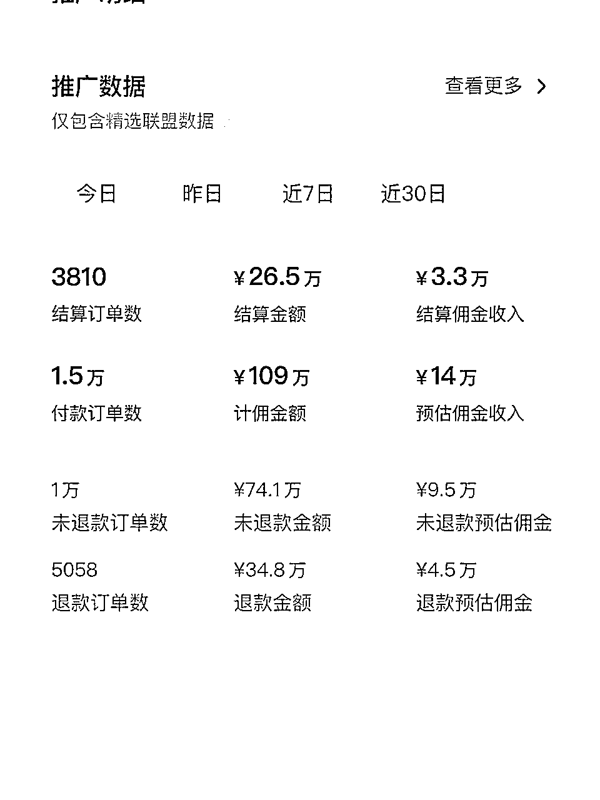
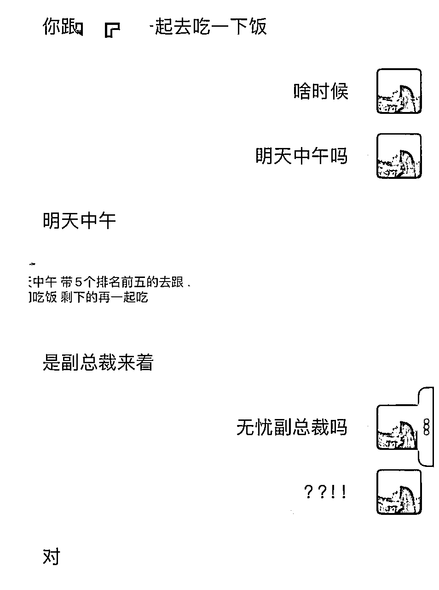
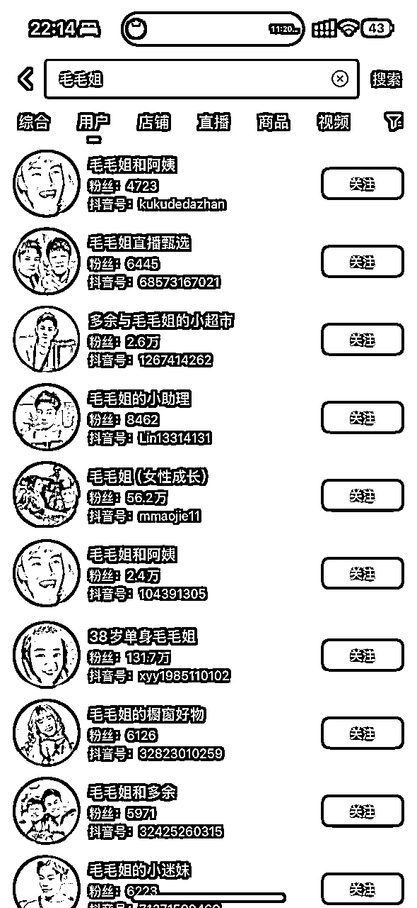
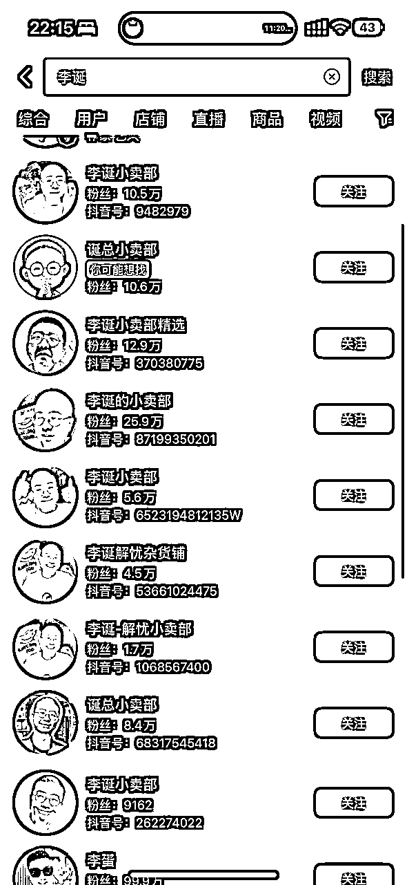
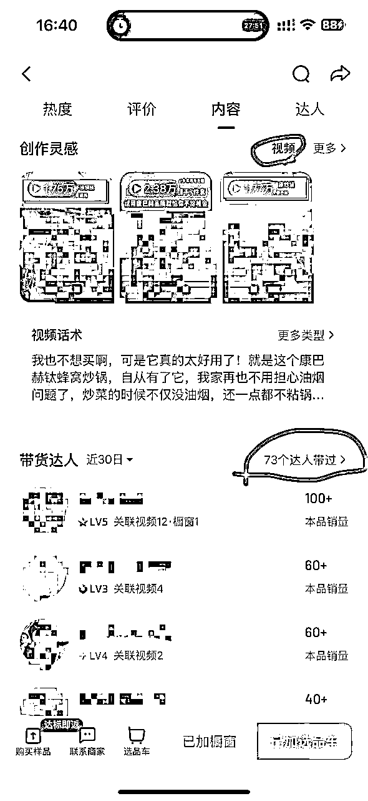
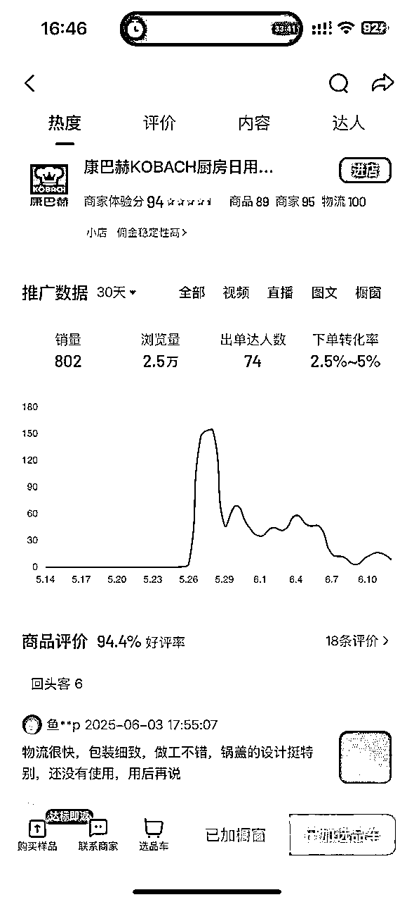
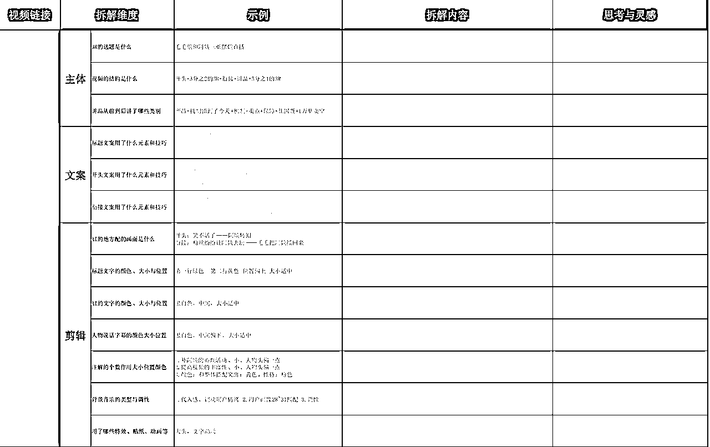
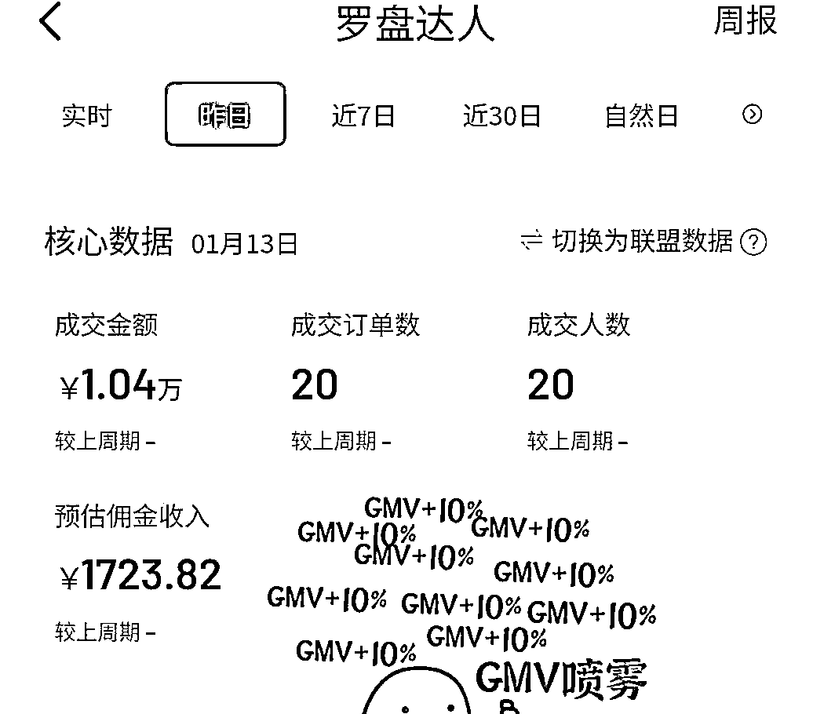
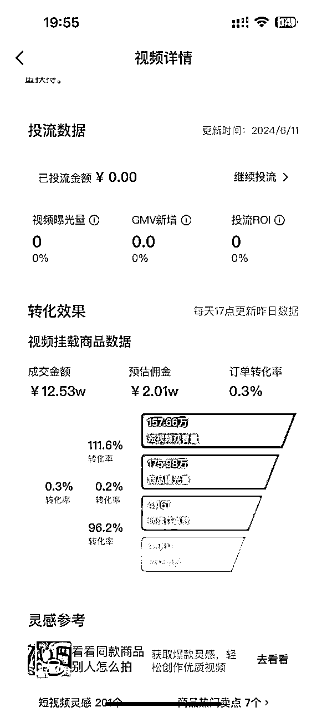

# 从0到单月最高100w营业额，直播切片保姆级教程分享

> 来源：[https://nmui3kskc0.feishu.cn/docx/Pc6iduTOPoLJeXx3DimcNfGOnUh](https://nmui3kskc0.feishu.cn/docx/Pc6iduTOPoLJeXx3DimcNfGOnUh)

# 00：关于我—李子

大家好，我是李子，95后东北女生。

在此非常感谢 我当当姐，播客《搞钱高流量》的主理人，也是我的贵人~

在此，我也将自己做直播切片的经历整理出来，分享给大家~第一次写经验贴， 欢迎交流~~

网赚的路上，我接触了很多项目，做过博主，中视频，短剧等，都实现了变现闭环。

但最终决定深耕直播切片，也拿到了单月最高营业额100多w，月赚十万的结果。

作为头部账号还被邀请去了无忧之夜和无忧副总裁一起吃饭。

通过直播切片，我实现了自由职业，也实现了旅居的梦想。

今天我站在个人玩家的角度，分析和拆解一下这个项目的玩法和经验。

如果你看完能觉得有收获，我倍感荣幸，也欢迎大家点赞交流~

# 1.项目认识

## 1.1为什么我在众多项目里，选择了直播切片

作为一个资产很少，不善交际，又非常想靠着自媒体红利实现人生逆袭的小白来说。

我当时在找项目时认准3个原则：

1.  低投资：项目低投资甚至零投资，但入场有机会得到超高杠杆收益；

1.  避短板：不需要过多接触我的短板（社交），而是专注做事就能拿到结果；

1.  好上手：项目技能维度不复杂，相对单一，更好上手；

我选择的第一份网赚项目是减肥类博主，但发现博主需要的技能维度相对复杂（做内容+文案+拍摄等等），虽然也起号成功，赚到几千块钱。但深感分身乏术，非常疲惫。

随后我把目光转向中视频，深入后发现中视频虽然需要的技能相对单一，但当时的中视频已经过了最早的红利期，我在运营过程中发现单账号收益非常有限，且需要不断创新和创作内容。

站在这个角度，直播切片刚好符合我选项目的标准。

*   低投资：0元投入。大部分达人免费授权+平台1000元保证金能挂车开橱窗，不做可退；

*   好上手：学习维度相对单一 ，基本靠剪辑和运营。不需要拍摄创作内容，也不需要发货处理售后；

除此之外，它还有以下优势很吸引我：

*   高杠杆：当视频爆单后，单视频可能直接赚到几万。相比于中视频的天花板高了很多；

*   有托底：账号做起来权重后，打上电商属性可以基本每条视频都能出单，爆单概率也直线上升；

*   时间复利：单个视频可能几万以上收益，流量推送最长可能吃1年；

另外，我的托底想法是：就算赚不到钱，我也通过直播切片了解的如何做视频爆款，剪辑爆款，电商选品，运营账号的逻辑。 为我以后在互联网的长期发展是百利无一害。

为啥不干呢，干！！

## 1.2什么是直播切片

*   利用明星或网红达人的直播录屏素材

*   进行二次创作剪辑成视频，无需拍摄

*   发布视频后通过卖货/课赚取收益即可

切片账号矩阵举例

# 2.新手如何0基础上手

因为我主做抖音平台，因此以下教程均以抖音为主，其他平台以此类推。

## 2.1 账号要求

*   需实名认证授权

*   有1000粉丝

*   已开通橱窗

Q1:我没有那么多粉丝怎么办？

*   可以通过淘宝等渠道购买粉丝

*   一般要求千川投流粉

Q2:购买粉丝后，账号画像是否会影响账号人群，和推流？

*   有略微影响，可忽略不计

*   1000粉丝还形成不了对账号的推流趋势

## 2.2选择达人：如何做市场调研

因为市场变化，不同时期会有不同更优达人选择，找到市场上最优解的达人，成功事半功倍。

方法1:问行业专家

市面上可做的切片达人非常多，因此快速靠谱筛选的结果就是问懂的人！

1.  浅：直接去搜集市面上卖直播切片课程陪跑的机构，假装咨询陪跑，问他们做哪个达人；

1.  中：假装去直播切片公司面试，看他们目前主要在做哪个达人；

1.  深：找到对应切片公司的员工或切片老板，付费咨询他们情况；

方法2:看对应达人商品数据

如果你已经有心仪的达人想选择，或有初步小范围的几个达人想选择。看达人数据是最好的方式。

1.  账号数据：通过搜索关键词和查看后台数据，看达人切片账号的数量和切片单账号数据；

1.  商品数据：通过抖音后台的商品数据，看改达人卖的最火的几款产品的销售数据；

单账号数据越高，爆款商品销量越高，该达人切片账号越多，说明该达人的流量越好！

如果你倍感纠结，也可以不选择以上方式，建议直接选择一个自己目前看好的达人进行实操！

因为所有达人的底层逻辑是相通的，掌握规律后可以再去换达人，干中学，学中干，越快执行越快拿到结果！

## 2.3如何授权

1.  官方渠道：一般在平台上搜索xx达人切片授权，搜索到相应达人官方切片授权账号，联系授权即可；

1.  其他渠道：如果实在找不到，可以联系想要做的达人的切片号，多问几个人自然就获得授权渠道了；

# 3.学习-跟踪对标账号-爆款视频

## 3.1为什么跟踪对标账号和爆款视频

爆款带货视频=爆款选题+爆款产品+合格的视频剪辑+合格的评论区

*   学习：快速了解该达人剪法，进行像素级模仿进步

*   跟进：掌握同行爆款选题和爆品，一但爆了直接跟上热度做同款

## 3.2找对标的方法

1.  把相关达人商品全部上架到橱窗和选品车；

1.  在选品车里点击对应爆款商品；

1.  可以找到该品下的所有视频和达人；

重点关注学习的视频和账号：

1，该商品的爆款视频；

2，等级L3以上的同行切片号；

3，视频为爆款，等级L3级以下的新账号；

另外可在此页面查看品的热度走向，帮助参考判断。

## 3.3对标账号的关注重点

爆款带货视频=爆款选题+爆款产品+合格的视频剪辑+合格的评论区

*   运营：发布时间/频率/视频时长/评论区引导方式等

*   内容：品的选择/选题选择/剪辑手法等

# 4.视频制作实操

实践是最好的老师，模仿是最快的学习方式。

## 4.1工具学习

工具：剪映即可——推荐用电脑版

*   去剪映官方平台或b站学习教程

*   掌握最基础的操作页面即可

## 4.2模仿学习

下载一个相关爆款视频，拆接下来各个维度，进行像素级模仿剪辑。

这样能最快速有效的知道如何剪辑以及自己和爆款视频的剪辑差距。

## 4.3优化制作

当你拆解+模仿剪辑几个爆款视频后，你对于剪辑的结构、细节则有了实感。恭喜！

此刻你大概也有了对于剪辑方面的新问题，比如如何快速找素材，剪辑速度过于慢如何提升等等。

此刻最重要的：①分析自己的剪辑步骤 ②整理出自己的问题 ③想办法解决！

以下是我赠送的升级锦囊

*   像素级拆解所有的工作步骤，找出每次重复且可以合并的步骤，进行保存预设处理

*   每个视频修改30%则有去重效果，可变成新的视频发布

*   常用的素材单独截取保存，建立素材库可大幅提升工作效率（有软件可快速建立）

*   善用切片第三方网站，可快速搜索定位对应素材（可能需付费）

另外，尽可能的与多个同行进行交流，可以得到新的运营方式、行业的最新信息等~~信息=钱。

# 5.发布文案

一般发布文案的内容是相关话题，或相关产品的文案。

*   第一句话最重要，因为后面的文案用户不一定能看到。

*   文案内容：留内容钩子（引导看到最后）或者直给产品卖点（增加下单概率）。

*   建议和视频前段内容或视频标题进行内容互补。

*   比如视频标题写的是产品相关，发布文案可以话题相关；反之亦然。

# 6.发布标签

抖音只能关联5个话题。这部分实操下来对流量影响不大。

*   一般选择达人相关+产品垂向+人群相关+品牌相关的话题

*   在每个类别中的同义词选择流量最大的那个

比如#多与毛毛姐 #无痕内衣 #草本初色无痕内衣 #草本初色 #女生夏季必备内衣

# 7.视频发布

## 7.1发布时间

视频发布时间遵循：流量最大化

什么时间流量最大？肯定是大家没上班，可以休息玩手机的时间。

早上7—8点；中午11——13点；晚上6点以后

另外可根据自己账号、根据品和话题去测试时间段发布。

## 7.2发布频率

抖音：建议单账号每天至少2条，最多4条。

快手号一般没有限制，要靠堆量，尽量多发。

发布频率依据平台运营和测试结果得出。

核心准则：单位时间内获最大收益。比如抖音发4条以上，新视频流量会出现明显下滑，收益不大。

# 8.发布后评论

## 8.1准备评论账号

评论区是非常重要的区域。做的每条评论一定要有相关的用处，不然就浪费一个评论账号。

自己注册抖音小号：一个手机号可以注册3个小号。

找亲戚朋友评论：如长期需要可付费。

找相关网站/自己养鱼池评论：一个评论大概4毛-1元不等。

## 8.2本账号自评1-3条

第一种：置顶评论：激发不看视频的买家的购买欲

产品主要卖点+痛点刺激+价格刺激+图片刺激

有些产品对比图对于促单作用很大。比如穿塑身衣前后的对比图等。

第二种：可以把视频里没有提到的卖点加入到评论里

增加卖点触及率

第三种：回复其他人的评论

回复小号评价，有助于增加该评论的真实性；

回复真实买家评价，有助于促进消费者购买。

## 8.3其他账号自评5条左右

找其他账号给该视频评论，最少3条，肯定是越多越好。

第一种：产品无关的评论内容——拉长视频完播率，提高数据，从而引导平台机制得到更多推流

| ①梗钩子 | 引导用户看到最后； |
| ②争议钩子 | 通过视频相关的一个争议观点引导用户评论争吵； |

第二种：产品有关的评论内容——促进买家购买下单

| ①种草型 | @某人 分享好穿，让她买 |
| ②价格型 | 和旗舰店的价格作对比 |
| ③从众性 | 室友买了之后，宿舍的人都买了 |
| ④对比型 | 买了好多款xx，最后都退了就留了这个！ |
| ⑤名人型 | xx也在穿 |
| ⑥反馈型 | 刚收到，的确不错！ |

！！判断评论是否有效的重要标准：一般该视频爆款后，有效评论的内容都会成为热门评论。

！！2个小号在评论区盖楼回复，真实性更高！

# 9.如何打造爆款视频

挂车带货类短视频=内容属性+电商属性；其本质是爆款选题+爆款商品

## 9.1爆款选题

自媒体有一句很经典的话：爆过的选题会再爆，为了减少试错成本，一定要做已经爆过的选题。

优先尝试—同达人切片账号找选题：近期爆款选题＞远期爆款选题

其次尝试—跨达人带货账号找选题：类似的爆款选题可以挪用到该达人身上

选题要进行简单二创同义句替换、或者也可以进行2个爆款选题融合成一个选题的创新。

## 9.2爆款选品

电商的核心在于选品；短视频带货的核心也在于选品。

低客单福利品—不赚钱但用于起号，因为容易拉爆视频，账号打上电商标签有助起号带货；

达人实时爆品—同时期达人卖的最火的几个品，说明流量好，建议优先尝试；

除此之外，还可以选择高利润产品和季节性产品进行尝试。

❤很多达人旗下的商品会有投流政策，可选择投流品进行尝试，如果被商家选中投流也非常香。

如上图一，20单利润就高达1700；而图二4000单利润却只有2w。

## 9.3账号测试与数据分析

每个账号带有天然属性。在全是爆款选题和爆款品的发布中，不同账号的反应是不一样的。

所以对每个账号进行AB测试，了解账号对于哪些选题、哪类商品流量更高，更容易爆，是很重要的。

比如a账号对于话题1数据更好，对于话题2数据较差； b账号对于话题1数据较差，对于话题2数据较好。

要在话题+品的发布中不断对账号进行测试，找到最适合自己账号的选题+品，再多多发布。

## 9.4后期运营

| 单账号建模 | 前期：相关达人流量视频（提高活跃，最好能破10w）+内容带货视频搭建电商属性等级，快速起号（福利品+爆品） |
| 单视频周期 | 非爆款视频：2天左右（1000左右流量） |

## 10业务流程梳理

| 关注同行数据 | 跟进热门话题和热门品 |
| 确定品和话题内容 | 近期热门品+热门话题 |
| 拆解5个相关爆款视频 | 视频结构、梗的文案、背景乐、音效字幕特效、讲品结构 |
| 找到相应的素材下载 | 一般下载3场相关品的素材 |
| 建立品的视频素材库 | 按照讲品的结构（好吃+价格+促单+卖点1+卖点2等等……）将直播素材分类 |
| 建立内容的视频素材库 | 内容1，内容2，开头画面1，开头画面2…… |
| 在剪映建立内容的原始稿 | 一般用作开头，每次替换开头画面+配音的字+音乐， |
| 在剪映建立品的原始稿 | 每次替换1/3的视频素材，可以成为新的视频 |
| 去重 | 贴纸+关键帧+翻转+滤镜+特效+音乐等 |
| 发布 | 文案带钩子+话题（达人+产品） |
| 点赞、评论 | 自评+他评。评论内容和品或者视频内容相关，引导完播或购买。 检验标准：视频爆之后，自评的内容是否会成为热门评论。 |
| 复盘 | 每个账号都有不同的属性。根据数据测试出该账号发布的哪些品+内容的数据好，继续发布。 |

# 写在最后

对于新手小白，可能面对琳琅满目的网赚项目，既迷茫又没有信心。

我觉得只要低投资、好上手就是是帮助小白增强信心的首选项目；在此基础上可能产生高杠杆变现的就是有机会赚取高收入的优质项目。

我也始终坚信，世界上赚钱的项目和机会始终都有非常多。钱跟着能力走，一切的的努力和试错都是为了提高能力，能力到了钱自来，一切经历都是追逐财富海浪上的踏板。

我是李子，专注挖掘实战低成本高变现小项目，愿我的分享对你有所收获。

祝我们都能在网赚路上乘风破浪，收获满满。