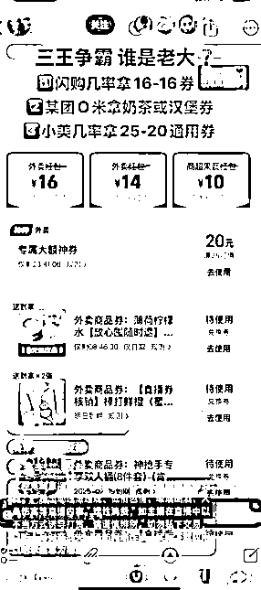
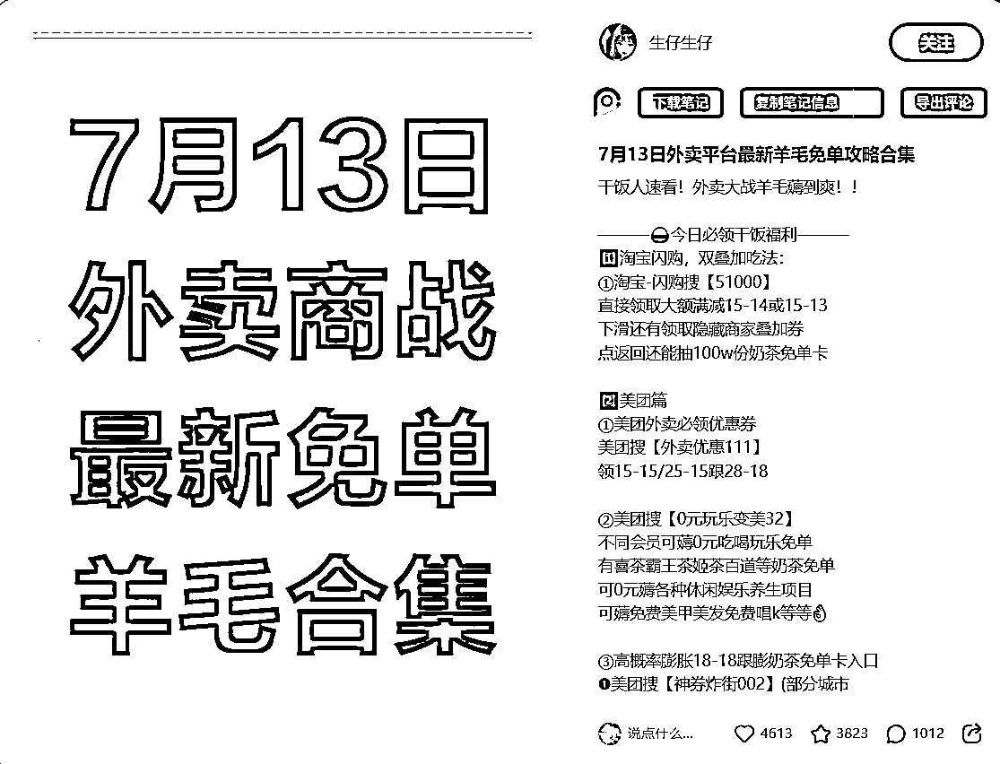

# 上线即出单，5 天收益累计 800+的外卖 CPS 新手指南

> 来源：[https://pcndievlt02e.feishu.cn/docx/OK4ndaX2HoiE6lxVgoIc7YLUnpb](https://pcndievlt02e.feishu.cn/docx/OK4ndaX2HoiE6lxVgoIc7YLUnpb)

# 前言

圈友们好，当我在 7 月 8 日刷到以下这个中标帖的时候，我是非常激动的，我猛的发现，用户只需点击视频下方的链接，就能在打开外卖App时自动弹出优惠券。这种“丝滑”的转化路径，让我意识到一个巨大的机会可能就在眼前 。我感觉发现了一个宝藏。我仿佛看到了几年前的流量风口。

我决定立刻行动。当晚，用最简单的方式剪辑并发布了第一条测试视频 。很快，系统就给了我正反馈，结果远超预期，当晚成交 4 单，虽然佣金只有1.42元，但这证明了整个流程是完全跑得通的。视频内容如下：

虽然跑通了最小 mvp，但对于接触过好几个项目的我而言，它算不算一个好项目还为时过早。

项目能做多大，天花板多高，值不值的做？适不适合我？能做多久？还需要继续调研。

为了验证这不是偶然，我第二天立刻加开了一个新账号，继续测试 ，剪辑视频，发布视频，统计播放量，分享数，订单数等数据。

同时观察同行，出单的平台如闲鱼，小红书，快手，视频号，抖音的优秀案例，了解官方平台的推广链接，对接第三方分佣平台，与同行交流，力争快速了解。

而在这时，亦仁也发了一个针对这个项目的的超级标，给我了更多的信心。

经过几天的调研和测试，我也拿到了一些小结果，累计播放量3w，订单量 1000+，收益 800+，也对这个项目有了更深刻的理解和思考。

这篇文章不长，总计 3000 字，文中主要提到了我对这个项目的调研可行性，如果你对外卖 CPS 也感兴趣；或者从未接触过 CPS 项目、但希望快速起号变现的个人；或者有一定剪辑经验、想要批量放大的团队。相信我，完整看完，会有很大收获的。核心内容如下：

# 一、判断项目是否可行（Why?）

一个项目值不值得做，需要从赛道、市场和时机三个维度来判断。

### 赛道 & 平台机会：巨头补贴，流量红利窗口期

1.  风口趋势：美团、淘宝、京东三家巨头正在大力补贴外卖零售市场，这场“战争”刚开始，短期内补贴不会结束 。对于推广者来说，这就是最直接的红利。

1.  核心赛道聚焦：私域归集，只要补贴还在，消费习惯养成，项目会一直在，只是到后面，随着各方平台的稳固，佣金会有所下降。但这不是当下唯一考虑的，目前只需要解决流量问题，如何获取更大的流量。后续才考拉将流量转到私域，获得长期收益。

### 市场规模 & 竞争格局：天花板极高，普通人仍有机会

1.  项目天花板：目前我在群里看到的圈友最高的日均 3W 单

以周六冲锋日的淘宝闪购-超级品牌日第三方平台的佣金为例：

平日淘宝闪购新客：0.8/单，淘宝闪购老客：0.3/单，周六激励翻倍，同时每 2000 单奖励 188.8，算上高额 cps，一单佣金可以达到 1.6/单，也就是说昨天那个圈友入账了 4.8W。已经是很高的天花板了。

1.  竞争结构：这个项目还算分散红海赛道，头部还未完全垄断，而且根据我测试的结果，入场的都是可以挣到钱的，只是挣多挣少而已。所以对普通人是比较友好的，当然，如果能通过手段放大，撬动杠杆，收益更可观。

1.  细分赛道增速 ：美团外卖，淘宝闪送，京粉，也许下一个是拼多多，都会下场，且每个平台活动多样化，补贴也多样化，当下根本做不完。目前大部分推广者都是哪家平台佣金高，对哪家平台规则更熟悉，就主推哪家。

### 时机窗口：现在进入，就是第一波吃螃蟹的人

目前市场还处于分散的“红海”阶段，头部并未完全垄断。根据我的测试，新入场者只要执行，都能赚到钱，区别只在于多少 。这对普通人非常友好。

# 二、判断适不适合做

### 资源与能力匹配度：门槛极低，执行力是关键

1.  核心资产复用度：

我简单的测试，就能取得这样的成绩，还是比较乐观的，至少在操作上没有碰到难点。跟我们原来的创业的经验比较融合，不管是矩阵，还是投流，我们相对普通人会擅长一点，这点我们还是有信心的。这也是下一步我们重点的发力点。

1.  学习 / 迭代能力：

模式简单粗暴，流量完全溢出，只要发布，就可以获取到流量。只要微升级，就可以获取到大量流量。你们看到的 1 天转发几万的基本都是投千川出来的。

### MVP 可执行性：半小时上手，当晚见效

1.  3-6 周能否跑通：我是 7.8 晚上剪辑了第一条视频发布到抖音，当晚就出了 4 单。制作一个爆款视频非常简单，几乎可以套用公式。

以这条视频为例：2.58 iCh:/ 12/31 Y@m.Qk http:/💰kxMjc3MTkxY2I💰 美团外卖优惠券领取入口 美团大额优惠劵最新教程 # 省钱技巧 # 外卖优惠券 # 美团外卖优惠券 # 薅羊毛 # 省钱攻略 https://v.douyin.com/9vVBnKo8kkc/ 复制此链接，打开 Dou 音搜索，直接观看视频！

视频的文案构成：

*   开场白：美团外卖优惠券领取十八减十八保姆级教程来了。主播昨天已经把冰箱存满了奶茶，话不多说，教程开始。

*   领取步骤：现在点击视频右下角的分享按钮，复制成功后打开美团就可以进入美团外卖优惠券领取入口，进来立即领取就可以拿到大额外卖券了。美团首页搜索八二五五，进入内部折扣页面。神券界面，低价买。这几种券包都很划算，券到手后，切换大城市地址更容易获得十八无门槛券。

*   收尾：券全部领完之后，就可以实现奶茶外卖自由了。

核心逻辑：你会发现，中间的“领取步骤”是固定的，你只需要不断更换“开场白”和“结尾”，就可以无限生成新的原创视频 。

### 多渠道玩法拆解：一鱼多吃，收益最大化

*   抖音直播间：可以所有平台通吃，单粉产值更高，难点就是要有一个人一直坐在屏幕前解答问题，后期看有没有机会无人直播。

*   小红书：仅需一张图片搞定，接着是笔记内容。可以无限重复发，比抖音更简单一点。

同时，小红书一篇笔记可以做到通吃所有外卖平台的佣金，平台上所有的活动，投产比更好。和抖音的直播间有异曲同工之妙。

*   闲鱼：发布的内容模板可以重复套用，难度不高。核心是如何通过擦亮功能，获取更多曝光的问题。

其他平台就不赘述了，方法也是很粗暴简单的。

1.  可投现金：无需资金投入，除非投流。

1.  初步投产比：以抖音为例，我跑通下来的情况下，自然流平日万播放收益在 200-300，如果是冲锋日可翻倍。而且，剪辑的视频和文案可以一鱼多吃，可同步发布到视频号，快手，抖音，图文类的可发布到小红书，闲鱼，如果还有能力的情况下，还可以在淘宝拼多多发布，形式也很简单，直接卖 0.01 元，不考虑收益，我们只赚佣金。

# 三、判断值不值、能做多久

### 扩张性 & 护城河

这个项目我个人判断有很大的扩张性的，矩阵放大，一鱼多吃多平台放大，投流放大，团队放大，工作流放大。我个人认为都有机会。目前市场上主流的方式就是铺量和投流，其中投流就是你们看到的 1 天分享量达到几万的。我也和同行交流了下，投流难度不大，有投流过的简单学习下就会了。

目前我已经实现了快速剪辑的工作流，可以无限产出视频，关于工作流放大，可以参考文锴的精华帖《一个人，一套自动化流程，如何玩转 100 个中老年书法视频号矩阵？》

而矩阵放大，多平台放大，和投流放大，也是我接下来的重点。如果有机会叠加私域，效果会更好。毕竟，公域平台的流量是暂时的，只有把用户引导到自己的微信群或企业微信，才能实现长期、稳定的复利。这是对抗风险最有效的手段。

### 风险管理

任何项目都有风险，提前规划才能走得更远。过度营销或内容同质化，可能导致账号被限流或封禁。所以，如何去重，降低过度营销，也是我们需要思考的。

# 四、总结

通过各个方面的判断，在目前，我觉得这个项目是有很大机会的，就像亦仁说的。这条超级标，非常适合普通人，可能是最不需要技术含量只需要无脑执行力的超级标项目。以我这么粗糙的剪辑，都可以快速拿到结果，生财有术的圈友们，能力远在我之上，一定可以拿到更大的结果。

# 五、其他补充及答疑

### 1.关于官方链接和第三方平台链接取舍的问题。

目前我了解到的情况，基本活动，官方就有，直接申请提报就行。美团的直接搜索美团联盟，淘宝闪购的搜索一起赚。比如美团外卖节 3%的佣金，长期活动。

一些冲锋日的活动和激励，只有第三方平台才有。如周日的淘宝闪购超级品牌日的翻倍补贴。目前我对接的 2 个平台是圈内大佬黄老板的云瞻平台和云众推客。

官方的优势：系统稳定，资金绝对安全。

第三方相比官方的优势：活动多，结算快，基本达到 T+1，部分补贴力度大，除了官方的返利之外，还有额外激励政策。客服反应速度快。劣势是有些第三方平台系统不稳定，时不时崩溃一下，订单同步也没官方那么及时。

有感兴趣的小伙伴也可以直接扫码分佣，会有工作人员对接。代理分佣的佣金不高，我了解到的情况是，代理分佣只能拿到达人佣金的 1%-2%，佣金实在有点低。所以想做代理的，前期不如自己做达人先跑起来，更实在。

### 2.各个平台活动的推广取舍问题

目前各大平台都在各显神通，努力拉单子。也推出了不少活动，从这几天的观察看，平台有活动有激励，我们就跟着第三方平台走。

平日没活动的，算下来佣金差不多，就提报官方的活动。一般，平台都会主推 1-2 个基础活动，平时推这个就行了。

各个第三方平台活动和激励政策都有所差异，可以自己多了解关注一下，哪边佣金高，就推哪边。

### 3.批量剪辑问题

前面我讲过抖音和小红书的优秀案例，构成都是很简单的，我也拆解出来了，通过工作流，批量剪辑软件，如剪大神，批量上传软件，就可以实现了。

### 4.项目评估的基础标准

这是我结合生财有术的文章，自己思考的对项目评估的总结的初稿，不完全正确，仅供大家参考，也欢迎感兴趣的圈友提意见，一起优化。

感谢亦仁的超级标，如果觉得内容对你有价值或启发，希望能点个赞，投个锚支持一下。

欢迎对外卖cps好物感兴趣的或者已经在跑的一起交流，抓住这波红利！