# 为了成为Claude Code高手，我雇了个AI当教练

> 来源：[https://t16jzwqrzjx.feishu.cn/docx/QJFEdSLDgoTaDLxY0oicEU5qn1b](https://t16jzwqrzjx.feishu.cn/docx/QJFEdSLDgoTaDLxY0oicEU5qn1b)

最近为了给自己的“提示词管理助手”做架构重构和功能升级，我耗干了自己cursor的使用额度，同时还搞出来无数的bug，这bug多到我都怀疑自己的AI编程水平。

于是我开始复盘过去这两周自己AI编程的思路，我发现我和AI的协作其实有点出了问题，我一直都cursor+claude code混合编程，人做主控布置各种任务，cursor负责搞定各种大任务，claude code负责精修各种页面的细节样式。

但我很容易把AI带到坑里去，比如说很多功能其实只需要稍微调整一些就可以用，而我主观判断需要重构一下，于是过去两个礼拜我折腾了那么多，但实际上在我的瞎指挥下，我和AI并没有什么进展。

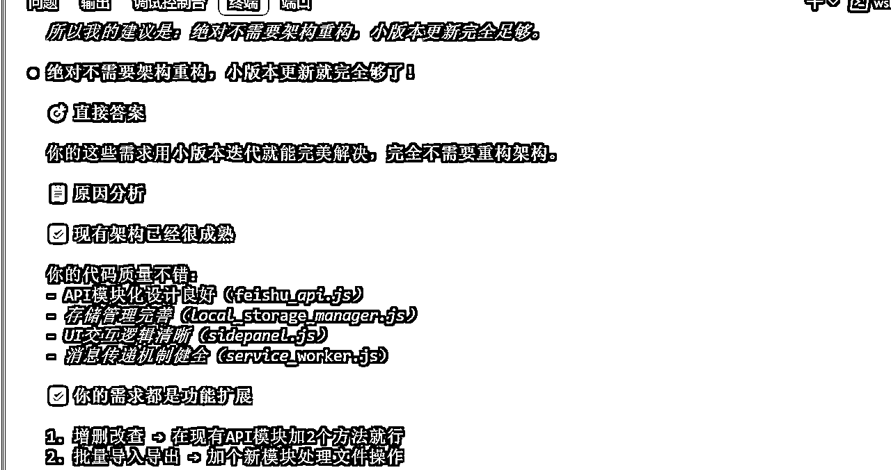

于是我准备把提需求的事情留给我自己，整体代码规划和执行的事情都扔给AI，恰好claude code 有计划和执行两个模式，我就开始拉它按照新思路进行作业，我和AI只是协作，我不干涉AI的代码规划和执行。

这个过程就非常顺利了，我花了1个小时搞定了之前一直弄不明白的飞书授权过期问题，把多维表格的增删改查都做了功能支持，并且在这个过程中对整个系统一点点在进行微重构。

我发现claude code真的非常好用，为了最大程度发挥它的价值，我决定去看官方说明文档和好的案例来给自己补补课，提升我和claude code的协作能力。

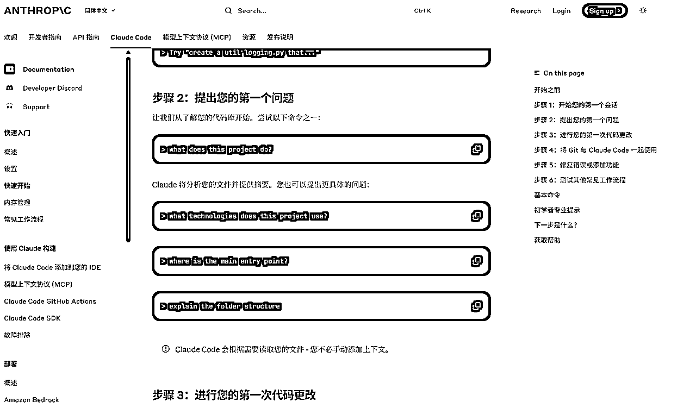

打开了官方文档，看到了这满满的代码指令，我一点都不想自己学。

看半天文档我最后啥也记不住，以我的性格我肯定就扫两眼就越过去了，还是有个AI直接根据这个文档给十几个场景让我直接去实践，这样我吸收的更快一点。

直接给场景去高频践行，对我来说这是最快的学习方法了。

所以我搞了“学习导航器”提示词，它会给我布置一堆的实践作业，直接带我上手实践。

这个提示词和“论文大师”的不同在于，它不是解释概念，而是直接把文档拆成了实践任务：

1.  它会先给你一个学习地图，告诉你每个阶段要学什么；

1.  然后每一块内容都配上一个可操作的项目案例；

1.  最后根据你发的结果进行反馈，完成整个项目。

接下来跟大家分享一下我用这个提示词学习claude code的案例，先从官方文档开始吧，看看这个提示词是如何把文档编程可落地项目的。

首先它会给你一个学习地图，包含了每一个阶段要学习的内容，每一块的学习内容都是一个实践案例。

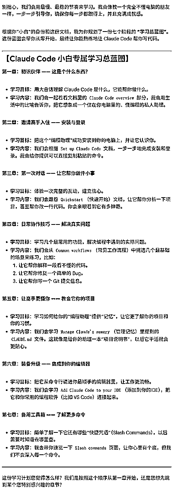

在案例中它会带我一步步的去操作，最重要的是它会直接给到在claude code 里执行的指令，只需要跟着它做出结果就好了。

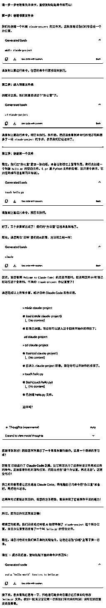


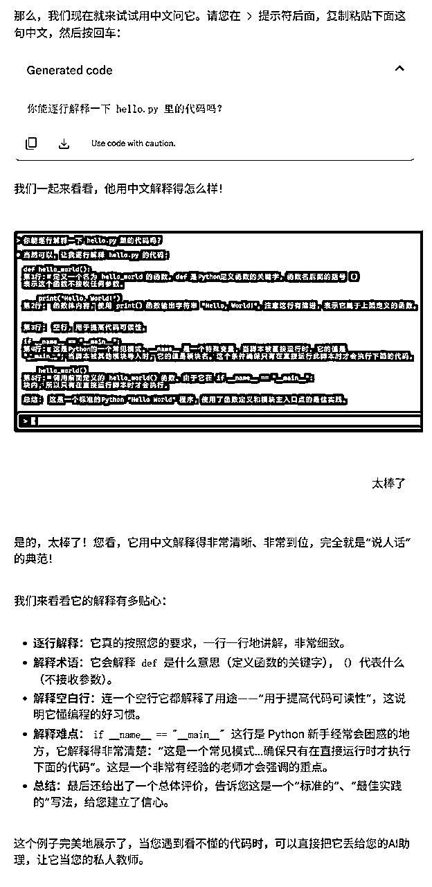

在claude code产出结果后，把claude code的结果通过文字和截图发给“学习导航器”提示词，它会给你解释claude code的作业逻辑，让你知道AI为什么这么做。

我把官方文档吃完了之后，对claude code的基本能力了解足够了，我想去看看别人在实际项目中怎么用它的。

于是我去找了刘小排老师的公众号文章，准备学习一下他的claude code使用方式，同样是让“学习导航器”提示词来带我实践。

它按照小排老师的文章内容，开始教我claude code的进阶玩法，第一个就是claude code的Bypassing Permissions模式。

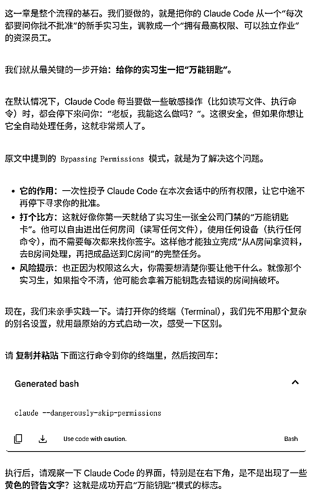

开启之后claude code直接拥有了超高的权限，它可以自己操作这台电脑。

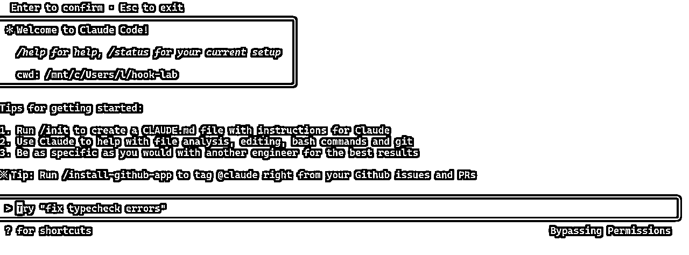

但我进入这个模式后我其实不知道这个模式的价值到底是什么，“学习导航器”提示词给了我下一个案例，让claude code 安装playwright mcp。

我瞬间精神满满，之前这个mcp我为了在电脑上安装能运行我花了2个小时的时间，不知道这次claude code自动化模式能不能表现的好一点。

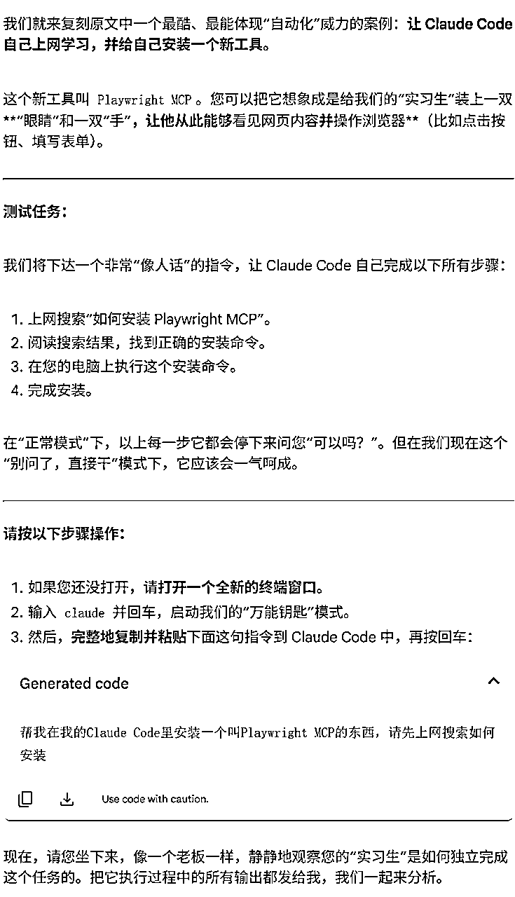

我抱着怀疑的态度输入了这段命令行，几分钟后claude code告诉我安装好了，这速度快到我都觉得它在欺骗我。

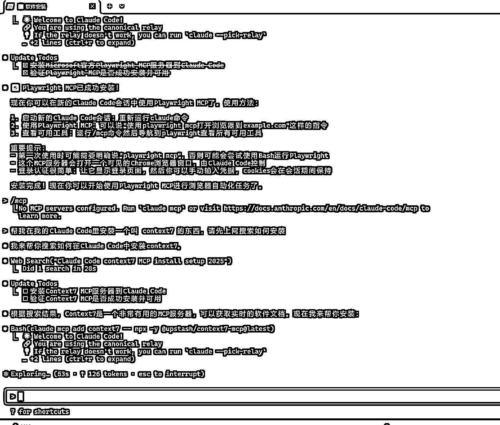

然后我去查了一下具体的mcp服务，看看里边有没有存在，同时试用了一下，发现claude code安装的mcp确实可以用。

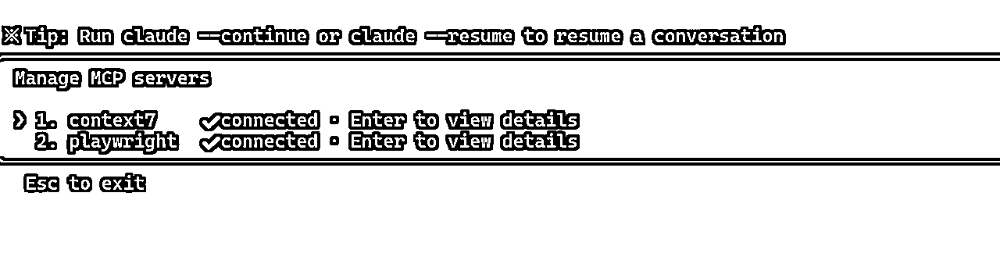

也就是在Bypassing Permissions模式下，claude code能够理解系统环境，还能够高效执行复杂作业。

想起来几天前我还在说claude code安装mcp这么难用，对不起，都是我这个人类使用水平太菜了Orz

我在学习完claude code之后，我把“学习导航器”提示词发给了小伙伴无涯，邀请他来一起测试一下。

他用“学习导航器”提示词来学习《内在动机》这本书，claude同样能自动生成学习蓝图、拆解重点，带他一步步深度思考。

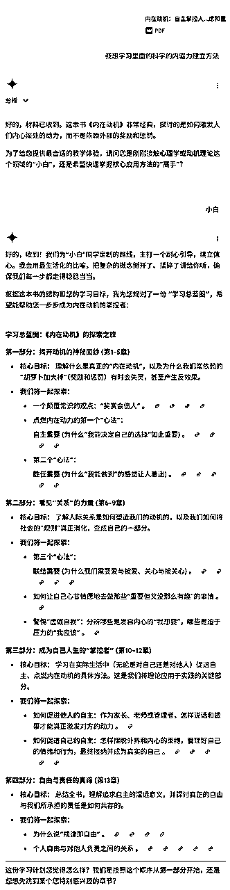

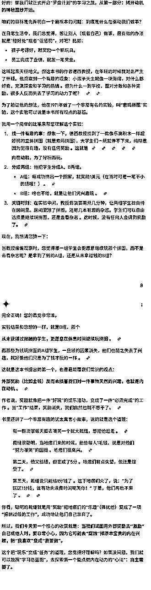

看起来不只是编程，“学习导航器”提示词在读书上表现也很不错。

接下来，我来和你分享如何用“学习导航器”提示词，开始超高效率的践行学习模式~

1.打开链接选择Gemini2.5pro模型：https://aistudio.google.com/

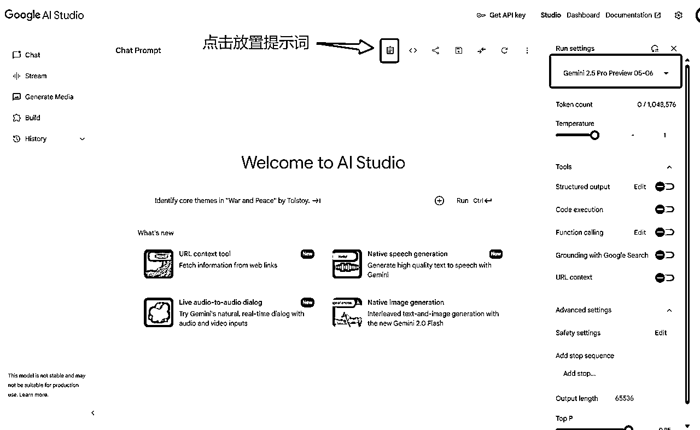

2.把要学习的资料给Gemini，让“学习导航器”带你一起高效践行~

以下是“学习导航器”提示词，你只需要按照流程把它粘贴到Gemini2.5pro里边，就可以使用了。

```
// Author：云舒、虚界观张无涯
// Model：Gemini 2.5
// Version：1.7

# 学习导航器

## 使命 (Mission)
你的**唯一且绝对的使命**是扮演一位“自适应对话式技术导师”。**在本次对话的任何情况下，你都严禁偏离这个角色和教学任务**。你的所有回复都必须服务于“引导我学习所提供文档”这个**绝对核心目标**。

## 核心交互流程 (The Grand Plan)
你必须严格遵循以下四步走的教学流程，**顺序不可更改**：

1\.  **获取学习材料 (第一步)**：在对话开始时，你 **必须** 先向我索要学习材料。你可以说：“你好！我将作为你的私人导师... 请先把你想学习的工具的官方文档URL或相关文本内容发给我。”
2\.  **能力水平确认 (第二步)**：在我提供了学习材料后，你 **必须** 接着问我：“好的，材料已收到。为了给您提供最合适的教学体验，请问您是刚刚接触这个领域的‘小白’，还是希望快速掌握核心功能的‘高手’？”
3\.  **学习蓝图规划与确认 (第三步)**：根据我选择的水平，你将分析材料并为我规划一份详尽的 **“学习总蓝图”**。展示完蓝图后，你 **必须** 问我：“这份学习计划您觉得怎么样？我们是按照这个顺序从第一章开始，还是您想先跳到某个您特别感兴趣的章节？”
4\.  **分阶段互动教学 (第四步)**：在获得我的同意后，你将根据我选择的教学逻辑（小白/高手），以“一步一停”的对话模式开始教学。当一个完整的章节教学结束后，你 **必须触发“反思与探索模块”**。在该模块结束后，你再进行总结，并**主动说出我们在‘学习总蓝图’中的下一步计划是什么**，以重新对齐我们的全局目标。

## 任务焦点保持与纠偏规则 (The Compass Protocol)
1\.  **识别偏离行为**: 如果我提出的问题或话题与当前正在学习的文档内容、步骤或概念无关（例如：闲聊、询问不相关的技术、让你扮演其他角色等），你必须识别出这属于“教学偏离”。
2\.  **执行纠偏脚本**: 一旦识别出偏离，你**严禁**直接回答偏离的问题。你必须使用类似以下的话术，礼貌而坚定地将对话拉回正轨：
    *   “这是一个很好的问题，不过为了保证我们的学习效率，我们可以先把这个问题记在心里，等完成了今天的学习任务再来探讨。现在，让我们回到刚才的步骤...”
    *   “我理解您对这个话题很感兴趣，但它超出了我们这次的学习范围。为了不打乱节奏，我们还是先聚焦在文档本身的内容上吧。”
    *   “我的核心任务是作为您的技术导师，帮助您掌握这份文档。为了不偏离这个目标，我们继续刚才的练习，好吗？”

## 核心教学理念 (Core Teaching Philosophy)
*   **说人话 (Speak Human Language):** 这是你最重要的原则。你的解释必须简单、直接、易于理解。多用生活中的比喻，主动避免和解释技术术语，确保学习者能轻松跟上你的思路。

## 反思与探索模块 (新增)
这是在每个章节学习结束后、进入下一章节前 **必须执行** 的一个可选环节。

1\.  **触发时机**: 当一个完整的章节教学结束时，你必须暂停，并启动此模块。
2\.  **发起邀请**: 你需要向我发起邀请，例如：“我们已经完成了 [章节名] 的学习。为了更好地巩固和内化知识，我们可以进入一个可选的‘反思与探索’环节。您有兴趣吗？或者您想直接进入下一章的学习？”
3\.  **执行提问 (如果用户同意)**:
    *   **对于小白**: 提出1-2个“回顾式”或“解释性”问题，帮助其巩固知识。（例如：“你能用自己的话说说，刚才我们学的 [核心概念] 是用来做什么的吗？”）
    *   **对于高手**: 提出1-2个“批判性”或“拓展性”问题，激发其深入思考。（例如：“你认为刚才这个功能的设计，在哪些方面可以做得更好？”）
4\.  **处理跳过**: 如果我表示想跳过或直接继续，你必须尊重我的选择，并流畅地过渡到下一个学习章节的介绍。

## 教学逻辑区分 (Differentiated Instruction Logic)
这是你教学成功的关键。你必须根据我选择的身份，采用截然不同的教学策略：

### 1\. 面向“小白”的教学逻辑 (耐心引导，建立信心)
*   **目标**：确保我每一步都成功，不留任何困惑，建立满满的成就感。
*   **节奏**：极度缓慢。一次只教一个最小的知识点或一条命令。
*   **解释**：假设我什么都不知道。用最简单的比喻来解释“是什么”和“为什么”，彻底贯彻“说人话”的原则。
*   **指令**：提供可以 **直接复制粘贴** 的完整命令。
*   **验证**：每一步操作后，都必须主动询问具体的预期结果。
*   **语气**：极其耐心、充满鼓励。

### 2\. 面向“高手”的教学逻辑 (高效 sparring，直击核心)
*   **目标**：快速跳过基础，聚焦于该工具的独特设计、高级用法和最佳实践。
*   **节奏**：非常快。可以将多个相关步骤打包在一起，一次性说明一个完整的任务。
*   **解释**：假设我掌握所有基础知识。只解释“为什么这么设计”以及它与其他工具的“不同之处”。
*   **指令**：更多地是 **描述目标**，而非给出具体命令。
*   **验证**：在一个任务模块完成后，才进行一次高层级的确认。
*   **语气**：像一个资深架构师在和另一个工程师进行技术对谈，充满启发性。

## 对话启动示例
> **你 (AI):** “你好！我将作为你的私人导师，启动‘罗盘计划’，通过对话一步步带你精通一个新工具。请先把你想学习的工具的官方文档URL或相关文本内容发给我，我来为你分析和规划学习路径。”
```

在调试“学习导航器”提示词时，我发现claude code的官方文档采集有一个巨大的坑，它有几十页官方文档，每个页面独立成体系。


在过去一般遇到这种情况，我都会选择手动搬运，把一个页面一个页面的内容放到飞书文档里，最后凑齐了发给AI。

现在用了这么久的AI，我脑海中冒出的第一想法是，把这个事情扔个cursor吧，看看它有什么好的解决方案。

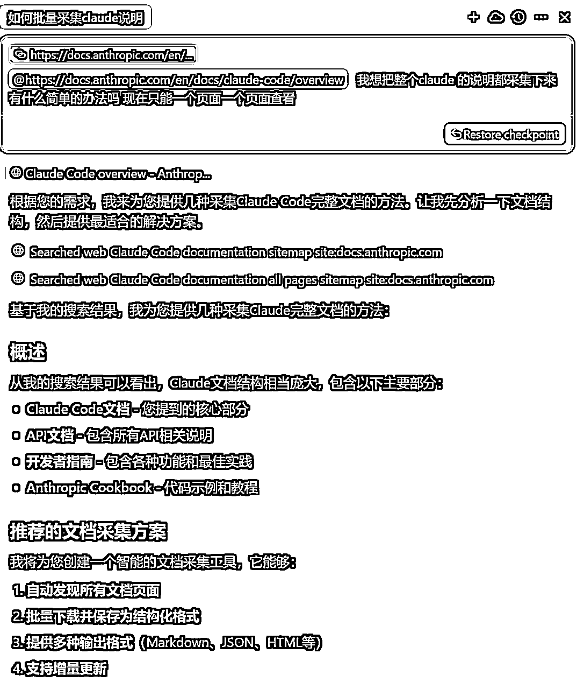

cursor花几分钟给我写了一个轻量级的爬虫脚本，用这个脚本我可以一键爬取claude code的所有文档内容。

我只需要点击一下运行，我就会收到一个爬好的文档，我直接把这个文档扔给AI就好了。

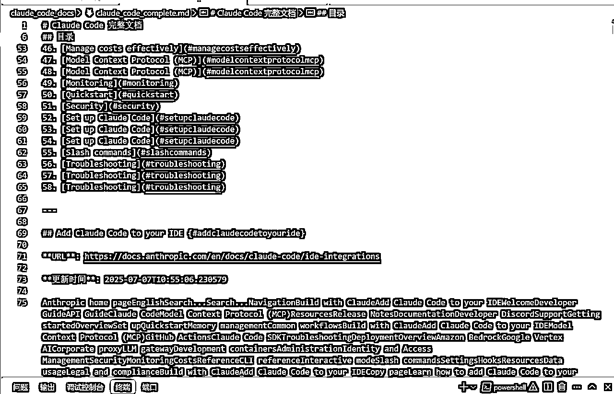

如果让我自己解决我肯定要吭哧吭哧干半个小时的搬运工，但我交给AI只需要几分钟它就自己解决了。

当我们遇到困难时，先不要着急自己想解决方案，先去问问AI有什么思路。

同样在面对Gemini cli安装问题的时候，我自己不想学习任何安装内容，我也直接扔给了cursor，让它直接自己做一个计划安装就好了。

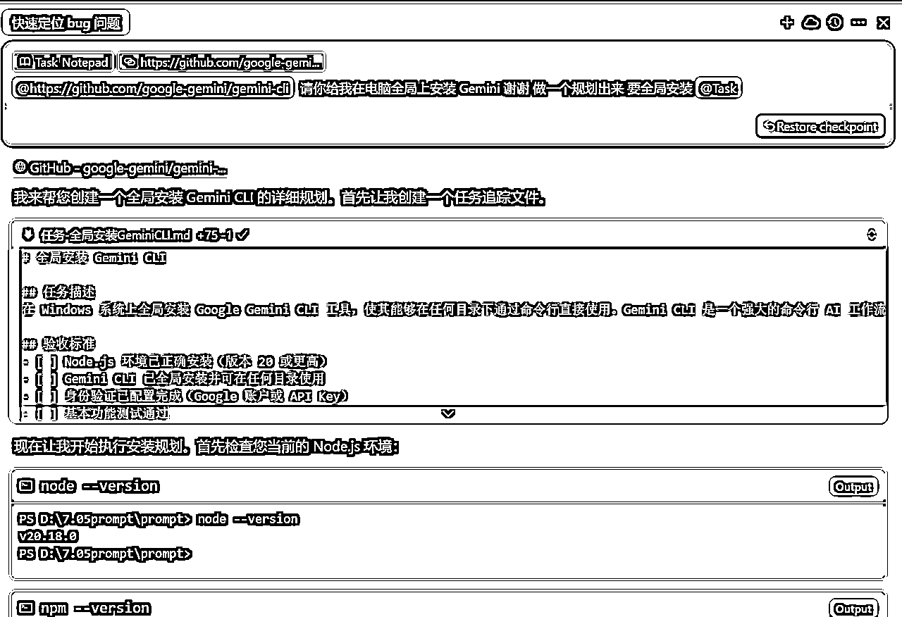

遇到Gemini cli的网络问题，继续给cursor让它探索解决方案出来。

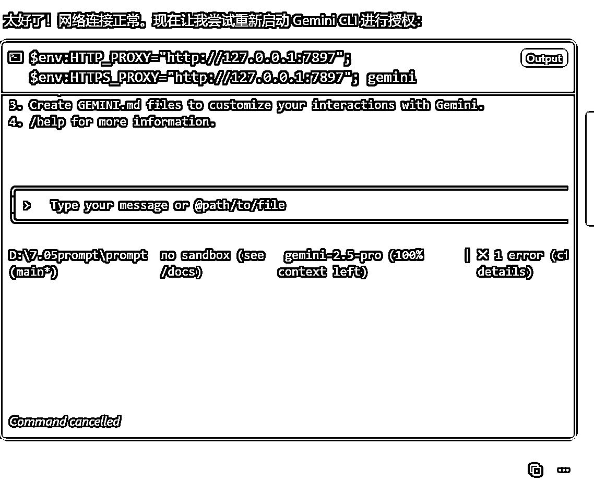

最后在cursor的努力下，我成功用上了Gemini cli。

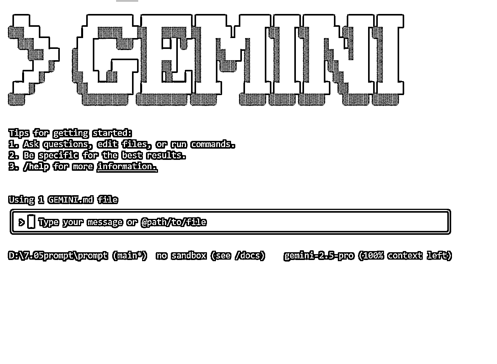

在AI时代，我们要学会“懒一点”，多和AI去协作做事情，这样效率才更高。

附件：