# 关于AI工作流：一切从业务出发丨航海家航海《AI工作流提效》复盘

> 来源：[https://c1l06v61rq.feishu.cn/docx/QZPHdHUJ2o3ymDxkhDXcTsx4nue](https://c1l06v61rq.feishu.cn/docx/QZPHdHUJ2o3ymDxkhDXcTsx4nue)

### 0、先简单介绍一下自己：

在330航海家AI大会，到包子老师的第一次线下课，到6月底，大概2-3个月时间，真实的通过RPA+Coze，完成了整个定制旅行项目的重构。本来6个人的小团队，完成300多万的年销售业绩，现在只需要2个人左右，就可以完成同样的业绩，甚至还能保持增长。

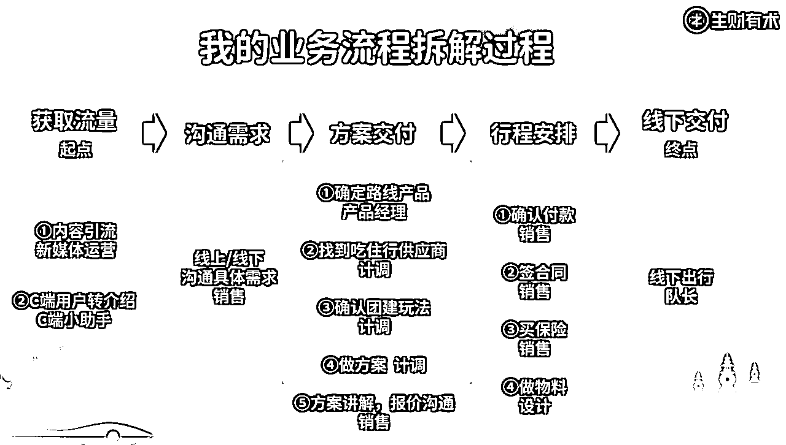

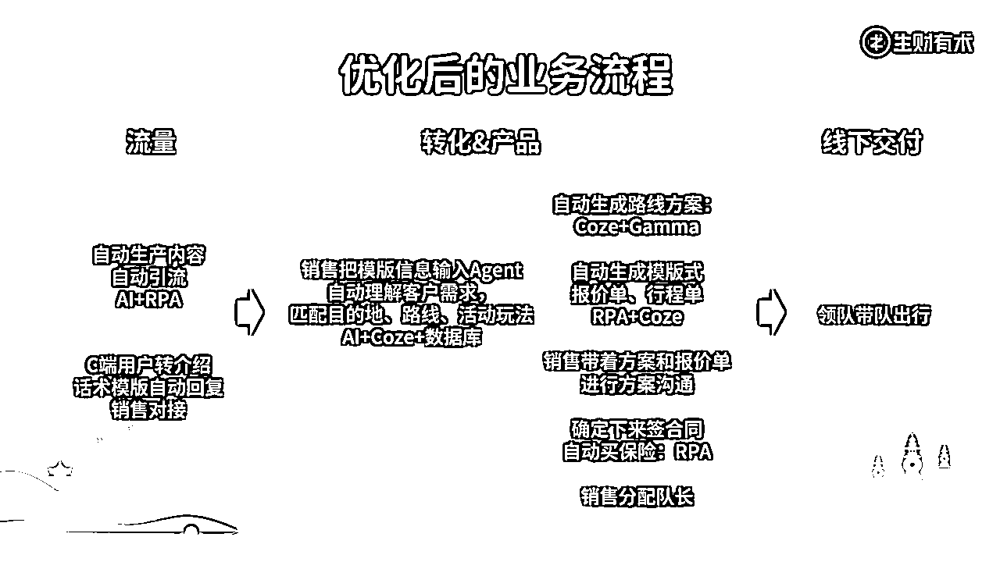

很荣幸成为了第一次航海家航海《AI提效工作流》的教练，经过了这7天，看到很多老板都开始搭建自己的工作流，或者已经拆解了自己的业务，对后续的AI优化方向有了比较明确的方向，还是挺有感触的。总结了一下在这个过程里的一些思考和观点，希望对大家有所启发。

### 1、先汇报一下这次航海的成绩~

先来报告一下本次的航海情况~

50个航海家老板参与了这次的航海，有24位航海家老板完成了两次作业，七天一共直播了四场（包括开营仪式讲了我对AI工作流的理解和业务拆解的思路；Coze的一些基础应用、RPA的一些基础应用和优秀作业的点评），还是有挺多老板在7天里产出了一些小的结果的：

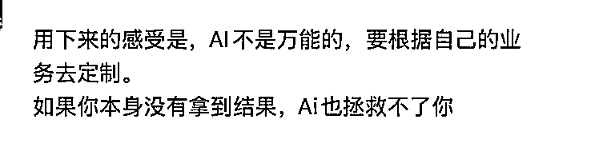

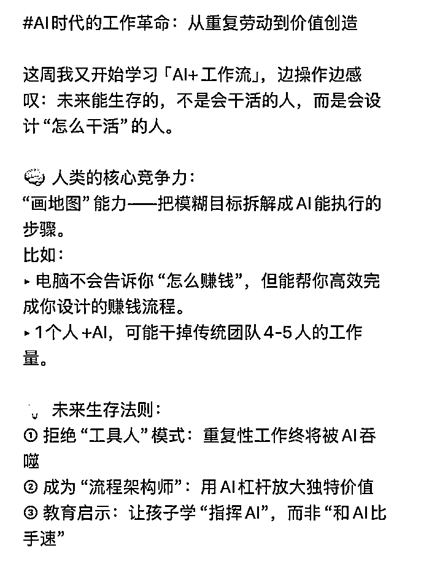

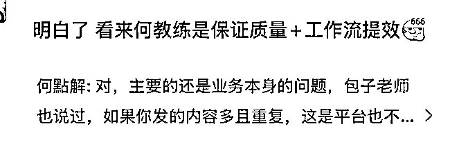

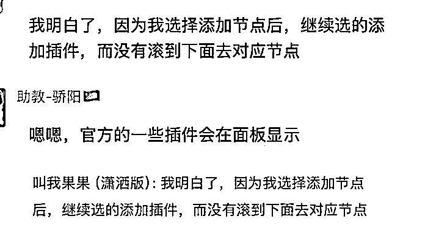

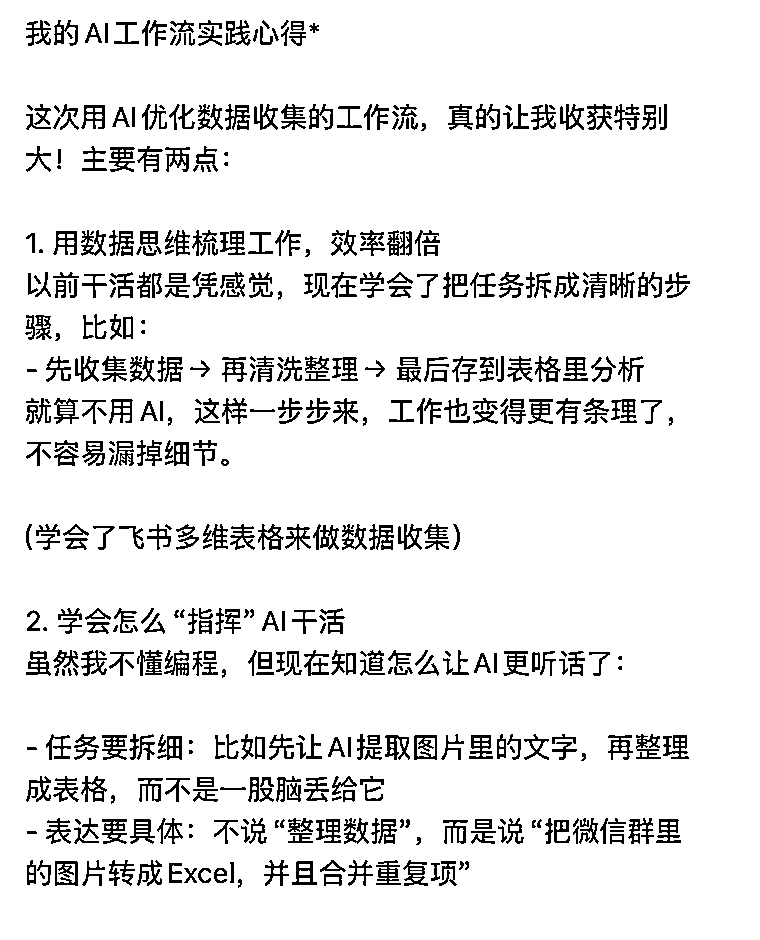

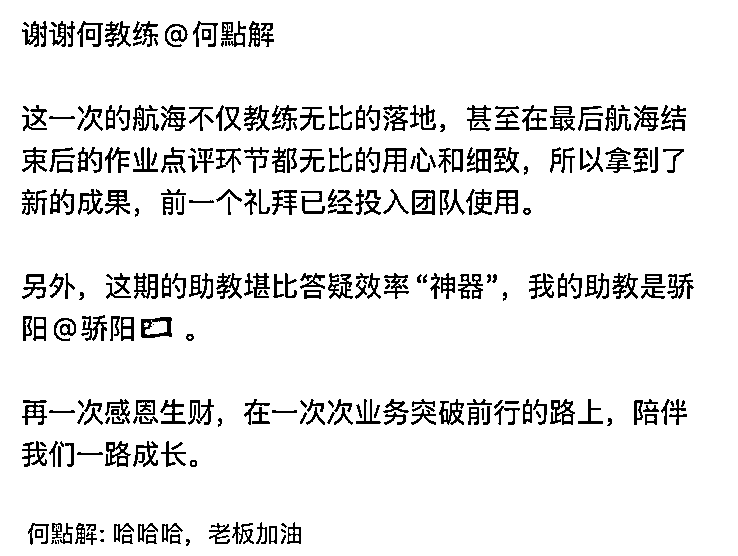

还有挺多老板把工作流真真实实的做出来了，这里就先只贴出三个：

优秀案例分享：

@葫芦妈 老板完成了图生图的coze，能上传一张展会的图，提取展会海报内的学校名字，然后将这些信息做成模版图输出

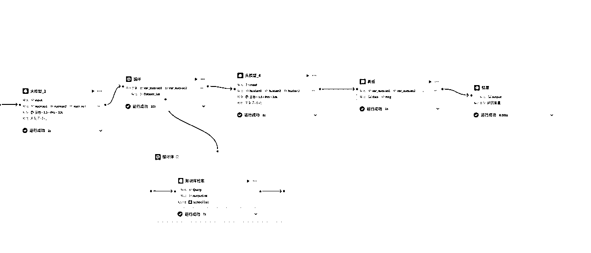

@柏松老板，完成了MBA 课程分析报告写作工作流，通过自动抓取网络信息，将原本 1-2 小时的报告撰写流程，压缩至 5-10 分钟完成，大幅提升效率

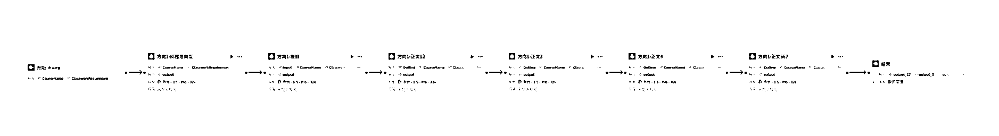

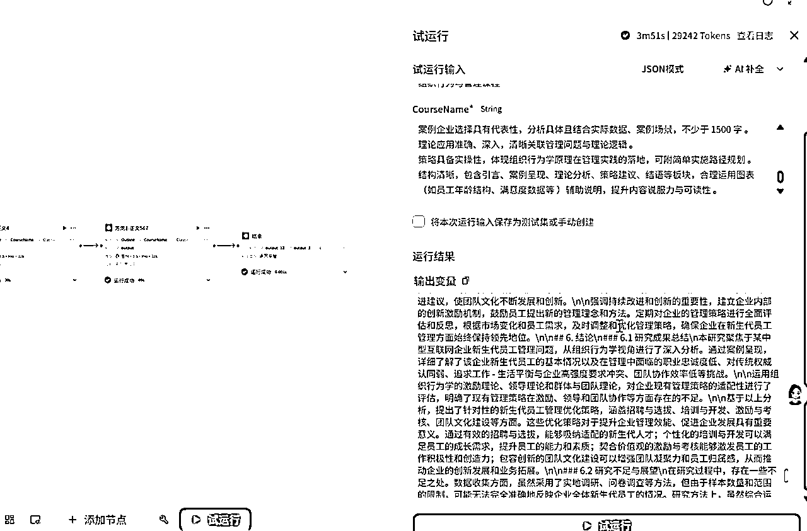

@多米杨老板完成了视频生成工作流的搭建

7天下来，其实会发现大家都有挺多共性的问题：比如业务拆解上比较粗略和不清晰；比如可能对于某个工具的使用不熟悉，不知道怎么使用，卡住在某个技术细节，就很容易放弃了；比如对AI工具到底能解决什么问题不太清晰，匹配不到业务上。

相信这些共性问题，可能也是很多圈友的问题，我就把我自己的思路和想法写出来了：

### 2、拆解业务流是永远的第一步

我们的第一个作业是：拆解自己的业务，也就是将你的业务，变成一个个SOP

在我的理解里，AI工作流需要真实的提效，那必须要从业务场景本身出发去优化，那就先得把原先的业务流程画出来。

从商业模式，到大的业务板块，到小的业务板块，到每个岗位的工作职能，到具体第一步到第N步，你拆解的越细越清晰，你进行AI化的可能性就越大。

你可以把你的每个工作模块变成一份SOP，这些SOP就是你工作的业务里非常清晰的AI工作流，只是从人力的重复，变成AI帮你重复；只是从你在BOSS直聘挑选出优秀的人才匹配到你的SOP执行者里，到你从AI工具海洋挑选出合适的工具让他帮你完成这个SOP。

但后者的成本会相对低很多。

所以如果你苦恼怎么把各种AI工具真实应用在你的工作里，你看到那种酷炫的自动XXX，你第一个动作不是去购买工具或者学习某个工具，而是尝试先把自己的业务拆解的比较清晰明确。再去思考这些工具是不是适合你的业务。这些课程是不是能真正带来实际的效益的。

但是如果你没有业务，你要做的不是做AI工作流，而是先跑通MVP！！！

如果你还没有真正跑通自己的业务，你最应该做的是先跑通你的MVP，AI工作流可以做到的，是更低成本的帮你的成熟业务流程降本提效。

如果你没有自己的业务，甚至你连自己的业务流程图都画不下去的，那建议你先认真的把MVP跑通，把业务的每一个步骤弄清晰。

比如亦仁老大最新发布的「外卖内容推客」超级标，你就可以尝试先把这些流程跑通，再逐一变成AI工作流。

比如用Coze、n8n自动批量做小红书外卖内容的封面图；比如用RPA在饭点定时在私域朋友圈发布外卖优惠券的信息；比如用RPA定时获取小红书外卖相关关键词笔记，然后扔给GPT分析该写。可能你最后可以拥有一个自动化的外卖内容推客Agent。

### 3、新鲜感永远都有，试试先用最简单的工具解决眼前的问题

每天都看看AI传术师群是经常焦虑的，因为他们是一群大卷王，他们活跃在AI的最前沿，每天都会给你带来新的冲击和新的信息量。这些内容对我来说其实还蛮焦虑的，因为我知道这些工具可能更“厉害”，更“牛逼”的工具，我需不需要做更多的学习和研究。

但我挣扎了一会儿，发现永远也学不完！！！每天都有更强更新更厉害的工具出现，所以我最后改变了我的思路，用最能落地的工具去完成这次的航海实操。

这次的航海只简单教了两个工具，一个是Coze，一个是RPA。在我看来，这两个工具对我来说是最实用的，因为：

1、简单易落地：对于一些对AI不敏感的执行小伙伴来说，Ta们要做的就是点击开启，让程序帮Ta们完成一个小任务。

2、不用翻墙：不用下载其他软件，我甚至可以把我的定制方案工具和自动生成报价单的Coze插件发布在豆包，让他们直接在豆包里把这个智能体收藏一下，然后把信息发给插件，自动生成完整的方案或者报价单，在手机也能操作。对于现阶段的职场环境来说，已经是比较能落地的。

3、开发资源丰富：不管你自己会不会做，你只要在生财或者小红书找个做相关工作流的问一问，很多时候就知道你想要的需求到底能不能实现，大概多少钱。

4、教程很多，操作难度低：在生财RPA、Coze都有很多现成的航海手册和精华帖，认真读完，实操过，落地做点实际的工作流真的不难。这两个工具还是很简单易上手的（相对其他的工具而言），特别是影刀还有魔法指令，等于内置了一个Agent，可以通过自然对话解决很多问题。

这次的航海下来，收到了很多老板的作业、实际问题和反馈，结合我自己的实际的经验，我的结论是：90%的业务工作都能被AI自动化，只是程度和形式的不一样。

程度和形式不一样说的是，你对某个业务积累的大量经验，但AI就会相对死板，只能完成60分、70分；你可以思考这个板块到底在业务中是怎么一个重要性，如果是一个无关紧要，但必须要有，6、70分也可以满足，那就可以直接用AI替代（也有很多AI高手就可以调教到8、90分的程度）。

如果你判断这个部分是比较重要，而且需要不断增长和迭代的，那就需要更加要考虑的方向是，如何让AI更好的辅助这个岗位的员工。

像我在做定制旅行项目的时候，留下来的岗位一个是项目负责人，负责管理整个项目和维护迭代各种AI工具，另一个是销售，因为作为ToB的业务，真实感和沟通是非常重要的。

我后来就做了一个客户分析和促单切入点的Coze给他，他可以更好的快速通过1-2次沟通，了解用户的需求和购买卡点，然后将每次无论成与不成的案例再积累成数据库，帮助这个关键岗位更好的增加转化率。

所以如果你也在无尽的AI工具的学习和研究里，可以先把一个工具吃透，然后应用起来，真正能降本增效的工具才是好工具。

### 4、AI时代，我的观察和猜想

所以做完整个项目的AI化之后，我在想以后要怎么将这个项目扩大和团队招聘时，我会发现了我自己会更加在意两样东西：

1、我将要招聘的这个团队成员，Ta会不会AI，是否能把自己的能力让AI放大，或者更加高效的完成更高质量的工作成果；

2、这个人是否具备自驱力、适应力和跨学科思考和学习能力，这些「软技能」的比重，反而会快速的超过是否掌握了什么硬技能等等。

因为我会觉得，在现在的社会招聘环境里，第一个大概率是没有的，那更多的就需要高强度的学习AI、结合AI完成更多事情，那软技能就比硬技能重要得多。

毕竟客观类型的技能，比如推理、逻辑、运算等等，AI比我们这些普通强太多了。那更多的可能就是需要你能不能适应AI时代的变化，能不能主动去学习和创造。

于是，就有下面两条对未来AI时代里打工人的建议：

（1）尽快建立属于你自己的专长技能的工作流、Agent、数据库

上个月我还需要一个实习生每个月要花8天的时间帮我们一个个在保险公司买旅游保险，这个月自动买保险的RPA出来，这个事儿就不用干了。可以预见的是，这种重复、低技术含量的初级技能岗位和工作在未来的一段时间里被快速的淘汰和替代。

于是我就在不断思考，什么是未来能让我们安身立命的能力？

我认为对于个人（打工人、小的副业）——属于自己的个性化（懂你）的工作流、Agent和数据库。

大胆点猜想，有没有可能以后更多的场景，更多的是属于你的那个经过你自己思考和打磨过的各种职场场景的Agent和数据库是否跟这家公司相匹配。你拥有的Agent和数据库可以快速产出公司或者项目需要的内容或者产品。

而对于企业、超级个体——属于项目（更加懂你目标群体）的专属数据库，Agent

如果说对于个人而言，公司和企业会因为你拥有相关技能的Agent、工作流、数据库来聘用你，那我们的用户则是谁的Agent更懂我的需求，就去找谁。

像我们的定制旅行方案的Agent，我们的目标用户是年轻人，就可以从文字表达、定制的旅行名字，定制的团建玩法等等方向去让我们的Agent更加贴近年轻人的需求和审美。

所以最后第二条就是：

（2）客观的事情已经被AI做的很好了，我们要更加关注主观的部分

我觉得拥有了基础形态和模板的数据库和工作流，还不太够，这个想法更加指向你自己喜欢做的事情，也就是「我」想做什么，「我」更愿意为什么付出时间和精力。

要通过不断的深入和研究，去发现那些细微的差异，去挖掘和融合进你的工作流或者你的审核标准里。

比如你可以从AI生成的哪张图「好看」开始，这里好看的定义还需要看你是什么目的的，比如是否爆文？比如是否符合业内高端主流审美等等。

但这些主观的部分，就是存在的。你可以叫它「体感」、「网感」等等。

我们的运营就曾经拆解过同一个旅行目的地的近5000条笔记，相册里保存了13000张同一个地方的图片。能做到快速识别出，现在这张素材爆还是不爆。那她去做工作流的时候，她做的就会永远比别人好。因为她知道什么是「好的内容」。

这个在一个亦仁老大推荐过的B站哲学类「汤质看本质」UP主的说的「品味」。（汤质老师的研究，感觉在AI时代越来越“有用”了。）

更在意自己的情绪，更在意自己的需求，更了解自己的能力，挖掘自己的潜在能力在未来工作环境的优先级就会变的更加高了。（这就不得不推荐一下航海家第二次航海的易仁永澄老师的AI心力教练。）

最后，如果大家也在在自己的企业或者项目落地AI工作流，或者有更多AI工作流需求的小伙伴，欢迎多交流！我们一起生财有术！！！