# 电商卖货保姆级实战手册（个人玩法/团队玩法0-1/1-10必看）

> 来源：[https://gvnaena9t3p.feishu.cn/docx/DSvWd0pPLoYJ5DxdCuVc5Vran8c](https://gvnaena9t3p.feishu.cn/docx/DSvWd0pPLoYJ5DxdCuVc5Vran8c)

先做一个自我介绍，Hi 我是晴子，97年女生，有13年的创业经验，我做过20种赚钱方式：初中卖手机流量卡、刷单、美甲、直播、电商、外贸，工厂、实体踩坑，再到今天探索更长期可持续的事业，这个过程是我不断试错、不断进化的成长轨迹。

我的公众号：晴子bosss

v: profits99

我是今年6.18号加入生财的，首先谢谢吴泽承学长带我加入生财有术。同时也感谢北京的圈友吾悦厅的小伙伴们，王子冯老师，和戴巍老师鼓励我从家里办公走向办公室 哈哈。

内容比较长，全文有1w字左右。

### 我的赚钱启蒙（2012-2013）

起初是初中暑假，我想去做暑期工，然后我妈给我找了一个影楼下乡的工作。工资一天20元+销售提成，工作时间就是早上7点-晚上8点这样，我就干了两天，因为受气，也觉得给人打工赚不到钱。就不做了，现在想想，那时候也是不敢开口说话，不敢跟别人推销产品。

2012年靠卖手机流量卡开始赚钱，见证了2G，3g，3g+，4G的互联网发展。为什么卖手机卡，我不太记得了，可能是我家里人比较信玄学，那时候有数字能量学，什么手机尾号13131好啥的，所以那时候玩贴吧，就找卖手机靓号的，然后后来又看到别人在贴吧卖流量卡，我就加了那个供货商的QQ号，然后我就开始了赚钱之路。我卖手机卡的获客是通过贴吧，是通过这种渠道卖的，我家里也支持我，我上学的时候有人过来拿手机卡都是我家里人帮忙送出去😂

2013年做淘宝唰单，一开始是我姐做，后来变成了我放假去做，然后就一点点的从唰手到主持到自己开团，自己开团可能有七八百个会员，我们有20个主持，还都是需要跟我们付费的，一个主持收600块。

那时候用的YY语音，我记得放寒假，我就在家里放单，从早上十点起来干到凌晨四五点，每天重复，做主持赚钱多的时候就是一天1千多，应该持续了一个寒假。 后来开团，招主持，主持的来源都是这些刷手，然后就把客户的单子分出去，说到这个，我觉得我们人缘可能好一点，有很多转介绍的客户，那时候一天能接几百单。单子一多，自己把订单组合打包给会员唰手，打包做单子佣金可以给低一点，那多出的钱就自己赚钱了，积少成多，大概这个过程。

### 美甲生意（2014-至今）

我姐做微商比较早，唰单就是在做微商之后做的，那个产品我记得叫涵曦瘦腿，瘦脸针，排毒什么的。不知道还有没人知道这个产品 😂 这个微商获客有软件可以导客户到微信上，128元加一两千人，但是真可以卖出东西，就是别人主动加你，我们也加满了几个微信。

2014年底，2015年，2016年做美甲贴纸，这个是做微商，做微商也是我姐开始做的，我们就一个月做了最高等级，卖了几万贴出去，这个美甲产品就是天一冷，就好卖，冬天是最赚钱的时候。

2016年底，2017年做穿戴甲， 为啥能接触到穿戴甲，因为我那个时候就开始付费进圈子了，有一个叫贸哥做外贸的，别人找他发朋友圈广告，我看到了，就加了微信。然后我越看越喜欢，所以我就和我姐说试试，我那个时候念书做事拿不到主意的，就得靠我姐，一开始我姐说不做，后来我让我姐发朋友圈试试，一发就激活了好多人咨询，因为做微商不是有美甲贴纸的客户嘛，而且我们有几个微信，所以这也成了铺垫吧。

美甲这个行业我做了十年了，这个也是让我以及我的家庭改变命运的生意。我们赚了大几百万。家里买车买房，自己买固定资产，都是靠这个穿戴甲赚的。

### 短视频 & 直播（2016-至今）

2016年做快手，2017年做抖音，2018年快手抖音能直播的时候，我都有做，每次都赶上了时代的风口，也拿到了一些成果。2019年后在国外念书几年，接触了外贸，所以我就做了穿戴甲跨境出口。

一开始做快手的时候，是我发起的这个美甲短视频引流，平平无奇的就火了，然后引流到微信里。

后来我们带了很多代理拍短视频。我们也踩过很多坑，封了很多号，有20几个。比如哪时候发一个作品，一下子就热门了，然后修改资料留微信，因为想引流到微信上嘛。号就立马封了，作品也不推流了。 这种情况踩坑很多，最后得到了一套流程，然后我们引流到微信上有几万人。当时我们也带了几十上百人年入几十万。

2018年底好像出来的抖音直播，最多的时候一天赚10多万，持续一段时间。 现在直播也在做的，这个穿戴甲直播成了自己吃老本的一个行业。

2019年出国读书，正好疫情，有时候在家上课，也不出去，就刷短视频。 emmm，哪时候我搬运国内视频，然后TikTok也涨了很多粉丝，一天涨1万粉丝那种，有18万粉丝，评论区都是问怎么买的，不过那时候我没利用好这波资源。

其实那个时候就知道有独立站这个东西，就是把链接留在Tiktok的签名处，他们会自己去下单。那时候有人专门做教学，四五千的学费，还一件代发。 而且教你发视频，那时候发视频赚美金，也是靠视频堆量，可能就是现在说的中视频吧？ 我那时候犹豫了没学，有时候走在路上我就感慨，当时为啥没做这件事。

### 开厂 +实体踩坑

我自己也开过穿戴甲工厂，开工厂这里我也踩过坑: 可以具体讲一下，我是在疫情那几年做的工厂，其实疫情的发生让互联网行业加速发展了的，也让出口跨境电商加速发展了。我那时候决定做工厂也是因为出口订单特别多，那时候也是想赚一笔钱。刚开始决定做就投资了七八十万做货，开始的时候是赚到钱的，因为供不应求，后来货越做越多，囤货的资金也越来越多。再加上疫情的时候封控，我们国外客户的订单发不出去，面临违约金的风险，那几个月天天失眠睡不着觉，真的压力特大。

然后我为什么能扛下来: 就是我做了风险分流。 我找几个关系好的厂家商量，我说能不能把货发过去一些，减少一点风险。就是这个城市仓库发不了货，就让另一个仓库发，因为那时候总是动不动封控，所以这个决策当时也救了我的。

我记得是2022年11月全面放开的吧？ 那时候我就决定不做工厂了。 把美甲库存全部低价出掉。运气好的是，这个事情没有亏钱，但是也没赚多少钱。而且后面市场越来无法卷，当时决定不做是对的。 2023年我还是继续做零售，因为相比重资产ToB，零售更灵活、轻资产、风险可控。

实体踩坑经历：2023年10月在中关村接了一家别人转让的美甲美容店，做了一个月，迅速转出，一来一去就亏了五万块钱。 亏损原因就是想当然的觉得能赚钱，没有实地坚持考察一段时间，头脑一热就做了，实打实的也亏钱了。 实体店要坚持做一段市场考察才能考虑是否去做。

### 其他项目：外包客服团队

我在2018年也投资过一家外包客服的公司，接待各电商平台的售前和售后，现在也一直在做， 如果有需要这方面资源的也可以联系我。我们服务上挺不错的。有的客户会和我关系比较好，和我说的比较多，好多我都经历过，所以我会力所能及的提出建议，基本都有一些收入上的增加。

有外包客服需求的圈友也可以联系我 v: profits99

### 我的现在和未来

这些年做过很多行业的0-1，但是没有发展团队！！这个是认知上的不足，因为我是小城市生活的，全靠自己琢磨做事，也幸运踩中过一些风口，赚到了一些钱，有了些积累。

但我也很清楚：过去靠的是“敏感+执行”，未来要靠“认知+复利”。

目前正在重新打磨自己，探索长期、稳定、有复利的事业模式，也希望能和更多朋友、圈友一起交流、互助、成长。

* * *

以下是正文：写这个内容的背景，今天有个姐妹和我聊天，她是做服务类型的，然后现在多了一个卖货的想法，但卡在了发货、客服这些电商后端流程上。我觉得这个电商后端流程应该是人人都会的！！ 没想到她年入百万大佬，居然不懂这个流程，这份笔记专门来拆解选好产品之后的所有电商后端操作流程，包括包括订单、客服、发货、仓储、盘点、财务、售后和一些真实经验踩坑分享（如打假风险），适合个人卖货/团队初创 从0-1，1-10。

# 一、我的观点：电商卖货并不复杂

我觉得卖货很简单，自己发货也很简单，朋友们不用被还没开始就觉得流程很困难的想法吓到。

最关键的是你得知道每一步要做什么，不要边做边试错。只要理清每个环节、梳理流程和预期，再配合一些靠谱的工具与策略，就能把卖货做得很轻松，甚至可以做到自动化。

# 二、订单系统与自动化

如果你做了多个店铺平台，比如抖音、小红书、淘宝、拼多多，那怎么实现合并发货？

### ✅ 多平台怎么合并发货？

我使用的是风火递第三方打印系统，它可以同步多个平台的订单，并在一个后台统一处理发货、打印快递单，非常方便。（打单软件仅供参考）

如果你平台不多，也可以一个个后台去操作。但如果店铺越来越多，建议你使用合并打单系统或者ERP系统，比如聚水潭什么的等，能提升一些效率。

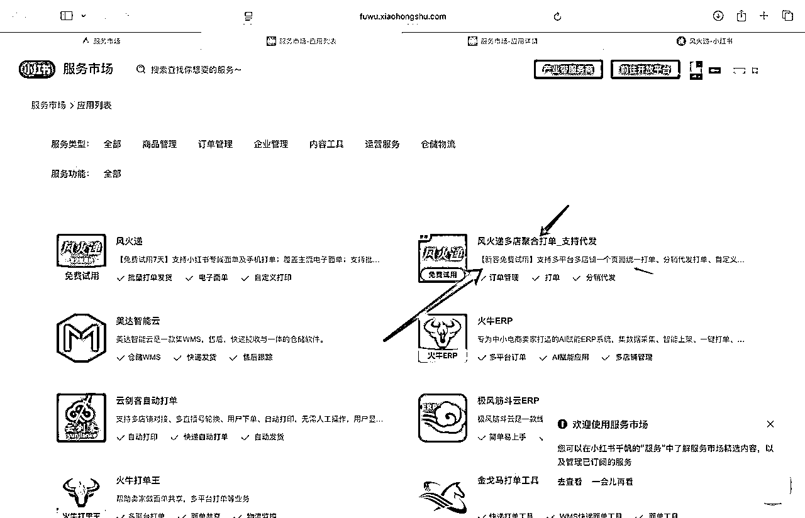

# 三、客服体系搭建：怎么省力又专业？

### ✅ 标准话术模板：

因为我卖穿戴美甲的很早，算是最早的一波，市面上也没有人做这个产品，所以我是自己整理的常见问题话术。

那现在很多产品基本都有商家去做，如果你想整理话术，你可以怎么做？

我的建议是：你多咨询一些同行店铺，10-20家起吧，把客户常问的问题都咨询一下，把他们好的回答，整理成你自己的标准话术模板。

一些常见的问题就是：

1、什么时候发货？什么快递？偏远发不发货，以及偏远运费？

2、产品怎么使用？ 如果需要具体流程的，你可以录一个自己的小视频发给客户。

3、产品规格（如尺寸、颜色、材质、型号等）和功能细节。

4、商品的库存情况，是否有货、何时补货。

5、商品的保质期（针对食品、美妆等）、生产日期。

6、商品与图片/描述是否一致，是否存在色差、瑕疵。

7、退换货政策（期限、条件、是否支持无理由退货）。

8、退换货流程（如何申请、是否需要承担运费）。

9、商品质量问题如何处理，是否可以补发或维修。

10、店铺当前的优惠活动规则（满减、折扣、赠品等）。

这些问题是适合大部分产品的，覆盖了客户从浏览商品到售后的疑虑，也是电商客服日常处理的高频咨询内容，你还需要整理你自己产品的常见问题，建议把你自己整理的话术做出一个word文件，以便随时查看。

如果出现售后，我一般不和客户磨叽，比如他要退货，那就退好了。我这边没有开运费险，而且穿戴甲是可以二次销售的。或者还有一种方式就是他要钱，就是想让你补偿点钱，那就3-5块不等，看自己的产品单价。

### ✅ 标准化产品建议使用外包客服：

三张图片内容仅分享哈。这个是我几年前写的一个使用外包客服的好处，以及外包客服能提供什么服务的一个内容。可以参考你是不是也有这样的烦恼，我的外包客服公司服务不错，以服务为基础的，毕竟好的客服让你少几个售后单啥都有了。

需要外包客服的圈友可以加我微信：profits99

总之就是: 该别人赚的钱要让别人去赚，自己搞搞内容，提高产品销量才是王道。

1.  现在各平台考察回复率比较严格，如果超时回复会扣钱，如果你咨询量一天超过10个，并且利润不错，那我就建议你使用外包客服，别自己受这个累。

1.  如果你已经在做电商，并且咨询量比较多，是自己找的员工，那我也建议你外包，哈哈。其实这样的客户我见过很多，长期的员工是需要上社保的，并且一周肯定会休息一天，有的公司是休息两天，那么这两天的工作量谁去做？要么别的员工替补，要么老板下场。但是外包客服是一天服务16个小时的，而且全年无休，你想想这个时间做什么不好。

1.  有的老板说，我觉得外包客服服务的不好，这一点我觉得不需要怀疑。其实外包客服可能比自己还专业。

1.  自己回复客服比较受气，容易得结节哈哈。而且客服是流动性比较大的一个行业，需要经常招人。

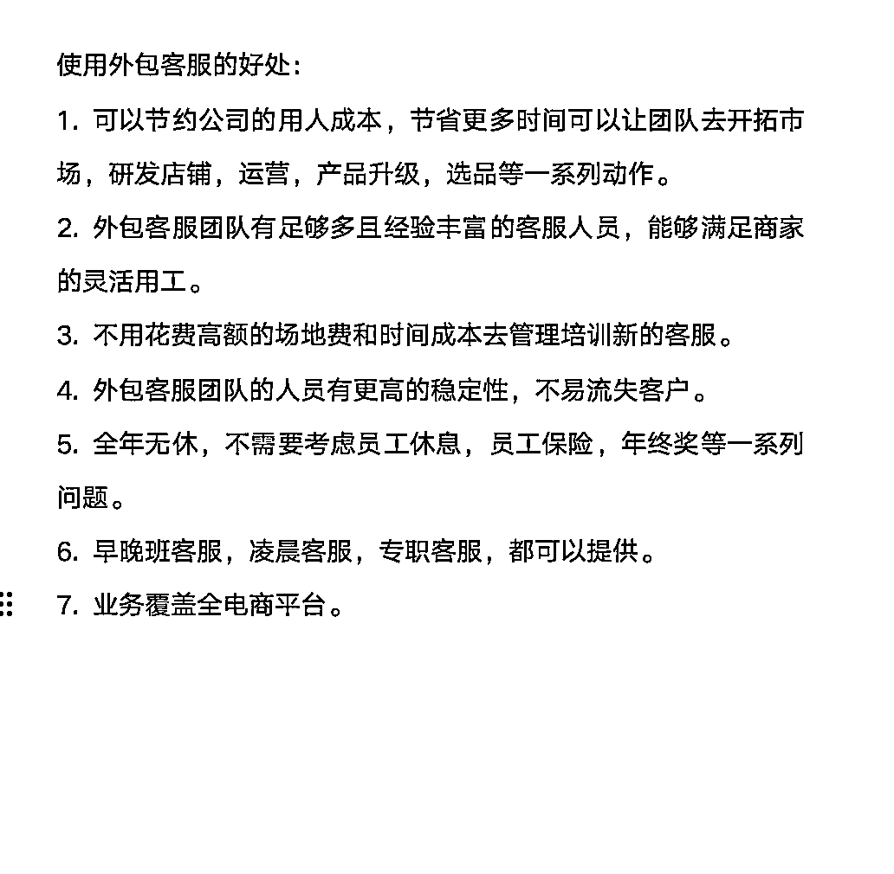

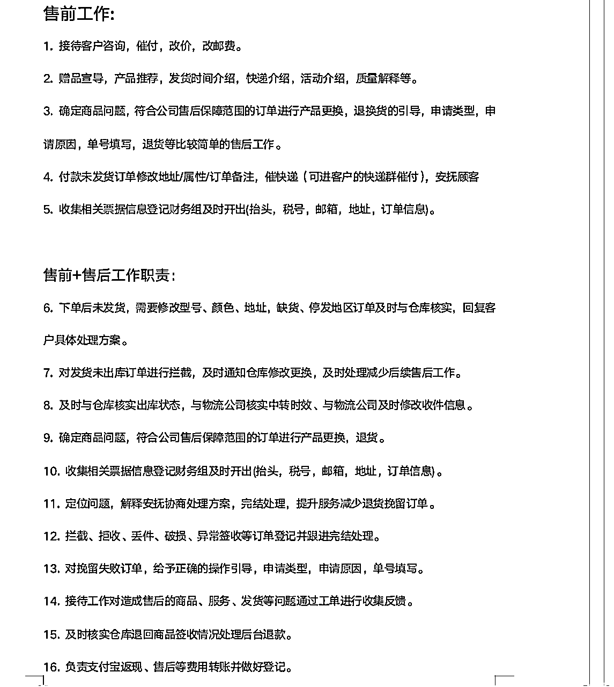

### ✅ 关于差评应对：

现在差评没有办法避免，也没有办法删除评论。我一般会在发货时放一张小卡片，是产品使用教程，但是我不引流微信上。教程说明得很清楚，如果他还是不会，就引导去联系客服，基本上能大幅减少在使用过程的这个差评。

至于快递慢的差评，建议你每天打开物流系统监控一下物流异常的，如果遇到物流卡顿的情况，第一时间联系快递的客服催物流，如果物流几天没动就给客户进行一个补发，拦截之前的快递。

这个补充一点：如果平台不查的话，还是可以好评返现的，或者你用其他方式，让客户加到你的私域。我在小红书买其他人的水果，对方客服直接加我微信，估计是在后台订单看到的，产品收到了也是放了小卡片，然后会拉到群里。

# 四、发货流程详解：自己发货 vs 工厂代发

你要先决定：你是要自己发货，还是一件代发？

### ✅ 一、自己发货要做的事：

1.  谈快递价格 找你当地快递网点谈价格，一般可以谈到2~3元一个件。

1.  买打印机，买打包盒子或者气泡袋，还有胶带，记号笔，小刀等这些常见工具。

1.  发货过程中的 捡货 + 打包 + 贴单 打印快递订单 → 按照订单去仓库捡货 → 打包 → 发货。

1.  如果你产品价值高，你可以增加一个质检，二次检查产品的过程，打印拣货单 → 按照订单去仓库捡货 → 质检 →打包 → 贴快递订单 →发货。

1.  退货怎么处理？ 客户退回来就寄到你这边的仓库，你检查一下是否还能二次销售。如果能卖，就恢复库存；如果不能卖，就登记成损耗，记下产品的成本和运费。

### ✅ 二、一件代发的流程：

1.  怎么找代发厂家？ 建议去1688上找超级工厂/实力商家，因为这种店铺一般是自有工厂，供货稳定，没有中间商加价。

1.  代发成本大概多少？我这边经验来看，代发打包+快递一般控制在3-4块钱以内是合理的。

1.  退货怎么处理？ 跟厂家提前确认退货地址，客户退货直接退给工厂。二次销售由厂家判断，你自己只要做登记就行。

这个也说一嘴，常规流程基本会拉群发货对接，然后有退回的产品，工厂客服会直接把退款金额发出来，➖掉运费哈。比如产品成本23，运费3元，那工厂的客服在群里说的应该就是退款20元。 下次付款抵扣掉就行。

1.  产品成本怎么谈？ 可以在1688谈，也可以加厂家的微信，如果你已经在做内容，比如你的小红书订单截图、账号主页发给他看也行。但有的商家其实也不看，就看你下不下单。

以下4张图片示例，怎么判断是不是工厂：

图一：实力商家，图二：超级工厂。这种基本都是厂家，货源稳定的。因为实力商家一年4万块。超级工厂一年20万，非工厂大概率不会花这个钱。

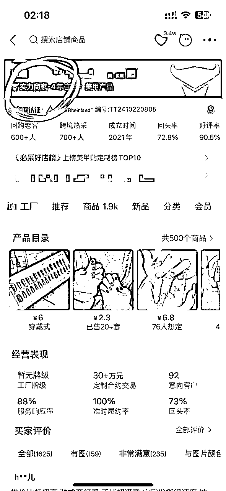

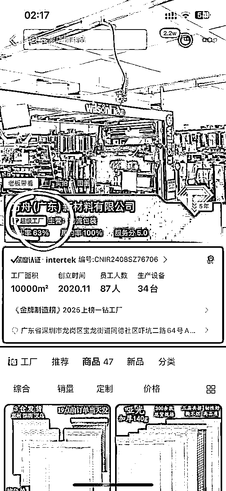

图三：大概率也是工厂，开店11年了。

图四：无货源玩家，这种你就尽量避免吧，他们也是赚中间商价格的，就是货源不一定稳定。

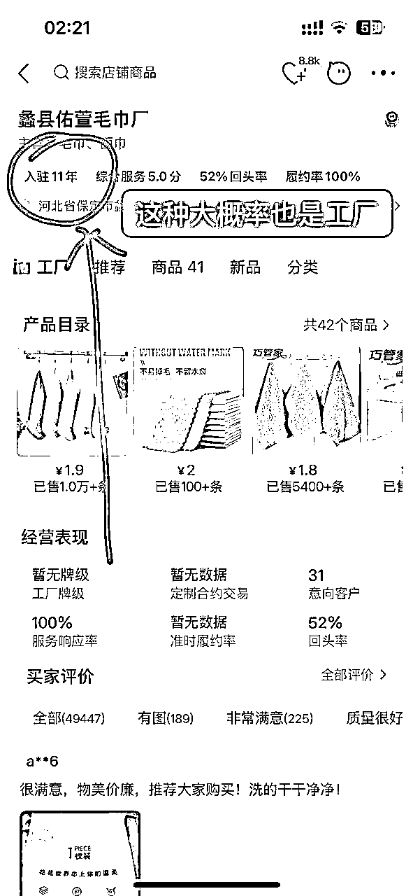

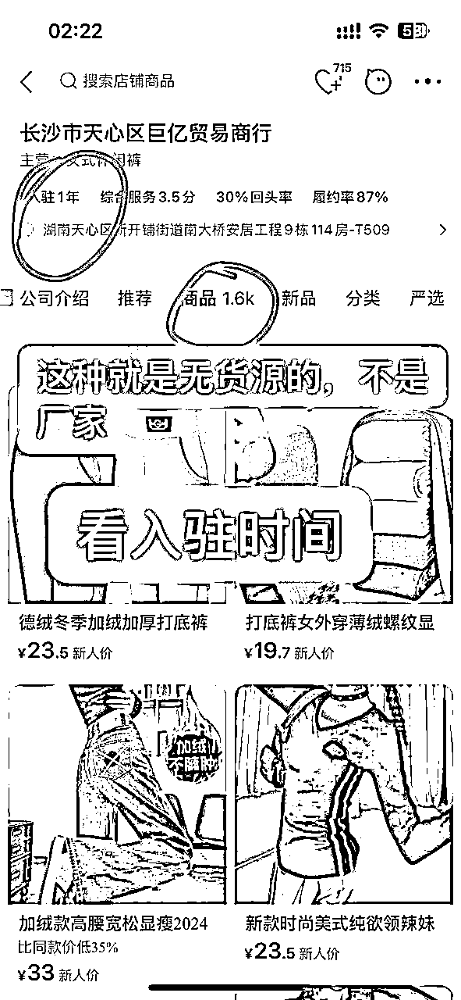

### ✅ 三、如果订单多，怎么自动化？

如果你每天有几十甚至上百单，不建议你去1688一个一个下单，你可以使用第三方平台工具（比如小红书 →服务市场 →找到可以同步给工厂的一个软件 →购买服务 →一般一个月20块钱）同步订单给工厂，然后工厂发货，你的后台也自动发货了。或者工厂打出单号，需要你自己手动点一下发货。（这个软件参考一下，别的软件也可以用）

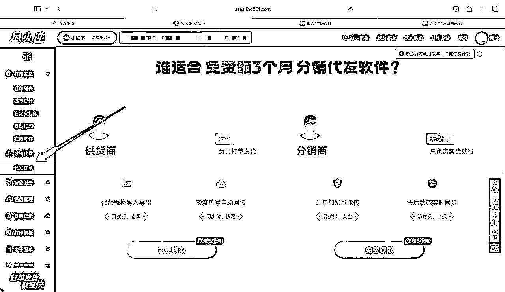

### ✅ 四、和工厂打交道的建议：

我作为一个开了8年1688店铺的商家，我愿意配合别人代发，但你别太麻烦我。很多人上来就问价格、细节、授权、售后，一大堆问题，其实我订单量不高的合作方我是不太愿意聊太多的。不忙的时候跟你聊聊还行，忙的时候根本没空接待！！！

所以你要做的就是（我的个人见解哈）：

*   把想聊的问题提前整理好，集中沟通； 建议可以打个几分钟电话，就谈完了。

*   不要一上来压价；工厂给出一个合理的价格即可

*   厂家愿意合作，一定是你让他看到你长期能出单的潜力；

*   一开始让他们多赚点钱没关系，商家看到你有订单之后，你后期谈价格谈降价才好谈的。

*   所以你有了稳定的供货厂家，就一心去搞内容，价格高点没关系，一般也就多几块钱成本，先做起来，尽快提高订单量。

你有了单量和谁去谈价格都好谈，再给一个提示，就是一个产品会有好多家工厂去做。这个我建议你们多储备几家工厂，就是别把菜放一个篮子里，多少让对方沾一点利润，让其他工厂眼熟你。如果一个爆品你代发的工厂没现货了，那你不完犊子了嘛。所以这就体现了储备其他工厂的好处，不至于让你两眼一抹黑😊 立刻找备选工厂就🉑了。

或者是爆品厂家突然加价格，你也可以找备选工厂，不至于被人拿捏🫴。

### ✅ 五、厂商分销方式也值得考虑：

你可以直接问厂家：「你在抖音/小红书有店吗？能不能我帮你分销卖，你给我佣金？」

这样你连售后都不用管，还能赚差价。非常适合新手、内容博主或时间精力有限的创业者。

# 五、仓储与库存管理：怎么管SKU和滞销品？

如果你的SKU比较多，建议：

*   每1-2周盘点一次；然后同步更新产品库存，这样对产品有一个很好的掌控力，基本也不会出现卖超的情况。

*   如果库存出错（比如卖超、发错）就很影响发货，如果遇到你库存卖超，厂家也没有现货的情况就尴尬了，这时候你货发不出去，会特别影响消费者对你的信任以及店铺评分。

*   所以你掌控库存情况，一旦出现产品增加，但是你又没有现货库存的时候，也可以及时改预售，能有一个应对突发情况的准备。

### ✅ 滞销品怎么处理？

*   首先你可以当赠品送出去；比如他买了两件商品， 你给他放一个赠品。

*   还可以引流促销，低价卖出去。

*   或者打包成「组合装」变成新产品。总之就是控制产品数量，控制投资成本。

# 六、财务与对账

电商不是做得多卖的多就赚钱，而是你把每一单的真实成本和利润算清楚了，才能知道自己值不值得继续干下去。

### ✅ 1\. 财务记录频率

你可以选择每天记账，或者每周/每月汇总一次也可以，关键是一定要有系统的账单核对流程。这些账目不能凭感觉来算，一定要落到表格里。

要记录的费用项包括但不限于：

*   产品成本价

*   仓储费用（不管是租仓还是外包云仓）

*   快递费用（每单平均价格）

*   包材打包费用（胶带、纸箱、泡泡袋）

*   人工费用（计件打包或小时工）

*   平台扣点（如小红书、抖音的技术服务费）

*   推广费用（如投流、达人佣金）

*   仅退款损失（客户不退货直接退款）

*   退货成本（包括运费+商品能否二次销售）

*   **运费险（如有）

*   杂费/差评补偿/赠品

虽然不能算的一清二楚，但是要有80%的归纳，这些全部合计后，你再拉一张表，看自己每月的净利润是多少。

怎么算净利润：把你卖的订单导出表格，留出日期，数量×价格=总金额。

在减你所有的支出成本，最后得出净利润。

做电商不可能100%算的清楚，按照我上面提供的信息，你基本能算清楚你90%的账。

### ✅ 2\. 退货登记与损耗处理

退货退款这部分不要忽略，要每天做登记，别等月底一看：哇怎么利润少了这么多，才想起来很多货都退了或报废了。

我的处理方法是这样：

*   如果退回来的产品还能用，就直接重新入库，再次销售；

*   如果不能用了，就登记成“损耗”，并计算这笔损耗对应的成本（产品+运费）；

*   同时更新库存，不要账面看着有货，其实已经卖不了了。

### ✅ 3\. 自己的案例：省钱从细节做起

1.  快递箱子可以选择购买二手，这里的二手纸箱是指全新的，比如纸箱上印刷了他的产品名字啥的，他们不用了，就会把箱子卖掉，然后再次流入市场。

比如你买东西，买的洗衣液，对方用面包箱子给你发货的，这就是对方用的二手纸箱📦。

成本上在分析一下：

快递包装箱子成本，如果你每天发 100 个快递，普通快递箱子一只 0.2 元，那就是每天成本 20 元，一个月 600 元；但如果你提前去找二手快递箱商家采购，比如0.15元一只，

一个月你就能省下 150 元，一年就是1800元。

那你快递多了就更不用讲了，能省很多钱。

1.  我妈常和我说，做生意赚钱要精明。所以我们穿戴甲的退货，如果产品不能用了，或者是数量不够了，那我就会和其他不能用的产品组合，最后换成新的包装当赠品送出去，就不会扔掉。（仅供参考）举一反三，看看你的产品是不是也能二次组合一下，别浪费东西。

# 七、售后与纠纷处理机制

## 售后、退款、退货、换货完整处理流程（实操经验分享）

电商一定会遇到售后问题，尤其是退货、换货、破损这些，如果你没有标准化处理流程，很容易影响你的心态、店铺评分，甚至产生经济损失。

下面我来给大家讲一讲退换货的整个流程，全部都是我的真实经验。

### ✅ 一、退货退款流程（含无理由退货）

如果你在意处理速度和客户体验，那建议你：在客户退回的商品有了退货物流的时候，就直接给他退款，不要拖延。但是很容易被薅羊毛。

比如你发给客户的是产品A，他退回来的时候，包裹里装的却是一个破布、泡沫、或者根本不是你的产品。这种贪便宜的情况真的特别多，做久了你一定会遇到。

所以我建议：一定要有退货验收环节的录像或监控！ 建议仓库安装一个监控或者每次收货时用手机拍一段视频，这些证据可以在平台申诉时上传，保护自己不被乱退款。

如果退回来的货物不能二次销售怎么办？

这种情况我一般也是给客户退款；这类损耗我已经习惯了，尤其是你快递量多了之后，这种情况你挡不住的，处理效率更重要。

### ✅ 二、换货流程（发错货/破损/错颜色等）

换货这件事，完全看你的商品价值来决定操作策略。

操作建议：

*   如果产品单价比较低（比如卖价10~20元的产品、饰品、小工具）建议直接送给他，因为你成本可能就几块钱，然后再补发一份新的产品。这样客户满意、口碑好，你也省去物流麻烦，如果她退货回来，他那边运费十块钱的话，你还要承担她的运费，里外里还不如送给她划算，最后总体上你还是有的赚。

*   如果产品比较贵（比如单价五六十、上百元） ➤ 那就安排客户退回原产品，你承担来回运费，再重新给他换发新的。

### ✅ 三、快递途中破损 or 发错怎么办？

*   快递破损：先让客户拍照外包装箱子，在拍照产品是否损坏。如果部分损坏，就给重新补发。如果客户不接受部分补发，那你就只能全部补发了，不讲理的客户比较少，但也会遇到。

*   发错货：你可以选择送给客户（当赠品）+ 再发一次正确的；或者让客户退回再补发。

*   如果快递丢了：那你可以找快递公司赔付。

所有这些成本，包括补发、赠品、物流费，全部都要记入你自己的财务系统里做售后记录。

### ✅ 四、投诉、平台仲裁、仅退款机制怎么应对？

这个问题非常重要，因为你再认真，也难免遇到客户恶意投诉、而平台大概率也倾向客户。现在所有平台都有“自动仅退款”机制：客户申请后平台直接退款给他；你都不知道，钱就没了。

所以你要做的就是：

*   每天早上定时检查售后后台；看有没有出现“仅退款”记录；如果有，就点击进入【申诉入口】，把聊天记录、监控视频、照片证据上传，有机会追回平台给你的补贴款项。

很多人根本不知道“这个钱是可以申诉回来的”，白白吃亏了。

# 八、自发货人工打包的工资机制（参考）

如果你选择的是“自己发货”，就会涉及到人工成本的问题。人工成本虽然不高，但如果没有提前规划清楚，也会导致效率低、出错率高、算不清账。

这里我结合自己的经验，给大家做一个详细拆解。

### ✅ 一、打包工资的两种计算方式

1\. 计件制（适合快递量大，操作简单的情况）

单人打一个快递：0.3元/单，两人配合（拣货 + 打包）：0.6元/单，比如一天出100单：打包成本就是60元，这种适合极小件的产品。

优点：

1.  有激励机制，干得越快工资越高；

2\. 成本清晰、效率高、不会偷懒。

2\. 小时工（适合快递波动大、操作复杂的产品）

*   兼职小时工工资参考：15元/小时（河北老家的参考价）

*   北上广或一线城市可能在 20–25元/小时

适合临时忙不过来时应急补人，或者量不大但希望稳定交付的时候。

### ✅ 二、产品复杂度决定打包工资

如果你产品结构简单（小体积、无多件组合、不易碎），用计件就很合理。

但如果你产品体积大、结构复杂、打包要求高，比如：

*   需要加泡沫板/防震垫

*   高价值商品（易损、需要封条）

*   要做多层打包或防拆处理

那建议给员工按件加钱或提升时薪。比如一单成本可能需要 0.8～2元不等。

### ✅ 三、打包流程参考

以穿戴甲为例，我们整个发货环节是两层流程，总共两到三人配合完成：

标准配置：

*   拣货员：按照快递单的备注去仓库把商品找出来；放框子里。一筐为10组，十个快递单，在继续下一组的

*   打包员：根据订单核对商品后，进行打包、贴单。

*   质检员（可选）：如果你产品价值比较高，你可以加这个质检步骤，检查产品是否选错、是否有瑕疵，再交给打包员。不过我没有这个步骤。

这种操作配合下来非常高效，100单大概1.5小时就能完成，而且几乎不出错。

### ✅ 四、人员安排建议（按快递量灵活配置）

### ✅ 五、工资成本核算参考

人工打包成本可以做个参考哈。

# 九、定价与利润模型对比：别卷价格，卷毛利！建议产品利润率40%+

### ✅ 一、拼多多模式下的“看似赚钱，其实在亏”的运营流程

我身边有一个朋友，他就是典型的“看起来卖得多，实际不赚钱”。我给大家复盘一下他每天的运营流程：

拼多多卖货流程：

1.  产品售价：10元，产品成本：5元（货不太好，仅退款挺多的），运费成本：2元（商家包邮），推广费：2元 点击下单。

➤ 表面利润：10 - 5 - 2 - 2 = 1元，每天出单1000单

一家人从早忙到晚打包发货，但是人工成本没算，打包物料没算，售后损耗没算（例如拼多多的仅退款、破损、退货不能二次销售）

1.  仅退款和售后

拼多多平台经常不通知商家就直接退款，有时退回来的不是商品，是破布/垃圾，一单损耗接近10块钱

1.  实际情况：每天出单1000单，看起来风风火火，实际根本不赚钱，甚至在亏钱

### ✅ 二、如何重新规划赚钱型运营流程？（我实操帮朋友改造）

我后来帮这个朋友把产品搬到了小红书平台，做了一整套调整后，利润大幅提升，下面是改造后的流程：

📋 小红书盈利型运营流程：

1.  选平台 + 内容发布

把同一个产品同步搬到小红书，定位人群，不投流，靠内容出单（节省推广费）

1.  重新定价策略

售价提升至29.9~35元，对应客户接受的溢价是：体验感、内容信任和包装感

1.  精准核算每一单成本

我把他这个产品提高了质量，所以产品成本：8元

1.  实际利润测算：平均售价：29.9元，实际毛利：约16元，毛利率：约53%

1.  数据反馈：每天出单50单左右，不投广告，每月净利润近2万左右。

### ✅ 三、对比流程：赚钱模式 vs 卷死自己的模式

这一点也特别强调大家做产品，要利润高一点，没必要去卷价格，卷低价。卖货利润至少得留个30%-40%吧？不然出现问题给客户补发的话，还得亏钱，如果你保留利润空间，你怎么操作都不会亏的。而且过的很舒服，很滋润。

# 十、最重要的一个补充：个体户请务必避开打假风险！

这是真实经历，我亲身踩过坑

如果你是个人店铺（用身份证开店）——一般不会遇到打假人。

但如果你用了营业执照注册（个体户），你就变成了一个有法律责任的“经营主体”：

⚠️ 打假中招的真实流程：

1.  你用的是别人没授权给你的商品图

1.  产品属于三无产品（指：生产日期，有效期，失效期）

1.  使用了极限广告词

这三个问题比较常见，一般是举报到市场监督管理局，然后工作人员联系你。这个打假的最终处理流程就是：你赔钱，至少500块。隐形成本就是打点市场监督管理局的人，需要送礼。

但是你遇到了也不用害怕，没什么事。我2023年去了市场监督管理局6次，一两个月去一次，一开始我去的时候说话都哆哆嗦嗦的，腿还打颤，我哪里经历过这种事情，生怕自己赔偿多少钱。实际上没什么事，除了三无产品无法协商，别的都不用赔钱。 后来在遇到这样的问题，我就坐沙发那跟工作人员聊天，而且他们也都认识我了，就很随便。

第二种情况，如果图片侵权，或者打假没有协商好，会被起诉，当然如果出现了你也不用着急，基本是法院的调解员会联系你调解，一般赔偿几百块，价格还可以谈，这种都是团队作案。有很多人都遇到过这种情况，但是能避免就避免，仅限于个人玩家哈。

如果图片侵权，你不想赔钱也可以和他硬刚，我觉得他们的证据链不足的，就是一个图片拍摄的时间，也没别的。其实无法证明什么，但是大部分人都不想和他折腾，所以就赔钱了事了(我就是这种人)。

如果你侵权了品牌的产品，那被品牌方起诉，那赔偿还是挺多的。

### ✅ 所以，一定要注意以下几点：

1.  不要用别人的图，最好自己拍一套风格。补充: 如果没时间拍图，可以短暂使用Ai去重，去原创，我觉得生成的图还蛮真实的。 以下有2组对比图 ，第二组我给了少磨皮的一个指令，就看着真实了一点。所以觉得这个方法还是有可行性

1.  包装上要有生产日期，保质期，失效期。

1.  厂家的产品要有三证：营业执照 + 质检报告 + 生产许可

1.  不要使用极限词，广告法管得严

1.  所有商品详情页都要有备份、授权证明，供平台查验

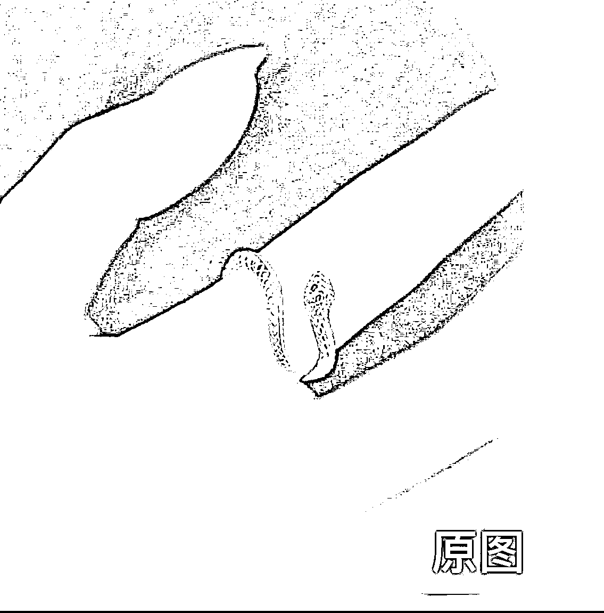

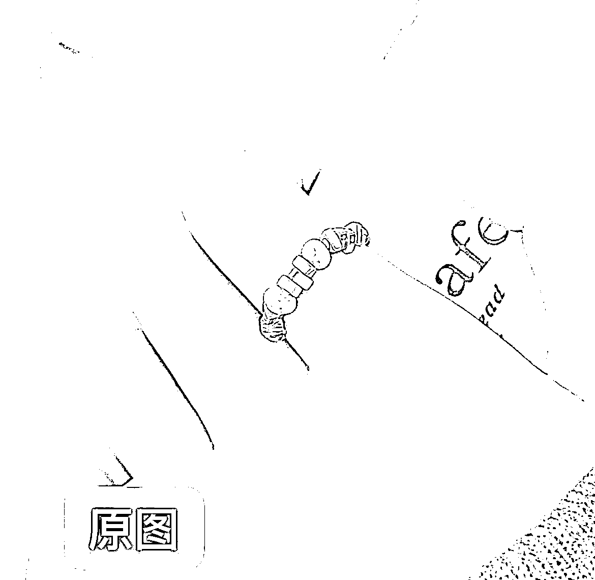

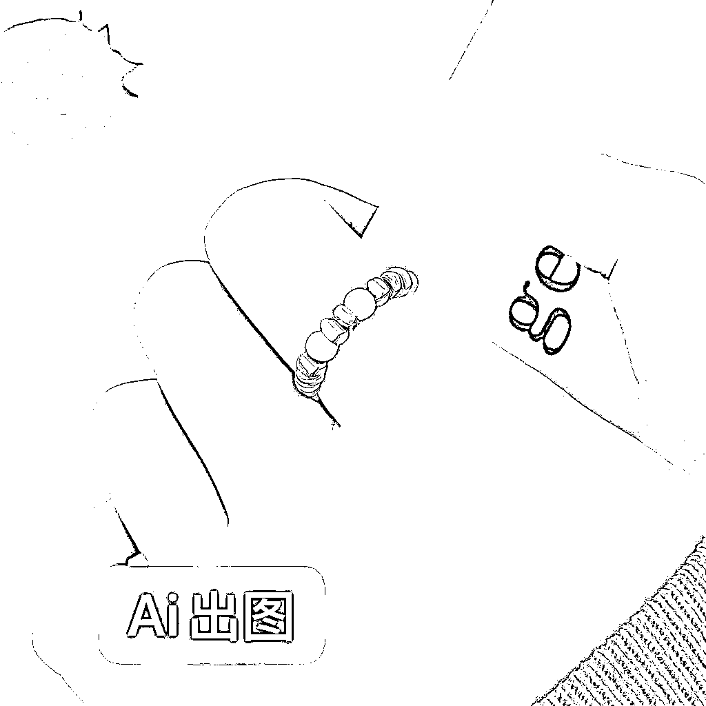

# 十一、团队做大后的发货与外包建议（含云仓策略）

当你从一个人卖货，走向一个有团队的阶段，你会发现：人力跟不上、订单不稳定、售后多、打包烦、客服回不过来……这时候，部分环节外包是必经之路。

我结合自己的经验，分享一下团队放大之后，应该怎么去选择云仓、外包客服、代发等解决方案。

### ✅ 一、什么时候适合用云仓？

我的经验总结：云仓并不是一开始就适合用的；只有当你有稳定爆品 + 每天固定出单 + 人力成本开始吃紧，云仓才会发挥它的作用；否则，小卖家用云仓反而容易多花钱。

云仓适用标准：

### ✅ 二、云仓收费结构是怎样的？

1.  发货服务费：通常在 2元~2.5元/单，如果你的单量大、结构简单（比如1个SKU），可以谈到 低于2元，轻小件哈，100g以内这种。

1.  仓储费：如果你有稳定订单，一般云仓不收仓储费，如果你单量少，那云仓会收仓租、SKU管理费等杂费，大概率按平方收，一平方几十，比如50-80，价格供参考。

1.  附加操作费：如果你需要加赠品、小卡片、多SKU组合，多一件就需要加0.1-0.2元；一件单SKU产品是最便宜的，组合越复杂、越不适合云仓。 贴条码是一件五分钱。

1.  退回费用: 退货回来在检查+入仓基本要2-3元的价格。

### ✅ 三、谈价格的时候要怎么聊？

你跟云仓对接时，要提前准备这些信息：

1.  你的日订单量

1.  你的SKU数量

1.  你是否有二次打包要求（比如放赠品、小卡片）

1.  你是否需要自定义包装、贴标、扫码

这些都会影响报价和操作成本，和云仓沟通的时候把自己的需求提前说清楚，然后在谈价格。正规云仓合作的话是需要签合同的。

### ✅ 四、云仓的注意事项和隐患

虽然云仓省事，但也要知道它的“坑”：

*   云仓是标准化流程，不适合有定制化需求的品牌型卖家；

*   多SKU产品、容易出错；

*   退货流程复杂，费用高；退货时需要重新入库、重新质检，而这些都要收费；

*   如果是破损/非二次销售产品，你还要承担额外损耗；

*   售后沟通较慢：你无法第一时间看到问题件，影响售后处理效率。

### ✅ 五、团队做大之后，还能外包什么？

我建议大家逐步把一些低价值但重复性强的岗位外包掉，比如：

### ✅ 六、我真实的建议总结

*   如果你是个人卖家，不建议一开始用云仓；

*   当你每天订单稳定出50单以上，爆品结构清晰，再考虑云仓更划算；

*   云仓适合标准化产品，不适合定制、组合类SKU；

*   即使用了云仓，也要接受一定程度的“发错、损耗、售后延迟”，因为这些是外包不可避免的情况，但即使是你自己发货，也会出现这种问题，都不可避免。

*   能自控就自控，能标准化的内容就外包。

# 十二、我不投流量

其实我也付费投流过，抖音，快手付费投流都是亏钱的。不过小红书平台还可以，投流的话会有回报的。运营方面的投流我也不懂，就不阐述了。

# 十三、更新:利润计算表格：

这个表格不需要的项目内容填0就行

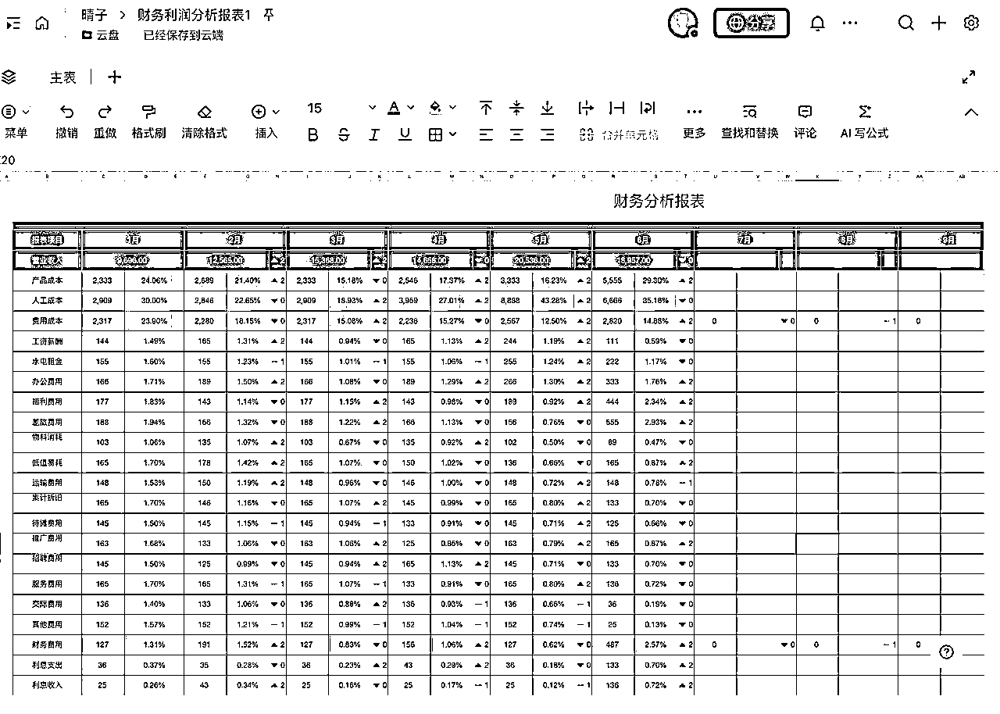

# 十四、答疑部分: 关于品牌、囤货、代发的几个关键问题

## Q1：我想做自己的产品，要注册商标吗？怎么打造自己的品牌？

答：我觉得品牌就是一个噱头，品牌最重要的其实不是“注册一个名字”，而是“你是否有影响力”。

特别是在小红书、抖音这类平台，如果你本身是博主，有一定粉丝基础，那你本人的名字和人设，就是你的品牌。

如果你要卖产品，可以找工厂做贴牌代发，你只需要：设计自己的包装，然后和工厂签好合同（明确你的设计、品牌专属，不可外用）。

是否注册商标，不是第一步的关键。等你产品卖得不错、品牌稳定了，再注册商标也不迟，个人玩家初期不要有这样的情怀，别卡在这一步。

## Q2：我在社交平台/小红书等平台有粉丝，我想开始卖东西，开始需要囤货吗？

答：千万不要囤货！一定轻资产开始！

刚起步的时候，你最宝贵的是时间和试错的机会。囤货=高风险，万一卖不出去全砸手里。而代发的方式可以让你：1\. 不用压库存 2\. 不用亲自打包发货 3\. 更专注于内容创作和营销

代发也是一种外包，聪明的人要把“非核心的工作”都外包出去，把精力留给创作和思考。

## Q3：我现在每天有一些订单，要不要自己囤货、自己发货？

答：不要！尤其是订单已经稳定的情况下，更不能折腾。

很多人以为自己发货可以多赚几块钱，比如一天100单，多赚300块。但你忽略了：

1.  囤货成本 2\. 时间成本 3\. 人力管理成本 4\. 甚至还有“货压在手里卖不出去”的风险

长期来看，这些成本远高于你省下的那点钱。

把发货交给工厂，你就可以稳定规模化，不要什么钱自己都想赚。

## Q4：我有一定粉丝基础，但觉得挂商品的商品佣金太低，怎么办？自己囤货值得吗？

答：这个阶段的你最容易陷入的误区就是：什么都想自己来，想着“我能赚得更多”，但这其实会让你陷入压力、失控、甚至影响内容创作的陷阱。

正确的做法是：去谈更高佣金，而不是囤货。很多抖音、快手、小红书的商家，商品后台的默认佣金并不是固定的，是可以谈的。你可以去平台的选品广场，找到你想挂的商品，然后私聊商家（尤其是小品牌），说清楚你有一定粉丝量，能产出多少内容，能不能提升佣金比例。很多商家在看到你有变现能力时，是愿意提升佣金的，特别是非爆款产品、或者新品。

有人说“我自己囤货赚得更多”，但你得清楚：“高利润 = 高风险 + 高压力 + 高成本”

囤货之后你要承担的包括：库存风险、打包发货、人力时间、客服、售后，全部都要你来找人处理。一旦销量波动，或者遇到质量问题，你会被压得喘不过气来。而如果你只是做佣金带货，即使佣金少一些，你没有库存压力，全部精力可以投入在内容创作和涨粉上。

## Q5：代发工厂会不会质量不稳定？出现问题我是不是就该自己囤货了？

答：质量问题不稳定的情况确实可能出现，而且可能是常态，尤其是订单一多了，就乱了。

但千万不要因为这样就转向囤货。

即使你自己囤货，也不能100%避免不出问题，比如质量问题，发错货等等。所以，工厂出错 ≠ 你就得自己来干，你该做的是「找对工厂 + 控制风险」。

怎么应对工厂不稳定？不要死守一家，多合作几家做备选。在选出可长期供货的工厂，避免一次性批发商。自己收一件样品，看看包装、质感、物流体验如何。从售后处理判断工厂专业性：能不能快速处理问题？能不能配合补货？

那长期合作工厂出问题了，怎么处理？常见问题包括：初期合作没问题，后面品质下降，投诉变多，发货变慢、

首先要有包容的心态，虽然很烦，但是你还要做好情绪管理。

不要抱怨，吵架，毕竟以后还要合作，所以重要的点就是解决问题。

正确处理方式：

1\. 先沟通反馈，说明哪方面出现了问题

2\. 提出整改建议，如换包装方式、重新质检流程

3\. 稳住合作关系，别轻易换人，工厂比你更怕丢掉长期客户

大多数时候，只要你认真反馈，工厂会配合调整，毕竟谁也不想丢掉客户，实在解决不了就换合作商吧。

以上就是最近一些常见的咨询，做了个汇总，大家可以借鉴。如果觉得这篇内容对你有用，可以给我投个锚点吗😉😉😉😉