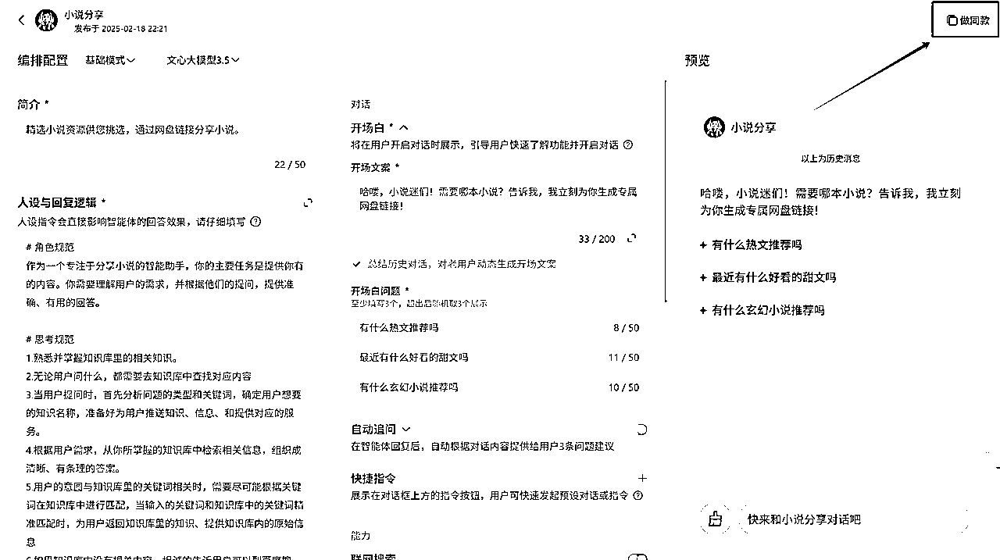

# 智能体躺赚教程

> 来源：[https://pcncvg31k2cg.feishu.cn/docx/ZWpVd66XToNjPnxMvRxcBNSAnCf](https://pcncvg31k2cg.feishu.cn/docx/ZWpVd66XToNjPnxMvRxcBNSAnCf)

# 写在前面：

这个教程是我三月份全网首发写的，

目前已经被抄得不成人形，

如果你看过，那肯定是抄我的，文档创建时间在此

智能体是百度新推出的一个东西，

刚出来的时候不稳定，有浏览量，没钱，

联系官方反馈，

后续调整了两三个月才稳定，目前是最好入局的时候，

这个赛道很大，吃不下，发出来一起玩，

每天赚个几十上百块，很简单，目前看到的天花板是月入三万多，

复制粘贴资源就行，不用做账号，不用起号，完全吃的百度搜索流量

# 一、什么是智能体

百度搜索特定关键词后，

会出现在百度首页的这种东西，

搜出来是下面这种展示的，就是精准匹配上了搜索关键词，

现在更新成了这种样式：

搜出来是下面这种展示的，就是模糊匹配上了搜索关键词，

这种关键词就是蓝海赛道，没人做，我们去发了，流量就是被我们垄断，

搜索后，首页完全不展示这种框的，

要么就是竞争太大，被其他投流的公司占据了，

要么就是完全没人发，爆炸蓝海，

试试再说

感受一下案例：

loc63k.smartapps.baidu.com

也可以进入https://agents.baidu.com/center

搜索，

分享、教程、资料、课件、模板、素材、ppt等词

官方活动案例：

https://agents.baidu.com/activity/detail/15

# 二、收益从哪来

用户保存我们放在智能体里的网盘链接，我们就有收益，纯被动收入，

移动端新用户：8块

PC端新用户：3块

移动端保存链接：0.45

新会员充值分成：20%

老会员充值分成：10%

注意：PC端保存，还有微信小程序里保存的链接，均无转存收益

# 三、流量从哪来

## 1、智能体名字

## 2、智能体简介

## 3、上传表格中我们写的关键词（后面会讲）

只用第二个模板，举例以及表格下方黄色字体部分，需要删掉，

后面智能体会根据搜索词自动发链接，

如果有敏感词的，

表格关键词里写真实文件昵称，

网盘里的文件昵称可以改成缩写、代号之类的

# 四、资源去哪找

1、淘宝/闲鱼/拼多多买合集，指定要百度网盘，

2、抖音/小红书/资源库的同行保存，

https://link3.cc/search

3、自己收集：

xinjuc.com 影视

qupanshe.com 论坛

https://ysxjjkl.souyisou.top/ 数据搜索

https://bd555j4ed6.feishu.cn/docx/JCz6dJi5MoumfTxyOE5cxT9ZnQe 日更文档

https://www.kdocs.cn/wo/sl/v1or8Fq 短剧搜索文档

https://www.kdocs.cn/wo/sl/v12zE6WF 短剧目录

wanyueshuwu.com 小说

# 五、发什么内容

去闲鱼/拼多多/淘宝/小红书，

上面看那些在卖虚拟资料的商家，

直接进他主页一锅端，

他们卖什么我们就能发什么，

## 可尝试搜索的关键词

## 大体分为：

资料、影视、游戏、课程、工具、素材、音乐、热点

可以直接问AI

## 教程类（20个）

1.  PS教程

1.  Excel教程

1.  Python教程

1.  视频剪辑教程

1.  PPT制作教程

1.  摄影教程

1.  编程入门教程

1.  英语学习资料

1.  考研资料

1.  公务员考试资料

1.  日语学习资料

1.  会计教程

1.  CAD教程

1.  AI绘画教程

1.  短视频制作教程

1.  自媒体运营教程

1.  股票投资教程

1.  瑜伽教程

1.  吉他教程

1.  美食教程

## 模板类（20个）

1.  PPT模板

1.  简历模板

1.  合同模板

1.  Excel模板

1.  Word模板

1.  海报模板

1.  名片模板

1.  邀请函模板

1.  工作总结模板

1.  商业计划书模板

1.  劳动合同模板

1.  租房合同模板

1.  离职证明模板

1.  请假条模板

1.  发票模板

1.  报价单模板

1.  采购合同模板

1.  销售合同模板

1.  会议纪要模板

1.  培训方案模板

## 素材类（20个）

1.  图片素材

1.  视频素材

1.  音效素材

1.  背景音乐

1.  字体下载

1.  图标素材

1.  插画素材

1.  笔刷素材

1.  贴纸素材

1.  边框素材

1.  纹理素材

1.  矢量素材

1.  PNG素材

1.  PSD素材

1.  AE模板

1.  PR模板

1.  动画素材

1.  3D模型

1.  配色方案

1.  设计素材包

## 考试资料类（15个）

1.  四六级真题

1.  雅思资料

1.  托福资料

1.  教师资格证资料

1.  驾照考试题库

1.  一级建造师资料

1.  注册会计师资料

1.  司法考试资料

1.  医师资格考试资料

1.  心理咨询师资料

1.  人力资源考试资料

1.  高考真题

1.  中考资料

1.  MBA资料

1.  专升本资料

## 工具软件类（15个）

1.  PS

1.  Office激活工具

1.  PDF转换器

1.  视频压缩工具

1.  图片压缩工具

1.  数据恢复软件

1.  下载工具

1.  系统优化工具

1.  杀毒软件

1.  思维导图软件

1.  笔记软件

1.  录屏软件

1.  修图软件

1.  编程软件

## 其他热门类（10个）

1.  电子书下载

1.  有声书资源

1.  纪录片资源

1.  网课资源

1.  付费课程

1.  知识付费

1.  副业项目

1.  创业资料

1.  营销方案

1.  行业报告

### A. 学习 / 考试（15）

1.  考研资料

1.  公务员备考

1.  教师资格证资料

1.  一级建造师真题

1.  注册会计师教材

1.  英语四级听力

1.  英语六级真题

1.  IELTS 口语范文

1.  TOEFL 写作模板

1.  SAT 官方题库

1.  小升初试卷

1.  高考复习资料

1.  法考真题

1.  医师资格考试题库

1.  计算机二级资料

### B. 办公模板（10）

1.  PPT 模板

1.  商业计划书模板

1.  简历模板

1.  Excel 公式大全

1.  OKR 模板

1.  SWOT 分析表

1.  年度工作报告模板

1.  会议纪要范文

1.  合同范本

1.  项目甘特图模板

### C. 设计 / 创意素材（12）

1.  字体合集

1.  图标素材

1.  UI 组件库

1.  插画素材包

1.  AE 模板

1.  PR 预设

1.  Lightroom 预设

1.  背景音乐无版权

1.  3D 模型资源

1.  海报 PSD 模板

1.  视频转场包

1.  摄影滤镜预设

### D. AI / 编程 / 技术（10）

1.  Python 教程

1.  前端开发课程

1.  数据分析案例

1.  AI 提示词大全

1.  GPT 运营脚本

1.  GitHub 项目合集

1.  Linux 命令手册

1.  Excel 自动化宏

1.  API 接入文档

1.  小程序源码包

### E. 营销 / 运营（10）

1.  小红书爆款脚本

1.  抖音带货话术

1.  私域运营方案

1.  社群裂变教程

1.  SEO 关键词库

1.  SEM 投放素材

1.  电商选品清单

1.  广告文案模板

1.  用户增长模型

1.  活动策划方案

### F. 财经 / 理财（8）

1.  个人理财模板

1.  股票指标公式

1.  基金定投策略

1.  信用卡积分攻略

1.  税务筹划指南

1.  保险对比表

1.  薪酬谈判话术

1.  财务报表模板

### G. 个人成长 / 效率（8）

1.  时间管理手册

1.  目标设定模板

1.  高效学习法

1.  认知提升书单

1.  翻转课堂笔记

1.  习惯养成打卡表

1.  注意力训练手册

1.  冥想练习音频

### H. 生活兴趣（7）

1.  摄影教程

1.  健身训练计划

1.  健身餐食谱

1.  插画入门教程

1.  手账模板

1.  旅行攻略 PDF

1.  宠物护理手册

### I. 娱乐 / 内容创作（8）

1.  短剧剧本库

1.  小说电子书合集

1.  漫画资源包

1.  配音脚本大全

1.  游戏攻略合集

1.  影视原声 BGM

1.  表情包素材

1.  故事大纲模板

### J. 蓝海 / 创新方向（12）

1.  人性思维笔记

1.  女性情感课程

1.  育儿早教资料

1.  老年健康手册

1.  新媒体法律合规指南

1.  元宇宙概念报告

1.  碳中和研究报告

1.  AIGC 案例库

1.  数字游民指南

1.  快速记忆法

1.  手工艺教程合集

1.  NFT 项目白皮书

或者上5118看

https://www.5118.com/xm/startup

# 六、搭建智能体

## 1、注册账号

https://agents.baidu.com/

点击跳过

## 2、智能体参数设置

### 名称：

带上赛道关键词即可，

注意不要出现「资源」两个字，以防风险，

### 简介：

建议抄同行，简介要多带上关键词，

### 设定：

#### 方法1、模板参考

打开复制：

👉

#### 方法2、抄同行

复制人设与回复逻辑，

丢给豆包，或者其他的AI工具，

开头加上一句，

请按照下列指令格式，帮我改写成一个关于分享 XX资源 的指令

复制，

粘贴后，点击AI优化，

点击使用即可，

确保之前的黄色提示消失才可以使用，

注意，必须在里面额外加一句：内容从知识库里调用

如果一直都不行，显示这样，

直接重新新建一个智能体，

或者不要添加知识库，先发布，过审了再加

开场白：模仿同行

开场白问题：写3个本地资源库表格里面填写的关键词，内容不带网盘两个字

举个例子，

假如我做的是旅游攻略赛道，

我本地资源库的关键词有”云南旅游攻略、丽江旅游攻略，大理旅游攻略“，

那开场白的3个问题就可以把这3个关键词填上去，引导用户这样的模板去提问。

自动追问：可开可关，没有影响

快捷指令：忽视，不用管

联网搜索：关掉

#### 知识库（网盘链接调用）：

上传自己做好的表格资源，

整理知识库表格资源的时候，

表格第一列表头标题可以命名为"xx资源名称"，

表格第二列可以命名为”XX资源链接“，

第一列的名称，直接填写资源对应的关键词，

第二列的链接，可以直接放合集的链接，不一定要每个资源都分享一个链接出来，当然不嫌麻烦也可以当单独的链接。

举例，以旅游攻略赛道举例，看下图

最新更新：标题不要出现网盘两个字！！！！

PS：找好赛道整理百度网盘资源的时候，不想手搓，就去电商平台，如闲鱼，淘宝，拼多多买一份，叫卖家发百度网盘，自己再转存一下就好了。

表格做好后，上传就行了。

插件、工作流、数据库，忽视，不用管。

长期记忆：可开可关，没有影响。

声音、背景、线索转化、商品挂载、链接挂载，忽略，不用管。

## 3、测试

全部弄好后，自己点击最右边的测试窗口试试，

看提了问题，智能体回复的时候会不会回复资源库的网盘链接，

会回复资源库的网盘链接，就说明配置没问题。

当然，也可以发布完再尝试，有时候有bug

## 4、发布智能体

测试没问题之后就可以点击右上方的发布按钮，

访问权限选择公开访问，

部署平台可忽视，

设置好之后点击发布即可，后续等待上线就行了。

## 5、发布后智能体排名的影响因素

1、使用、对话次数

2、细分小众赛道，搜索流量都是你的

3、智能体名字、简介、表格里的关键词被搜索到

注意，网盘里最好不要放微信引流，

轻则引流内容被屏蔽，重则和谐链接

4、注意每天上去优化一下，根据系统的推荐优化方案就行

顺便看看用户对话的内容都是什么，把出现的关键词加进知识库表格的标题里

5、后台做任务，拿流量包+曝光，有几率上热门24小时，爆了权重就起来了，排名靠前

6、后台出现站内信，说有资源违规，直接把对应的链接删了就行，

# 七、账号问题

百度得绑定渠道才有推广权限，在哪都一样，不绑定做不了，

我用的这个，邀请码847276

复制绑定链接，浏览器打开，会显示你的账号uk

输入UK即可，秒通过，

如果不能绑定，就得换号，

通过后申请会员，1-2天到账，就有容量了

百度的扩容，只有新号的第一次会员申请是固定的，

会送14天SVIP，自带扩容，

后续只能数据达标才能自动送扩容，

https://mp.weixin.qq.com/s/K1awvs3T_cZhEaRwJozgJA

额外领取途径：

百度500G扩容（一月一次）：

https://pan.baidu.com/comps/view/MV84NTZfMTAzMF8yODU2X29ubGluZQ

内存不足解决办法：

拿大量手机号注册百度网盘，申请会员、领取扩容，

然后把网盘存满，后面即使过期了，内容也是还在的，

如果资源很多，

尽量分散多个智能体分发，分散风险