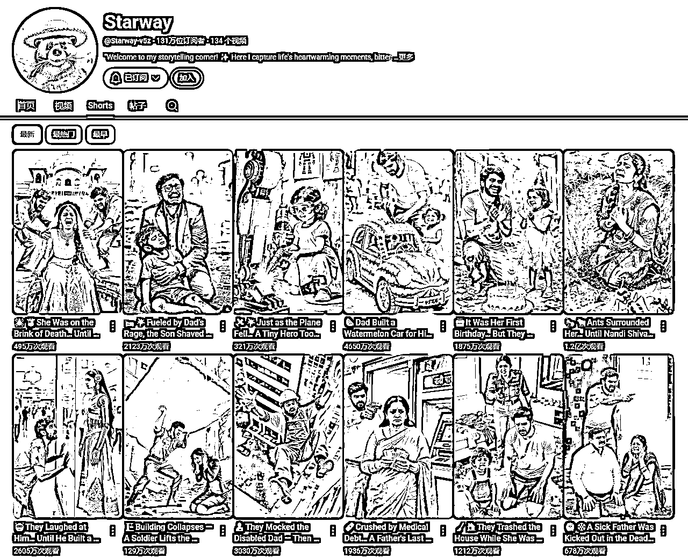
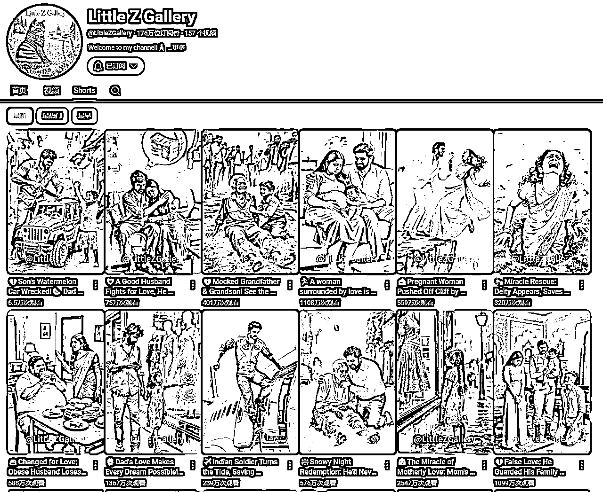
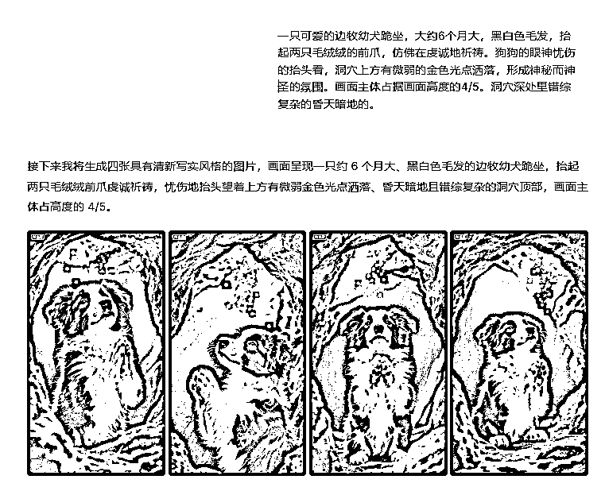
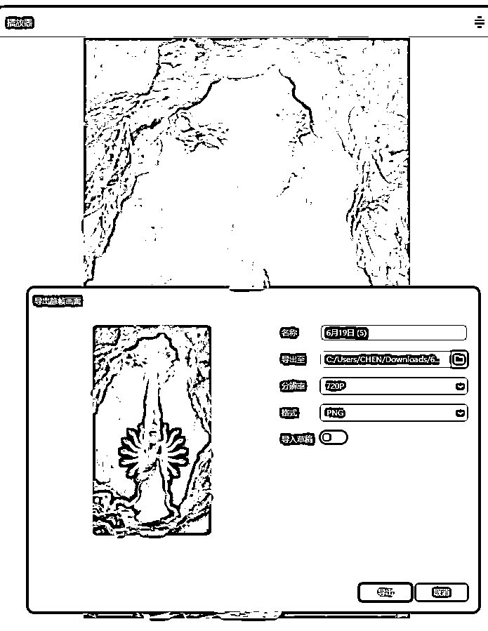

# 连续千万爆款印度故事赛道-复刻与微创新分享

> 来源：[https://rdmy9fbv0d.feishu.cn/docx/R1vBd12tlojiNZx9XANcIcBnnWc](https://rdmy9fbv0d.feishu.cn/docx/R1vBd12tlojiNZx9XANcIcBnnWc)

先看视频对标视频👇

https://www.youtube.com/shorts/zS2UAjvmw2k

我复刻的视频👇

频道目前已突破亿播，成功拿到油管的银牌。

靠印度故事一个半月开通ypp，目前总收益407美刀。

视频数据，rpm0.01-0.02

* * *

本文的核心观点和创意均由我本人提出。

为求结构清晰、方便阅读，我让AI辅助进行了总结排版。因此，若文字读起来略带“AI味”，还望大家海涵，希望能把重点放在内容本身，感谢！

# 印度人赛道还能做吗？教练：大有可为！

“印度人赛道还能做吗？”

每当有人问起，我总能看到他们眼中的犹豫。大家的顾虑很一致：流量虽大，但RPM太低，感觉是“费力不讨好”。

但教练的看法恰恰相反：这个赛道，不仅能做，而且对于很多新人来说，简直是“大有可为”！

为什么我敢这么说？因为我们不能只盯着单价低这一个缺点，而忽略了它巨大的战略优势：

### ①快速通关YPP的最佳跳板

对于新手而言，最痛苦的莫过于做视频没流量。而印度故事赛道依靠庞大的受众和高传播性，不怕没流量，可以让你在短时间内达成1000订阅和1000w次互动观看的基础指标，最近也有不少圈友通过印度故事开出第一个ypp。总之，新人先拿到ypp这张宝贵的“入场券”，再谈别的。

### ②以绝对流量冲抵低收益

虽然单次播放的收益低，但因为受众基数庞大，可以走“以量取胜”的策略，用巨大的流量池来弥补单价低的不足，我们只需要持续做几件事跟对标+跟爆款+微创新。我的对标们账号们目前依然能轻松突破百万，甚至千万级的播放量，这个赛道可以容纳的亿播账号也很多。

这里列举几个持续更新的对标账号，流量依然可观：

（甚至我的对标们也来对标我，牛：7.1-7.7：1.2亿，金毛：7.2-7.7：320w 浣熊：7.5-7.7：677w）

### ③竞争蓝海，低成本易出爆款

相较于猫猫故事、科普解说等制作精良的红海赛道，印度故事赛道的竞争烈度相对较低，印度人的审美水平也偏低，这意味着你不需要太牛逼的工具和炫酷的剪辑，用相对低成本的简单工具+爆款内容+稳定的发布频率，就会有很大机会跑出爆款。

* * *

那我也确实用自己的亲身经历来证明这一点。

我是在5月8号加入深海圈新人营后，才发现有印度故事这个赛道的。当时我的目标非常明确：就是利用它巨大的流量优势，快速冲击第一个YPP资格。

从5月12日发布第一条印度故事视频，到6月21日，40天内，我已经坚持更新了37个印度故事。期间，我制作的N条关于成长、爱恨情仇、家长里短主题的视频，也出了几条百万播放，对于新人来说是极大的正反馈。

6.14日参加了深海圈深圳线下交流局，和很多小伙伴们交流讨论，收获颇丰。Gary教练说一定要多看风向标，认真看，都是教练们精心挑选过的当下在油管里正在爆的选题，跟的快一般都会会有流量的。

6.17周二，又到了Gary教练放风向标的日子。跟着对的人走总是没错的。

👆火速跟了风向标然后爆了

6月19日发布的救援主题的印度故事，3天破一千万播放！6.27成功开第一个高级YPP。并没有什么花哨的技巧，核心就是教练每次直播都会提到的“微创新”。当大家印度故事赛道都聚焦在家长里短时，我尝试复刻了“宝宝救妈妈”这个风向标，结果就引爆了流量。

所以，“印度人赛道”不是能不能做的问题，而是你如何利用它的问题。如果你把它看作是启动你YouTube生涯的火箭，一个快速积累原始粉丝、开通YPP的战略跳板，那么它绝对是一个值得投入的、大有可为的选择！

* * *

# “微创新”=爆款元素重组

接下来让我们来拆解一下这条爆款视频，这道谁做谁爆的“爆款大餐”到底都用了哪些自带流量的食材。

### 视觉冲击的“钩子”：密集恐惧

视频一开场就用上了密恐这个强力“钩子”。密集的图案，天然会引发部分观众的生理不适和强烈好奇心，让他们迫不及待地想看到这个“问题”被解决。

女性撕心裂肺的哭声+恐惧痛苦的表情，瞬间抓住观众的眼球，让人立刻产生疑问:"她是谁?她为什么会在这里?她接着会怎么样?"这是经典的“3秒黄金法则”的应用。

### 情感共鸣的“内核”：救援叙事

“救援”本身就是YouTube上经久不衰的爆款选题。这个视频巧妙地融合了多种救援的变体：

#### ①宝宝救援：

宝宝想救出心爱妈妈的无助和焦急悲伤情绪，伴随着哭声极大地激发了观众的同情心和保护欲，立马把观众从“恐怖片"拉回到“亲情片"。

#### ②动物救援：

视频中的狗狗会修剪“千手观音”绿植，还会听女孩诉苦，都是把狗狗拟人化的开始。当哭泣的女孩向它求助，狗狗动身救援就变成合理变成了“英雄行为”，使狗狗完成“陪伴宠物”到“超现实英雄”的角色转变，又给故事增加了一层戏剧色彩。

#### ③神明救援：

一尊洁白无瑕、法相庄严的千手观音形象出现，从天而降一道圣光，瞬间就将邪恶的蚂蚁(象征着困难、邪恶或心魔)驱散、净化。这几个画面是整部视频的视觉亮点，故事在这里也走向了高潮。

这里精准地击中了目标观众的文化和信仰，让简单的救援故事上升到精神和信仰的高度，也激发了大量信徒的评论。

### 身份的“反差”：宝宝和大人的角色互换，狗狗成了求神者

身份互换1。

常规的叙事是“大人救宝宝”，而这里设计了“宝宝反向救大人”的巨大反差。

身份互换2。

常规的叙事是“人类帮助动物”，而这里设计了“狗狗帮助人类”

身份互换3。

常规的叙事是“人类供奉神明”“人类寻求神明帮助”，而这里设计了“狗狗信仰神明”，“狗狗请求神明的帮助”

### 完整的圆满结局

故事从"恐惧-悲伤-希望-神迹-团圆”的情感过山车中平稳落地，一个happy ending让观众积蓄的情感得到了完美的释放。这种强烈的“爽感”是驱动用户点赞、评论、分享的最终动力。正能量永不过时。

总结一下：

密集恐惧（钩子） + 多重救援（内核） + 身份反差（亮点） + 圆满结局（爽点） = 一个爆款视频。

真正的“微创新”并不是找到一个别人没发现的“新事物”，而是把那些已经被市场验证过的爆款元素，用一种新的逻辑和形式巧妙地编织在一起。你不需要从零开始发明轮子，你只需要学会用现有的零件，组装出一辆跑得更快的车。

* * *

# 视频制作部分：

### 1.google ai studio改写脚本

插入对标视频的链接/直接上传下载的视频。

你是一位专为印度故事写提示词的AI助手。您的任务是生成n个连续的、相互关联的场景提示词。请严格遵循以下规则：​

保持角色、服装和场景的视觉一致性，每个分镜都要描述服装 。

所有场景均在真实场景里发生。

分析这个视频，出场人物的白人女人和白人女孩替换成印度女人和印度女孩，出场的耶稣神替换成千手观音，(把需要替换的角色描述的越详细，后面修改提示词的工作量越低)按分镜头提供图片生成和视频生成的提示词，提供中文提示词，尽量详细，只描述关键信息，我将使用flux出图和runway出视频，提示词不能太冗长和复杂。

### 2.高效产出图片

我的内容能高效产出，主要是借助豆包快速出图。它们在出图效率上，比用GPT快太多也便宜很多。

我的出图流程也很简单：先看整体，再修细节

1.用豆包“套图”功能，快速出草稿。

整个分镜脚本直接扔给豆包，一次性生成所有图片。这让我能立刻看到故事的整体效果，而不用一张张等。

2.针对性单张进行提示词修改，增加局部“抽卡”。

检查这套草稿，对不满意的单张图片进行修改。比如，替换狗的品种去重（这步可以在前面脚本改写让ai做好，我漏掉了）。不满意的人物动作和构图，抽到满意的替换1中的套图

难点画面：狗狗祈祷动作，总是被ai放到人物身上

修改提示词：去掉人物，特写狗狗抬起毛绒绒的前爪

### 3.Photoshop手动去水印

素材管理，谷歌安装插件，灵感收集，可拖拉下载图视频gif...，可保留来源链接，https://eagle.cool/

### 4.智谱+即梦生视频，vidu加画面转场（快速&低成本）

主体画面就用智谱+即梦来搞定，主打一个量大管饱还便宜，成本瞬间就打下来了。

5s视频片段生成后，全部导入剪映按故事顺序排列好里。导出尾帧用来下一步做首尾帧视频。

首尾帧丝滑衔接：用Vidu（生成超快速） / Runway（无限生成） / Pixverse（质量更好）任选一个工具加个制作首尾帧转场素材。

这么一套组合拳，极大提升了效率和效果，简直是小成本撬动大制作！极大地提升了整个生产工作流的投产比

### 5.剪辑+音乐

Gary教练之前说过我要注意节奏这块的把握，不要太拖沓，尤其是开头的黄金3秒，以下总结了几点建议。

1.剧情交代清楚了，就立刻切换下一幕。

2\. 每个画面一般不超过4秒，简单镜头2-3秒即可，适当增加变速和剪切。转场视频直接2.5-3倍速带过。

3\. 适当增加转场。注意，不是每个镜头之间都需要首尾帧，有的可以直接切换画面或用黑屏来过渡，看具体氛围，自然衔接即可。（这里我加了很多场景转场，是因为之前做印度故事需要多加转场保证画面流畅，后面可以测测少加一些转场，在保障整体节奏的基础上减少工作量。）

最后我是用手机发布+印度赛道爆款音乐

### 6.复盘视频的可优化点：

1.开头部分，蚂蚁放的不够密集，不够多，不够冲击

2.省略了人物继续受遭受折磨，增加观众共情

3.省略了宝宝哭泣奔跑的特写，后续可以加上

4.狗狗救援可以换成小牛、孔雀、大象救援，印度人爱看呀！

* * *

# 写在最后

我们可以一起来思考这些问题

* * *

### 问题一：从“救婴儿”到“救大人”，还有哪些变种可能性？

这个故事模式的万能公式是：求救者遇险求救 + 意想不到的守护者 + 超凡的救援方案。关键在于找到一对出人意料的“求救者”与“守护者”的组合，并赋予一个符合其文化背景的“解决方案”。

1.  替换“救援对象”：

*   拯救动物：遇险者为受困的珍稀/大型野生动物（如雪豹、鲸鱼），切入环保，动保等主题。

*   拯救老人： 遇险者为面临日常危机的老人（如跌倒、失火）,被其曾善待的生物所救。结合老龄化社会议题。

*   拯救文化符号/ip：遇险者为广为人知的虚构角色、文化符号或流行IP（如Brainrot、龙珠角色、鱿鱼游戏玩家、Labubu玩偶），满足特定粉丝群体情怀。

1.  替换“守护者”：

*   反差萌守护者： 由看似笨拙、胆小或弱小的生物担任（如仓鼠、兔子）守护者，其挺身而出更具戏剧张力与反差萌。（皮克斯风格适用）

*   无生命守护者： 孩子珍爱的玩具/物件（如泰迪熊、机器人）“活”过来救援，唤起观众童真与幻想。

*   “反派”守护者： 让被视为“不祥”或凶猛的生物（如乌鸦、蛇），各种反派IP（如伏地魔、怪兽），制造强烈的认知颠覆和惊喜。

1.  改变救援方案

*   科技： 守护者运用隐藏的高科技装置或未来文明力量救援，将故事基调转向科幻。

*   自然之力： 守护者行为引动自然现象（如狂风、暴雨、植物疯长、特殊矿物辐射）实现救援。（注：视觉呈现需多加考究）

*   现实力量： 守护者最终引来现实中的专业救援力量（如消防队、搜救队），方案更贴近现实逻辑。

*   超现实/跨界联动：引入知名IP（如奥特曼、神奇女侠），实现跨界融合。

* * *

### 问题二：如果赛道大量抄袭“救大人”，如何差异化？

1.叙述深化：强化故事内涵

*   补充因果逻辑： 用极简镜头（如1-2秒闪回）交代遇险或被救的深层原因（如主角过往行为），将“偶然事件”提升为“必然宿命”。

*   引入反转与代价： 设计救援的沉重代价（如守护者牺牲）或意外反转，增强故事的悲剧性或哲理性，引发回味。

*   设置开放式结局：救援成功后，通过细微线索（如主角的困惑恐惧的眼神）留下悬念，激发观众讨论与想象空间。

2.风格创新：打造独特视觉标签，用强烈、统一的视觉风格替代现实场景，形成鲜明记忆点。

赛博朋克风： 霓虹都市中，AI数据流围困人类，机器宠物召唤数字神明解救

克苏鲁/哥特风： 古堡阴影怪物追逐，神秘黑猫引导发现古老封印退敌

国风仙侠/志怪风： 书生遇险，曾救助的灵兽（狐/鹤）化形引山神/仙人相助，融入东方场景与神系。

3.互动升级：构建用户参与感

塑造标志性角色/IP：固定一个受欢迎的“守护者”形象（如狗英雄）或类似困困教练的玩法固定人脸，用印度故事去打造一个印度专属AIP。用新角色持续展开不同奇幻救援事件，引导观众从追故事到追角色。

融入观众互动： 在关键剧情加入设置观众投票选项（如“狗狗该如何求救？”选择道具/其他狗朋友/神明），也可以通过发帖互动投票决定后续剧情，让观众成为创作者的一部分。

* * *

### 问题三：这个故事目前是上帝视角。如果完全从边牧的视角来叙述，视频会变成什么样？这种视角的转变有什么优势和挑战？

镜头语言： 大部分是低机位、摇晃的镜头，我们看到的是草地、主人的脚。只有当狗狗抬头时，我们才能看到小主人的脸。当狗抬头看时，我们才能看到宝宝着急的求救的表情。但可以近距离看到地上的蚂蚁。

声音设计： 人的语言会变成模糊不清的背景音，而狗的喘息、嗅探声、爪子刨土的声音、焦虑的呜咽和坚定的吠叫会成为主声道。

优势：

1.  极强的代入感： 观众会完全沉浸在“英雄狗”的内心世界里，体验它的忠诚、焦虑和决心。

1.  创新的视觉风格： 摆脱了传统、平稳的镜头，狗狗第一视角会显得非常新颖和具有艺术感。

挑战：

1.  信息交代不清： 很难完整交代“为什么会发生”以及“最终结果如何”的全貌。比如，最后的“合家欢”镜头可能就无法呈现，因为狗的视角有限。

1.  制作难度更高： 需要让AI精准模拟出动物的主观镜头和动态，技术上是个不小的挑战

1.  受众门槛变高：习惯了“上帝视角”看故事的人，可能会觉得这种拍法太乱、看不懂。它更适合那些追求新奇体验的观众。

* * *

### 问题四：豆包人脸同质化如何解决？剧情同质化如何解决？

#### 人脸同质化如何解决？

1.最直接办法：换其他大语言模型，如gp4to ，黑森林Kontext。

2.间接办法：liblib套lora图生图。midjopurney的oref参考/即梦的人脸参考

3.找其他元素去替换。剧情那么紧凑的，其实观众没那么在意人脸，重点在于讲好故事。

我们不是在做AIP，当然后续考虑到打造IP的话，可以参考前面两个办法。

#### 剧情同质化如何解决？

1.让ai帮你想创意，改写剧本。（大把爆款故事组合，根本做不完哈哈哈）

2.结合教练给的新的风向标的爆款形式或内容+印度赛道做创新。

* * *

### 自我复盘探索中

1.目前短短半个月，粉丝从1w涨到20w，印度人居多，如何去做转型？

多找对标，多看新东西。

香君教练：可以逐步隐藏旧的视频，开始穿插着发新内容。

Gary：先不转了，印度号做大做强

2.如果持续做，如何与对标做出差异化？如何持续做出新的爆款？

要么跟着对标走要么找一个方向持续深耕。

强哥说的技巧，发两个旧爆款再发一个新爆款，穿插测试用户爱看啥。

3.目前想做长视频但是还没有明确的方向，如果我目前想做brainrot mv上手，是否可以直接上手测与印度不相干的内容么？账号垂直度问题是否需要考虑？

Gary：账号权重高的情况下，教练更建议先做印度故事shorts改成横版故事，做成1-2min长视频去测。