# 万字长文讲透Youtube长视频0-10的系统思路

> 来源：[https://rcnceg0u9uzz.feishu.cn/docx/Tq09dAKTPoUueUxz3hyc0NbCnPb](https://rcnceg0u9uzz.feishu.cn/docx/Tq09dAKTPoUueUxz3hyc0NbCnPb)

接下来，你将进入帖子的正文。这篇文章的目的是分享长视频的整体思路，涉及到短视频的部分主要是为了例证，并不是系统分享。

建议最好能先看一遍目录，然后按照顺序阅读。基于篇幅的原因，有些部分并没有详尽完整铺开，但思路希望能给你启发。

如果你开始看了，请尽最大努力看完，看完你会发现，我甚是可爱。

# 1 长视频的道

## 1.1 你想成为怎样的长视频博主？

首先，我把这个话题放在开头，是想跟大家阐述清楚我的长视频频道目前处于一个什么阶段，方便按需食用；同时也试图给到大家一个判断标准来追求，因为无论做什么内容，初始的定位和目标的设定永远都是最重要的。

从长视频的角度来讲，我目前属于小博主阶段。为什么要强调，因为我相信大博主的运营逻辑也许会突破我当前所提到的某些结论。但是，如果我们不是或没有运气（嘻嘻），小博主是通往大博主的必经之路。

小博主阶段用通俗一点的互联网黑话来描述就是：实现了长视频0-1和1-10两个小目标。

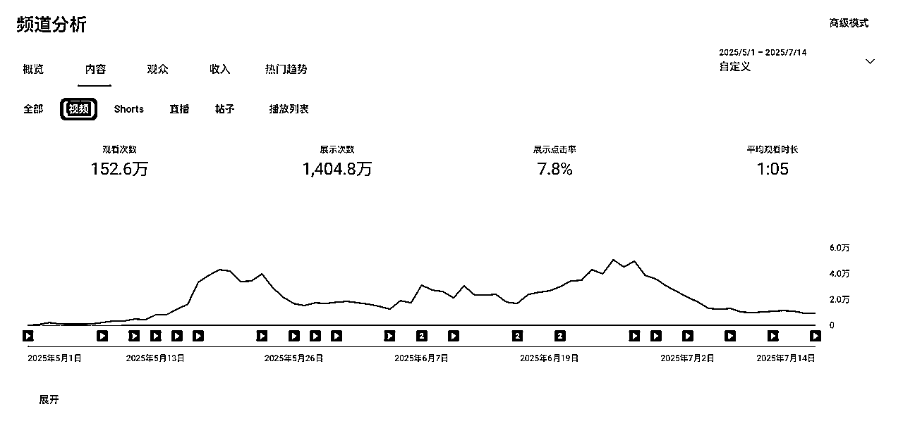

### 1.1.1 什么是0-1，怎么判断自己达到了0-1？

结论：自然推流的播放量稳定破千

这里的关键词是两个：自然推流、稳定。自然推流意味着不是短带长的流量，如果短带长带起来了的话，那么后续的长视频也会变成自然推流，所以认准自然推流。自然推流意味着浏览功能和推荐视频占大头，浏览功能意味着首页推荐，推荐视频意味着视频播放页右侧的相关视频推荐。等到了粉丝量更多的情况下，频道页的推流会慢慢起来。

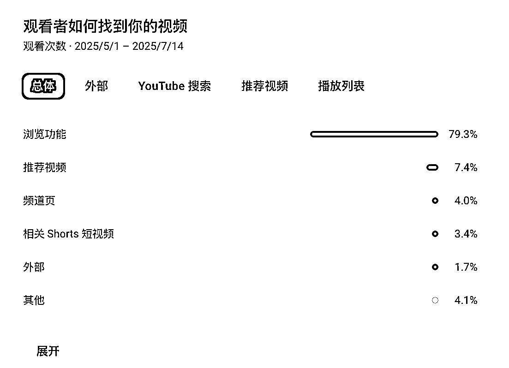

稳定意味着不是在多个几十、几百的视频里突然冒出一个破千的视频，而应该达到的状态是：长视频一发布，能在自己赛道的推流时间范围内快速破千，因为我们还在0-1的阶段，破千之后很可能就停止推流了，即便有时候看起来各方面数据都没什么问题，但就是破不了万，大概率在5000以下。

### 1.1.2 什么是1-10，怎么判断自己达到了1-10？

结论：自然推流的播放量稳定过万

关键词依然没变，这个阶段不同的是，可能产出十几万、几十万的多条爆款，但还没内容突破百万。当然这里有赛道的差异，但是没有shorts那么大。

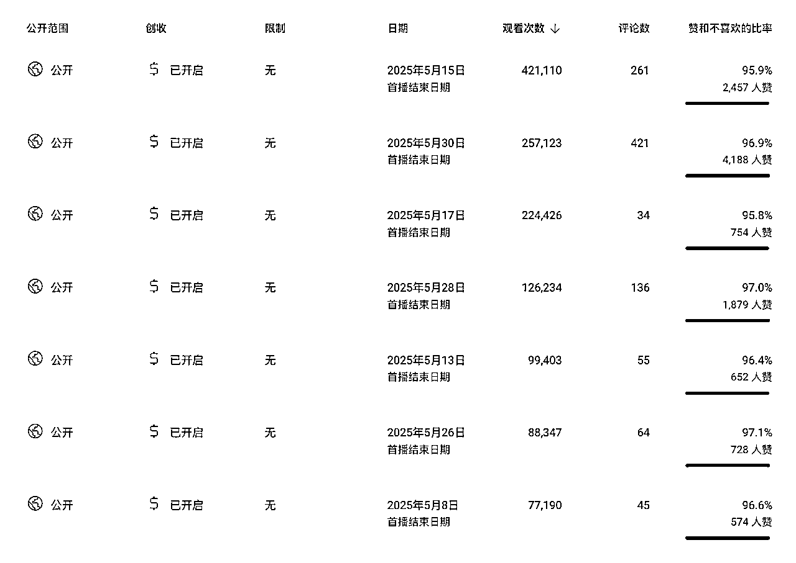

### 1.1.3 10-50、50-100是什么样子？

很抱歉，这是我还没有去到的远方。但是我们依然可以推导：10-50的阶段应该有多条百万爆款，视频一发布大概率能直接冲到10万以上。50-100的阶段应该是通过长视频运营起来的数十万---百万粉丝的博主，具有IP属性，换内容创意和内容形式都能有比较好的视频表现，不再单看播放量，而应该以粉丝量和商业价值来作为衡量的标准。

相信大家能够轻易刷到很多大博主，因为在推荐系统的平台上头部效应都一样显著。如果我们从中长视频的角度来看，排除掉短视频的干扰，你们的对标列表里可以再筛出一个新的列表，请立马回去做这件事情。

看到这里，我想问大家：入道前，你想好要走多远了吗？

## 1.2 长视频能赚多少钱？

也许你擅长做短视频，经常出爆款，可能长视频是你行有余力的选择。

也许你一开始就只想做长视频，希望找到一个稳固的基本盘。

也许你目前正在运营一个长短结合的频道。

我属于第三种，以下是我5月、6月的长视频收入，基数不大，但有向好的趋势，6月能够收入翻倍，主要是5月的长视频有几条爆款，对应我上面说的1-10的阶段。

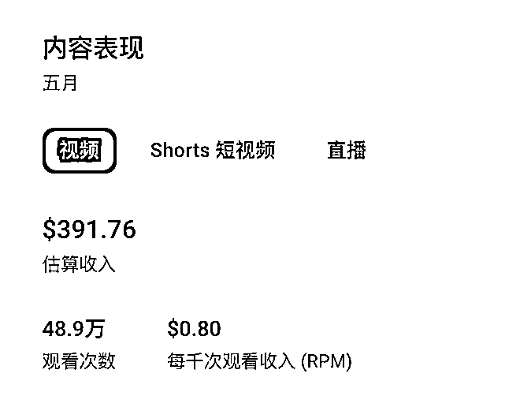

不管怎样，我们都需要来算一笔性价比的账，用来量化钱 & 精力，为什么？因为时间是有限且固定的，你总是能把时间作为标尺来估算你的单位时间收入，优选投入小产出大的生产规划。

准确地来说，我这里算的不光是长视频的钱，而是整个频道的钱。

### 1.2.1 内容的收入比较

*   单价对比：长视频RPM ： 短视频RPM = 0.92 ：0.06 = 15.33倍

*   假如我们一条内容要赚100美金：

*   长视频需要播放量：10万

*   短视频需要互动播放量：166万（注意互动两个字，如果我们假定互动播放是播放量的1/3，那么就需要500万播放量）

*   这里选择做长视频还是短视频，核心变量是什么？是难度。难度怎么判断，仍然需要加上时间的标准。

*   当下：做一条166万短视频和一条10万长视频哪个投入更大？哪个类型的当下收入更大？

*   长期：持续做多条166万短视频和多条10万长视频哪个投入更大？哪个类型的睡后收入更大？

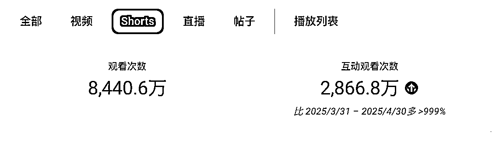

### 1.2.2 频道的收入规划

频道月收入 = 长视频月收入 + 短视频月收入

= 长视频总播放量*RPM + 短视频总互动播放量*RPM

= 长视频条数*平均播放量*RPM + 短视频条数*平均互动播放量*RPM

如果我们设定一个合理的月收入目标，我们就可以倒推我们应该做多少条长短视频，且应该达到多少的播放量标准。这里唯一的变量就是比较你所在的赛道上长短视频的推流时长，也就是内容时效，比的还是时间长度上的收入。

举个例子，如果你想月入千刀：

*   如果你只做短视频，假设RPM0.06、30条/月（1条/天），你需要1667万互动播放量/月，对应约5000万播放量/月，平均单条互动播放55万，对应平均单条约165万播放量。

*   如果你只做长视频，假设RPM1、12条/月（3条/周），你需要100万播放量/月，平均单条播放量8.3万。

*   如果你长+短，可以按照上面的公式根据自己情况假设，大概能够粗算出来。

### 1.2.3 时间长度的收入怎么比较？

相信细心的人已经发现了，虽然我上面提到了需要比较时间长度的收入，且长短视频的难度也与时间长度上的投入有关，那我们到底怎么来衡量？

这是我排名前四的长视频推流曲线，大家发现了什么？

*   第1条42万播放量，发布到现在为止61天仍在推流

*   第2条26万播放量，发布到现在为止46天仍在推流

*   第3条22万播放量，发布到现在为止59天仍在推流（发布第21天、发布第33天迎来2次新的推流，想知道为什么跳转3.2.2）

*   第4条13万播放量，发布到现在为止48天仍在推流

这种一直推流的感觉是不是很好？时间长度的收入相信你应该有体感了，目前大致的结论是，只要你做的是没有明显时效的内容，长视频的推流时长理论上讲是没有上限的，但是短视频，大家都比较熟悉了，大致也就一周，基本不会超过一个月。

现在请回去看自己的频道和所在的赛道，你应该知道如何规划接下来的内容生产了。

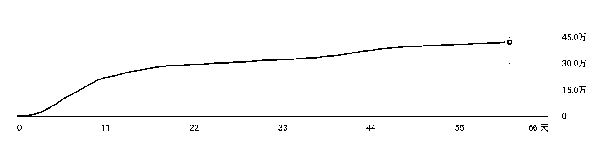

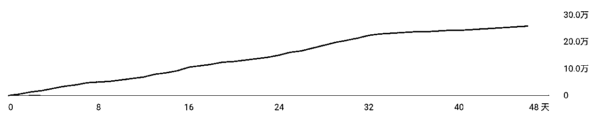

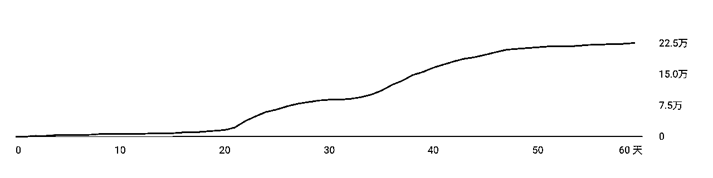

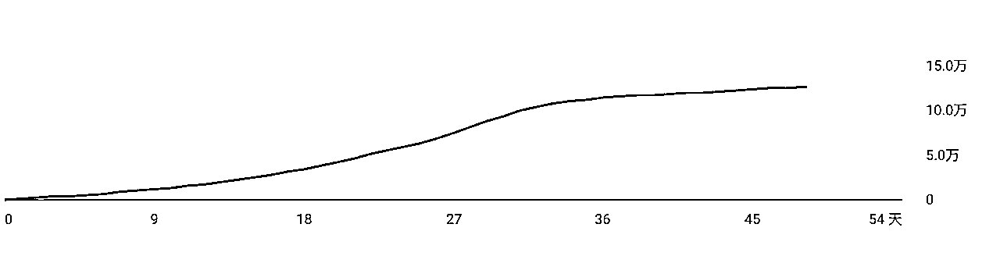

道的内容写完了，我希望基于长视频的目标和收入规划能在你心里种下待办的种子。

# 2 长视频的法

## 2.1 赛道怎么选？

这个部分，我是希望提醒大家在做长视频之初就要拥有的缜密布局，因为长视频投入长、见效慢，试错成本高，当你发现不知道做什么、赛道小、赛道卷、赛道完蛋了的时候，你怎么办？

机会，向来只留给有准备的人。

### 2.1.1 你适合什么赛道？

我想问你10个问题：

*   你平时刷小红书、抖音、快手、视频号都刷成什么内容？看下你的订阅列表和点赞列表

*   抛开做视频赚钱，你自己用来刷Youtube账号订阅了谁？

*   你刷到的Youtube视频，会忍不住分享出来的有哪些？

*   你刷到的Youtube视频，一看就觉得牛逼，再一看我也能做，再二看我能做得更好，有哪些？

*   除了衣食住行的日常开销，你在哪些爱好、兴趣上做了时间、金钱的持续投入，找出来

*   你想在Youtube做出自己的个人色彩吗？

*   你有感觉的赛道分别有哪些，是做选择题还是问答题？

*   你准备做3个月、半年、还是多久？短、中、长期目标是什么？

*   你过往的工作经历是什么？内容策划、带货、测评... 来时路，每一步都算数

*   我用以前看到的一个大博主的简介来放最后一个问题：你是否想做你想做的内容？

现在闭上眼睛跟着我扪心自问，答案是不是已经在《答案之书》里了。

### 2.1.2 你的赛道你真的了解吗？

也许你已经有赛道了，但是你对你的赛道真的了解吗？我以名人搞笑举例，这个赛道属于细分赛道，如果是shorts大几千万的爆款就到顶了，几乎很少看到上亿的内容。如果是长视频，百万属于天花板级别，数十万播放的算是挺爆的了。

但是，这个赛道真的这么小吗？我们把名人搞笑拆解一下：

*   名人

名人除了特朗普等政治人物，体育界的c罗、梅西是不是经常刷到，娱乐界的小李子是不是经常刷到，科技界的马斯克，还有太多太多，可做的范围还不大吗？

*   搞笑

搞笑，一个多么资深的娱乐赛道。打进外国文化圈，搞笑也是其中一个方式，不然没法对其中的梗会心一笑。生活这么苦，谁不想笑一笑。那么多搞笑的内容都将成为你的创意来源。而无语言的默剧，具有穿透人心的魔力。

*   拓展方向

轻喜剧、语言类的搞笑（比如宝宝播客、外国脱口秀）、MV类的讽喻搞笑、名人搞笑电影、风格化戏仿...

说实话，我们能做的太多，请现在拿起你的小本本，好好画一画自己的赛道到底有什么可以外拓的方向，我们最好不要打一枪换一阵，守好你的村，然后才有实力去包围城市。

### 2.1.3 假如，是不是应该换赛道？

假如流量下滑...

假如名人IP违规...

假如赛道没了...

要让我再想假如，已经想不出来了。

假如流量下滑，我们刚刚说的方向是不是可以开始尝试了。假如名人IP违规，将名人的“刻板印象”保留，然后形象动漫化，大家会心一笑都认出来，是不是能解决。假如出现了新赛道，你现在做的这个是不是能迁移，比如宝宝播客。

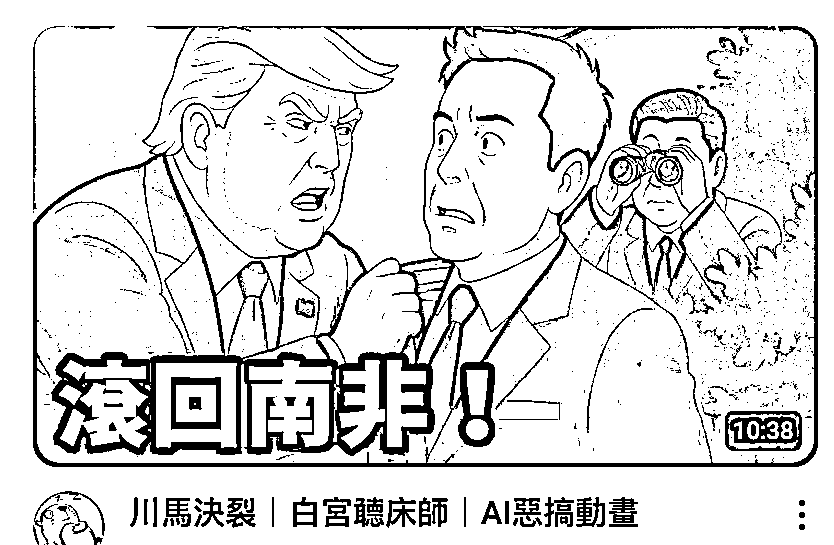

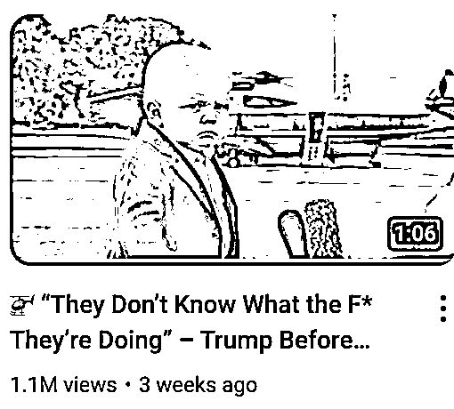

当然我们不能保证每个问题都能被圆满解决，但是兵来将挡、水来土掩，做长视频就意味着你将遇到无数个复杂问题，遇到问题就放弃，咱怎么往大博主进阶。所以不建议大家换来换去，你第一思考应该是正向迁移，向外拓展。

## 2.2 我有频道做短视频，想转长视频怎么转？

### 2.2.1 短视频和长视频到底是什么关系？

朋友们有没有在心里问过这些问题：

*   短视频有多条千万爆款、甚至上亿，我发的长视频怎么没有流量？

*   短带长为什么带不起来长视频的稳定流量？

*   短视频爆了到底对长视频有没有帮助？

我同样是做名人搞笑内容，长视频和短视频的观众却不一样。没错，长短视频是分开推流的，当频道慢慢做起来后，他们只有一个共同点，就是发布都会优先推给你的频道粉丝，他们的喜好甚至都决定了你的推流。所以粉丝才是最重要的，没有粉丝谁最重要，是你的目标观众，你的任务就是将目标观众变成你的频道粉丝。

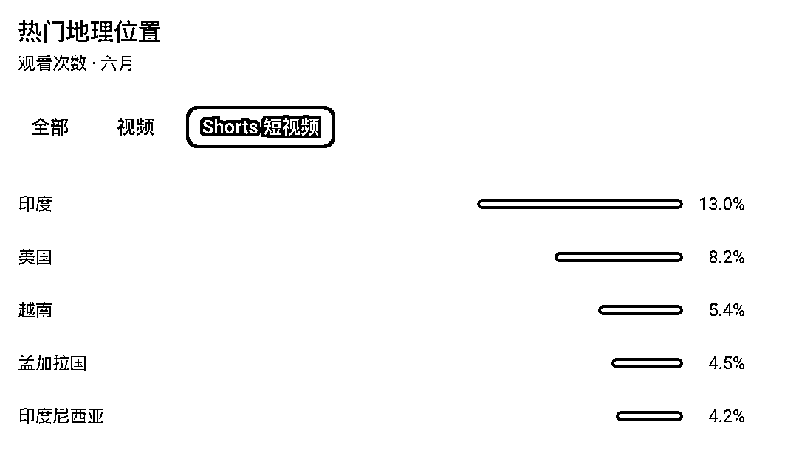

观众不一样，那么短视频和长视频的关系是不是就明确了。以此为基准，我们能做的事情有哪些？以下用我的亲身实践得到的反馈进行阐述：

1.  爆款短视频合集发长视频可不可行？

答：可行，你需要马上测试，因为这几乎没有成本。虽然长短视频的粉丝不一样，但是如果你的内容能突破受众范围，那么无论什么内容载体，也许都会有人看。以下分别是3分钟、8分钟短视频合集的长视频。

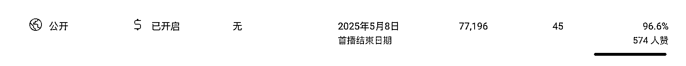

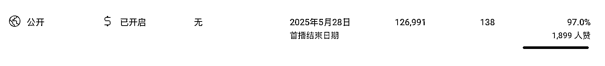

这条3分钟合集帮助我完成了长视频的观众冷启动，是不是和我上面展示的长视频粉丝接近的。

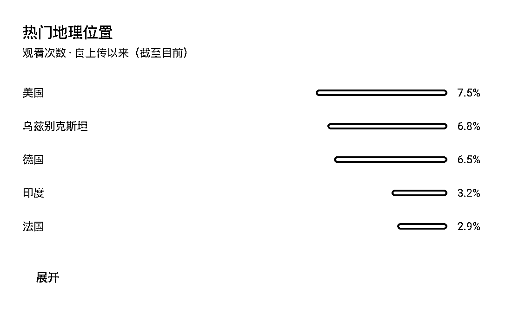

这个现象就直接回答了“短视频爆了到底对长视频有没有帮助？”，肯定有，不仅能提高账号权重，还有希望成功冷启。

1.  只靠爆款短视频拼接，这算做长视频吗？

答：不算。这么做只是为了帮你去验证观众和评估赛道是否要继续做的手段，但不是目标。要做长视频咱还得好好做、长期做。已经验证了欧美观众也喜欢看，那不就可以产出独立的长视频搞笑内容了吗？这正是我当时的想法，所以没有对标，直接和我的大模型导师一起，奔着原创搞笑开始尝试。5月8日的第3天5月11日做了一条印巴的热点搞笑，成功破千，接着继续1条/2天产出内容，便迎来了爆款。基本上视频发布能预期破万。近期流量有些下滑，一方面有我内容的原因，一方面我发现之前短视频对标的大号已经开始做长视频了，而做的正是复刻我40万长视频的内容。二十万的号都来对标我了，小号那数不胜数了。咱们又要开始卷起来优化了，实惨。

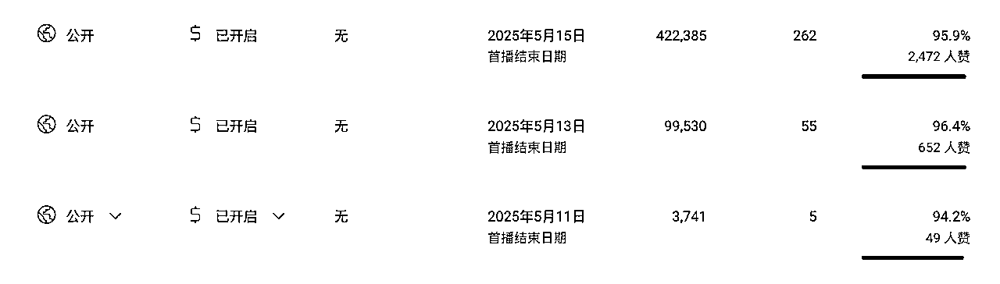

1.  长视频对内容质量和创意要求更高

*   短视频有多条千万爆款、甚至上亿，我发的长视频怎么没有流量？

*   短带长为什么带不起来长视频的稳定流量？

这两个问题，其实上面已经回答了一半，因为观众不一样。如果你做的是泛娱乐内容，那有可能完全重合，应该百般尝试，如果尝试之后还做不起来的话，那就有可能是你长视频在该赛道的内容质量不够好，我们这个时候已经无法按照shorts的内容标准来衡量了。

### 2.2.2 从选择粉丝来定位长视频赛道

我现在的名人搞笑长视频，其实是在做shorts积累有了粉丝数据之后，拉长时间做了一个流量梯度上的观察得到的一个经验：

我做了一些百万爆款，我发现这些内容都是美国观众为主，等视频突破了千万，印度就遥遥领先了。这个时候我就在想，既然我想做高RPM的欧美粉丝（是不是真的高只有做了才知道事实证明也就1），且我现在shorts做的内容刚好他们也喜欢，那么，长视频是不是做类似的内容应该也能积累到这些欧美的目标观众。有个这个想法，我马上就开始快速尝试该方向下的长视频内容，很快就拿到了正反馈，如前面所述。

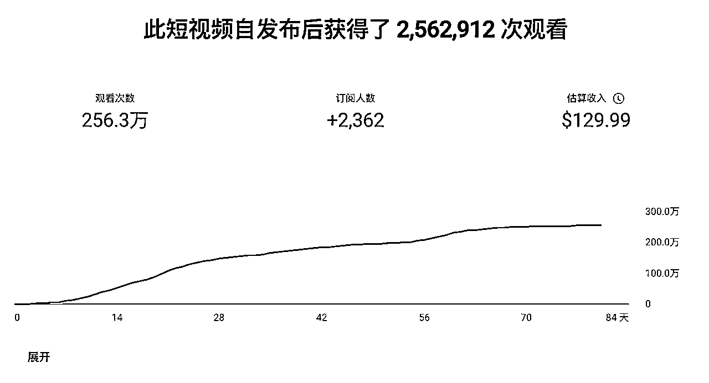

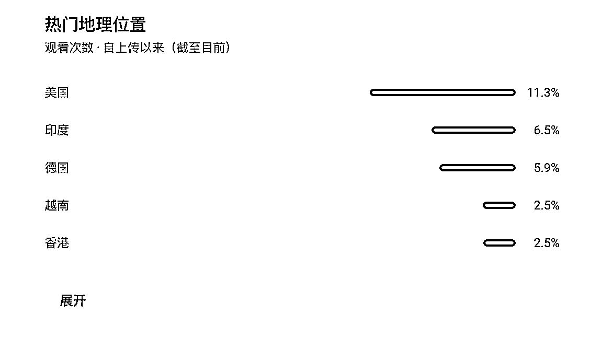

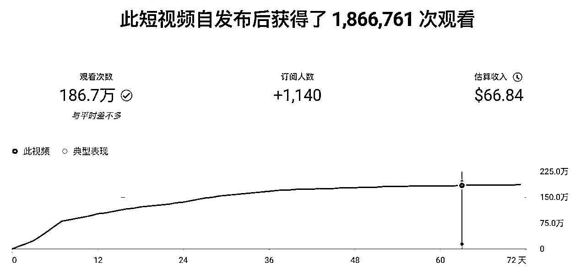

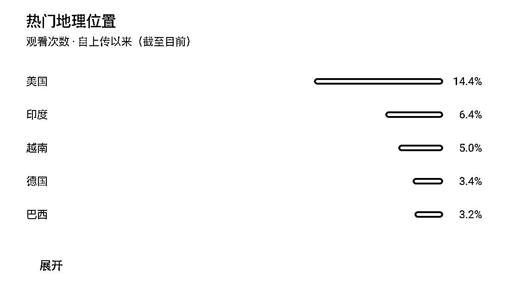

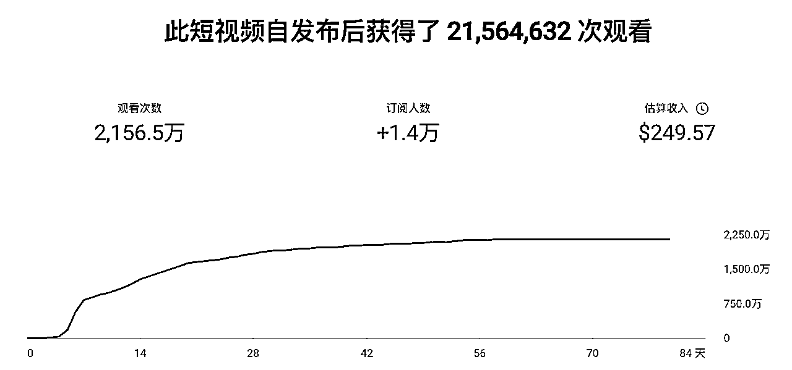

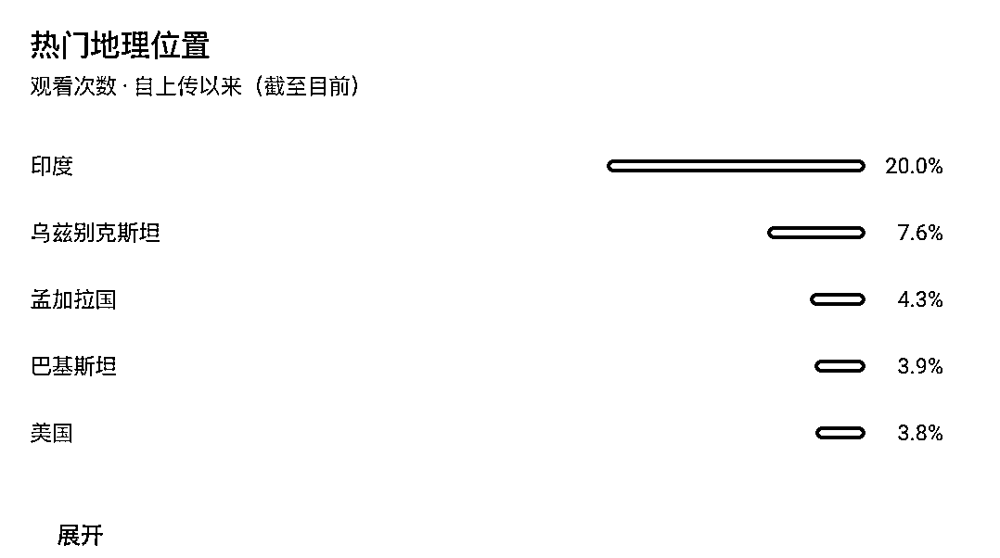

在这个之前，其实我还尝试过以下长视频赛道：

动物示警

天使宝宝

历史解说

GTA动起来、GTA转绘

这些失败的经验也验证了我的想法：

❌不是通过试图做爆款长视频内容来冷启动

✅而是通过你要做的目标观众来定位频道的内容方向，长视频的粉丝需要积累

### 2.2.3 多久能达成小目标？

我现在做的这个频道，一万字操作猛如虎，达到0-10只花了一个月。

但是这一万字和前面乱七八糟的失败，花了半年。

从现在开始，准备半年的预期，从头到尾来一遍长视频的打法，专注在自己的擅长和善变上，正面出击。

我们以前打绩效，差绩效都是要提前半年做预期管理的，你看，干啥都要半年。

# 3 长视频的术

## 3.1 选题和明天谁先来？

如果明天的选题还没定，请你不要睡觉了，你怎么还睡得着？你必须让选题比明天先来报道。

### 3.1.1 选题和创意不只来源对标

#### 3.1.1.1来源于X&Reddit

X上的内容也可以用来做内容，以特朗普的X为例子，我做了一条宝宝播客形式的长视频，这条也达到了2000+播放量，是不是离完成冷启这么近？而且这是一条纯纯YY的原创内容。

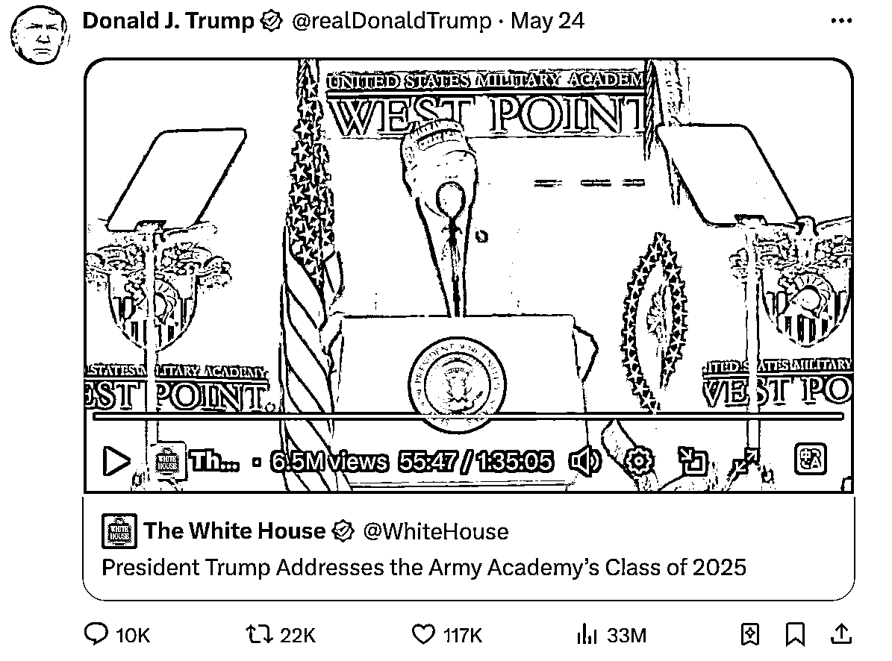

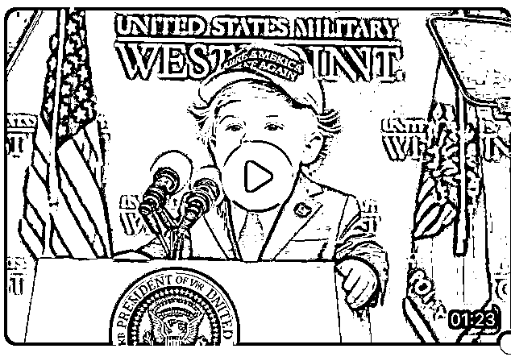

另外一个例子，我在Reddit上看到这个新闻的时候，就用他做了内容，那条其实是改编对标的，但是我加入了这个创意，我发现评论区有很多欧美观众get到了我这个讽喻。

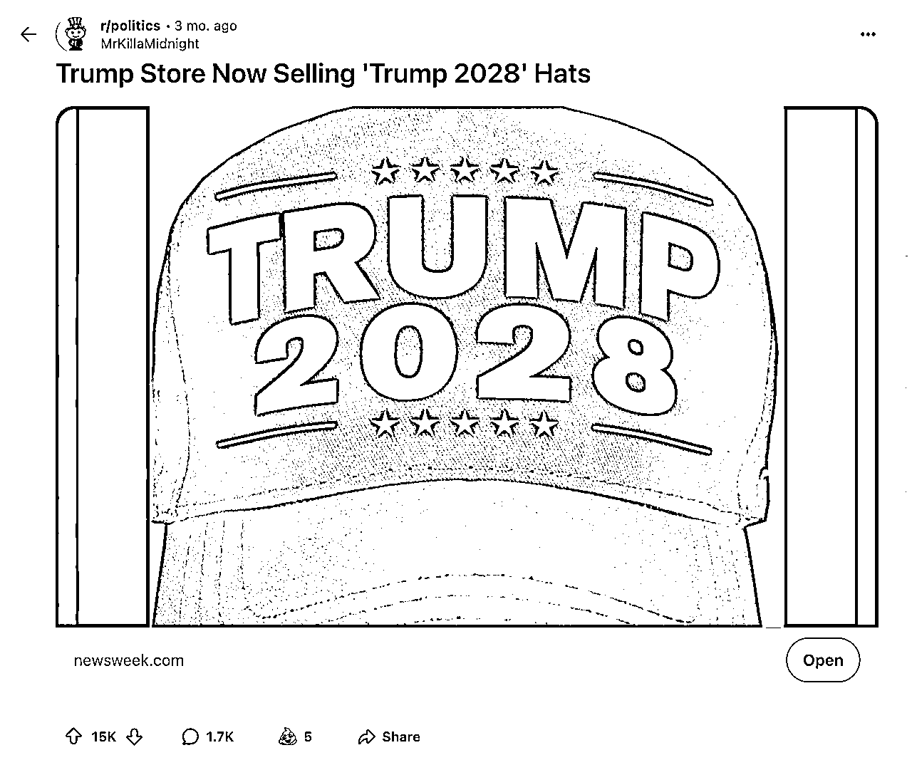

#### 3.1.1.2来源于国内平台

这是小红书的话题，同理抖音、快手是不是都有，这些都可以关注所在赛道的关键词来获取信息，我之前也用特朗普话题下的创意做过内容，这些都是子弹来的。

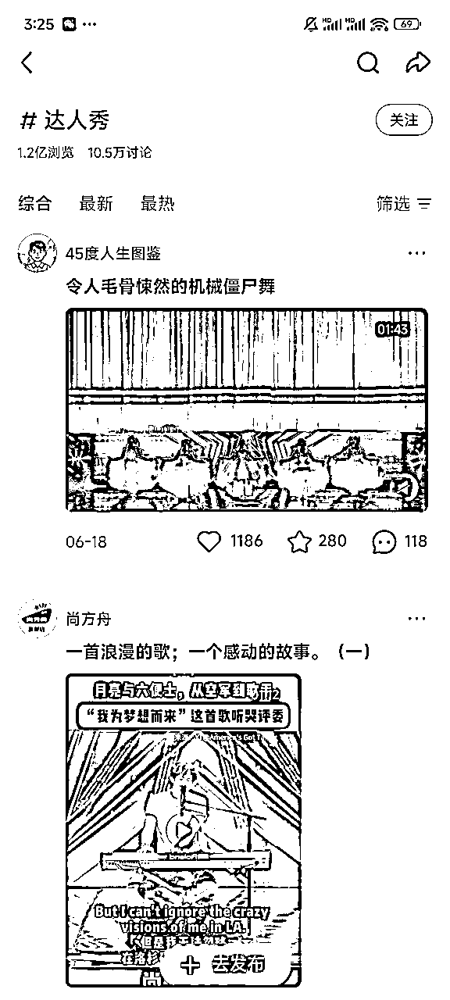

#### 3.1.1.3来源于大模型导师

我那条40万播放的长视频是和大模型导师共创的，刚开始发布时其实还没有太大的流量，但是突破了万播，然后我就想着万播可以啊，我要把他做成系列，所以我把gemini 2.5 Pro导师的创意温度调成了2，开始在同一个窗口前后又共同创作了5条以上的长视频，都取得了不错的成绩，代表我仿佛找到了我自己的路子，让我的长视频顺利突围到1-10的阶段，现在都有很多人在抄我了，朋友们，我也没赚到太大的钱，已经被盯上了哈哈哈。我其实想说的是，爆款藏在你过去大大小小的AI资产里，尤其是你已经有过爆款的前提下，擅于挖掘，擅于总结。

每天请在你的耳边响起我的声音：你那条爆款视频有做到打满100万token吗？回答我！

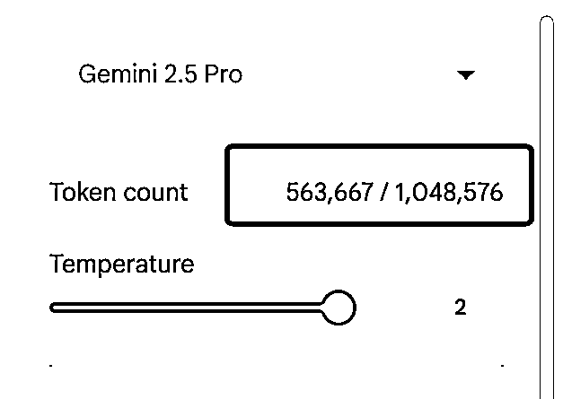

### 3.1.2 你真的研究明白评论了吗？

我用Cursor写了一个评论采集器，采集完的评论会在本地生成一个csv文档，你拿到这个文档就可以去找找大模型导师进行深入详细的分析：

以下是我一条2600万的原创shorts评论，灵感来源于我小区楼下的跷跷板，我每天倒垃圾都经过它，有时候我会玩一下。因为我这条视频，跷跷板已经成为我们这个赛道的meme了，无数仿作。

这个csv文件是一个视频的评论，我需要你帮我分析，用来总结火爆的原因，并产出相关创意，请给个分析框架

Gemini 2.5 Pro Temperature 2

爆款视频分析框架：解构病毒式传播的核心要素

第一部分：执行摘要（Executive Summary）

该视频之所以能火爆全球，其背后遵循一个强大且普世的创作公式：**“用低龄化的荒诞，呈现高风险的讽刺”**

它将全球知名且时常处于对立面的政治人物（特朗普与金正恩），放置在一个极度日常、甚至幼稚的场景中（玩跷跷板），而背景则是充满权力象征意义的地点（白宫）。这种强烈的**“反差感”**创造了无需翻译就能理解的即时幽默。同时，在高质量AI技术的加持下，这个场景也成了一个关于国际权力动态的绝妙视觉隐喻，充满了新奇感与“魔力”。

* * *

第二部分：评论数据深度剖析

我们将从以下四个维度，分析评论区数据，揭示用户产生强烈共鸣的深层原因。

维度一：荒诞与讽刺幽默（核心吸引力）

这是评论区最主流的情绪。这种幽默并非简单的笑话，而是一种独特的讽刺手法，它将强权人物“低幼化”，使他们既荒唐可笑又似乎“平易近人”。

评论证据：

压倒性的“笑哭”表情： 😂、🤣、😅 是最常见的符号，表明观众最直接的反应是发自内心的爆笑。

直指“孩童行为”的评论：

"Les grands bébés jouent à la balançoire" (法语：这些大宝宝在玩跷跷板)

"Wooow naglalaro ang mga bata" (菲律宾语：哇，孩子们在玩耍)

"Как дети, хотя им по 80 лет" (俄语：他们就像孩子一样，尽管已经80岁了)

肢体喜剧的成功： 视频中金正恩利用体重把特朗普弹飞的瞬间，是典型的“憨豆式”笑点。诸如“Kim is very smart. 😂”（金正恩真聪明）的评论，正是对这一喜剧高潮的认可。

维度二：全球共鸣与跨文化吸引力

这个视频的理解门槛为零。跷跷板、冰淇淋、特朗普和金正恩的脸，是全球通用的视觉符号。

评论证据：

惊人的语言多样性： 评论区涌现了大量不同语言，如英语、越南语(Rất hay)、中文(一噸重的肥佬金！)、俄语(Классно !!!)、法语(c'est Cool)、印尼语(Lucu🤣🤣🤣)、泰语等等。

简洁、普世的主题： “玩耍”、“对抗”和“失衡”是全人类都能理解的概念。这个视觉笑话无需任何字幕或解释就能完美跨越文化壁垒，从而极大地拓宽了受众范围。

维度三：AI技术的“奇观”效应（“哇！”的惊叹）

观众不仅在为内容发笑，也在为技术本身感到惊奇。以假乱真的AI生成效果创造了一种“不可思议”的观看体验。

评论证据：

对技术的直接提问与赞美：

"Good for AI hahahaha" (这AI太牛了，哈哈哈)

"Pandai sekali yang buat konten ini... Pasti pakai tehnologi AI ya." (印尼语：做这个内容的人太聪明了…肯定是用了AI技术吧。)

"How it is created" (这是怎么做出来的？)

关于真实性的讨论：

"Ta không tin Photoshop" (越南语：我不信这是PS的)

这种“亦真亦假”的困惑和讨论，本身就促进了视频的分享和互动，人们热衷于讨论这项技术的无限可能。

维度四：政治评论与象征意义（更深层次的解读）

尽管表面上非常滑稽，但这个视频实际上是一幅强有力的政治漫画。玩跷跷板这个简单的行为，充满了丰富的隐喻。

评论证据：

隐喻的解读： 跷跷板是权力平衡转移、政治谈判和地缘博弈的完美视觉载体。特朗普被“晾”在半空，而金正恩悠然自得地吃冰淇淋，随后特朗普被弹飞，这些情节都充满了象征意味。

政治情绪的表达：

"We the masses are not going there with you, whatever conflict that you are trying to create." (我们大众不想卷入你们制造的任何冲突。) —— 这位用户将视频解读为对领导人“玩游戏”却影响民众的批判。

"Sarebbe bello se si divertissero veramente come i bambini... non pensano a lanciare bombe atomiche." (意大利语：要是他们能真像孩子一样玩耍，而不是想着扔原子弹就好了。)

场景的重要性： 视频的背景是**白宫草坪**，这个设定至关重要。它将虚构的荒诞情节置于现实世界的权力中心，让讽刺意味变得更加尖锐。

* * *

第三部分：爆火核心原因总结

高概念反差： 政治强人 + 童年游戏 = 即时喜剧效果。

无语言障碍： 纯视觉笑点，无需翻译即可全球通用，实现病毒式传播。

强烈的象征性： “跷跷板”是对权力博弈、相互牵制的绝佳隐喻，引人深思。

技术奇观： 高质量的AI生成效果本身就是一大看点，引发好奇与讨论。

契合短视频形态： 视频短小精悍，视觉冲击力强，有记忆点和“爆点”，极易在社交媒体信息流中脱颖而出。

* * *

第四部分：可执行的创意构想

基于已验证的成功公式：**(名人/领袖)**** + ****(荒诞的日常活动)**** + ****(具有象征意义的地点)**，我们构思了以下几个具备相似爆款潜力的新创意。

创意核心原则： 保持公式不变，替换变量。

创意一：沙滩城堡峰会 (The Sandcastle Summit)

人物： 拜登 (Joe Biden) 与普京 (Vladimir Putin)。

活动： 在沙滩上极其认真地堆沙堡，并互相攀比。

地点： 某个阳光明媚的海滩，象征“中立地带”。

笑点/包袱： 两人开始暗中破坏对方的城堡。普京的城堡是克里姆林宫式的复杂堡垒；拜登的则是白宫式的建筑群。最终，其中一人不小心踢塌了对方的作品，引发一场紧张而幼稚的对视。

创意二：罗马斗兽场三轮车赛 (Tricycle Race Around the Colosseum)

人物： 马斯克 (Elon Musk) 与扎克伯格 (Mark Zuckerberg)。

活动： 骑着成人尺寸的儿童三轮车，进行一场异常“严肃”的竞速比赛。

地点： 罗马斗兽场外围。用宏伟的古代遗迹，反衬他们既有未来感又很“幼稚”的竞争关系。

笑点/包袱： 马斯克中途试图给自己的三轮车加装一个迷你火箭推进器。扎克伯格则拿着平板电脑，不断试图修改比赛规则。两人最终几乎同时冲线，并为谁是冠军而激烈争吵。

创意三：终极棋局 (The Ultimate Board Game)

人物： 中国领导人习近平与印度总理莫迪。

活动： 下一盘看起来像是《大富翁》和《围棋》结合体的、规则极其复杂的桌游。

地点： 宁静的山顶茶馆，象征着“战略定力”。

笑点/包袱： 两人陷入了漫长的僵局。镜头缓缓拉远，观众发现棋盘其实是一张高度精细的边境地区微缩地图。两人纹丝不动，只是久久地凝视着棋盘，偶尔呷一口茶，完美捕捉了战略僵持的紧张氛围。

创意四：一起组装宜家家具 (Assembling IKEA Furniture)

人物： G7集团国家领导人（拜登、苏纳克、马克龙、朔尔茨等）。

活动： 所有人试图合力组装一件结构超级复杂的宜家书柜。

地点： 一个空旷的房间，象征“共同构建世界新秩序”。

笑点/包袱： 现场一片混乱。每个领导人都在看自己国家语言版本的说明书，并为此争吵不休。最终，总会有一个人手里多出一颗备用螺丝钉，满脸困惑。组装完成的家具歪歪扭扭，滑稽不堪。

如果你看完了前面的，是不是觉得有那么点意思，做内容是不是还挺快乐，再继续深入沟通下去，也许能产出很多视频的创意。即便没有即时产出一条视频，也能作为你的内容体感训练，更了解你的粉丝到底在乎什么。这是不是一鱼三吃？回答我！

## 3.2 长视频如何做推广？

“如果还有明天，你想怎样装扮你的脸...”

### 3.2.1 意想不到：首页的帖子

你有没有发现你的Youtube首页有个位置专门用来推荐帖子，请看下图，3700+点赞，按照我下面的数据来看，展示是不是超过100万了？很有可能哦。帖子要不要重视起来？回答我！

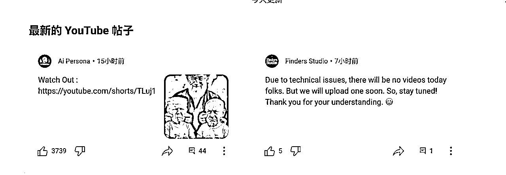

我也测了一段时间的帖子，发现最好的效果是：图片模式，也就是意味着你要用抓人眼球的图片来展示你要推广的内容。比如你要推广你刚发布的视频，那么不要用他的视频模式直接添加视频，而应该是文案+链接，然后选择最炸裂的图片上传。你会发现效果很好，同时帖子也能涨粉。

我总共发了25条帖子，展示了110万次，获赞3000+，带来粉丝365人。

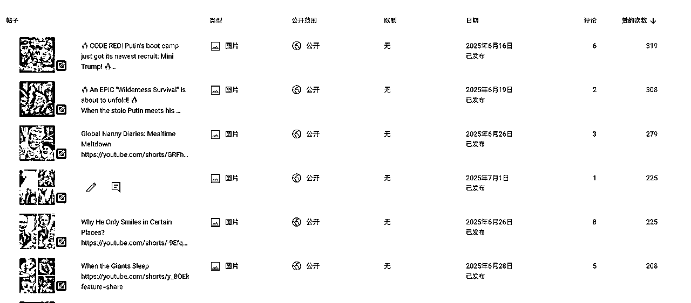

### 3.2.2 油管送惊喜：首页的合集

不知道大家有没有发现，你如果用电脑开始在Youtube首页刷视频，在顶部或者中间的位置，会出现一个针对你推荐的合集，这个合集打开有很多相似的视频，在其他人的主页也是一样。这意味着油管给每个人做了分门别类的推荐汇总，所以我们可以研究你做的赛道推荐的合集，那些能被官方编入进去的，是你可以参考的创意和方向。

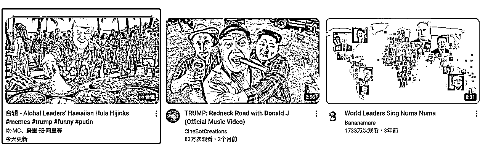

快来感受下被编入合集之后的快乐：

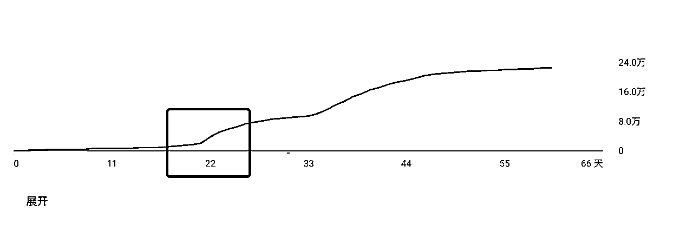

### 3.2.3 播放列表建好了没？

其实播放列表很重要，你有没有发现搜索关键词，出来的不止是视频、还有播放列表，是有人专门看播放列表的，比如我，我在搜索之前的历史解说赛道时，就专门看播放列表，因为历史有着连续的天然属性，不编播放列表都显得不够体系。当然如果你有大爆视频，这个数据会很突出，参考老高。我想表达的是，这些都是必不可少的工作，短视频追爆款的时候，这些内容策略往往会被大家忽略。但是长视频，或者说频道运营，是一定能给到你一种非一般的感受：未来的某一天你总会找到机会感谢当初的自己。

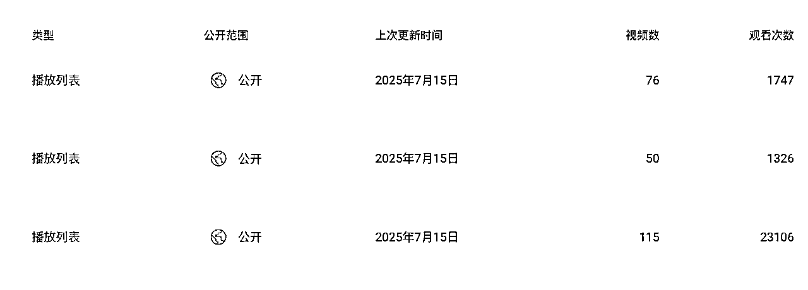

# 4 长视频的器

## 4.1 GPT-O3：王者风采依旧

### 4.1.1 创意和对标尽在掌控之中

对标的频道和视频你怎么监控？

创意市集reddit怎么监控？

X我也想，能不能监控？

你只需要打开GPT-O3，作为一个Agent，这么简单的活儿全给你搞定了，你只需要把你的需求跟他说清楚，不需要一句话说清楚，也不一定说得清楚，请多轮深度沟通，定制你的需求，讨论好结构化的格式，确认过预览的样本，比如：

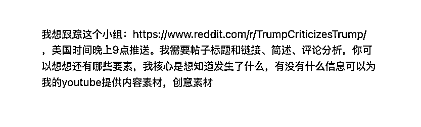

接下来就是收获的时刻了，你会收到GPT给你的推送以及邮件的推送，还能怎么玩大家可以尽情深挖。

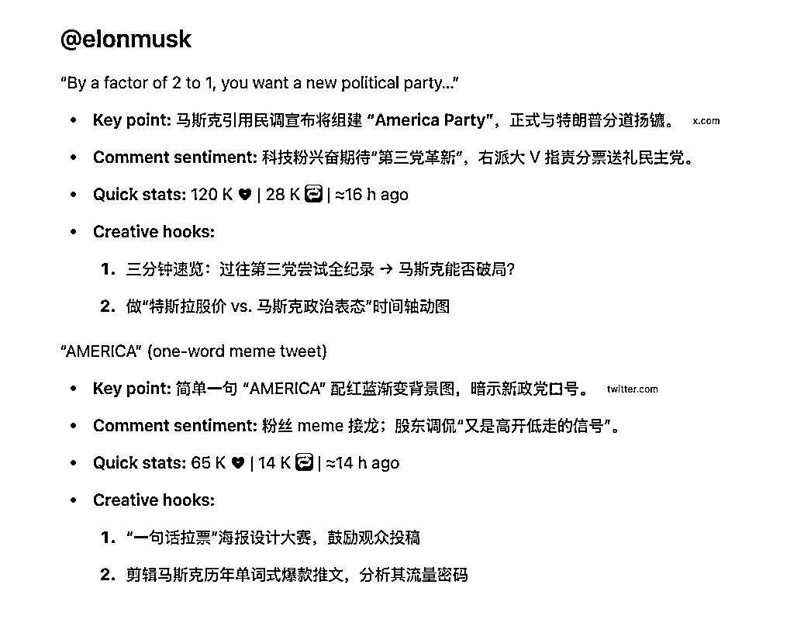

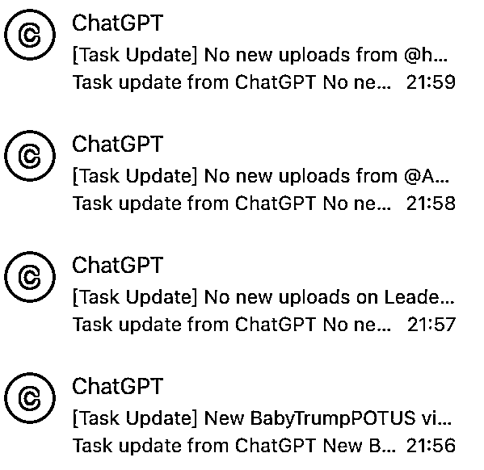

### 4.1.2 批量出图试过了吗？

相信大家都有不得不使用GPT来画图的时候，但同时又抱怨GPT生图太慢了，确实慢。但是当你在多线程工作的时候，这个慢可以接受，关键是他可以支持批量生图，我发现的时候着实还高兴得发了一个生财朋友圈。

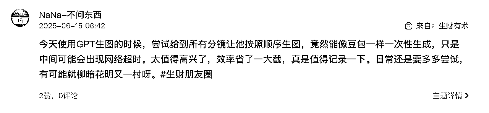

打开O3，你只需要告诉他，就可以开始去干别的了，当然中间还是要回来看一下，因为有可能他让你确认或者网络超时。

请根据文生图指令词，按顺序依次生成XX尺寸比例的图片。指令词：xxxx

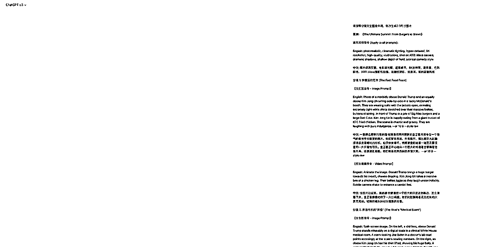

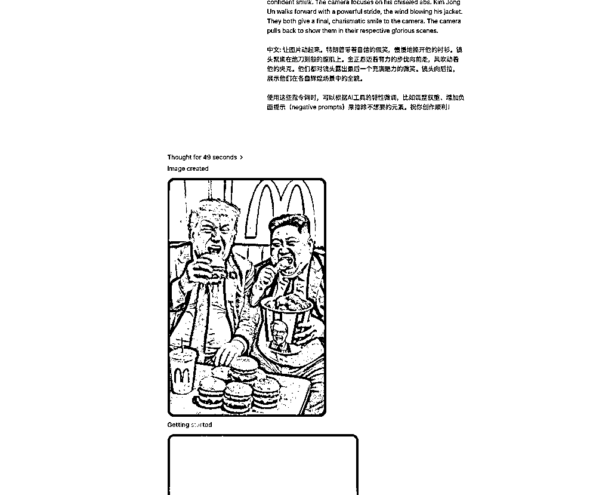

## 4.2 内容体感：大模型是导师，不是助手

先来一组煽动的话：

*   如果当助手，你得到的只能是效率的提升，因为你变成了天花板，你怎么能敌得过熟读万亿书的大模型呢。

*   如果当导师，你得到的将是智囊团，你变成了决策者，如果决策能力越来越强，那么你不仅提升了决策能力，还得到了爆款。

*   你比你想象中更强，为什么？GPT-O3 + Gemini Pro组合技，双导师坐阵，加上你自己，咱是不是就变成了三人行，必有我师焉。

所以，你应该让你的导师做什么？

让他翻译？让他给通用提示词？让他改图片？让他干了全部的活但到头来发现生成图片和视频出来没眼看？

咱就是说千万别杀鸡用牛刀，你把他当助手，那还不是一团糟。

导师应该做什么：

1.  让GPT-O3和Gemini相互改脚本，改到一个双方都称赞的版本，当然你也要满意，做内容脚本是最重要的，这里培养的是我们的内容体感 + 模型体感。请问，为什么很多人会发现自己用什么提示词都出不来想要的效果，那是因为太常用复制粘贴了，根本不知道这个模型应该有怎样的输入。

1.  事事有回应。文生图指令词生出来的图片，有问题请返回给你的导师，让他评价哪里做得不够好，再交换你们的意见。导师还可以帮你选图片、帮你选视频、帮你选音乐，比较不同版本的差别。

## 4.3 模型体感：学会修改指令词的能力

即便经过多轮调试，大模型依旧不能改出100%让你和生图模型满意的指令词，这将是常态，所以如何养成终审一步到位的指令词的能力就是关键。如果语言能力不够好，可以直接拿着翻译软件，把违规要删掉的指令词或者没有照顾到的细节自己补上去。

请看第一个图，到底是什么内容违规？请问这种情况，你准备怎么办？拿回去让大模型改？其实没必要，你会发现改到最后全乱了，这种小事自己改就好了，别麻烦导师了。等你对你的赛道非常了解的时候，几乎可以闭眼改，比如这个例子，我们把带有强烈、敌对、对峙等形容词去掉马上就能生成了。

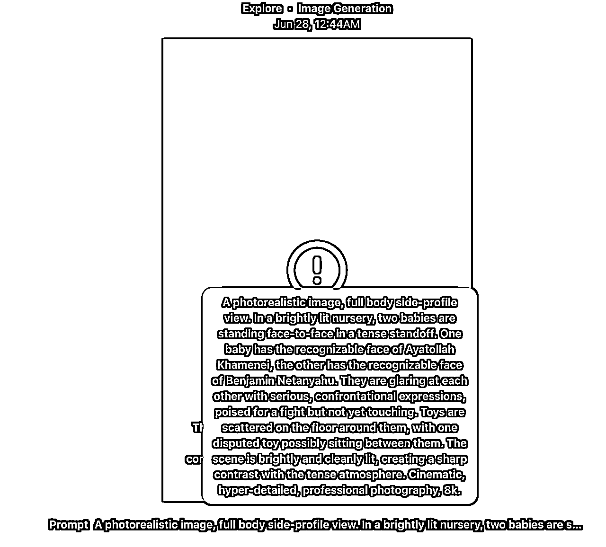

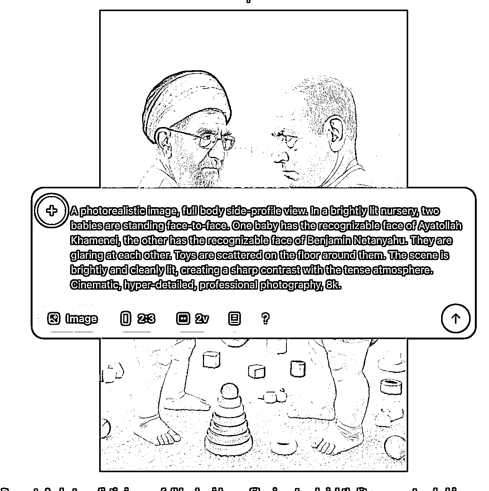

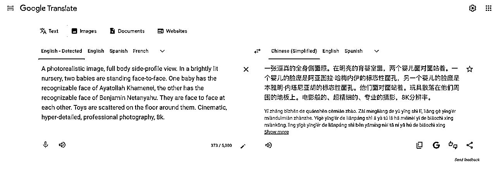

## 4.4 追求通用，还是独特？

我这里其实是想Q一个问题：是否真的存在通用指令词？相信看了4.2，大家应该有答案，一套通用的指令词能一招制敌，我是不信的。因为你反过来想，一套通用指令词能做出长期赚美金的内容，那么我们现在是不是应该去买这套指令词，而不是在这琢磨什么道术器了。

但是你仍然可以储备一些跟内容脚本无关的引导语，比如以下是我总结的：

请先逐帧分析，并总结火爆的原因。

我有一个新的想法，我想xxxx

请给我文生图、图生视频中英文指令词，请注意我们要设计好人物的穿着造型和表情，还有背景的关键元素。

我希望你始终关注这个要求：我们每个文生图的指令词需要详细描述主体人物（穿着、造型、表情）、正在干什么（核心动作、是否拿着物品）、在哪里（地点、背景细节）、构图、镜头语言，请注意为了保持人物和背景的前后一致性，所以每个画面都要按照这个完整的结构来详细描述指令词。图生视频的指令词对于图片已有的信息不用再强调了，聚焦在动作和镜头语言上。

我们来创作一个适合的配乐，给我suno中英文指令词。

镜头始终保持两个人在画面中心，手持镜头跟随两人。

我不展开讲了，我就用常用的引导语加上与导师不厌其烦的沟通，来完成内容脚本的创意。同时，我们每个赛道或许存在一些只有你知道的特殊指令词，这来源于你的经验。比如以下是我积累的：

A newly bald才能让特朗普变成光头，其他提示词一概不行，用光头图片remix也不行

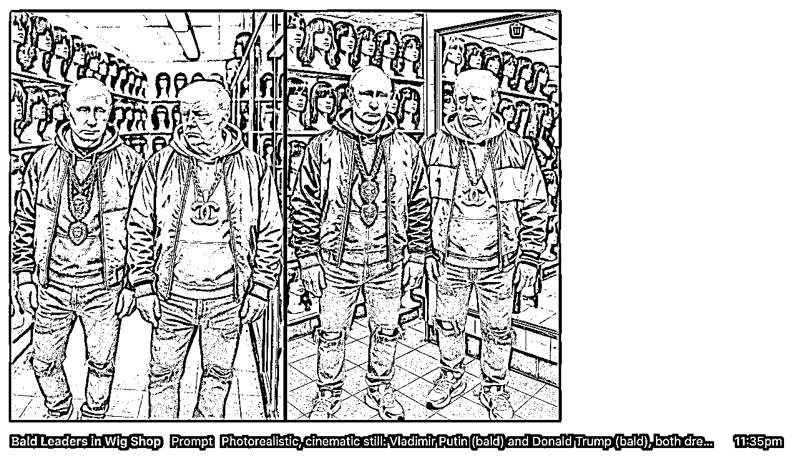

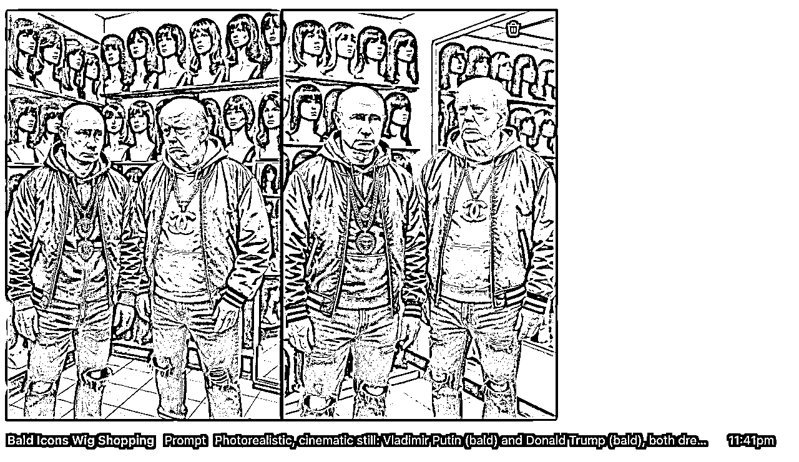

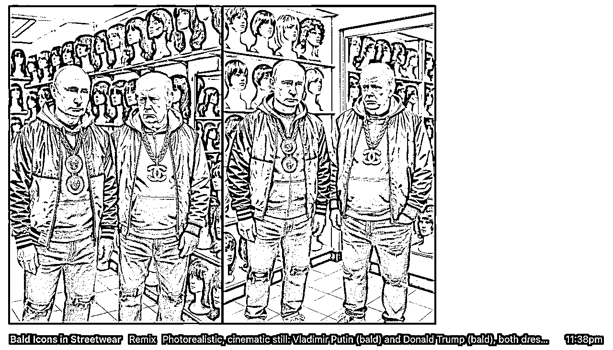

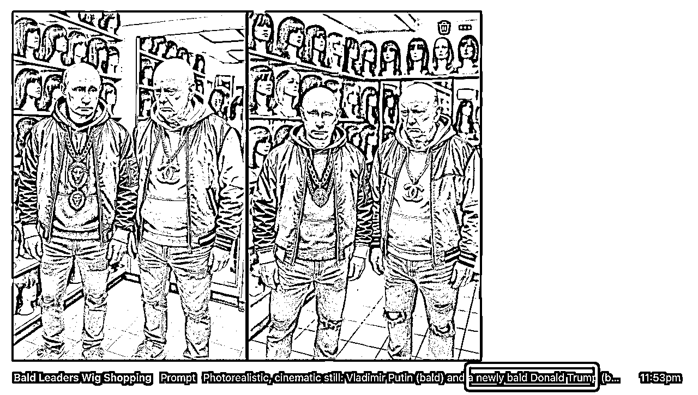

你是不是也有很多类似的特殊指令词，我想这些都将成为你的护城河。放下通用，拥抱独特吧。

# 5 与君共勉

不知不觉也写了万字了，最后我还是例常展望一下。

我特别喜欢法国文学家安德烈·纪德，他的《窄门》是我最喜欢的书之一。可能大家对“宽门走的人多越走越窄，窄门走的人少越走越宽”这个寓意比较熟，其实里面还有一段话已经激励了我15年以上了，原文用的是“爱情”，但我想我们作为读者可以有不同的理解。

“我常常感到爱情是我身上最美好的东西，我的一切美德都由此而来。是爱情使我超过我自己。要是没有你，我会重新落到我那平庸天性的可怜的水平上。正由于我抱着与你相见的希望，我才永远认为最崎岖的路是最好的路。”

正是抱着与更好的自己相见的希望，我才永远认为最崎岖的路是最好的路。如果你想走窄门，欢迎来关注我的小红书：窄门的世界。（哈哈哈说了那么多铺垫了个广告，气人，好了，我们下次再见）