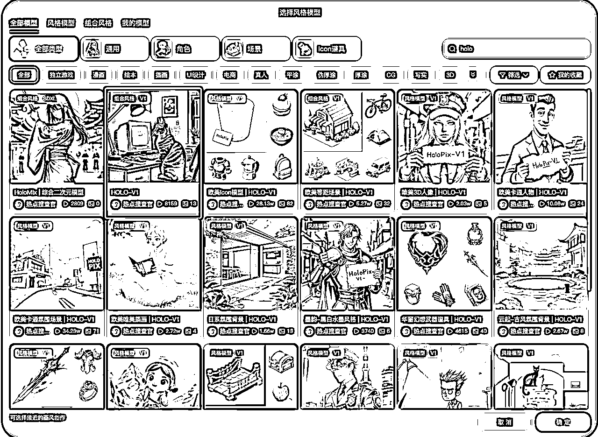
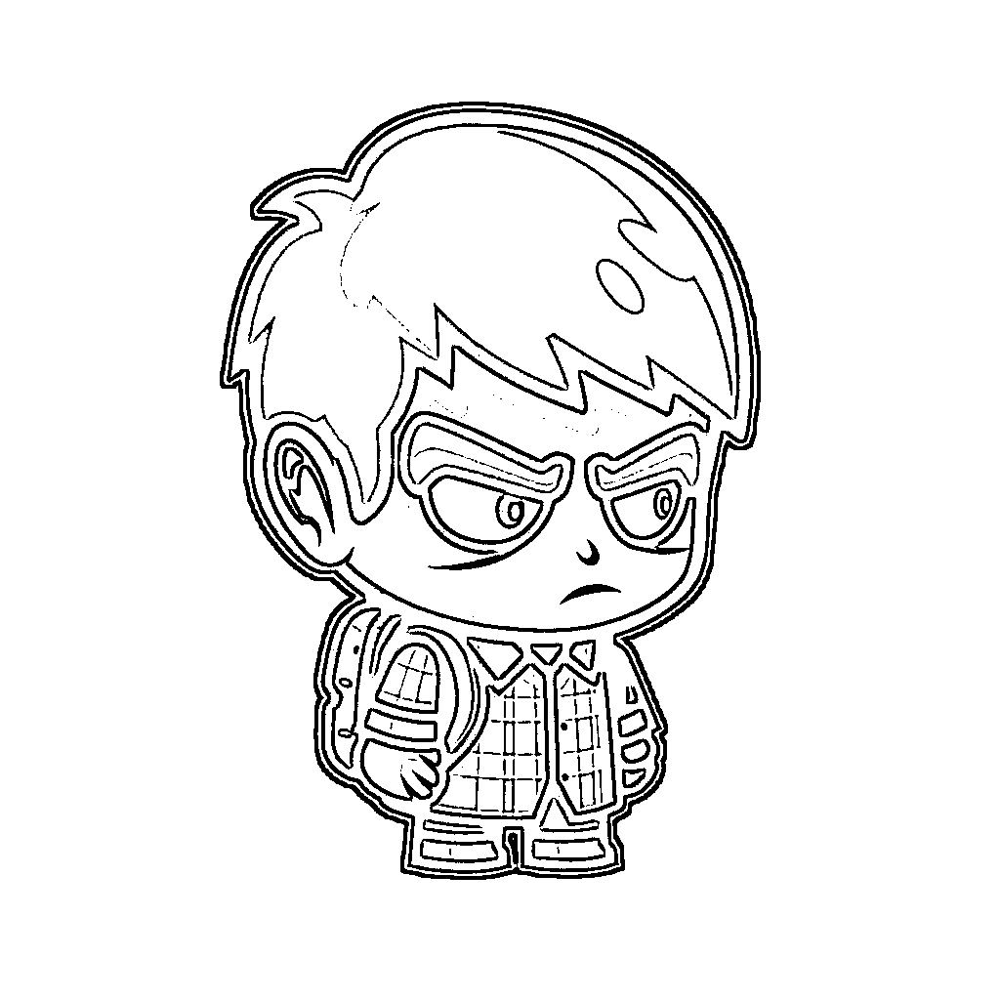
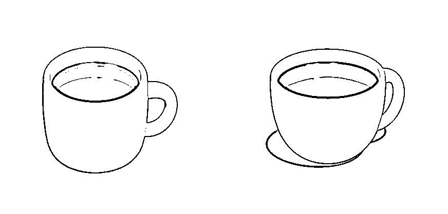
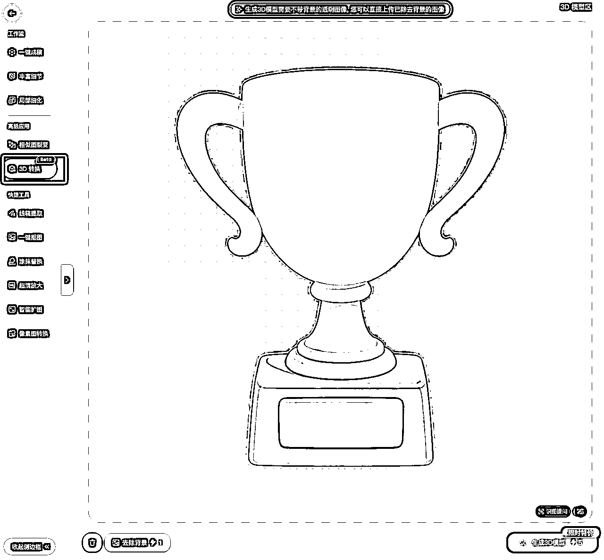
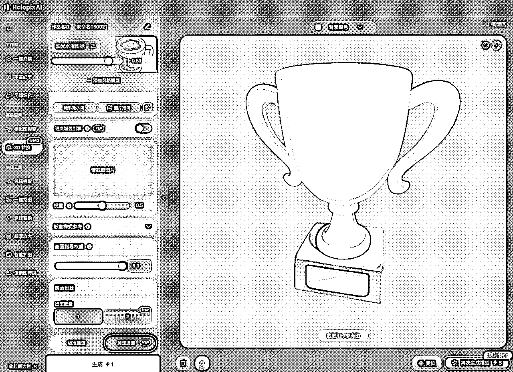
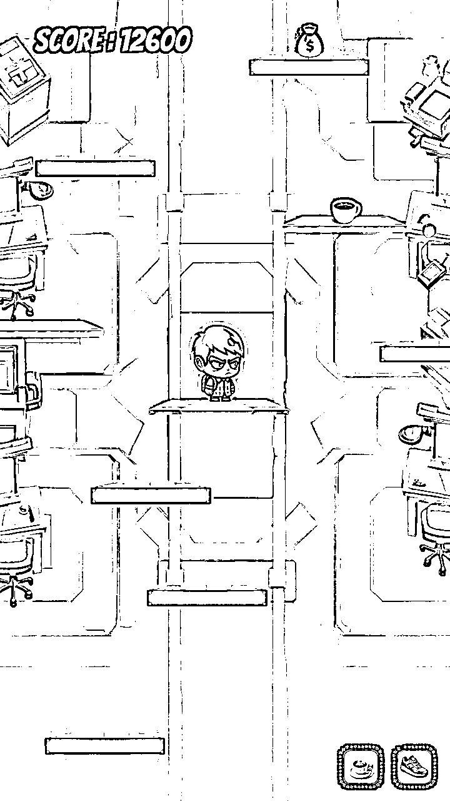

# 我把打工人的怨气做成了一款游戏

> 来源：[https://av6ec5kbn6.feishu.cn/docx/RWD3d8C9Iot09zx2dKucj6l0nrc](https://av6ec5kbn6.feishu.cn/docx/RWD3d8C9Iot09zx2dKucj6l0nrc)

凌晨3点，我看着文件夹里那份名为《社畜逃生记》的策划文档，又一次陷入了沉思。

作为一个程序员，我有绝佳的游戏创意，有扎实的开发技能，甚至连音效都能自己搞定。唯独有一样东西，让我的游戏梦想年复一年地躺在硬盘里——美术资源。

外包？预算不够。自学？时间不够。求朋友？人情债比钱更贵。

直到某个失眠的夜晚，我遇到了 Holopix.cn...

几个小时后，我的《社畜逃生记》第一次有了真实的模样。

这是一个关于"打工人"在无尽的加班黑雾中垂直向上逃生的故事。它的灵感，来源于我们每个人真实的职场体验。策划虽好，但几十种角色、道具的美术需求，对于我这个程序员来说，几乎是不可能完成的任务。

今天，我想完整记录下，我是如何使用 Holopix.cn 这个AI创意平台，将这份文档里的文字，逐一变为真实的游戏资产。

### 为什么是Holopix？

在尝试了几个AI绘图工具后，我发现Holopix有几个特别适合游戏开发的功能：

🎨 模型广场：专门针对不同风格优化的模型库，"卡通角色"模型完美契合我的需求

🔄 风格一致性：同一项目下的所有素材能保持高度统一的视觉风格

🎮 游戏素材模式：专门为游戏道具、角色、场景优化的生成逻辑

🌟 3D转换：独特的2D转3D功能，让重要道具有更强的视觉冲击力

对于我这种"美术小白"来说，这些功能就像是为游戏开发者量身定制的。

用过stable diffusion，或者其他在线ai工具的朋友来说，你一定会非常熟悉，能非常快速上手使用，因为Holopix其实就是专门针对游戏ai美术的专业方向定制化的ai绘图工具

### 一、定调：为游戏注入"社畜"之魂

一款游戏的美术，始于风格的确立。

考虑到《社畜逃生记》题材的荒诞与戏谑感，我最终选择了"美式卡通扁平化"风格。它色彩明快，线条简单，既能表现职场的压抑，又不失休闲游戏的趣味性。

在Holopix平台上，我没有选择自己训练模型（成本考虑），而是找到了一个非常契合的"卡通角色"基础模型。这是保证后续所有产出物风格统一的关键一步，相当于为整个项目找到了视觉地基。

没错，其实Holopix本身还支持定制化的模型训练，训练的方式也非常简单，在训练界面调整几个必要参数，上传你需要投喂的训练素材即可训练自己的定制化模型

### 二、孵化：从"打工人"到整个道具库

风格确立，接下来就是最激动人心的"创造"环节。

1.  主角团的诞生 👨‍💻

首先，是我们的主角——一个典型的"程序员"。我向Holopix发出了我的第一个指令，尽可能地描述我心中的形象：

✍️ 我的AI提示词 (Prompt):

一个Q版的卡通程序员，亚洲男性，穿着格子衫，背着双肩包，有黑眼圈，表情疲惫但坚定，正面全身像，干净的白色背景，游戏角色设计，2D游戏素材

结果令人惊喜。通过微调关键词（例如将'格子衫'改为'黑框眼镜'、'西装'等），与程序员风格一致的设计师、老本、HR等形象也相继诞生。

💡 我总结的实用经验

🎯 保持风格统一的方法：

1.  选定基础模型：在Holopix模型广场确定一个风格基调，全程使用

1.  建立关键词库：为项目建立一套标准的风格描述词

1.  迭代优化：不满意就调整prompt，AI很"听话"

📝 我的Prompt写作套路：

[具体物体] + [风格定义] + [技术要求] + [背景设置]

比如：

一个疲惫的程序员 + 卡通扁平化风格 + 2D游戏角色设计 + 纯白背景

1.  道具库的"批量生产" ☕️

《社畜逃生记》的精髓，在于GDD中那几十种花样繁多的道具。这也是最能体现AI生产力的地方。

### 一个小插曲："踩坑"与优化

当然，创作过程并非一帆风顺。在生成"速溶咖啡"图标时，我最初的Prompt很简单：一杯速溶咖啡。虽然也能生成一杯咖啡的图，但是感觉跟我的预期还差点，于是我修改提示词“大口径咖啡杯，咖啡热气”等关键词得到了我想要的图。

我意识到，必须更精确地"教"AI。通过调整Prompt，强化风格词，最终得到了满意的效果：一个卡通风格的咖啡杯，扁平化设计，线条简约，大口径咖啡杯，咖啡热气，游戏道具图标，白色背景。

这个小小的"坑"让我明白，使用AI不是"一劳永逸"，而是一个不断沟通、修正和优化的过程。

⚠️ 我踩过的坑：

*   描述太简单 → AI理解偏差大

*   忘记强调"游戏素材" → 生成图片不适合游戏使用

*   风格词不一致 → 最终效果杂乱无章

### 三、升维：让重要道具"活"起来

在GDD里，我设计了一些极其稀有的"史诗级"道具，比如"升职通知"。对于这类核心奖励，我希望它们在游戏中能有更强的存在感。

这时，Holopix 的「3D转换」功能完美解决了我的需求。

操作很简单：

1.  用AI生成一张精美的2D"升职通知"图标

1.  一键转换成3D模型

1.  可以360度旋转展示，甚至导出到游戏引擎

这种"升维"的视觉效果，能极大增强玩家获得稀有道具时的仪式感。更重要的是，整个过程不需要我懂任何3D建模技术。

### 四、成果：当所有元素汇聚成一个世界

当角色、道具、背景等所有美术资产准备就绪后，我用图片处理软件，将它们"组装"在了一起。那一刻，我的《社畜逃生记》第一次有了真实的模样。

### 回到那份策划文档

看着屏幕里那个顶着黑眼圈的程序员，踩在象征"deadline"的平台上，躲避着不断上升的"加班黑雾"……这一切，都源于那份曾经无法实现的GDD文档。

AI没有取代任何人，它只是成为了我创意的执行者。

它让我从繁重的美术工作中解脱出来，专注于真正重要的游戏设计和玩法打磨。那些因为技术门槛而搁浅的想法，终于有了实现的可能。

或许，你的硬盘里也有一份这样的文档。

不妨，现在就把它"说"给AI听。