# 「深海圈」海外AI产品-如何查看新站数据

> 来源：[https://tq6ekke6d8n.feishu.cn/docx/RaX6d0DqFoga2oxvhZCc79O4nUe](https://tq6ekke6d8n.feishu.cn/docx/RaX6d0DqFoga2oxvhZCc79O4nUe)

# 引言

学习完小排老师的课后，也将自己的3个站发布到了线上，然后呢，就没有然后了吗？

其实不是的，你可以观察每天的数据，而不是等着不一定到来的波天的流量。

今天就讲一下，通过谷歌的工具，监控自己网站的数据，查看自己网站每天的用户访问，使用时长等情况。

这个是完全免费的。

今天讲的是针对新的海外网站，如果你的网站已经上线好几个月了，可以使用一些更好的插件，比如：

AITDK谷歌插件。

效果图

我们先看下效果图吧！如下：

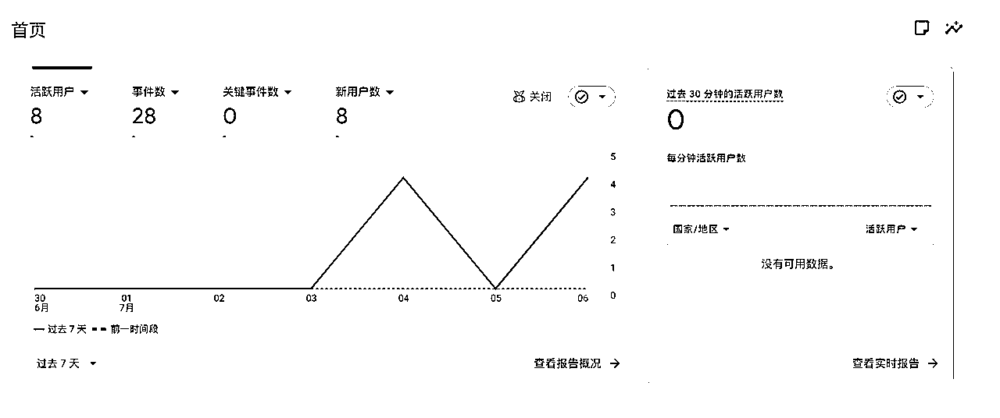

# Tips

Google Analytics虽然是免费的，但是功能依然很强大，常用且好用的功能包括流量获取、用户行为、转化分析和受众分析等。

下面是让AI总结的一部分，仅供参考。

1\. 流量获取（Acquisition）

*   分析用户是通过哪些渠道（如自然搜索、广告、社交媒体、直接访问等）进入网站

*   常用报告：

*   用户获取情况

*   流量获取情况

*   着陆页报告

*   应用场景：判断哪些推广渠道效果最好，优化营销投放。

2\. 用户行为分析

*   作用：了解用户访问哪些页面、停留时间、点击了哪些内容等等。

*   常用报告：

*   事件报告（如点击、下载、表单提交等）

*   网页和屏幕报告

*   互动度概览

*   应用场景：优化页面内容和结构，提升用户体验和转化率。

3\. 转化分析（Conversions）

*   作用：追踪用户是否完成了你设定的关键目标（如下单、注册、下载等）。

*   常用报告：

*   电子商务购买报告

*   结账流程报告

*   购买历程报告

*   目标转化报告（需自定义设置）

*   应用场景：分析转化漏斗，找出用户流失点，优化转化路径。

4\. 受众分析（Audience）

*   作用：了解访问者的基本属性，如地理位置、设备类型、兴趣偏好等。

*   常用报告：

*   受众特征详情

*   用户属性概览

*   技术概览（设备、操作系统、浏览器等）

*   应用场景：精准定位目标用户，制定个性化营销策略。

5\. 实时报告（Realtime）

*   作用：实时监控当前有多少用户正在访问网站、他们来自哪里、正在浏览哪些页面。

*   常用报告：

*   实时用户数

*   实时流量来源

*   实时热门页面

*   应用场景：监控活动推广效果、及时发现异常流量。

6\. 漏斗分析与自定义报告

*   作用：自定义分析用户在网站上的行为路径，追踪特定事件或转化流程。

*   常用功能：

*   自定义漏斗报告

*   探索（Explorations）功能

*   应用场景：复杂业务流程分析、A/B测试、用户分群分析。

7\. 报告导出与分享

*   作用：将分析结果导出为PDF、Excel等格式，或定期通过邮件分享给团队成员。

*   常用功能：

*   导出报告

*   安排定期生成报告

*   通过邮件发送报告

# 详细教程

首先打开谷歌分析 https://analytics.google.com/analytics/ .如果你没登录需要谷歌登录

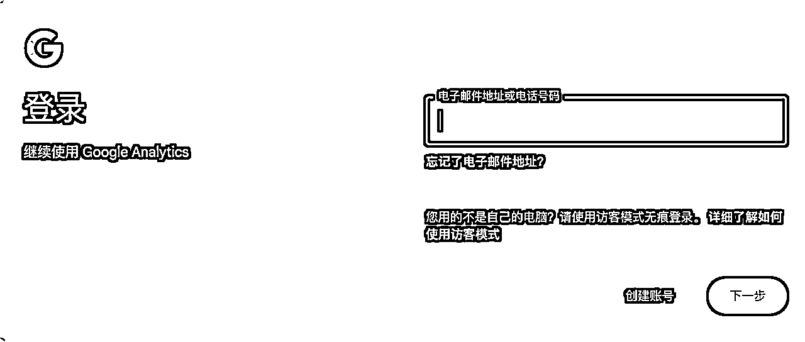

点击左下角的设置按钮，在设置页面中点击“媒体资源”按钮

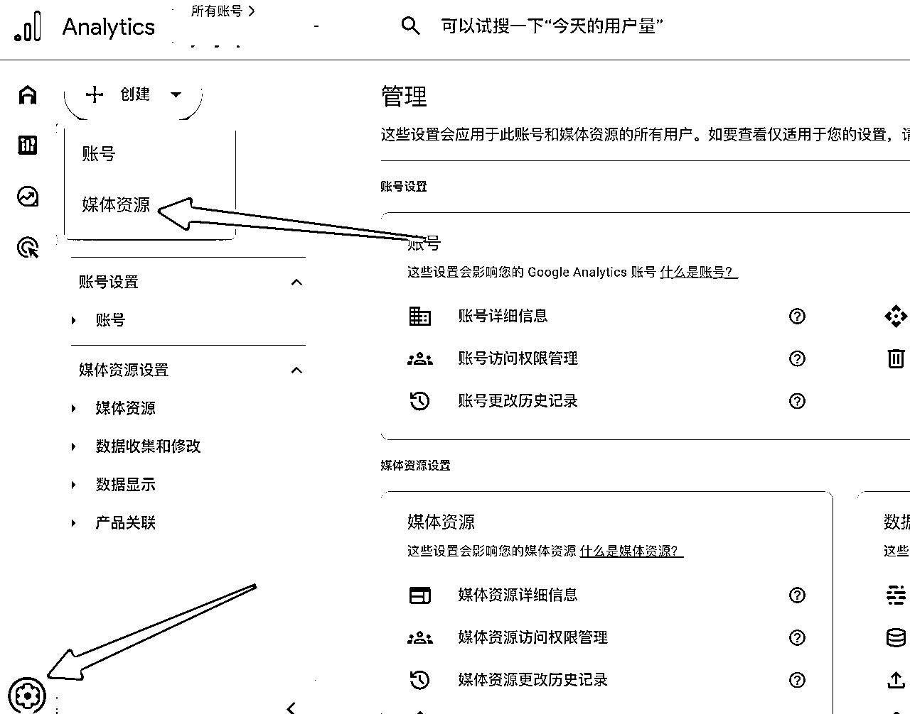

# 媒体资源名称（必填）

“媒体资源名称”就是你给自己网站起的一个名字，方便你以后在谷歌分析里找到它。随便起个你能认出来的名字就行，不用太纠结！

怎么填？

1.  名字要能看懂 比如我的网站是“labubu51.store”，就可以直接填“labubu51.store”或者“Labubu51海外网站”。

1.  不要太短也不要太长 名字要有4个字以上，100个字以内。 比如：“Labubu51官网数据” 、“Labubu51 Store 数据统计”都可以。

1.  用中文还是英文都行 你自己看着顺眼就行，别人不会看到，主要是你自己以后能认出来。

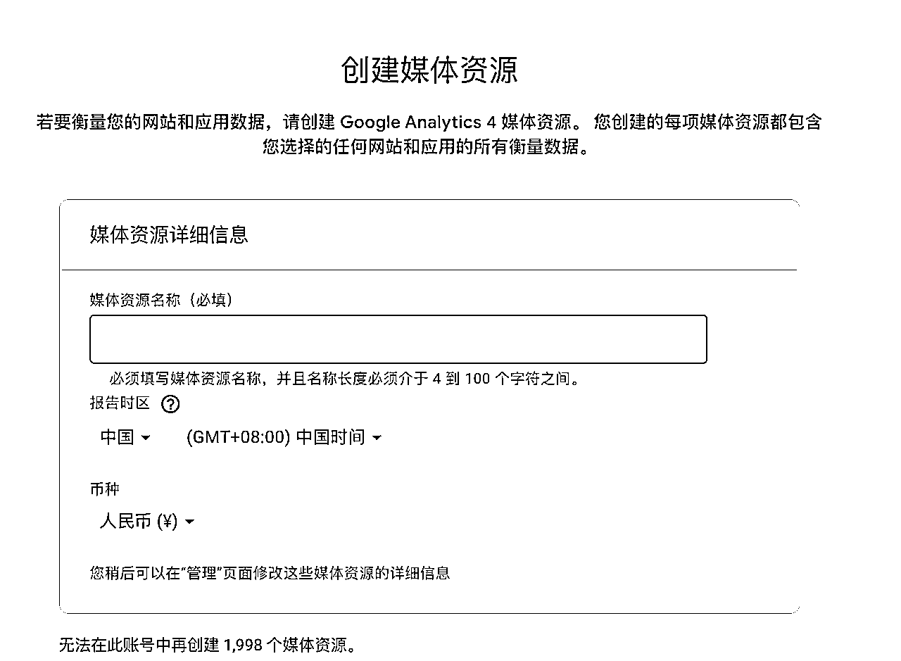

# 行业类别 & 业务规模

你要选择和你网站内容最接近的行业类别，比如“购物”或“互联网与电信”。

行业类别就是让你告诉谷歌分析，你的网站主要是做什么的。方便谷歌更好地分析数据。这个行业类别列举的主要有下面几种，你的网站可以根据具体种类做选择：

*   艺术与娱乐：比如音乐、电影、画廊

*   美容与健身：比如美妆、健身房

*   餐饮：餐厅、外卖

*   健康：医院、诊所、健康资讯

*   互联网与电信：如果你的网站是做网络服务、软件、技术的

*   求职与教育：招聘、学校、培训

*   新闻：新闻网站

*   旅游：旅行社、订票

*   其他业务活动：如果上面都不合适，就选这个

因为我的网站是卖拉布布壁纸图片的，所以我可以选择「购物」

如果你的网站是做AI绘画图片或者AI视频，可以选择「艺术与娱乐」

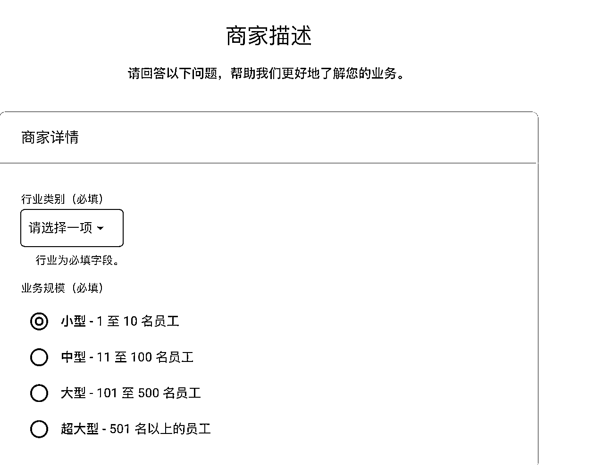

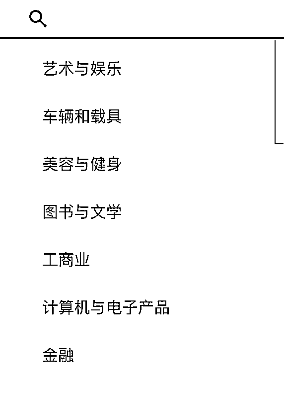

# 选择您的业务目标

下面的几个选项就是字面意思。

可以全勾选吗？可以！

官方建议只选1-2个，这样可以让谷歌分析更精准地给你推荐数据分析方法和报告内容。参考「https://support.google.com/analytics/answer/12924488?hl=zh-Hans」[GA4]“业务目标”集合]

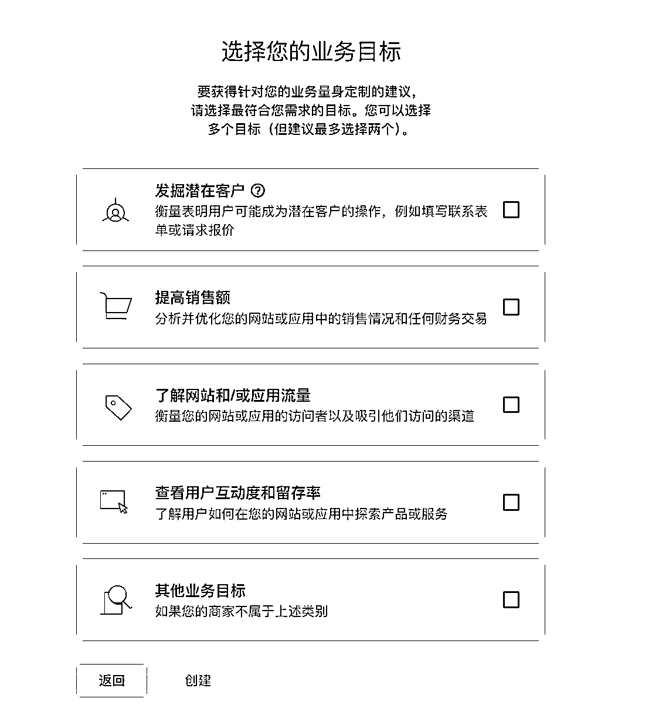

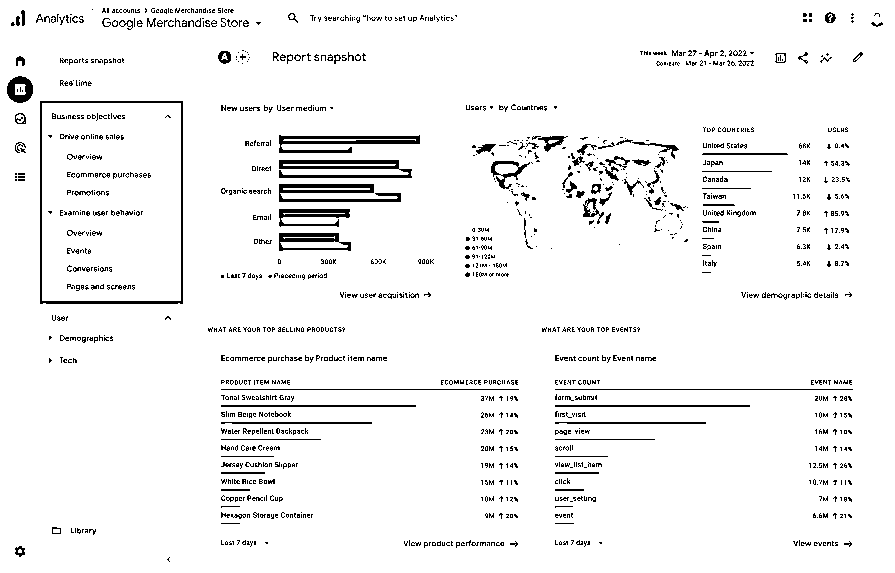

# 数据收集平台选择

根据自己的需求选择，我们做的是海外网站，就选择「网站」，然后填写网站url信息。点击右上角「创建并」

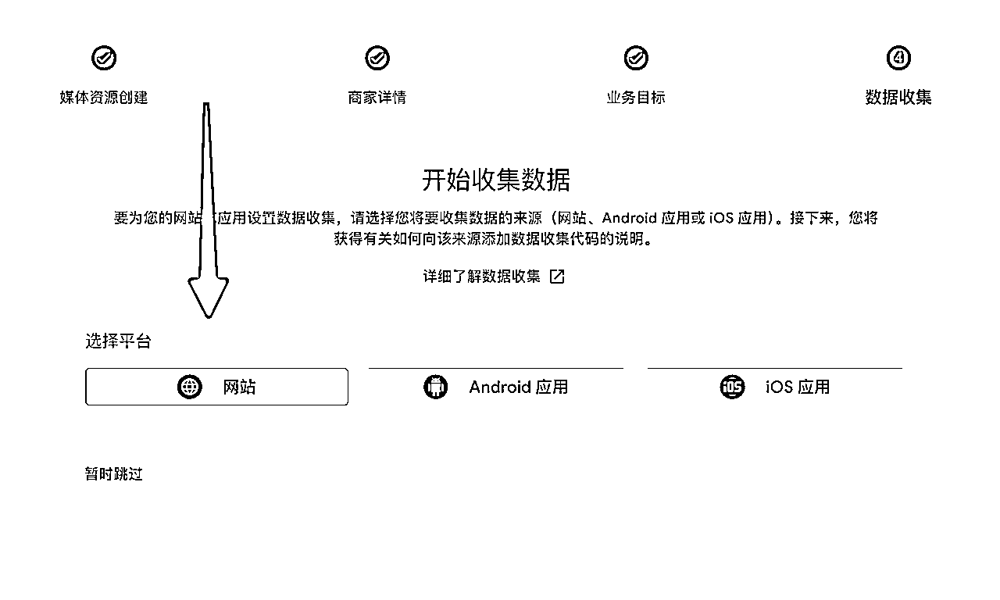

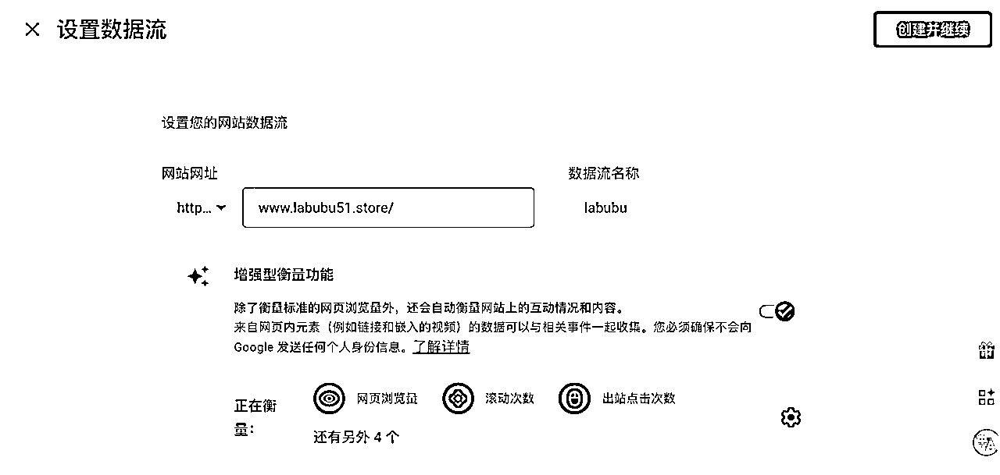

# 添加数据流

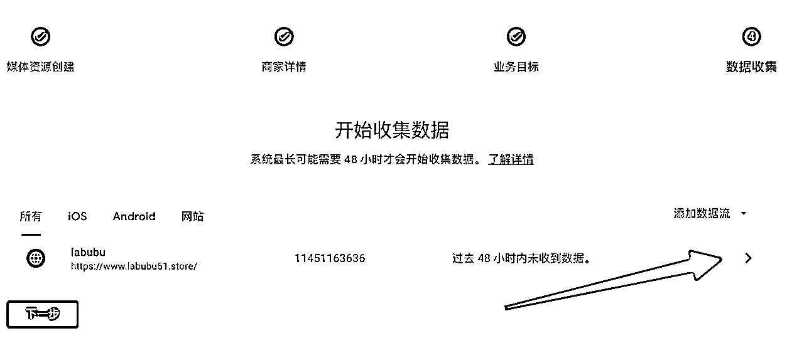

添加代码

如果你的网站有很多页面，那么每个页面的

元素之后都要添加代码。如果只有一个主页面，添加一次就可以了。你也可以直接告诉cursor，让cursor给你添加。

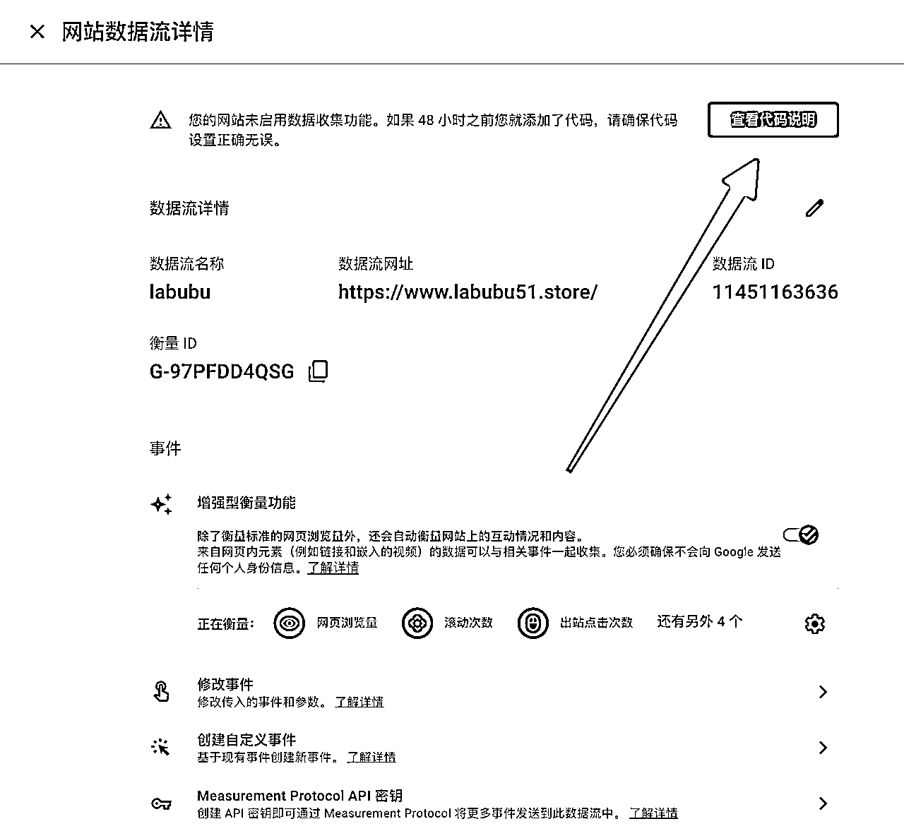

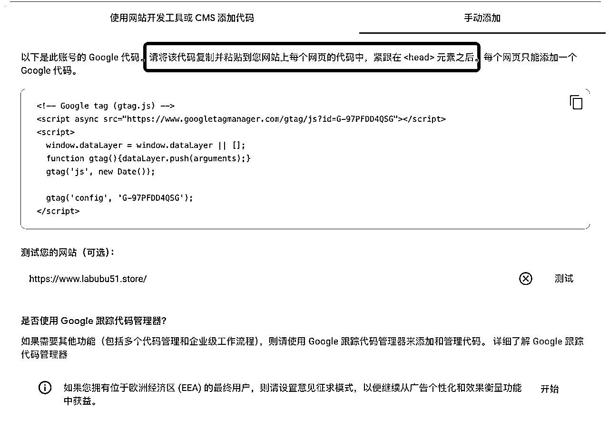

让cursor添加代码prompt。

```
请帮我把 Google Analytics 提供的追踪代码，添加到这个项目的所有页面中。具体要求如下：
 1\. 复制我提供的 Google Analytics 代码。
 2\. 在每个网页的 HTML 源码中，找到 ⁠⁠ 标签。
 3\. 将这段代码粘贴在 ⁠⁠ 标签后面（紧跟着），确保每个页面只添加一次。代码如下：

请确认操作完成后回复我，谢谢！
```

提交代码到github，vercel自动化部署。

PS：你的代码提交部署后，不会立刻生效，需要等1-2天左右，基本上1天就OK

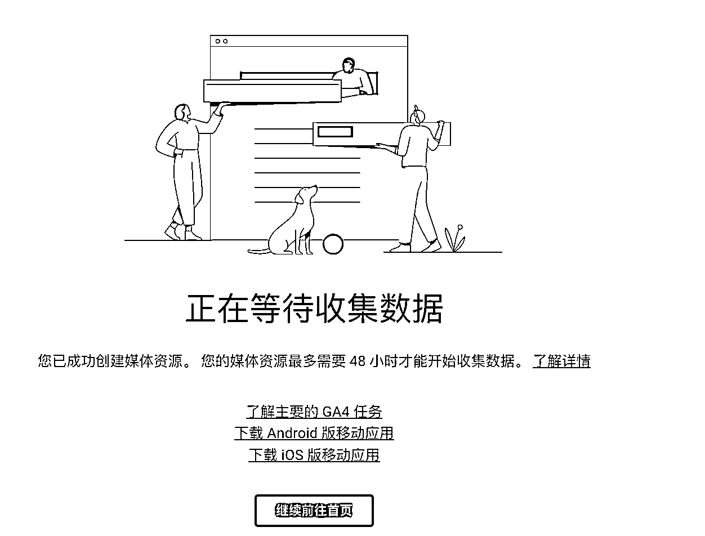

剩下的事，等着泼天的流量到来！

Good Luck！

# 送福利

下面赠送几个claude code 的体验兑换码，可以免费体验一天。欢迎薅羊毛。

*   卡号：MC4KJMX5-CZIIH3

*   卡号：MC4KJMXA-P9XXWR

*   卡号：MC4KJMXE-95RTZ3

*   卡号：MC4KJMXI-NIDUNG

*   卡号：MC4KJMXM-OA3MCT

如何使用