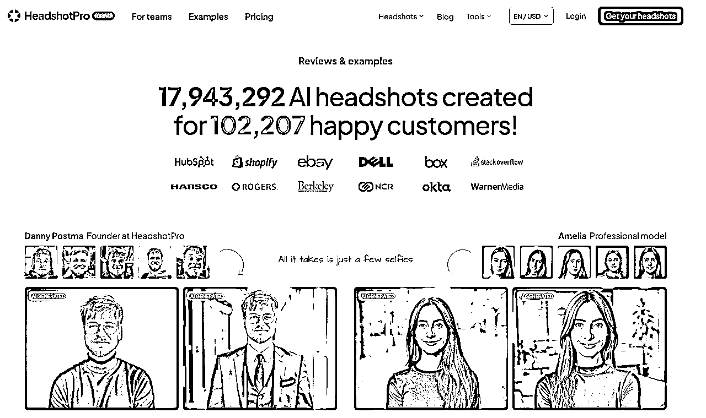
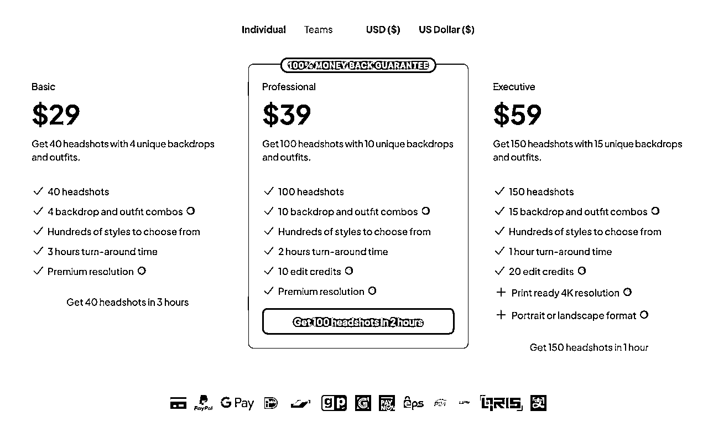
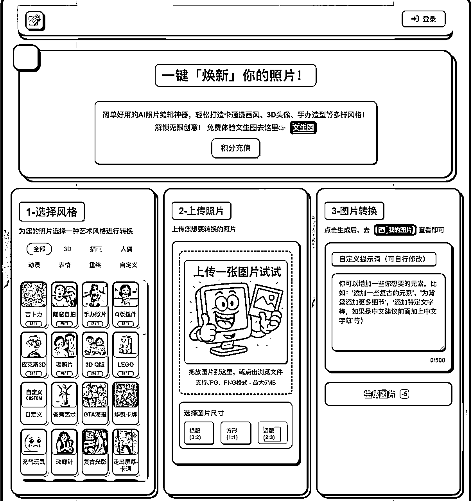

# AI图像变现调研：普通人如何抓住新红利，两大模型全解析

> 来源：[https://wosa79zedo.feishu.cn/docx/VRXzdMSJWoKY9jxxyW9c1kxlnLh](https://wosa79zedo.feishu.cn/docx/VRXzdMSJWoKY9jxxyW9c1kxlnLh)

## 1.AI图像生成，让普通人也能掌握创作主动权

GPT-4o发布后，我最大的感受是：AI图像生成，这个曾经需要专业技能和昂贵软件才能玩转的领域，现在彻底成了咱们普通人的“免费午餐”。

过去，一张商业海报、一个产品Logo，动辄几百上千。现在，你只需要对着手机说几句话，AI就能在几分钟内“吐”出几十张风格各异的专业级作品。它把创作的门槛，几乎从珠穆朗玛峰降到了你家门口的台阶。

你还记得吗？二十年前，很多人看不懂淘宝，结果错过了电商时代；五年前，很多人看不上短视频，结果错过了流量红利。历史总是在重演。

AI图像这波浪潮，不再是少数极客的自嗨，而是指名道姓给咱们这些“没背景、没资源，但有执行力”的普通人准备的新机会。 如果此刻你还在观望，错过的可能不是一个风口，而是一个能让你弯道超车的时代。

问题来了：风口就在眼前，我们怎么才能抓住？普通人真能靠AI搞到钱吗？

答案是肯定的。但关键在于，你不能只当一个刷图点赞的“消费者”，而要成为一个下场掘金的“淘金者”。

市面上的AI玩法很多，但经过我反复对比和拆解，最终锁定了这两条路。它们是目前看来，确定性最高、最适合咱们普通人快速上手的AI变现路径，手把手带你少走弯路，直接开干。

路线图很清晰：

模型一：“卖铲人”模式。 打造一台7x24小时帮你收钱的“AI赚钱机器”（网站/小程序），做的是复利生意，天花板极高。

模型二：“淘金者”模式。 直接用AI做图、做内容卖钱，主打一个“零成本、见效快”，当天上手，当天就能看到收益。

接下来，我们把这两种模式掰开揉碎，配上全球爆款案例和国内落地玩法，保证你看完就能上手。

## 2.模型一：“卖铲人”——打造一台不下班的AI赚钱机器

### 2.1 这条路，玩的是什么？

说白了，这条路就是不自己下场“淘金”，而是给所有“淘金者”提供最高效的“铲子”。

你不再是一张张地卖图，也不是靠信息差或体力赚钱。你的核心是打造一个产品（网站或小程序），把某个AI能力封装进去，让成千上万的用户付费自助使用。你需要解决的，只是一个非常具体、非常刚需的小问题，比如“AI生成商务头像”、“AI老照片修复”、“AI智能证件照”等等。

这个模式最迷人的地方在于两点：一是“规模化”，二是“极低的边际成本” 。

前期你把产品打磨好，一旦上线，服务10个用户和服务1000个用户，你所需要投入的时间和精力几乎是一样的。它就像一台你亲手打造的印钞机，一旦开动，就能7x24小时为你工作，带来真正的复利增长。 门槛确实比直接卖图高一点，但它的想象空间和长期价值，绝对值得你下功夫深挖。

### 2.2 拆个案例给你看：HeadshotPro.com 如何年入百万美金

为了让你看得更明白，我带你拆一个全球最火的案例——HeadshotPro.com，一个专门用AI生成专业商务头像的网站。

它解决了什么痛点？ 传统拍商务照，贵、慢、还麻烦 。去影楼动辄上千块，预约排期加修图得一两周，很多人还有镜头恐惧症。

它的解决方案有多绝？ HeadshotPro直接把价格打到传统摄影的1/8，2小时内交货，给你上百张备选。你只需要上传几张生活照，AI自动搞定一切，效果跟影棚精修没区别。“又快、又好、又便宜”，完美击中用户爽点。

它怎么赚钱？ 模式简单粗暴：29美元买断40张头像，团队购买还有套餐优惠。对比几百美元的摄影费，这个价格让几乎所有人都没有决策压力。目前平台已经服务超10万用户，流水百万美金级别。

流量从哪来？ 50%来自Google搜索（SEO），37%来自老客户口碑推荐。这说明什么？只要你的产品真正解决了用户的痛点，流量会自己找上门。

### 2.3 别光看，手把手教你在国内怎么干

看到这里，很多人可能会有一个现实的疑问：国外用户付费意愿高，这个模式在国内真的行得通吗？

这个问题问得很好。我们确实需要做一个“本土化适配”。

国外案例的价值，在于向我们证明了这是一个真实存在的、能赚钱的市场。而国内市场虽然付费环境没有那么好，但不代表没有机会。已经有不少人开始尝试在做了，比如下面我找到的一个真实案例photo.ideafactorys.com。

我们的打法，不是去追求做成一个像HeadshotPro那样大而全的平台，而是去寻找一个“小而美”的切入口。

下面，我把在国内从0到1上手的路径给你重新梳理一遍，第一步，也是最重要的一步，就是找需求。

（1）第一步：找到你的“流量密码”——去追逐市场已经验证的需求

做SaaS工具，最忌讳的就是“我觉得用户会喜欢”。你要做的，是去找到那些已经被市场吼出来的需求，然后用AI把它产品化。

怎么找？答案是：去流量最火爆的地方“偷”灵感。

案例一：蹭热点，做“吉卜力风”头像生成器。

你还记得前段时间全网刷屏的“吉卜力风格”滤镜吗？小红书、抖音上很多人并不能第一时间用上国外大模型，都在求教程、找工具。这时候，如果你能迅速上线一个“一键生成吉卜力风头像”的小程序，哪怕只收费1块钱，靠着巨大的流量缺口，一天也能轻松赚几一笔。

案例二：追潮流，做“Labubu合影”生成器。

最近潮玩圈的顶流是谁？Labubu。想象一下，如果你做一个工具，让用户上传自己的照片，就能生成一张和Labubu的亲密合影，发到社交平台去炫耀。这个需求有多大？你只需要去小红书搜一下，看看有多少人在求P图，就知道了。

核心方法论就是： 紧盯小红书、抖音、微博的热搜榜，看大家在为什么样的图片和视觉风格而疯狂。一旦发现苗头，你的产品方向就有了。我们不是在创造需求，我们只是在用AI，更高效地满足一个已经存在的需求。

（2）第二步：技术和成本？在AI时代，这些都不是门槛

当你找到了一个明确的需求之后，我们再来谈技术和成本。

在今天，这俩已经是最不成问题的问题了。

技术怎么解决？ 你根本不需要懂代码！Cursor、Trae这些AI编程助手，就是你的“全天候技术合伙人”。你用大白话告诉它：“帮我做一个上传照片、生成图片的网站”，它就能把代码给你写好。

我在调研这个课题时就看到一个很好的例子（photo.ideafactorys.com），作者也是用 vibe coding 的方式，做了一个图片生成的网站，搭配了各种风格可以选择，采用积分制的方式变现。

成本怎么算？ 你的生意，本质上就是一道数学题：“用户单次付费金额>单张图片API成本 ”。只要你把握住这条，项目才有真实的赚钱空间。

目前，市面上主流的API选型路径，主要有两种：

方案A——追成本极致的“游击战”打法

第三方API平台：比如 api.tu-zi.com、kie.ai，圈友书虫的 apicore.ai这些第三方服务，直接付费买他们的API调用额度。

优点： 接入方便，谁都能用，不用自己部署。

*缺点： 稳定性依赖于第三方平台，要小心“跑路”风险。

方案B——要做长线就得走“正规军”路线

官方API：比如 Ideogram.ai 官方的API接口等。

优点： 稳定合规、长期项目可靠，适合规模化正规运营。

缺点： 成本比游击方案高，早期起量时压力会大些。

如果你还在项目验证期、想压低试错成本，建议可以先用“游击战”策略、灵活迭代。等生意跑通、日活上来以后，再考虑用“正规军”方案，确保业务长期稳定发展。这样既能快启动，也能留出后路，风险收益比最好。

（3)终极打法：用Coze+小微智能体在微信小程序里搭建“MVP”，跑通了再Allin

当你有了“吉卜力风头像”这个绝妙的想法，并且也选好了API之后，最容易犯的错误就是：立刻找人开发网站或APP。

因为在你投入真金白银之前，那个所谓的“需求”还只是你的一个假设。虽然现在 vibe coding 开发网站的成本也不高，但我们能不能用更便捷的方式去验证一下需求是否真的有人付费？

这里介绍一个方法，用Coze搭建“大脑”，用“小微智能体”搭建“身体”，用最低成本在微信生态里跑通一个完整的商业闭环。

第一阶段：花半小时，用Coze搭建一个可用的产品原型

在Coze里，你不是在写代码，而是在搭乐高。通过拖拽不同的“节点”，你可以构建出强大的工作流。

比如你想做一个labubu 合影的案例，你可以：

*   用“开始节点” 让用户上传图片。

*   用“问答节点”给用户提供选项（比如不同的风格）。

*   用“画板节点”把用户上传的图片和你的素材（比如头像框）合成在一起。

*   用“输出节点”把最终的图片返还给用户。 通过这样一套工作流，你就在半小时内，把一个想法，变成了一个真实可用的产品。 第二阶段：花十分钟，用“小微智能体”把原型变成小程序 你的产品原型做好了，但它还在Coze里，用户怎么用？ 这里就要用到关键的连接器——“小微智能体” 小程序。你只需要在Coze后台把你的智能体发布成API，然后在“小微智能体”里进行一次授权，它就能“秒变”成一个功能完整的小程序 ，自带分享、付费等功能（关于小微智能体的具体使用和案例，可以搜索官方的文档）。 第三阶段：设置兑换码，跑通你的私域变现模式 最关键的一步来了：怎么收钱？ “小微智能体”提供了一套天才的“兑换码”变现机制 。你可以在后台设置付费套餐（比如9.9元=100次使用权），并上传你的个人微信二维码。 整个变现流程是这样的：

1.  用户在你的小程序里用完成免费试用次数。

1.  系统弹出付费提示，并展示你的微信二维码。

1.  用户添加你为好友，直接微信转账9.9元给你。

1.  你在后台生成一个兑换码，发给用户。

1.  用户在小程序里输入兑换码，获得100次使用权。

这个模式的精髓在于：

零抽成： 钱是实时、直接到你账上的，没有中间商赚差价。

沉淀私域： 每一个付费用户，都成了你微信里的好友，方便你后续进行二次触达和复购。

第四阶段：精准投放，验证真实需求

现在，你拥有了一个功能闭环、付费闭环的小程序。拿着这个小程序的二维码，去小红书、抖音、微信群里，找到那些求“吉卜力风P图”的人，把你的工具甩给他。

接下来，你需要验证的就是：

*   到底有没有人愿意用？

*   用完之后，到底有没有人愿意加你微信、付9.9元？ 如果在几天内，有10个人加了你，付了钱。那么恭喜你，你用几乎为零的成本，验证了一个真实存在的、能赚钱的市场需求。

这时候，你再考虑投入更多资源，把这个小程序做成更独立的网站，或者开发更完善的功能。因为你后续的每一步，都踩在了坚实的地板上。

总结一下这个套路：

用Coze工作流搭建产品原型->用“小微智能体”生成小程序->用兑换码模式跑通私域变现->需求被验证后，再考虑放大投入。

这才是普通人做AI项目，风险最低、成功率最高的路径。

## 3\. 模型二：“淘金者”——把你的创意变成即时收益

### 3.1 这条路，又玩的是什么？

如果说“卖铲人”模式是建一座自动化金矿，那“淘金者”模式就是直接下场，用AI这把神兵利器，从河里捞金沙。

这条路不碰任何复杂的技术。你的核心就是一件事：让AI成为你的“创意生产力工具”，疯狂生成各种有市场需求的图片、设计稿、内容，然后直接上架到各大平台卖钱。

它的优点极其诱人：

> 零门槛：不需要任何代码知识。

> 低成本：只需要一个AI绘画工具的账号。

> 见效快：今天上手，最快今天就能出单。

### 这条路，特别适合想快速赚到第一桶金、或者想用副业试水AI领域的新人。 3.2 国外大神怎么玩？拆解Etsy两大爆款流派

想看这条路能玩多大，我们直接去全球最大的AI数字产品交易市场Etsy上取经。我帮你总结出了两个最主流、也最容易模仿的爆款流派：

流派一：“大力出奇迹”的工厂型打法

核心玩法是不追求单品爆款，而是用海量的SKU（商品链接）淹没对手。今天流行黏土风，就上500个黏土风素材包；明天流行赛博朋克，再上500个赛博朋克素材包。靠极致的数量覆盖各种小众关键词，总有一款能被用户搜到。

定价策略是单品定价极低，比如1-2美元，然后用9.9美元的“大打包”套餐诱导冲动消费。

怎么找到它们？你现在就去Etsy搜索“AI art bundle”或“clipart mega pack”这类关键词。你会立刻看到海量的店铺，它们的名字通常包含“Digital”、“Art”、“Factory”等词，主打的就是一个量大管饱。

流派二：“小而美”的精品IP打法

核心玩法是不追求数量，而是死磕一个垂直风格或场景，把自己打造成这个领域的专家IP。比如，只做“北欧极简风的婴儿房装饰画”，把这个风格做到极致。

定价策略是单品定价高，5-15美元一张。用户买的不仅是一张图，更是对你这个品牌审美和调性的认可。

怎么找到它们？你再去Etsy搜索“custom pet portrait”(定制宠物肖像)、“nursery wall art”(婴儿房墙画) 或“boho digital print”(波西米亚风数字版画) 这类极其细分的关键词。你会看到很多店铺，它们通常只有几十个商品，但每个都风格统一、主图精美、好评如潮。

### 3.3 国内怎么落地？在红海中找到你的蓝海刀法

国外的玩法看明白了，我们回到国内。最适合新人快速上手的两个平台，就是闲鱼和小红书。

但我知道你肯定会问：现在去闲鱼、小红书搜“AI头像”，已经是一片红海，我一个新人进去，凭什么能卖得出去？

你问到点子上了。

如果你现在还只是简单地做“黏土风”、“迪士尼风”头像，那基本就是炮灰。真正的机会，不在于下场去做和别人一模一样的事，而在于找到你的“差异化优势” 。AI工具是公平的，它给了每个人同样的画笔，但你能画出什么样的画，卖给谁，这才是拉开差距的关键。

我给你提供三个在红海中杀出一条血路的刀法：

刀法一：找准“需求交叉点”，不做大而全，只做一个小而精的场景。

不要卖“AI头像”，要卖“为XX人群/场景定制的AI头像 ”。把两个或多个需求叠加，创造出一个全新的蓝海市场。

*   举例1： “AI头像”是红海，但“AI情侣国风毕业季纪念头像”就是蓝海。你服务的不再是所有人，而是“即将毕业的情侣”这个极其精准的人群，他们有极强的付费意愿。

*   举例2： “AI宠物画”是红海，但“把你的猫画成中世纪骑士的AI油画**”就是蓝海。你提供的不只是一张图，而是一个有趣、能引发社交炫耀的“梗”。

怎么找？ 去小红书搜“求P图”、“求大神”，看大家都在为什么样的场景和组合而狂热，那里就是未经开发的金矿。

刀法二：打造“风格信息差”，不做烂大街的，做第一个吃螃蟹的人。

大部分人还在用国内别人玩剩下的风格，但你可以去全球AI艺术家的前沿阵地“偷”灵感 。

*   具体操作：打开Midjourney的社区展示（Community Feed）或者 sora 的主页，按“Top”或“Rising”排序，去看全球顶尖的玩家在生成什么样的风格。当你看到一种画风，让你觉得“卧槽，牛逼”，但国内还没人做的时候，立刻把它“汉化”过来。

*   举例：也许是“复古蒸汽波”风格的城市夜景，也许是“暗黑哥特风”的婚礼照片。你只要比别人快半步，就能吃到最大的一波红利。你做的不是产品，是信息差。

刀法三：提供“超预期服务”，产品可以被模仿，但体验无法复制。

当产品同质化的时候，服务就是你最强的护城河。

*   举例1： 别人都说24小时内交稿，你主图上直接打上“1小时急速出图，超时退款”。对于急性子的用户，这就是必杀技。

*   举例2：别人只给一张头像，你多送一张配套的、同样风格的手机壁纸。这个小小的“赠品”，能让你的成交转化率高出一大截。

*   举例3：把客户的返图和好评，精心设计成一篇篇小红书笔记，并@客户。这既是你的内容素材，也给了客户极大的情绪价值，他会更乐意帮你宣传。

总结一下：

在闲鱼和小红书，不要再傻傻地跟风卖“AI头像”了。用“需求交叉”找到你的精准人群，用“风格时差” 打出你的独特性，再用“超预期服务” 构建你的口碑。这三把刀，任何一把都足以让你在红海中脱颖而出。

## 4.总结：你的AI掘金之路该如何选择？

下面用一张表格，帮你一目了然看清“AI工具服务”与“AI商品售卖”两种赛道的核心区别，让你能立刻找到最适合自己的模块：

• 如果你有一定的技术基础（比如会AI 编程或愿意折腾AI工具），想挑战高天花板、打造属于自己的自动赚钱产品，可以重点考虑“SaaS工具服务”路径。即便是个人开发，也可以先用Coze等平台搞出简单Demo，边学边做。

• 如果你手头预算有限、时间碎片、最想要立马进场尝鲜，就从“AI商品售卖”入门。用平台流量带来第一批订单，几乎没有试错成本，边玩边赚，适合所有人——尤其适合有审美、有想法或者想做副业的朋友。

• 创作能力强的同学，可以主打精品高溢价路线，出口转内销，高溢价卖向全球。技术小白建议前期抱紧平台（小红书、闲鱼、Etsy），靠内容和用户反馈快速积累经验。

• 资金宽裕、愿意长期深耕，可以双线同时投入，前期做商品快速回本，后期发力AI工具打造护城河。

#### 结语：现在就上路，可能的赢家其实就是你！

不要等，不要观望，从0到1的门槛已经被AI彻底打碎。你只需要迈出第一步，不需要完美的计划，也不需要复杂的技术——试试，从用AI生成几张图片、发到闲鱼或小红书开始，感受第一张“躺赢”订单的快乐。

更进一步，借助Coze、小微智能体等工具，试着做一个自己的AI“卖铲人”产品，把你的想法扔进市场试一试，做一次需求变现的验证。

AI图像革命的大门已经打开，机会属于敢于先行动的人。普通人也能利用新时代红利，开启属于自己的“无门槛掘金之路”。行动，就在此刻，预祝各位圈友都能把握住这次技术革命带来的红利。

说明：本文写作过程涉及大量与 AI 的协作，比如开始的选题是用 deep research 做过调研后敲定的，文章整体的语言风格和用词基本采纳了 AI 的意见。但本文的思路来自于我的思考，结构是我来敲定的，里面国内的实际案例 (ideafactorys、小微智能体) 都是我平时实践中收集的 (现有 AI 找不到实际能用的真实国内例子)，绝不是简单抛给 AI 一个话题它就能自动交付到这种程度。本文 AI 味可能比较浓，但我个人觉得并不重要，重要的是这篇文章中提到的思路和案例、工具对你有没有真正的启发？而且如果 AI 在行文上写得比我好，为什么我要执着非要自己一个字一个字的写呢？这本身也是个很有意思的话题，期待与你探讨。