# AI图像变现案例拆解：Thiings

> 来源：[https://gwlxqear42r.feishu.cn/docx/DMNedtIacoxGy6xiVxNcSJfUnze](https://gwlxqear42r.feishu.cn/docx/DMNedtIacoxGy6xiVxNcSJfUnze)

上周在写reddit分享贴的时候，我发现了一个用AI图像变现、且普通人能轻松复刻的网站：Thiings，所以这周又加足马力，将这个网站的盈利模式和冷启动路径认真分析了一遍。并且作为开发小白，我尝试复刻这个项目，做了个低配版demo。希望这份案例拆解，能给想做AI产品出海的你带来一点信心和灵感！

# 一、案例简介

首先，我们先来认识一下Thiings：它是一个免费的、持续更新的3D图标库，所有图标均由AI生成，并且每个图标都配置了TTS语音描述。目前已包含5000+图标。用户可以按主题浏览、生成自定义的图标或下载全套官方图标。所有图标均可免费用于个人或商业项目。目标用户是需要高质量、独特3D图标的设计师、开发者和内容创作者。

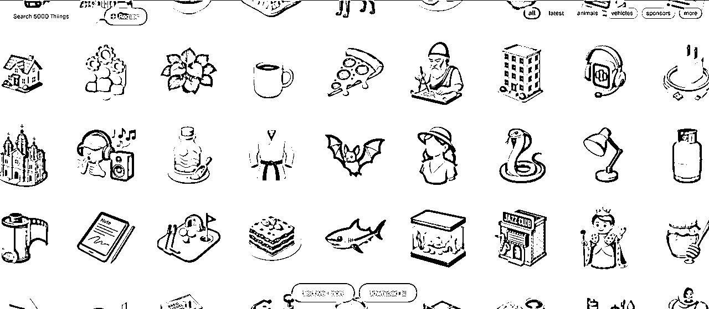

网站生成图标的工作流是调用OpenAI图像生成API“gpt-image-1” + 参考图像 + 详细样式指南，每30分钟Cron生成新图标，后台人工一键复核。除了官方提供的图标集合，开发者还给每个用户赠送1积分来创造自定义图标。我测试了一下，让它给我生成一颗闪着黄色微光的星星，成品挺好看的耶！用户还能提交图标申请官方收录，如果被官方收录到图标库，又能得到积分奖励！这样既能引导用户贡献内容，又能降低新增素材的边际成本。

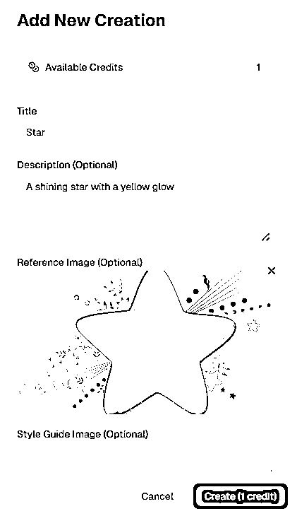

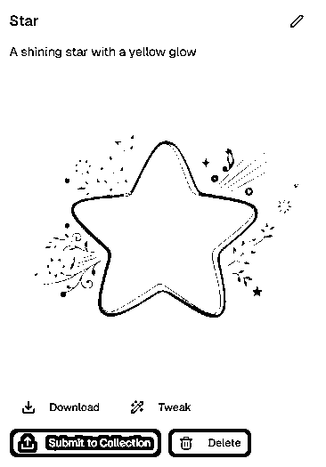

开发者在今年4月25日注册域名，搭建网站和制作图标各花了约一周时间，5月16日在X正式发布，然后6月7日拿下Product Hunt日榜第一，下面我也会深扒他的冷启动策略。值得一提的是：开发者是个满级大佬，有近15年的设计和开发经验，今年更是借力AI创造了多个AI图像生成产品，包括Thiings在内共有3款产品登上Product Hunt日榜TOP5。感兴趣的朋友可以去研究一下他的作品~

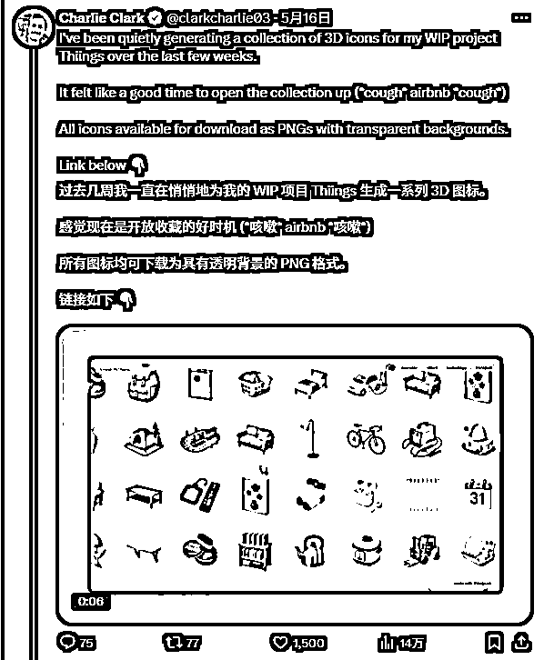

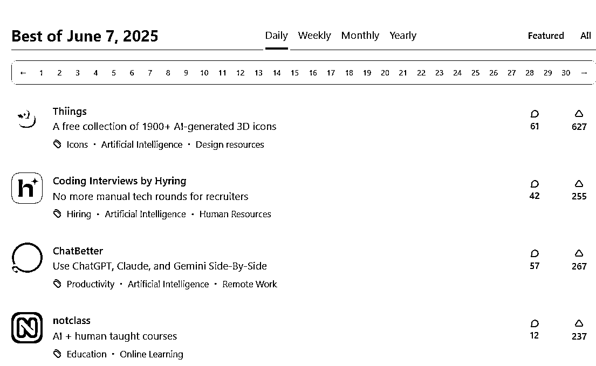

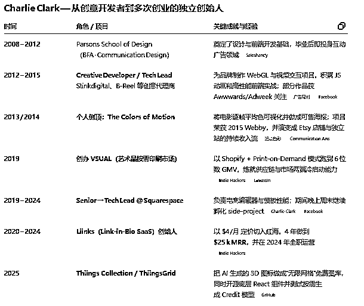

AITDK的数据显示，网站月访问量已经超过20W，流量增长速度之快让人流下了羡慕的泪水，并且超过60%的流量是直接流量，表明Thiings已初具品牌力！用户主要来自美国、中国和印度。

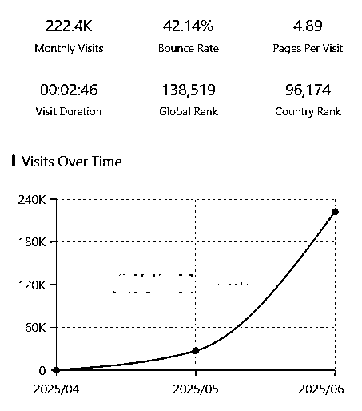

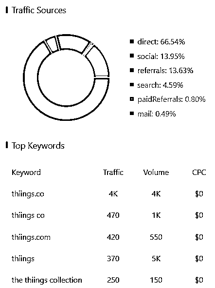

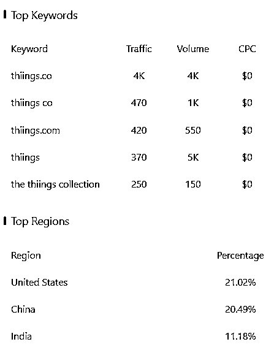

# 二、盈利模式

目前Thiings的盈利方式有3种：终身买断制、积分制和品牌赞助，都是常见的变现方式。

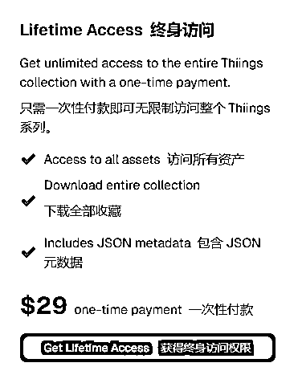

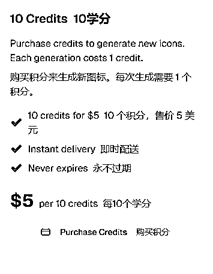

根据开发者的透露，这些盈利模式都得到了很好的验证。虽然调用的OpenAI模型略贵，前期花费近400美元来生成1200个图标（平均每个图标成本约 $0.33美元），但是很快就已能实现收支平衡。刚上线一周左右的销售额就突破千刀，并且开始有赞助商入驻。

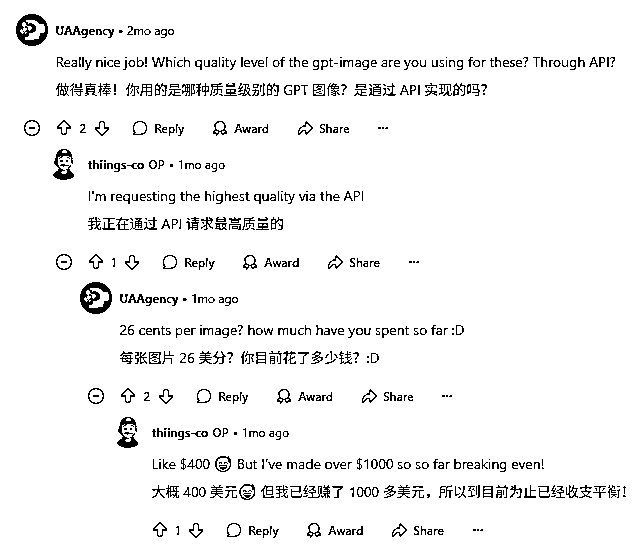

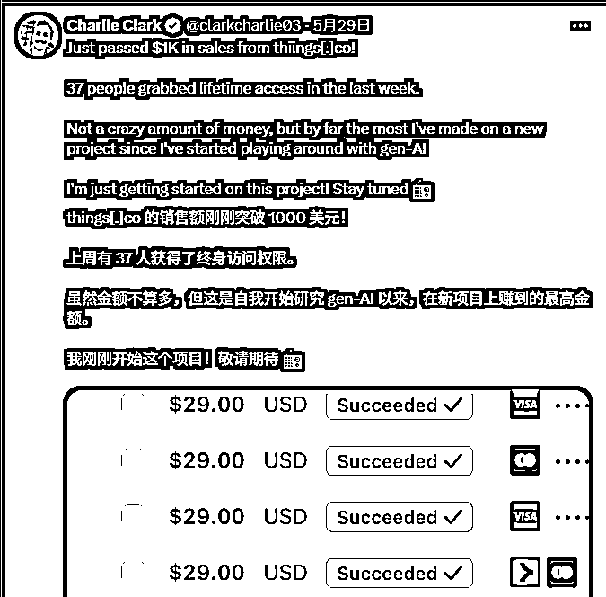

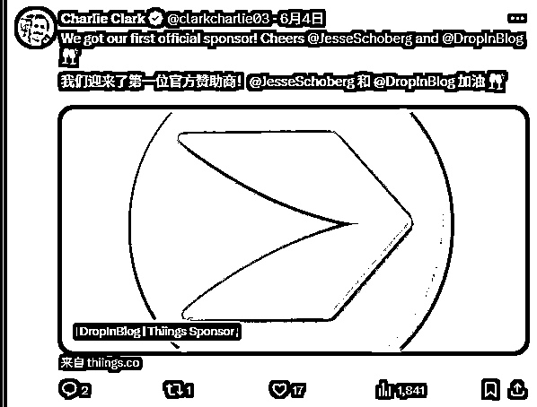

# 三、冷启动策略

通过把开发者的各个社媒账号翻了一遍，我梳理出Thiings的冷启动时间线：

*   X：开发者在辞职转为自由职业者后，就开始在X上积极活跃，逐渐积累了几千名粉丝。在Thiings正式发布之前持续分享创作过程和图标示例，来测试用户反馈、与用户共创。5月16日正式发帖公布Thiings，此帖很快就获得超高阅读量，社媒也因此涨粉千名。

*   Reddit：5月21日注册reddit账号，在r/SideProject、r/InternetIsBeautiful、r/indiehackers 发帖宣传，内容突出“免费”、“可商用” 和“3D图标库”，网站在r/SideProject 收获较多反响。

*   Hacker News：5月24日在Hacker News宣传，反响一般。

*   GitHub：6月2日开源了交互式网格组件，获得200+个收藏。

*   Product Hunt：5月底提交第一次申请，但效果平平。开发者向PH团队申请二次打榜，且结合用户反馈更新部分网站内容，然后在6月7日重新提交申请，并夺得当日第一。

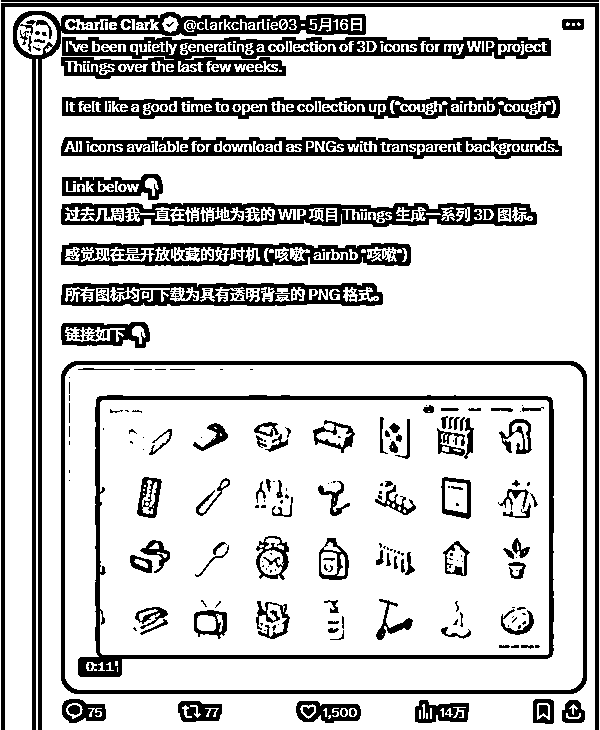

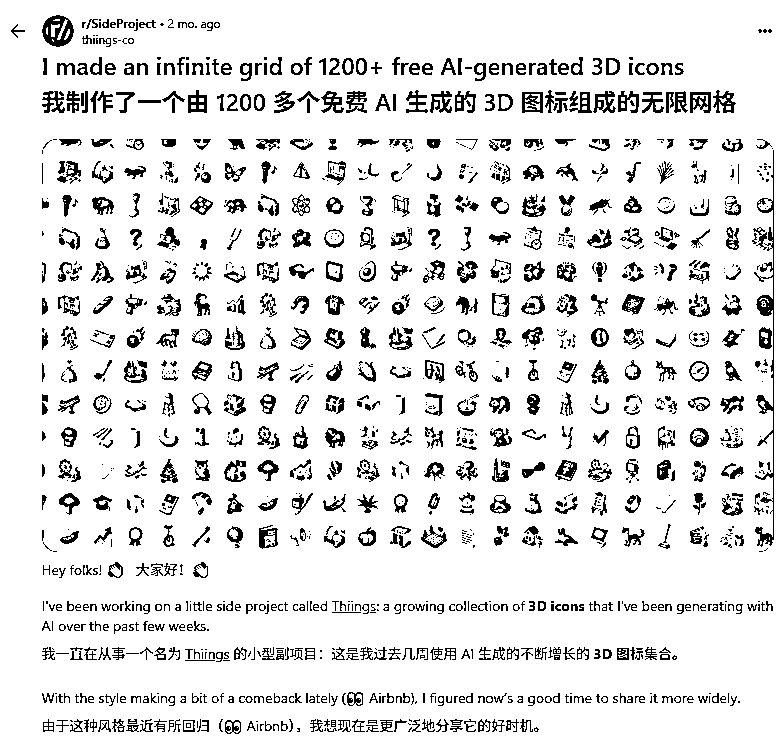

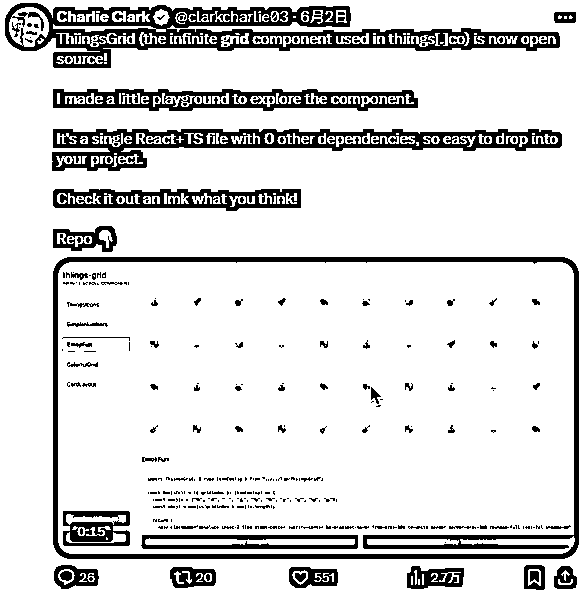

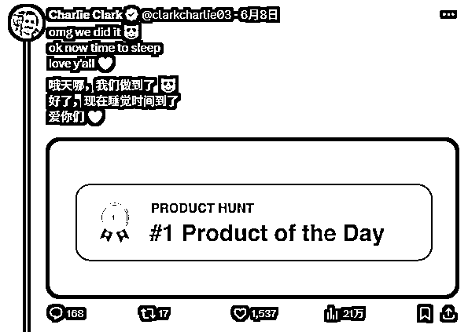

Product Hunt日榜第一的口碑让网站流量翻倍（也就是小排老师说的Number One效应吧！），开始陆续有海内外媒体主动安利这款产品，给产品持续引流。在6月25日，当日独立访客数已逼近1W大关，且大部分流量来自谷歌，可能是被某个媒体提及，激发了大量用户主动搜索、传播、发现，形成品牌搜索驱动型增长。

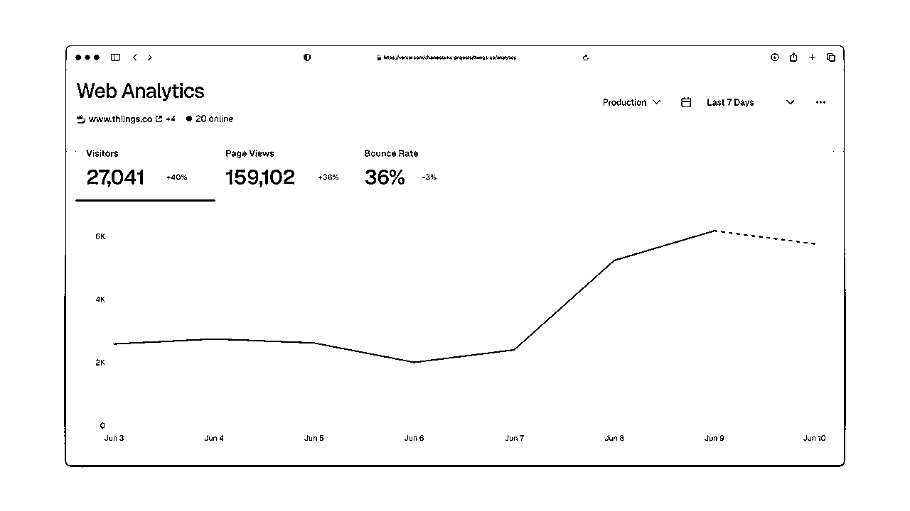

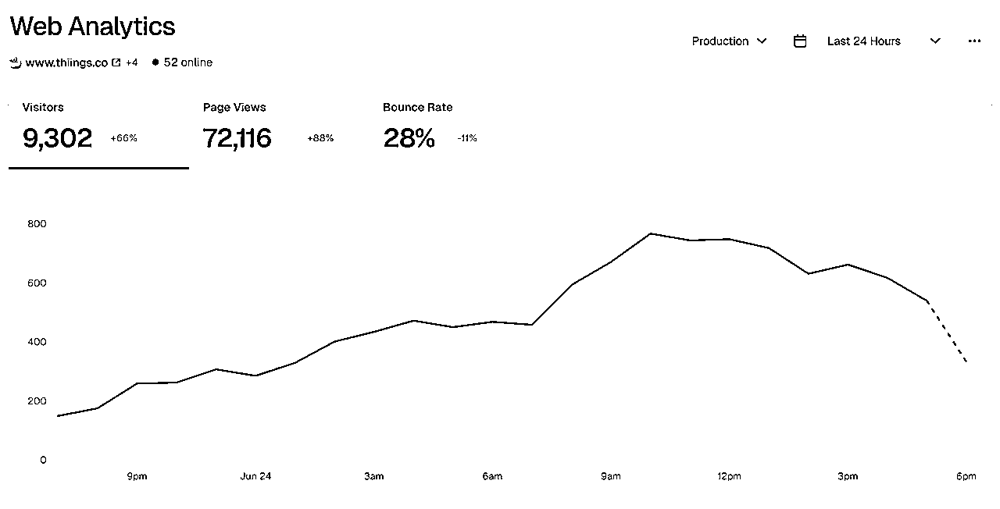

# 四、复刻路径

其实对于有经验的开发者来说，复刻这个产品不难。我们已知api调用的是OpenAI 的“gpt-image-1”模型，且开发者还把这个独特的UI页面设计开源：thiings-grid，这就意味着我们可以轻松地在此基础上实现自己的原生创意！为了证明复刻这个项目真的轻松，我这个开发届幼儿园学生也简单尝试了一下：

首先，因为未知Thiings生成图片的prompt，所以我让聪明的chatgpt先帮我反推prompt，直接用4o生图。

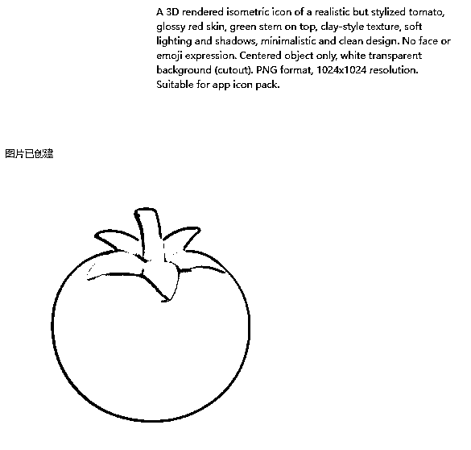

对比一下效果：左边是Thiings官网的西红柿图标，右边是我用chatgpt生成的，大家说有几分像？因为我只是简单示范一下复刻过程，所以我觉得有七八分像就好了，接着让chatgpt又生成了其他主体的同款图片。

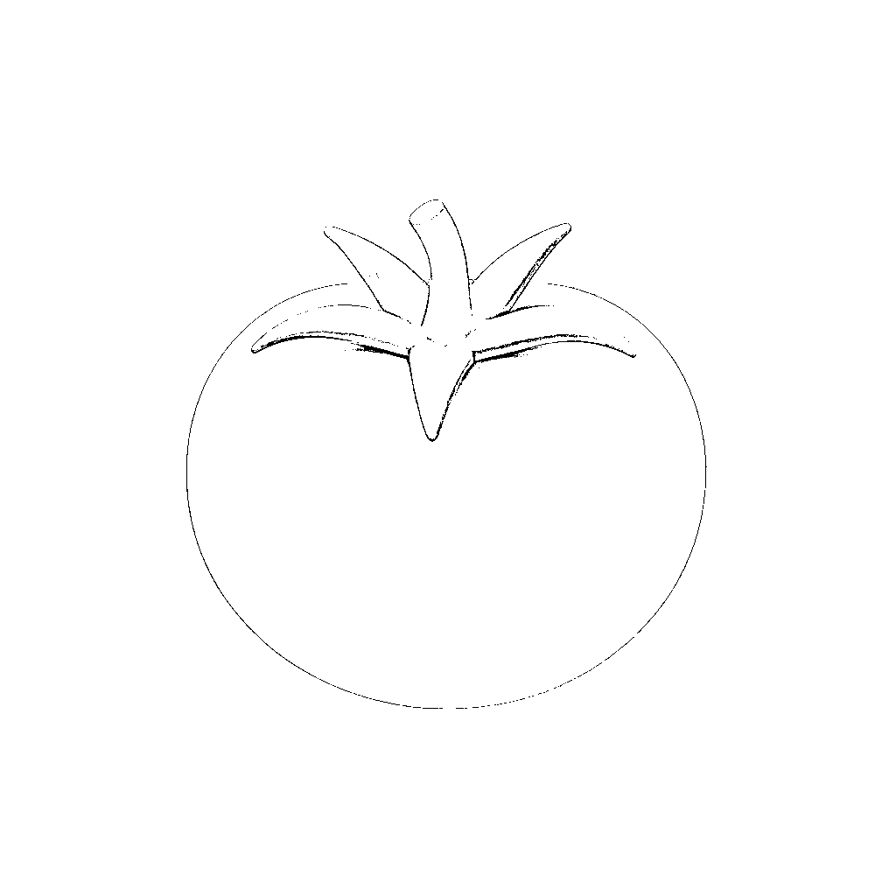

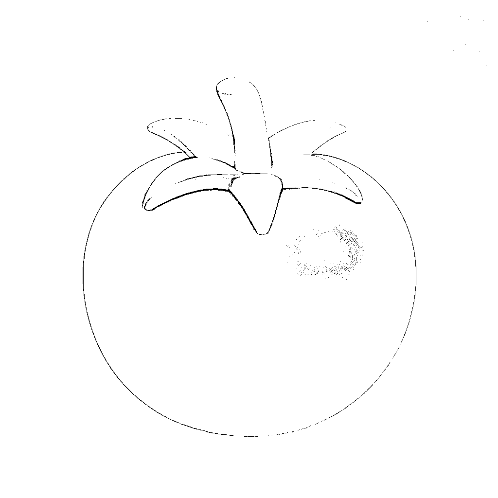

然后，作为一个开发小白，我就去仔细阅读GitHub项目的使用说明。开发者提供了一个Live Playground，我们可以通过交互式示例和可复制粘贴的代码来体验这个组件的实际运行。大概了解这个组件咋用后，我就让chatgpt帮我搭建项目框架。

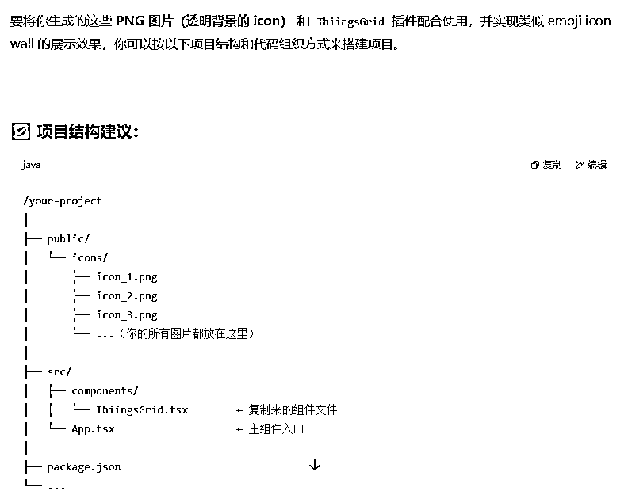

我全程基本就是vibe coding，在cursor和chatgpt之间来回切换，哪里不懂点哪里。凭之前上过几个网站的感觉，我知道应该有缺失一些关键文件，就让它们继续帮我补充。遇到bug也不怕，反正我知道最后ai肯定能帮我解决的。又不是几十万行的代码，这个demo对于ai简直就是洒洒水啦！

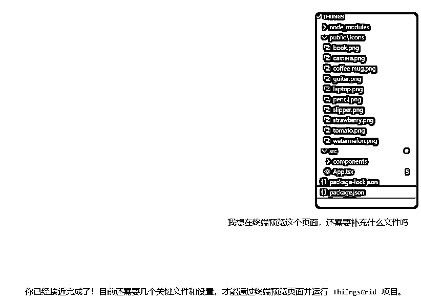

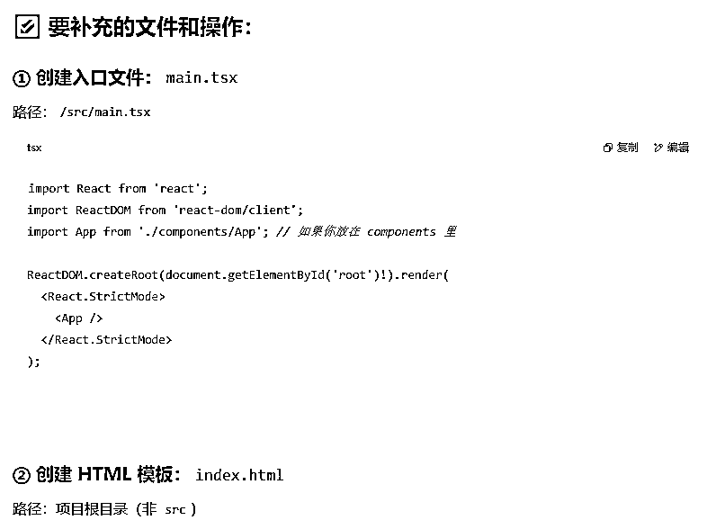

最后做出来的页面长这样，也算实现了一个低配版Thiings👇 我知道这在有经验的开发者眼里很简单，我只是作为一个开发小白，给大家示范怎么使用这个开源项目来实现从0-1的，破除对编程的恐惧！

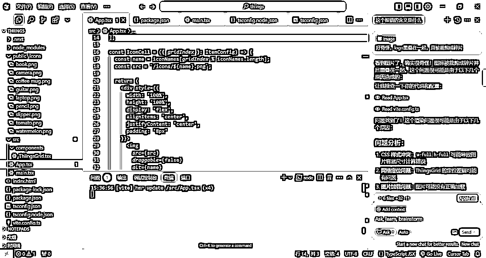

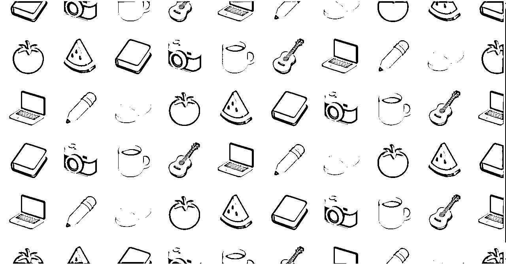

有了AI，开发者就像找到了神笔的马良，能以前所未有的速度量产创意！希望这份案例拆解，能给想做AI产品出海的你带来一点信心和灵感！

# 五、推荐阅读

俺的其他文章：