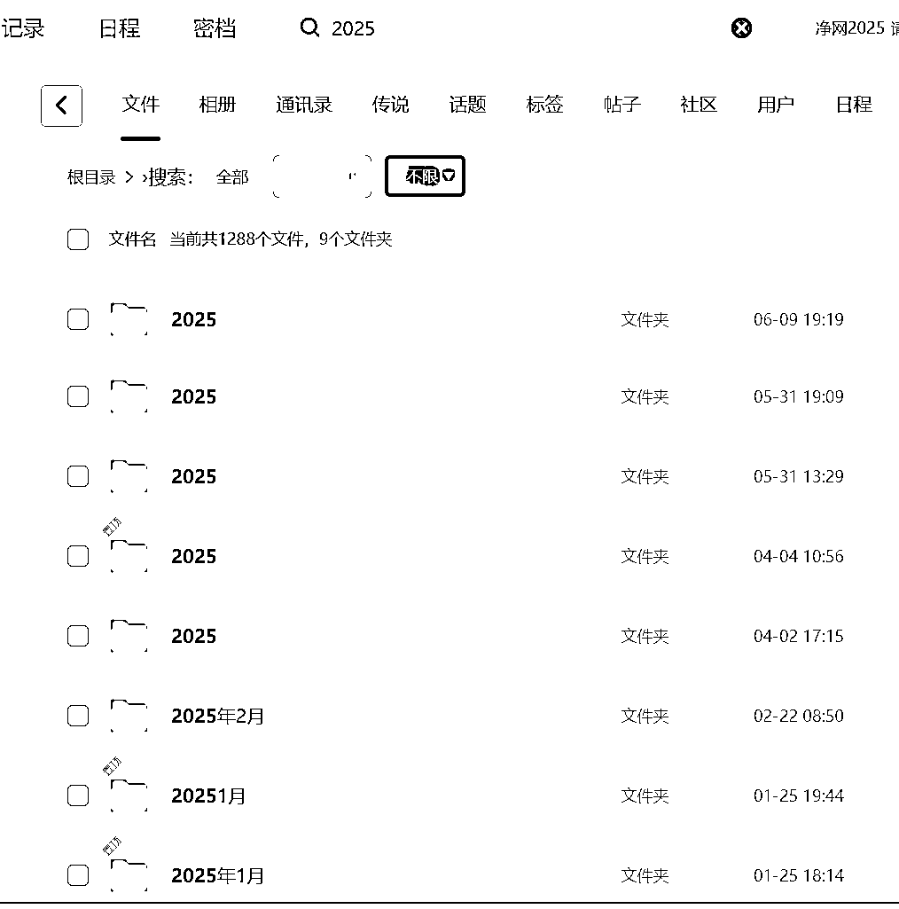
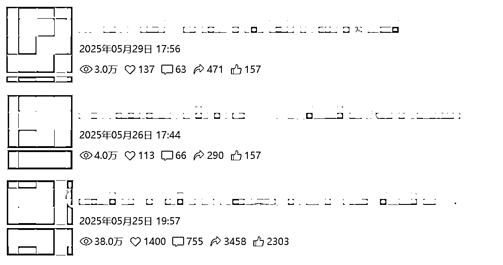
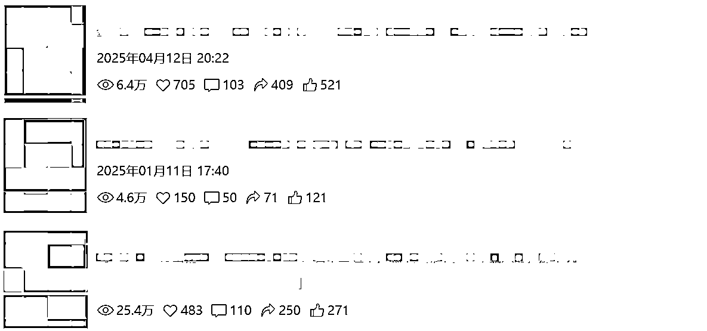
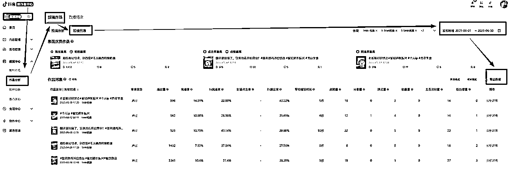
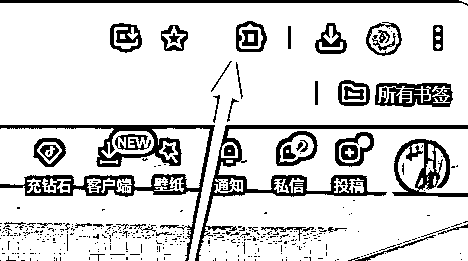
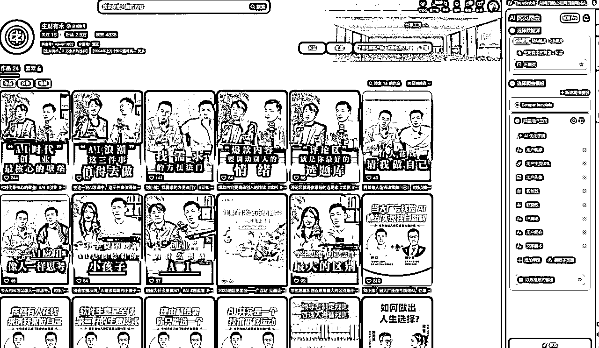
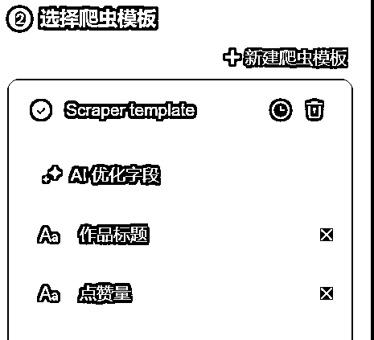
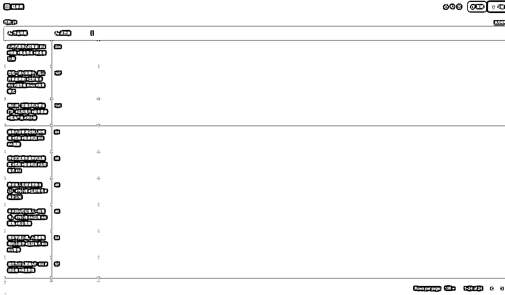
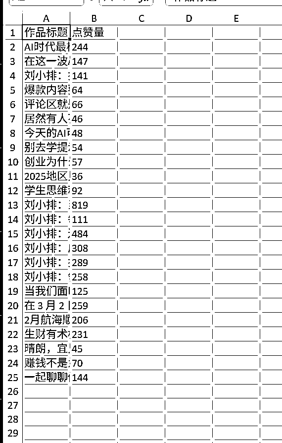
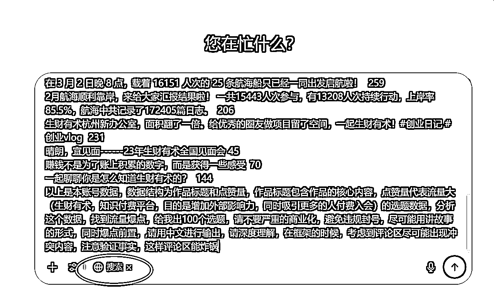

# 借助AI做选题，本地生活月入5万

> 来源：[https://canzhidaocrm.feishu.cn/docx/VIhsdaZKJoku4jx7DG9c0ahOnJH](https://canzhidaocrm.feishu.cn/docx/VIhsdaZKJoku4jx7DG9c0ahOnJH)

做本地生活3年，业绩一直无法突破，遇到最大的问题，就是不知道拍啥，因为业务往往都是同质化的，AI也出来三年了，最近也开始研究琢磨，终于有了突破，目前借助这个方法，我的本地生活业务实现突飞猛进，可以批量接单了（选题自己来，拍摄，剪辑，发布统统外包），晒下今年的工作量：已经剪辑1288个作品，今年目标3000条。

（由于客户还在合作，且所有账号都是商业号，不便直接展示）

开始进入正题：

# 做短视频最难的，

不是怎么拍，而是拍什么

一旦你有1000个拍摄内容，集中在1-2个月内拍完，剩下的时间就是去发作品，接待客户，收钱。

# 你有没有选题焦虑？

但大多数人每天都在焦虑到底拍什么，不光是我有过这样的焦虑，全国13亿个账号，都有过这个焦虑，甚至我们遇到的大佬，乃至生财，乃至看这个文章的你，也被这个事情狠狠折磨过！

# 短视频选题的思路如下：

1，参照自己之前火过的作品，再微调整，出新作品，

2，参照对标账号火过的作品，出新作品，

3，重复1和2。

鉴于此，我们现在有了AI，用AI做这个事情，就很容易了！

# AI做选题大概的路径：

1.  自己账号，直接下载数据

1.  非自己账号，工具爬取

1.  导入gpt：输入提示词

1.  生成新的100个选题

1.  多次生成，筛选，然后在这新的选题找符合你的选题

## 自己账号，直接下载数据

*   打开网页版https://creator.douyin.com/

*   如图所示，导出数据

## 非自己账号，工具爬取

*   如果账号不是自己的，要么用付费工具导出，如果没有，这里提供一个免费的工具thunderbit，需要趴墙

*   打开chrome，下载地址https://www.google.com/intl/zh-CN/chrome/

*   使用魔法/爬墙

*   在地址栏输入https://chromewebstore.google.com/search/thunderbit?hl=zh-CN&utm_source=ext_sidebar

*   点击即可安装

*   在chrome打开你的对标账号，比如生财的https://www.douyin.com/user/MS4wLjABAAAAtW6-fPBMOJM5J18bMOscVHeBRMu8bUARLjlGOcOEt5o?from_tab_name=main

*   如果你遇到作品数量超过100，比如有3000个作品，需要在本页面持续下拉，直至页面显示所有作品

*   生财作品较少，已经加载完毕，开始抓取

*   点击这个按钮唤起插件

*   你会看到这个界面

我们选择新建爬虫模板，不点击AI推荐字段，选择手动，只获取2个字段，如图

点击爬取

点击打开

下载

PS：这个工具不要乱点，避免账号被强制升级无法使用，当然如果你是用短视频赚钱的，可以直接购买

## 导入gpt：输入提示词

打开GPT或者你经常使用的AI工具，这里以gpt4.1为例，复制以下提示词：（黄色的部分可以根据你的账号去写，这里以生财为例）

以上是本账号数据，数据结构为作品标题和点赞量，作品标题包含作品的核心内容，点赞量代表流量大（生财有术，知识付费平台，目的是增加外部影响力，同时吸引更多的人付费入会）的选题数据，分析这个数据，找到流量爆点，给我出100个选题，请不要严重的商业化，避免违规封号，尽可能用讲故事的形式，同时爆点前置，,请用中文进行输出，请深度理解，在框架的时候，考虑到评论区尽可能出现冲突内容，注意验证事实，这样评论区能炸锅

然后复制刚才下载的表格，把文本复制在最前。

ps:如果你遇到的ai工具支持联网的同时也能上传文件，就不用复制了。

最后检查下搜索按钮是打开的，提交

（这里的灵感来自于https://t.zsxq.com/agoA7 大家也可以从他的代码里挖掘新的提示词关键词）

## 生成新的100个选题

以下是gpt给的选题列表

根据您提供的作品标题和点赞量数据，我们可以从中提炼出一些成功的选题策略，以便为您制定100个新的选题建议。

### 🔍 数据分析与选题策略

#### 1\. 核心人物与故事驱动

以“刘小排”为核心的人物故事多次出现在高点赞量的作品中，如“刘小排：当大厂还在亏钱做AI，他单枪匹马闷声发大财”（819点赞）和“刘小排：边际成本近乎为零，为什么软件生意是全球第二好的生意？”（484点赞）。

策略建议：围绕“刘小排”展开更多关于AI创业、软件生意、边际成本等方面的故事，突出其独特的商业思维和成功经验。

#### 2\. 引发讨论的选题

如“评论区就是你最好的选题库”（66点赞）和“别去学提示词，AI是很聪明的小孩子”（54点赞），这些作品通过引发观众的思考和讨论，成功吸引了大量互动。

策略建议：提出有争议或引发深思的问题，鼓励观众在评论区发表意见，从而提升互动率和点赞量。

#### 3\. 聚焦实际操作与案例分享

作品如“在这一波AI浪潮中，这三件事值得做!”（147点赞）和“刘小排：技术平权时代，你的优势如何被 AI 放大？”（289点赞）强调实际操作和案例分析，具有较高的实用性和吸引力。

策略建议：分享具体的操作步骤、成功案例或失败经验，帮助观众在实际操作中获得启发和指导。

#### 4\. 情绪调动与共鸣

如“居然有人花钱请我做自己！”（46点赞）和“今天的AI可以像人一样思考。”（48点赞），这些作品通过情绪化的表达方式，引发观众的共鸣和关注。

策略建议：运用情绪化的语言和表达方式，讲述个人经历或行业现象，激发观众的情感共鸣。

### 🧠 100个选题建议

基于上述分析，以下是100个新的选题建议，旨在提升互动率和点赞量：

1.  刘小排：从0到1的AI创业心路历程

1.  AI时代，普通人如何逆袭成功

1.  技术平权：AI如何改变你的职业生涯

1.  边际成本为零，软件生意的无限可能

1.  AI创业者的日常：16小时的工作挑战

1.  从大厂到独立创业：刘小排的转型之路

1.  如何在AI浪潮中找到属于自己的机会

1.  评论区热议：AI将取代哪些职业？

1.  AI写作：机器与人类的合作还是竞争？

1.  技术平权时代，你准备好了吗？

1.  AI赋能下的创业新机遇

1.  从学生思维到创业思维的转变

1.  边际成本为零的商业模式解析

1.  如何在AI时代保持竞争力

1.  AI创业者的心态与成长

1.  从0到1的AI产品开发经验分享

1.  如何利用AI提升工作效率

1.  AI写作工具的使用技巧与心得

1.  AI时代的创业者必备技能

1.  如何在AI浪潮中找到自己的定位

1.  AI赋能下的商业模式创新

1.  从大厂到独立创业的心路历程

1.  如何在AI时代保持学习的动力

1.  AI时代的创业者如何管理时间

1.  AI写作：机器与人类的协作模式

1.  如何在AI浪潮中找到自己的优势

1.  AI赋能下的创业者如何提升自我

1.  从学生思维到创业思维的转变经验

1.  边际成本为零的商业模式实践

1.  如何在AI时代保持创新的思维

1.  AI创业者的心态调整与成长

1.  从0到1的AI产品开发实战经验

1.  如何利用AI提升个人品牌

1.  AI写作工具的高效使用技巧

1.  AI时代的创业者如何管理团队

1.  如何在AI浪潮中找到合作伙伴

1.  AI赋能下的商业模式转型

1.  从大厂到独立创业的挑战与机遇

1.  如何在AI时代保持持续学习

1.  AI时代的创业者如何提升执行力

1.  AI写作：机器与人类的协同创作

1.  如何在AI浪潮中找到自己的节奏

1.  AI赋能下的创业者如何提升影响力

1.  从学生思维到创业思维的转变故事

1.  边际成本为零的商业模式案例分析

1.  如何在AI时代保持敏锐的洞察力

1.  AI创业者的心态调整与实践经验

1.  从0到1的AI产品开发流程解析

1.  如何利用AI提升工作效率的技巧

1.  AI写作工具的使用心得与体会

1.  AI时代的创业者如何管理时间的艺术

1.  如何在AI浪潮中找到自己的定位与方向

1.  AI赋能下的商业模式创新案例

1.  从大厂到独立创业的心路历程分享

1.  如何在AI时代保持持续学习的动力

1.  AI时代的创业者如何管理团队的技巧

1.  如何在AI浪潮中找到合作伙伴的策略

1.  AI赋能下的商业模式转型案例

1.  从学生思维到创业思维的转变经验分享

1.  边际成本为零的商业模式实践案例

1.  如何在AI时代保持创新的思维方式

1.  AI创业者的心态调整与成长经验

1.  从0到1的AI产品开发实战经验分享

1.  如何利用AI提升个人品牌的策略

1.  AI写作工具的高效使用技巧与心得

1.  AI时代的创业者如何管理团队的挑战

1.  如何在AI浪潮中找到合作伙伴的机会

1.  AI赋能下的商业模式转型经验分享

1.  从大厂到独立创业的挑战与机遇分析

1.  如何在AI时代保持持续学习的动力源泉

1.  AI时代的创业者如何提升执行力的技巧

1.  AI写作：机器与人类的协同创作模式

1.  如何在AI浪潮中找到自己的节奏与方向

1.  AI赋能下的创业者如何提升影响力的策略

1.  从学生思维到创业思维的转变故事分享

1.  边际成本为零的商业模式案例分析与实践

1.  如何在AI时代保持敏锐的洞察力的技巧

1.  AI创业者的心态调整与实践经验分享

1.  从0到1的AI产品开发流程解析与实战经验

1.  如何利用AI提升工作效率的技巧与心得

1.  AI写作工具的使用心得与体会分享

1.  AI时代的创业者如何管理时间的艺术与技巧

1.  如何在AI浪潮中找到自己的定位与方向的策略

1.  AI赋能下的商业模式创新案例分析与实践

1.  从大厂到独立创业的心路历程分享与反思

1.  如何在AI时代保持持续学习的动力源泉与方法

1.  AI创业者的心态调整与实践经验分享

1.  从0到1的AI产品开发流程解析与实战经验分享

1.  如何利用AI提升工作效率的技巧与心得

1.  AI写作工具的使用心得与体会分享

1.  AI时代的创业者如何管理时间的艺术与技巧

1.  如何在AI浪潮中找到自己的定位与方向的策略

1.  AI赋能下的商业模式创新案例分析与实践

1.  从大厂到独立创业的心路历程分享与反思

1.  如何在AI时代保持持续学习的动力源泉与方法

1.  AI时代的创业者如何提升执行力的技巧与策略

1.  AI写作：机器与人类的协同创作模式与实践

1.  如何在AI浪潮中找到自己的节奏与方向的策略与实践

1.  AI赋能下的创业者如何提升影响力的策略与实践

这些选题建议旨在通过讲述具体的操作步骤、成功案例或失败经验，帮助观众在实际操作中获得启发和指导。同时，运用情绪化的语言和表达方式，讲述个人经历或行业现象，激发观众的情感共鸣，提升互动率和点赞量。

如果您需要进一步的细化或针对特定主题的选题建议，请随时告知，我将竭诚为您服务。

## 多次生成，筛选，然后在这新的选题找符合你的选题

实际使用中，由于行业或者提示词，以及提供数据质量的问题，那么我们要在以下几个地方优化：

提示词优化，尽可能提供多的信息维度

数据质量，可以把多个账号的数据一起给AI

多次生成，比如生成500个，然后再喂给AI

感谢观看，欢迎留言交流