# 如何用AI编程实现小红书自动化

> 来源：[https://ec2mz96esm.feishu.cn/docx/VOxMdJeRJoznWgx4laucH1Iyneb](https://ec2mz96esm.feishu.cn/docx/VOxMdJeRJoznWgx4laucH1Iyneb)

# 自我介绍

大家好呀，我是星河， 第一次在生财上发文章，我是去年11月加入的生财，是今年的大四毕业生，然后从今年的3月份开始做小红书，取得了一点小成绩，连续三个月收入都过万了，也算是踏出了第一步，虽然和各位圈友没法比，但对我个人来说还是一个非常大的进步。

这是我的第一篇文章，主要内容是自己如何通过AI编程来帮助自己实现小红书自动化（目前功能还在逐步添加当中，但是也摸索出了一个比较完整的我去写自动化功能的流程，所以迫不及待想和大家分享一下）

## 这篇文章会讲什么？

关于自动化的文章，其实生财上已经有很多相关的文章了，影刀、coze等都能实现自动化，

本文更倾向于传授我使用cursor的经验，侧重点并不是在于如何实现自动化，而是把我搭建自动化工具的思路传授给你，个人认为，工具还是要用在真实的业务场景中，授人以鱼不如授人以渔，把我的AI编程思路给你，更可以帮助你搭建自己的定制化自动化工具。

## 关于AI编程

在写这篇文章的时候，刚好也看到亦仁老大发布了一篇帖子鼓励大家都去尝试AI编程

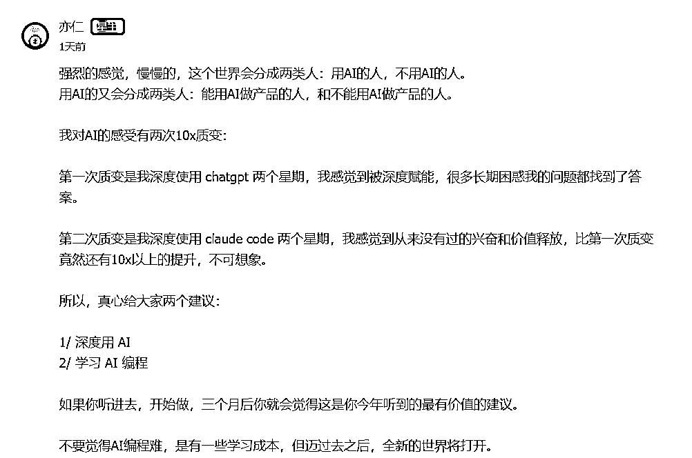

我的想法也一样，非常鼓励大家去学习AI编程，完全不需要觉得需要懂代码才能去写AI编程

因为我自己在一开始使用cursor的时候，我是真的完全不懂代码，我大学学的是市场营销专业，和编程是一点关系都不沾边

那我为什么一开始会想去用cursor呢？其实就是当时想做个小工具，然后在小红书上去卖，觉得cursor能帮我实现，我就去做了。就这么简单，一开始并没有抱着其他太多的想法，

想都是问题，干就完了，不会就学，这才是咱生财圈友该有的风范！

我第一次使用cursor是3月的时候，那时候我也是完全小白的状态，然后我是跟着3月web航海和去年12月的cursor的航海手册去一步步做出来的，最开始做的就是纯前端的一个网页

当然了，这个过程肯定不是一帆风顺的，但是没关系，遇到问题就去问，99%的问题都有答案，问AI、问圈友。看航海手册，对小白来说是一定能找到答案的

我在编程上的起点已经比绝大多数人还要低了，所以不用害怕学不会AI编程，干就完事了

有不懂的一定要先问AI，其实绝大多数的问题，AI都能给你答案，如果不行，也许是自己问题描述得还不够清楚，那就再尝试优化一下问题的描述，如果AI还不行，那就换一个AI，个人建议如果预算充足，买个gpt 或claude的会员，性价比都非常高，如果你用的频繁，ROI是非常高的

在用AI编程过程中，一定会遇到很多的专业名词，没关系，问AI就好了，AI就会告诉你，如果你觉得AI的回答听不懂，让它给你举例解释，比如：“请你用生活化的例子来解释xxxx”

并不需要多么复杂的提示词，把自己的“需求”说清楚就好了

AI时代，你能把你的问题说清楚，AI几乎都能回答你，如果不行，说明问题不够清晰，需求不够明确

在AI时代，其实绝大多数的事情，AI都可以帮你完成，但是让AI帮你完成任务的前提是你能向AI清晰描述你的需求，所以在学习AI的编程的过程中，一定要边用边了解一些编程的专业名词，这些专业名词就是帮助描述清楚问题的关键

比如前端、后端、API是什么？他们的作用是什么？

其实从这个话题延伸出来的一个核心点就是：你要知道AI编程的技术边界在哪里，才知道，哪些是你能去做到的，哪些是不能做到的，心里有数，做起事来才有底气

就比如我自动化工具中用到的核心技术是：playwright

那这个playwright我是在哪里知道的呢？

是钱塘江鲤大佬的这篇文章：

https://scys.com/articleDetail/xq_topic/2852585114521111

我从这篇文章了解到了playwright，然后我就去问AI，了解它能帮我做成哪些事情，我知道了这个技术能帮我做成什么事情后，那我用起来就更有底气了，如果在中途出现了什么问题，那说明不是技术本身的问题，而是我有哪里没做好，所以才会出现问题，那此时我的思路就是找到问题并解决问题，而不是放弃，换一个思路。

对于新手，先在边界内做事，再去试探边界，最后再跨出边界

## 为什么我推荐你一定要学习AI编程

我学了AI编程之后，我最大的感受就是：自由

AI 编程带来的 “自由” 本质上是对自身 “能力边界” 的拓展

想要什么工具，可以自己去造一个最趁手的“武器”

发现什么需求，直接去造一个产品来解决这个需求并赚钱（目前我在做的小红书项目就是基于这一个）

想要提升效率，可以自己造一个自动化工具（也就是本文要介绍的）

这种感觉就像是我从一条小河流中漂流到了大海中，眼前是一望无际的、有无限探索资源的海洋

而自身拥有“选择权”，有一种“想去哪个方向探索都能去尝试”的选择权

其次就是：人机协同

在真正的AGI到来之前，AI还成为不了我们肚子里的蛔虫，无法知道我们的真实需求，我们要用自然语言去向AI描述我们的需求和问题

在用AI编程的过程中，一定会出现bug，那要如何向AI去描述这个问题才能让AI帮你解决呢？

如果问题一直无法解决，又要如何和AI一起去排查原因呢？

想增加一个功能，要怎么才能描述清楚自己的需求呢？

想修改网页上的某个布局，某个按钮，又要如何去描述呢？

这些过程其实都是在锻炼自己和AI的协作过程，锻炼自己的需求/问题描述能力，找到合适的描述需求的方法真的能事半功倍（这个是我在开发这个自动化工具的过程中最大的感悟）

# 正式开始AI编程

## 选择技术栈

在开始编程之前，首先要想清楚使用什么技术栈进行开发，技术栈就是说让AI采用哪些技术组合来开发功能，尽可能选择自己熟悉的技术栈。

如果你不知道该怎么选择技术栈，我最推荐的做法是去看看其他人都在用什么技术栈，而不是直接问AI，道理很简单，你本身就不懂技术，你让AI给你推荐技术栈，你都没办法判断这个技术栈到底好不好。

可以去看生财上大家发的其他关于AI编程的文章，看看大家都在使用什么技术栈

另外一个更适合小白的方案，可以在cursor当中去搜索这个咱们生财里的大佬@AI进化论-花生开发的插件，里面都是一些针对不同场景预设好的技术栈和规则，这个也是偶然间发现的，虽然我没去用过，但是对新手来说应该算是一种比较友好的做法。

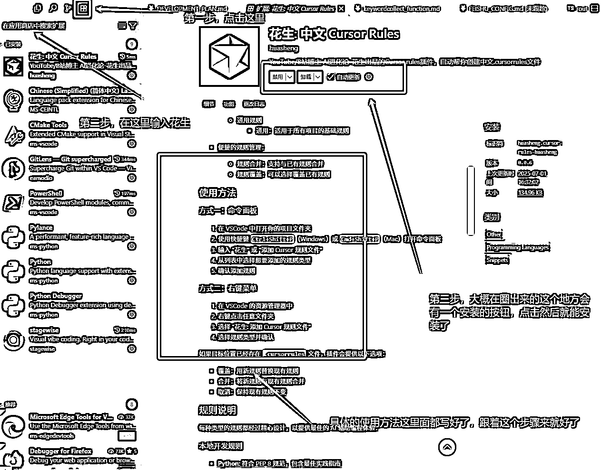

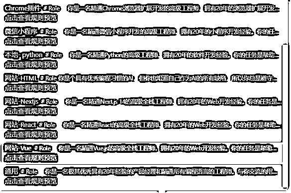

那我推荐是使用Next.js作为技术栈，nextjs前后端一体，更适合全栈开发

如果你不懂什么是nextjs，没关系，问AI就好了，让AI给你介绍。

tips：遇到不懂的一定要先想到问AI，这是目前学习新东西最快速的方式

我的技术栈如下：

前端技术栈：

框架： Next.js (使用 App Router 模式)

UI 组件库： Shadcn UI 和 Radix UI (Shadcn UI 是基于 Radix UI 构建的)。

样式： Tailwind CSS。

语言： TypeScript。

后端技术栈：

运行时环境： Node.js (通过 Next.js 的 API 路由实现)。

语言： TypeScript。

自动化：playwright

如果你想多学习，最好是去了解上面这些技术分别有什么作用，也可以直接告诉AI，你想以这个作为你的技术栈

除了上面所说的技术栈，我还结合了飞书多维表格（我把飞书多维表格作为我储存数据的地方），通过飞书API，实现自动化创建多维表格、自动化增、删、改、查

相当于把你的网站和飞书结合起来使用

tips：为什么用多维表格来储存数据？

答：因为相对方便，新手如果用数据库，可能会懵逼，并且多维表格还能用AI来对收集到的数据进行分析和再创作，很方便。

### 如何去获得自己的飞书API

1.  打开飞书的开放平台：https://open.feishu.cn/app

1.  创建一个企业自建应用，点击“创建企业自建应用”，然后输入应用名称和应用描述即可创建

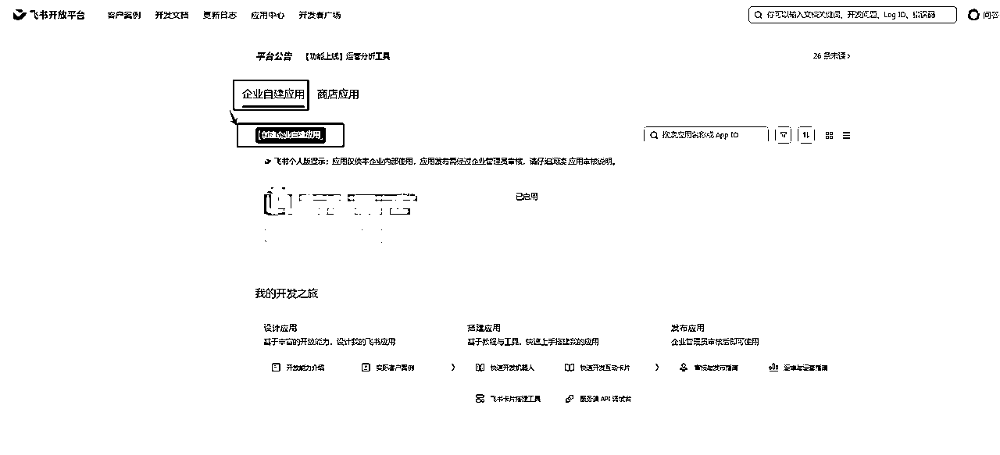

1.  要获取的内容有两个：“APP ID”和“APP Secret”

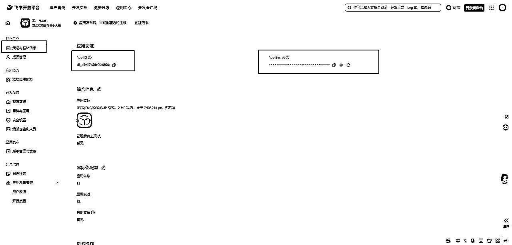

可以先记录下自己的APPID和APPSecret，之后添加到cursor当中

1.  权限管理，想要调用飞书API，就需要开通对应的权限，否则会无法成功调用飞书API，在开通权限这里面可以找到和多维表格有关的权限，全部开启就行（开启这个应用身份权限就行）

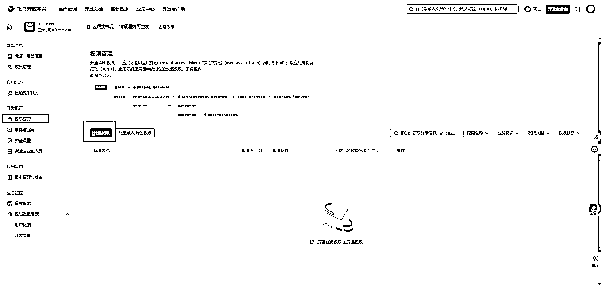

我开通的有这些，可以根据自己的需要去参考

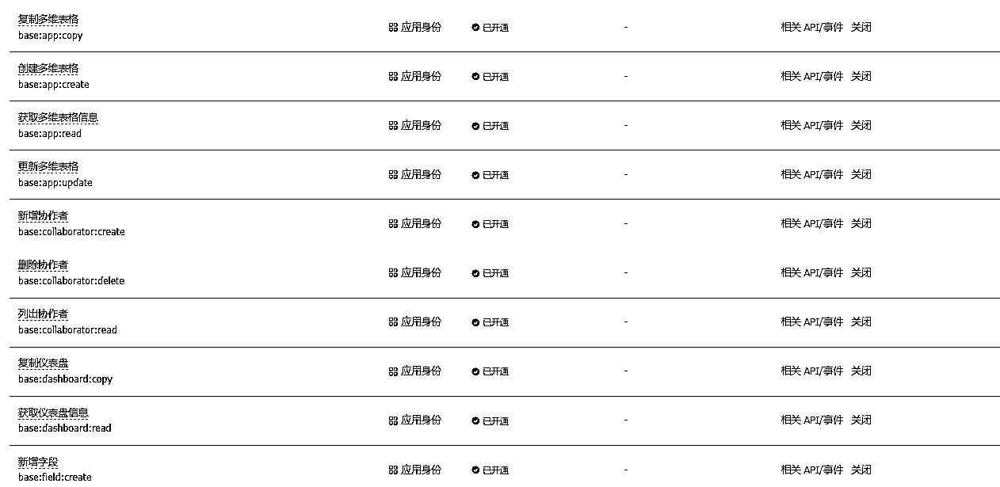

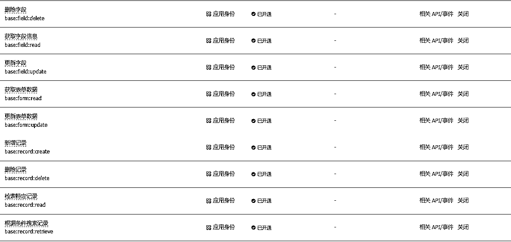

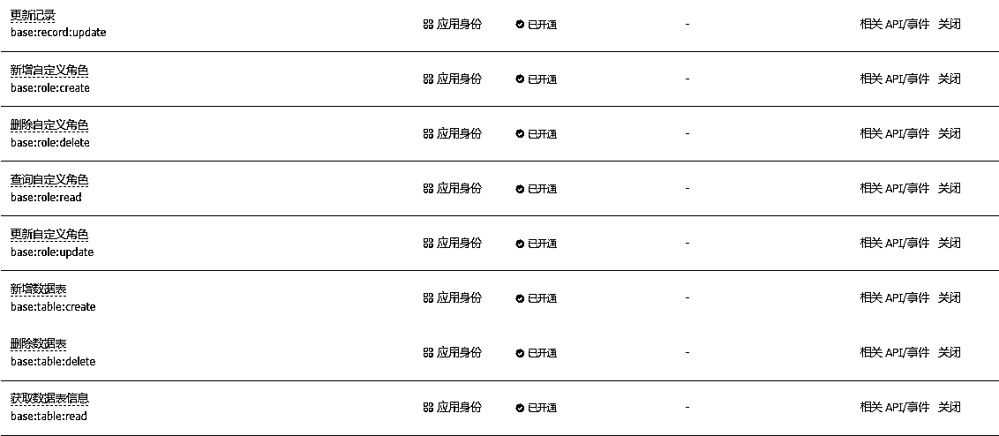

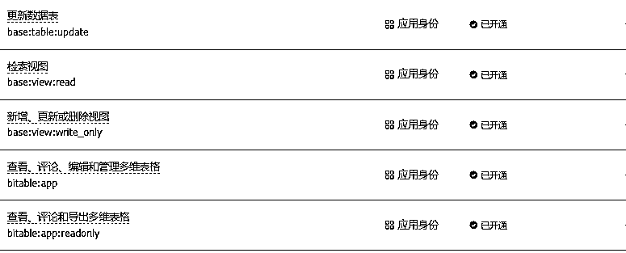

tips：除了多维表格，理论上，在权限的界面上你看到的，都能通过飞书API去调用，可以根据自己的需求去挖掘挖掘

在上面的这两步，如果顺利，你会获得APPID和APPSecret，以及开通了多维表格的相关权限

APPID和APPSecret会在之后使用到，可以先记住

1.  最后一步是将这个企业自建应用上线，填写一些简单的信息就能完成上线

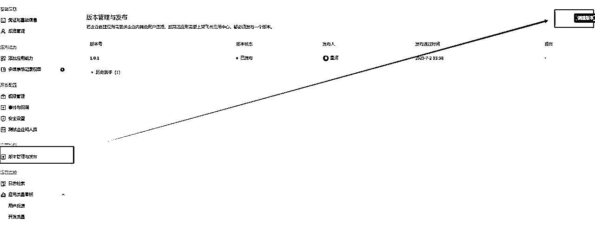

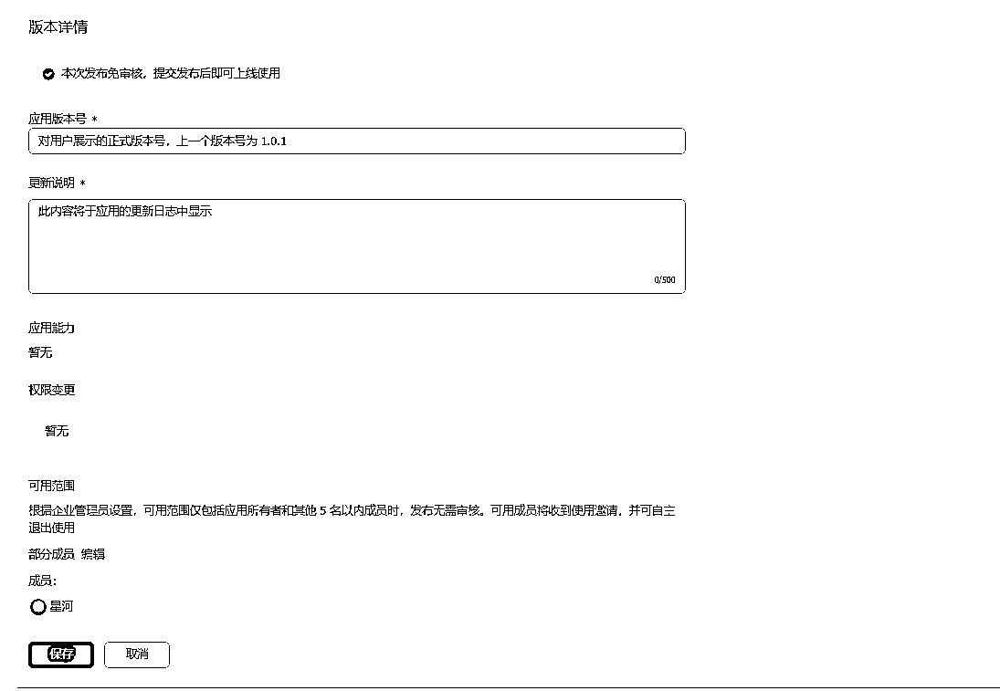

可以在首页看到是否上线成功了 【已启用】就代表上线了

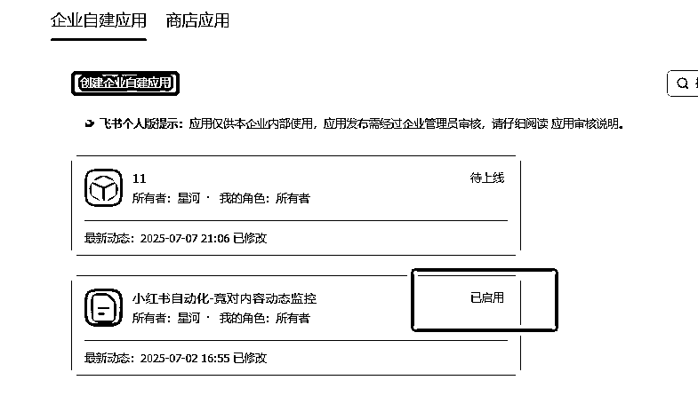

## 开始写功能

在小红书自动化这个例子当中，我会用一个比较简单的入门功能来讲我是如何使用cursor进行编程的

这个功能是：账号管理：实现多账号批量管理，保证每个账号都能长久保持登录状态。一次扫码，长期可用。

### 第一步：写需求文档

在正式让cursor帮你开发功能之前，一定要先通过和AI对话，把自己的思路给捋清楚。

这也是最核心的一部，这一步不仅仅是在写需求文档，也是一个思考的过程，思考自己这个工具到底需要具备什么样的功能，这个功能要达到什么效果。它的整体使用流程是什么？

这也是我在第一部分中写到的，通过AI编程，你可以去锻炼自己与AI的协作能力，找到目前AI的边界，并不断扩大自己的能力边界，学会清晰描述自己的需求，其余的，可以让AI来帮你补充完善

自动化工具的需求文档，大致可以分为三个部分：

*   前端界面：负责用户交互、信息展示和操作触发。

*   自动化脚本：负责核心的浏览器自动化逻辑，执行具体任务

*   多维表格（这个非必须，需要储存数据才需要这个）：负责数据存储

那么在沟通的过程中也可以分为这三部分进行沟通，然后最终整合成一份完整的需求文档，再把这个需求文档给到cursor，然后让它按照这个需求文档进行开发。

如果你没有gpt或claude的会员，想低成本且效果较好地和AI写需求文档，那么可以用cursor当中的【gemini-2.5-flash】模型，这个模式是免费的，也就是说沟通不会消耗你的会员次数，并且这个模型具有足够大的上下文，可以支撑你去聊更多内容

如果你的模型列表里没有这个模型，那可能是没开启，到设置里面开启就好了

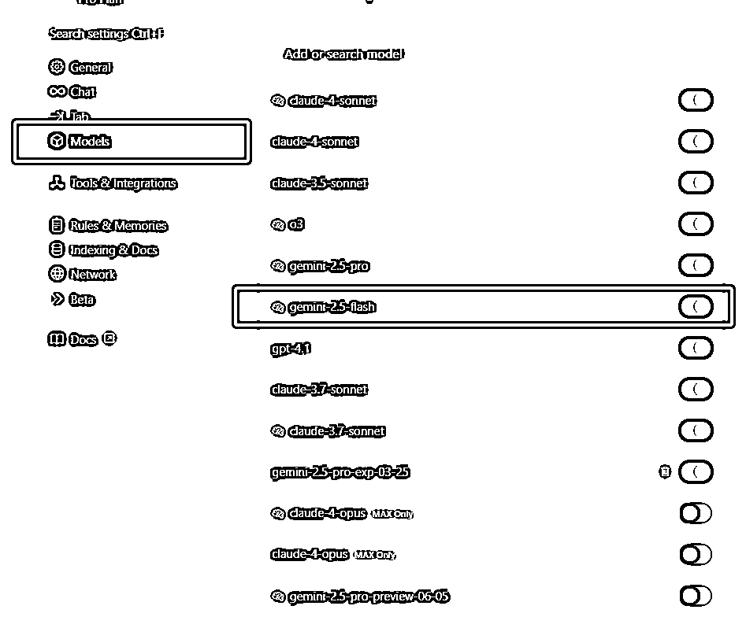

接下来就正式开始写需求文档，我的整个小红书自动化工具的第一个功能是：账号管理

为什么是这个功能？

*   第一：因为playwright的核心是模拟用户在浏览器上的操作

*   假设你现在是playwright，你现在要打开小红书上去执行一些操作，你的第一步是啥？肯定是登录账号，因为你不登录账号，很多功能会被限制，为了保证效果，所以第一步最好是先登录账号

*   第二：这个功能相对简单，对于你用AI编程去写第一个自动化工具是一个好的开头，如果第一个功能就把你难倒了，你可能会丧失信心

tips：我自己在开发账号管理的过程中，我其实失败了很多次，因为我一直在测试哪个技术栈以及哪个产品形态最好用，所以账号管理这个功能也是我验证技术栈的一个功能

虽然现在AI编程很厉害，但是如果技术栈不合适，也会给自己增加很多工作量，我上面讲的这个技术栈就是我测下来效果最好的（个人认为）

#### 需求文档第一部分：前端界面

如果你不知道怎么去开始，那么你可以把你要做的项目和AI说一下，让它先来帮你写一个大概的前端界面，然后你再来补充完善

提示词：

我现在要来做一个小红书自动化的网页工具，我的第一个功能是账号管理，主要是用来管理多个小红书账号的，我希望的登录方式是二维码扫码，我希望的网页整体布局是左右布局，你能给我写一下前端界面要如何设计吗

等待AI给出答复，然后在脑子里思考AI给出的回答，想想它是否符合你自己的想法

以下是按照上面的提问，cursor给出的回复：（注意 ，这里我是新开了一个窗口，让cursor和我模拟对话，如果cursor给出的回复和我的这个回复不一样是很正常的，和AI在沟通需求文档的过程是一个不断修正的过程，把你不满意的地方说出来，让AI帮你改就好了）

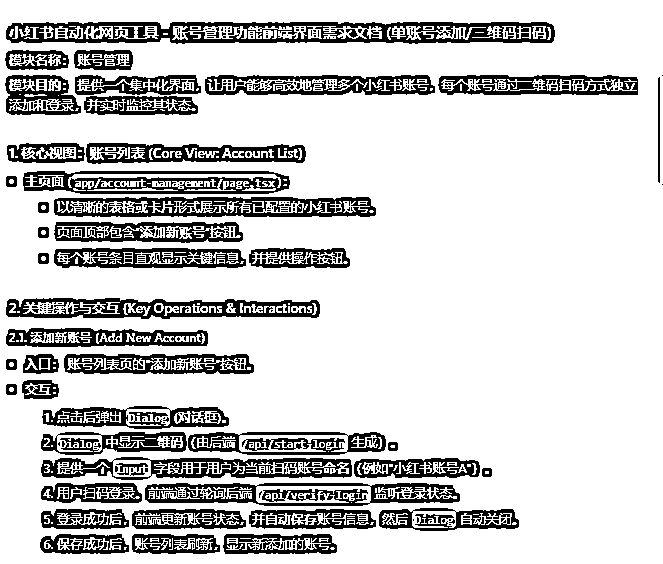

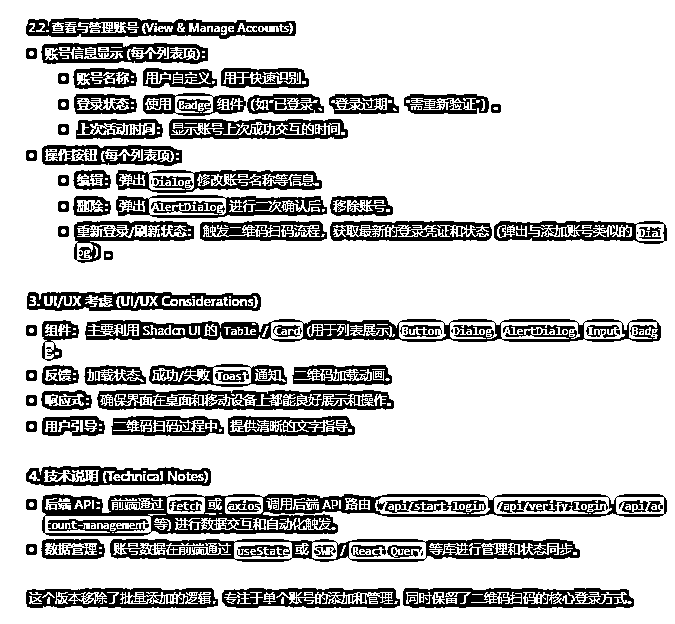

如果你还处于完全不懂代码的阶段，觉得这里面它的回答有点让你难理解，你可以让它帮你用更简单的话术重复一下：

提示词：

我是代码小白，我完全看不懂专业术语，你用更简单的话术把你上面的这段话重新说一下吗

如果你想了解一些它提到的专业名词，你也可以让cursor给你解释一下

如果你觉得脑子里难以想象整体的页面布局，可以让AI给你画个草图，像这样，帮助你去构建画面

提示词：

你能把你上面描述的这个布局用草图（横线）的形式帮我绘制出来吗，让我看看大概的效果

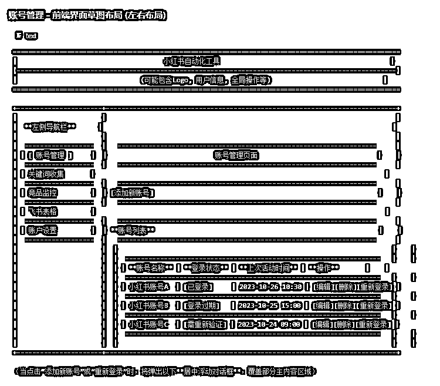

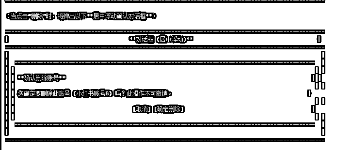

有不满意的地方，你就让AI帮你改就好了

然后我们还可以不断追问，让AI告诉你一些其他需要注意的地方

提示词：

我觉得你上面说的这些都没问题，那你觉得除了我们刚才讨论到的这些，如果要去实现账号管理这个功能，我们还有什么要去注意的嘛？还有什么功能是需要增加的嘛？

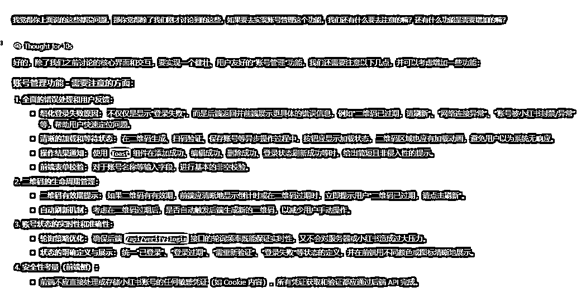

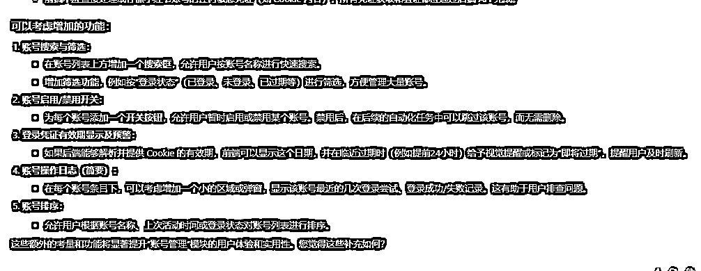

然后AI也继续给我列出来了一些注意点和可以增加的功能，然后你的任务就是去看AI列出来的这些内容，看看有什么是需要你去注意的，或者你想添加的，也可以选择先不添加，先把最基础的给搭建起来，然后再慢慢去完善

有些问题可以等你遇到了再去考虑解决，我这里举个例子，我自己在登录的过程中，我发现这一次可以登录成功，但是等我下一次再打开的时候，登录状态就失效了，我就觉得很奇怪，为什么不能一直保持登录状态，然后我就去问AI，我是这么问的：

为什么我每次打开它都要求我要去重新登录，难道不能一直保持登录状态吗？

这是AI的回答：

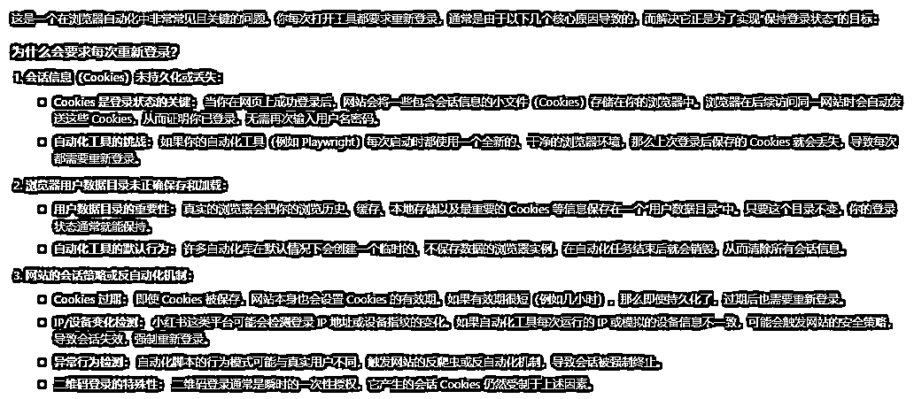

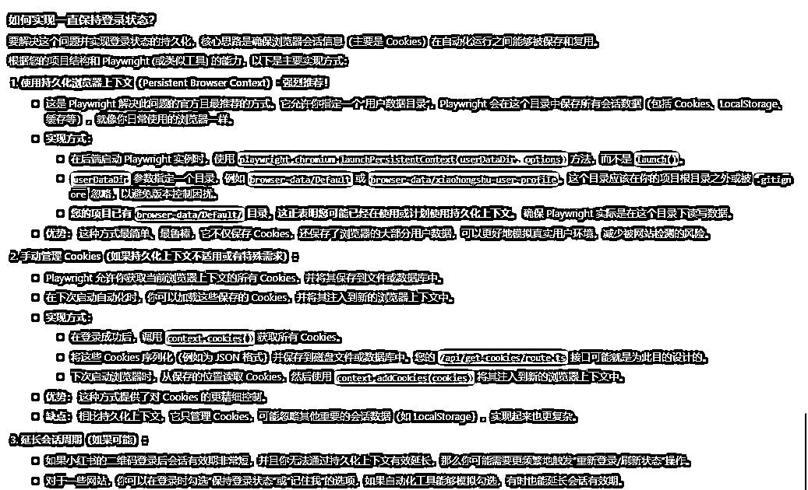

通过询问，我就知道问题在哪里了。原来是cookies的原因（其实在弄这个功能之前，我对cookies也只有一个非常浅的认知，并不知道它的真正作用是什么，直到真的需要用到它的时候我才知道cookies的作用）

cookies就可以简单理解为：网站给你颁发的身份证，通过这个身份证，下次再打开这个网页就可以直接登录，不需要再去输入账号密码， 这样就能实现长久登录

知识其实就是这样子慢慢不断拓展的，这次你不懂，下次再遇到你就懂了

接着，你就可以按照AI给出的建议，把cookie相关的功能加入到你的网页里去了。

再举一个例子，我在完成账号管理这个功能之后，并且也加入了cookies，保证能够长久保持登录状态，但是第二天，我重启电脑再打开时，我发现，我昨天登录的账号信息没了

然后我就去问AI，我是这么问的：

昨天我已经通过保存cookies信息实现了账号的长久登录，但是为什么我今天重启之后，再打开网页，发现我昨天的登录的账号没了呢？

这是AI给出的回答，它提出了一些可能性

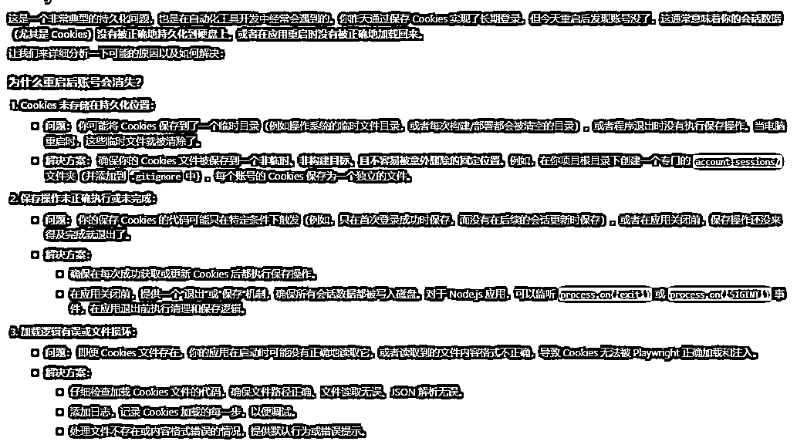

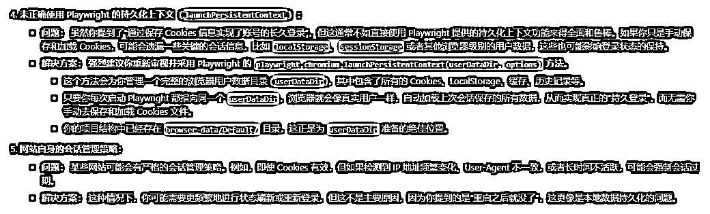

那针对这些可能性，AI也给出了一些具体的实施建议，按照AI的建议去逐步排查，直到这个问题解决

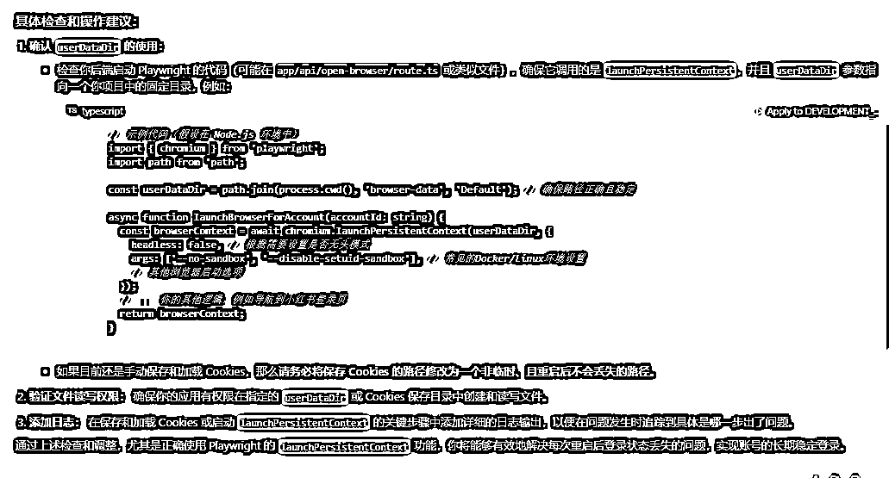

这里简单总结一下我在通过AI进行编程时，和AI的沟通思路：

1.  如果没有思路，就把你的基础想法和AI说一下，让它先给你列出个大纲出来

1.  如果脑子里没办法具象化AI说的话，那就让AI给出草图

1.  针对AI给出的内容，有问题/有疑惑的地方，就指出来，让它优化/解答

1.  遇到问题，那就把情况和AI说一下，让AI先给你初步进行排查，描述的结构：我在哪个页面，干了什么，结果是什么，我预期的结果是什么，询问原因是什么

如：我在账号管理这个功能界面，用二维码登录时，发现登录弹窗内无法展示二维码，我期望能在xx位置展示二维码，帮我排查一下二维码不显示的原因是什么

1.  让AI给出明确的操作步骤，逐一排查原因，然后解决问题

通过AI进行编程，我觉得最重要的能力有两个：

1.描述需求/问题

2.协助AI排查问题并解决问题

以上就是关于前端界面该如何去和AI沟通并逐步写出完整的前端部分的需求文档的做法。

#### 需求文档第二部分：自动化运行脚本

写自动化脚本有两个核心要点：

第一，自己要梳理清楚整体的一个运行流程，可以先自己用纸笔或者一些可以创建流程图的工具来写出完整的流程

第二，元素定位，自动化的核心其实就是模拟人类的行为去点击、滚动屏幕等等，那么就会涉及到一个问题：要去点击哪里呢？如何将你要点击的地方描述出来

这里先说明一下如何进行元素定位，一般来说，最常见的方式就是通过css选择器（可以自行问一下AI什么是css选择器）

举个例子，比如我们要定位小红书首页的搜索框

第一步，点击F12，或者在页面上，右键，然后找到检查，点击，打开这个：

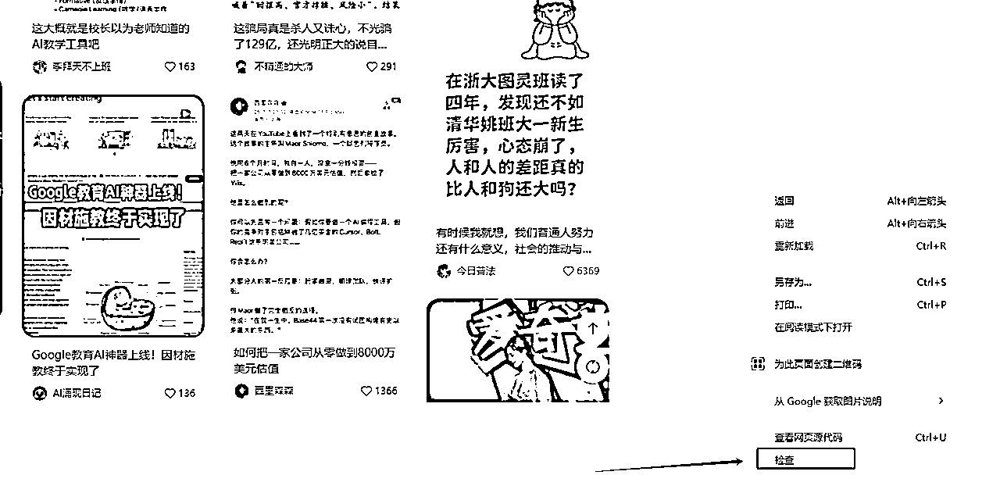

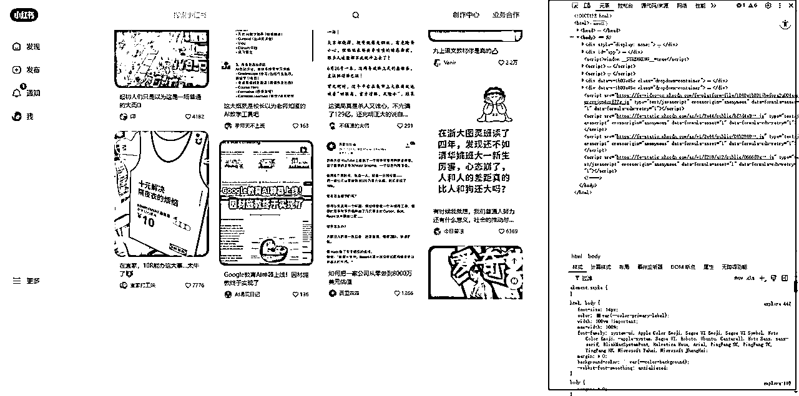

然后点击这个，点击之后，就能到页面中去框线元素了

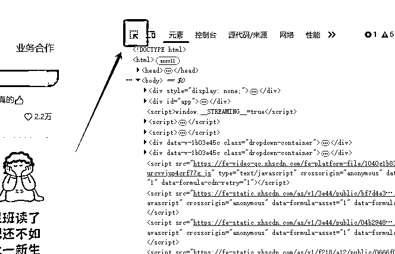

把鼠标悬停在搜索框上，搜索框会变成这样

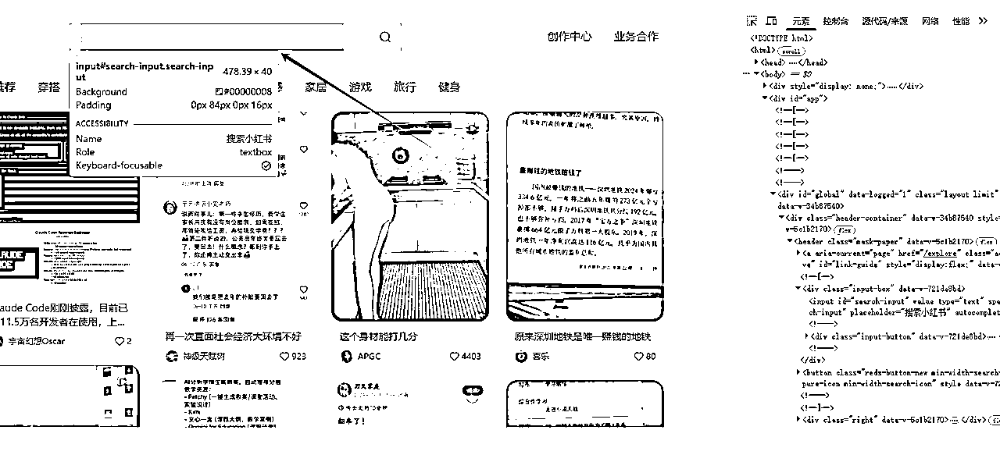

单击一下，右侧这里就会高亮显示对应的代码

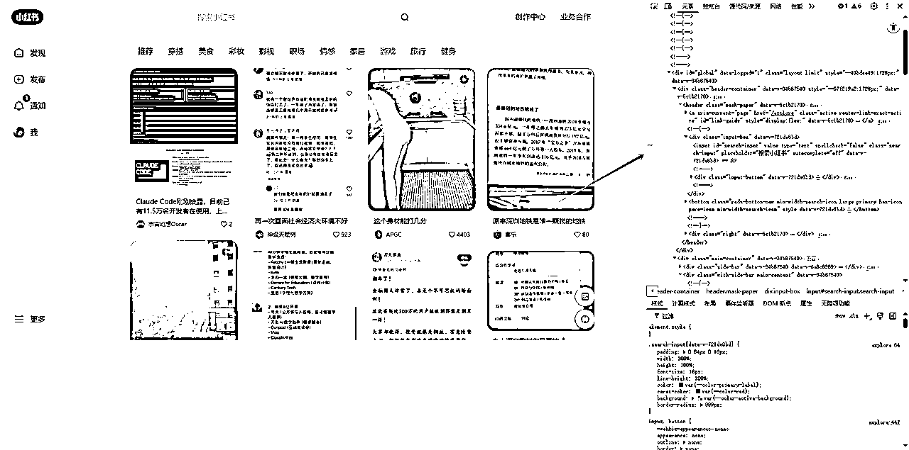

然后右键单击这段高亮的代码，移动到复制，然后，点击这个【复制selector】

就能成功复制这个搜索框的css选择器：#search-input

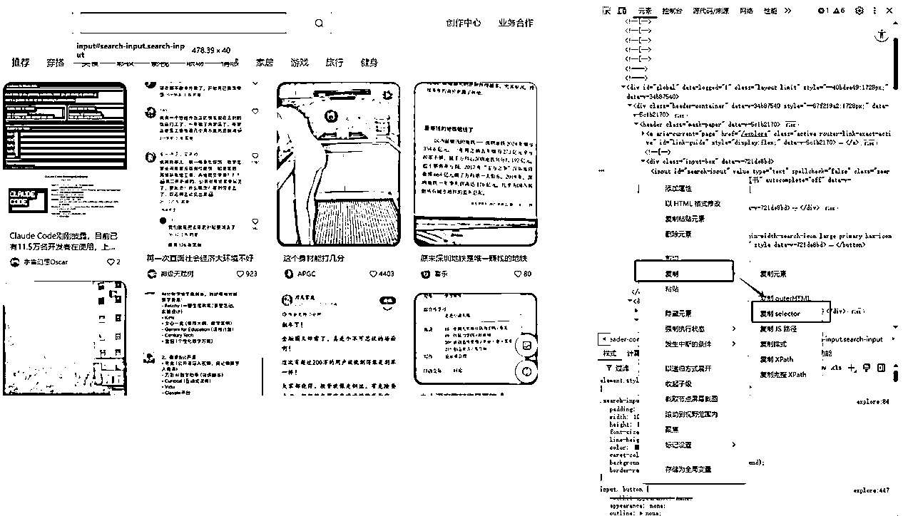

绝大多数的元素都可以通过这个方式来获得，如果有某个元素不知道该怎么去选择，也可以问问AI，让AI给你点建议（后边我会举个例子说明）

了解了元素定位的方法，那接下来就是开始写脚本运行的流程，这一步要有点耐心，耐心写出完整的，描述得越清楚越好

比如像我下面这样描述二维码扫描登录的流程并发送给AI：

提示词：

这是二维码扫码的整体流程：

当我在前端界面上点击“开始登录”按钮时，触发下面这个脚本

1.  通过playwright打开一个谷歌浏览器

1.  打开小红书，网址是xiaohongshu.com

1.  等待5秒

1.  等待二维码元素出现并截图，二维码的css选择器是：#app > div:nth-child(1) > div > div.login-container > div.left > div.code-area > div.qrcode.force-light > img

1.  将二维码的截图展示到我的前端界面上

1.  脚本进入暂停阶段，直到我扫码完成并点击前端界面上的”我已扫码“按钮，再继续往下执行脚本

1.  验证是否登录成功，是否登录成功的标志为左上角是否出现了头像，头像的css选择器为：#global > div.main-container > div.side-bar > ul > div.channel-list-content > li.user.side-bar-component > div > a

1.  如果出现头像，则代表登录成功，把登录成功的信息返回给前端，如果不成功，返回不成功的原因给前端

1.  保存该网页的cookie等相关信息， 实现长久登录

以上是我梳理的一个流程，你帮我看看是否还有需要完善的地方

我上面梳理的这个流程，是站在我自己去操作的角度去描述的，肯定不是完美的，甚至对于AI来说，我的流程可能还会有很大问题，但是没关系，让AI给你提意见帮你改就好了

下面是AI给出的意见：

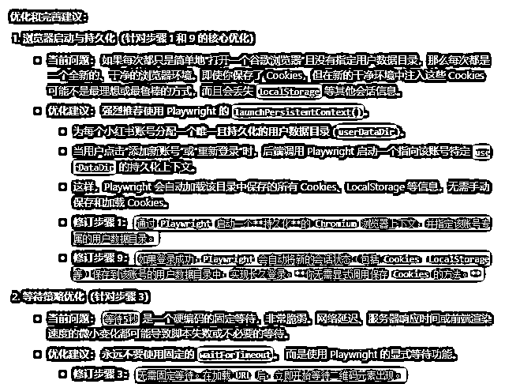

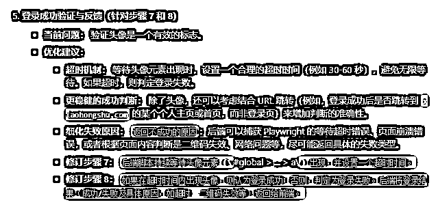

然后AI也给出了觉得ok的流程

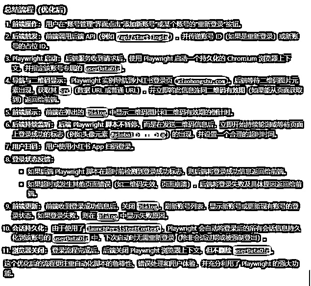

那此时我们就需要去检查它描述的整个流程是否存在什么漏洞

如果没问题，那就可以先暂时直接用它的这个流程，等到之后功能实现之后，你在测试时，如果发现了什么问题，再来针对性解决就好了。

通过上面的“梳理流程”和“元素定位”，就可以创造出自动化脚本了。

那接下来就是把梳理的这些内容形成文档

我一般会让AI给我生成一个专门的功能文件夹用来放置所有功能的说明

提示词：

麻烦你帮我在根目录下创建一下：productfunction 的文件夹，并在该文件夹内创建一个md文档，名字为：账号管理，将我们刚才讨论的前端界面部分/自动化脚本部分，总结之后放到这个文档内

到这里，其实对于账号管理这个功能基本上就写出了一个完整的需求文档了

把这个需求文档给到cursor，让它帮你照着这个进行功能开发

但是我为了演示一下如何将数据储存到飞书当中，所以我在这里增加了额外一步，就是把登录的账号，包括cookie等信息都储存到我的飞书多维表格当中去。

#### 需求文档第三部分：飞书多维表格

飞书多维表格其实在自动化当中就是充当我的数据库，我可以将收集到的信息储存到多维表格上，然后在借助飞书多维表格的AI功能来实现内容的二创改写，这些可以借助飞书API来完成

当然了，除了飞书多维表格，我觉得还有很多其他的作用，比如，如果你觉得某篇笔记很有潜力，你想观察一下，你可以增加一个笔记监督的功能，然后当它达到了某个阈值，或者增速达到了多少，就给你的飞书发送提示消息，这些都是可以实现的

这里的核心是思考清楚：

1.我需要一张什么样的表，这张表里需要有什么字段

2.搞清楚你的APPID APPSECRET APPToken tableID

分别解释一下

APPID和APPSECRET是调用飞书API所必须的，简单理解就是账号和密码，获取方法在这里也讲了如何去获取自己的飞书API

然后APP token呢 其实就是指多维表格，每一张多维表格都会有一个APP token

如何确定多维表格的APP token？

第一，先打开飞书多维表格的网页版

第二，点击创建新的多维表格，然后就会打开一个新的多维表格的页面，复制这个多维表格的url

https://ec2mz96esm.feishu.cn/base/UdaCbts0oahHkEsIX9zcnP2Xntc?table=tblTofsmEAjGrRoW&view=vewWnQJZ93

这个url中base/后面的xxxxxxxx就是这个多维表格的APPtoken：UdaCbts0oahHkEsIX9zcnP2Xntc

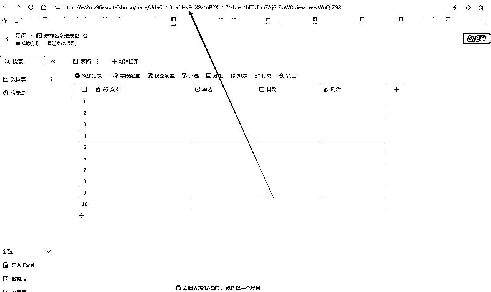

tableID就是这个多维表格当中具体的某一张表的ID了

还是一样可以通过url来获得

https://ec2mz96esm.feishu.cn/base/UdaCbts0oahHkEsIX9zcnP2Xntc?table=tblTofsmEAjGrRoW&view=vewWnQJZ93

比如第一个数据表的tableId就是：tblTofsmEAjGrRoW

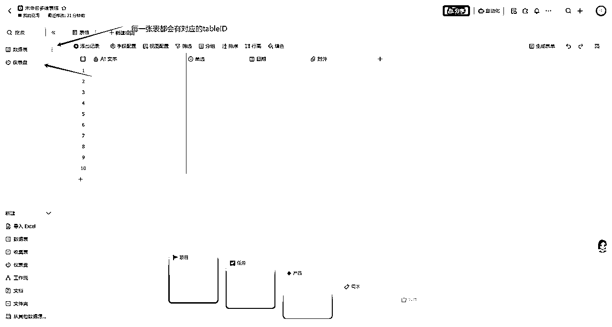

有了这四项数据，就可是成功调用飞书API并且在飞书多维表格当中去写入数据了

那如果你并不知道你要怎么做，可以直接问AI，像这样：

提示词：

我现在想要把我账号管理当中的每个账号的cookies信息储存到飞书多维表格当中，请问我应该怎么做呢？基本流程是什么？

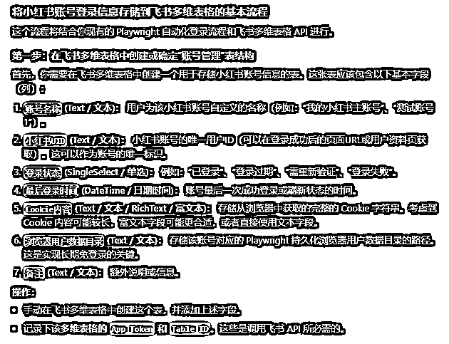

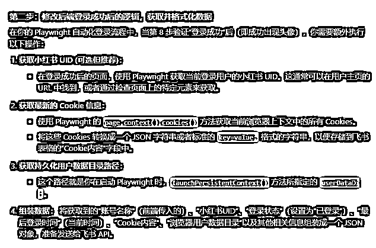

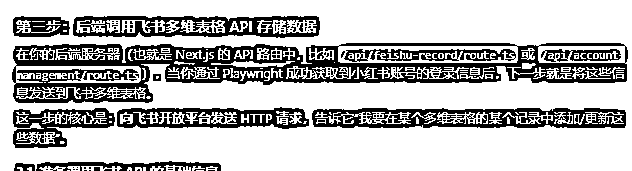

根据AI的回答，我们就能梳理出来如果想将数据储存在飞书多维表格当中要如何去做

1.  在多维表格当中创建一张表，然后确定这张表中需要有什么字段（字段可以让AI根据需求文档的前两部分来帮你输出），然后我们可以自己去创建，也可以让cursor通过飞书API帮我们创建

1.  最好的做法是让AI给我们梳理需要什么字段，以及每个字段的字段类型是什么，然后我们自己去创建，这样更加省事，因为如果通过飞书API去创建，还可能面临创建出问题的情况，所以不如自己去做

1.  通过自动化脚本来获取数据

1.  这一步，因为我们储存的数据是需要基于自动化脚本去获取的，然后转化为特定格式的数据，再储存到飞书多维表格当中，所以我们可以这样去和AI说

提示词：经过我们刚才的讨论，我已经明确了要去获取哪些格式化数据，那你能将这些要获取的格式化数据的相关代码添加到自动化脚本当中去吗？你会添加到自动化脚本中的哪个位置，请你帮我梳理一下

然后等待AI给出答复之后，你检查一遍逻辑，注意，这里重点是检查逻辑，不是让你去关注它是用什么样的代码实现的

如果AI给出了一堆专业的代码，你就把他们都用ABCD去代替掉

比如说下面这段文字，里面涉及到了一些专业的代码函数，但是其实大部分都是不用去看懂的

你把他们换成ABCD，也能大概看到它的逻辑

如果你很想了解他们的作用是什么，可以直接问AI

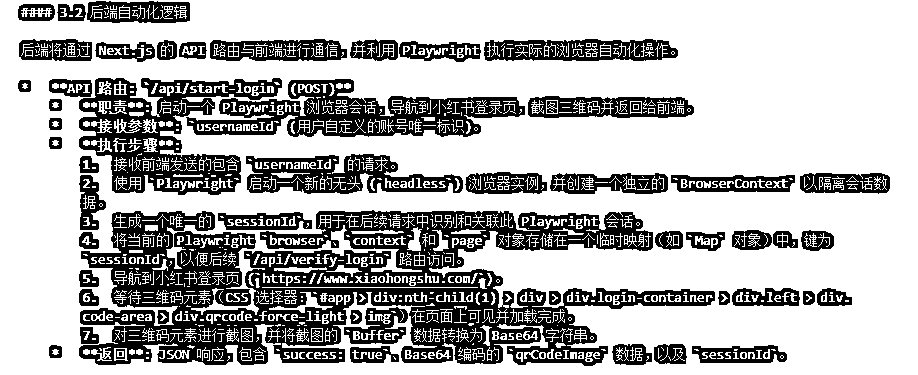

1.  调用飞书API来储存数据（这里就需要用到我们提前准备好的APPID APPSECRET APPTOKEN TableID）

这里需要重点说明一下APPID和APPSecret，你可以把这两个理解为你的家门钥匙，如果你把这两个直接发送给cursor，那么可能就会导致信息泄露

所以像这种重要信息，都会用一个专门的文件来储存，在本地环境中（也就是在我们自己的电脑上去运行的话），我们就在根目录当中去创建一个【.env.local】的文件夹（注意开头是个点）

然后我们把我们的APPID和APPSecret放到里面去，这一步一定要自己去弄，不要让cursor帮你弄

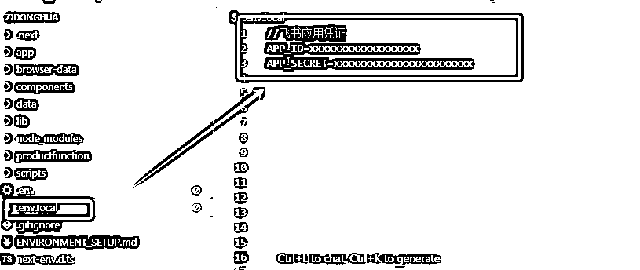

第一行是注释，可要也可以不要

名称=值

名称是可以自己命名的，最好易于理解

右侧的值放到飞书API这个语境里就是指APPID和APPSecret（这一步在前面的步骤中也已经有提及如何去获取了）

然后要怎么让cursor去调用呢？

可以在需求文档当中去增加这段话：

我已经在我的项目根目录下创建了一个名为 .env.local 的文件，并在其中添加了飞书 API 的两个环境变量。它们的名称是：

APP_ID=cli_xxxxxx

APP_SECRET=xxxxxxxxxxxxxxxxxxxx

在需要调用飞书API时，可以据此进行调用

注意：这里的xxxxxxxxx是真的去写xxxxxxxxx，不是让你填写真实的ID和Secret

永远记住，这种私密性的信息，靠自己手动填写在.env.local当中（仅针对本地环境哈）

如果你想上传到github或者进行部署，有其他方面需要去注意，这个以后有机会分享

### 第二步：让AI帮你开发功能

完成了需求文档，接下来就是让cursor帮你进行开发

功能开发的话，尽量还是选择claude-4-sonnet

下图这两个

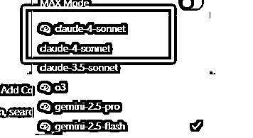

让AI按照需求文档去开发的话，最好让它分成几个部分，比如先完成前端界面的开发，然后再是自动化脚本的开发

如果直接让claude-4一下子完全实现需求文档中的全部内容，大概率它会给你偷工减料的，所以最好还是一部分一部分来

可以怎么去和AI说呢：

我现在已经完成了账号管理功能的需求文档，文档在这里xxxxxx（这里要进行文档的引用，在左侧的目录里把文件拖到对话框就能引用了），整个需求文档一共分为了x个部分，我们先来完成第一部分：xxxxx的开发，请严格按照需求文档中的内容进行开发。不要随意增加其他功能。

然后就可以去喝茶等cursor完成任务了，这一步其实也是最简单的，因为绝大部分任务都已经在第一步中搞定了

### 第三步：发现问题并解决问题

cursor在完成任务之后，就到了验证的阶段，也就是我们要去检验各种功能是否能够正常使用

要打开前端界面，我们需要进行以下操作：

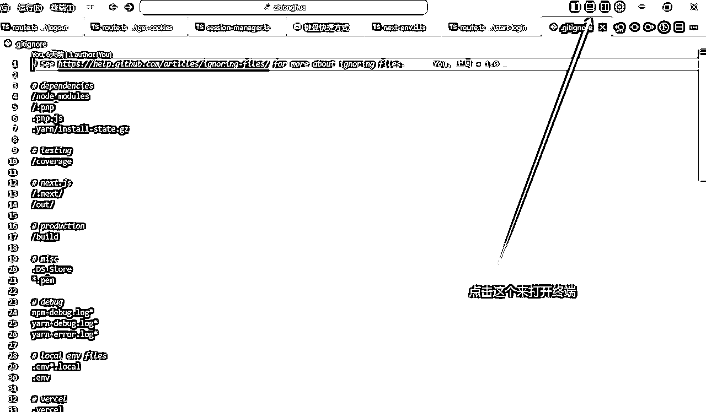

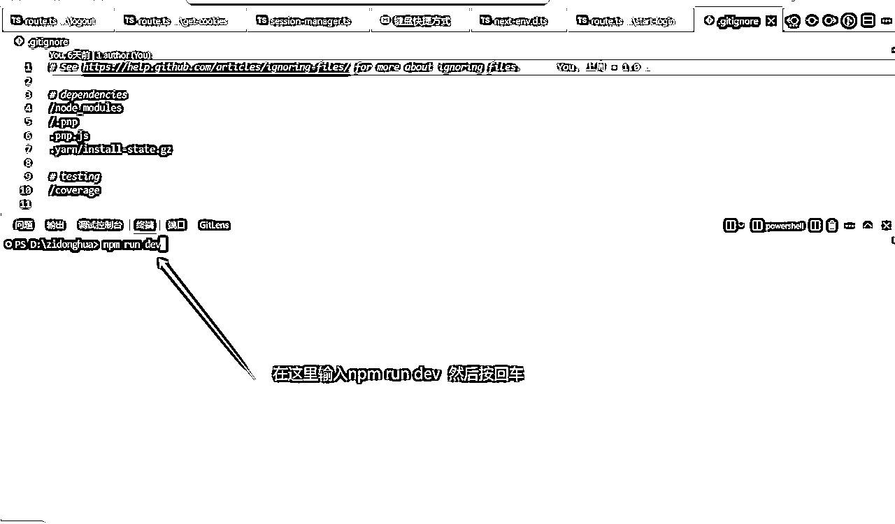

会获得一个链接，打开这个链接，就能看到前端界面了

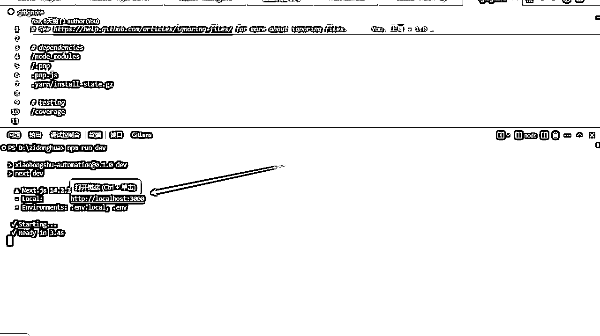

在前端界面上，如果遇到问题，我最常用的方法就是直接截图，如果是界面上的某个地方有问题，可以用箭头标记出来，这样AI也能更快了解是哪里有问题

然后就是怎么描述问题：

我一般的结构是：

我对页面上的哪个元素执行了xx操作，但是结果是什么，而我预期的结果是什么，请帮我修复一下这个问题

也可以打开F12，然后看控制台是否有报错的红色信息，有的话也可以发给cursor

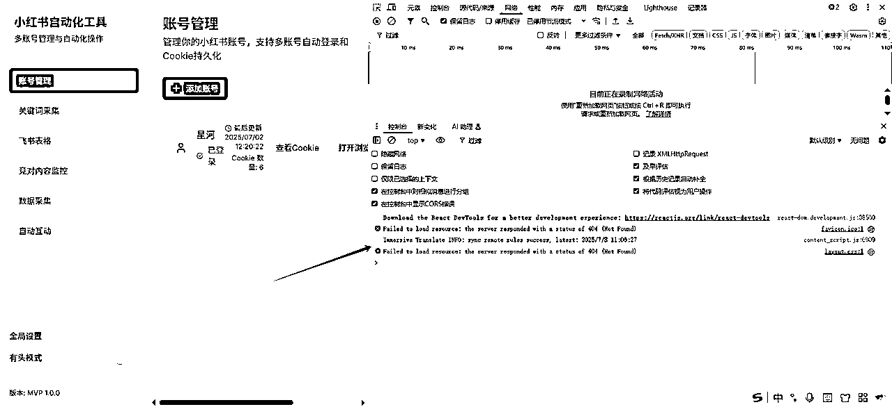

如果是脚本执行方面的，可以直接看终端，也就是下图这里，大概率看不懂报错，没关系，发送给AI就行了

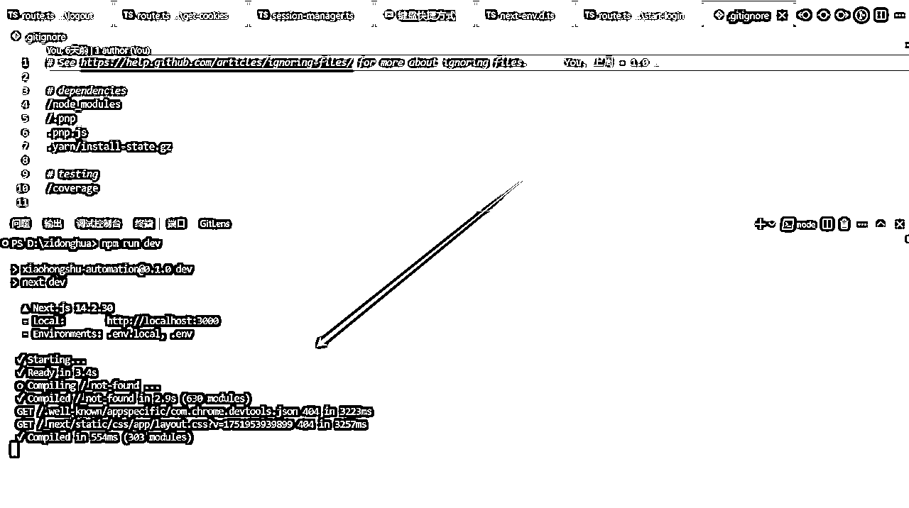

选中要发送的内容，右上角会出现这个按钮，点击这个按钮就会直接添加到对话框了

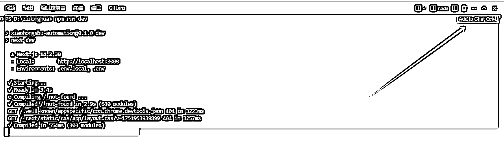

基本上，靠自己在前端点一点，以及查看终端中的日志，就能知道问题出现在哪里了（仅针对本地环境，也就是没有部署上线）

如果你真的不知道该去哪里排查问题

直接把你遇到的问题告诉AI，让AI给你出一个详细的排查步骤，然后跟着步骤走就好了

提示词：

我现在遇到了一个xxxxxx问题，但是我不知道该如何去排查原因，请你根据我描述的问题，给我出一个详细的排查步骤，我是小白，你一定要用详细且简单的文字告诉我如何进行排查

### 总结

以上就是我在写自动化功能时的基本流程

基本上所有自动化的功能都能基于上面这个流程完成开发

可能会出现问题的在于第三步，因为会出现的问题还是比较千人千面的

所以在第三步中，我也讲解了自己是如何去排查问题，核心在于提高自己解决问题的能力

小排老师说过，做出海产品是入门难，精通易，AI编程是做出海产品的基础，因此也是同理，一开始可能会觉得很难，觉得问题多多，编程之路坎坷不易，但是只要跨过第一次，之后就会越来越顺。

我在做自动化工具的过程中，我也有遇到一直无法解决的问题，把我心态都搞崩了。一度想要放弃。

最后对整个流程再做一个总结：

1.  确定要使用的技术栈、确定产品形态（网页、桌面软件、小程序、IOS等）（网页端优先推荐nextjs）

1.  写需求文档

1.  先拆解，整个需求文档能够被拆成几个部分，逐一和AI讨论完成各个部分的讨论

1.  遇到不懂的，多问AI！多问AI！多问AI！你的99%的问题AI都能帮你解决，无法直接解决的也能给你提供思路，顺藤摸瓜解决。AI时代，学会向AI提问，你就已经超越了绝大多数人了

1.  AI提供大纲—检查—提出优化点—AI再完善—再检查，循环往复，完整的需求文档就诞生了。

1.  让AI参考你的需求文档，逐一完成各个部分的开发，不追求大而全开发，一次就完成一部分

我现在已经完成了账号管理功能的需求文档，文档在这里xxxxxx（这里要进行文档的引用，在左侧的目录里把文件拖到对话框就能引用了），整个需求文档一共分为了x个部分，我们先来完成第一部分：xxxxx的开发，请严格按照需求文档中的内容进行开发。不要随意增加其他功能。

1.  验证功能，学会发现问题并解决问题

1.  截图前端界面、查看F12，并且描述清楚你遇到的问题

1.  我对页面上的哪个元素执行了xx操作，但是结果是什么，而我预期的结果是什么，请帮我修复一下这个问题

1.  发送终端日志

我的整个流程下来，你会发现，我并没有用太多高大上的提示词，提示词的作用是帮助描述清楚问题，你问题描述得越清楚，提示词的作用就越弱

希望大家都能做出一个自己的第一款用AI编程做出来的产品，即使这个产品是个纯前端的，你也要相信能创造价值，帮我在小红书上赚到钱的产品其实也是纯前端的产品。

# 开发过程中给我带来的感悟

## 完成比完美更加重要

我自己在开发某个功能模块的时候，我会想着尽善尽美，一定要把这个功能做到100%的自动化，但是在实践的过程中我发现，如果想要做到100%的自动化，可能需要付出很多额外的时间精力去完善各种功能，这里的功能不仅仅是前端上看到的功能，还有很多看不见的逻辑，比如我想要实现对竞争对手发布的笔记内容的定时监控，那我就需要考虑很多其他的问题，比如：

*   如果同时触发了多个定时监控任务，这些任务要如何去执行，是先后执行呢？，还是同时执行呢？

*   如果短时间内触发了多个定时任务，那么要如何降低被系统检测的风险呢？

*   手动监控和定时监控的优先级要如何去定？

*   监控日志是统一展示还是单独管理

除了考虑这些问题，想要去测试这些功能是否实现或者哪里有问题，也是比较麻烦的，因为这些更多属于后端逻辑上的处理，不像前端看得见摸得着，有没有修改成功，点一点就能大概率判断出来功能是否搞成功了

所以在实现一款产品从0-1的过程中，一定不要一开始就想着完美，先完成，你可以先想着完成90%的自动化，剩下10%交给自己去点一点就好了。

功能的堆砌，会极大程度耗费自己的精力，很容易搞自己心态，一个优秀的产品经理体现在如何去做减法

less is more

做一款80分的产品和做一款100分的产品，消耗的精力差别可能是10倍以上的。

## 基于真实的业务场景去开发产品

其实和第一点想强调的点比较相似，都是不要为了堆砌功能而开发功能，一定要基于自身的业务需求来开发

想去搭建某个功能时，先回答自己以下这几个问题：

*   没有这个功能对我会有什么影响？

*   它的使用场景是什么？解决的是什么问题？使用频率如何？

*   ROI如何？（开发成本和预期能带来的收益的对比，比如能帮自己节省多少时间，自己的时间又价值多少钱？开发这个功能又需要多少时间？）

*   有没有更简洁、低成本的替代方案去解决这个问题？

开发功能其实和做项目是有相似的地方的，都需要有算账思维，要去算ROI

## 不要局限于只用一个模型

模型没有好坏之分，当一个模型一直都无法解决问题的时候，尝试换一个模型

claude-4-sonnet O3 gemini-2.5-pro 在解决问题上都挺不错的，都值得尝试

想免费沟通需求，可以用gemini-2.5-flash 这个是免费的，然后再用其他付费模型再润色一下，你用哪个模型去开发功能，最好就让哪个模型去润色一下需求文档

当然了，如果你有充足的条件，可以尝试用claude code 这个应该是目前最好用的AI编程工具了，但是使用条件比较苛刻，所以前期可以暂时只用cursor（我目前也只用cursor）

## 比做产品更重要的是挖掘需求的能力

产品只是需求的解决方案

不要埋头去做产品，在做产品之前一定要先去做调研

在做产品之前

一定要思考这几个问题：

1.  目标用户是谁？

1.  要足够细分，不能单纯说自己的用户群体是宝妈，要更加细化，不同类型的宝妈，他们的需求是不一样的

1.  在市场营销里，有一些常见的用来细分的维度，我这里举一些例子：

1.  按照地理进行细分：如一二三线等、城市/农村

1.  按照人口细分：年龄、性别、收入、职业、教育程度等

1.  心理细分：生活方式：极简/精致/户外爱好者 兴趣爱好、个性等

1.  行为细分：价格敏感程度、品牌忠诚、行为习惯等

举一个我之前看到的例子，在小红书上有人通过剪辑一些山姆相关的视频来起号接广，并且这种类型的账号很容易接到广告，其本质就是这类账号的用户画像都太优质了，你想想，会关注山姆相关的视频的主要群体是哪些人：20-35岁、年轻女性、在一线城市、教育水平高、对价格不是很敏感、生活还可能比较精致，这种种都指向了一个点：消费能力强，所以广告主愿意在这类账号上投广告。

我们去做产品也是如此，先研究用户，再提供符合这类人群的特点的解决方案。提供一个“货不对板”的产品，用户的接受能力就变低了。影响变现。

1.  你的产品解决的是哪个场景下的需求

1.  同一个目标用户，它在不同场景下，要解决的问题是不一样的，比如同样是老师需要进行成绩分析，可能的场景有：给家长分析孩子的成绩；或是在其他老师面前汇报。 那不同场景下，老师需要的解决方案就会不同，前者可能需要单个孩子的详细学习报告；后者更需要宏观层面，如班级的整体情况，年级的整体情况

1.  解决的问题是什么

1.  同样的场景，不同的用户，他们的需求也可能是不一样的，比如还是成绩分析，同样是给其他老师做汇报，有的老师希望有一个产品可以快速呈现数据，辅助老师完成成绩分析，有的老师则希望一站式完成成绩分析，甚至是完成汇报PPT

1.  愿意付多少钱？

1.  开发产品的核心目的还是变现，如果你做出来一款产品，确实能解决别人的问题，但是无法让用户掏钱，那从商业角度来看就不算是一款成功的商品了。

1.  你的竞争对手？他们的产品是如何解决问题的？

1.  知己知彼，百战百胜，先调研竞争对手，看看竞争对手都是怎么解决相同场景下的问题的。

1.  产品想要胜出，其一是信息差， 其二就是差异化，这里的差异化是指能不能在某个方面胜出你的竞争对手，并不是一定要你想出一个完全100%不同的解决方案。只要你在某个方面有特点，就一定能吸引到人

## 飞书API还有很多潜力

写到这里的时候正好是7月9号，飞书刚好在今天举行了2025年的飞书无限大会

然后我去看了一下官方发布的文档，我觉得信息量还是蛮多的，感兴趣的可以看一下

第一点是飞书多维表格人的使用人数已经超过1000万了，这也代表了多维表格的潜力

然后今年多维表格也在增强自己的AI能力，（不完全介绍），：

1.  AI节点捷径：AI 字段捷径将强大的 AI 能力放入每一个单元格一样，我们也将 AI 能力融入到工作流的每一个节点中。每个节点都可以是一项强大的 AI 能力，在工作流中自由编排、智能联动，组合出无限可能的业务场景。

1.  包括AI agent节点，之后可以飞书工作流当中去加入智能体了。

1.  另外一个我印象比较深的就是飞书的apaas，这是它的介绍：

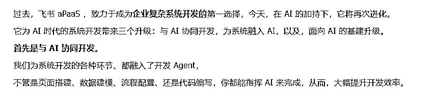

我看到的个人想法，就是觉得这个不就很像我这篇文章正在做的事情吗，用AI编程来搭建自己的系统，然后通过飞书API把飞书接入到了自己的系统里嘛

小排老师的文章里也讲过，我们要做的AI产品，最好去做那些能够随着大模型能力的增强而让自己的AI产品变强的产品

这里我觉得也是比较相似的，多维表格越强，我接入飞书API的系统就也越强。

## 自动化网页也还有很多潜力

把自动化工具做成网页版其实还有一个优势，就是可以随着自己的需求变化通过API然后接入大模型，把自己的自动化网页打造成AI自动化。

在上了小排老师的课程之后会发现，在网站内去接入大模型其实是非常简单的一件事。

如果你想了解怎么做，可以点赞。投个锚点支持一下，下次就开足马力马上来写！

第一次写文章，有写的不好的地方各位圈友多体谅