# AI App开发SOP全公开：我如何用1周上架、23天实现$513 MRR？这套可复刻的打法，你也能用

> 来源：[https://qcnievo9yz2n.feishu.cn/docx/VUf7dfm74ohG0Vxk6Yecz0iinmh](https://qcnievo9yz2n.feishu.cn/docx/VUf7dfm74ohG0Vxk6Yecz0iinmh)

各位生财有术的圈友们，大家好，我是 linyy。

很高兴收到飞掌柜领队的邀请，在航海期间和大家做个分享 。感谢生财官方能提供AI iOS APP 这么好的航海，也感谢航海期间所有教练的辛勤付出。说实话有些惶恐，在藏龙卧虎的圈子里，我只是一个刚起步的探索者。飞掌柜说，你上了好几次航海的好事墙，把你的经历和方法分享出来，就是对大家最大的价值 。

两年前我接触到生财，被无数圈友从0到1的故事深深吸引，但迟迟没有行动 。今年，我下定决心，清零过往，选择 AI App 这个赛道。

虽然我过去有研发经历，但已经多年不写代码，对客户端开发更是个新手。所以，大家完全可以把我当成一个 App 开发新人来看待 。这次，我想和大家分享一下，我是如何在航海期间，从零开始，将两个 App 成功上架 App Store，并获得初步的订阅收入的。希望能给大家带来一些有价值的信息和帮助 。

# 一、 航海结果展示：看数据

在分享具体的方法前，我们先看一下这次航海的成果。

我是 6 月 2 号正式开始开发的，用了一周左右的时间，我的两个 App 都顺利通过了审核并成功上架。之后，我持续进行版本的更新迭代，并获得了下图revenuecat所示的订阅收入 。

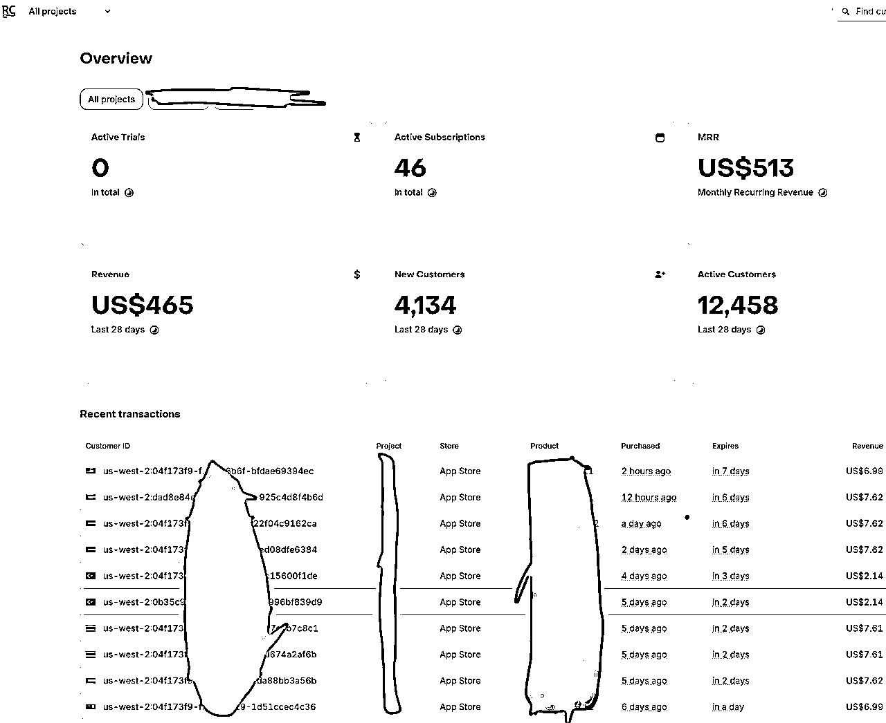

*   月度经常性收入 (MRR): $513

*   新增用户: 4134

*   活跃用户: 12458

*   付费订阅用户: 46

这个数据虽然不大，但它验证了我的核心想法：在当前阶段，基于 AI 能力开发一个产品已经不是最难的部分，真正的核心竞争力在于构建一套可复制的产品生命周期流程和方法论。

所以，在航海开始时，我没有一头扎进代码里，而是花更多时间思考如何构建我的这套系统 。接下来，我将毫无保留地复盘我这一个月的心路历程和方法论，希望能给在路上的你，提供一些有价值的“干货”。

这套方法论和系统构成如下图：

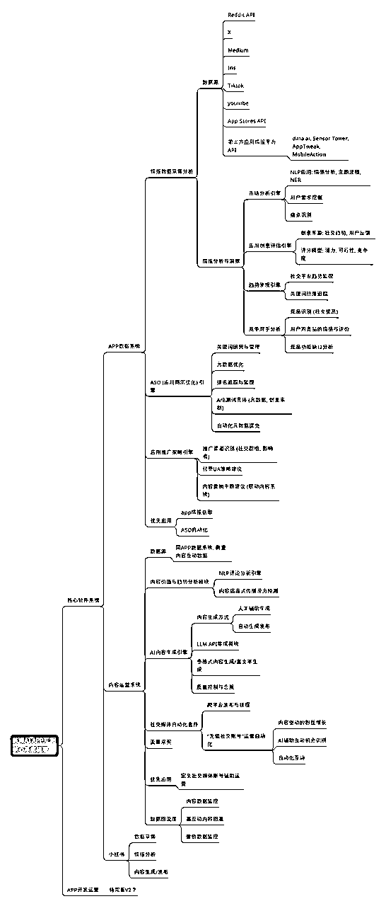

下面，我将从需求分析获取、App 开发、内容运营三个方面，来拆解我这套系统（当前还是自用的带bug版本）的具体构成。

# 二、需求分析系统：用 AI 大脑找到精准的产品机会

万里长征第一步，是找到真实且有价值的需求 。为了解决这个问题，我利用 AI 能力，为自己构建了一个“AI 情报数据分析系统”。

我搭建的这套“AI情报数据分析系统”，就是我的导航地图 。它不是简单的浏览网页，而是一个7x24小时、自动化、多维度为我服务的市场需求监控体系。

它的工作流程分为三步：多数据源采集、自动化数据清洗与处理、智能化情报分析与提炼。

## 第一步：多数据源采集

我构建的这个系统触角会伸向用户和竞品最活跃的地方，我将数据源分为两类：

### 社媒平台：挖掘原生需求和未来趋势

*   平台选择： Reddit、Medium、X (Twitter)、TikTok、YouTube 。

*   采集目标：

*   Reddit： 这里是金矿。我会重点监控像 r/AppIdeas, r/SideProject, r/Software 等社区。我要找的不是一个成熟的想法，而是用户在帖子和评论里用最朴素的语言表达的抱怨（“I hate it when...”）、愿望（“I wish there was an app for...”）和临时的解决方案（“I use three different tools to do this one thing...”）。这些都是未经雕琢的真实需求。

*   X / TikTok / YouTube： 重点关注科技KOL、效率博主和AI领域的创作者。分析他们正在讨论什么新技术、什么产品，以及评论区里用户的反馈和提问。这能帮我快速捕捉到新兴趋势和风口。

*   采集方式：

*   利用 Reddit 和 X 提供的官方 API 接口，编写脚本进行高频、合规的数据抓取。

*   对于 TikTok 等平台，则通过定制化的网络爬虫（例如使用 Python 的 Scrapy 框架）来定向采集特定话题下的热门内容和评论数据。

采集的数据如下图：

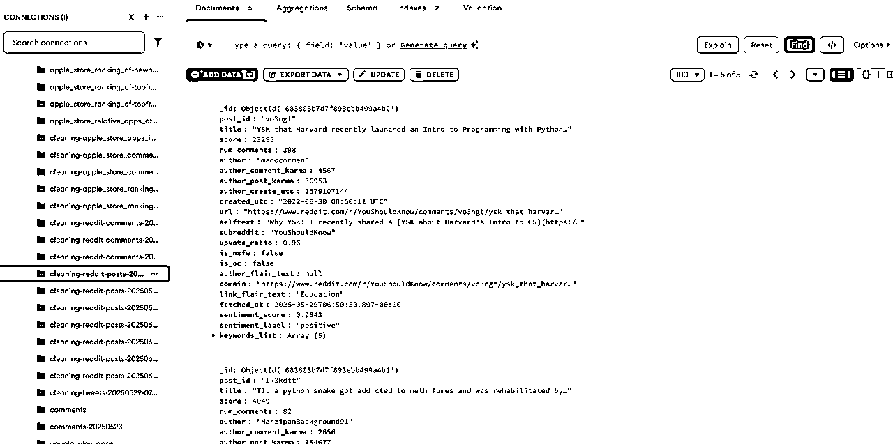

我还做了一个飞书 bot，监控数据采集任务：

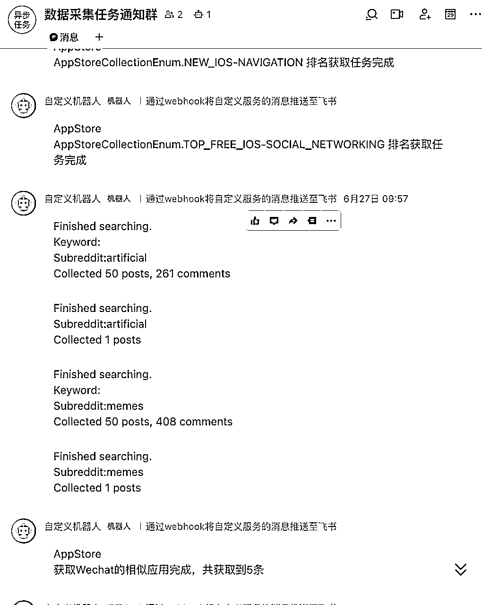

### 专业平台：进行精准的市场与竞品分析

*   平台选择： Poe等AI应用平台、第三方数据平台（如七麦、data.ai）、App Store/Google Play应用商店本身。

*   采集目标：

*   AI应用平台： 分析头部应用的功能、Prompt设计、交互方式和用户反馈，这能给我带来最新的产品和技术实现灵感。

*   应用商店与数据平台： 这是最直接的竞品分析。我不只看下载量和收入榜，我更关注：

*   用户评论： 特别是三星和一星的差评，这是用户用真金白银投票选出的“产品改进清单”。

比如 caiai app 评论数据采集：

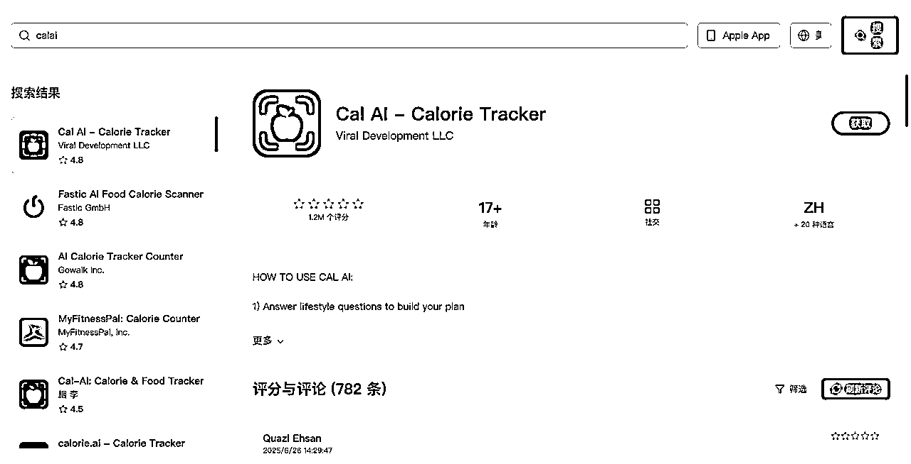

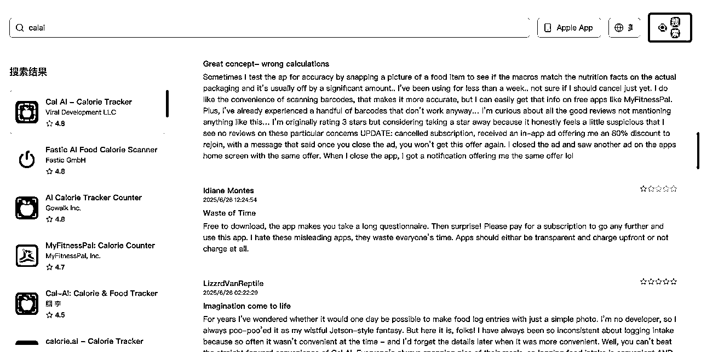

可以筛选出所有 1 星评论来研究：

*   版本更新记录： 分析竞品最近半年在迭代什么功能，这能反推出他们的产品战略和未来的发展方向。

*   定价策略： 他们采用订阅制、买断制还是消耗制？不同定价背后的商业逻辑是什么？

*   采集方式：

*   调用应用商店的官方或第三方API，批量获取应用信息和评论。

*   编写爬虫，定期抓取竞品的版本更新历史和定价页面，形成动态竞品档案。

## 第二步：自动化数据清洗与处理

原始数据是杂乱无章的，就像未提炼的矿石。我需要构建流程自动对采集到的数据进行清洗和结构化处理：

*   去重与去噪： 剔除重复信息、广告、机器人评论等噪音数据。

*   语言处理： 将多语言的评论和帖子统一翻译成英文或中文，便于后续分析。

*   结构化存储： 将清洗后的数据，按照来源、时间、关键词等标签，存入结构化的数据库中，方便后面调用。

## 第三步：智能化情报分析与提炼

这是最核心的一步，系统利用NLP（自然语言处理）等AI能力，从海量数据中提炼出真正的“情报”：

### 用户需求分析（挖掘痛点）：

*   关键词提取与聚类： 对上几万甚至几十万条条评论和帖子进行分析，提取出高频词（如“summary”, “transcribe”, “workflow”），并将相似的抱怨或需求聚类。这样我就能发现一个群体性的痛点，而不是个例。

*   情感分析： 自动识别每条评论的情感倾向（正面/负面/中性），让我能快速聚焦于负面反馈，找到用户的核心不满。

### 竞品分析（洞察策略）：

*   系统会自动生成竞品的“功能矩阵”和“迭代时间线”，让我能一目了然地看到竞品的优缺点和战略动向，从而找到市场的空白点或差异化机会。

### 可行性分析（评估机会）：

*   市场规模预估： 通过分析相关关键词的讨论热度、搜索量和相关应用的下载基数，初步判断这个潜在市场的规模。

*   变现模式验证： 分析赛道内成功产品的定价，验证用户是否愿意为这类需求付费，以及哪种付费模式更容易被接受。

通过这套系统，最终会自动生成一份 “xxx产品情报需求机会评估报告”。这份报告会清晰地告诉我，哪个方向值得投入，它的市场有多大，我的切入点应该是什么。

通过这个系统，我能快速地筛选和验证我的想法，而不是凭空想象。

这是我写的自动化数据处理的管道：

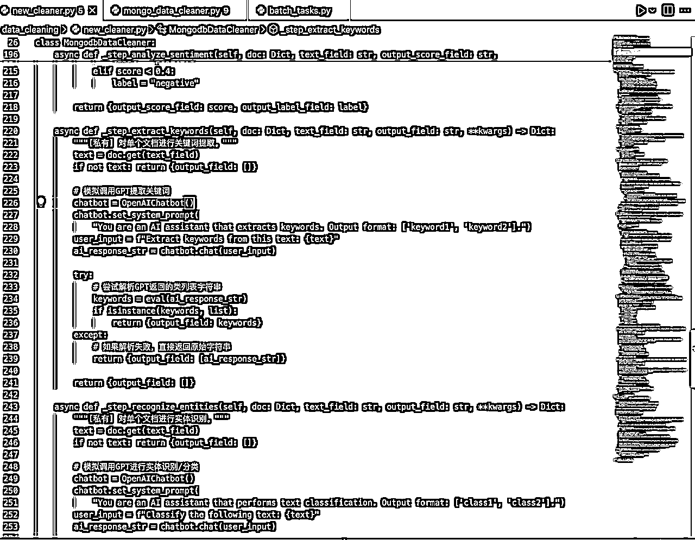

这是基于 gemini 2.5 pro 自动分析调研形成的报告：

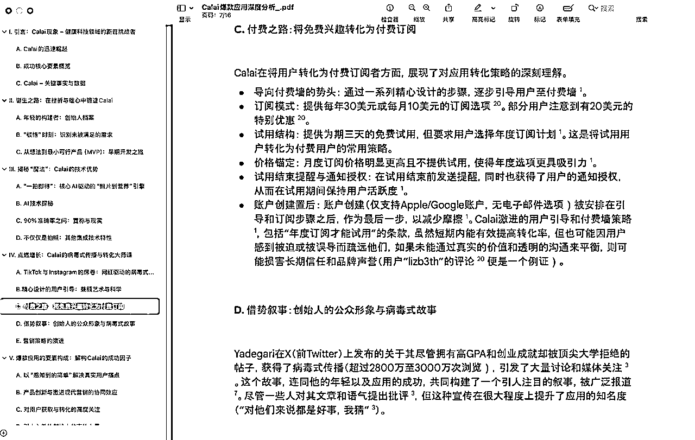

并可以对输出的报告进行网页概览阅读：

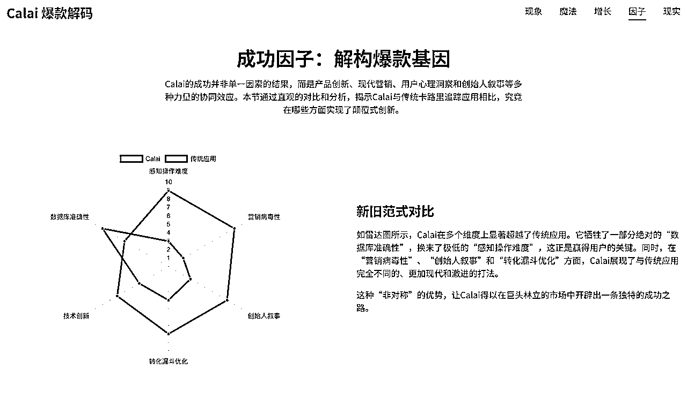

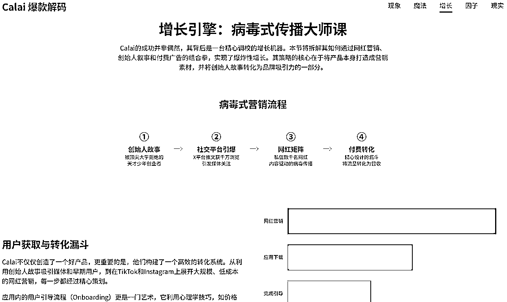

# 三、 App 开发系统：AI 驱动的高效交付流程

找到需求后，就进入了开发环节。我的目标是：

人只负责思考和决策，让 AI 最大化地承担执行工作。

我的开发流程如下：

### 选择称手的工具：

我一开始使用 Cursor，它确实很优秀，但缺点是当请求量多的时候，模型的速率限制会变得很慢，非常浪费时间 。所以我后面我就切换到了 cline，虽然成本高了一点，但开发效率的提升是巨大的 。

最近几天我测试了 gemini cli，虽然还有些小 bug，但非常好用，最重要是每天有 1000 次免费调用 geimini 2.5 pro 的额度，比 cursor 一个月的调用额度还多。

### 需求文档 -> 设计图：

我会先将详细的功能需求整理成 Markdown 文档 。然后，使用 cline 调用 Gemini 2.5 Pro，直接将这份文档喂给它，生成 App 的设计图 。效果非常好，基本能达到可直接用于开发的程度 。

### 设计图 -> 代码：

有了设计图，开发就顺畅多了。我使用 cline 配合 Claude 4 Sonnet 进行编码，体验很丝滑。这里的关键是，需求一定要拆分清晰，按模块、按页面、甚至按功能点去提问，不要把整个项目一股脑地丢给它 。 AI 是你的程序员，而不是你的项目经理。

### 变现设计：

在开发的同时，就要想好变现模式。我主要采用的是订阅制 + 免费试用（Trial） 的模式。核心功能如 AIGC 内容生成、高级数据分析等都需要订阅解锁，以此来吸引用户付费。

# 四、 内容运营系统：0 成本实现 App 的冷启动和持续增长

App 上线只是开始，酒香也怕巷子深。我同样构建了一套 AI 内容运营系统，来实现低成本获客。

这套系统的核心思路是：自动化生产内容，并承接流量，最终引导至 App 内实现转化。

### ASO 高度自动化

基于 gpt4.1 构建了一套高度自动化的 aso 系统，可以全面接管 appstoreconnect 的大部分信息的内容生成，并自动优化 aso

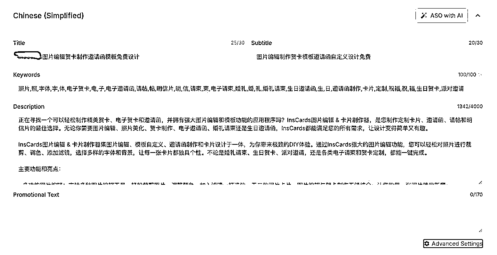

### NLP 用户需求分析

通过分析 App Store 的用户评论、社媒上的相关讨论，利用 NLP 技术提取用户的高频词和核心诉求，这为我们的内容创作指明了方向。

### AI 内容生产系统

*   LLM AI： 负责生产“干货”，比如围绕 App 核心功能撰写科普文章、教程、X 推文等。

*   AIGC AI： 负责生产“视觉冲击”，比如用 Midjourney/GPT o3 生成精美的配图，用 Pika/Sora 生成酷炫的短视频。

### 社交媒体自动化

利用自动化工具，将 AI 生产的内容定时、定量地发布到 X、Instagram 等平台。甚至可以用 AI 机器人进行一些基础的评论互动，维持账号热度。

### 流量承接与转化

所有外部流量，最终都会引导到我们的 App 下载页或专门制作的落地页（Landing Page）。通过 App 内的优质内容和功能，配合清晰的付费引导，最终实现用户转化和留存。

# 五、 小结与反思

最后，简单总结一下我这次航海过程中的心得体会：

1.  构建系统大于单点技巧： 零散的技巧会让你疲于奔命，而一套高度自动化的系统则能带来源源不断的动力。

1.  AI 是杠杆，不是魔杖： AI 能极大地放大你的执行力，但它不能代替你进行思考。明确的需求、清晰的逻辑，依然是开发者最重要的能力。

1.  别做“万能App”：没有为什么，在你开始阶段就是别做。

1.  拥抱付费工具： 时间是最大的成本。在可承受范围内，为能显著提升效率的工具付费，是绝对值得的投资。

1.  关注核心指标： 在运营过程中，要持续关注用户留存率、付费转化率、以及 LTV（用户生命周期价值） 等核心指标，用数据指导你的迭代方向。

我的分享就到这里。希望我这套从0到1的系统构建思路，能对正在路上的你有所启发。如果大家有任何问题，欢迎在评论区与我交流，我们一起探索，一起生财！