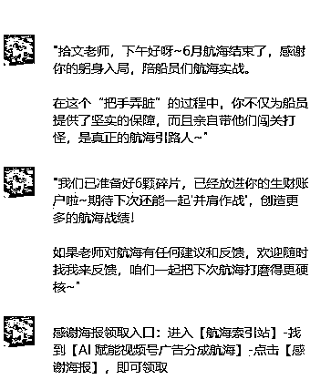
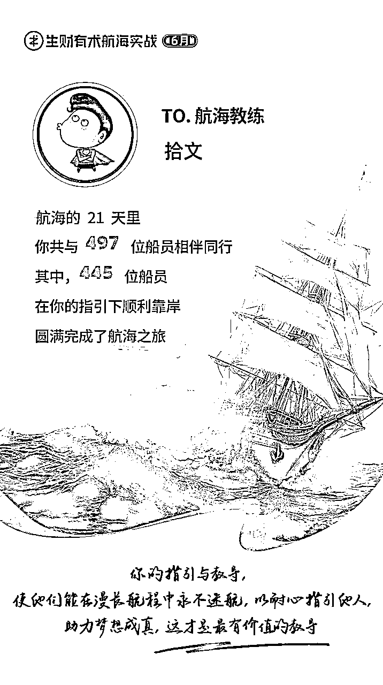

# 【喂饭教程】AI短剧/故事类视频创作（启蒙帖）

> 来源：[https://bcn7jh9fl49y.feishu.cn/docx/JHpEdS1CZoL3VPxJwnycjlLWn2S](https://bcn7jh9fl49y.feishu.cn/docx/JHpEdS1CZoL3VPxJwnycjlLWn2S)

# 【写在前面】

分享下今天的开心事儿~吼吼吼，哈哈哈哈~

真的是越分享越幸运，人生中好多第一次，都在生财实现了，很激动也很感动~

第一次发帖

第一次帖子被加精华

第一次当教练

第一次直播

...

好了，感动的话以后再说~

圈友们好，我是拾文，我又来了

这篇帖子，我会给大家详细拆解AI短剧/故事类视频的制作过程

这篇帖子，侧重教程向，不展示对应数据和对标账号

AI微短剧故事最近热度很高，为了尽快让大家吃上肉，不废话，直接上教程

耐心看完帖子，你将学会

1.如何从0到1创作一个原创的短剧/故事类文案脚本

2.如何从0到1创作文案脚本对应的分镜头文生图提示词和图生视频提示词

3.如何从0到1用AI类工具制作分镜头画面和分镜头视频素材

4.如何从0到1完成AI视频分镜素材的二次加工剪辑出片

在正式开始分享之前，我们先来看下，相关的案例展示：

# 一、写文案脚本提示词

## 提示词公式：

为 [目标受众群体]，以 [叙述视角] 创作一篇 [故事类型]，语言需具备 [风格 1]、[风格 2]、[风格 3] 及 [独特韵味]，内容要 [内容特点 1]、[内容特点 2]、[内容特点 3]，故事节奏 [节奏要求]，开头用 [特定句式]，篇幅 [字数范围]，[特定要求]。

## 提示词示例：

我是一个快手博主，粉丝都是中年人，帮我以第三人称写一个乡间民间故事，有“民间故事”特有的朴素口语化风格使用朴素、生动、具有中国传统民间故事韵味的语言，内容吸引人，新奇通俗易懂，，整个故事节奏快，开头第一句问句（比如:你知道为什么XXXXX吗），1200字左右，开头问句后立刻进入故事

# 二、写分镜脚本提示词

## 提示词公式：

为 [故事名称] 生成可直接用于 AI 绘图和图生视频的精准提示词，共 [分镜数量] 个分镜，需依据原文完整生成所有分镜，不缩写、精简或仅完成一半，以表格形式输出，表格包含 [分镜编号]、[分镜对应故事原文]、[详细 AI 绘图提示词]、[视频提示词] 四部分。

其中，详细 AI 绘图提示词需写出 [场景时代]、[背景]、[出场人物的性别年龄动作外表服饰]、[元素物品]、[天气]、[镜头景别] 等内容，且要始终保持 [人物属性] 一致，[人物穿着风格]、[风格]、[服饰颜色] 一致，每个 AI 绘图提示词后缀必须加上 “[固定后缀内容]”；视频提示词不需要音效，只需 [人物动作表情]、[环境动态]、[运镜方式] 的提示词，[特定分镜] 不需要 [特定形象]，每个视频提示词后缀必须加上 “[固定后缀内容]”。

## 提示词示例：

我要做一个关于以下故事的可直接用于AI绘图和图生视频的精准提示词，40个分镜，原文完整生成所有的分镜不准缩写精简或者只完成一半，以表格的形式输出，表格为四部分，分镜编号，分镜对应故事的原文，详细AI绘图提示词，视频提示词。请根据以上的内容，帮我生成每个分镜的AI绘图详细提示词和每个分镜对应的图生视频提示词，始终保持一个人物属性，穿着符合古代风格衣服，严格保持人物一致，风格一致，服饰颜色一致，，为了方便复制提示词，每个ai绘图提示词必须详细写出（古代场景，背景，每一个出场人物的性别年龄动作，外表描述，服饰，，元素、物品，天气，全景中景近景等），每个绘图分镜必须详细完整描述所有人物的年龄性别服饰外表，每个Ai绘图提示词的后缀必须加上"超清8k分辨率，写实风格，光影渲染自然色彩对比鲜明-，美术风格：用CG（计算机图形）技术呈现，带有厚涂质感，，符合东方美学对意境的追求。"，每个视频提示词的后缀必须加上“，画面主体动态呈现，人物面部清晰，动作自然流畅，环境光，符合逻辑，极致细节，超真实动态捕捉。人物脸部不变形。清晰自然，不模糊，高质量，没有瑕疵”。视频提示词不需要音效，只需要人物动作表情和环境动态和运镜方式的提示词，第一个分镜不需要说书人形象

## 三、视频教程【电脑演示】

## 1.文案脚本制作

## 2.分镜头脚本制作

## 3.分镜头图片生成

## 4.分镜头视频素材生成

## 5.配音制作

## 6.剪辑制作

电脑制作更方便，但是手机操作也是可以的，看个人习惯

# 四、注意事项和技巧

## 1.如何解决视频生成需要的大量积分

即梦一个号每天送66到100积分，运动幅度不是特别大的镜头建议使用S2.0模型生成一条耗费5积分，相当于一个手机号每天可以生成15条左右，运动幅度大的镜头可以使用3.0模型或者豆包

豆包一个号每天可以生成10条视频

纳米搜索一个号每天可以生成3条视频

通义每天可以生成15条视频

可灵，Vidu ai，海螺Ai 等平台都有免费积分，可以多账号合理薅羊毛

有能力的还可以使用相关平台的海外版网站

能力更强的可以使用国外平台模型

## 2.文案和分镜脚本的生成

教程里使用的是DeepSeek用来生成民间故事和生成分镜表格，掌握方法后可以自行探索使用其他平台模型

在生成分镜头表格的时候DeepSeek有时候会摸鱼偷懒，生成缩减内容！甚至胡编乱造！可以多次新建对话内容，多次生成，生成后人工抽卡，总结优化内容

DeepSeek官网依然经常出现服务器繁忙的问题，可以使用腾讯元宝，元宝里内置的有Deepseek模型

生成故事的时候，自己要看一遍，一条肯定不行，让ai多生成几条故事，自己去挑选，可以给写故事的提示词加上指定标题，比如让AI写一个玉皇大帝在人间喂猪的故事，就可以加上这句话，ai就会围绕这个方向去写故事，如果自己想不出来标题的话，就去下载一个喜马拉雅上面搜索民间故事，里面有几千种民间故事，把他的故事名字直接复制出来，让AI给你重新写

## 3.分镜图片的生成

分镜图的生成建议使用豆包，豆包生图现在免费，可以用教程里的方法批量出图，有较好的一致性

掌握方法的也可以尝试其他平台模型

【视频教程里的第3部分，后半段多图生成，你一定要认真看，这个技巧花钱都不一定能买到】

能很大程度上解决人物一致性，而且能提高制作效率！！！

## 4.文案配音

文案的配音工具选择比较多，新手建议用“配音蜂”小程序，看广告可以免费导出，类似的微信小程序很多，多找几个薅羊毛，也可以使用剪映的文本朗读功能，里面音色也很多

## 5.关于分镜数量

教程演示做的比较粗糙，实际操作中要人工优化文案脚本字数，尽量缩减镜头，通过控制文案脚本的长度控制镜头数量，减少制作的工作量

## 6.生成素材的即梦等平台水印和ai标识水印如何去除

# 五、用到的工具

## 1.文案脚本生成工具

DeepSeek: https://www.deepseek.com/

豆包：https://www.doubao.com/

## 2.AI绘图视频生成工具

豆包：https://www.doubao.com/

即梦：https://m.jimeng.jianying.com/s/04NW5OGxu1c/?t=-3

可灵：https://klingai-share.kuaishou.com/h5-app/invitation?code=6BG4UYBH4VXW

## 3.配音工具

配音蜂微信小程序：#小程序://配音蜂/HEkss6CvGKrFZNf

配音神器微信小程序:https://peiyinshenqi.com?rr=1wvYKRzkm9

## 4.剪辑工具

剪映:https://www.capcut.cn/

# 六、变现路径

1.视频号创作分成计划，需要100粉丝开通

2.抖音创作分成，需要1w粉丝开通

3.快手创作者激励计划，需要1000粉丝开通

4.粉丝量高的账号可以接广告

5.知识付费，可以付费收徒教学

6.小红书流量号，粉丝1000后接广告

7.头条号西瓜号创作激励

...

给新手的一些建议，如果你想问这个如何变现，你就先从视频号分成做起，等把这个做明白了，你自己就有答案了

6月AI赋能视频号分成计划航海手册传送门：https://scys.com/view/docx/YRXsdXAUron0f7xIZHccqSw2nmb

# 【写在最后】

现在的ai只是工具，工具就是拿来用的，不是用来吹牛逼的。工具再厉害也替代不了人的作用，现在的ai是没有灵智的，所以他只是一个高级点的工具。怎么用，用成什么样，取决于使用它的人。人的作用是一个高级指挥官，你要学会指挥ai工作，尽可能做到“因材施用”，有新的工具出来，都要去了解下，不要嫌弃它当前不够聪明，不够完善，能力不够强，取百家所长，打出组合拳也很厉害。

帖子标题为什么说是启蒙篇？这套方法就是短剧方向的启蒙，拿故事赛道来说，这个赛道有民间故事，童话故事,科幻故事，悬疑故事... 你可以尽情探索；短剧方向题材更多，赛道更宽。做不了精致的你可以先从粗糙的类型做起，做不了太长的，你可以从微短剧做起...

想到这么多，先写这么多，后面想到再做补充~