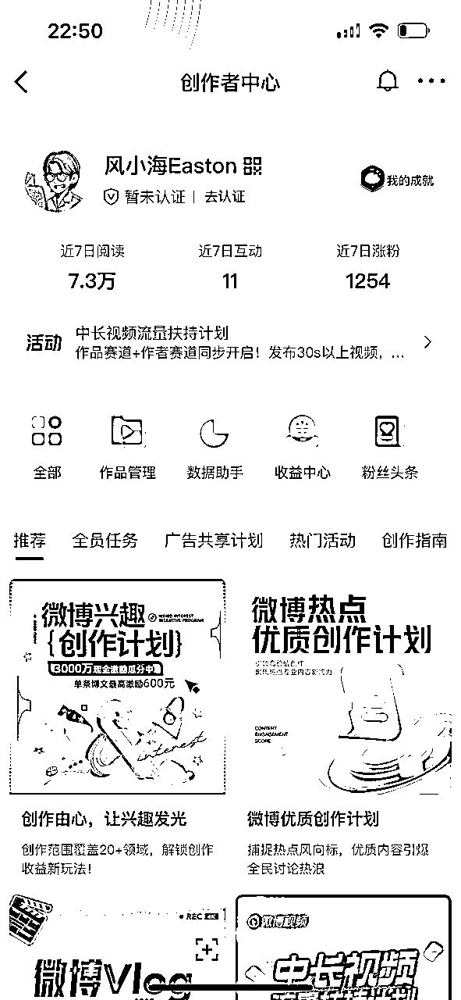
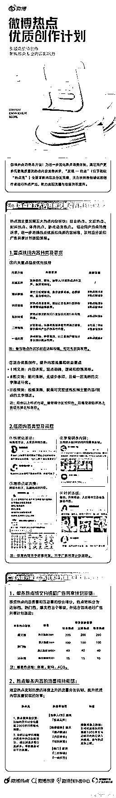
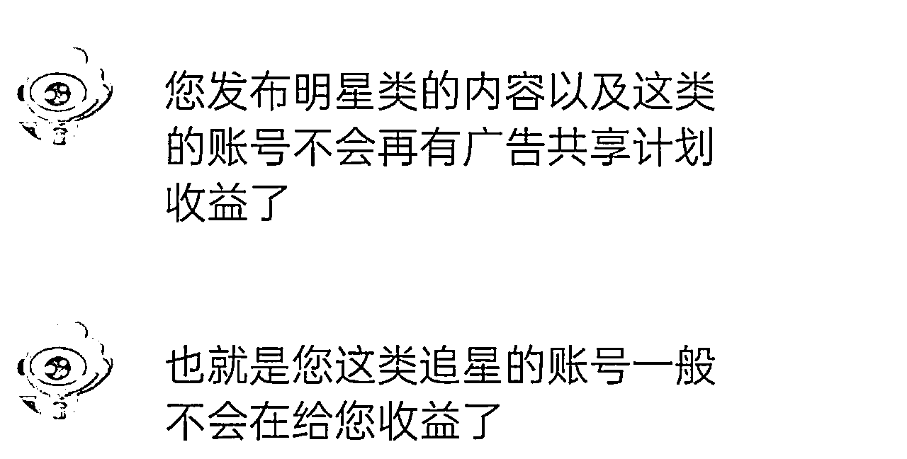
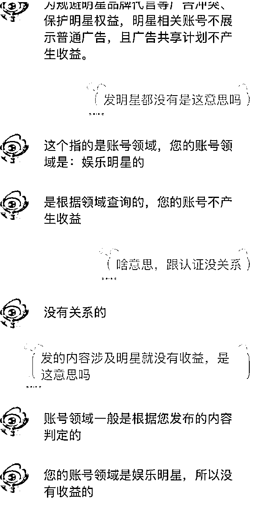

# 微博热点优质创作计划最新体验分享

> 来源：[https://fi8jncah4ds.feishu.cn/docx/WDSodJB3OocHz7xd1SkcxxSOnJe](https://fi8jncah4ds.feishu.cn/docx/WDSodJB3OocHz7xd1SkcxxSOnJe)

# 自我介绍

大家好，我是风小海。公众号同名

人在武汉，三年生财老圈友，服装行业，亏过也赚过，现在时间自由，离财富自由还差亿点点。

在过去的一年里，我通过风向标中标兑换了一年生财门票，我不是天赋型选手，只是走过不少弯路，踩过的坑刚好比你多一点。所以我想把这些年亲自试过的赚钱项目一条条写下来

我第一桶金的故事

前几天看到圈友@陶美丽 分享关于微博的精华帖 ，觉得非常的有趣。正好我自己也一直有发风向标的习惯，这种可以既满足创作欲又能赚钱的好事，实在是太适合我了，于是立马就下场实操了一下。

先说结论：3天，我发了20条微博，累计阅读7.3W，我没有选择互关来涨粉，因为没时间做那么精细化的操作，直接用钞能力搞定的，1000粉丝只需要30元。

这个项目最难的点就是100个铁粉，和后续铁粉的维护，不过我认为靠圈友之间的互助，这个难点也很好解决，如果大家需求量大的话，我可以申请让鱼丸组织一下，帮助圈友们互关互铁，达成橙V门槛。

## 微博现在是个什么平台？

我一直在想，微博到底变成了什么？ 它还值得经营吗？还适合普通人玩吗？

如果你过去几年没用微博，现在再打开，可能会觉得陌生、混乱，那它到底变成什么样了？

我们来拆解一下微博的现状

* * *

### 微博的基本定位：“社交+媒体”的混合体

微博最早是中国版的 Twitter，强调“关注-发布-转发”的开放社交机制。

但今天的微博，已经更像一个偏媒体属性的平台：传统媒体+机构入驻频繁发布信息；明星、KOL、大V形成强中心话语权；用户主要是围观型消费内容，互动性较弱；内容以热点、娱乐、社会议题、八卦为核心。

总的来说微博是一个基于“社会议题与名人内容”建立起来的开放性信息场，而非私密社交平台。

* * *

### 用户都去哪儿了？

你会发现，微博上有两头在活跃，中间少了。

一头是饭圈、Z世代、热衷参与舆论的大众

另一头是中老年用户、官方媒体、自媒体机构

但中间那批“25-35岁的主力消费人群”，越来越少

为什么？因为他们已经被其他平台分走了：

想看生活方式？ 去小红书

想听干货讲解？ 去b站

想做私域沉淀？ 去视频号

想表达观点？ 去知乎（虽然也崩）

微博的舆论密度太高、戾气太重，不适合“种草”、不适合“安稳输出内容”，更不适合“做粉丝关系链”。

* * *

### 谁还在认真用微博？

答案是：

明星团队：因为它依旧是第一发声阵地

政务媒体：因为舆论需要及时管控与发声

营销机构：因为微博的热点可控、转发可推

吃瓜群众：因为没有哪儿的信息密度比它高

少数专业大V：比如财经、心理、科普、历史等，还坚守在一线输出

* * *

### 平台机制：热搜主导 + 情绪分发

微博的流量机制已经从“时间线+兴趣”转向了“热度驱动+话题算法”

热搜榜影响极大，商业化严重（付费热搜、控评现象广泛）

评论区情绪导向强，容易形成“对立舆论场”

微博话题是中心资源，但用户参与度降低

所以在微博发布内容，要么蹭话题、蹭情绪、蹭名人，要么就只能沉下去。

* * *

### 总的体验来说

微博仍是中文互联网不可替代的一部分，尤其在信息密度、热点时效这两点上无可比拟。

但它更像一个信息广场，你可以围观、讨论、吃瓜、发声，但它不是创作者的乌托邦。

想要做传播、蹭热度、放话题？微博依旧是最佳场所。但 想要私密交流、沉淀内容、积累用户关系？那你该考虑去小红书、B站或微信生态

* * *

# 回到项目，普通人适合做吗？

### 适合的情况：

文笔好，敢写观点，有独立视角（哪怕毒舌）。

能追热点，有表达欲，对公共事件有话说。

有一定微博经验，熟悉平台节奏和互动机制。

### 不适合的情况：

发内容很慢，对热搜不够敏感。

想发生活随笔或“慢内容”，这不是微博的玩法。

不愿意引发争议，不愿意被网友反驳或冲。

* * *

## 怎么做更容易出爆款？

抓热点：选择社会事件 / 舆论冲突 / 明星塌房 / 政策类变动。观点要“有棱角”，但不能“下三滥”。

立观点：不要复述新闻本身，而是说：“我怎么看这事”。想法越深刻、越戳大众的情绪痛点，就越容易爆。

多互动：在评论区留言引导思考/设问，主动和评论用户互动（评论别人、拉活气氛），转发自己的旧贴/多角度分析同一事件。

* * *

# 注意事项

微博热点优质创作计划虽然表面上鼓励“百花齐放”，但实际上有一套隐性规则和红线，如果踩雷了，不仅收益没了，可能还会让账号违规。

### 建议选题方向：

社会百态类：情感故事、代际矛盾、婚恋问题、城乡差距（带点洞察，有观点）。

真实体验类：吐槽生活、工作现状、租房买房经历、打工日记。

消费洞察类：比如瑞幸涨价为什么让人不爽、拼多多上班文化分析。

职场观察类：HR言论、领导PUA、内耗现象、35岁危机。

### 尽量避开这些（发了没收益甚至限流）：

直接点名明星/娱乐八卦

比如“#杨幂恋情# #某某塌房#”这种会被平台判定为营销号或者二手流量号 就会没有收益

带节奏的政治/社会敏感内容

涉及敏感词、对抗情绪、阴谋论类，有可能被黄标、内容下架、账号观察

带情绪攻击性的批评类内容

明嘲暗讽官方、机构、明星本人，或含有地域歧视、刻意煽动 。

广告痕迹过重、引导站外跳转

一旦被系统识别为商业推广或私域引流内容

## 最后总结：

如果你喜欢创作，输出观点，那么你可以尝试一下这个项目，可能会为你带来不少快乐。但是如果你想做内容沉淀型博主，那微博不适合你，你可以把重心放在其他平台上，微博做一个简单的同步分发就好。

最后需要互铁的圈友可以留言，人多的话可以让鱼丸组织一下。