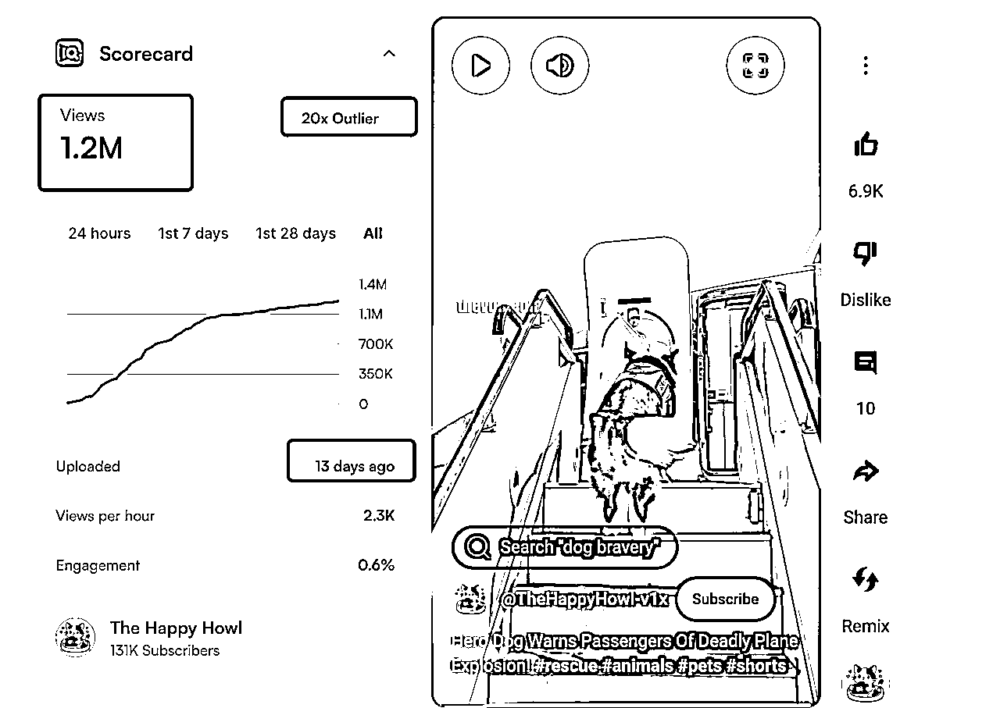

# Youtube中长视频中期复盘

> 来源：[https://ocn3v0tggugm.feishu.cn/docx/R62WdugCnoGLhBxQ9h8ckkG7njh](https://ocn3v0tggugm.feishu.cn/docx/R62WdugCnoGLhBxQ9h8ckkG7njh)

# 开始之前：


大家好，我是木辞，我从第一次youtube shorts航海时开始做youtube，后来加入深海圈，感谢深海圈两位教练方波妮教练跟gary教练。有不少圈友之前使用我的vps教程低成本开通了ypp，再给大家补一篇长视频相关的，给大家汇报下成果，我现在有YPP账号50+，做了不下上百个youtube账号，也算是对youtube有一些浅薄的理解，大部分账号给到了我的小伙伴来运营，我现在负责Youtube中长视频方向的研究，正好借亦仁大佬的龙珠悬赏来跟大家分享下，我把我用到的工具和方法做一个梳理。开始之前你要知道：youtube中长视频是一个长期项目，变现周期会偏长，你需要做的是：

*   充足的耐心 🕰️

*   正确赛道选择✅

*   快速调整的能力 🧐

*   善用AI工具 🤖

*   正确搭好每一块积木 🧱

*   一叶知秋🍂

*   只针对于8分钟以上的中长视频，8分钟以下的并不适用此规则。

### 1.要关注的数据，知道怎么做是对，有个衡量标准再下手：

youtube（油管）的推流逻辑跟国内不一样，他的流量池很大，谷歌也是全世界最大的广告商，他不缺流量也不吝啬流量，所以你的内容只要优质，油管会想办法给你的视频推流，我给到一个纯新号的截图，注册时间为6月20号，发布视频4，时效性在一周以内，有个初始标准供圈友参考。


：

• 观看时长（Watch Time）：用户在视频上的停留时间越长，推荐权重越高，是最核心的指标。


• 点击率（CTR）：封面和标题的吸引力决定了有多少人愿意点击视频。（2%–10%，低于2%就要考虑封面调整了，你可以直接换，也可以用油管的缩略图测试功能来印证，4-6%是一个前期偏合理的阈值判断）


youtube的算法更具备用户属性，你应该给他一些时间，让他知道你的视频更适合推荐给谁，长视频一般会在8-20天左右推流，下一步骤我会拆解一个频道。

### 2.对标的确定与搜集（快速发现爆款，和任意对标）

#### 1.vidiq（点击去装插件，免费的）:


这是一个老牌的youtube数据分析插件，提供了SEO优化，标题创作，灵感创作，我们使用它的免费功能即可，首先点击浏览器插件，安装（它的缩略图功能，如果不会做封面，后面会用得到）：


安装以后回到你的youtube，每个视频应该多了这些内容显示：


你能在每一次滑动屏幕快速发现爆款的视频，当然首页的推荐的内容取决于你的信息茧房，接下来我们说如何搜。

#### 2.关键字（直接提取关键词，疗愈赛道为例，长视频短视频通用）：


点击你想做的频道的首页，找到红框的位置，提取关键字，然后用这些关键字反复搜索，找到最新起来的账号（类似小红书的低粉爆款逻辑），例如我就找了这个 https://www.youtube.com/@HuedBibleStories/videos：


这个频道的观看量很大，往下看翻到底我们可以判断出来，这个账号换过赛道，并且新赛道在一个月快速起量：


我来解释一下这个数据，基本在8-10天左右才起量，所以长视频，需要的是耐心，他不会跟短的一样上来就推，池子不一样，给的钱也不一样，61天了还在推，而且这个视频每小时还有125的观看量在持续递增，这个频道的视频是很长的睡眠视频，理论上广告收益可以吃满，接下里我们将如何抄。（同样的短视频也可以用这个插件分析，只要去刷shorts就会在左侧给到显示，别光看量，看看他几天前发的）：



#### 3.判断（看看收益是否满意）：

我们可以通过 https://socialblade.com/查看收益，收益只有个大概范围：


以我的标准，是否收益可以达到千刀，是否可模板化，公式化，是否可长期，这种画面固定镜头和语音搭配对我而言是不二之选，这意味着我即使交给任何人来运营我也可以控制成品的质量，无论是谁来操作，结果都不可能会有大的偏差，也意味着，我可以构建程序，流水线操作，多快好省。这个睡眠疗愈赛道的rpm在9左右（看赛道，区间2-12一般），平均观看时长在30分钟，youtube 8分钟以上的视频可以无限插播广告，这种3小时以上长度的，都听睡着了，rpm略高，这个赛道我测试的数据如下：


### 3.拆解（逐字稿的详细拆解）：

1.  还以这个频道为例，你要知道他讲的什么，受众是哪些人，把视频的链接放在这里：https://www.youtube-transcript.io/ 你可以提取到完整的逐字稿，当然不嫌麻烦你也可以使用飞书转，把youtube视频地址栏里链接中的ube去掉再回车，你会发现新大陆。


1.  拷贝到你习惯的大语言模型中，我习惯使用gemini2.5pro，他的百万上下文，可以应付这种超长文稿的翻译，改写，润色，因为每个赛道都不同，受众也不一样，所以你要在这一板块中下功夫，让ai来分析它的构造，也就是在这一刻形成你自己的公式，

```
### 角色
你是一位专业的内容赛道分析师和营销策略专家，具备深度的用户心理学洞察和数据分析能力，擅长从多维度解构内容的商业价值和传播潜力。

### 任务
基于用户提供的剧本内容，进行全方位的赛道分析，包括内容结构、钩子设计、目标受众、风格定位等核心要素的深度剖析，并给出具体的优化建议。

### 要求

**1\. 结构分析**
- 开头钩子：分析前3-15秒的吸引力设计（悬念、冲突、反转等）
- 中段发展：梳理情节推进逻辑、节奏控制、情绪曲线
- 结尾收束：评估结局的满足感、记忆点、分享驱动力
- 总体架构：判断是否符合目标平台的最佳实践

**2\. 钩子深度解析**
- 情感钩子：识别触发的核心情绪（愤怒、同情、好奇、恐惧等）
- 认知钩子：分析引发的思考点（价值观冲突、社会议题、人性探讨等）
- 视觉钩子：评估画面呈现的冲击力和记忆度
- 社交钩子：判断内容的讨论性和传播潜力

**3\. 受众画像分析**
- 核心受众：年龄段、性别比例、兴趣标签、消费习惯
- 心理需求：内容满足的深层心理需求（认同感、释放压力、学习成长等）
- 观看场景：预测主要观看时间、地点、设备
- 互动倾向：点赞、评论、分享、收藏的可能性分析

**4\. 风格定位**
- 叙事风格：第一人称/第三人称、严肃/轻松、纪实/戏剧化
- 语言特色：用词习惯、句式节奏、口语化程度
- 情感基调：整体情绪色彩和能量级别
- 差异化特征：与同类内容的区别点

**5\. 赛道竞争力评估**
- 市场饱和度：该类型内容的竞争激烈程度
- 创新点识别：内容的独特价值和差异化优势
- 商业潜力：变现可能性和商业模式适配度
- 风险评估：可能面临的平台限制或争议风险

**6\. 优化建议**
- 结构优化：具体的情节调整建议
- 钩子强化：开头和关键转折点的改进方案
- 受众扩展：如何吸引更广泛的目标群体
- 风格升级：提升内容质感和专业度的建议

**输出格式要求：**
- 使用清晰的分级标题组织内容
- 每个分析点都要有具体的例证和数据支撑
- 给出1-5分的评分和详细理由
- 提供3-5个可执行的改进建议
- 预测内容在目标平台的表现潜力

**示例模板：**
```
## 📊 赛道分析报告

### 🎯 内容概览
[剧本核心要素总结]

### 🏗️ 结构分析 (评分: X/5)
**开头钩子：** [具体分析]
**中段发展：** [具体分析] 
**结尾收束：** [具体分析]

### 🎪 钩子解析 (评分: X/5)
**情感钩子：** [触发的核心情绪]
**认知钩子：** [引发的思考点]
**传播潜力：** [社交分享驱动力]

### 👥 受众画像 (匹配度: X/5)
**核心受众：** [详细画像]
**心理需求：** [深层需求分析]
**观看场景：** [使用场景预测]

### 🎨 风格定位 (独特性: X/5)
**叙事风格：** [风格特征]
**差异化：** [与竞品区别]

### 💡 优化建议
1\. [具体建议1]
2\. [具体建议2]
3\. [具体建议3]

### 📈 商业潜力预测
[市场表现预期和变现建议]
```

**要求用户输入需要分析的剧本内容：**
```


你想细化的的东西都可以通过这个模版梳理的问题跟ai一步一步沟通，解说类故事类的基本都如此，一叶知秋。

### 4.如何做：

做长视频，你遇到的第一个麻烦就是，语音，长文本的语音商用的很多都限制在5000字符，你如果想输出这么长的音频内容，一般在五万字符以上，有两种方法，一是一段一段拼，二是去看我之前的帖子https://scys.com/articleDetail/xq_topic/2852482418851551，这段不再赘述。

画面：这个大家都很擅长了，市面上的工具有很多，无论是哪一个都可以满足你的需求，实在做不出来，图生图总会吧？

### 5.点击率（封面+标题）：

长视频的点击率：封面>标题>内容>描述,

举例：


youtube长视频的推送跟短的不一样，短的用户无法选择下一个shorts的内容（非指定频道下），他是瀑布流，预缓存机制，而长的一页最多展示6个（以首页来源为例），是需要你人为选择点击的，如果你封面不够吸引人，就不会产生点击观看，做自媒体就是对心理的洞察，人都是惰性的，大部分人第一眼一定是看图，才会去看标题，标题更大的作用是检索，当然搜索也是很大一部分流量的来源。

点击率取决于推送的人群是否精准，取决于你的封面是否吸引人，取决于标题是否能被热门检索，也就是SEO优化，当下的热点一定是搜索最多的，封面不会制作可以使用vidiq，它的好处就是可以直接给对标的视频链接，他会自动做同样风格的缩略图，如果你自己并不太会的话，使用vidiq是绑定自己的账号，你上传视频时，他会给你的标题，缩略图，都打上分，分数低了可以换，他的大部分功能都是免费的但是有使用次数限制，当然你也可以不接受他的建议，毕竟AI只是工具，一张好看的图低过一堆无用的描述，逐渐找到手感，凝练出来适合自己的爆款公式，AI出来的图避免不了抽图，所以我更喜欢的方式是使用canva等工具一步到位。


### 6.发布频率

经常听到你们说一个词，权重。什么叫权重？你我并不熟识，你在我这就没有权重，算法依据于规则，如何建立信任？保持固定发布频率，稳定更新，建立信任度，我参考了大量一月内起量的频道发现规律是，基本频道发出去前几条十几天都是个播，平均20天左右会有一次大的推流，前提你的内容质量是达标的，坚持才有意义。


至于发布频率，与其去猜，你不如直接看：

https://socialblade.com/youtube/channel/UCAbCCD_eZQfwktW7FLp1dMQ


你不仅发现了他的发布频率，而且你还发现了他还隐藏掉了一些数据不好的视频。