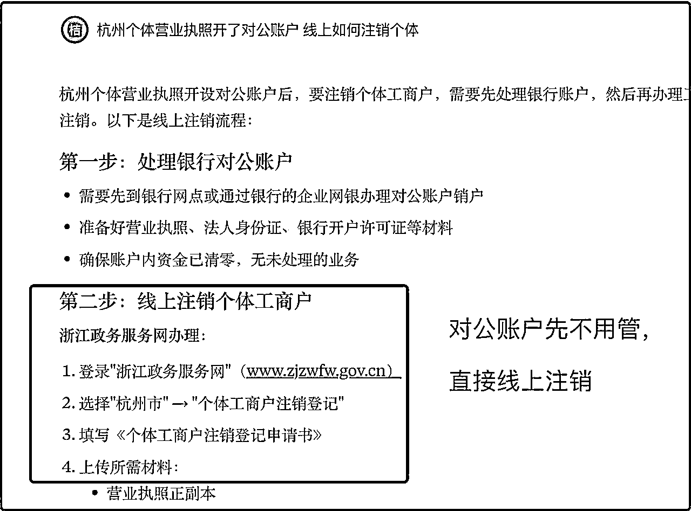
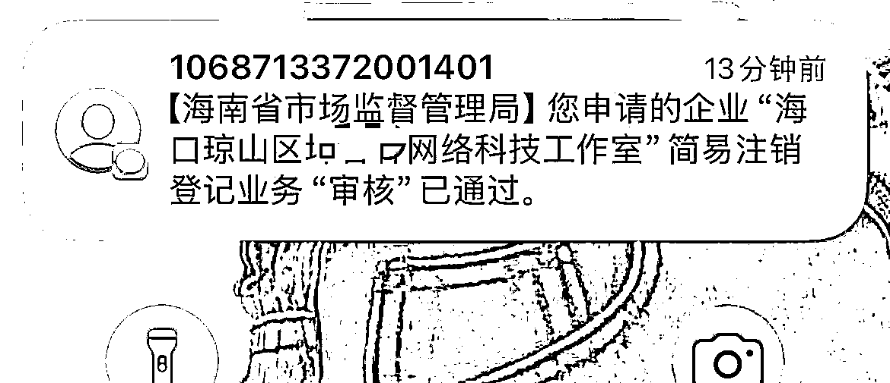
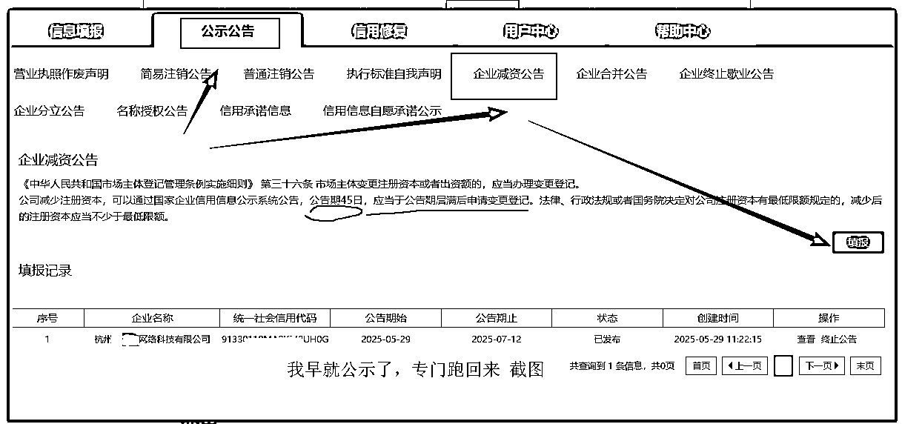
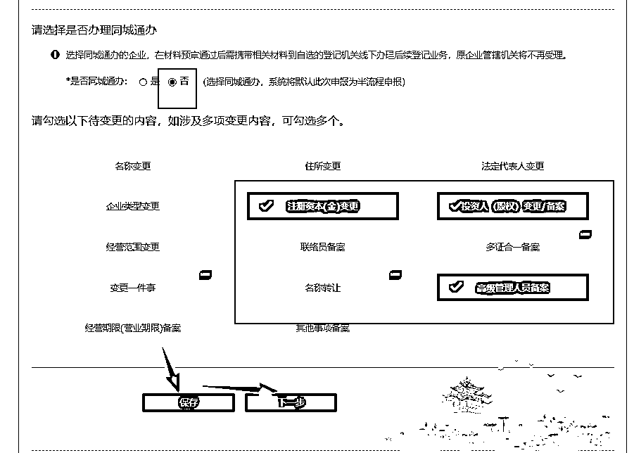
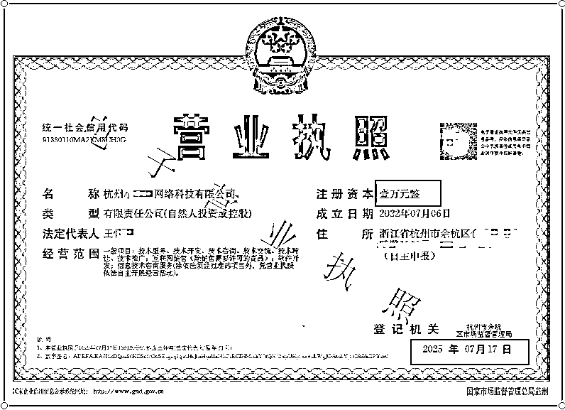

# 开了对公账户的个体/公司营业执照0成本注销+公司减资完整流程 攻略

> 来源：[https://q369eg2asg.feishu.cn/docx/WNcFdemLloEDKxxN0vYcVEncnCg](https://q369eg2asg.feishu.cn/docx/WNcFdemLloEDKxxN0vYcVEncnCg)

个体营业执照注销，最低要500 ？ 公司最低要1500 ？土豪老板不用看，今天完整讲解如何0成本注销已经开了对公账户的个体/公司营业执照+公司减资完整流程。

我知道这篇揭秘文章会对各位财务公司圈友（帮别人代注销 代减资）造成一定损失，但是我还是得写出来，在星球，就不应该有信息差。

# 👉公司减资完整流程（纯线上办理，不分区域）点我直达

# 前言

今年1月底，要注销个体与公司时，我就在星球专门搜索 个体注销 公司注销 执照注销等

但是除了代注销广告外，我没有获得任何注销指导全流程的帖子（可能我太弱，没搜到核心词）

我那时候就暗暗发誓，我必须自己全程跑出结果，然后写个和我一样的新手看了就能自己去操作注销的帖子，省下一笔钱。

时隔几个月，我的2个执照都已经注销成功，我有资格写了！

## 一，我曾经花1500注销了公司营业执照（我是大冤种）

我第一个公司是2020年办理与开对公，为了可以批量注册50个公众号（需要时间，累计近半年），找的杭州比较大的财务公司0办理+付费代记账，2年后，我觉得不需要了，想注销，咨询了要1500，于是就让他们代注销了

信息茧房

注意：我当时根本没有意识到，其实个人是可以自己去注销的，根本不需要别人来代劳（土豪或不在本城市 不方便过去的除外）（没想过 也没人告诉我）

## 二，新办的个体与人力资源公司营业执照需要注销

因为业务需要，我办了杭州的个体执照与杭州的人力资源公司执照。

其一，这个杭州个体，开了对公账户，开过发票，交过社保 后来转移到我其他公司了。

其二，这个杭州人力资源公司，开了对公账户，有人力资源资质

今年2025年2月份，因为业务探索失败，执照挂靠地址又需要续费了（好多钱）这2个执照用不到了，都需要注销，如果是你，你是不是和我一样，觉得自己的执照有过那么多东西（对公 发票 社保）存在，只会找财务代注销？

没错，这就是我当时的想法。

### 注销价格

我咨询了公司与个人，这是分别的报价，2个加起来最低2000，（我第一次公司注销1500，所以这次报价我也能接受）但是，我当时时间比较空，突然灵光一闪，我为什么不自己去注销？？？！！！

PS：当你想不到或无人告诉你的时候，这就是信息差

于是我直接先ai查询，然后小红书查询【杭州个体开了对公账户如何注销】【杭州人力资源公司执照怎么注销】之类的，然后尝试了下，只花了自己的路费就搞定了（相当于省了至少2000💰）

### 具体怎么做

时间太久了，有些和ds的聊天内容找不到了，我的方式就是先问ai，再查小红书或抖音，相互印证，还有疑问就打对应区域的工商类如市民之家的电话

👆🏻以上这些都是2月份不懂测试的我操作的，现在看了帖子的不用重视这些啦 看下面

·

浙江政务服务网 https://www.zjzwfw.gov.cn/zjservice-fe/#/home （其他城市的伙伴，问ai你们城市的）

记住，想注销的伙伴，先去线上体验流程，你写错了 填错了没关系，会有专门审核辅助你的人，给你驳回提交，并告诉你哪里有问题，且你看不懂，可以直接打对方电话。（全程你不用咨询任何一个做财务 懂财务的人）

我的个体，线上提交一次，遇到 清税证明 问题

跑去钱塘区那边税务局，服务人员帮我一次搞定，全程我只负责签字~

回家等提交注销的网站上更新了信息，再提交一次搞定（提交后 公示20天）

也就是个体注销提交公示后，20天就注销了。

我的人力资源公司 ，线上提交一次，简易注销，公示20天后，因为地址异常（没续费），所以只能走 一般注销（公示45天）去了2次临平区的市民之家（主要是税务问题和改一般注销） 搞定。

PS：税务区有几个辅助工作人员，说是解答辅助，其实全程帮我们操作，

我问：代注销的人会操作流程吗？

对方：哪里会，都是我们操作的，

明白了吧，代注销，只是跑腿（税务有问题，必须到现场解决），适合土豪老板和其他地方的执照（自己过去不划算）

因为都注销了，浙江政务网也登录不了了，所以没法截图相关的情况了，真的不用担心，直接干，按照我说的流程走就行，只要你提交了线上，就会有人审核指导你，所以，你不用去咨询任何人。

只要你要注销，不管你的个体 或公司因为有啥问题（地址过期 执照异常 税务异常等等），直接先线上提交，专业的人来辅助我们。要不然你去问财务或代注销公司，他们都会说，这个问题比较严重，注销要加钱，，，之类的，不信你去问 哈哈

前几天回来路上和2个小伙伴聊起了这事，没想到他俩都不知道自己可以注销个体/公司的事，都以为得财务公司代注销，所以，我这2天赶紧写出文章，希望帮助更多像我一样资金比较薄弱的伙伴，把钱花在项目上不香吗？

PS：已经写的很详细，不用专门找我咨询 哈哈 感觉对自己有用的伙伴 点个赞吧~

# 增加个体注销实操，新鲜的

我的杭州个体/公司都注销了，还有一个杭州的公司目前在减资，无法演示注销，我用一个之前网上办的几十块的海南省海口的个体来注销，今天是7月15日

## 1、先问ai

## 2、登陆

## 3、我选择电子营业执照 登陆

## 4、在线办理

最上面搜索框 搜索 我要办企业注销

## 5、我的区域-海口

## 6、在线办理

## 7、开始

## 8、基本信息

## 9、银行信息采集

## 10、证照并销

## 11、上传资料

## 12、电子签证

## 13、提交

我从来没有提交过海南个体注销，我也是第一次，刚刚找ai才知道的海南执照注销的网站。

整个过程我就花了10多分钟吧，不用怕自己提交信息对不对，会有审核人员给你反馈的，哪里需要调整再去调整就行，主要是大胆的去做。

其他地方的伙伴，和我一样，去ai搜索当地的网站，然后操作就行，各个地方注销流程都是差不了太多~

## 14、注销成功

昨天晚上提交注销，今天上午就注销通过了，想登陆看看直接显示失效了（这个是网上的普通个体，没有开对公账号）

刚被注销，是查不到的，我们可以3-7天后去查询

微信小程序: 企查查（免费）或

国家企业信用信息公示系统 https://shiming.gsxt.gov.cn/ （这个我的谷歌浏览器查询不了，能进去不刷新，我用的其他浏览器查的）

# 注意！其他城市的圈友看下图

不要只参考ai的答案，毕竟ai给不了我们图片流程

~~~~~~~~~~~~~~~~~~~~~~~~~~~

# 🔥公司减资完整流程，最低省 500～1000

公司减资有多重要，应该都知道，因为现在公司需要实缴，所以之前办理时写的50万 100万 大部分人拿不出来的，如果以后会注销，那不用减，长期用，必须减资，要不然5年后就得实缴到公司账户。

## 普通公司最低可以减到多少？

普通公司最低可以减到多少？

例如我的公司作用主要给我和我家人交社保，对公账号只是给我家人发流水工资，没有其他入账，这种普通公司最低可以减到多少呢？

👇这是我直接电话咨询审核员的，

我：普通公司最低可以减资到多少，

对方：正常以 万为单位（也就是最低 1 万），

我：我看到有财务公司说可以 1000

对方：不建议太低，因为减资要审核的，过低会查公司情况

我：我的公司需求只是交社保

对方：（忘了原话了，大概意思就是不要 1000，最起码 2000-3000起）

总结：类似我这种纯线上无实际运营公司，可以往低了减资，但是不太差钱，直接减到 1万最保险，因为减资公告就要 45 天，减资金额要和减资公告匹配。也就是如果驳回，你要重新提交减资公告，再花 45 天。

## 公司减资的报价

这我这边咨询过的，代账+减资一起最低500-1000 （一年代记账一般 1500-2000 不等 根据地区与公司大小不同）

也就是我们自己减资，起码赚了 500-1000 （省钱就是赚钱）

PS：减资变更里面 我发现，变更后，只需要5年内缴清就可以，那么大资金量的公司，是否可以分次减资变更呢？ 这个我不清楚，自己测或者问财务公司或问官网客服。

我的公司是杭州的，所以演示流程是浙江省的，其他地方都是类似的，没啥区别

减资完全纯线上操作，不需要线下，各个省份的伙伴，人人都可以自己操作

# 一.先公示

国家企业公示系统https://www.gsxt.gov.cn/index.html

## 1、登陆

## 2、选 公司执照所在省份

## 3、公示公告-企业减资公告

## 4、再扫码登陆

## 5、继续扫

## 6、我是临时办事人

## 7、公示公告-企业减资公告

## 8、填报 公示，比较简单，我就不填了

下面是45天公示后的操作截图

未公示结束，不用管下面

# 二，变更

## 登陆

用 电子营业执照 小程序（我用的微信），扫码登陆你要变更的公司，点击-我要变更备案，然后填信息到

1.资料填报-变更事项

# 三，资料填报

## 1.变更事项

## 2.基本信息

## 3.投资人

## 4.董事监事经理

## 5.代理人

## 6.申报材料信息完善

## 7.提交资料

## 8.等审核

我的第一次提交 失败，就是为了看哪里有问题

中午提交，下午就审核了

哪里有问题，说的清清楚楚，你还可以去直接电话咨询沟通，其实上面的图文流程，就是我修改后最正确的截图的、

又审核了，漏了一些时间设置，且也增加了新的需要填写的，重新写。

我上面图文流程发的是标准多次修改后的完整版，你们根据我的修改就没啥问题，提交后驳回也没关系~再次修改就行

## 9.通过审核

## 10.电子签名

## 11.电子签名情况

## 12.法人，个人身份登陆网站才能签名

另外1个签名要在手机上，杭州这边是 浙里办 ，我家人不在浙江，下载后 也能签名

## 13.原营业执照正副本原件寄回或由经办人送到办事点

## 14.流程结束~

把执照寄过去，到达后，再打电话提醒已经寄到。到这里就代表减资成功了，等待新的执照获取即可。

## 15.执照更新，注册资金已经变更

我的营业执照的那点事，都说完了，应该还比较详细吧，对自己有帮助/有启发的伙伴 帖子点赞支持 下～大家也踊跃分享自己的擅长点，信息差永远都有哦～能帮助几万圈友，是多么快乐的事～