# 从熬夜调Bug到3个月4款App，我用AI编程踩过的坑都在这了

> 来源：[https://chaojifeng.feishu.cn/docx/XLksdmemAoxjO8xhDOhcw8NPnCe](https://chaojifeng.feishu.cn/docx/XLksdmemAoxjO8xhDOhcw8NPnCe)

记得那天晚上，我在调试一个诡异的Bug。鸭霸单词App有个功能，从单词书列表进入播放页面，就这么简单的操作，偏偏在某些情况下会崩溃。

最要命的是，项目里已经有近百个文件了，各种组件互相调用，AI生成的代码分散在各个角落，找问题像大海捞针。我开始怀疑人生——之前 Vibe Coding"一天开发一个App"的爽感呢？怎么现在调个Bug要熬三个通宵？那是我的至暗时刻...

鸭霸单词从1月上线到3月底，看起来时间不短，但其实只迭代了2个版本。就这2个版本，让我彻底明白了——AI编程真不是什么魔法棒。项目从十几个文件变成近百个，功能越来越复杂，用户从0到几千，每一步都是新挑战。

所以问题来了，当随着产品迭代，越来越多的需求，带来的越来越多的代码与文件，当项目越来越复杂后，怎么让AI编程能够持续稳定发挥出强大的力量，并且能够让我们作为创造者更具有对项目的掌控能力。

接下来，我将分享给各位创造者的一场关于复杂项目 AI 编程 Vibe Coding 的探索与实践经验，希望对大家有所启发。


## 一、一次讨论引发的思考

说起这次分享，还得从互助群里的一次讨论说起。那天群里有位创造者说："看了那么多AI编程的分享，怎么都是些'5分钟搞定'、'一句话生成'的案例？真实项目哪有那么简单！"

这句话瞬间引起了大家的共鸣。对啊，真要开发一个能上架、要维护、要迭代的产品，问题多了去了。

这才有了本次分享主题的想法。我是超级峰，过去 3-4 个月，我用AI编程陆续开发了4款iOS App：芝士相机、鸭霸单词、小圆角、小猫快读。这个过程让我从一个AI编程的狂热信徒，变成了一个更理性的实践者。

今天分享的内容，不是教你怎么一句话生成App，而是想跟大家聊聊，当项目变得复杂之后，我们该怎么继续用好AI这个工具。

我将从如下四大主题为大家进行整体的分享，涵盖从基于 AI 驱动的研发流程到 AI 编程的深度使用技巧，帮助各位创造者真正地掌握基于AI 编程的复杂项目的管理能力：

1.  基于AI驱动的素材设计工作流

1.  离线数据存储的坑与解

1.  组件化思维拯救AI编程

1.  让AI编程效率翻倍的小窍门

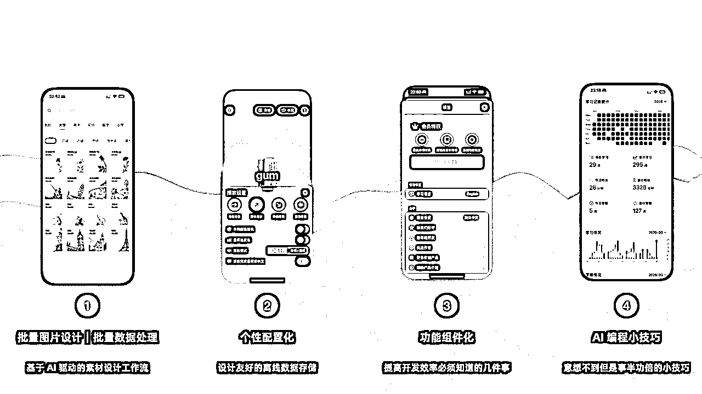

## 二、基于AI驱动的素材设计工作流

### 2.1 探索批量生成相同风格化图片的创作方法

还记得当时为鸭霸单词设计UI素材时，我面临一个很现实的问题：作为一个独立开发者，我既没有设计师朋友，也不想花大价钱外包。但一个背单词App，总不能光秃秃的只有文字吧？

这时候我想到了AI绘图。但新的问题又来了：怎么保证生成的图片风格统一？经过一番探索，我找到了Recraft这个工具。其实之前群里也有小伙伴分享过，它最大的特点是支持自定义风格，操作起来特别简单：

1.  创建风格模板：我先在小红书上找了一套我喜欢的插画风格（citypop 风格），上传几张作为参考

1.  批量生成：用同一个风格模板，改变提示词就能生成不同的图片

1.  保持一致性：比如"打棒球的小朋友"、"拔河的小朋友"，只需要改变动作描述

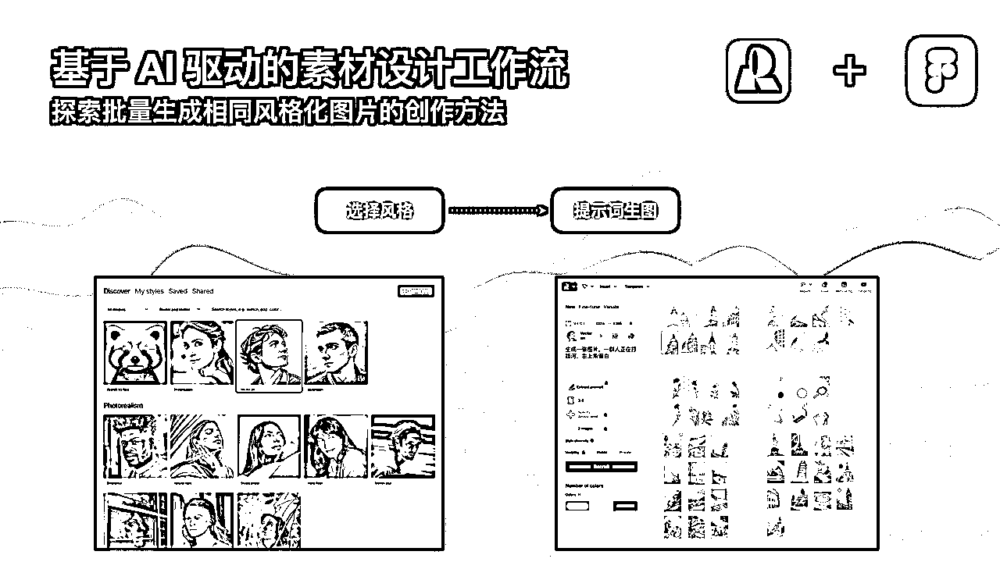

整个过程大概是这样的：

*   选择或创建风格（我用的是自定义的 citypop 风格）

*   输入简单的提示词（20-30个字就够了）

*   设置图片比例（比如banner图用16:9）

*   点击生成，30秒内出图

但光有素材还不够，还需要加上文字做成完整的卡片。这时候我用Figma来做二次排版：

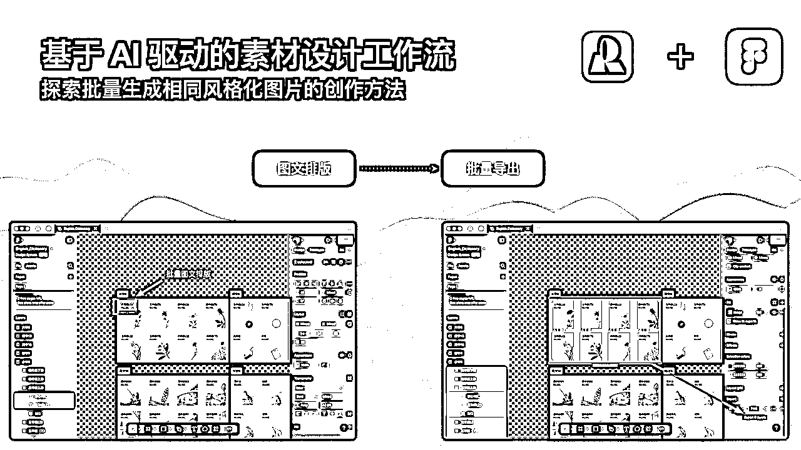

Figma的好处是可以批量操作：

*   把生成的图片拖进去，调整好第一张的排版

*   直接复制，只改文字内容

*   最后批量导出，一次性生成所有卡片

这套工作流让我在没有设计背景的情况下，也能快速产出风格统一的UI素材。整个过程AI负责创意生成，我只需要做简单的排版调整。

### 2.2 批量数据处理的完整链路

说完了"面子"，再来说说"里子"——数据处理。鸭霸单词最初只支持用户自己添加单词，但很快就有用户反馈：能不能直接导入四六级单词书？听起来简单，做起来才发现坑不少。

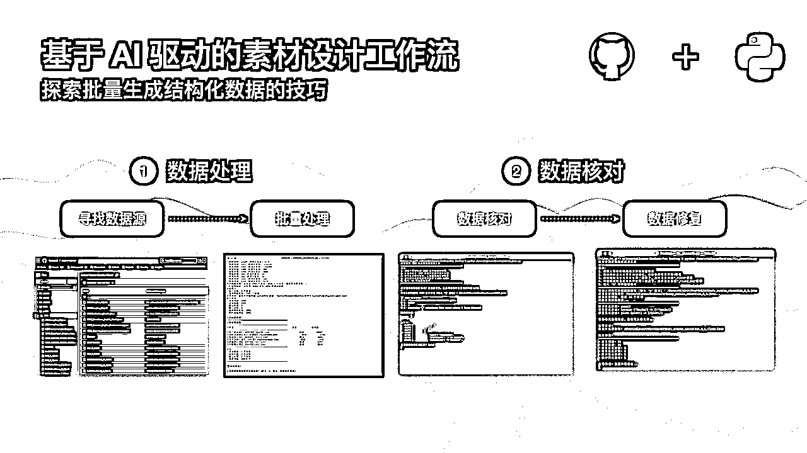

数据源倒是好找。我在GitHub上找到了一个开源的单词书项目，里面有各种考试的词汇数据。但问题来了：数据格式完全不匹配。人家的格式是这样的：

```
{
  "word": "abandon",
  "phonetic": "/əˈbændən/",
  "translation": "v. 放弃；抛弃"
}
```

而我需要的格式是这样的（多了好几个字段）：

```
{
  "word": "abandon",
  "phonetic_us": "/əˈbændən/",
  "phonetic_uk": "/əˈbændən/",
  "translation": "放弃；抛弃",
  "word_type": "verb",
  "difficulty": 3
}
```

面对12197个单词的数据转换，手工是不可能的。我让AI帮我写了一套Python脚本，分三步走：

#### 第一步：数据转换（示例）

```
# AI生成的转换脚本核心逻辑
def convert_word_data(old_data):
    new_data = {
        "word": old_data["word"],
        "phonetic_us": old_data.get("phonetic", ""),
        "phonetic_uk": old_data.get("phonetic", ""),
        "translation": clean_translation(old_data["translation"]),
        "word_type": extract_word_type(old_data["translation"]),
        "difficulty": calculate_difficulty(old_data["word"])
    }
    return new_data
```

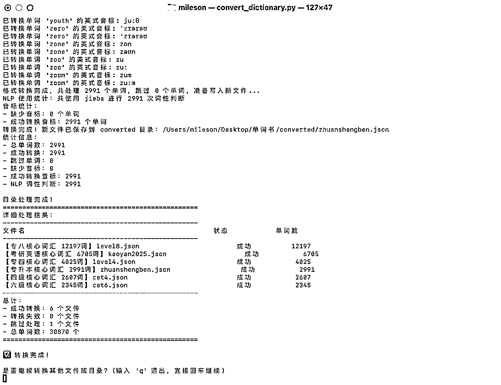

跑完之后，我发现了新问题：有些单词没有音标，有些词性识别错了。

#### 第二步：数据校验（示例）

```
# 检查JSON格式是否正确
def validate_json_format(file_path):
    errors = []
    with open(file_path, 'r') as f:
        data = json.load(f)
        for i, item in enumerate(data):
            if not item.get("phonetic_us"):
                errors.append(f"Line {i}: 缺少美式音标")
            # ... 其他校验逻辑
    return errors
```

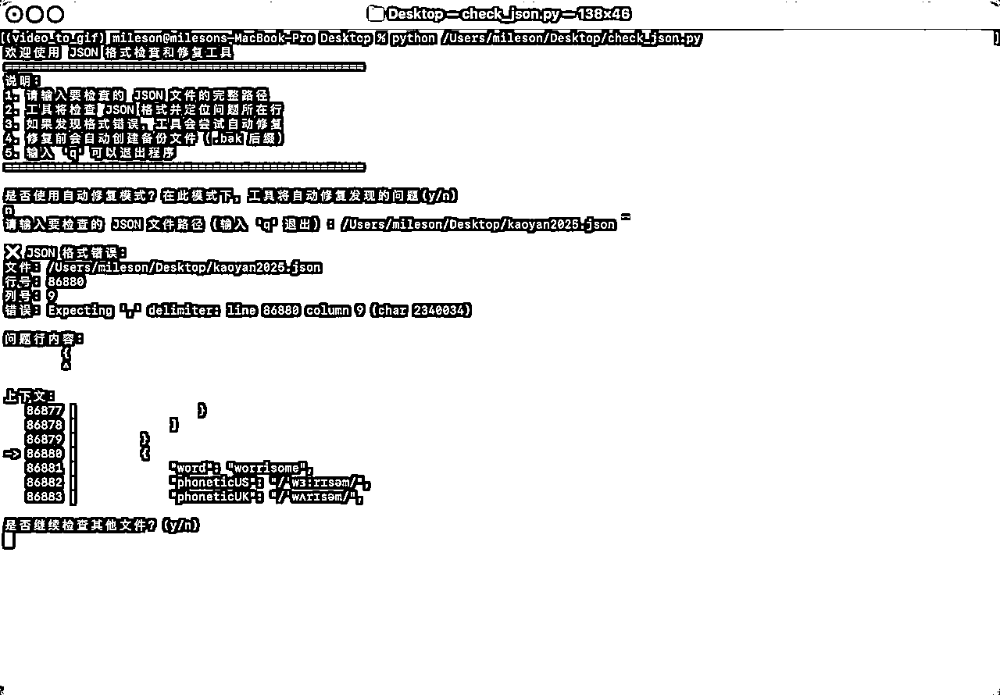

这个脚本帮我找出了所有格式问题，比如第8万6880行少了个逗号（这种细节错误人工根本发现不了）。

#### 第三步：数据修复（示例）

```
# 自动修复常见问题
def fix_phonetic_format(phonetic):
    # 统一音标格式，确保左右都是斜杠
    if phonetic and not phonetic.startswith('/'):
        phonetic = '/' + phonetic
    if phonetic and not phonetic.endswith('/'):
        phonetic = phonetic + '/'
    return phonetic
```

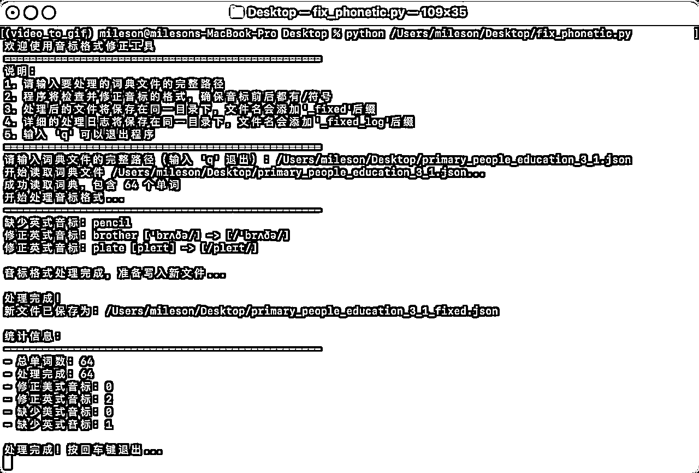

整个过程下来，累计 121975个单词，0数据丢失，格式100%统一。这个经验告诉我：AI编程不是让你完全不懂技术，而是让你能快速实现那些重复性的技术工作。

## 三、离线数据存储的坑与解

说到踩坑，就不得不提离线数据存储这个话题。还记得我的第一个App芝士相机，当时AI给我推荐用UserDefaults存储拍照模板。刚开始没问题，后来用户越来越多，模板越来越多，突然有一天——存不下了！

原来UserDefaults是有大小限制的，只能存1MB左右的数据。而且最要命的是，它不支持iCloud同步。用户换了手机，所有模板都没了。当时用户反馈可把我愁坏了。

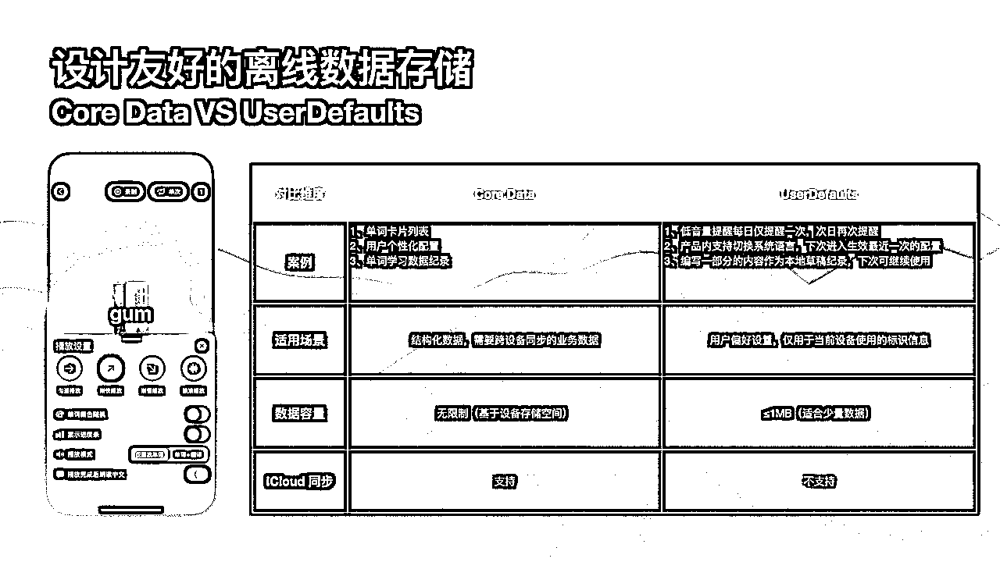

后来开发鸭霸单词时，我学聪明了，先问清楚iOS有哪些数据存储方案：

| CoreData | UserDefaults |
| 支持大量结构化数据 | 只能存储少量数据（<1MB） |

在鸭霸单词里，我是这样分配的：

*   单词卡片、学习记录 → 用CoreData（需要同步）

*   音量设置、界面语言 → 用UserDefaults（本地配置）

这个经验告诉我：用AI编程不代表可以完全不懂技术概念。你不需要知道CoreData的底层实现，但至少要知道它能干什么、适合什么场景。

## 四、组件化思维拯救AI编程

让我用一个简单的例子说明什么是组件化。假设微信要实现支付功能，有这些场景：

*   发红包要支付

*   转账要支付

*   小程序购物要支付

如果每个地方都写一遍支付代码，那改一个地方就得改三个地方，AI也会懵。所以聪明的做法是：把支付功能做成一个组件，需要的地方调用就行。

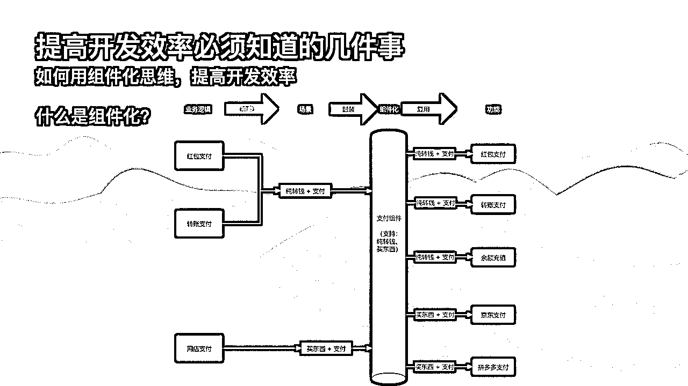

在鸭霸单词的开发中，我逐渐形成了自己的组件化体系：

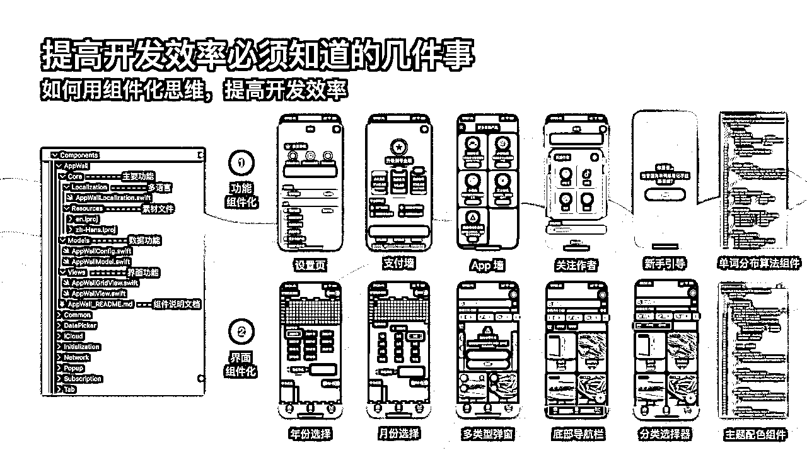

功能组件化：

*   设置页组件：包含会员入口、好评引导、关于作者等

*   支付墙组件：订阅逻辑、价格展示、购买流程

*   App墙组件：推广其他作品的入口

界面组件化：

*   弹窗组件：统一的弹窗样式和动画

*   导航栏组件：自定义的顶部导航

*   主题配色组件：全局的颜色管理

每个组件都有固定的结构（示例）：

```
Components/
  └── AppWall/
      ├── AppWallView.swift      (主功能文件)
      ├── Resources/             (多语言等资源)
      ├── Models/                (数据模型)
      └── README.md              (组件说明文档)
```

最关键的是那个README.md，这是专门写给AI看的使用说明：

```
App墙组件使用说明

功能描述
展示开发者的其他作品，支持跳转App Store或其他平台

使用方法
将整个AppWall文件夹复制到项目中
在需要的地方import AppWall
调用 AppWallView() 即可

可配置项
apps: 要展示的App列表
columns: 每行显示几个App
spacing: 间距设置
```

有了这个说明，当我在新项目中要用这个组件时，只需要：

1\. 把文件夹复制过去

2\. 让AI看一下README

3\. 告诉AI："帮我在设置页面里加入App墙功能"

AI就能准确地完成集成工作，不会出现"重新发明轮子"的情况。

组件化带来的好处太明显了：

*   开发新App时，常用功能直接复用

*   修改一处，所有项目同步更新

*   AI的工作变简单了，出错率降低

实际上，这些组件在我的四款App中都在发挥作用。比如App墙组件，我只要做一次之后的话，我后续把这个导流的入口就能够常驻放到里面去。这个组件跟项目本身都没关系，我在所有的App里面，不管什么样的业务，肯定都可以放进去。

还有一个很重要的点是算法组件。我所有开发的App这四款App都有用到独立可配置的算法逻辑，这也是推荐大家去用iOS去做AI编程的一个好处。

iOS里面很多算法AI都能挖掘出来，我将挖掘出来的这些算法结合业务的能力，形成了一个单独的算法组件。这可能就是一个文件，输入是什么，输出是什么，中间所有逻辑都在这个文件里面自己处理，我们不需要知道里面是怎样的，更关注输入的内容是否可行（如图片）、输出的结果是否符合预期（如抠图的图片效果）。

对于开发了多款产品的创造者来说，我们似乎总面临一个难题：开发了很多代码，但是你后面要再持续的迭代，二次优化的过程中，你会面临很难的一个问题就是，同一个功能，在不同产品上通过 AI 编程实现了多套不同的逻辑。但是，当你想要更改的时候，那真的是工程量浩大，因为每个产品都需要微调，标准也都不一样。

但是组件化提供了一种统一的规范，我们只需要在组件逻辑里面调整，后续一键复制粘贴到其他产品代码文件夹内，即可生效更新，这让多款产品的开发的 AI 编程体验也能得到极大的提升，一次编程，到处应用。

所以组件化的本质是什么？就是在AI编程的过程中，你要多说几句话：“你帮我开发个支付功能，尽量能够抽象成一个组件，能写成一个组件，然后我希望后面在其他项目上能够用得上。”就多这么几句话的话，能够让AI更好的去帮你把这个事情做的更扎实一些。

## 五、让AI编程效率翻倍的小窍门

分享三个我常用的小技巧，都是在实践中总结出来的：

### 技巧一：一句话生成测试数据

开发图表功能时，我需要大量数据来测试显示效果。与其手动造数据，不如让AI帮忙：

"生成一组学习记录的模拟数据，要有层次感，数据看起来真实"

AI立马给我生成了几十条数据，有高有低，有规律的波动，截图效果特别好。

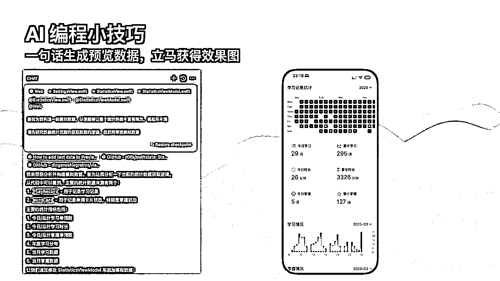

### 技巧二：图片标注中文，AI也能懂

这个发现纯属意外。有次我懒得打字描述，直接在截图上用中文标注：

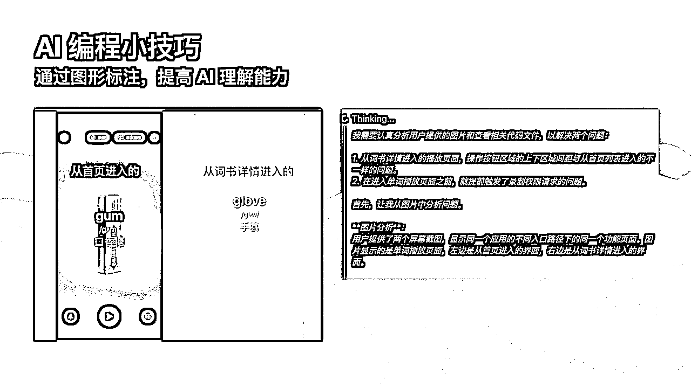

没想到AI真的看懂了！它在回复中准确地理解了不同的进入路径。原来AI的中文识别能力比我想象的强得多。

### 技巧三：用流程图梳理复杂逻辑

还记得开头提到的那个Bug吗？我是这样解决的：

我让AI帮我把整个功能的调用逻辑画成流程图（使用Mermaid语法）。一次不够就画多次，不断追问："还有其他调用路径吗？"直到AI说"已经相当完善了"。

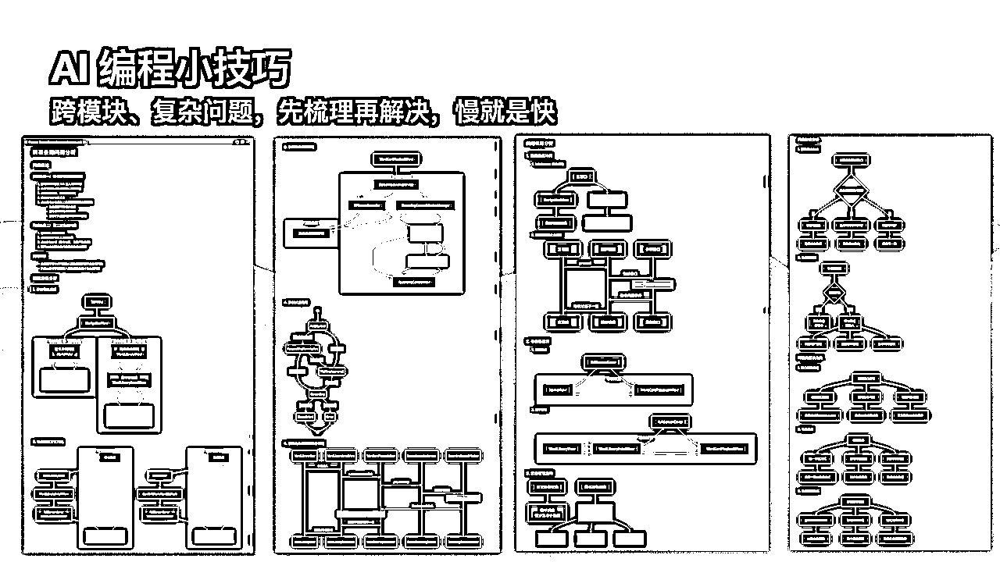

有了完整的流程图，Bug原因一目了然。这不是给我们看的，是给 AI 看的，最后，我们只需要提供这个文档给 AI，AI 就能发现原来是两个组件在特定情况下会循环调用，一次性就把复杂的这个问题解决掉了！

## 六、AI编程的半自动驾驶时代

经过这几个月的实践，我对AI编程有了新的认识。

AI编程不是全自动驾驶，而是半自动驾驶。就像特斯拉的辅助驾驶系统，大部分时候它能帮你开，但你的手不能完全离开方向盘。

在鸭霸单词的开发过程中：

*   AI帮我写了大量的代码，但架构设计还是要自己把关

*   AI能快速实现功能，但组件化的规划需要人来思考

*   AI解决了80%的问题，剩下20%的疑难杂症还得靠经验

组件化思维是AI编程时代的核心竞争力。当你的组件库越来越丰富，开发效率会呈指数级提升。下一个App，可能真的只需要1天就能完成，因为80%的功能都是现成的。

记住，AI编程的未来不在于取代程序员，而在于让更多人能够实现自己的产品想法。就像我，3个月前还在为技术门槛发愁，现在已经有4款App在App Store上架了。

* * *

学习 AI 编程，人人都能成为创造者，期待与你一起探索 AI 的可能。

如果你也想开始AI编程之旅，或者在实践中遇到了问题，欢迎在评论区交流。关注我，下次分享更多AI编程的实战经验。