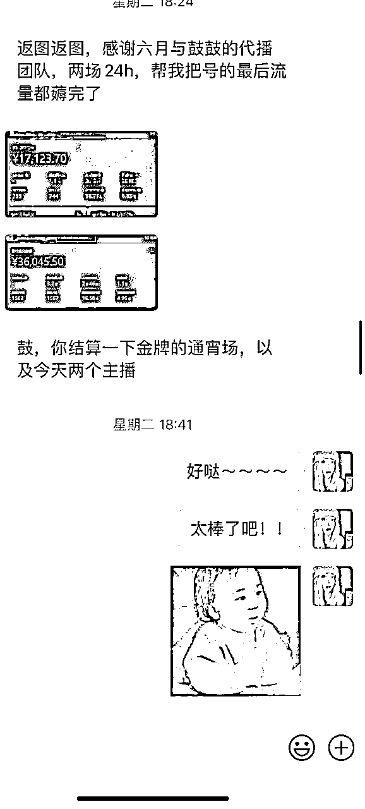
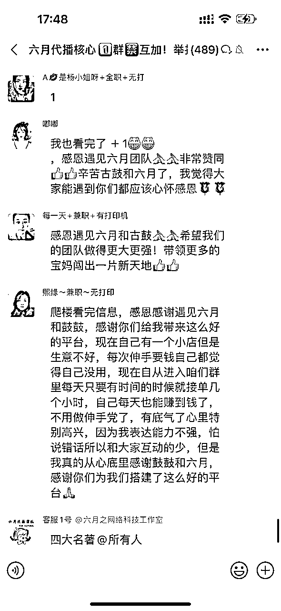

# 没资源没人脉的我，如何利用杠杆思维成立代播团队？

> 来源：[https://lcnh2gljpmkd.feishu.cn/docx/JI81dd7DWoCG9wx53wmc0aXSnef](https://lcnh2gljpmkd.feishu.cn/docx/JI81dd7DWoCG9wx53wmc0aXSnef)

大家好～我是元古鼓。很多人问过我：没资源没人脉，我是怎么做到把代播事业越做越大的？代播这一行，离不来主播，更离不开客户，我又是怎么做到既集结了那么多主播，又一直有客户资源的呢？

说实话，我靠的就是杠杆思维。

# 起步阶段：自己招20块钱一小时的主播开局

在做代播前我自己就是做视频号带货的，每天搬运混剪视频，视频爆了后引流到直播间让主播转化。当时我们还用上了各种黑科技去拿流量，比如卡特效，十连怼之类的，但是这种玩法有个致命问题——号爆完就被平台监测，账号违规就没流量了，极其费号。

要想赚米，就得大量堆号。

大量堆号意味着需要很多主播同时开播承接流量，不然流量跑完了就很可惜。那时候我们自己根本播不过来，当时也还没开通过Boss直聘，我每天在各大兼职群发招聘，请兼职主播过来对着稿子念，20块一小时。

# 第一个转机：认识宝妈头子，学会借力

转机来了。

在一个视频号社群里，我认识了一个宝妈头子。她手上有大量宝妈资源，可以提供账号，视频爆了还能让宝妈本人开播。于是我就这么顺其自然的和她形成了分成合作模式，合作以后我负责专心选品、大量铺素材，省去了很多找主播的精力成本。她负责安排主播为我承接流量。

合作以后我懂得了创业的第一个道理，人如果想要赚更多的钱，一定要学会借力，学会分钱。

后来就这样带领着很多宝妈开始风风火火的搞起了直播，很多宝妈觉得跟我合作能赚到钱后，又继续给我推朋友。慢慢地就认识了好几个宝妈团长，她们都很感谢我，觉得我能带她们赚钱，而且还不用付费。

# 第二个转机：意外发现代播原来是个生意

做视频号期间，平台规则一直变，我们摸不着规律，没厚实荷包真的很难维持稳定收入。有时候代发流量没起来，宝妈在等待中，我们也偶尔帮群里有代播需求的圈友代播，赚点"窝囊费"。

当时还没完全意识到这个需求有多大，单纯觉得能赚个差价，不让主播闲着就好。真正意识到原来代播可以做成一门生意，是我付费混圈的时候。

## 付费学习：混圈子发现真正的痛点

为了接触更多优秀的大佬，我又付费进了几个社群——晓文哥的养生训练营、孟总的视频号社群。在这些社群里，我发现很多人跟我之前一样的痛点：

*   玩费号流模式，做矩阵账号

*   没时间带主播，流量不稳定

*   不想自己养主播，管理麻烦

*   有流量时播不动，没主播时干着急

在群里交流的过程中，很多人知道我们有宝妈可以代播，开始陆续找我们代播。我也是在这个时候突然意识到：代播原来可以做成一门生意。

想起当时有一个宝妈，早上卖早餐，晚上跟着我们直播，一天除了卖早餐，还能额外多挣个几百块。身边几个宝妈团长也跟着我赚到了钱，虽然算不上什么天降横财，但是这个钱赚的踏实，而且多劳多得。于是她们开始把身边的亲朋好友姐妹闺蜜都拉进群，跟着我们做代播。

# 关键突破：连麦技术让代播效果炸裂

最开始代播我们是把客户账号登录到代播主播这边，但经常出现登录异常、异地风控等问题，很麻烦。无奈之下我们选择用连麦代替登录，虽然效果看起来不够好，但总比账号出问题强。

## 关键转折点来了

在一次和客户连麦代播时我们发现可以把主播页面突出主体，如果不认真看，完全看不出是在连麦。

当时市面上还没见过有这种直播带货的方式，我觉得这个直播效果真的很牛，如果宣传出去，代播需求肯定很大。毕竟这样主播在全国各地哪里都可以直播了，只要发起连麦就能随时随地直播，随时随地换人。

## 业务爆发：一天客资加到手软

在没做任何准备的情况下，我们就在社群和朋友圈开始宣传代播服务这个事。没想到反响这么猛！

当天微信就疯狂加人，过来咨询的、合作的，同意好友都同意到手软。后面还给很多客户播爆了，她们在群里各种夸我们，又吸引了更多人。

大家都说我们的出现太及时了，直接解决了他们的痛点，他们终于可以把精力放在选品和选素材上了。那种感觉，就像突然找到了财富密码。

# 社群引流：双向发力不断扩大

发现进社群真的有用后，我们在扩大主播团队的同时，也付费进了更多社群，疯狂引客资。

同时在客户端这边，我们也开始做起了自己的账号，专门用来引流客户的。这样一来，主播有了，客户也源源不断，形成了良性循环。

很多时候就是这样，你专注做好一件事，其他的机会自然就来了。

## 缺主播：于是我们启动了直播招人

那段时间真的是前所未有的忙碌，信息多到根本回不过来，主播也严重不够用。光靠宝妈推荐，人数积累速度太有限了。我们就想，要不试试在直播间招人？

于是每天开直播面试招主播，人人都可以在自己家开直播连麦面试。

这个方法我们以前也没做过，就是脑子一热想着开直播招人，没想到效果出奇的好！第一天晚上播了几小时就灌了两个群聊，都是想做主播的。

有时候最简单粗暴的方法，往往最有效。

## 系统化管理：不搞流程真的要累死

客户量大起来后，各种投诉建议反馈铺天盖地，忙得我们晕头转向。又要跟客户对接，又要跟主播对接，对接好了还要处理中间发生的各种问题。

很多新人都不懂摄像头怎么翻转，不懂怎么把自己的画面调大，不懂怎么开启连麦功能，我们还得手把手教，真的累死个人。

后来我们就把从面试进群，到开播，到代播，到领工资的整个流程全部整理成文档，分别放到相应的群公告里。然后开始搞团长制，给团长分钱，这样裂变起来就更快更舒服了。

## 平台整顿：天塌了？

7月份平台整顿连麦带货行为，所有人都觉得天塌了，经历过那个时期的人应该很懂这种感受。我当时其实也有点慌，但是我知道慌没用，想挣这个钱，那出现什么问题就得解决什么问题。既然五湖四海的线上连麦不可以，那我们转战线下呢？但这么多主播在全国各地不同地区，又该怎么让他们组团一起直播呢？

于是我们发起了"线下合伙人"模式，还给每个区域设置了区域保护制度。谁有团队谁有资源谁想赚钱就可以报名，跟着我们一起接单：

*   我们搞客户、更新信息、迭代直播技巧

*   他们出场地、设备、样品、当地主播

各自做好各自的事，更省心了。

# 成型阶段：全国布局线下团队

这套模式一出来，我们稳住了当下的大部分客户。于是我们把重心放在提升主播能力上，我们自己的直播水平跟不上了，就招专业的人给线下团队的主播做培训。

整个流程跑了几个月都很稳定，第二期想加入的团队我们就开始收费，从0到1带他们组建团队。现在我们的架子搭得挺大的：

*   线下主播团队遍布全国

*   前端有我和六月做IP引流

*   自营团队24小时在线

*   客服运营团队各司其职

就这样，我们实现了团队规模化自运转。

后面为了方便给客户更好的挑选线下的优势主播，我们还专门做了个小程序

回头看这一路，感慨万千。说实话，我一个屌丝，从一开始20块一小时请兼职主播念稿子，到现在全国几百个线下团队跟着我们干，我自己都不敢相信哈哈哈哈哈，所有有时候真的不要想太多，去干才能找到答案。

而我最大的感悟就是：穷人要翻身，不能只靠蛮力，要靠脑子。

我没资源没背景，但我有杠杆思维：

*   借力宝妈团长的人脉网络

*   利用社群资源找到精准需求

*   用技术创新解决行业痛点

*   通过标准化流程实现规模化复制

*   危机时刻快速转型升级

每一步都是在借力，每一步都在放大自己的能量。现在想想，如果当初我死磕着自己培养主播，自己建团队，估计现在还在小打小闹。但我选择了借力，借宝妈的力，借社群的力，借平台的力，借客户的力。

# 创业最大的成就感

不是赚了多少钱，而是每次看到群里宝妈们晒收入截图，说终于能在家带娃的同时赚到钱了，说老公对她们刮目相看了，说家里经济压力小了很多...这种感觉，比自己赚钱还爽。

原来不知不觉中我已经可以影响到很多人了，原来我可以给那么多的宝妈提供赚钱的渠道。

这种案例真的很多很多...

现在经常有人问我：你觉得自己成功了吗？我觉得还远远不够。但如果要说有什么值得骄傲的，那就是我证明了一件事：一个没资源没背景的普通人，只要脑子够用，敢于借力，也能撬动一个行业。而且最重要的是，我们不是一个人在战斗，是带着无数宝妈一起改变命运。

这就是杠杆思维的威力——用最小的资源，撬动最大的价值，成就最多的人。

曾经的我也以为，靠劳动才能获得更多的财富，如今创业一年多，越来越觉得，不是什么都要自己干，而是要学会借力。借别人的资源，借平台的力量，借趋势的东风。

最最最重要的是！！！一定要敢于走出自己舒适圈，多接触优秀的人，多进一些高质量的圈子。很多时候，改变你命运的，可能就是一次偶然的相遇，我很感谢当初的自己选择了创业，而不是跟随社会大多数人选择而随波逐流。

以上都是我的个人亲身经历，希望这篇文章能帮助到大家～～