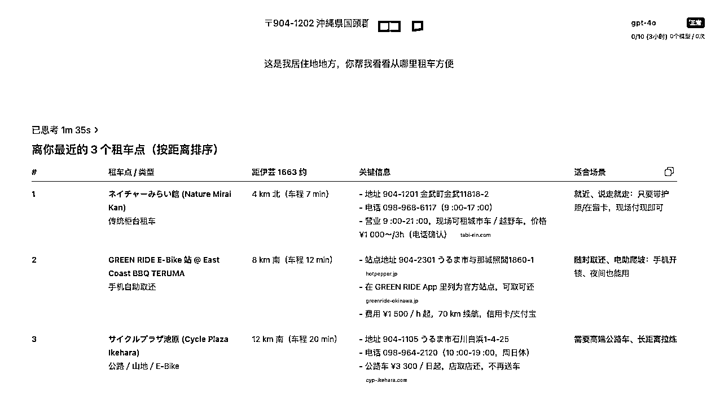
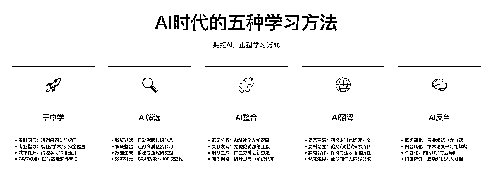
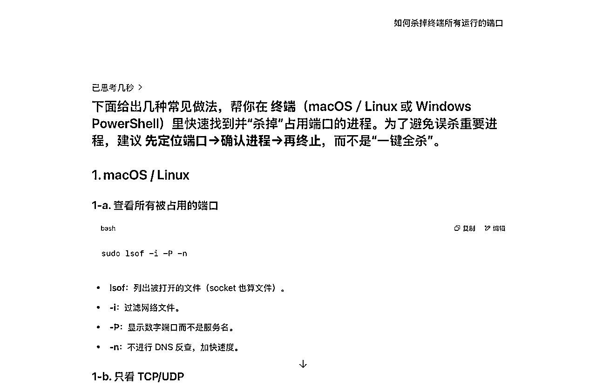
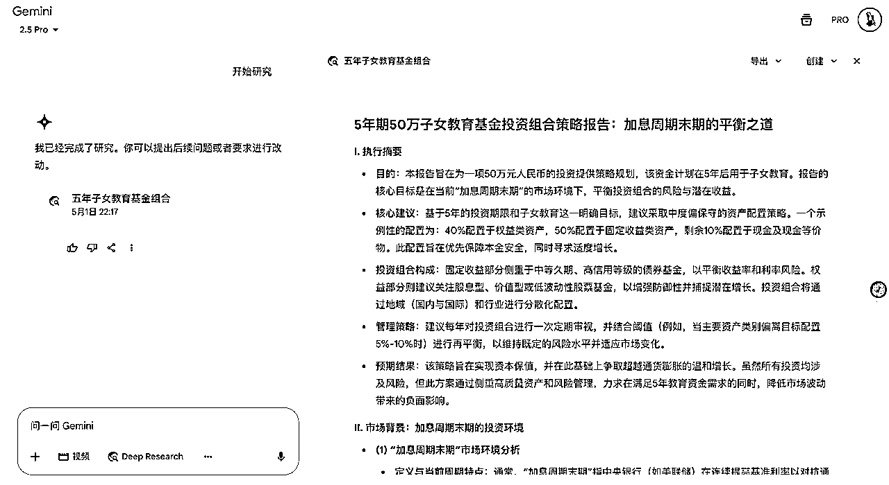
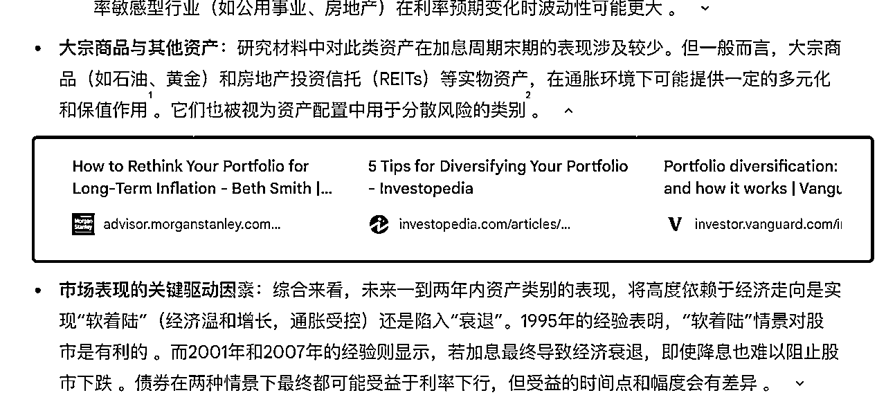
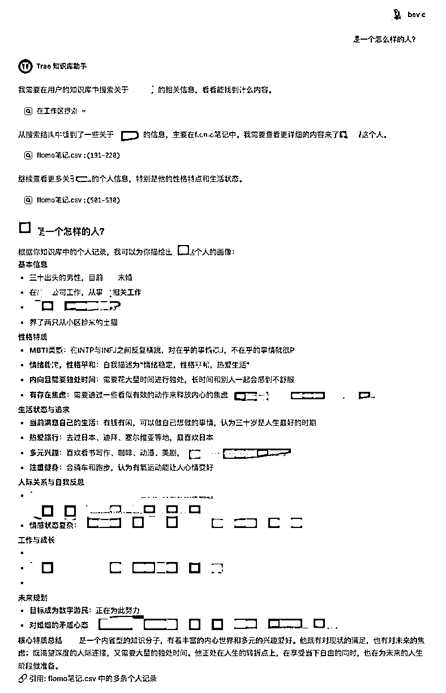
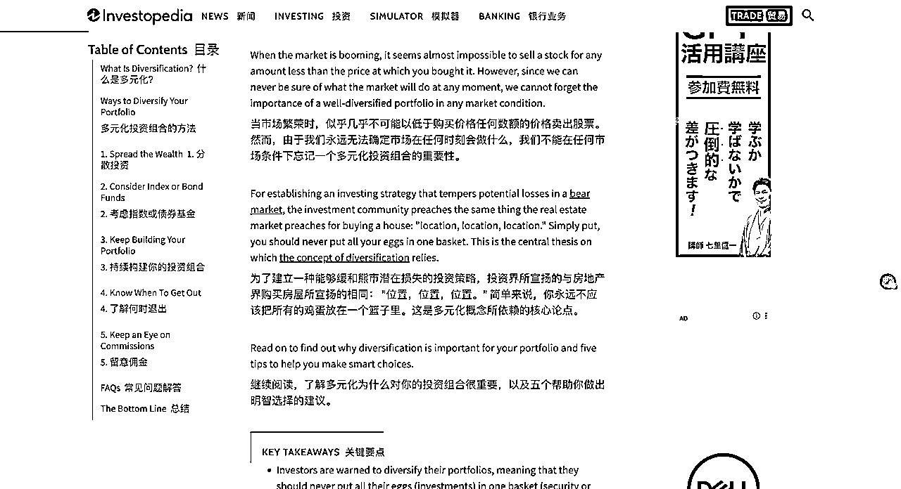
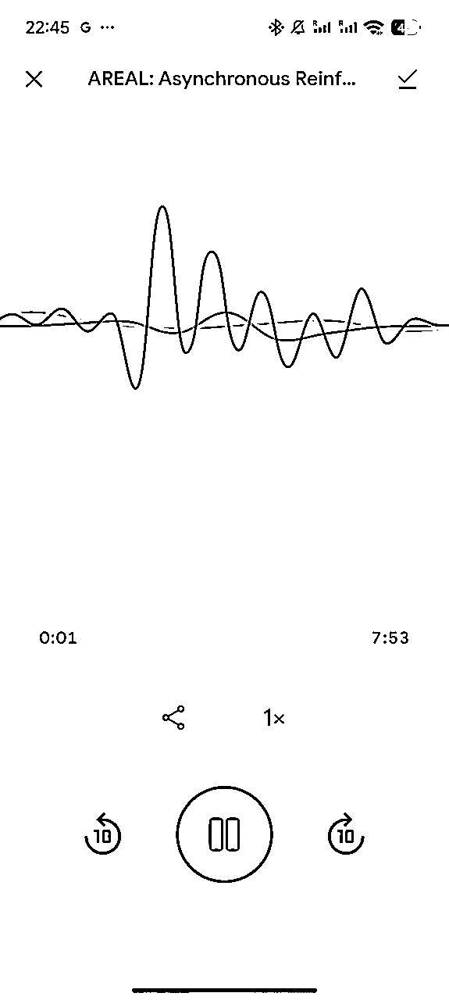

# 【公众号】AI时代，我们要如何学习？

> 来源：[https://k0wy0o3bj59.feishu.cn/docx/YstwdzWehomvF5xYugac2F0XnYe](https://k0wy0o3bj59.feishu.cn/docx/YstwdzWehomvF5xYugac2F0XnYe)

这几天在冲绳旅行，发生了一件让我挺意外的事。

前两天想租自行车环岛骑行，以前遇到这种情况，我肯定是打开小红书搜攻略。但这次不知道怎么回事，我第一反应竟然是问AI。

可能是因为我住在冲绳中北部，小红书上的攻略基本都是南部那霸市那边的，北部租自行车的信息少得可怜。我又不想跑那么远，就想找个离我最近的租车行，小红书显然帮不上忙。

没办法，只能试试AI了。我直接把住址发过去，说：“帮我找个最近的租车点。”结果还真给力，不仅找到了三家附近的租车行，还告诉我怎么去、该怎么选。最后我顺利租到了车，骑行计划完美实现。

下图就是ChatGPT给我的部分答案：

上面这个案例是一个具体问题的解决过程。而我今天主要想讲的是如何同AI来学习，毕竟“学习”本身不就是解决一个又一个的问题嘛！

首先上一个暴论：AI时代，我们的学习模式将被彻底改变了。当然，AI发展到今天，我相信已经没有人会怀疑这个暴论了。

我最近最常用的学习方法就是和ChatGPT对话，让它帮我想解决方法。它最强的模型O3有强大的整合能力，几乎可以回答我的所有问题，基于这段时间我的AI使用经验，分享五个我自己用的比较多的高效学习方法：

关注同名🛰️号，领取专为普通人准备的AI学习资料

* * *

## 实践一：干中学

“干中学”是今年最流行的网络用语，但有丰富学习经验的人都知道，“干中学”虽然是好的学习方法，但是缺点也很明显，就是效率贼低。

经常会遇到无法继续进行下去的困境，因为没有人带我们，遇到问题时很难找到合适的解决方案。即使通过搜索引擎在网上寻找资料，也不一定能找到准确有用的信息。

但是现在有了AI之后，情况就完全不一样了。

上面冲绳租车就是一个非常好的案例，ChatGPT约等于一个高质量的冲绳地陪。

除此之外，再拿我现在学习编程为例：遇到任何问题，我都可以直接向AI提问。无论是“API怎么接入？”、“某个编程语言的语法是什么意思？”，还是“某个产品功能我要怎么实现？”，AI都能给我非常详细的解答。

当然，我这里说的用AI来学也是有方法的。我自己用得最多的是ChatGPT O3/dia浏览器，可以说正是因为有了这两个AI产品，才真正改变了“干中学”这个学习方法。

首先我们来聊一下ChatGPT O3。ChatGPT O3是OpenAI在2024年12月发布的目前最先进的AI推理模型。这个模型的特点是什么呢？就是它几乎能回答我们所有的问题，无论多么复杂。

O3在多项基准测试中表现卓越，特别是在编程和数学领域显著提升。在Arc AGI测试中，O3首次超越人类平均水平，达到了87.5%的准确率，而人类平均水平是85%。

除了ChatGPT，还有一个强大的工具——Dia浏览器。这是全球首个AI原生浏览器，最大的特点就是把AI直接嵌入到浏览器里。我可以直接在地址栏问问题，比如“帮我总结这篇文章”，它就会自动理解网页内容并给出答案。它还能同时分析多个标签页，帮我对比不同产品或整合信息。简单来说，就是把浏览器变成了一个超级智能的助手，各种网页内容处理，数据整理等都可以交给Dia。

## 实践二：AI筛选

在AI出现之前，这个时代就已经是一个信息过载的时代了。互联网上，尤其是中文互联网，垃圾内容特别多。这几年随着AI的发展，降低了内容的生产门槛，垃圾内容情况愈演愈烈。

为了应对这些情况，我们需要更好的方法来筛选出优质的信息。

分享一下，我常用的两种高效的信息筛选方法：

1.  传统方法：通过熟人和靠谱社群

通过熟人或者靠谱的社群去找到高质量的内容，比如：即刻上关注的博主、知识星球上的优质圈子、付费微信群等。

1.  赛博方法：通过AI实现信息筛选

除了传统方法，我们也要学会用魔法来打败魔法——用AI来进行内容的筛选。

现在像ChatGPT、Gemini、Grok等基本上都支持“深度研究”功能。

深度研究可以自主地去整合网上的资料，结合这些资料给到我们非常详细的一份类似于调研报告这样的文案。我自己现在搜索资料、学习的时候就经常会大量使用这个功能。

如果我需要进一步学习了解，我只需要点击AI引用的相关资料链接，就可以找到这些更加一手的资料来源。这比过去我去谷歌或者百度上检索文章，然后一篇一篇地去查找，效率要高很多。

而且AI因为它会自己进行关键词联想，可以发现我们可能忽略的相关信息，从而找到很多过去依靠自己的能力搜索不到的资料。

## 实践三：AI整合

前两年，我读过一本书，叫做《卡片笔记法》。

这本书的作者通过卡片笔记这个方法成为了一名高产的学者。大概逻辑就是他几十年来积累了大量的卡片，然后通过这些卡片之间的串联，产生了非常有意思的洞见，写了一本又一本的书，成为了一个非常优秀的作家。

而在AI时代，卡片笔记法正在变得越来越重要。为什么呢？

过去，我们也会使用卡片笔记的方法，但有了这些卡片之后，需要人工去把它们串联起来。但现在上有了AI之后，AI可以自己帮我们把这些卡片串联起来，发现我们可能忽略的连接和洞察。

举一个很有意思的试验：因为我会在flomo上面写日记，我把自己在flomo上面的笔记都导出来了，然后转成md格式后喂给了AI，结果神奇的事情发生了——AI根据我这几年的日记把我这个人完整地整理了出来，包括我的兴趣爱好、思维模式、价值观等等。

同理，当我们把一些卡片笔记记录下来的时候，AI可以根据我们的这些卡片去找到一些富有洞察的结果。

笔记的重要性比以往任何一个时代都重要。AI没法和世界沟通，没法筛选出真正优质的内容，而我们可以。我们的笔记就是我们与世界交互的记录，是我们独特思考的沉淀。

足够多的优质笔记说不定在未来就可以通过AI自动生成优质的内容。未来，我们可能只需要依靠自己的笔记本身，就可以成为一个优秀的创作者。

## 实践四：AI翻译

AI翻译现在已经被广泛使用了，但是还是值得拿出来单独说。因为这可能是生成式AI最伟大的贡献之一。

在巴别塔的故事中，上帝为了惩罚人类的傲慢，分裂了人类的语言，让人们无法相互理解。这个古老的故事象征着语言作为人类交流最大障碍的现实。

而生成式AI的出现，可以说是“战胜了”上帝设下的这道枷锁，彻底改变了人类的语言游戏规则。人类不再被语言的barrier所限制。

正如维特根斯坦所说：“语言的边界就是世界的边界。”有了AI之后，我们极大地拓宽自己的认知边界。

即使是我这样一个四级都没过的英语菜鸟，也可以借助AI无障碍地阅读外语论文，了解最新的技术动态。

在实际应用中，我最常用的翻译工具是沉浸式翻译。它不仅能够提供准确的翻译，更重要的是能够保持原文的语境和专业术语的准确性，基本上这一个工具就够了。

## 实践五：AI反刍

最后我要分享的一个AI学习方法是，使用AI帮助我们消化分解复杂内容。

比如我在学习过程中，我经常需要看很多专业性很强的学术论文、技术文档。传统的学习方式需要我花费大量时间去理解专业术语和复杂概念。

现在，当我遇到复杂的AI论文时，不再需要为看不懂专业术语而苦恼。我的做法很简单：直接把论文丢给AI，告诉它我是一个没有任何背景的小白，请用大白话帮我整理出来。

之后AI就会给拆解论文内容，这也是我现在学习速度比较快的一个重要原因。

除了直接对话式的学习方法，我还会使用一些专门的工具来提升学习效率。

Google的NotebookLM是我最近发现的一个非常实用的学习工具。只要把论文或者文档上传上去，它就能自动把内容转换成对话的形式。最棒的是，它会用特别容易理解的语言来解释复杂的概念，就像有一个专业的老师在跟你一对一讲解一样。

这种对话式的学习方式，让原本枯燥的学术资料变得生动有趣，大大降低了我的学习的门槛。

* * *

## 总结

回顾这五种AI学习实践，我真切的感受到AI正在从根本上改变人类的学习方式。从实时指导到智能筛选，从自动整理到语言翻译，再到复杂资料的消化——每个环节都在经历变革。

过去需要优质教育资源才能获得的学习支持，现在每个人都能拥有。无论你的英语水平如何，无论你身处何地，AI都能为你提供个性化的学习帮助。

更重要的是，AI不仅改变了我们获取知识的方式，更让我们从信息消费者转变为知识创造者。当AI能帮我们整理笔记、发现洞察时，我们的每一次思考都可能成为创作的素材。

在AI时代，学会学习比学会知识更重要。

让我们拥抱这个充满可能的新时代，用AI的力量拓展我们的认知边界。毕竟，当巴别塔的诅咒被打破，我们每个人都有机会成为自己人生的首席学习官。

最后，如果你喜欢这篇文章，不妨点个赞、收藏一下，或者转发给同样对AI感兴趣的朋友。你的每一次互动，都是我继续创作的动力！

* * *

推荐阅读：

1\. 普通人用AI的八个实践场景（附教程/工具/提示词）

2\. 【干货】手把手教你把Trae改造成你的专属AI写作助手

3\. 【2025年AI入门指南】从DeepSeek到AI智能体，大语言模型原理解析、提示词技巧与实用工具推荐 | 小白必读人工智能科普