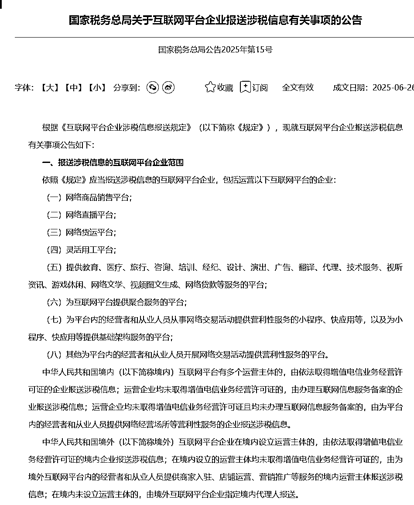
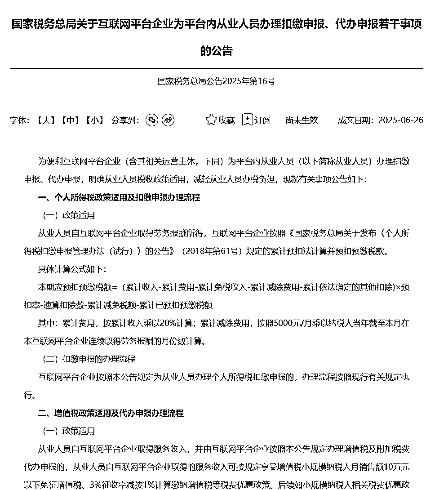

# 新规全面解读+解决方案

> 来源：[https://rcnlkluxe52z.feishu.cn/docx/ZKFvdhvy6oddCCxu0Aac9ELXnYg](https://rcnlkluxe52z.feishu.cn/docx/ZKFvdhvy6oddCCxu0Aac9ELXnYg)

# 前言

7月开始新规落地，这次电商、直播等互联网平台真的是面临合规大考，在生财中估计有很多圈友多少都收到点消息，但是不知道具体跟自己有什么关系，以及对自己有什么影响，大考前该怎么自查，又该做些什么准备？大家好，我是smonkey，财税服务创业者，本着利他原则，也受到上次帖子加精的正面反馈，这次做个全面解读。

想知道财税基础知识、常见问题可查看上篇帖子https://scys.com/articleDetail/xq_topic/5125412184514124。

这次新规，所有通过互联网平台赚取收益的圈友都应该引起重视，不管是跨境电商、国内电商、还是自媒体平台、知识付费平台！（不过快递外卖这种不受影响）

简单说，合规大考，先考的是平台，平台配合做整改，再通过平台提供的数据考商家，谁不配合就处罚谁！首先，所有互联网平台都必须将入驻平台的商家身份信息报送给平台，然后将你所有线上收入数据全部完完整整的报送给税局，个人用户还必须代扣代缴个税！

下面详细做政策解读，产生的相关影响，以及应对政策，如有不同建议或者想法，欢迎讨论沟通，相互学习！

# 一、政策速览

国家税务总局于2025年6月26日推送两条公告，分别为：

《国家税务总局关于互联网平台企业报送涉税信息有关事项的公告》国家税务总局公告2025年第15号

链接：https://fgk.chinatax.gov.cn/zcfgk/c100012/c5241477/content.html

配套的官方解读:https://fgk.chinatax.gov.cn/zcfgk/c100015/c5241480/content.html

《国家税务总局关于互联网平台企业为平台内从业人员办理扣缴申报、代办申报若干事项的公告》国家税务总局公告2025年第16号

链接：https://fgk.chinatax.gov.cn/zcfgk/c100012/c5241472/content.html

配套的官方解读:https://fgk.chinatax.gov.cn/zcfgk/c100015/c5241475/content.html

# 二、谁被管

# 三、对我有什么影响？（电商人、自媒体人、设计服务、知识服务等）

#### 我们入驻平台的身份信息/企业信息将会报送税局

首先互联网平台，特别是大厂，必然会积极配合政策落地，例如淘宝、京东、抖音、小红书、b站、拼多多、temu等，那么你入驻时填写的相关信息就会成为报税的主体。

#### 我们在平台的交易数据会报送给税务局

可以这么说，我们在平台的交易金额、订单数、退款等所有交易数据，税局都一清二楚了，当这个数据有了之后，你申报的增值税的数据如果不一样，S局能不管吗

#### 对于个人入驻平台的，平台会代扣代缴个税

其实之前也一直是要求公司代扣代缴的，只是以前网络数据税局没有，核查又太麻烦，现在政策有了，所有平台肯定会依照规定代扣代缴个税了！

###### 1）个人实名入驻的

影响：

对于个人而言，主要就是个人所得税，个人所得税有两个环节会征收，首先是拿到钱的时候，平台会代扣代缴个税，新规与目前工资申报个税的规则一致，当期应扣 = (累计收入 – 5000×月数 – 专项扣除 – 已预扣) × 税率 – 速算扣除数 – 已预扣，想详细了解可看我上篇帖子；其次就是汇算清缴的时候，会根据你所有渠道全年收入来给你重新算税！

简单说，年收入不高（12万内）其实影响不大，收入高的，例如年收入14万4之后，就是20%以上了，税率就比较高；

还有一点要强调，借用他人名义入驻平台的，或者把身份借给他们入驻的要注意了，平台的收入会影响你来年汇算清缴的税费，小心来年别人找你算账，或者你被别人坑了!

另外明文规定：个人收入累计12个月大于等于500万必须30天内办执照，不过这种不办执照个税都亏大了！

解决方案：

在平台内收入比较低的，可以放心了，税率不高，像劳务报酬以前是超过800就按照20%代扣代缴了，现在可以减除5000的免税金额，到手金额可能比之前更高了！

再平台内收入比较高的，例如月1万7以上了，建议注册公司吧，个人是没办法使用其他发票抵扣成本的，但是公司可以，像你的办公设备、餐饮票（有金额限制）、交通票等都可以抵扣，而且你可以申报人员工资，这个灵活性就很强了，而且监管不严。

###### 2）企业身份入驻的

影响：

*   对于企业身份入驻的，你的店铺交易数据就与企业税号绑定了，你的企业入驻了几个店铺或者几个平台，所有数据税局都一清二楚了。

*   这样你就要自查下了，如果是小规模公司，单季度增值税是30万以内免增值税，就是说你所有互联网平台交易金额累计如果超过了30万，就要根据税点全额缴纳增值税了，开了票的按照票面税额缴纳，没开票的申报未开票收入！

*   以前根据开票情况报税的时代过去了！

*   如果累计12个月销售额超过500万，那要注意了，你会自动变为一般纳税人企业，增值税的计算规则完全就不一样了，需要提前清楚！

特别提醒：网络有销售数据的企业，如果税务还没开通，或者0申报，那得注意了，未来这么做风险极大！

解决方案：

*   可以自行计算下成本，新开公司的成本与销售额超30万缴纳的税费，哪个更高，高多少，好好算个账！

*   店铺有交易数据的且税务没开通的企业赶紧做税务登记吧！

*   成本票记得开，只要跟公司正常经营相关的，都能开进来！

*   如果你的上游能给你开13个点或者其他税率的专票，你的年销售额在120-50万之间，那你也要仔细算个账了，到底是小规模纳税人划算，还是一般纳税人划算！

*   入驻企业、收款信息要使用同一主体，不要私人收款！

###### 3）对于跨境电商temu单独聊下

影响：

目前以及之前temu是允许个人名义开店的，而且这个平台之前也没有帮助卖家代扣代缴个税，作为非大陆主体的公司，以前也没有这个要求，但是这个明文规定了，跨境电商平台是在本次征管范围内的，想temu、亚马逊等其实都有国内的持证主体，这些主体就有权有义务承担本次合规的相关事项了！

随后temu平台应该也会出规定，有可能会关闭大陆个人开店的通道，也可能有其他举措。插一句，跨境平台境外人是不在征管范围内的。

说实话，如果个人开店，temu代扣代缴个税，平台只能按照劳务服务报酬来给你申报个税，那你的销售额越高你将亏的越多，这是一个极高风险的事情！

对于出口交易性质的，增值税其实是全免的，当然你要符合条件，该办理的办理，可以享受即征即免的政策。

建议：

个人名义开店风险太高，建议转公司或者个体户吧，如果销售额高，建议公司！

进项票可能也是一个难题，根据历史经验，这个问题随着时间也会逐步解决的，谁也拗不过法！

进项票、物流票、服务票等等，能开票的一定要开，没有票的证据留好，万一核查，完整的证据链要备好。

# 四、关于落地时间

1.2025‑07‑01 ~ 07‑30，这是给平台的事，平台必须在这个时间内第一次完成备案；

2.2025‑10‑01 ~ 10‑31，这个时候平台要报送入驻商家的信息了，谁，挣了多少钱啊，全部汇总上报，上报的时间是从7月到9月的数据。

3.未来：每个季度结束的次月，平台都需要要数据上报汇总给税局。

4.数据上报后，那接下来就是一波整顿了...

# 五、总结

新规真正落地到电商商家、自媒体人等，其实至少要到10月之后，可能是11月之后，但是如果你不提前准备，做好应对，等数据上报给税局，而你Q3的纳税申报表与平台提供的数据差异很大，那风险就很大了，当税局跳风险了，查的往往不是这个季度了，历史的可能都会把你揪出来！

未雨绸缪很重要，不要让辛辛苦苦挣的钱瞬间清空了，希望我们都不会遇到！不仅会赚钱，更能守住钱!