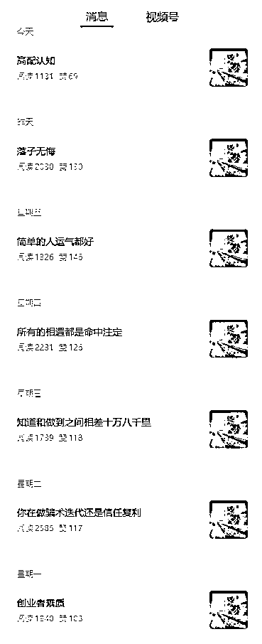
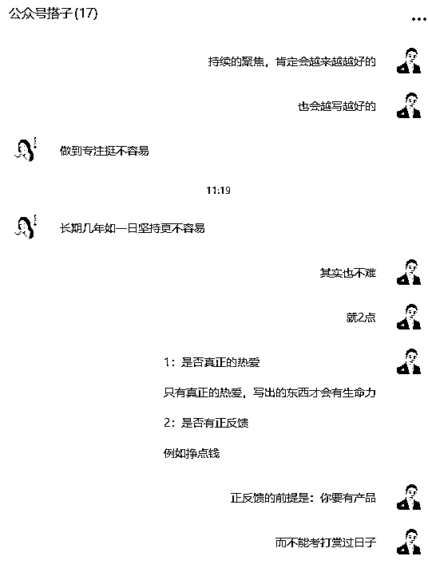
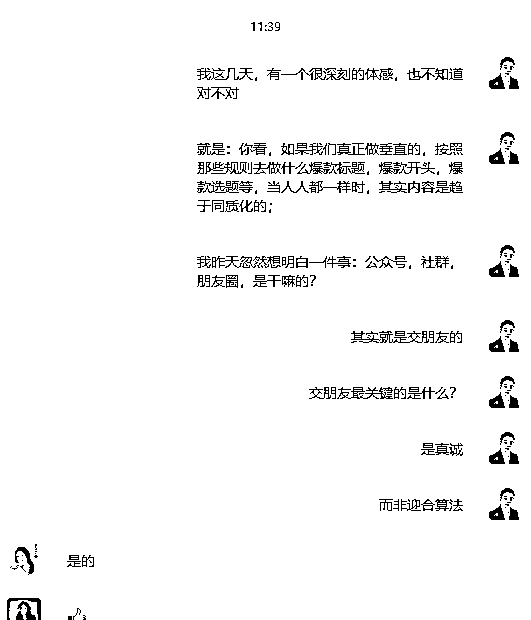

# (46 赞)用文字交朋友，做一辈子的一人公司

> 原文：[`www.yuque.com/for_lazy/zhoubao/ks985azgtgurgpue`](https://www.yuque.com/for_lazy/zhoubao/ks985azgtgurgpue)

## (46 赞)用文字交朋友，做一辈子的一人公司

作者： 东山老师

日期：2025-08-17

#### 我忽然明白：真正的创作，其实并不需要 3 秒钩子

最近一直在研究一人公司如何通过公众号去表达自己，完成：流量，信任和成交的闭环。

但实话实说：按照所有大咖说的所有方法论，刨除一些“玄学、擦边等”内容，我都试过了：

什么爆款选题，爆款标题，黄金首段，首句，中间小标题，结尾，如何排版，甚至更扯淡的用手机端去上传而不是用电脑端上传....

**我发现：其实结果都大差不差......这让我的内心有极大的落差。**

**  **

昨天我带孩子去参加广州的【南国书香节】，在现场听了一些作者的分享，我自己也淘到了一两本好书。

我发现：他们自己和他们的作品，其实都只是“**真诚的在表达** ”，如此而已。

在回来的路上，我忽然问了我自己一句话：“东山，这些天来，你玩命的在追逐“三秒黄金注意力”的算法密码时，你有多久没有静下来写一句发自心底的话了？”

我内心颤抖了一下.....既无言语对！

是的，在满屏的“爆款公式”“流量密码”轰炸中，我们正被卷入一场荒诞的同质化内容竞赛：同样的开头钩子、同样的焦虑选题、同样的情绪刺激。

当所有作者都挤在同一条流水线上，并且借助 AI 去写文章时，看似爆款的内容，其实早已失去灵魂的温度。

然而，作为一个做着，我们难道不应该是通过“作品”去跟陌生人交朋友吗？

当我想通这件事时，我认识到：

**真正的创作从不在喧嚣的表层漂浮，它在寂静的深处扎根。所以，我重新更改了我的公众号名称，从原来的《东山聊 AI 自媒体获客》改为****【东山一人创业笔记】****，我想通过这次的改名，扎扎实实的，认真的去分享我一个人创业的所思所想。**

**  **

**我今天在我们的公众号社群里分享了一些内容，其实就 4 点：**

### 01 流量迷途的十字路口

公众号、朋友圈、社群，它们本是一个个温暖的会客厅，是志趣相投的人们围炉夜话的地方。

不知何时起，这些场所变成了数据厮杀的战场。

我们举着“用户停留时长”“完播率”“阅读量”“涨粉量”的标尺丈量人情温度，在算法的指挥棒下跳着机械的舞蹈。

然而，我早上随意翻阅公众号时，我发现一个作者的内容，才是我真正内心渴望的：

他在持续的日更，所有文章用着同一张蓝色风景配图，阅读量稳定在 1000-2000 次左右，文章的内容很真诚，也不做什么很大噱头的爆款标题，也没有绚丽的排版。

这个反流量逻辑的案例让我恍然：

**当价值的浓度足够厚重，形式的外壳根本不重要，真诚的分享才是通往读者内心唯一桥梁。**

### **02 真诚是交朋友的唯一路径**

其实，我一直觉得，一人公司的创业者，所需要的流量并不需要很多，也不需要很多很多的粉丝。

如果只是一年赚 100 万，其实仅仅需要一千几百个朋友足矣。

做内容与交友何异？

刻意迎合的讨好总是令人不适，坦荡真挚的交谈才能入心。

那些绞尽脑汁设计的套路，远不如朴素的“我手写我心”更有力量。

所以，我在社群聊天时说到：你真正热爱某个领域，那份炽热自会透过文字点燃读者的眼睛，志同道合的朋友，总会找到你。

但是，我还是需要真诚且聪明的做法，但仅有热爱还不够。

持续的创作需要正反馈支撑——不是虚无的点赞数，而是真实的价值交换：**也许是付费产品，也许是深度服务。**

**商业不是真诚的反面，健康的变现恰是对价值的丈量** 。

所以，如果我能够用很有价值的产品和交付换取利润，而非靠打赏或者一丁点的流量主广告费，我需要那么多流量和阅读量吗？

并不需要！

如果我并不需要那么大的流量，我需要为了一点流量挖空心思的钻进算法里去吗？

### **03：把一人公司当成事业去做，一直做到 60 岁，甚至做到死**

当我有这个念头时，我压根就不羡慕那些煽动情绪的爆款烟花。

我不会把“垂直公众号”去当成一个“项目”去做，我没有“项目”的思维，我只想把这个当成一份事业去耕耘。

时间不仅仅是我的朋友，更是我的搭档。。。。

现在的我才刚刚起航，写就是了，我对自己默念：**莫愁前路无知己，终有一天，天下谁人不识君？**

我的一人公司理念，就是打造超有价值的 3 级产品体系，一年就服务 1000 个左右低价客户和 50-100 个高价的客户，实现年赚百万，如此而已。

所以，我压根就需要有那么大的流量和粉丝。

### **04：所以，忘记规则吧，不讨好规则，只讨好朋友**

我不必再为选题抓耳挠腮，不必再为标题绞尽脑汁。

放下一切那些表面的东西，我发现写文章真的很简单：打开电脑，倒一杯清茶，对着空白文档写下此刻的真实思考。就仿佛，电脑里坐着一帮好朋友；

不做刻意的排版，偶尔加粗的字句不是那排版技巧，而是思想重量的天然标记。

在这个追逐即时刺激的时代，选择深耕文字公众号，我相信永远都有饭吃。

因为：很多人已经实现了，我们所需要的，就是足够的聚焦和耐心。

或许，这才是“垂直公众号”最真实的写照！

我写我想的，我分享我悟的，——我**不必照亮整个世界，只需让朋友看见我的真诚，顺便通过我的分享，看清脚下的路。**

**  **

**当喧嚣散场，自会有人循光而来，轻轻叩响我的门。**

* * *

评论区：

超级个体张老板 : 赞同东山老师

学会自律 : [强]

金天 : 有启发。

爱飞的鱼 : 我想要的就是这种！

刘飞 : 活在算法里太累了

东山老师 : 是的

劳模姐|零碳园区 : 赞同，我曾在这条路上反复摇摆，严重割裂，一度变得不愿意写了[不想自己变成“那样的人”。最终发现，确定是愿意选择“只讨好我的读者朋友，而不是算法”，这或许是偶像派和实力派的不同路由]

东山老师 : 加油，我们无需要千百万粉和关注，仅仅只需要 1000 个好朋友就够了